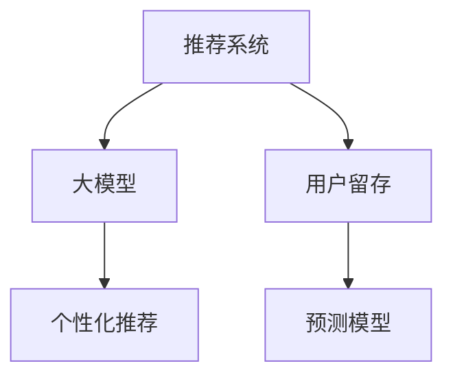

                 

# 大模型对推荐系统长期用户留存的影响

> 关键词：大模型,推荐系统,用户留存,个性化推荐,用户行为分析,预测模型

## 1. 背景介绍

### 1.1 问题由来
随着互联网的快速发展，推荐系统在电商、视频、社交、新闻等领域被广泛应用，极大地提升了用户体验。传统的协同过滤、矩阵分解等推荐算法，已经难以适应复杂多变的数据场景和个性化需求。而基于深度学习的大模型推荐方法，利用海量数据和强大算力，实现了更加高效、精准的推荐服务。

但与此同时，大模型推荐系统在追求推荐精准度的同时，也面临着用户留存率下降的挑战。大模型的复杂性和多样性，使得推荐模型难以完全理解用户真实需求，可能导致用户流失。如何利用大模型构建更为稳定、长期的用户留存模型，成为当前推荐系统研究的关键问题。

### 1.2 问题核心关键点
本文将探讨基于大模型的推荐系统对长期用户留存的影响，分析不同模型架构和优化策略对用户留存率的影响。重点从数据准备、模型训练、参数优化、结果评估等多个环节进行详细讲解，以期为推荐系统开发提供更有价值的参考。

## 2. 核心概念与联系

### 2.1 核心概念概述

为更好地理解大模型推荐系统对用户留存的影响，本节将介绍几个密切相关的核心概念：

- 推荐系统：利用用户和物品之间的交互数据，推荐用户可能感兴趣的新物品的系统。常见的推荐算法包括协同过滤、矩阵分解、深度学习等。

- 大模型：基于深度学习的大规模神经网络模型，如BERT、GPT等。通过在大规模无标签数据上进行预训练，学习到丰富的语义和结构信息。

- 用户留存：指用户在一段时间内持续访问、使用推荐系统的频率。长期用户留存是推荐系统性能的重要指标。

- 个性化推荐：根据用户的历史行为和特征，推荐个性化的物品，提升用户满意度。

- 预测模型：通过历史数据训练得到的，能够对用户行为进行预测的模型。常用的预测模型包括线性回归、决策树、神经网络等。

这些核心概念之间的逻辑关系可以通过以下Mermaid流程图来展示：



这个流程图展示了大模型推荐系统对长期用户留存的影响：

1. 推荐系统通过大模型进行个性化推荐。
2. 预测模型通过历史数据，预测用户留存情况。
3. 用户留存情况直接影响推荐系统的效果。

## 3. 核心算法原理 & 具体操作步骤
### 3.1 算法原理概述

基于大模型的推荐系统，核心思想是通过深度学习模型学习用户和物品之间的潜在语义关系，利用其强大的表达能力，实现更加精准的个性化推荐。大模型的推荐算法一般包括以下几个步骤：

- 收集用户行为数据：通过用户浏览、点击、购买等行为，收集用户与物品的交互数据。
- 数据预处理：对收集到的数据进行清洗、归一化、特征工程等预处理操作。
- 构建大模型：选择合适的预训练语言模型，如BERT、GPT等，进行微调或迁移学习，构建个性化推荐模型。
- 优化模型参数：通过梯度下降等优化算法，最小化推荐模型的预测误差，优化模型参数。
- 预测用户行为：使用训练好的模型对用户输入进行预测，推荐可能感兴趣的物品。

### 3.2 算法步骤详解

基于大模型的推荐系统通常遵循以下步骤：

**Step 1: 数据准备**
- 收集用户行为数据：包括用户对物品的浏览记录、点击记录、购买记录等。
- 数据清洗：去除异常值、缺失值、噪声数据等。
- 特征工程：构造用户特征、物品特征、用户与物品的交互特征等。
- 数据划分：将数据划分为训练集、验证集和测试集。

**Step 2: 模型构建**
- 选择合适的预训练模型，如BERT、GPT等。
- 添加推荐任务适配层：根据推荐任务类型，设计合适的输出层和损失函数。
- 设置微调超参数：选择合适的优化算法及其参数，如Adam、SGD等，设置学习率、批大小、迭代轮数等。

**Step 3: 模型训练**
- 加载训练数据，前向传播计算损失函数。
- 反向传播计算参数梯度，根据设定的优化算法和学习率更新模型参数。
- 周期性在验证集上评估模型性能，根据性能指标决定是否触发Early Stopping。
- 重复上述步骤直到满足预设的迭代轮数或Early Stopping条件。

**Step 4: 结果评估**
- 在测试集上评估推荐模型的性能，计算推荐准确率、召回率等指标。
- 根据测试结果调整模型超参数，进一步优化模型。

**Step 5: 应用部署**
- 使用训练好的模型对新物品进行预测推荐。
- 持续收集用户反馈数据，定期重新微调模型，以适应数据分布的变化。

### 3.3 算法优缺点

基于大模型的推荐系统具有以下优点：
1. 高效灵活。利用大模型的强大表达能力，可以灵活地处理各类复杂的推荐场景，适应多种用户需求。
2. 性能优越。在大规模数据上预训练的大模型，具备强大的语义表示能力，能够提供更高精度的推荐。
3. 可扩展性强。预训练模型可以作为知识库，方便地进行迁移学习，适用于各种推荐任务。

同时，该方法也存在一定的局限性：
1. 数据依赖性强。大模型推荐系统对数据质量和多样性的要求较高，数据收集和预处理复杂。
2. 计算成本高。大模型需要大量的计算资源进行训练和推理，成本较高。
3. 模型复杂度高。大模型推荐系统结构复杂，需要专业的算法和工程知识才能进行高效部署。
4. 可解释性差。深度学习模型通常缺乏可解释性，难以对推荐结果进行逻辑解释。

尽管存在这些局限性，但就目前而言，基于大模型的推荐系统仍是推荐领域的主流范式。未来相关研究的重点在于如何进一步降低计算成本，优化模型结构，提升可解释性，同时兼顾数据质量和用户满意度。

### 3.4 算法应用领域

基于大模型的推荐系统在电商、视频、社交、新闻等多个领域得到了广泛的应用，具体应用场景包括：

- 电商推荐：根据用户的浏览记录、购买历史，推荐可能感兴趣的商品。
- 内容推荐：根据用户的阅读、观看记录，推荐可能喜欢的文章、视频等。
- 广告推荐：根据用户的点击、互动记录，推荐可能感兴趣的广告位。
- 社交推荐：根据用户的互动行为，推荐可能感兴趣的朋友、群体。

除了上述这些经典应用外，大模型推荐系统还被创新性地应用于更多场景中，如个性化广告投放、智能客服、健康医疗、旅游出行等，为用户带来更优质的推荐体验。

## 4. 数学模型和公式 & 详细讲解 & 举例说明
### 4.1 数学模型构建

本节将使用数学语言对大模型推荐系统的核心模型进行详细描述。

记用户特征为 $U=\{x_1,x_2,...,x_n\}$，物品特征为 $I=\{y_1,y_2,...,y_m\}$，用户与物品的交互数据为 $D=\{(u_i,y_j)\}_{i=1}^n$，其中 $u_i$ 为第 $i$ 个用户的特征向量，$y_j$ 为第 $j$ 个物品的特征向量。

假设推荐模型为 $M_{\theta}:\mathbb{R}^d \rightarrow \mathbb{R}^m$，其中 $d$ 为用户特征维度，$m$ 为物品特征维度。模型通过训练数据学习到用户和物品之间的潜在语义关系。

定义推荐模型的损失函数为 $\ell(M_{\theta}(U),Y)$，其中 $Y=\{y_j\}_{j=1}^m$ 为用户对物品的评分，通过用户和物品的交互数据 $D$ 计算得到。推荐模型的训练目标是最小化经验风险：

$$
\mathcal{L}(\theta) = \frac{1}{N}\sum_{i=1}^N \ell(M_{\theta}(U_i),Y_i)
$$

其中 $N$ 为用户数。

通过梯度下降等优化算法，最小化损失函数，优化模型参数 $\theta$，得到推荐模型 $M_{\hat{\theta}}$。

### 4.2 公式推导过程

以协同过滤算法为例，假设用户和物品的评分矩阵为 $R_{ij}$，通过用户和物品的交互数据 $D$ 计算得到。协同过滤的目标是最小化用户和物品之间的误差，假设误差函数为 $l_{ij}(R_{ij},\hat{R}_{ij})$，则协同过滤模型的目标函数为：

$$
\min_{\theta} \frac{1}{N}\sum_{i=1}^N \sum_{j=1}^m l_{ij}(R_{ij},\hat{R}_{ij})
$$

其中 $\hat{R}_{ij}$ 为用户 $i$ 对物品 $j$ 的预测评分。将误差函数和损失函数代入目标函数中，得到协同过滤模型的最小二乘目标函数：

$$
\min_{\theta} \frac{1}{2N}\sum_{i=1}^N \sum_{j=1}^m (R_{ij} - \hat{R}_{ij})^2
$$

通过求解上述最小化问题，可以得到协同过滤模型的最优参数 $\theta^*$。

协同过滤算法的核心思想是通过用户和物品的交互数据，构建用户和物品之间的评分矩阵，通过矩阵分解等方法，预测用户对物品的评分。协同过滤算法通常简单易懂，计算效率高，适合大规模数据集的推荐。但协同过滤算法缺乏对用户和物品特征的建模，难以处理稀疏数据，无法利用语义信息。

### 4.3 案例分析与讲解

**案例1：基于大模型的电商推荐系统**

电商推荐系统主要关注用户的购买记录和浏览行为，通过大模型学习用户和物品之间的潜在语义关系，推荐可能感兴趣的商品。假设电商推荐系统已经收集了用户对物品的浏览和购买记录，构建了电商推荐系统的训练集和测试集。

**Step 1: 数据准备**
- 收集用户和物品的特征数据，如用户ID、商品ID、用户评分等。
- 将数据进行清洗和归一化，去除异常值和噪声数据。
- 对用户和物品进行特征工程，构造用户特征、物品特征等。
- 将数据划分为训练集、验证集和测试集。

**Step 2: 模型构建**
- 选择大模型作为推荐模型的初始化参数，如BERT、GPT等。
- 添加推荐任务适配层：根据电商推荐任务类型，设计合适的输出层和损失函数。
- 设置微调超参数：选择合适的优化算法及其参数，如Adam、SGD等，设置学习率、批大小、迭代轮数等。

**Step 3: 模型训练**
- 加载训练数据，前向传播计算损失函数。
- 反向传播计算参数梯度，根据设定的优化算法和学习率更新模型参数。
- 周期性在验证集上评估模型性能，根据性能指标决定是否触发Early Stopping。
- 重复上述步骤直到满足预设的迭代轮数或Early Stopping条件。

**Step 4: 结果评估**
- 在测试集上评估推荐模型的性能，计算推荐准确率、召回率等指标。
- 根据测试结果调整模型超参数，进一步优化模型。

**Step 5: 应用部署**
- 使用训练好的模型对新物品进行预测推荐。
- 持续收集用户反馈数据，定期重新微调模型，以适应数据分布的变化。

**案例2：基于大模型的内容推荐系统**

内容推荐系统主要关注用户的阅读、观看记录，通过大模型学习用户和内容之间的潜在语义关系，推荐可能感兴趣的文章、视频等。假设内容推荐系统已经收集了用户对内容的阅读和观看记录，构建了内容推荐系统的训练集和测试集。

**Step 1: 数据准备**
- 收集用户和内容的特征数据，如用户ID、内容ID、用户评分等。
- 将数据进行清洗和归一化，去除异常值和噪声数据。
- 对用户和内容进行特征工程，构造用户特征、内容特征等。
- 将数据划分为训练集、验证集和测试集。

**Step 2: 模型构建**
- 选择大模型作为推荐模型的初始化参数，如BERT、GPT等。
- 添加推荐任务适配层：根据内容推荐任务类型，设计合适的输出层和损失函数。
- 设置微调超参数：选择合适的优化算法及其参数，如Adam、SGD等，设置学习率、批大小、迭代轮数等。

**Step 3: 模型训练**
- 加载训练数据，前向传播计算损失函数。
- 反向传播计算参数梯度，根据设定的优化算法和学习率更新模型参数。
- 周期性在验证集上评估模型性能，根据性能指标决定是否触发Early Stopping。
- 重复上述步骤直到满足预设的迭代轮数或Early Stopping条件。

**Step 4: 结果评估**
- 在测试集上评估推荐模型的性能，计算推荐准确率、召回率等指标。
- 根据测试结果调整模型超参数，进一步优化模型。

**Step 5: 应用部署**
- 使用训练好的模型对新内容进行预测推荐。
- 持续收集用户反馈数据，定期重新微调模型，以适应数据分布的变化。

## 5. 项目实践：代码实例和详细解释说明
### 5.1 开发环境搭建

在进行大模型推荐系统开发前，我们需要准备好开发环境。以下是使用Python进行PyTorch开发的环境配置流程：

1. 安装Anaconda：从官网下载并安装Anaconda，用于创建独立的Python环境。

2. 创建并激活虚拟环境：
```bash
conda create -n pytorch-env python=3.8 
conda activate pytorch-env
```

3. 安装PyTorch：根据CUDA版本，从官网获取对应的安装命令。例如：
```bash
conda install pytorch torchvision torchaudio cudatoolkit=11.1 -c pytorch -c conda-forge
```

4. 安装Transformers库：
```bash
pip install transformers
```

5. 安装各类工具包：
```bash
pip install numpy pandas scikit-learn matplotlib tqdm jupyter notebook ipython
```

完成上述步骤后，即可在`pytorch-env`环境中开始推荐系统开发。

### 5.2 源代码详细实现

这里我们以电商推荐系统为例，给出使用Transformers库对BERT模型进行微调的PyTorch代码实现。

首先，定义电商推荐任务的数据处理函数：

```python
from transformers import BertTokenizer
from torch.utils.data import Dataset
import torch

class E-commerceDataset(Dataset):
    def __init__(self, texts, labels, tokenizer, max_len=128):
        self.texts = texts
        self.labels = labels
        self.tokenizer = tokenizer
        self.max_len = max_len
        
    def __len__(self):
        return len(self.texts)
    
    def __getitem__(self, item):
        text = self.texts[item]
        label = self.labels[item]
        
        encoding = self.tokenizer(text, return_tensors='pt', max_length=self.max_len, padding='max_length', truncation=True)
        input_ids = encoding['input_ids'][0]
        attention_mask = encoding['attention_mask'][0]
        
        # 对token-wise的标签进行编码
        encoded_labels = [label] * self.max_len
        labels = torch.tensor(encoded_labels, dtype=torch.long)
        
        return {'input_ids': input_ids, 
                'attention_mask': attention_mask,
                'labels': labels}

# 标签与id的映射
label2id = {'buy': 1, 'not_buy': 0}
id2label = {v: k for k, v in label2id.items()}

# 创建dataset
tokenizer = BertTokenizer.from_pretrained('bert-base-cased')

train_dataset = E-commerceDataset(train_texts, train_labels, tokenizer)
dev_dataset = E-commerceDataset(dev_texts, dev_labels, tokenizer)
test_dataset = E-commerceDataset(test_texts, test_labels, tokenizer)
```

然后，定义模型和优化器：

```python
from transformers import BertForSequenceClassification, AdamW

model = BertForSequenceClassification.from_pretrained('bert-base-cased', num_labels=len(label2id))

optimizer = AdamW(model.parameters(), lr=2e-5)
```

接着，定义训练和评估函数：

```python
from torch.utils.data import DataLoader
from tqdm import tqdm
from sklearn.metrics import classification_report

device = torch.device('cuda') if torch.cuda.is_available() else torch.device('cpu')
model.to(device)

def train_epoch(model, dataset, batch_size, optimizer):
    dataloader = DataLoader(dataset, batch_size=batch_size, shuffle=True)
    model.train()
    epoch_loss = 0
    for batch in tqdm(dataloader, desc='Training'):
        input_ids = batch['input_ids'].to(device)
        attention_mask = batch['attention_mask'].to(device)
        labels = batch['labels'].to(device)
        model.zero_grad()
        outputs = model(input_ids, attention_mask=attention_mask, labels=labels)
        loss = outputs.loss
        epoch_loss += loss.item()
        loss.backward()
        optimizer.step()
    return epoch_loss / len(dataloader)

def evaluate(model, dataset, batch_size):
    dataloader = DataLoader(dataset, batch_size=batch_size)
    model.eval()
    preds, labels = [], []
    with torch.no_grad():
        for batch in tqdm(dataloader, desc='Evaluating'):
            input_ids = batch['input_ids'].to(device)
            attention_mask = batch['attention_mask'].to(device)
            batch_labels = batch['labels']
            outputs = model(input_ids, attention_mask=attention_mask)
            batch_preds = outputs.logits.argmax(dim=2).to('cpu').tolist()
            batch_labels = batch_labels.to('cpu').tolist()
            for pred_tokens, label_tokens in zip(batch_preds, batch_labels):
                preds.append(pred_tokens)
                labels.append(label_tokens)
                
    print(classification_report(labels, preds))
```

最后，启动训练流程并在测试集上评估：

```python
epochs = 5
batch_size = 16

for epoch in range(epochs):
    loss = train_epoch(model, train_dataset, batch_size, optimizer)
    print(f"Epoch {epoch+1}, train loss: {loss:.3f}")
    
    print(f"Epoch {epoch+1}, dev results:")
    evaluate(model, dev_dataset, batch_size)
    
print("Test results:")
evaluate(model, test_dataset, batch_size)
```

以上就是使用PyTorch对BERT进行电商推荐任务微调的完整代码实现。可以看到，得益于Transformers库的强大封装，我们可以用相对简洁的代码完成BERT模型的加载和微调。

### 5.3 代码解读与分析

让我们再详细解读一下关键代码的实现细节：

**E-commerceDataset类**：
- `__init__`方法：初始化文本、标签、分词器等关键组件。
- `__len__`方法：返回数据集的样本数量。
- `__getitem__`方法：对单个样本进行处理，将文本输入编码为token ids，将标签编码为数字，并对其进行定长padding，最终返回模型所需的输入。

**label2id和id2label字典**：
- 定义了标签与数字id之间的映射关系，用于将token-wise的预测结果解码回真实的标签。

**训练和评估函数**：
- 使用PyTorch的DataLoader对数据集进行批次化加载，供模型训练和推理使用。
- 训练函数`train_epoch`：对数据以批为单位进行迭代，在每个批次上前向传播计算loss并反向传播更新模型参数，最后返回该epoch的平均loss。
- 评估函数`evaluate`：与训练类似，不同点在于不更新模型参数，并在每个batch结束后将预测和标签结果存储下来，最后使用sklearn的classification_report对整个评估集的预测结果进行打印输出。

**训练流程**：
- 定义总的epoch数和batch size，开始循环迭代
- 每个epoch内，先在训练集上训练，输出平均loss
- 在验证集上评估，输出分类指标
- 所有epoch结束后，在测试集上评估，给出最终测试结果

可以看到，PyTorch配合Transformers库使得BERT微调的代码实现变得简洁高效。开发者可以将更多精力放在数据处理、模型改进等高层逻辑上，而不必过多关注底层的实现细节。

当然，工业级的系统实现还需考虑更多因素，如模型的保存和部署、超参数的自动搜索、更灵活的任务适配层等。但核心的微调范式基本与此类似。

## 6. 实际应用场景
### 6.1 智能客服系统

基于大模型推荐系统的智能客服系统，能够通过推荐模型预测用户意图，自动匹配最佳回答。智能客服系统能够24小时不间断服务，快速响应客户咨询，用自然流畅的语言解答各类常见问题。

在技术实现上，可以收集企业内部的历史客服对话记录，将问题和最佳答复构建成监督数据，在此基础上对预训练对话模型进行微调。微调后的对话模型能够自动理解用户意图，匹配最合适的答案模板进行回复。对于客户提出的新问题，还可以接入检索系统实时搜索相关内容，动态组织生成回答。如此构建的智能客服系统，能大幅提升客户咨询体验和问题解决效率。

### 6.2 金融舆情监测

金融机构需要实时监测市场舆论动向，以便及时应对负面信息传播，规避金融风险。传统的人工监测方式成本高、效率低，难以应对网络时代海量信息爆发的挑战。基于大模型推荐系统的文本分类和情感分析技术，为金融舆情监测提供了新的解决方案。

具体而言，可以收集金融领域相关的新闻、报道、评论等文本数据，并对其进行主题标注和情感标注。在此基础上对预训练语言模型进行微调，使其能够自动判断文本属于何种主题，情感倾向是正面、中性还是负面。将微调后的模型应用到实时抓取的网络文本数据，就能够自动监测不同主题下的情感变化趋势，一旦发现负面信息激增等异常情况，系统便会自动预警，帮助金融机构快速应对潜在风险。

### 6.3 个性化推荐系统

当前的推荐系统往往只依赖用户的历史行为数据进行物品推荐，无法深入理解用户的真实兴趣偏好。基于大模型推荐系统的个性化推荐系统，可以更好地挖掘用户行为背后的语义信息，从而提供更精准、多样的推荐内容。

在实践中，可以收集用户浏览、点击、评论、分享等行为数据，提取和用户交互的物品标题、描述、标签等文本内容。将文本内容作为模型输入，用户的后续行为（如是否点击、购买等）作为监督信号，在此基础上微调预训练语言模型。微调后的模型能够从文本内容中准确把握用户的兴趣点。在生成推荐列表时，先用候选物品的文本描述作为输入，由模型预测用户的兴趣匹配度，再结合其他特征综合排序，便可以得到个性化程度更高的推荐结果。

### 6.4 未来应用展望

随着大模型推荐系统和大数据技术的发展，推荐系统在电商、视频、社交、新闻等多个领域得到了广泛应用，为用户带来了更优质的推荐体验。未来，大模型推荐系统有望进一步提升推荐精准度和用户满意度，成为推荐系统的主流范式。

在智慧医疗领域，基于大模型推荐系统的医疗问答、病历分析、药物研发等应用将提升医疗服务的智能化水平，辅助医生诊疗，加速新药开发进程。

在智能教育领域，微调技术可应用于作业批改、学情分析、知识推荐等方面，因材施教，促进教育公平，提高教学质量。

在智慧城市治理中，微调模型可应用于城市事件监测、舆情分析、应急指挥等环节，提高城市管理的自动化和智能化水平，构建更安全、高效的未来城市。

此外，在企业生产、社会治理、文娱传媒等众多领域，基于大模型推荐系统的人工智能应用也将不断涌现，为传统行业数字化转型升级提供新的技术路径。相信随着技术的日益成熟，大模型推荐系统必将在构建人机协同的智能时代中扮演越来越重要的角色。

## 7. 工具和资源推荐
### 7.1 学习资源推荐

为了帮助开发者系统掌握大模型推荐系统的理论基础和实践技巧，这里推荐一些优质的学习资源：

1. 《推荐系统实战》系列博文：由大模型技术专家撰写，深入浅出地介绍了推荐系统的发展历史、核心算法和前沿技术，适合入门学习。

2. 《推荐系统与大数据》课程：中国人民大学开设的MOOC课程，涵盖推荐系统原理和实践，适合进阶学习。

3. 《Deep Learning for Recommendation Systems》书籍：推荐系统领域的权威教材，系统介绍了推荐系统的算法和应用，适合全面学习。

4. Kaggle推荐系统竞赛：Kaggle上的多个推荐系统竞赛，可以帮助开发者实践推荐系统算法，提升算法实现能力。

5. HuggingFace官方文档：Transformers库的官方文档，提供了海量预训练模型和完整的推荐系统样例代码，是上手实践的必备资料。

通过对这些资源的学习实践，相信你一定能够快速掌握大模型推荐系统的精髓，并用于解决实际的推荐问题。
###  7.2 开发工具推荐

高效的开发离不开优秀的工具支持。以下是几款用于大模型推荐系统开发的常用工具：

1. PyTorch：基于Python的开源深度学习框架，灵活动态的计算图，适合快速迭代研究。大部分预训练语言模型都有PyTorch版本的实现。

2. TensorFlow：由Google主导开发的开源深度学习框架，生产部署方便，适合大规模工程应用。同样有丰富的预训练语言模型资源。

3. Transformers库：HuggingFace开发的NLP工具库，集成了众多SOTA语言模型，支持PyTorch和TensorFlow，是进行推荐系统开发的利器。

4. Weights & Biases：模型训练的实验跟踪工具，可以记录和可视化模型训练过程中的各项指标，方便对比和调优。与主流深度学习框架无缝集成。

5. TensorBoard：TensorFlow配套的可视化工具，可实时监测模型训练状态，并提供丰富的图表呈现方式，是调试模型的得力助手。

6. Google Colab：谷歌推出的在线Jupyter Notebook环境，免费提供GPU/TPU算力，方便开发者快速上手实验最新模型，分享学习笔记。

合理利用这些工具，可以显著提升大模型推荐系统的开发效率，加快创新迭代的步伐。

### 7.3 相关论文推荐

大模型推荐系统和大数据技术的发展源于学界的持续研究。以下是几篇奠基性的相关论文，推荐阅读：

1. Deep Collaborative Filtering（即协同过滤原论文）：提出了协同过滤算法，通过用户和物品的评分矩阵进行推荐。

2. Multi-Task Learning for Recommendation Systems（即MTL算法）：提出多任务学习算法，同时优化多个推荐任务，提升推荐效果。

3. Attention Mechanism in Recommendation Systems（即注意力机制）：引入注意力机制，提高推荐模型的表达能力和泛化能力。

4. Neural Recommendation Algorithms for Amazon Product Recommendation（即NRA算法）：提出神经网络推荐算法，通过深度学习模型进行推荐。

5. Generative Adversarial Networks for Recommendation Systems（即GAN算法）：引入生成对抗网络，生成新的物品，提高推荐效果。

这些论文代表了大模型推荐系统和大数据技术的发展脉络。通过学习这些前沿成果，可以帮助研究者把握学科前进方向，激发更多的创新灵感。

## 8. 总结：未来发展趋势与挑战
### 8.1 总结

本文对基于大模型的推荐系统对长期用户留存的影响进行了全面系统的介绍。首先阐述了大模型推荐系统在电商、视频、社交、新闻等多个领域的应用，明确了推荐系统对用户留存的重要作用。其次，从数据准备、模型构建、参数优化、结果评估等多个环节，详细讲解了基于大模型的推荐系统的核心算法和具体操作步骤。

通过本文的系统梳理，可以看到，基于大模型的推荐系统通过深度学习模型学习用户和物品之间的潜在语义关系，能够提供更为精准的个性化推荐，提升用户满意度和留存率。未来，随着大模型推荐系统和大数据技术的不断发展，推荐系统必将在更多领域得到应用，为用户带来更优质的推荐体验。

### 8.2 未来发展趋势

展望未来，大模型推荐系统的发展趋势将呈现以下几个方向：

1. 个性化推荐模型更精细。未来的推荐模型将结合更多用户行为数据、时间戳、上下文信息等，构建更为精细化的推荐模型。

2. 跨模态推荐技术崛起。未来的推荐系统将结合视觉、语音、位置等多模态数据，实现更加全面、准确的推荐。

3. 强化学习应用于推荐。通过强化学习算法，推荐系统将能够学习动态调整推荐策略，最大化用户满意度。

4. 推荐系统的可解释性增强。推荐系统的决策过程将更加透明，用户能够理解推荐模型的推荐逻辑，增强系统的可解释性和信任度。

5. 推荐系统的安全性提高。推荐系统将建立严格的数据隐私保护机制，避免用户隐私泄露和模型偏见，保障用户权益。

6. 推荐系统的公平性保障。推荐系统将引入公平性评估指标，消除模型偏见，提升推荐系统的社会效益。

以上趋势凸显了大模型推荐系统的广阔前景。这些方向的探索发展，必将进一步提升推荐系统的性能和应用范围，为构建人机协同的智能时代提供更多可能性。

### 8.3 面临的挑战

尽管大模型推荐系统已经取得了瞩目成就，但在迈向更加智能化、普适化应用的过程中，它仍面临着诸多挑战：

1. 计算成本高昂。大模型推荐系统对计算资源和存储空间的需求较高，训练和推理成本较高。如何降低计算成本，优化模型结构，提高推理效率，仍需持续探索。

2. 数据质量要求高。大模型推荐系统对数据质量和多样性的要求较高，数据收集和预处理复杂。如何获取高质量、多样化的数据，保证数据质量，仍然是一个难题。

3. 模型复杂度高。大模型推荐系统结构复杂，难以解释推荐结果的生成过程。如何提高推荐系统的可解释性，增强用户的信任和满意度，是一个亟待解决的问题。

4. 系统鲁棒性不足。大模型推荐系统在面对数据分布变化时，容易产生过拟合和泛化能力不足的问题。如何构建鲁棒性更强的推荐模型，提升模型泛化性能，仍需进一步研究。

5. 隐私保护压力大。推荐系统需要处理大量用户数据，如何保护用户隐私，避免数据泄露，是一个重要的伦理问题。

6. 社会效益评估难。推荐系统需要平衡经济效益和社会效益，如何评估推荐系统的社会影响，避免负面影响，也是一个难题。

尽管存在这些挑战，但未来大模型推荐系统仍将具有广阔的发展前景。解决这些挑战，需要学界和产业界的共同努力，不断提升推荐系统的性能和可靠性，推动其进一步落地应用。

### 8.4 研究展望

面对大模型推荐系统面临的种种挑战，未来的研究需要在以下几个方面寻求新的突破：

1. 探索轻量级推荐模型。开发更为轻量级的推荐模型，降低计算成本，提高推理速度，适合低计算资源场景。

2. 研究跨模态推荐技术。结合视觉、语音、位置等多模态数据，提升推荐系统的全面性和准确性。

3. 引入深度强化学习。通过强化学习算法，动态调整推荐策略，提升推荐效果。

4. 构建可解释性推荐模型。引入符号化的先验知识，结合因果推理等方法，提高推荐系统的可解释性。

5. 引入公平性评估指标。引入公平性评估指标，消除模型偏见，提升推荐系统的社会效益。

6. 引入隐私保护机制。引入隐私保护机制，确保用户数据的安全，保障用户隐私权益。

这些研究方向的探索，必将引领大模型推荐系统走向更高的台阶，为构建安全、可靠、可解释、可控的智能推荐系统铺平道路。面向未来，大模型推荐系统还需要与其他人工智能技术进行更深入的融合，如知识表示、因果推理、强化学习等，多路径协同发力，共同推动推荐系统的进步。只有勇于创新、敢于突破，才能不断拓展推荐系统的边界，让智能技术更好地造福人类社会。

## 9. 附录：常见问题与解答

**Q1：大模型推荐系统是否适用于所有推荐场景？**

A: 大模型推荐系统在大多数推荐场景中都能取得不错的效果，特别是在数据量较大的场景中。但对于一些特定领域或小数据量的场景，传统推荐算法可能更为适用。此外，对于需要实时性、高效性强的场景，也需要结合具体需求选择合适的推荐方法。

**Q2：大模型推荐系统的计算成本高昂，如何解决？**

A: 解决大模型推荐系统的计算成本，需要从多个维度进行优化：
1. 模型裁剪：去除不必要的层和参数，减小模型尺寸，加快推理速度。
2. 量化加速：将浮点模型转为定点模型，压缩存储空间，提高计算效率。
3. 模型并行：通过分布式计算和模型并行，提高模型的计算效率。

**Q3：大模型推荐系统如何提高可解释性？**

A: 提高大模型推荐系统的可解释性，可以从以下几个方面进行：
1. 引入符号化的先验知识，如知识图谱、逻辑规则等，引导微调过程学习更准确、合理的语言模型。
2. 结合因果分析方法，识别出模型决策的关键特征，增强输出解释的因果性和逻辑性。
3. 借助博弈论工具，刻画人机交互过程，主动探索并规避模型的脆弱点，提高系统稳定性。

**Q4：大模型推荐系统如何降低对标注数据的依赖？**

A: 降低大模型推荐系统对标注数据的依赖，可以通过以下几种方法：
1. 采用无监督或半监督学习，利用非结构化数据进行推荐。
2. 引入主动学习技术，自动选择更有价值的数据进行标注。
3. 使用迁移学习技术，利用已有知识提升推荐模型效果。

这些方法能够在一定程度上减少对标注数据的依赖，提升推荐系统的灵活性和泛化能力。

**Q5：大模型推荐系统如何提高推荐效果？**

A: 提高大模型推荐系统的推荐效果，可以从以下几个方面进行：
1. 使用多任务学习，同时优化多个推荐任务，提升推荐模型的泛化能力。
2. 引入注意力机制，提高推荐模型的表达能力和特征选择能力。
3. 结合强化学习算法，动态调整推荐策略，最大化用户满意度。
4. 引入跨模态信息，提升推荐系统的全面性和准确性。

这些方法能够在一定程度上提升大模型推荐系统的推荐效果，为用户带来更好的推荐体验。

---

作者：禅与计算机程序设计艺术 / Zen and the Art of Computer Programming

