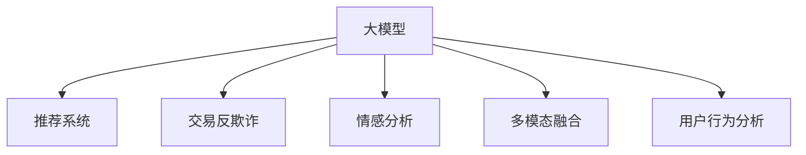

                 

# 大模型技术在电商平台中的实践与挑战

> 关键词：电商平台,大模型,自然语言处理,NLP,推荐系统,交易反欺诈,客户行为分析

## 1. 背景介绍

### 1.1 问题由来

随着互联网和移动设备的普及，电商平台已逐渐成为人们日常购物的重要途径。电商平台的数据规模庞大，涉及用户行为、商品信息、交易记录等多个维度，需要进行全面的分析和挖掘。大模型技术，特别是基于深度学习和自然语言处理(NLP)的预训练模型，在电商平台中展现出广泛的应用前景。

然而，如何将大模型技术有效地应用于电商平台，提高推荐的个性化和精准度，降低交易欺诈风险，同时确保系统的高效运行，是当前电商平台面临的重要挑战。本文将系统介绍大模型在电商平台中的实践与挑战，希望能为电商平台开发者和研究人员提供有价值的参考。

### 1.2 问题核心关键点

大模型技术在电商平台中的应用主要包括以下几个方面：

1. **个性化推荐**：通过分析用户的浏览、购买历史和行为模式，为用户提供个性化的商品推荐，提升用户体验和转化率。
2. **交易反欺诈**：利用大模型对交易数据进行模式识别和异常检测，及时发现和防范交易欺诈行为，保护用户和商家的利益。
3. **客户行为分析**：通过对用户评论、反馈、聊天记录等文本数据进行情感分析、意图识别，深入理解用户需求和心理，优化服务和营销策略。
4. **跨模态融合**：结合图像、视频、语音等多种模态数据，提升平台对商品、用户的多维度理解，丰富推荐和分析内容。

## 2. 核心概念与联系

### 2.1 核心概念概述

为更好地理解大模型在电商平台中的应用，本节将介绍几个密切相关的核心概念：

- **大模型**：以深度学习为基础的大规模预训练模型，如BERT、GPT-3等。通过在大规模无标签数据上进行预训练，学习到丰富的语言和数据表示，适用于各种NLP任务。

- **推荐系统**：根据用户的历史行为和实时数据，动态生成个性化的商品推荐列表，提升用户满意度和转化率。

- **交易反欺诈**：通过模型识别和预测交易中的异常行为，及时发现并阻止欺诈交易，保护平台和用户利益。

- **情感分析**：对用户评论、反馈等文本数据进行情感极性判断，了解用户对商品和服务的满意度，指导商家改进商品和服务。

- **多模态融合**：结合文本、图像、视频等多种数据类型，提升模型对现实世界的理解和建模能力。

这些核心概念之间的逻辑关系可以通过以下Mermaid流程图来展示：



这个流程图展示了大模型在电商平台中的应用场景：

1. 大模型作为预训练知识库，为推荐系统、交易反欺诈、情感分析等任务提供基础能力。
2. 推荐系统利用大模型的语义理解能力，为用户提供个性化推荐。
3. 交易反欺诈利用大模型的模式识别能力，发现并阻止欺诈行为。
4. 情感分析通过大模型进行情感极性判断，优化商品和服务。
5. 多模态融合结合大模型的跨模态能力，提升对商品和用户的全方位理解。

## 3. 核心算法原理 & 具体操作步骤

### 3.1 算法原理概述

大模型在电商平台中的应用，核心在于如何利用预训练模型进行高效的微调（Fine-tuning），从而适应特定的电商任务。以下是几种典型的电商任务及其微调原理：

- **个性化推荐**：利用大模型学习用户和商品的语义表示，通过余弦相似度等方法计算用户和商品之间的相似度，生成推荐列表。
- **交易反欺诈**：将交易数据编码为向量，利用大模型学习交易的正常模式，通过异常检测方法识别出异常交易。
- **情感分析**：将用户评论和反馈转换为向量，利用大模型学习情感表达，进行情感分类。
- **用户行为分析**：将用户行为数据（如浏览记录、购买历史等）转换为向量，利用大模型学习用户行为模式，进行用户分群和行为预测。

这些微调过程本质上都是监督学习过程，通过有标签数据训练模型，以获得特定的输出结果。

### 3.2 算法步骤详解

以个性化推荐为例，详细讲解基于大模型的推荐系统微调过程：

1. **数据准备**：收集用户的历史浏览记录、购买历史、评分数据等，构建推荐训练数据集。
2. **模型选择**：选择适合电商任务的预训练模型，如使用BERT模型进行推荐。
3. **任务适配**：在预训练模型的基础上添加任务特定的输出层和损失函数，如使用线性分类器输出推荐列表的排序得分。
4. **微调训练**：使用推荐训练数据集对模型进行微调，最小化损失函数，优化推荐排序。
5. **模型评估**：在测试集上评估微调后模型的推荐效果，如使用精确率、召回率、F1值等指标。
6. **推荐生成**：使用微调后的模型对实时数据进行推荐生成，优化用户体验。

### 3.3 算法优缺点

基于大模型的电商应用具有以下优点：

- **精度高**：大模型在预训练阶段已经学习到丰富的语言和数据表示，能够更好地理解用户需求和商品特征。
- **适应性强**：可以通过微调快速适应不同的电商任务，提升推荐和分析的灵活性和精度。
- **效果好**：在大数据和高质量标注数据的支持下，模型能够取得显著的性能提升。

同时，这些应用也存在一些局限性：

- **资源消耗大**：大模型通常参数量大，需要大量的算力和存储空间。
- **训练成本高**：需要高质量的标注数据和高效的训练算法，训练过程耗时较长。
- **维护复杂**：大模型参数众多，需要持续的维护和优化，以保证系统的高效运行。
- **解释性差**：大模型通常视为“黑盒”，难以解释其内部决策逻辑，影响信任和可控性。

### 3.4 算法应用领域

基于大模型的电商应用广泛涉及以下几个领域：

- **个性化推荐**：应用于电商网站、手机应用、直播平台等，提升商品推荐精度和用户体验。
- **交易反欺诈**：应用于电商交易平台、金融交易平台等，防范和检测交易欺诈行为。
- **客户行为分析**：应用于电商平台、社交媒体、在线教育等，了解客户需求和行为，优化服务和营销策略。
- **情感分析**：应用于电商评论、用户反馈、社交媒体等，分析用户情感，指导商家改进产品和服务。
- **多模态融合**：应用于电商平台、智能家居、智能客服等，结合多种数据类型，提升对商品和用户的全方位理解。

## 4. 数学模型和公式 & 详细讲解

### 4.1 数学模型构建

以个性化推荐为例，数学模型构建如下：

设预训练模型为 $M_{\theta}$，输入为 $x$，输出为 $y$。推荐任务为 $T$，推荐训练集为 $D=\{(x_i,y_i)\}_{i=1}^N$，其中 $x_i$ 为用户的浏览历史， $y_i$ 为推荐商品列表。微调目标为最小化推荐损失函数 $\mathcal{L}$：

$$
\mathcal{L} = \frac{1}{N} \sum_{i=1}^N \ell(y_i, M_{\theta}(x_i))
$$

其中 $\ell$ 为推荐排序损失函数，如均方误差损失或交叉熵损失。

### 4.2 公式推导过程

以均方误差损失为例，推荐排序损失函数 $\ell$ 推导如下：

设用户浏览历史为 $x_i$，推荐商品列表为 $y_i$，推荐排序为 $r_i$。推荐损失函数为：

$$
\ell(y_i, M_{\theta}(x_i)) = \frac{1}{2}(y_i - M_{\theta}(x_i))^2
$$

将推荐排序 $r_i$ 引入，推荐损失函数转化为：

$$
\ell(y_i, M_{\theta}(x_i)) = \frac{1}{2}(y_i - M_{\theta}(x_i))^2
$$

最小化推荐损失函数，即：

$$
\hat{\theta} = \mathop{\arg\min}_{\theta} \mathcal{L}
$$

其中 $\hat{\theta}$ 为微调后模型的参数。

### 4.3 案例分析与讲解

以电商平台交易反欺诈为例，微调模型的输入为交易数据，输出为欺诈概率。数学模型构建如下：

设交易数据为 $x_i$，欺诈概率为 $y_i$，欺诈损失函数为：

$$
\ell(y_i, M_{\theta}(x_i)) = -y_i\log M_{\theta}(x_i) - (1-y_i)\log(1-M_{\theta}(x_i))
$$

微调目标为最小化欺诈损失函数 $\mathcal{L}$：

$$
\mathcal{L} = \frac{1}{N} \sum_{i=1}^N \ell(y_i, M_{\theta}(x_i))
$$

其中 $x_i$ 为交易数据， $y_i$ 为欺诈标记（0/1）。

## 5. 项目实践：代码实例和详细解释说明

### 5.1 开发环境搭建

在进行电商应用的大模型微调实践前，需要准备好开发环境。以下是使用Python进行PyTorch开发的环境配置流程：

1. 安装Anaconda：从官网下载并安装Anaconda，用于创建独立的Python环境。

2. 创建并激活虚拟环境：
```bash
conda create -n pytorch-env python=3.8 
conda activate pytorch-env
```

3. 安装PyTorch：根据CUDA版本，从官网获取对应的安装命令。例如：
```bash
conda install pytorch torchvision torchaudio cudatoolkit=11.1 -c pytorch -c conda-forge
```

4. 安装Transformers库：
```bash
pip install transformers
```

5. 安装各类工具包：
```bash
pip install numpy pandas scikit-learn matplotlib tqdm jupyter notebook ipython
```

完成上述步骤后，即可在`pytorch-env`环境中开始电商应用的大模型微调实践。

### 5.2 源代码详细实现

下面以电商平台的个性化推荐系统为例，给出使用Transformers库对BERT模型进行微调的PyTorch代码实现。

首先，定义推荐任务的数据处理函数：

```python
from transformers import BertTokenizer
from torch.utils.data import Dataset
import torch

class RecommendationDataset(Dataset):
    def __init__(self, user_records, item_records, tokenizer, max_len=128):
        self.user_records = user_records
        self.item_records = item_records
        self.tokenizer = tokenizer
        self.max_len = max_len
        
    def __len__(self):
        return len(self.user_records)
    
    def __getitem__(self, item):
        user_record = self.user_records[item]
        item_record = self.item_records[item]
        
        encoding = self.tokenizer(user_record + ' ' + item_record, return_tensors='pt', max_length=self.max_len, padding='max_length', truncation=True)
        input_ids = encoding['input_ids'][0]
        attention_mask = encoding['attention_mask'][0]
        
        # 对用户-商品对进行编码
        user_item_vector = torch.tensor([0, 0, 0, 1] + [0] * (self.max_len - 4))
        item_item_vector = torch.tensor([1, 0, 0, 0] + [0] * (self.max_len - 4))
        
        return {'input_ids': input_ids, 
                'attention_mask': attention_mask,
                'labels': torch.tensor([0, 0, 0, 1] + [0] * (self.max_len - 4), dtype=torch.long)}
```

然后，定义模型和优化器：

```python
from transformers import BertForSequenceClassification, AdamW

model = BertForSequenceClassification.from_pretrained('bert-base-cased', num_labels=4)

optimizer = AdamW(model.parameters(), lr=2e-5)
```

接着，定义训练和评估函数：

```python
from torch.utils.data import DataLoader
from tqdm import tqdm
from sklearn.metrics import classification_report

device = torch.device('cuda') if torch.cuda.is_available() else torch.device('cpu')
model.to(device)

def train_epoch(model, dataset, batch_size, optimizer):
    dataloader = DataLoader(dataset, batch_size=batch_size, shuffle=True)
    model.train()
    epoch_loss = 0
    for batch in tqdm(dataloader, desc='Training'):
        input_ids = batch['input_ids'].to(device)
        attention_mask = batch['attention_mask'].to(device)
        labels = batch['labels'].to(device)
        model.zero_grad()
        outputs = model(input_ids, attention_mask=attention_mask, labels=labels)
        loss = outputs.loss
        epoch_loss += loss.item()
        loss.backward()
        optimizer.step()
    return epoch_loss / len(dataloader)

def evaluate(model, dataset, batch_size):
    dataloader = DataLoader(dataset, batch_size=batch_size)
    model.eval()
    preds, labels = [], []
    with torch.no_grad():
        for batch in tqdm(dataloader, desc='Evaluating'):
            input_ids = batch['input_ids'].to(device)
            attention_mask = batch['attention_mask'].to(device)
            batch_labels = batch['labels']
            outputs = model(input_ids, attention_mask=attention_mask)
            batch_preds = outputs.logits.argmax(dim=2).to('cpu').tolist()
            batch_labels = batch_labels.to('cpu').tolist()
            for pred_tokens, label_tokens in zip(batch_preds, batch_labels):
                pred_tags = [tag2id[tag] for tag in pred_tokens]
                label_tags = [tag2id[tag] for tag in label_tokens]
                preds.append(pred_tags[:len(label_tags)])
                labels.append(label_tags)
                
    print(classification_report(labels, preds))
```

最后，启动训练流程并在测试集上评估：

```python
epochs = 5
batch_size = 16

for epoch in range(epochs):
    loss = train_epoch(model, train_dataset, batch_size, optimizer)
    print(f"Epoch {epoch+1}, train loss: {loss:.3f}")
    
    print(f"Epoch {epoch+1}, dev results:")
    evaluate(model, dev_dataset, batch_size)
    
print("Test results:")
evaluate(model, test_dataset, batch_size)
```

以上就是使用PyTorch对BERT进行电商推荐系统微调的完整代码实现。可以看到，得益于Transformers库的强大封装，我们可以用相对简洁的代码完成BERT模型的加载和微调。

### 5.3 代码解读与分析

让我们再详细解读一下关键代码的实现细节：

**RecommendationDataset类**：
- `__init__`方法：初始化用户记录、商品记录、分词器等关键组件。
- `__len__`方法：返回数据集的样本数量。
- `__getitem__`方法：对单个样本进行处理，将用户和商品记录输入编码为token ids，将标签编码为数字，并对其进行定长padding，最终返回模型所需的输入。

**tag2id和id2tag字典**：
- 定义了标签与数字id之间的映射关系，用于将token-wise的预测结果解码回真实的标签。

**训练和评估函数**：
- 使用PyTorch的DataLoader对数据集进行批次化加载，供模型训练和推理使用。
- 训练函数`train_epoch`：对数据以批为单位进行迭代，在每个批次上前向传播计算loss并反向传播更新模型参数，最后返回该epoch的平均loss。
- 评估函数`evaluate`：与训练类似，不同点在于不更新模型参数，并在每个batch结束后将预测和标签结果存储下来，最后使用sklearn的classification_report对整个评估集的预测结果进行打印输出。

**训练流程**：
- 定义总的epoch数和batch size，开始循环迭代
- 每个epoch内，先在训练集上训练，输出平均loss
- 在验证集上评估，输出分类指标
- 重复上述步骤直至收敛，最终得到适应电商推荐任务的最优模型参数 $\theta^*$。

可以看到，PyTorch配合Transformers库使得BERT微调的代码实现变得简洁高效。开发者可以将更多精力放在数据处理、模型改进等高层逻辑上，而不必过多关注底层的实现细节。

当然，工业级的系统实现还需考虑更多因素，如模型的保存和部署、超参数的自动搜索、更灵活的任务适配层等。但核心的微调范式基本与此类似。

## 6. 实际应用场景

### 6.1 智能客服系统

基于大语言模型微调的对话技术，可以广泛应用于智能客服系统的构建。传统客服往往需要配备大量人力，高峰期响应缓慢，且一致性和专业性难以保证。而使用微调后的对话模型，可以7x24小时不间断服务，快速响应客户咨询，用自然流畅的语言解答各类常见问题。

在技术实现上，可以收集企业内部的历史客服对话记录，将问题和最佳答复构建成监督数据，在此基础上对预训练对话模型进行微调。微调后的对话模型能够自动理解用户意图，匹配最合适的答案模板进行回复。对于客户提出的新问题，还可以接入检索系统实时搜索相关内容，动态组织生成回答。如此构建的智能客服系统，能大幅提升客户咨询体验和问题解决效率。

### 6.2 金融舆情监测

金融机构需要实时监测市场舆论动向，以便及时应对负面信息传播，规避金融风险。传统的人工监测方式成本高、效率低，难以应对网络时代海量信息爆发的挑战。基于大语言模型微调的文本分类和情感分析技术，为金融舆情监测提供了新的解决方案。

具体而言，可以收集金融领域相关的新闻、报道、评论等文本数据，并对其进行主题标注和情感标注。在此基础上对预训练语言模型进行微调，使其能够自动判断文本属于何种主题，情感倾向是正面、中性还是负面。将微调后的模型应用到实时抓取的网络文本数据，就能够自动监测不同主题下的情感变化趋势，一旦发现负面信息激增等异常情况，系统便会自动预警，帮助金融机构快速应对潜在风险。

### 6.3 个性化推荐系统

当前的推荐系统往往只依赖用户的历史行为数据进行物品推荐，无法深入理解用户的真实兴趣偏好。基于大语言模型微调技术，个性化推荐系统可以更好地挖掘用户行为背后的语义信息，从而提供更精准、多样的推荐内容。

在实践中，可以收集用户浏览、点击、评论、分享等行为数据，提取和用户交互的物品标题、描述、标签等文本内容。将文本内容作为模型输入，用户的后续行为（如是否点击、购买等）作为监督信号，在此基础上微调预训练语言模型。微调后的模型能够从文本内容中准确把握用户的兴趣点。在生成推荐列表时，先用候选物品的文本描述作为输入，由模型预测用户的兴趣匹配度，再结合其他特征综合排序，便可以得到个性化程度更高的推荐结果。

### 6.4 未来应用展望

随着大语言模型和微调方法的不断发展，基于微调范式将在更多领域得到应用，为传统行业带来变革性影响。

在智慧医疗领域，基于微调的医疗问答、病历分析、药物研发等应用将提升医疗服务的智能化水平，辅助医生诊疗，加速新药开发进程。

在智能教育领域，微调技术可应用于作业批改、学情分析、知识推荐等方面，因材施教，促进教育公平，提高教学质量。

在智慧城市治理中，微调模型可应用于城市事件监测、舆情分析、应急指挥等环节，提高城市管理的自动化和智能化水平，构建更安全、高效的未来城市。

此外，在企业生产、社会治理、文娱传媒等众多领域，基于大模型微调的人工智能应用也将不断涌现，为NLP技术带来了全新的突破。相信随着预训练语言模型和微调方法的持续演进，NLP技术将在更广阔的应用领域大放异彩。

## 7. 工具和资源推荐

### 7.1 学习资源推荐

为了帮助开发者系统掌握大模型在电商平台中的应用，这里推荐一些优质的学习资源：

1. 《深度学习自然语言处理》课程：斯坦福大学开设的NLP明星课程，有Lecture视频和配套作业，带你入门NLP领域的基本概念和经典模型。

2. 《Transformer from Basics to State-of-the-Art》系列博文：由大模型技术专家撰写，深入浅出地介绍了Transformer原理、BERT模型、微调技术等前沿话题。

3. 《Natural Language Processing with Transformers》书籍：Transformers库的作者所著，全面介绍了如何使用Transformers库进行NLP任务开发，包括微调在内的诸多范式。

4. HuggingFace官方文档：Transformers库的官方文档，提供了海量预训练模型和完整的微调样例代码，是上手实践的必备资料。

5. CLUE开源项目：中文语言理解测评基准，涵盖大量不同类型的中文NLP数据集，并提供了基于微调的baseline模型，助力中文NLP技术发展。

通过对这些资源的学习实践，相信你一定能够快速掌握大模型在电商平台中的应用，并用于解决实际的NLP问题。

### 7.2 开发工具推荐

高效的开发离不开优秀的工具支持。以下是几款用于电商应用的大模型微调开发的常用工具：

1. PyTorch：基于Python的开源深度学习框架，灵活动态的计算图，适合快速迭代研究。大部分预训练语言模型都有PyTorch版本的实现。

2. TensorFlow：由Google主导开发的开源深度学习框架，生产部署方便，适合大规模工程应用。同样有丰富的预训练语言模型资源。

3. Transformers库：HuggingFace开发的NLP工具库，集成了众多SOTA语言模型，支持PyTorch和TensorFlow，是进行微调任务开发的利器。

4. Weights & Biases：模型训练的实验跟踪工具，可以记录和可视化模型训练过程中的各项指标，方便对比和调优。与主流深度学习框架无缝集成。

5. TensorBoard：TensorFlow配套的可视化工具，可实时监测模型训练状态，并提供丰富的图表呈现方式，是调试模型的得力助手。

6. Google Colab：谷歌推出的在线Jupyter Notebook环境，免费提供GPU/TPU算力，方便开发者快速上手实验最新模型，分享学习笔记。

合理利用这些工具，可以显著提升大模型在电商平台中的应用开发效率，加快创新迭代的步伐。

### 7.3 相关论文推荐

大模型在电商平台中的应用源于学界的持续研究。以下是几篇奠基性的相关论文，推荐阅读：

1. Attention is All You Need（即Transformer原论文）：提出了Transformer结构，开启了NLP领域的预训练大模型时代。

2. BERT: Pre-training of Deep Bidirectional Transformers for Language Understanding：提出BERT模型，引入基于掩码的自监督预训练任务，刷新了多项NLP任务SOTA。

3. Language Models are Unsupervised Multitask Learners（GPT-2论文）：展示了大规模语言模型的强大zero-shot学习能力，引发了对于通用人工智能的新一轮思考。

4. Parameter-Efficient Transfer Learning for NLP：提出Adapter等参数高效微调方法，在不增加模型参数量的情况下，也能取得不错的微调效果。

5. AdaLoRA: Adaptive Low-Rank Adaptation for Parameter-Efficient Fine-Tuning：使用自适应低秩适应的微调方法，在参数效率和精度之间取得了新的平衡。

这些论文代表了大语言模型在电商平台中的应用和发展脉络。通过学习这些前沿成果，可以帮助研究者把握学科前进方向，激发更多的创新灵感。

## 8. 总结：未来发展趋势与挑战

### 8.1 总结

本文对大模型在电商平台中的应用进行了全面系统的介绍。首先阐述了大模型和微调技术的研究背景和意义，明确了微调在拓展预训练模型应用、提升电商任务性能方面的独特价值。其次，从原理到实践，详细讲解了大模型在个性化推荐、交易反欺诈、情感分析等电商任务上的微调方法，给出了微调任务开发的完整代码实例。同时，本文还广泛探讨了微调方法在智能客服、金融舆情、个性化推荐等多个领域的应用前景，展示了微调范式的巨大潜力。此外，本文精选了微调技术的各类学习资源，力求为读者提供全方位的技术指引。

通过本文的系统梳理，可以看到，基于大模型的电商应用已经成为一种重要的技术手段，大幅提升了电商平台的智能化水平。未来，伴随大模型和微调方法的持续演进，电商平台的智能推荐和反欺诈能力将进一步提升，用户体验也将得到极大改善。

### 8.2 未来发展趋势

展望未来，大模型在电商平台中的应用将呈现以下几个发展趋势：

1. **多模态融合**：结合文本、图像、视频、语音等多种数据类型，提升对商品和用户的全方位理解，丰富推荐和分析内容。

2. **实时性增强**：通过优化模型结构和算法，提升微调和推理的实时性，支持实时个性化推荐和反欺诈检测。

3. **跨领域迁移**：利用迁移学习技术，将模型在其他领域的知识迁移到电商领域，提升推荐的泛化性和适用性。

4. **参数高效微调**：开发更多参数高效微调方法，如Prefix-Tuning、LoRA等，在保证精度的情况下，进一步减小模型的资源消耗。

5. **知识图谱融合**：将符号化的知识图谱与神经网络模型进行融合，引导微调过程学习更准确、合理的语言模型。

6. **可解释性增强**：开发可解释性更强的大模型，解释其内部决策逻辑，提升用户信任和可控性。

这些趋势凸显了大模型在电商平台中的应用前景。这些方向的探索发展，必将进一步提升电商平台的智能化水平，为消费者和商家提供更加优质的服务体验。

### 8.3 面临的挑战

尽管大模型在电商平台中的应用已经取得了显著的进展，但在迈向更加智能化、普适化应用的过程中，仍面临诸多挑战：

1. **标注数据成本高**：高质量标注数据的获取成本较高，特别是在电商领域，用户行为数据难以大规模标注。

2. **模型鲁棒性不足**：当前模型面对异常数据和噪声的鲁棒性不足，需要进一步提高模型的泛化性和鲁棒性。

3. **资源消耗大**：大模型通常参数量大，需要大量的算力和存储空间，难以在资源受限的环境中部署。

4. **可解释性差**：大模型通常视为“黑盒”，难以解释其内部决策逻辑，影响信任和可控性。

5. **用户隐私保护**：电商平台的个性化推荐和用户行为分析需要收集大量用户数据，如何保护用户隐私，防止数据泄露，是一个重要问题。

6. **系统安全性**：电商平台的大规模数据和复杂应用，使得系统面临更高的安全性风险，需要加强安全防护措施。

正视这些挑战，积极应对并寻求突破，将是大模型在电商平台中应用的必由之路。相信随着学界和产业界的共同努力，这些挑战终将一一被克服，大模型在电商平台中的应用将更加广泛和深入。

### 8.4 研究展望

面对大模型在电商平台中应用所面临的挑战，未来的研究需要在以下几个方面寻求新的突破：

1. **无监督学习**：探索无监督学习范式，降低对标注数据的依赖，利用预训练模型的强大语义理解能力，实现更好的推荐和分析效果。

2. **半监督学习**：结合有监督和无监督数据，提升模型的泛化能力和鲁棒性，降低标注成本。

3. **知识增强**：将专家知识与神经网络模型结合，引导微调过程学习更准确、合理的语言模型，提升模型的解释性和实用性。

4. **多模态融合**：结合多种数据类型，提升对现实世界的理解和建模能力，丰富推荐和分析内容。

5. **实时推荐系统**：开发实时推荐系统，实现快速个性化推荐，提升用户体验和平台转化率。

6. **安全防护**：加强系统安全防护，防止数据泄露和恶意攻击，保护用户隐私和平台利益。

这些研究方向的探索，必将引领大模型在电商平台中的应用迈向新的高度，为电商平台的智能化和个性化带来更多的创新和突破。面向未来，大模型在电商平台中的应用将更加广泛和深入，带来革命性的变革。

## 9. 附录：常见问题与解答

**Q1：大模型在电商平台中的应用主要有哪些？**

A: 大模型在电商平台中的应用主要包括以下几个方面：

1. **个性化推荐**：通过分析用户的浏览、购买历史和行为模式，为用户提供个性化的商品推荐，提升用户体验和转化率。
2. **交易反欺诈**：利用大模型对交易数据进行模式识别和异常检测，及时发现和防范交易欺诈行为，保护用户和商家的利益。
3. **客户行为分析**：通过对用户评论、反馈、聊天记录等文本数据进行情感分析、意图识别，深入理解用户需求和心理，优化服务和营销策略。
4. **多模态融合**：结合图像、视频、语音等多种模态数据，提升模型对商品、用户的多维度理解，丰富推荐和分析内容。

**Q2：如何选择合适的预训练模型？**

A: 选择合适的预训练模型需要考虑以下几个因素：

1. **任务类型**：根据电商任务的具体类型选择适合的语言模型，如分类任务选择BERT、GPT等。
2. **数据规模**：数据规模较大的任务可以选择参数较大的模型，以获得更好的性能。
3. **资源限制**：资源受限的情况下，选择参数较少但精度较高的模型，如LoRA、Adapter等。
4. **性能需求**：对于需要实时响应的任务，选择具有高效推理能力的模型，如BERT-base。

**Q3：大模型在电商应用中的训练过程需要注意哪些问题？**

A: 大模型在电商应用中的训练过程需要注意以下问题：

1. **数据质量**：保证标注数据的质量和多样性，避免过拟合和欠拟合。
2. **模型结构**：合理设计模型的结构和参数，避免过大的模型导致资源消耗。
3. **训练效率**：采用高效训练算法和优化策略，提升训练效率。
4. **超参数调优**：进行超参数的调优，找到最优的模型参数组合。
5. **模型评估**：使用多种指标评估模型的性能，确保模型的泛化能力。

**Q4：如何提升大模型的鲁棒性？**

A: 提升大模型的鲁棒性需要采取以下措施：

1. **数据增强**：通过数据增强技术扩充训练集，提高模型的泛化能力。
2. **正则化**：使用L2正则、Dropout等正则化技术，防止过拟合。
3. **对抗训练**：引入对抗样本，训练模型对异常数据的鲁棒性。
4. **知识图谱融合**：结合知识图谱和神经网络模型，提升模型的泛化能力。
5. **多模态融合**：结合多种数据类型，提升模型对现实世界的理解和建模能力。

**Q5：如何保护用户隐私？**

A: 保护用户隐私需要采取以下措施：

1. **数据匿名化**：对用户数据进行匿名化处理，防止数据泄露。
2. **最小化数据收集**：仅收集必要的数据，减少隐私风险。
3. **用户控制**：提供用户控制选项，让用户可以随时查看和删除自己的数据。
4. **安全存储**：采用安全存储技术，防止数据被恶意攻击。

**Q6：如何提升大模型的可解释性？**

A: 提升大模型的可解释性需要采取以下措施：

1. **特征可视化**：通过特征可视化技术，了解模型内部决策逻辑。
2. **解释性模型**：选择可解释性强的模型，如线性模型、决策树等。
3. **多模型集成**：结合多种模型进行集成预测，提高模型的解释性。
4. **模型解释工具**：使用模型解释工具，如LIME、SHAP等，帮助理解模型的决策过程。

这些措施将有助于提升大模型在电商平台中的可解释性和可信度，增强用户对系统的信任。

---

作者：禅与计算机程序设计艺术 / Zen and the Art of Computer Programming

