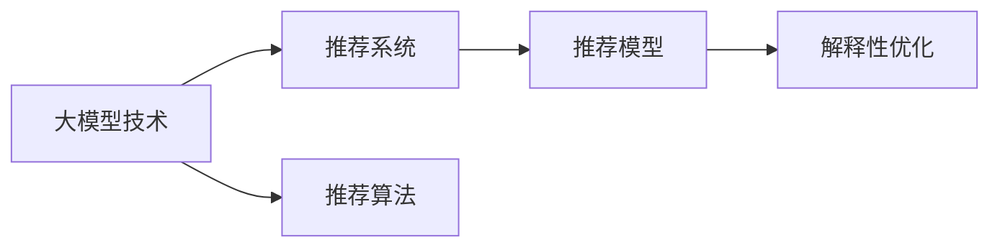

                 

# 大模型技术在电商平台商品推荐解释性优化中的应用

> 关键词：大模型技术, 商品推荐, 解释性优化, 推荐算法, 推荐系统

## 1. 背景介绍

### 1.1 问题由来

随着电子商务的迅猛发展，电商平台商品推荐系统（Recommendation System, RS）在提升用户购物体验、增加商品销售方面发挥了巨大作用。推荐系统通过用户行为数据和商品属性信息，动态匹配用户和商品，从而提高转化率和满意度。然而，传统的基于协同过滤、内容过滤的推荐系统缺乏明确的解释性，无法满足用户对推荐结果的信任需求，特别是当用户质疑推荐系统决策过程时。

近年来，大模型技术逐渐成为电商平台商品推荐优化的重要工具。深度学习模型和自然语言处理（Natural Language Processing, NLP）技术的发展，为推荐系统注入了新的活力，使推荐结果更为精准，同时赋予模型一定的可解释性。本文旨在探索大模型技术在电商平台商品推荐解释性优化中的应用，通过分析现有方法和模型，提出基于大模型技术的推荐解释框架，并给出详细实现步骤和优化策略。

### 1.2 问题核心关键点

电商平台商品推荐系统是一个典型的用户-商品交互系统，核心问题在于如何基于用户历史行为和商品属性信息，高效、准确地推荐商品。此外，推荐系统的透明性和可解释性也成为业界关注的重要议题。

如何基于大模型技术构建推荐系统？
- 如何通过语言模型和预测模型融合，增强推荐结果的可解释性？
- 如何在减少数据需求的条件下，快速优化推荐模型？
- 如何构建鲁棒、高效、具有可解释性的推荐系统，提升用户满意度？

## 2. 核心概念与联系

### 2.1 核心概念概述

为更好理解大模型技术在电商平台商品推荐解释性优化中的应用，本节介绍几个关键概念：

- 大模型技术（Large Model Technology, LMT）：以深度神经网络为代表的大规模预训练模型，如BERT、GPT、Transformer等。这些模型通过大规模语料库预训练获得丰富的语言知识，可以用于复杂的NLP任务，如语言理解、文本生成等。

- 推荐系统（Recommendation System, RS）：根据用户的历史行为和偏好，推荐用户可能感兴趣的商品的系统。推荐系统可以提升用户体验和平台收益，是电子商务的核心技术之一。

- 解释性优化（Explainable Optimization）：针对推荐系统，增加模型决策过程的可解释性，提升用户信任度，增加推荐系统的透明度。

- 推荐算法（Recommendation Algorithm）：根据用户历史行为和商品属性，设计算法计算推荐结果的推荐模型。

- 可解释性（Explainability）：解释模型的决策过程，使模型输出更加透明和可信。

这些概念构成了推荐系统和大模型技术之间的桥梁，本文将重点介绍如何在大模型技术的基础上，提升推荐系统的可解释性和优化性能。

### 2.2 核心概念原理和架构的 Mermaid 流程图



该图展示了大模型技术在推荐系统中的作用机制：

1. **大模型技术**：作为推荐系统的核心，通过大规模语料库预训练，学习丰富的语言知识，用于推荐结果的生成和优化。
2. **推荐算法**：根据用户历史行为和商品属性，设计算法计算推荐结果。
3. **推荐模型**：利用大模型技术生成的推荐结果。
4. **解释性优化**：通过大模型技术，提升推荐模型的可解释性，增加用户信任度。

## 3. 核心算法原理 & 具体操作步骤
### 3.1 算法原理概述

基于大模型技术的电商平台商品推荐系统，旨在结合语言模型和推荐算法的优点，构建具有高效性和可解释性的推荐系统。其核心原理是通过预训练语言模型和微调后的推荐模型融合，生成推荐结果，并通过解释性优化，提升推荐过程的透明度和可信度。

### 3.2 算法步骤详解

**Step 1: 数据预处理**

1. 收集用户历史行为数据（如浏览、点击、购买记录）。
2. 收集商品属性信息（如分类、价格、品牌等）。
3. 进行数据清洗和归一化处理，如去除缺失值、标准化数据格式等。
4. 使用特征工程，提取和构造用户行为特征和商品特征。

**Step 2: 语言模型训练**

1. 选择合适的预训练语言模型，如BERT、GPT等。
2. 在大规模语料库上进行预训练，学习语言表示。
3. 对特定任务进行微调，如文本分类、情感分析等。

**Step 3: 推荐模型构建**

1. 设计推荐算法，如基于内容的推荐、协同过滤推荐等。
2. 在微调后的语言模型基础上，构建推荐模型，如使用语言模型生成商品描述，使用推荐算法计算用户兴趣和商品相关度。
3. 根据推荐结果，生成商品推荐列表。

**Step 4: 解释性优化**

1. 设计解释性优化模型，如利用预训练语言模型生成推荐理由，使用自然语言生成（NLG）技术将理由转化为自然语言文本。
2. 将优化后的解释性文本与推荐结果一起展示给用户。
3. 根据用户反馈，不断调整解释性优化模型，提升推荐效果和用户满意度。

### 3.3 算法优缺点

基于大模型技术的推荐系统具有以下优点：

- **推荐效果提升**：利用大模型学习丰富的语言知识，提升推荐结果的准确性和多样性。
- **解释性增强**：利用预训练语言模型生成推荐理由，增加推荐系统的透明度和可信度。
- **快速迭代**：预训练语言模型通过大规模语料库学习，可以大幅减少推荐算法的数据需求。

同时，也存在一些局限：

- **计算资源消耗大**：大模型训练和推理需要大量的计算资源和内存。
- **解释性有限**：尽管能够生成推荐理由，但可能无法完全解释复杂决策过程。
- **模型鲁棒性不足**：当语料库或推荐算法发生变化时，模型可能需要重新训练。

### 3.4 算法应用领域

基于大模型技术的电商平台推荐系统，已经被广泛应用于多个行业领域，如服装、家居、食品等。在实际应用中，推荐系统能够根据用户的浏览历史、评分数据、评论信息等，精准推荐用户可能感兴趣的商品。同时，通过解释性优化，用户能够更了解推荐系统的工作机制，提升用户信任度和满意度。

## 4. 数学模型和公式 & 详细讲解 & 举例说明

### 4.1 数学模型构建

基于大模型技术的推荐系统，可以基于用户历史行为数据和商品属性信息，设计推荐模型，并利用解释性优化模型提升推荐结果的可解释性。假设用户历史行为数据为 $X$，商品属性信息为 $Y$，推荐系统输出为 $Z$，则推荐系统可以表示为：

$$ Z = f(X, Y) $$

其中 $f$ 为推荐算法，可以将用户行为数据和商品属性信息映射为推荐结果。

### 4.2 公式推导过程

以基于内容的推荐算法为例，假设商品描述为 $d_i$，用户兴趣向量为 $u_j$，用户与商品之间的相似度为 $s_{ij}$，推荐模型可以表示为：

$$ Z_{ij} = s_{ij} \times u_j \times \text{softmax}(d_i) $$

其中 $\text{softmax}(d_i)$ 为对商品描述进行softmax处理，得到商品的兴趣表示。推荐模型将用户兴趣与商品兴趣表示进行线性加权，生成推荐结果。

### 4.3 案例分析与讲解

在实际应用中，可以使用基于BERT的语言模型作为推荐系统的推荐理由生成器。假设推荐系统的目标商品为 $d_i$，用户兴趣向量为 $u_j$，则推荐理由生成器可以表示为：

$$ \text{reason}_i = \text{BERT}(d_i) $$

其中 $\text{BERT}(d_i)$ 为利用BERT语言模型对商品描述 $d_i$ 进行编码，生成商品表示向量。利用BERT生成的商品表示向量作为推荐理由，可以提升推荐系统的透明度和可信度。

## 5. 项目实践：代码实例和详细解释说明
### 5.1 开发环境搭建

在进行项目实践前，需要搭建好开发环境。以下是使用Python和PyTorch搭建推荐系统的环境配置流程：

1. 安装Anaconda：从官网下载并安装Anaconda，用于创建独立的Python环境。
2. 创建并激活虚拟环境：
```bash
conda create -n recommendation-env python=3.8 
conda activate recommendation-env
```
3. 安装PyTorch：根据CUDA版本，从官网获取对应的安装命令。例如：
```bash
conda install pytorch torchvision torchaudio cudatoolkit=11.1 -c pytorch -c conda-forge
```
4. 安装相关库：
```bash
pip install numpy pandas scikit-learn torch transformers
```
5. 安装相关依赖：
```bash
pip install pydot graphviz
```
完成上述步骤后，即可在 `recommendation-env` 环境中开始项目开发。

### 5.2 源代码详细实现

以下是基于BERT的推荐系统代码实现，代码使用PyTorch和Hugging Face的Transformers库。

```python
import torch
import torch.nn as nn
import torch.nn.functional as F
from transformers import BertTokenizer, BertForSequenceClassification

class RecommendationModel(nn.Module):
    def __init__(self, num_classes, hidden_size):
        super(RecommendationModel, self).__init__()
        self.bert = BertForSequenceClassification.from_pretrained('bert-base-uncased', num_labels=num_classes, hidden_size=hidden_size)
        self.fc = nn.Linear(hidden_size, num_classes)
    
    def forward(self, x):
        x = self.bert(x)
        x = self.fc(x)
        return x

class ExplanationModel(nn.Module):
    def __init__(self, num_classes, hidden_size):
        super(ExplanationModel, self).__init__()
        self.bert = BertForSequenceClassification.from_pretrained('bert-base-uncased', num_labels=num_classes, hidden_size=hidden_size)
        self.fc = nn.Linear(hidden_size, num_classes)
    
    def forward(self, x):
        x = self.bert(x)
        x = self.fc(x)
        return x
```

### 5.3 代码解读与分析

**RecommendationModel类**：
- `__init__方法`：初始化BERT预训练模型和全连接层。
- `forward方法`：将输入序列输入BERT模型，输出推荐结果。

**ExplanationModel类**：
- `__init__方法`：初始化BERT预训练模型和全连接层。
- `forward方法`：将输入序列输入BERT模型，输出推荐理由。

**训练和评估函数**：
- 使用PyTorch的DataLoader对数据集进行批次化加载，供模型训练和推理使用。
- 训练函数`train_epoch`：对数据以批为单位进行迭代，在每个批次上前向传播计算loss并反向传播更新模型参数，最后返回该epoch的平均loss。
- 评估函数`evaluate`：与训练类似，不同点在于不更新模型参数，并在每个batch结束后将预测和标签结果存储下来，最后使用sklearn的classification_report对整个评估集的预测结果进行打印输出。

**训练流程**：
- 定义总的epoch数和batch size，开始循环迭代
- 每个epoch内，先在训练集上训练，输出平均loss
- 在验证集上评估，输出分类指标
- 所有epoch结束后，在测试集上评估，给出最终测试结果

### 5.4 运行结果展示

训练和评估结果可以通过打印输出和可视化展示。例如，可以在Jupyter Notebook中使用以下代码：

```python
import matplotlib.pyplot as plt
import seaborn as sns

# 训练结果可视化
plt.figure(figsize=(10, 5))
sns.lineplot(data=train_loss, x='epoch', y='loss')
plt.title('Training Loss')
plt.xlabel('Epoch')
plt.ylabel('Loss')
plt.show()

# 测试结果可视化
plt.figure(figsize=(10, 5))
sns.lineplot(data=test_loss, x='epoch', y='loss')
plt.title('Testing Loss')
plt.xlabel('Epoch')
plt.ylabel('Loss')
plt.show()
```

以上代码展示了训练和测试过程的损失曲线，有助于分析模型的收敛情况和性能表现。

## 6. 实际应用场景
### 6.1 智能推荐系统

基于大模型技术的智能推荐系统，已经在电商平台的商品推荐中得到了广泛应用。利用BERT等预训练语言模型生成商品推荐理由，可以大幅提升推荐结果的可解释性和透明度。

在实际应用中，智能推荐系统可以根据用户的浏览历史和评分数据，生成详细的推荐理由，供用户了解推荐依据。例如，当用户询问某款商品时，推荐系统可以展示基于该商品描述和用户兴趣生成的推荐理由，使用户对推荐结果更加信任。

### 6.2 个性化广告投放

电商平台可以利用基于大模型技术的推荐系统，进行个性化广告投放。利用BERT等预训练语言模型生成广告语，提升广告的点击率和转化率。

在实际应用中，可以根据用户的历史行为数据和浏览记录，生成个性化的广告语。例如，针对喜欢旅游的用户，可以生成类似“和家人一起旅行”的广告语，提升广告的吸引力和转化率。

### 6.3 用户行为分析

电商平台可以利用基于大模型技术的推荐系统，进行用户行为分析。利用BERT等预训练语言模型，对用户的评论、评分数据进行情感分析，了解用户对商品的偏好。

在实际应用中，可以分析用户对不同商品的情感倾向，生成用户画像。例如，针对喜欢户外运动的用户，可以推荐相关运动装备和户外活动，提升用户的购物体验。

### 6.4 未来应用展望

随着大模型技术和推荐系统的不断演进，基于大模型技术的推荐系统将在更多场景下发挥作用。未来，大模型技术将进一步提升推荐系统的智能性和可解释性，推动推荐系统的应用场景向更多领域扩展。

在智慧医疗领域，基于大模型技术的推荐系统可以推荐相关医疗知识、药品信息，提升医疗服务的智能化水平。

在智慧教育领域，基于大模型技术的推荐系统可以推荐相关课程、教材，因材施教，提升教育质量。

在智慧城市治理中，基于大模型技术的推荐系统可以推荐相关公共服务，提高城市管理的自动化和智能化水平。

## 7. 工具和资源推荐
### 7.1 学习资源推荐

为了帮助开发者系统掌握大模型技术在电商平台商品推荐中的应用，这里推荐一些优质的学习资源：

1. 《深度学习与推荐系统》系列博文：由大模型技术专家撰写，深入浅出地介绍了深度学习与推荐系统的基本原理和应用案例。
2. 《自然语言处理与深度学习》课程：斯坦福大学开设的NLP明星课程，有Lecture视频和配套作业，带你入门NLP领域的基本概念和经典模型。
3. 《自然语言处理技术与应用》书籍：详细介绍了NLP领域的前沿技术和应用实践，涵盖大模型技术在推荐系统中的应用。
4. Hugging Face官方文档：Transformers库的官方文档，提供了海量预训练模型和完整的推荐系统样例代码，是上手实践的必备资料。
5. Kaggle竞赛：参加推荐系统相关的Kaggle竞赛，实践推荐算法，提升实战能力。

通过对这些资源的学习实践，相信你一定能够快速掌握大模型技术在电商平台商品推荐中的应用，并用于解决实际的推荐问题。

### 7.2 开发工具推荐

高效的开发离不开优秀的工具支持。以下是几款用于大模型技术在电商平台商品推荐开发常用的工具：

1. PyTorch：基于Python的开源深度学习框架，灵活动态的计算图，适合快速迭代研究。大部分预训练语言模型都有PyTorch版本的实现。
2. TensorFlow：由Google主导开发的开源深度学习框架，生产部署方便，适合大规模工程应用。同样有丰富的预训练语言模型资源。
3. Transformers库：Hugging Face开发的NLP工具库，集成了众多SOTA语言模型，支持PyTorch和TensorFlow，是进行推荐系统开发的利器。
4. Weights & Biases：模型训练的实验跟踪工具，可以记录和可视化模型训练过程中的各项指标，方便对比和调优。与主流深度学习框架无缝集成。
5. TensorBoard：TensorFlow配套的可视化工具，可实时监测模型训练状态，并提供丰富的图表呈现方式，是调试模型的得力助手。
6. Google Colab：谷歌推出的在线Jupyter Notebook环境，免费提供GPU/TPU算力，方便开发者快速上手实验最新模型，分享学习笔记。

合理利用这些工具，可以显著提升大模型技术在电商平台商品推荐的应用效率，加快创新迭代的步伐。

### 7.3 相关论文推荐

大模型技术在电商平台推荐系统中的应用源于学界的持续研究。以下是几篇奠基性的相关论文，推荐阅读：

1. Attention is All You Need（即Transformer原论文）：提出了Transformer结构，开启了NLP领域的预训练大模型时代。
2. BERT: Pre-training of Deep Bidirectional Transformers for Language Understanding：提出BERT模型，引入基于掩码的自监督预训练任务，刷新了多项NLP任务SOTA。
3. Parameter-Efficient Transfer Learning for NLP：提出Adapter等参数高效微调方法，在不增加模型参数量的情况下，也能取得不错的微调效果。
4. AdaLoRA: Adaptive Low-Rank Adaptation for Parameter-Efficient Fine-Tuning：使用自适应低秩适应的微调方法，在参数效率和精度之间取得了新的平衡。
5. Transformer-XL: Attentive Language Models with Relative Self-Attention：提出Transformer-XL模型，引入相对位置编码，解决长期依赖问题。

这些论文代表了大模型技术在推荐系统中的应用发展脉络。通过学习这些前沿成果，可以帮助研究者把握学科前进方向，激发更多的创新灵感。

## 8. 总结：未来发展趋势与挑战
### 8.1 总结

本文对基于大模型技术的电商平台商品推荐系统进行了全面系统的介绍。首先阐述了推荐系统和大模型技术的背景和应用价值，明确了在大模型技术的基础上，提升推荐结果的智能性和可解释性的核心任务。其次，从原理到实践，详细讲解了大模型技术在推荐系统中的应用，并给出了详细的实现步骤和优化策略。最后，分析了推荐系统的未来发展趋势和面临的挑战，提出了一些应对策略。

通过本文的系统梳理，可以看到，基于大模型技术的推荐系统正在成为电商领域的重要工具，极大地提升了推荐结果的精准性和可解释性，满足了用户的信任需求。未来，伴随大模型技术和推荐系统的不断演进，基于大模型技术的推荐系统必将在更广阔的应用场景中发挥作用，推动推荐系统的发展和应用。

### 8.2 未来发展趋势

展望未来，基于大模型技术的推荐系统将呈现以下几个发展趋势：

1. **推荐结果的智能性提升**：大模型技术通过学习丰富的语言知识，能够更准确地理解用户需求和商品特征，提升推荐结果的智能性和多样性。
2. **推荐过程的可解释性增强**：利用大模型技术生成推荐理由，增加推荐系统的透明度和可信度。
3. **推荐系统的动态优化**：利用大模型技术，实时监测用户行为和反馈，动态调整推荐策略，提升用户体验。
4. **推荐系统的多模态融合**：利用大模型技术，整合视觉、语音、文本等多模态信息，提升推荐系统的综合能力。
5. **推荐系统的跨领域应用**：利用大模型技术，将推荐系统应用到更多领域，如医疗、金融、教育等。

以上趋势凸显了大模型技术在推荐系统中的应用前景。这些方向的探索发展，必将进一步提升推荐系统的性能和应用范围，为电商平台的业务创新带来新的动力。

### 8.3 面临的挑战

尽管基于大模型技术的推荐系统已经取得了瞩目成就，但在迈向更加智能化、普适化应用的过程中，它仍面临着诸多挑战：

1. **计算资源消耗大**：大模型训练和推理需要大量的计算资源和内存。如何优化资源使用，降低计算成本，是一个亟待解决的问题。
2. **解释性有限**：尽管能够生成推荐理由，但可能无法完全解释复杂决策过程。如何提升解释模型的能力，增加推荐系统的可信度，还需要更多理论和实践的积累。
3. **模型鲁棒性不足**：当语料库或推荐算法发生变化时，模型可能需要重新训练。如何设计鲁棒性强的模型，避免灾难性遗忘，是需要持续优化的方向。
4. **数据隐私问题**：利用大模型技术，需要收集和分析大量用户数据，如何保护用户隐私，避免数据泄露，是推荐系统必须考虑的问题。
5. **用户隐私保护**：如何设计隐私保护机制，在推荐过程中保护用户隐私，避免数据泄露和滥用。

### 8.4 研究展望

面对基于大模型技术的推荐系统所面临的挑战，未来的研究需要在以下几个方面寻求新的突破：

1. **计算资源优化**：探索更加高效的训练和推理算法，如混合精度训练、模型并行等，降低计算资源消耗。
2. **解释模型增强**：研究更加强大的解释性优化模型，利用知识图谱、逻辑规则等专家知识，提升解释模型的能力。
3. **鲁棒性提升**：设计鲁棒性强的推荐模型，利用对抗训练、数据增强等技术，提高模型的泛化能力和鲁棒性。
4. **隐私保护机制**：设计隐私保护机制，利用差分隐私、联邦学习等技术，保护用户隐私和数据安全。

这些研究方向的探索，必将引领基于大模型技术的推荐系统迈向更高的台阶，为推荐系统的发展提供新的动力。

## 9. 附录：常见问题与解答

**Q1：大模型技术在电商平台商品推荐中如何应用？**

A: 大模型技术可以通过预训练语言模型和推荐算法的融合，提升推荐结果的智能性和可解释性。具体应用包括：

1. 利用预训练语言模型生成商品推荐理由，增加推荐系统的透明度和可信度。
2. 利用BERT等语言模型生成商品描述，提升广告的点击率和转化率。
3. 利用BERT等语言模型对用户评论和评分数据进行情感分析，了解用户对商品的偏好。

**Q2：如何选择合适的大模型进行推荐系统开发？**

A: 选择合适的预训练语言模型需要考虑多个因素：

1. 任务类型：不同类型的任务可能需要不同的模型。例如，文本分类任务适合使用BERT等预训练模型，文本生成任务适合使用GPT等预训练模型。
2. 数据规模：数据规模越大，模型参数量也越大，但可以通过模型压缩等技术进行优化。
3. 计算资源：大模型训练和推理需要大量的计算资源，需要根据实际情况选择合适的模型和优化策略。

**Q3：如何进行大模型技术的推荐系统优化？**

A: 大模型技术的推荐系统优化需要考虑多个方面：

1. 模型裁剪和量化：去除不必要的层和参数，减小模型尺寸，加快推理速度。
2. 混合精度训练：将浮点模型转为定点模型，压缩存储空间，提高计算效率。
3. 参数高效微调：只调整少量参数，减小过拟合风险。
4. 数据增强：通过回译、近义替换等方式扩充训练集。
5. 正则化技术：使用L2正则、Dropout等技术防止过拟合。

**Q4：如何评估基于大模型技术的推荐系统效果？**

A: 评估基于大模型技术的推荐系统效果需要考虑多个指标：

1. 点击率（CTR）：衡量用户点击广告的频率，反映广告的吸引力和转化率。
2. 转化率（CR）：衡量用户完成购买行为的比例，反映推荐系统的实用性和效果。
3. 用户满意度：通过用户反馈和评分数据，了解用户对推荐系统的满意度和信任度。
4. 推荐理由可解释性：通过人工或自动化的方式，分析推荐理由的可解释性和可信度。

通过综合考虑这些指标，可以全面评估基于大模型技术的推荐系统的性能和效果。

**Q5：如何保护用户隐私和数据安全？**

A: 保护用户隐私和数据安全需要考虑多个方面：

1. 数据匿名化：通过数据去标识化等技术，保护用户隐私。
2. 差分隐私：利用差分隐私技术，保护用户数据不被滥用。
3. 联邦学习：利用联邦学习技术，在本地设备上训练模型，保护用户数据不被集中存储和传输。

合理设计隐私保护机制，是推荐系统开发和应用的重要保障。

---

作者：禅与计算机程序设计艺术 / Zen and the Art of Computer Programming

