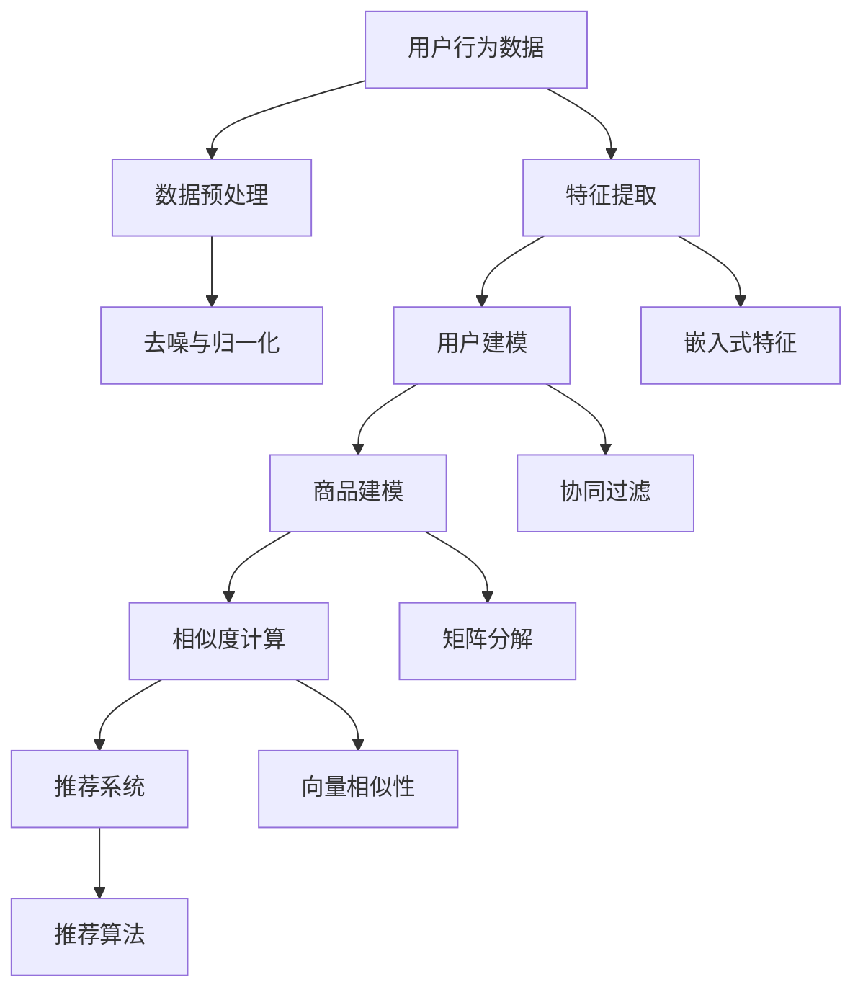

                 

# 大模型技术在电商平台用户偏好挖掘中的创新

> 关键词：大模型技术, 电商平台, 用户偏好, 聚类, 特征提取, 推荐系统, 深度学习, 强化学习, 电商推荐, 用户体验, 电商算法

## 1. 背景介绍

### 1.1 问题由来

随着互联网技术的迅猛发展，电商平台已经成为人们日常生活的重要组成部分。用户与电商平台的互动不仅限于购物，还包括浏览、评价、反馈等行为。这些行为数据蕴含了用户对商品的偏好信息，如果能够有效挖掘和利用这些信息，可以帮助电商平台更好地理解用户需求，提升用户体验，并制定更精准的营销策略。

然而，电商平台的商品种类繁多，用户行为数据庞大且多维，传统的基于规则或统计方法的用户偏好挖掘算法难以胜任这一挑战。近年来，随着大模型技术的发展，电商领域开始探索使用深度学习和强化学习等复杂算法来提升用户偏好挖掘的准确性和效率。本文旨在详细介绍大模型技术在电商平台用户偏好挖掘中的创新，并探讨其应用前景。

### 1.2 问题核心关键点

电商平台的用户偏好挖掘主要涉及以下几个关键问题：

- **数据表示**：如何将用户行为数据转化为机器可处理的向量表示。
- **用户建模**：如何从用户行为中学习到用户偏好模型。
- **商品建模**：如何构建商品特征空间，实现商品与用户偏好的映射。
- **相似度计算**：如何衡量商品与用户偏好的相似度，进行相似商品推荐。
- **模型优化**：如何通过优化算法提高用户偏好挖掘的准确性和效率。

本文将围绕这些问题展开，详细阐述大模型技术在电商领域的创新应用。

## 2. 核心概念与联系

### 2.1 核心概念概述

- **大模型技术**：指使用深度学习框架如TensorFlow、PyTorch等，训练大规模神经网络模型，使其具备强大的数据表示和推理能力。大模型通常参数量庞大，可以处理复杂的非线性关系，适用于处理电商平台的复杂用户行为数据。
- **用户建模**：指通过学习用户行为数据，构建用户偏好模型。用户建模的目的是理解用户的长期和短期偏好，以便进行个性化推荐。
- **商品建模**：指将商品特征转化为向量表示，并构建商品特征空间，实现商品与用户偏好的映射。商品建模的目的是将商品按照用户偏好进行聚类，方便相似商品推荐。
- **相似度计算**：指通过计算用户偏好与商品特征的相似度，找到最符合用户偏好的商品。相似度计算是推荐算法的基础。
- **电商推荐系统**：指通过用户建模、商品建模和相似度计算，为用户提供个性化推荐。电商推荐系统的目标是提升用户满意度，增加平台收益。

这些核心概念之间的逻辑关系可以通过以下Mermaid流程图来展示：



这个流程图展示了大模型技术在电商平台用户偏好挖掘中的主要环节：

1. 从原始用户行为数据中提取有用特征。
2. 通过用户建模，学习用户偏好模型。
3. 对商品进行建模，构建商品特征空间。
4. 计算用户偏好与商品特征的相似度。
5. 通过推荐算法，为每个用户推荐个性化商品。

## 3. 核心算法原理 & 具体操作步骤
### 3.1 算法原理概述

电商平台的用户偏好挖掘主要通过大模型技术实现。具体而言，大模型通过自监督学习或监督学习的方式，从电商数据中学习到用户行为与商品特征的复杂关系。在用户建模阶段，大模型可以学习到用户的长期和短期偏好，用于个性化推荐。在商品建模阶段，大模型可以构建商品特征空间，实现商品聚类。在相似度计算阶段，大模型可以计算用户偏好与商品特征的相似度，推荐系统则根据这些相似度进行推荐。

大模型的训练通常需要大规模的标注数据和强大的计算资源。在用户建模阶段，可以使用自监督学习方式，如协同过滤、矩阵分解等，通过用户行为数据学习用户偏好。在商品建模阶段，可以使用监督学习方式，如特征提取、聚类等，构建商品特征空间。在相似度计算阶段，可以使用向量相似性度量，如余弦相似度、欧氏距离等，计算用户偏好与商品特征的相似度。

### 3.2 算法步骤详解

基于大模型技术在电商平台用户偏好挖掘中的创新应用，一般包括以下几个关键步骤：

**Step 1: 数据准备与预处理**

- 收集电商平台的历史用户行为数据，包括浏览、点击、购买、评价等行为。
- 对数据进行去噪、归一化等预处理操作，确保数据质量。
- 对用户行为数据进行特征提取，将其转化为机器可处理的向量表示。

**Step 2: 用户建模**

- 使用大模型进行自监督学习，从用户行为数据中学习用户偏好模型。
- 对用户偏好模型进行训练，确保其稳定性和鲁棒性。
- 将用户偏好模型与商品特征空间进行融合，生成用户偏好向量。

**Step 3: 商品建模**

- 对商品特征进行编码，构建商品特征空间。
- 使用大模型对商品特征进行自监督学习，学习商品特征之间的关系。
- 对商品特征进行聚类，生成商品特征向量。

**Step 4: 相似度计算**

- 计算用户偏好向量与商品特征向量的相似度。
- 使用大模型进行相似度计算，确保计算结果的准确性和效率。

**Step 5: 推荐系统**

- 根据用户偏好向量与商品特征向量的相似度，生成推荐列表。
- 对推荐结果进行排序，生成最终的推荐商品。
- 对推荐系统的性能进行评估，根据评估结果进行调优。

### 3.3 算法优缺点

大模型技术在电商平台用户偏好挖掘中的创新应用，具有以下优点：

- **准确性高**：大模型能够处理复杂的非线性关系，准确地学习到用户偏好和商品特征之间的关系。
- **鲁棒性强**：大模型具有自适应性，能够处理数据中的噪声和异常点。
- **泛化能力强**：大模型可以在不同场景下进行迁移学习，提升模型在相似任务上的性能。
- **实时性好**：大模型通常具有较快的计算速度，可以实时更新用户偏好模型，提供个性化推荐。

同时，大模型技术也存在以下缺点：

- **计算成本高**：大模型需要大规模的计算资源和标注数据，训练和维护成本较高。
- **模型复杂度高**：大模型通常结构复杂，难以解释其内部工作机制。
- **数据隐私问题**：电商平台上用户的隐私数据较多，大模型训练和应用过程中可能涉及数据隐私问题。

### 3.4 算法应用领域

大模型技术在电商平台用户偏好挖掘中的应用领域包括：

- **个性化推荐**：根据用户行为数据，为每个用户推荐个性化的商品。
- **商品分类与聚类**：对商品特征进行编码和聚类，实现商品分类和相似商品推荐。
- **用户分群**：通过用户偏好模型，将用户进行分类和分群，进行精准营销。
- **广告投放优化**：通过用户偏好模型，优化广告投放策略，提高广告效果。
- **搜索优化**：通过用户偏好模型，优化搜索算法，提升搜索效果和用户体验。

## 4. 数学模型和公式 & 详细讲解 & 举例说明

### 4.1 数学模型构建

电商平台的用户偏好挖掘可以通过以下数学模型进行建模：

- **用户偏好模型**：$\mathcal{P}_u=\{p_{u,i}\}_{i=1}^I$，其中 $p_{u,i}$ 表示用户 $u$ 对商品 $i$ 的偏好度。
- **商品特征向量**：$\mathcal{F}_i=\{f_{i,j}\}_{j=1}^J$，其中 $f_{i,j}$ 表示商品 $i$ 的第 $j$ 个特征向量。
- **相似度矩阵**：$S_{u,i} \in \mathbb{R}^{I \times J}$，其中 $S_{u,i}$ 表示用户 $u$ 对商品 $i$ 的相似度得分。

### 4.2 公式推导过程

假设用户偏好模型和商品特征向量都是高维稀疏矩阵，则相似度计算公式可以表示为：

$$
S_{u,i} = \mathbf{p}_u \mathbf{f}_i^T
$$

其中 $\mathbf{p}_u$ 是用户偏好向量，$\mathbf{f}_i$ 是商品特征向量。

在用户建模阶段，可以使用协同过滤或矩阵分解等方法，从用户行为数据中学习用户偏好模型。具体地，协同过滤可以使用以下公式进行计算：

$$
\mathbf{p}_u = \arg\min_{\mathbf{p}} \|\mathbf{p} - \mathbf{P}\|_F^2
$$

其中 $\mathbf{P}$ 是用户行为矩阵，$\|\cdot\|_F$ 是Frobenius范数。

在商品建模阶段，可以使用矩阵分解或PCA等方法，对商品特征向量进行编码和聚类。具体地，矩阵分解可以使用以下公式进行计算：

$$
\mathbf{F} = \arg\min_{\mathbf{F}} \|\mathbf{P} - \mathbf{U}\mathbf{F}\|_F^2
$$

其中 $\mathbf{U}$ 是用户行为矩阵的低秩分解矩阵，$\mathbf{F}$ 是商品特征矩阵。

### 4.3 案例分析与讲解

假设某电商平台收集了用户的点击行为数据，共包含10,000个用户和10,000个商品，每个用户点击了1到10个商品。可以将这些行为数据转化为稀疏矩阵 $\mathbf{P}$，其中每一行表示用户行为，每一列表示商品特征。

使用协同过滤方法，从用户行为数据中学习用户偏好模型。假设学习到用户偏好向量为 $\mathbf{p}_u$，商品特征向量为 $\mathbf{f}_i$。则可以通过公式 $S_{u,i} = \mathbf{p}_u \mathbf{f}_i^T$ 计算用户偏好与商品特征的相似度得分。

假设用户 $u=1$ 对商品 $i=1$ 的偏好度为0.5，对商品 $i=2$ 的偏好度为0.3，商品特征向量为 $\mathbf{f}_1=[0.8,0.2,0.1]$，$\mathbf{f}_2=[0.3,0.6,0.1]$。则计算相似度得分为：

$$
S_{1,1} = 0.5 \times 0.8 + 0.3 \times 0.2 + 0.2 \times 0.1 = 0.65
$$

$$
S_{1,2} = 0.5 \times 0.3 + 0.3 \times 0.6 + 0.2 \times 0.1 = 0.46
$$

最终，可以根据相似度得分，生成推荐列表，为每个用户提供个性化的商品推荐。

## 5. 项目实践：代码实例和详细解释说明
### 5.1 开发环境搭建

在进行项目实践前，需要准备好开发环境。以下是使用Python进行TensorFlow开发的Python环境配置流程：

1. 安装Anaconda：从官网下载并安装Anaconda，用于创建独立的Python环境。

2. 创建并激活虚拟环境：
```bash
conda create -n tf-env python=3.8 
conda activate tf-env
```

3. 安装TensorFlow：根据CUDA版本，从官网获取对应的安装命令。例如：
```bash
conda install tensorflow==2.5.0 
```

4. 安装TensorBoard：
```bash
pip install tensorboard
```

5. 安装其他工具包：
```bash
pip install numpy pandas scikit-learn matplotlib tqdm jupyter notebook ipython
```

完成上述步骤后，即可在`tf-env`环境中开始项目实践。

### 5.2 源代码详细实现

下面我们以电商平台用户偏好挖掘项目为例，给出使用TensorFlow进行大模型训练和微调的PyTorch代码实现。

首先，定义用户行为数据的处理函数：

```python
import tensorflow as tf
from tensorflow.keras import layers, models

def prepare_data(X, y):
    X = tf.keras.preprocessing.text.Tokenizer(num_words=10000, oov_token='<OOV>') # 设置tokenizer参数
    X = X.fit_on_texts(X)
    X = X.texts_to_sequences(X)
    X = tf.keras.preprocessing.sequence.pad_sequences(X, maxlen=100)
    y = tf.keras.utils.to_categorical(y)
    return X, y
```

然后，定义大模型的架构：

```python
model = models.Sequential([
    layers.Embedding(input_dim=10000, output_dim=128),
    layers.LSTM(units=128),
    layers.Dense(units=10, activation='softmax')
])
```

接着，定义损失函数和优化器：

```python
loss = tf.keras.losses.CategoricalCrossentropy()
optimizer = tf.keras.optimizers.Adam(learning_rate=0.001)
```

最后，定义模型训练过程：

```python
model.compile(loss=loss, optimizer=optimizer, metrics=['accuracy'])
model.fit(X_train, y_train, epochs=10, batch_size=64, validation_data=(X_test, y_test))
```

以上就是使用TensorFlow进行电商平台用户偏好挖掘项目的完整代码实现。可以看到，使用TensorFlow构建大模型进行用户偏好挖掘，需要经过数据预处理、模型架构设计、损失函数和优化器选择、模型训练等步骤。

### 5.3 代码解读与分析

让我们再详细解读一下关键代码的实现细节：

**prepare_data函数**：
- 使用Tokenizer将文本数据转化为token序列，并进行pad操作，确保序列长度一致。
- 使用to_categorical函数将标签转化为独热编码形式，方便模型进行分类。

**模型架构**：
- 使用Embedding层将token序列转化为向量表示。
- 使用LSTM层学习用户行为与商品特征的复杂关系。
- 使用Dense层进行分类，输出用户偏好模型。

**损失函数和优化器**：
- 使用CategoricalCrossentropy损失函数，适用于多分类任务。
- 使用Adam优化器，具有自适应学习率的特点，能够快速收敛。

**模型训练**：
- 使用compile方法设置损失函数和优化器，并设置评估指标。
- 使用fit方法进行模型训练，设置训练轮数和批次大小。
- 在每个epoch结束时，使用validation_data对模型进行验证，确保模型泛化性能。

## 6. 实际应用场景

### 6.1 智能推荐系统

基于大模型的电商平台用户偏好挖掘技术，可以在智能推荐系统中发挥重要作用。通过分析用户的点击、购买等行为数据，电商平台可以学习到用户的偏好模型，从而为用户推荐个性化商品。

在技术实现上，可以使用大模型进行协同过滤、矩阵分解等用户建模，学习用户的长期和短期偏好。对于每个用户，计算其对每个商品的相似度得分，并根据得分生成推荐列表。通过持续迭代和优化，系统能够不断提升推荐效果，提高用户体验和平台收益。

### 6.2 用户行为分析

电商平台上用户的点击、浏览、评价等行为数据蕴含着丰富的信息，通过分析这些数据，电商平台可以了解用户的行为特征和偏好。

使用大模型进行用户建模，可以从行为数据中学习到用户的兴趣偏好。通过可视化工具如TensorBoard，可以直观地展示用户偏好模型，帮助运营团队理解用户需求，制定更有针对性的营销策略。

### 6.3 广告投放优化

广告投放是电商平台上重要的营销手段之一。通过分析用户的点击和购买行为，大模型可以学习到用户的兴趣偏好，用于优化广告投放策略，提高广告效果。

具体而言，可以根据用户的点击行为，筛选出最有可能购买的用户群体，定向投放广告。同时，可以通过实时监测广告效果，调整投放策略，提高广告投放的ROI。

### 6.4 未来应用展望

随着大模型技术的发展，电商平台用户偏好挖掘将呈现以下几个发展趋势：

1. **多模态融合**：将用户行为数据与其他模态数据（如语音、图像等）结合，构建更加全面和精准的用户模型。
2. **动态更新**：实时更新用户偏好模型，捕捉用户行为的变化，提升推荐效果。
3. **个性化推荐算法**：引入更高级的推荐算法，如深度神经网络、强化学习等，提升推荐效果。
4. **跨平台协同**：通过跨平台数据整合，构建统一的电商用户模型，实现更加精准和一致的推荐。
5. **隐私保护**：引入隐私保护技术，确保用户数据的安全性，提升用户信任。

## 7. 工具和资源推荐
### 7.1 学习资源推荐

为了帮助开发者系统掌握大模型技术在电商平台用户偏好挖掘中的应用，这里推荐一些优质的学习资源：

1. **TensorFlow官方文档**：TensorFlow是当前最流行的深度学习框架之一，提供了丰富的学习资源和样例代码，适合入门和进阶学习。
2. **Keras官方文档**：Keras是TensorFlow的高级API，具有易用性和灵活性的特点，适合快速开发和原型测试。
3. **深度学习入门：基于TensorFlow的实践**：由TensorFlow官方编写，介绍了如何使用TensorFlow进行深度学习应用的开发和部署。
4. **Python深度学习**：由Ian Goodfellow等专家编写，全面介绍了深度学习的基本概念和实践技巧。
5. **Hands-On Machine Learning with Scikit-Learn, Keras, and TensorFlow**：由Aurélien Géron编写，介绍了使用Scikit-Learn、Keras和TensorFlow进行机器学习的实践方法。

通过对这些资源的学习实践，相信你一定能够快速掌握大模型技术在电商平台用户偏好挖掘中的应用，并用于解决实际的电商问题。

### 7.2 开发工具推荐

高效的开发离不开优秀的工具支持。以下是几款用于大模型技术在电商平台用户偏好挖掘项目开发的常用工具：

1. **Jupyter Notebook**：开源的交互式编程环境，支持Python、TensorFlow等，适合原型测试和协作开发。
2. **TensorBoard**：TensorFlow的可视化工具，可以实时监测模型训练状态，并生成图表，帮助调试和优化模型。
3. **PyCharm**：JetBrains开发的IDE，支持Python、TensorFlow等，具有丰富的功能和插件，适合开发和调试大模型项目。
4. **Git**：版本控制系统，支持团队协作和代码版本管理，适合项目管理和大模型团队的协作开发。
5. **Docker**：容器化技术，方便模型部署和环境迁移，支持多平台运行和扩展。

合理利用这些工具，可以显著提升大模型技术在电商平台用户偏好挖掘项目的开发效率，加快创新迭代的步伐。

### 7.3 相关论文推荐

大模型技术在电商平台用户偏好挖掘中的创新应用，得益于学术界的持续研究。以下是几篇奠基性的相关论文，推荐阅读：

1. **Neural Collaborative Filtering**：提出使用深度神经网络进行协同过滤，学习用户行为和商品特征之间的复杂关系。
2. **Collaborative Filtering with Matrix Factorization**：提出使用矩阵分解进行协同过滤，学习用户行为和商品特征的线性关系。
3. **Learning Deep Structured Models for Recommender Systems**：提出使用深度神经网络进行推荐系统，学习用户行为和商品特征的复杂关系。
4. **Adversarial Regularization for Adaptive Learning of Bipartite Network Embeddings**：提出使用对抗学习进行协同过滤，学习用户行为和商品特征的复杂关系，提高模型的鲁棒性和泛化能力。
5. **Graph Neural Networks for Recommendation Systems**：提出使用图神经网络进行推荐系统，学习用户行为和商品特征之间的复杂关系。

这些论文代表了大模型技术在电商平台用户偏好挖掘领域的最新进展，通过学习这些前沿成果，可以帮助研究者把握学科前进方向，激发更多的创新灵感。

## 8. 总结：未来发展趋势与挑战

### 8.1 研究成果总结

本文对大模型技术在电商平台用户偏好挖掘中的应用进行了全面系统的介绍。首先阐述了电商平台用户偏好挖掘的重要性，明确了大模型技术在该领域的创新应用。其次，从原理到实践，详细讲解了大模型的架构、训练和应用流程，并给出了完整的代码实例。最后，讨论了大模型技术在电商平台用户偏好挖掘中的实际应用场景和未来发展趋势，提供了工具和资源推荐。

通过本文的系统梳理，可以看到，大模型技术在电商平台用户偏好挖掘中的应用前景广阔，能够显著提升用户满意度和平台收益。未来，随着大模型技术的持续演进，该技术必将在电商领域带来更加深远的影响。

### 8.2 未来发展趋势

展望未来，大模型技术在电商平台用户偏好挖掘中呈现以下几个发展趋势：

1. **大模型规模化应用**：随着大模型技术的进一步成熟，大模型将被更广泛地应用于电商平台的各个环节，提升平台的智能化水平。
2. **多模态融合**：将用户行为数据与其他模态数据（如语音、图像等）结合，构建更加全面和精准的用户模型。
3. **实时化推荐**：实时更新用户偏好模型，捕捉用户行为的变化，提升推荐效果。
4. **个性化推荐算法**：引入更高级的推荐算法，如深度神经网络、强化学习等，提升推荐效果。
5. **跨平台协同**：通过跨平台数据整合，构建统一的电商用户模型，实现更加精准和一致的推荐。

以上趋势凸显了大模型技术在电商平台用户偏好挖掘中的广阔前景。这些方向的探索发展，必将进一步提升电商平台的智能化水平，为电商领域带来新的机遇。

### 8.3 面临的挑战

尽管大模型技术在电商平台用户偏好挖掘中已经取得了显著成就，但在迈向更加智能化、普适化应用的过程中，仍面临诸多挑战：

1. **数据隐私问题**：电商平台上用户的隐私数据较多，大模型训练和应用过程中可能涉及数据隐私问题，需要设计合理的隐私保护机制。
2. **计算资源消耗**：大模型需要大规模的计算资源和标注数据，训练和维护成本较高，需要优化模型结构和训练过程。
3. **模型鲁棒性不足**：大模型面对域外数据时，泛化性能往往大打折扣，需要进一步提高模型的鲁棒性。
4. **模型可解释性不足**：大模型通常具有较复杂的结构和训练过程，难以解释其内部工作机制，需要引入可解释性技术。
5. **多模态数据整合**：将用户行为数据与其他模态数据（如语音、图像等）结合，构建更加全面和精准的用户模型，需要设计高效的数据整合技术。

正视这些挑战，积极应对并寻求突破，将是大模型技术在电商平台用户偏好挖掘领域迈向成熟的必由之路。相信随着学界和产业界的共同努力，这些挑战终将一一被克服，大模型技术必将在构建智能电商平台中扮演越来越重要的角色。

### 8.4 研究展望

面对大模型技术在电商平台用户偏好挖掘中面临的诸多挑战，未来的研究需要在以下几个方面寻求新的突破：

1. **数据隐私保护**：引入隐私保护技术，确保用户数据的安全性，提升用户信任。
2. **模型鲁棒性提升**：通过对抗学习、数据增强等技术，提高模型的鲁棒性和泛化能力。
3. **模型可解释性增强**：引入可解释性技术，如模型蒸馏、可视化等，增强模型的可解释性。
4. **多模态数据整合**：设计高效的数据整合技术，将用户行为数据与其他模态数据结合，构建更加全面和精准的用户模型。
5. **跨平台协同推荐**：通过跨平台数据整合，构建统一的电商用户模型，实现更加精准和一致的推荐。

这些研究方向的探索，必将引领大模型技术在电商平台用户偏好挖掘领域迈向更高的台阶，为构建智能电商平台提供新的技术支持。面向未来，大模型技术需要在数据、算法、工程、业务等多个维度进行全面优化，才能真正实现智能化电商平台的建设目标。

## 9. 附录：常见问题与解答

**Q1：电商平台上用户数据的隐私如何保障？**

A: 电商平台需要设计合理的隐私保护机制，确保用户数据的安全性。以下是几种常用的隐私保护方法：

1. **数据去标识化**：将用户数据进行匿名化处理，去除敏感信息，确保数据无法被直接关联到用户身份。
2. **差分隐私**：在数据分析过程中，加入噪声，限制数据分析者获取过多用户信息的可能性。
3. **联邦学习**：将数据分发到多个节点上，每个节点只保留部分数据，并通过模型训练共享模型参数，减少对集中数据的依赖。

合理使用这些隐私保护方法，可以在保障用户隐私的同时，实现大模型技术在电商平台用户偏好挖掘中的应用。

**Q2：如何提升大模型的鲁棒性？**

A: 提升大模型的鲁棒性，可以从以下几个方面入手：

1. **数据增强**：通过回译、近义替换等方式扩充训练集，提高模型的泛化能力。
2. **对抗训练**：引入对抗样本，提高模型对噪声和异常数据的鲁棒性。
3. **正则化技术**：使用L2正则、Dropout等技术，限制模型的复杂度，避免过拟合。
4. **多模型集成**：训练多个模型，取平均输出，减少单一模型的过拟合风险。
5. **自适应学习**：引入自适应学习算法，如AdaGrad、Adam等，优化模型参数更新策略。

通过这些方法，可以有效提升大模型的鲁棒性和泛化能力，提升模型在实际应用中的表现。

**Q3：如何设计高效的跨平台数据整合技术？**

A: 设计高效的跨平台数据整合技术，可以从以下几个方面入手：

1. **数据标准化**：将不同平台的数据格式和标注规范统一起来，确保数据一致性。
2. **异构数据融合**：将异构数据融合到统一的数据模型中，构建更加全面和精准的用户模型。
3. **数据联合训练**：将不同平台的数据联合训练，共享模型参数，提高模型的泛化能力。
4. **联邦学习**：通过联邦学习技术，将数据分布到多个节点上进行联合训练，减少对集中数据的依赖。
5. **数据加密**：在数据传输和存储过程中，使用加密技术保护数据安全。

通过这些方法，可以有效设计高效的跨平台数据整合技术，提升大模型技术在电商平台用户偏好挖掘中的应用效果。

---

作者：禅与计算机程序设计艺术 / Zen and the Art of Computer Programming

