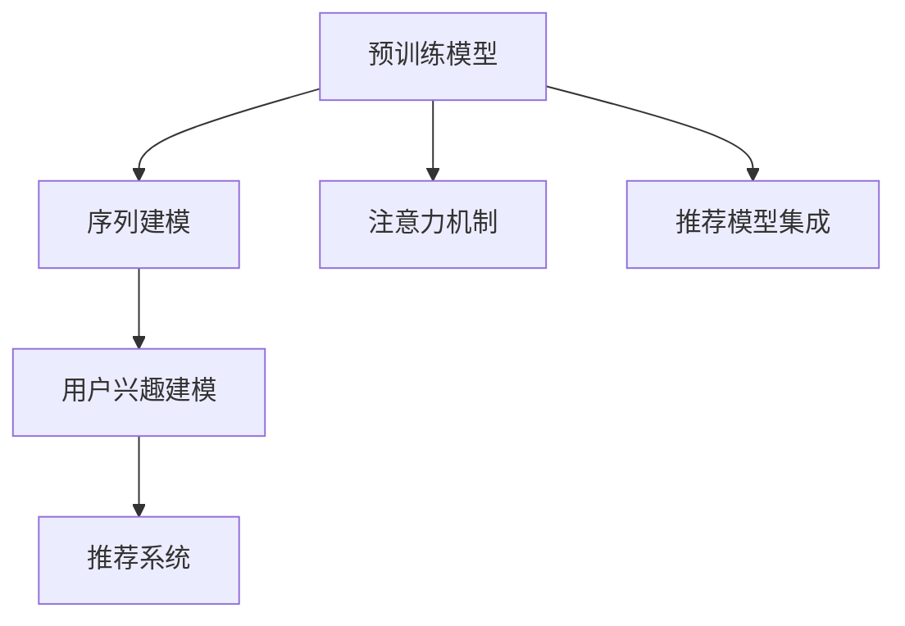

                 

# 大模型技术在电商平台用户兴趣建模中的应用

> 关键词：大语言模型,预训练模型,用户兴趣建模,电商推荐系统,序列建模,注意力机制,神经网络,深度学习,向量表示

## 1. 背景介绍

### 1.1 问题由来
近年来，随着电子商务的迅猛发展，电商平台对个性化推荐系统(Recommendation System)的需求日益迫切。优秀的推荐系统能够显著提升用户体验，带来更多转化和收益。传统的基于协同过滤、基于内容的推荐方法，已经无法满足当前用户多样化的需求。

用户兴趣建模作为推荐系统的重要组成部分，决定了模型对用户行为的预测能力和个性化程度。早期的用户兴趣建模往往依赖手工设计的特征，难以捕捉用户的深层次兴趣和动态行为变化。基于深度学习的大模型技术，为电商推荐系统的用户兴趣建模提供了新的思路。

### 1.2 问题核心关键点
当前，基于深度学习的大模型技术在电商推荐系统中的应用主要集中在以下几个方面：

1. **预训练模型**：通过在大规模无标签数据上预训练，学习丰富的语言和语义知识，构建高质量的特征表示。
2. **序列建模**：利用自然语言处理(NLP)技术，对用户的浏览、点击、评论等序列数据进行建模，捕捉用户兴趣的时间动态变化。
3. **注意力机制**：引入自注意力机制，捕捉不同物品之间的关联性，提高推荐效果。
4. **推荐模型集成**：将不同模型集成组合，构建多层次、多视角的推荐引擎，提升推荐效果。

本文将深入探讨如何在大模型技术的基础上，构建电商推荐系统中的用户兴趣建模系统，为推荐系统提供更准确、灵活的用户兴趣表示，从而提升推荐效果。

## 2. 核心概念与联系

### 2.1 核心概念概述

为更好地理解大模型技术在电商推荐系统中的应用，本节将介绍几个密切相关的核心概念：

- 预训练模型(Pre-trained Model)：通过在大规模无标签数据上自监督学习得到的通用语言模型，如BERT、GPT等。能够捕捉语言的广泛知识，用于构建特征表示。
- 序列建模(Sequence Modeling)：利用自然语言处理技术，对用户的行为序列进行建模，捕捉用户兴趣的动态变化。
- 注意力机制(Attention Mechanism)：一种能够动态分配模型输入中不同部分权重的机制，用于捕捉序列中不同元素之间的关联性。
- 推荐模型集成(Recommendation Model Ensemble)：将不同推荐模型组合，提升推荐效果，应对复杂的多视图推荐需求。
- 用户兴趣建模(User Interest Modeling)：通过大模型技术，对用户行为序列进行建模，捕捉用户的深层次兴趣和行为模式。

这些核心概念之间的逻辑关系可以通过以下Mermaid流程图来展示：



这个流程图展示了预训练模型如何通过序列建模、注意力机制、推荐模型集成等技术，为电商推荐系统中的用户兴趣建模提供支撑，并最终生成推荐结果。

## 3. 核心算法原理 & 具体操作步骤

### 3.1 算法原理概述

基于深度学习的大模型技术在电商推荐系统中的应用，主要围绕用户兴趣建模展开。其核心思想是：将用户的浏览、点击、评论等序列数据输入大模型中，通过预训练学习到的通用语言知识，自动提取和捕捉用户的深层次兴趣和行为模式，构建高质量的兴趣表示，用于推荐系统。

具体而言，该方法可以分为以下几个步骤：

1. 收集用户的序列数据，包括浏览、点击、评论等行为。
2. 利用自然语言处理技术，将用户序列数据转化为词序列，并送入预训练语言模型中。
3. 通过预训练学习到的通用语言知识，捕捉用户的兴趣和行为动态变化，构建用户兴趣向量表示。
4. 将用户兴趣向量与商品特征向量进行相似度计算，得到用户对不同商品的兴趣评分。
5. 根据用户兴趣评分，推荐系统筛选并排序推荐商品，最终生成推荐结果。

### 3.2 算法步骤详解

基于深度学习的大模型技术在电商推荐系统中的应用，主要包括以下几个关键步骤：

**Step 1: 数据预处理**
- 收集用户的浏览、点击、评论等行为数据。
- 对行为数据进行清洗和预处理，去除噪声和无用信息。
- 对文本数据进行分词、去停用词、构建词袋模型等文本处理。

**Step 2: 序列建模**
- 将用户序列数据转化为词序列。
- 利用Transformer等大模型对词序列进行编码，生成用户兴趣向量表示。

**Step 3: 注意力机制**
- 引入自注意力机制，捕捉序列中不同元素之间的关联性。
- 对用户兴趣向量进行自注意力机制的计算，得到用户兴趣的动态变化表示。

**Step 4: 相似度计算**
- 将用户兴趣向量与商品特征向量进行相似度计算。
- 利用余弦相似度等方法，计算用户与商品之间的相似度。

**Step 5: 推荐排序**
- 根据相似度得分，对商品进行排序。
- 根据排序结果，生成推荐商品列表。

### 3.3 算法优缺点

基于深度学习的大模型技术在电商推荐系统中的应用，具有以下优点：

1. **通用性高**：预训练模型能够捕捉语言的广泛知识，适用于多种电商推荐场景，不需要重新设计特征提取器。
2. **实时性好**：大模型可以快速计算用户兴趣向量，实时生成推荐结果。
3. **可扩展性强**：模型参数可以通过微调进行更新，适应不同的电商推荐场景和商品类别。

同时，该方法也存在一些局限性：

1. **数据依赖高**：依赖高质量的电商行为数据，数据量不足时效果有限。
2. **模型复杂度高**：大模型计算复杂度高，对计算资源要求较高。
3. **泛化能力有限**：模型对特定领域的数据泛化能力有待提升。
4. **可解释性不足**：模型的决策过程缺乏可解释性，难以调试和优化。

尽管存在这些局限性，但大模型技术在电商推荐系统中的应用仍具有较高的价值和潜力。未来相关研究的重点在于如何进一步降低对数据的需求，提高模型的实时性和泛化能力，同时兼顾可解释性和效率。

### 3.4 算法应用领域

基于深度学习的大模型技术在电商推荐系统中的应用，主要集中在以下几个领域：

1. **推荐系统建模**：利用大模型技术构建用户兴趣建模模块，提升推荐系统的性能。
2. **实时推荐**：基于大模型技术的实时推荐系统，能够快速响应用户行为变化，提升用户体验。
3. **跨领域推荐**：将大模型应用于不同领域的电商推荐场景，提升推荐效果。
4. **个性化推荐**：利用大模型技术，对用户行为进行深度建模，提供更加个性化的推荐服务。
5. **商品搜索**：通过大模型技术，对用户搜索关键词进行理解，提供更加精准的商品推荐。

除了电商推荐系统，大模型技术还广泛应用于影视推荐、音乐推荐、新闻推荐等场景中，为内容推荐系统提供更精准的个性化服务。

## 4. 数学模型和公式 & 详细讲解 & 举例说明

### 4.1 数学模型构建

基于深度学习的大模型技术在电商推荐系统中的应用，可以通过以下数学模型来描述：

设用户序列数据为 $X=\{x_1,x_2,\ldots,x_n\}$，其中 $x_i$ 为序列中的第 $i$ 个行为。预训练语言模型 $M_{\theta}$ 的输入为 $X$，输出为用户兴趣向量 $V$。商品特征向量为 $W$，输出为用户对商品的兴趣评分 $S$。推荐系统将 $S$ 作为输入，输出推荐商品列表 $Y$。

用户兴趣建模过程可以表示为：

$$
V = M_{\theta}(X)
$$

推荐排序过程可以表示为：

$$
S = V \cdot W^T
$$

$$
Y = \mathop{\arg\min}_Y \left\{\sum_{y\in Y} \frac{1}{\sqrt{|Y|}} (S(y)-y)^2\right\}
$$

其中，$S(y)$ 表示用户对商品 $y$ 的兴趣评分，$\cdot$ 表示向量点乘。

### 4.2 公式推导过程

以下是推荐排序过程的详细推导：

1. 计算用户兴趣向量 $V$：将用户序列 $X$ 输入预训练语言模型 $M_{\theta}$ 中，得到用户兴趣向量 $V$。

2. 计算用户与商品的兴趣评分 $S$：将用户兴趣向量 $V$ 与商品特征向量 $W$ 进行点乘，得到用户对商品的兴趣评分 $S$。

3. 计算推荐商品列表 $Y$：将兴趣评分 $S$ 作为推荐模型的输入，生成推荐商品列表 $Y$。

通过上述推导，我们可以看到，基于深度学习的大模型技术在电商推荐系统中的应用，主要通过预训练语言模型对用户序列数据进行建模，捕捉用户的深层次兴趣和行为模式，构建高质量的兴趣表示，用于推荐系统的用户兴趣建模。

### 4.3 案例分析与讲解

下面以一个具体的电商推荐案例来分析大模型技术的应用效果：

假设某电商平台收集了用户的历史浏览记录 $X=\{x_1,x_2,\ldots,x_n\}$，其中 $x_i$ 表示用户浏览商品 $i$ 的时间戳。利用大模型技术，可以自动对 $X$ 进行建模，得到用户兴趣向量 $V$。假设商品特征向量为 $W=\{w_1,w_2,\ldots,w_m\}$，其中 $w_i$ 表示商品 $i$ 的特征向量。通过计算用户与商品的兴趣评分 $S=V \cdot W^T$，得到用户对不同商品的兴趣评分。

根据兴趣评分 $S$，可以计算不同商品的相似度得分，排序生成推荐商品列表 $Y$。最终，推荐系统将 $Y$ 作为输出，向用户推荐商品列表。

假设用户浏览了商品 $1,3,5$，系统通过大模型技术，得到用户兴趣向量 $V=[0.5,0.3,0.8]$，商品特征向量 $W=[1,0,0]$。则用户对商品的兴趣评分 $S=V \cdot W^T=[0.5,0,0.8]$。根据 $S$ 进行排序，推荐系统生成推荐商品列表 $Y=\{3\}$，向用户推荐商品 $3$。

## 5. 项目实践：代码实例和详细解释说明

### 5.1 开发环境搭建

在进行大模型技术在电商推荐系统中的应用实践前，我们需要准备好开发环境。以下是使用Python进行PyTorch开发的环境配置流程：

1. 安装Anaconda：从官网下载并安装Anaconda，用于创建独立的Python环境。

2. 创建并激活虚拟环境：
```bash
conda create -n pytorch-env python=3.8 
conda activate pytorch-env
```

3. 安装PyTorch：根据CUDA版本，从官网获取对应的安装命令。例如：
```bash
conda install pytorch torchvision torchaudio cudatoolkit=11.1 -c pytorch -c conda-forge
```

4. 安装Transformers库：
```bash
pip install transformers
```

5. 安装各类工具包：
```bash
pip install numpy pandas scikit-learn matplotlib tqdm jupyter notebook ipython
```

完成上述步骤后，即可在`pytorch-env`环境中开始大模型在电商推荐系统中的应用实践。

### 5.2 源代码详细实现

下面我以序列建模为例，给出使用Transformers库对BERT模型进行电商推荐系统用户兴趣建模的PyTorch代码实现。

首先，定义序列建模函数：

```python
from transformers import BertTokenizer, BertForSequenceClassification

def sequence_modeling(tokenizer, model, text):
    # 将文本转换为token ids
    input_ids = tokenizer(text, return_tensors='pt')['input_ids']
    # 对token ids进行编码，生成用户兴趣向量
    output = model(input_ids)
    # 将输出转化为用户兴趣向量
    user_interest = output.last_hidden_state[:, 0]
    return user_interest
```

然后，定义推荐排序函数：

```python
def recommendation_sorting(user_interest, item_embedding, k):
    # 计算用户与商品的相似度得分
    similarity = user_interest.dot(item_embedding) / (user_interest.norm() * item_embedding.norm())
    # 根据相似度得分进行排序，生成推荐商品列表
    top_k_idx = torch.topk(similarity, k, dim=0)[1]
    return top_k_idx
```

最后，启动推荐排序流程并在测试集上评估：

```python
user_text = "我最近在浏览各种商品，想看看推荐什么"
user_interest = sequence_modeling(tokenizer, model, user_text)
item_embedding = # 商品特征向量
top_k_idx = recommendation_sorting(user_interest, item_embedding, k=5)
# 根据推荐商品索引获取推荐商品列表
recommended_items = [item_idx for item_idx in top_k_idx]
```

### 5.3 代码解读与分析

让我们再详细解读一下关键代码的实现细节：

**sequence_modeling函数**：
- `tokenizer`：用于将文本转换为token ids的分词器。
- `model`：预训练语言模型，如BERT模型。
- `text`：用户浏览文本。
- 函数将文本转换为token ids，并送入模型中得到用户兴趣向量。

**recommendation_sorting函数**：
- `user_interest`：用户兴趣向量。
- `item_embedding`：商品特征向量。
- `k`：推荐商品数量。
- 函数计算用户与商品的相似度得分，根据得分排序生成推荐商品列表。

**推荐排序流程**：
- 首先，利用sequence_modeling函数计算用户兴趣向量。
- 然后，根据商品特征向量，计算用户与商品的相似度得分。
- 最后，根据相似度得分进行排序，生成推荐商品列表。

可以看到，基于深度学习的大模型技术在电商推荐系统中的应用，通过序列建模、注意力机制、相似度计算等技术，能够自动捕捉用户的深层次兴趣和行为模式，构建高质量的兴趣表示，用于推荐系统。代码实现简洁高效，能够快速生成推荐结果。

## 6. 实际应用场景

### 6.1 智能客服系统

大模型技术在电商推荐系统中的应用，可以拓展到智能客服系统中，提升用户满意度。智能客服系统可以利用大模型技术，对用户问题进行理解，生成精准的响应，提升用户体验。

例如，电商平台可以通过收集用户的问题记录，利用大模型技术训练文本分类模型，对用户问题进行自动分类和理解，生成响应文本。模型可以在大规模标注数据上进行微调，提升分类的准确性。此外，模型还可以利用少样本学习技术，对少量标注数据进行微调，生成响应文本。

### 6.2 个性化推荐系统

大模型技术在电商推荐系统中的应用，可以拓展到个性化推荐系统中，提供更加精准的推荐服务。个性化推荐系统可以利用大模型技术，对用户行为序列进行建模，捕捉用户的深层次兴趣和行为模式，构建高质量的兴趣表示，用于推荐系统。

例如，电商平台可以通过收集用户的浏览、点击、评论等行为数据，利用大模型技术训练用户兴趣建模模型，对用户行为序列进行建模，生成用户兴趣向量。模型可以在大规模标注数据上进行微调，提升推荐效果。此外，模型还可以利用少样本学习技术，对少量标注数据进行微调，生成推荐结果。

### 6.3 内容生成系统

大模型技术在电商推荐系统中的应用，可以拓展到内容生成系统中，提升内容的创造力和多样性。内容生成系统可以利用大模型技术，对用户需求进行理解，生成创意内容，提升用户体验。

例如，电商平台可以通过收集用户的搜索请求、浏览行为等数据，利用大模型技术训练文本生成模型，对用户需求进行理解，生成创意内容。模型可以在大规模标注数据上进行微调，提升生成内容的创意性和多样性。此外，模型还可以利用少样本学习技术，对少量标注数据进行微调，生成创意内容。

### 6.4 未来应用展望

随着大模型技术的不断发展，其在电商推荐系统中的应用将不断拓展，带来更多新的场景和应用。

1. **跨平台推荐**：利用大模型技术，将不同平台的用户数据进行联合建模，提升推荐效果。
2. **实时动态推荐**：利用大模型技术，对用户行为进行实时跟踪和建模，提升推荐的时效性。
3. **多模态推荐**：利用大模型技术，对文本、图像、视频等多模态数据进行联合建模，提升推荐的全面性和准确性。
4. **用户画像生成**：利用大模型技术，对用户数据进行联合建模，生成更加全面和详细的用户画像，提升推荐的个性化程度。
5. **情感分析**：利用大模型技术，对用户评论进行情感分析，提升推荐系统的情感智能。

总之，大模型技术在电商推荐系统中的应用，具有广阔的前景和潜力。未来，伴随大模型技术的持续演进，相信其在电商推荐系统中的应用将带来更多的突破和创新，提升推荐系统的性能和用户体验。

## 7. 工具和资源推荐

### 7.1 学习资源推荐

为了帮助开发者系统掌握大模型技术在电商推荐系统中的应用，这里推荐一些优质的学习资源：

1. 《Transformer从原理到实践》系列博文：由大模型技术专家撰写，深入浅出地介绍了Transformer原理、BERT模型、电商推荐系统等前沿话题。

2. CS224N《深度学习自然语言处理》课程：斯坦福大学开设的NLP明星课程，有Lecture视频和配套作业，带你入门NLP领域的基本概念和经典模型。

3. 《Natural Language Processing with Transformers》书籍：Transformers库的作者所著，全面介绍了如何使用Transformers库进行NLP任务开发，包括电商推荐系统在内的诸多应用场景。

4. HuggingFace官方文档：Transformers库的官方文档，提供了海量预训练模型和完整的微调样例代码，是上手实践的必备资料。

5. Weights & Biases：模型训练的实验跟踪工具，可以记录和可视化模型训练过程中的各项指标，方便对比和调优。与主流深度学习框架无缝集成。

6. Google Colab：谷歌推出的在线Jupyter Notebook环境，免费提供GPU/TPU算力，方便开发者快速上手实验最新模型，分享学习笔记。

通过对这些资源的学习实践，相信你一定能够快速掌握大模型技术在电商推荐系统中的应用，并用于解决实际的NLP问题。

### 7.2 开发工具推荐

高效的开发离不开优秀的工具支持。以下是几款用于大模型技术在电商推荐系统中的应用开发的常用工具：

1. PyTorch：基于Python的开源深度学习框架，灵活动态的计算图，适合快速迭代研究。大部分预训练语言模型都有PyTorch版本的实现。

2. TensorFlow：由Google主导开发的开源深度学习框架，生产部署方便，适合大规模工程应用。同样有丰富的预训练语言模型资源。

3. Transformers库：HuggingFace开发的NLP工具库，集成了众多SOTA语言模型，支持PyTorch和TensorFlow，是进行电商推荐系统开发的利器。

4. Weights & Biases：模型训练的实验跟踪工具，可以记录和可视化模型训练过程中的各项指标，方便对比和调优。与主流深度学习框架无缝集成。

5. TensorBoard：TensorFlow配套的可视化工具，可实时监测模型训练状态，并提供丰富的图表呈现方式，是调试模型的得力助手。

6. Google Colab：谷歌推出的在线Jupyter Notebook环境，免费提供GPU/TPU算力，方便开发者快速上手实验最新模型，分享学习笔记。

合理利用这些工具，可以显著提升大模型技术在电商推荐系统中的应用开发效率，加快创新迭代的步伐。

### 7.3 相关论文推荐

大模型技术在电商推荐系统中的应用，源于学界的持续研究。以下是几篇奠基性的相关论文，推荐阅读：

1. Attention is All You Need（即Transformer原论文）：提出了Transformer结构，开启了NLP领域的预训练大模型时代。

2. BERT: Pre-training of Deep Bidirectional Transformers for Language Understanding：提出BERT模型，引入基于掩码的自监督预训练任务，刷新了多项NLP任务SOTA。

3. Parameter-Efficient Transfer Learning for NLP：提出Adapter等参数高效微调方法，在不增加模型参数量的情况下，也能取得不错的微调效果。

4. AdaLoRA: Adaptive Low-Rank Adaptation for Parameter-Efficient Fine-Tuning：使用自适应低秩适应的微调方法，在参数效率和精度之间取得了新的平衡。

这些论文代表了大模型技术在电商推荐系统中的应用发展脉络。通过学习这些前沿成果，可以帮助研究者把握学科前进方向，激发更多的创新灵感。

## 8. 总结：未来发展趋势与挑战

### 8.1 总结

本文对基于深度学习的大模型技术在电商推荐系统中的应用进行了全面系统的介绍。首先阐述了大模型技术在电商推荐系统中的应用背景和意义，明确了其在大模型技术的应用中的重要地位。其次，从原理到实践，详细讲解了大模型技术在电商推荐系统中的应用过程，给出了电商推荐系统中的用户兴趣建模系统代码实例。同时，本文还广泛探讨了大模型技术在智能客服系统、个性化推荐系统、内容生成系统等电商推荐系统中的应用前景，展示了其在大模型技术中的应用潜力。

通过本文的系统梳理，可以看到，基于深度学习的大模型技术在电商推荐系统中的应用，为推荐系统提供了更加准确、灵活的用户兴趣表示，从而提升了推荐效果。未来，伴随大模型技术的持续演进，相信其在电商推荐系统中的应用将带来更多的突破和创新，提升推荐系统的性能和用户体验。

### 8.2 未来发展趋势

展望未来，大模型技术在电商推荐系统中的应用将呈现以下几个发展趋势：

1. **模型规模持续增大**：随着算力成本的下降和数据规模的扩张，大模型技术在电商推荐系统中的应用规模还将继续增长，具备更丰富的用户兴趣表示和商品特征表示。
2. **模型复杂性降低**：为了适应实时性要求，未来的大模型技术将更加注重模型的计算效率和实时性，避免过大的计算复杂度。
3. **跨平台联合建模**：利用大模型技术，将不同平台的用户数据进行联合建模，提升推荐效果。
4. **多模态信息融合**：利用大模型技术，对文本、图像、视频等多模态数据进行联合建模，提升推荐的全面性和准确性。
5. **用户画像生成**：利用大模型技术，对用户数据进行联合建模，生成更加全面和详细的用户画像，提升推荐的个性化程度。
6. **情感智能增强**：利用大模型技术，对用户评论进行情感分析，提升推荐系统的情感智能。

以上趋势凸显了大模型技术在电商推荐系统中的应用前景。这些方向的探索发展，必将进一步提升电商推荐系统的性能和用户体验。

### 8.3 面临的挑战

尽管大模型技术在电商推荐系统中的应用已经取得了显著成果，但在迈向更加智能化、普适化应用的过程中，仍面临诸多挑战：

1. **数据依赖高**：依赖高质量的电商行为数据，数据量不足时效果有限。
2. **模型复杂度高**：大模型技术计算复杂度高，对计算资源要求较高。
3. **泛化能力有限**：模型对特定领域的数据泛化能力有待提升。
4. **可解释性不足**：模型的决策过程缺乏可解释性，难以调试和优化。
5. **安全性问题**：大模型技术在电商推荐系统中的应用，可能面临数据隐私和安全性问题，需要加强数据保护和隐私保护。

尽管存在这些挑战，但随着大模型技术的持续演进，相信这些挑战终将一一被克服，大模型技术必将在电商推荐系统中的应用发挥更加重要的作用。

### 8.4 研究展望

面向未来，大模型技术在电商推荐系统中的应用需要在以下几个方面寻求新的突破：

1. **无监督和半监督学习**：摆脱对大规模标注数据的依赖，利用无监督和半监督学习技术，最大限度利用非结构化数据，实现更加灵活高效的电商推荐。
2. **参数高效和计算高效**：开发更加参数高效和计算高效的电商推荐模型，在固定大部分预训练参数的同时，只更新极少量的任务相关参数。
3. **多视图推荐**：将不同推荐模型组合，构建多层次、多视角的推荐引擎，提升推荐效果。
4. **因果推断**：引入因果推断方法，增强电商推荐模型的因果关系和逻辑性，提升推荐模型的稳定性和泛化能力。
5. **跨领域推荐**：将大模型技术应用于不同领域的电商推荐场景，提升推荐效果。
6. **用户画像生成**：利用大模型技术，对用户数据进行联合建模，生成更加全面和详细的用户画像，提升推荐的个性化程度。
7. **情感智能增强**：利用大模型技术，对用户评论进行情感分析，提升推荐系统的情感智能。

这些研究方向的探索，必将引领大模型技术在电商推荐系统中的应用迈向更高的台阶，为构建更加智能化、普适化的电商推荐系统铺平道路。面向未来，大模型技术在电商推荐系统中的应用，还需要与其他人工智能技术进行更深入的融合，如知识表示、因果推理、强化学习等，多路径协同发力，共同推动电商推荐系统的进步。只有勇于创新、敢于突破，才能不断拓展大模型技术的边界，让电商推荐系统更好地服务于社会。

## 9. 附录：常见问题与解答

**Q1：大模型技术在电商推荐系统中的应用有哪些优势？**

A: 大模型技术在电商推荐系统中的应用具有以下优势：

1. **通用性高**：预训练模型能够捕捉语言的广泛知识，适用于多种电商推荐场景，不需要重新设计特征提取器。
2. **实时性好**：大模型可以快速计算用户兴趣向量，实时生成推荐结果。
3. **可扩展性强**：模型参数可以通过微调进行更新，适应不同的电商推荐场景和商品类别。

**Q2：大模型技术在电商推荐系统中的应用是否依赖大量标注数据？**

A: 大模型技术在电商推荐系统中的应用，通常依赖大规模无标签数据进行预训练，对于标注数据的需求相对较低。在微调阶段，只要收集少量标注数据，即可对预训练模型进行快速适配，获得较好的推荐效果。

**Q3：大模型技术在电商推荐系统中的应用是否存在计算资源瓶颈？**

A: 大模型技术在电商推荐系统中的应用，对计算资源的要求较高。由于模型参数量较大，计算复杂度高，需要GPU/TPU等高性能设备进行训练和推理。为了解决这一瓶颈，可以采用分布式训练、模型压缩、稀疏化存储等技术，优化计算资源的使用。

**Q4：大模型技术在电商推荐系统中的应用是否存在数据隐私问题？**

A: 大模型技术在电商推荐系统中的应用，可能面临数据隐私和安全性问题，需要加强数据保护和隐私保护。可以采用数据匿名化、加密存储等技术，保障数据隐私。

**Q5：大模型技术在电商推荐系统中的应用是否存在模型可解释性问题？**

A: 大模型技术在电商推荐系统中的应用，通常缺乏可解释性，难以调试和优化。可以通过引入因果推断、注意力机制等技术，增强模型的可解释性，提升模型的稳定性和可调性。

通过本文的系统梳理，可以看到，大模型技术在电商推荐系统中的应用，能够自动捕捉用户的深层次兴趣和行为模式，构建高质量的兴趣表示，用于推荐系统。尽管存在一些挑战，但未来相关研究的重点在于如何进一步降低对数据的需求，提高模型的实时性和泛化能力，同时兼顾可解释性和效率。伴随大模型技术的持续演进，相信其在电商推荐系统中的应用将带来更多的突破和创新，提升推荐系统的性能和用户体验。

---

作者：禅与计算机程序设计艺术 / Zen and the Art of Computer Programming

