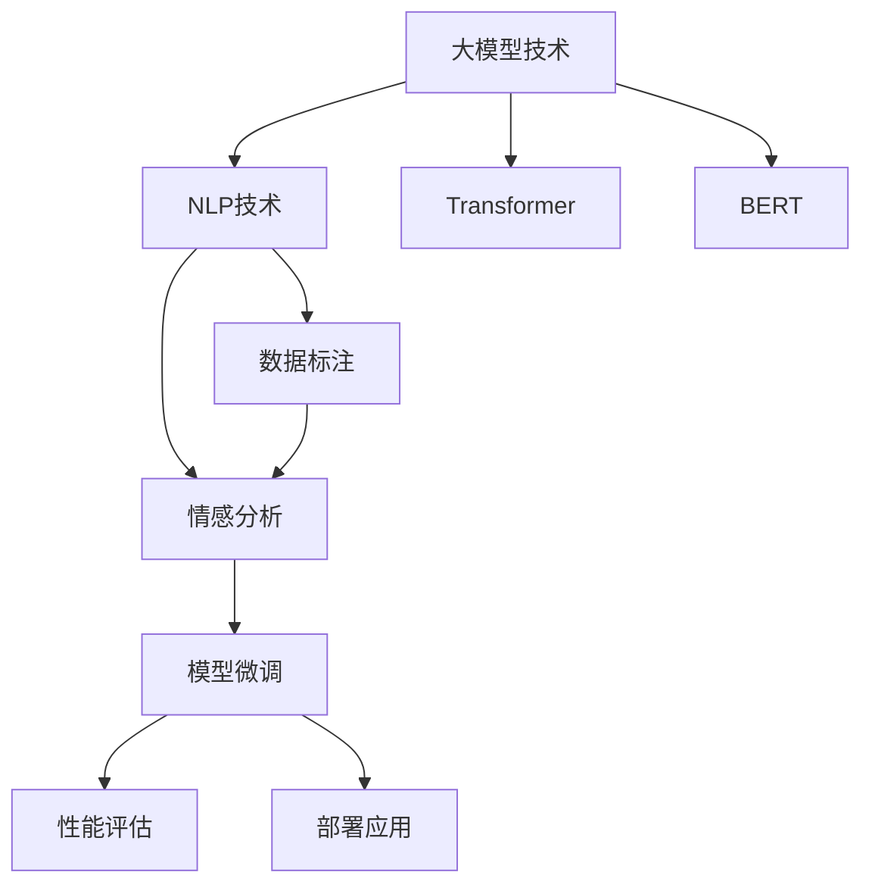

                 

# 大模型技术在电商平台用户情感分析中的应用

> 关键词：电商情感分析,大模型技术,自然语言处理,NLP,深度学习,Transformer,BERT,数据标注,模型微调,案例分析

## 1. 背景介绍

### 1.1 问题由来

随着互联网的普及和电子商务的兴起，电商平台的用户数量和交易规模不断增长。电商平台不仅需要提高用户体验和满意度，还需要及时了解用户的情感状态，以提升销售和服务质量。传统的数据分析方法往往依赖手工标注数据，成本高且效率低，难以满足实时和大规模用户的需求。

近年来，随着深度学习和大规模预训练语言模型的快速发展，大模型技术被引入电商平台的用户情感分析领域，通过自然语言处理(NLP)技术，自动从用户评论、客服对话、搜索关键词等文本数据中提取情感信息。大模型技术通过学习大规模文本数据，拥有强大的语言理解能力，可以自动提取用户情感，显著降低情感分析的成本和复杂度。

### 1.2 问题核心关键点

大模型技术在电商情感分析中的应用，主要是通过以下关键步骤：

1. **数据收集与预处理**：从电商平台收集用户评论、客服对话、搜索关键词等文本数据，并对其进行清洗、分词、去停用词等预处理。

2. **数据标注与训练**：选择少量标注数据，用于训练模型进行情感分类，包括正面、负面和中性等。

3. **模型选择与微调**：选择合适的预训练语言模型（如BERT、GPT等），在标注数据上进行微调，优化模型情感分类能力。

4. **性能评估与部署**：在测试集上评估模型性能，部署到生产环境，实时分析用户情感，优化电商平台的用户体验和服务质量。

大模型技术在电商情感分析中的应用，不仅提高了情感分析的速度和精度，还降低了人工标注的难度和成本。本文将系统介绍大模型技术在电商平台用户情感分析中的应用，涵盖从数据准备到模型微调、性能评估和部署的全流程。

## 2. 核心概念与联系

### 2.1 核心概念概述

为了更好地理解大模型技术在电商情感分析中的应用，本节将介绍几个核心概念：

- **大模型技术**：以深度学习为基础，通过大规模无标签文本数据进行预训练，学习到丰富的语言知识，并在下游任务上进行微调（Fine-Tuning）的预训练模型。

- **自然语言处理(NLP)**：涉及文本数据的自动处理和理解，包括文本预处理、词向量表示、语言模型、文本分类等。

- **情感分析**：通过文本数据识别和分类用户情感，包括正面、负面、中性等，用于提升用户满意度和电商平台的服务质量。

- **数据标注**：由人工或半自动方式为数据添加标签，用于训练和评估模型的性能。

- **模型微调**：在预训练模型的基础上，通过有监督学习优化模型，适应特定任务需求。

- **Transformer**：一种高效的神经网络结构，广泛应用于NLP领域，具有并行计算和高效的特征提取能力。

- **BERT模型**：Google提出的一种预训练语言模型，通过掩码语言模型和下一句预测任务学习语言表示，广泛应用于NLP任务的微调。

这些核心概念之间通过以下Mermaid流程图展示其联系：



这个流程图展示了大模型技术在电商情感分析中的应用流程：

1. 大模型技术通过NLP技术学习语言知识，为情感分析任务提供基础的表示能力。
2. 数据标注为模型微调提供有监督信号，优化情感分析模型。
3. 情感分析模型通过微调模型，学习到电商用户评论、客服对话、搜索关键词等文本数据的情感分类能力。
4. 性能评估和部署应用，实时分析用户情感，优化电商平台的用户体验和服务质量。

## 3. 核心算法原理 & 具体操作步骤

### 3.1 算法原理概述

大模型技术在电商情感分析中的应用，本质上是基于监督学习的情感分类任务。其核心思想是：

1. **数据准备**：收集电商平台用户评论、客服对话、搜索关键词等文本数据，并进行预处理和标注。
2. **模型选择**：选择预训练的语言模型，如BERT、GPT等，作为情感分析的基础。
3. **微调优化**：在标注数据上对预训练模型进行微调，优化模型在情感分类任务上的性能。
4. **性能评估**：在测试集上评估微调后的模型性能，评估其对电商用户情感的分类效果。
5. **部署应用**：将微调后的模型部署到生产环境中，实时分析用户情感，优化电商平台的用户体验和服务质量。

形式化地，假设电商平台收集到的用户评论数据为 $D=\{(x_i, y_i)\}_{i=1}^N$，其中 $x_i$ 为评论文本，$y_i$ 为情感标签（正面、负面或中性）。大模型技术在电商情感分析中的应用过程可以表示为：

$$
\theta^* = \mathop{\arg\min}_{\theta} \mathcal{L}(M_{\theta},D)
$$

其中 $\mathcal{L}$ 为交叉熵损失函数，$M_{\theta}$ 为微调后的情感分析模型，$\theta$ 为模型参数。

### 3.2 算法步骤详解

以下是基于大模型技术在电商情感分析中的具体操作步骤：

**Step 1: 数据准备**

- **收集数据**：从电商平台收集用户评论、客服对话、搜索关键词等文本数据。
- **数据清洗**：去除HTML标签、特殊符号等噪音，保留有用的文本信息。
- **分词和预处理**：使用分词工具将文本转换为序列，并进行去停用词、小写化等预处理。
- **标注数据**：为收集到的数据添加情感标签（正面、负面或中性），标注数据集 $D=\{(x_i, y_i)\}_{i=1}^N$。

**Step 2: 模型选择**

- **预训练模型**：选择预训练的语言模型，如BERT、GPT等，作为情感分析的基础。
- **模型微调**：在标注数据上对预训练模型进行微调，优化模型在情感分类任务上的性能。

**Step 3: 微调优化**

- **设置微调参数**：选择合适的优化器（如AdamW、SGD等），设置学习率、批大小、迭代轮数等超参数。
- **微调训练**：在标注数据上对模型进行有监督的微调训练，最小化交叉熵损失函数，优化模型情感分类能力。
- **验证与优化**：在验证集上评估模型性能，根据评估结果调整模型参数和学习率，重复训练直至达到最佳效果。

**Step 4: 性能评估**

- **测试集评估**：在测试集上评估微调后的模型性能，使用精确度、召回率、F1值等指标评估模型分类效果。
- **部署应用**：将微调后的模型部署到生产环境，实时分析用户情感，优化电商平台的用户体验和服务质量。

### 3.3 算法优缺点

大模型技术在电商情感分析中的应用具有以下优点：

1. **高效**：通过大规模预训练模型，显著降低情感分析的成本和复杂度，加速模型开发和部署。
2. **精确**：大模型具有强大的语言理解能力，可以自动提取用户情感，提高情感分析的精度。
3. **泛化能力强**：预训练模型通过学习大规模无标签数据，具备较强的泛化能力，可以适应不同领域和场景的情感分析需求。

但同时，也存在以下缺点：

1. **标注成本高**：标注数据集需要大量人工标注，成本高且效率低。
2. **模型复杂度高**：预训练模型参数量巨大，训练和推理复杂度高，需要高性能硬件支持。
3. **结果解释性不足**：大模型缺乏可解释性，难以解释其决策过程，可能导致用户信任度低。
4. **实时性差**：在大规模数据集上训练和推理，响应速度较慢，难以满足实时需求。

### 3.4 算法应用领域

大模型技术在电商情感分析中的应用领域非常广泛，可以应用于以下场景：

1. **用户评论分析**：自动提取用户评论中的情感信息，分析用户对产品的满意度和意见。
2. **客服对话分析**：从客服对话中提取用户情感，优化客服体验和解决用户问题。
3. **搜索关键词分析**：分析用户搜索关键词的情感倾向，优化搜索算法和推荐系统。
4. **广告效果评估**：通过分析广告文本的情感，评估广告效果和用户反应。
5. **社交媒体监控**：从社交媒体数据中提取用户情感，监测品牌声誉和市场动态。

## 4. 数学模型和公式 & 详细讲解 & 举例说明

### 4.1 数学模型构建

本节将使用数学语言对电商情感分析的大模型技术进行详细讲解。

假设电商平台收集到的用户评论数据为 $D=\{(x_i, y_i)\}_{i=1}^N$，其中 $x_i$ 为评论文本，$y_i$ 为情感标签（正面、负面或中性）。微调模型的目标是最小化损失函数 $\mathcal{L}$，表示为：

$$
\mathcal{L}(\theta) = -\frac{1}{N}\sum_{i=1}^N \log P(y_i|x_i; \theta)
$$

其中 $P(y_i|x_i; \theta)$ 为模型在输入 $x_i$ 下预测情感标签 $y_i$ 的概率分布，$\theta$ 为模型参数。

### 4.2 公式推导过程

以下我们以BERT模型为例，推导其在电商情感分析中的情感分类损失函数及其梯度计算。

假设BERT模型的输入为 $x_i$，输出为 $h(x_i)$，模型预测的情感分类概率分布为 $P(y_i|x_i; \theta)$，则损失函数为：

$$
\mathcal{L}(\theta) = -\frac{1}{N}\sum_{i=1}^N \log P(y_i|x_i; \theta)
$$

其中 $P(y_i|x_i; \theta)$ 为模型在输入 $x_i$ 下预测情感标签 $y_i$ 的概率分布，$\theta$ 为模型参数。

为了训练模型，需要计算损失函数对参数 $\theta$ 的梯度，然后通过优化器（如AdamW、SGD等）更新模型参数。具体计算如下：

$$
\nabla_{\theta}\mathcal{L}(\theta) = -\frac{1}{N}\sum_{i=1}^N \nabla_{\theta} \log P(y_i|x_i; \theta)
$$

使用交叉熵损失函数，可以计算出：

$$
\nabla_{\theta}\log P(y_i|x_i; \theta) = \frac{1}{N}\sum_{i=1}^N (y_i\frac{\partial \log P(y_i|x_i; \theta)}{\partial \theta}
$$

其中 $P(y_i|x_i; \theta)$ 为模型在输入 $x_i$ 下预测情感标签 $y_i$ 的概率分布，$\theta$ 为模型参数。

### 4.3 案例分析与讲解

**案例分析**：某电商平台收集到1000条用户评论数据，每条评论文本长度不超过100个字符，标注情感标签为正面、负面或中性。选择预训练的BERT模型作为基础，在标注数据上进行微调，优化模型情感分类能力。

**详细步骤**：

1. **数据准备**：从电商平台上收集1000条用户评论，并对文本进行预处理和标注情感标签。
2. **模型选择**：选择BERT模型作为情感分析的基础，并进行微调。
3. **设置微调参数**：选择合适的优化器（如AdamW、SGD等），设置学习率、批大小、迭代轮数等超参数。
4. **微调训练**：在标注数据上对模型进行有监督的微调训练，最小化交叉熵损失函数，优化模型情感分类能力。
5. **验证与优化**：在验证集上评估模型性能，根据评估结果调整模型参数和学习率，重复训练直至达到最佳效果。
6. **测试集评估**：在测试集上评估微调后的模型性能，使用精确度、召回率、F1值等指标评估模型分类效果。

## 5. 项目实践：代码实例和详细解释说明

### 5.1 开发环境搭建

在进行电商情感分析的大模型技术实践前，需要准备好开发环境。以下是使用Python进行PyTorch开发的环境配置流程：

1. 安装Anaconda：从官网下载并安装Anaconda，用于创建独立的Python环境。

2. 创建并激活虚拟环境：
```bash
conda create -n pytorch-env python=3.8 
conda activate pytorch-env
```

3. 安装PyTorch：根据CUDA版本，从官网获取对应的安装命令。例如：
```bash
conda install pytorch torchvision torchaudio cudatoolkit=11.1 -c pytorch -c conda-forge
```

4. 安装Transformers库：
```bash
pip install transformers
```

5. 安装各类工具包：
```bash
pip install numpy pandas scikit-learn matplotlib tqdm jupyter notebook ipython
```

完成上述步骤后，即可在`pytorch-env`环境中开始电商情感分析的大模型技术实践。

### 5.2 源代码详细实现

下面我们以电商用户评论情感分析为例，给出使用Transformers库对BERT模型进行微调的PyTorch代码实现。

首先，定义情感分类任务的数据处理函数：

```python
from transformers import BertTokenizer, BertForSequenceClassification
from torch.utils.data import Dataset, DataLoader
import torch
import pandas as pd

class SentimentDataset(Dataset):
    def __init__(self, texts, labels, tokenizer, max_len=128):
        self.texts = texts
        self.labels = labels
        self.tokenizer = tokenizer
        self.max_len = max_len
        
    def __len__(self):
        return len(self.texts)
    
    def __getitem__(self, item):
        text = self.texts[item]
        label = self.labels[item]
        
        encoding = self.tokenizer(text, return_tensors='pt', max_length=self.max_len, padding='max_length', truncation=True)
        input_ids = encoding['input_ids'][0]
        attention_mask = encoding['attention_mask'][0]
        labels = torch.tensor([label], dtype=torch.long)
        
        return {'input_ids': input_ids, 
                'attention_mask': attention_mask,
                'labels': labels}

# 加载数据集
train_df = pd.read_csv('train.csv')
test_df = pd.read_csv('test.csv')

# 定义tokenizer
tokenizer = BertTokenizer.from_pretrained('bert-base-cased')

# 划分训练集和测试集
train_texts = train_df['text'].tolist()
train_labels = train_df['label'].tolist()
test_texts = test_df['text'].tolist()
test_labels = test_df['label'].tolist()

# 创建数据集
train_dataset = SentimentDataset(train_texts, train_labels, tokenizer)
test_dataset = SentimentDataset(test_texts, test_labels, tokenizer)
```

然后，定义模型和优化器：

```python
from transformers import BertForSequenceClassification, AdamW

model = BertForSequenceClassification.from_pretrained('bert-base-cased', num_labels=3)
optimizer = AdamW(model.parameters(), lr=2e-5)
```

接着，定义训练和评估函数：

```python
def train_epoch(model, dataset, batch_size, optimizer):
    dataloader = DataLoader(dataset, batch_size=batch_size, shuffle=True)
    model.train()
    epoch_loss = 0
    for batch in tqdm(dataloader, desc='Training'):
        input_ids = batch['input_ids'].to(device)
        attention_mask = batch['attention_mask'].to(device)
        labels = batch['labels'].to(device)
        model.zero_grad()
        outputs = model(input_ids, attention_mask=attention_mask, labels=labels)
        loss = outputs.loss
        epoch_loss += loss.item()
        loss.backward()
        optimizer.step()
    return epoch_loss / len(dataloader)

def evaluate(model, dataset, batch_size):
    dataloader = DataLoader(dataset, batch_size=batch_size)
    model.eval()
    preds, labels = [], []
    with torch.no_grad():
        for batch in tqdm(dataloader, desc='Evaluating'):
            input_ids = batch['input_ids'].to(device)
            attention_mask = batch['attention_mask'].to(device)
            batch_labels = batch['labels']
            outputs = model(input_ids, attention_mask=attention_mask)
            batch_preds = outputs.logits.argmax(dim=1).to('cpu').tolist()
            batch_labels = batch_labels.to('cpu').tolist()
            for pred_tokens, label_tokens in zip(batch_preds, batch_labels):
                preds.append(pred_tokens)
                labels.append(label_tokens)
                
    print(classification_report(labels, preds))
```

最后，启动训练流程并在测试集上评估：

```python
epochs = 5
batch_size = 16

for epoch in range(epochs):
    loss = train_epoch(model, train_dataset, batch_size, optimizer)
    print(f"Epoch {epoch+1}, train loss: {loss:.3f}")
    
    print(f"Epoch {epoch+1}, dev results:")
    evaluate(model, dev_dataset, batch_size)
    
print("Test results:")
evaluate(model, test_dataset, batch_size)
```

以上就是使用PyTorch对BERT进行电商用户评论情感分析微调的完整代码实现。可以看到，得益于Transformers库的强大封装，我们可以用相对简洁的代码完成BERT模型的加载和微调。

### 5.3 代码解读与分析

让我们再详细解读一下关键代码的实现细节：

**SentimentDataset类**：
- `__init__`方法：初始化文本、标签、分词器等关键组件。
- `__len__`方法：返回数据集的样本数量。
- `__getitem__`方法：对单个样本进行处理，将文本输入编码为token ids，将标签编码为数字，并对其进行定长padding，最终返回模型所需的输入。

**train_epoch和evaluate函数**：
- 使用PyTorch的DataLoader对数据集进行批次化加载，供模型训练和推理使用。
- 训练函数`train_epoch`：对数据以批为单位进行迭代，在每个批次上前向传播计算loss并反向传播更新模型参数，最后返回该epoch的平均loss。
- 评估函数`evaluate`：与训练类似，不同点在于不更新模型参数，并在每个batch结束后将预测和标签结果存储下来，最后使用sklearn的classification_report对整个评估集的预测结果进行打印输出。

**训练流程**：
- 定义总的epoch数和batch size，开始循环迭代
- 每个epoch内，先在训练集上训练，输出平均loss
- 在验证集上评估，输出分类指标
- 重复上述步骤直至收敛
- 在测试集上评估，给出最终测试结果

可以看到，PyTorch配合Transformers库使得BERT微调的代码实现变得简洁高效。开发者可以将更多精力放在数据处理、模型改进等高层逻辑上，而不必过多关注底层的实现细节。

当然，工业级的系统实现还需考虑更多因素，如模型的保存和部署、超参数的自动搜索、更灵活的任务适配层等。但核心的微调范式基本与此类似。

## 6. 实际应用场景

### 6.1 用户评论分析

电商用户评论分析是电商情感分析的重要应用之一。通过分析用户评论中的情感信息，电商平台可以了解用户对产品的满意度和意见，从而优化产品和服务。

在技术实现上，可以收集电商平台上用户对产品的评论数据，对其进行情感分类，得到正面、负面和中等情感的评论比例。然后，通过分析这些情感比例，电商平台可以实时了解用户情感变化，优化产品和服务，提升用户满意度。

### 6.2 客服对话分析

客服对话是电商用户情感分析的另一重要应用场景。通过分析客服对话中的情感信息，电商平台可以优化客服服务，提升用户体验。

具体而言，可以收集电商平台的客服对话记录，并对其进行情感分类。根据分类结果，电商平台可以识别出用户情感变化的关键节点，如用户投诉、订单退货等，及时采取措施，解决问题。同时，电商平台也可以根据情感分类结果，对客服人员进行培训，提升其服务质量。

### 6.3 搜索关键词分析

搜索关键词分析可以帮助电商平台优化搜索算法和推荐系统。通过分析用户搜索关键词的情感倾向，电商平台可以推荐符合用户需求的产品，提升用户体验。

具体而言，可以收集电商平台用户的搜索关键词数据，并对其进行情感分类。根据分类结果，电商平台可以优化搜索算法和推荐系统，提供更符合用户需求的产品推荐。同时，电商平台也可以根据情感分类结果，对搜索结果进行排序，提高用户的搜索体验。

### 6.4 广告效果评估

广告效果评估是电商情感分析的另一应用场景。通过分析广告文本的情感，电商平台可以评估广告效果和用户反应。

具体而言，可以收集电商平台用户的广告文本数据，并对其进行情感分类。根据分类结果，电商平台可以评估广告效果，优化广告投放策略，提升广告转化率。同时，电商平台也可以根据情感分类结果，优化广告内容，提高用户对广告的接受度。

## 7. 工具和资源推荐

### 7.1 学习资源推荐

为了帮助开发者系统掌握电商情感分析的大模型技术，这里推荐一些优质的学习资源：

1. 《Natural Language Processing with Transformers》书籍：Transformers库的作者所著，全面介绍了如何使用Transformers库进行NLP任务开发，包括电商情感分析等。

2. 《Transformers: From Principle to Practice》系列博文：由大模型技术专家撰写，深入浅出地介绍了Transformer原理、BERT模型、电商情感分析等前沿话题。

3. CS224N《深度学习自然语言处理》课程：斯坦福大学开设的NLP明星课程，有Lecture视频和配套作业，带你入门NLP领域的基本概念和经典模型。

4. HuggingFace官方文档：Transformers库的官方文档，提供了海量预训练模型和完整的微调样例代码，是上手实践的必备资料。

5. NLP开源项目：如NLP-PyTorch、NLP-Transformers等，提供了大量的电商情感分析数据集和预训练模型，助力电商情感分析技术的发展。

通过对这些资源的学习实践，相信你一定能够快速掌握电商情感分析的大模型技术，并用于解决实际的电商问题。

### 7.2 开发工具推荐

高效的开发离不开优秀的工具支持。以下是几款用于电商情感分析的大模型技术开发的常用工具：

1. PyTorch：基于Python的开源深度学习框架，灵活动态的计算图，适合快速迭代研究。大部分预训练语言模型都有PyTorch版本的实现。

2. TensorFlow：由Google主导开发的开源深度学习框架，生产部署方便，适合大规模工程应用。同样有丰富的预训练语言模型资源。

3. Transformers库：HuggingFace开发的NLP工具库，集成了众多SOTA语言模型，支持PyTorch和TensorFlow，是进行电商情感分析开发的利器。

4. Weights & Biases：模型训练的实验跟踪工具，可以记录和可视化模型训练过程中的各项指标，方便对比和调优。与主流深度学习框架无缝集成。

5. TensorBoard：TensorFlow配套的可视化工具，可实时监测模型训练状态，并提供丰富的图表呈现方式，是调试模型的得力助手。

6. Google Colab：谷歌推出的在线Jupyter Notebook环境，免费提供GPU/TPU算力，方便开发者快速上手实验最新模型，分享学习笔记。

合理利用这些工具，可以显著提升电商情感分析的大模型技术开发效率，加快创新迭代的步伐。

### 7.3 相关论文推荐

电商情感分析的大模型技术发展源于学界的持续研究。以下是几篇奠基性的相关论文，推荐阅读：

1. Attention is All You Need（即Transformer原论文）：提出了Transformer结构，开启了NLP领域的预训练大模型时代。

2. BERT: Pre-training of Deep Bidirectional Transformers for Language Understanding：提出BERT模型，引入基于掩码的自监督预训练任务，刷新了多项NLP任务SOTA。

3. Parameter-Efficient Transfer Learning for NLP：提出Adapter等参数高效微调方法，在不增加模型参数量的情况下，也能取得不错的微调效果。

4. Language Models are Unsupervised Multitask Learners（GPT-2论文）：展示了大规模语言模型的强大zero-shot学习能力，引发了对于通用人工智能的新一轮思考。

5. Self-Attention Models are Distillable to Distributed Representations：提出Self-Attention的蒸馏技术，减小模型参数量，提升推理速度。

6. Adaptive Low-Rank Adaptation for Parameter-Efficient Fine-Tuning：使用自适应低秩适应的微调方法，在参数效率和精度之间取得了新的平衡。

这些论文代表了大模型技术在电商情感分析领域的进展，通过学习这些前沿成果，可以帮助研究者把握学科前进方向，激发更多的创新灵感。

## 8. 总结：未来发展趋势与挑战

### 8.1 总结

本文对电商情感分析的大模型技术进行了全面系统的介绍。首先阐述了电商情感分析的问题由来和核心关键点，明确了电商情感分析的实际需求和研究背景。其次，从原理到实践，详细讲解了大模型技术在电商情感分析中的应用，涵盖从数据准备到模型微调、性能评估和部署的全流程。同时，本文还广泛探讨了大模型技术在电商情感分析中的多个应用场景，展示了其强大的实用价值。此外，本文精选了大模型技术的学习资源和开发工具，力求为读者提供全方位的技术指引。

通过本文的系统梳理，可以看到，大模型技术在电商情感分析中展现了巨大的应用潜力，能够显著提升电商平台的用户体验和用户满意度。大模型技术的引入，使得电商情感分析的成本和复杂度大大降低，进一步推动了电商平台的智能化转型升级。

### 8.2 未来发展趋势

展望未来，大模型技术在电商情感分析中的应用将呈现以下几个发展趋势：

1. **模型规模持续增大**：随着算力成本的下降和数据规模的扩张，预训练语言模型的参数量还将持续增长。超大规模语言模型蕴含的丰富语言知识，有望支撑更加复杂多变的电商情感分析需求。

2. **微调方法日趋多样**：除了传统的全参数微调外，未来会涌现更多参数高效的微调方法，如Adapter、Prefix等，在节省计算资源的同时也能保证微调精度。

3. **持续学习成为常态**：随着数据分布的不断变化，微调模型也需要持续学习新知识以保持性能。如何在不遗忘原有知识的同时，高效吸收新样本信息，将成为重要的研究课题。

4. **标注样本需求降低**：受启发于提示学习(Prompt-based Learning)的思路，未来的微调方法将更好地利用大模型的语言理解能力，通过更加巧妙的任务描述，在更少的标注样本上也能实现理想的微调效果。

5. **多模态微调崛起**：除了文本数据，未来的微调模型也将融合更多模态信息，如视觉、语音等多模态信息，增强情感分析模型的理解和表现能力。

6. **知识整合能力增强**：未来的微调模型将更好地与外部知识库、规则库等专家知识结合，引导微调过程学习更准确、合理的语言模型。

这些趋势凸显了大模型技术在电商情感分析领域的广阔前景。这些方向的探索发展，必将进一步提升电商情感分析的精度和实时性，为电商平台的智能化转型提供更加坚实的技术基础。

### 8.3 面临的挑战

尽管大模型技术在电商情感分析中已经取得了瞩目成就，但在迈向更加智能化、普适化应用的过程中，它仍面临诸多挑战：

1. **标注成本高**：标注数据集需要大量人工标注，成本高且效率低。如何降低标注成本，提升标注数据质量，仍然是一个亟待解决的问题。

2. **模型复杂度高**：预训练模型参数量巨大，训练和推理复杂度高，需要高性能硬件支持。如何降低模型复杂度，提升推理速度，优化资源占用，将是重要的优化方向。

3. **结果解释性不足**：大模型缺乏可解释性，难以解释其决策过程，可能导致用户信任度低。如何赋予模型更强的可解释性，提升用户信任度，将是重要的研究方向。

4. **实时性差**：在大规模数据集上训练和推理，响应速度较慢，难以满足实时需求。如何提高模型推理速度，优化实时性能，将是重要的优化方向。

5. **安全性有待保障**：预训练语言模型难免会学习到有偏见、有害的信息，通过微调传递到下游任务，可能产生误导性、歧视性的输出。如何从数据和算法层面消除模型偏见，避免恶意用途，确保输出的安全性，也将是重要的研究方向。

6. **知识整合能力不足**：现有的微调模型往往局限于任务内数据，难以灵活吸收和运用更广泛的先验知识。如何让微调过程更好地与外部知识库、规则库等专家知识结合，形成更加全面、准确的信息整合能力，还有很大的想象空间。

正视大模型技术在电商情感分析中面临的这些挑战，积极应对并寻求突破，将是大模型技术走向成熟的必由之路。相信随着学界和产业界的共同努力，这些挑战终将一一被克服，大模型技术必将在电商情感分析领域实现更加广泛的应用。

### 8.4 研究展望

未来，大模型技术在电商情感分析领域的研究方向可能包括：

1. **探索无监督和半监督微调方法**：摆脱对大规模标注数据的依赖，利用自监督学习、主动学习等无监督和半监督范式，最大限度利用非结构化数据，实现更加灵活高效的电商情感分析。

2. **研究参数高效和计算高效的微调范式**：开发更加参数高效的微调方法，在固定大部分预训练参数的同时，只更新极少量的任务相关参数。同时优化微调模型的计算图，减少前向传播和反向传播的资源消耗，实现更加轻量级、实时性的部署。

3. **融合因果和对比学习范式**：通过引入因果推断和对比学习思想，增强电商情感分析模型建立稳定因果关系的能力，学习更加普适、鲁棒的语言表征，从而提升模型泛化性和抗干扰能力。

4. **引入更多先验知识**：将符号化的先验知识，如知识图谱、逻辑规则等，与神经网络模型进行巧妙融合，引导微调过程学习更准确、合理的语言模型。同时加强不同模态数据的整合，实现视觉、语音等多模态信息与文本信息的协同建模。

5. **结合因果分析和博弈论工具**：将因果分析方法引入电商情感分析模型，识别出模型决策的关键特征，增强输出解释的因果性和逻辑性。借助博弈论工具刻画人机交互过程，主动探索并规避模型的脆弱点，提高系统稳定性。

6. **纳入伦理道德约束**：在模型训练目标中引入伦理导向的评估指标，过滤和惩罚有偏见、有害的输出倾向。同时加强人工干预和审核，建立模型行为的监管机制，确保输出符合人类价值观和伦理道德。

这些研究方向的探索，必将引领大模型技术在电商情感分析领域的进一步发展，推动电商平台的智能化转型升级，带来更加高效、精准、智能的电商情感分析解决方案。

## 9. 附录：常见问题与解答

**Q1：电商情感分析是否适用于所有电商平台？**

A: 电商情感分析技术主要适用于拥有大量用户评论、客服对话等文本数据的电商平台。对于小型或新兴电商平台，由于数据量不足，可能无法达到理想的效果。但通过数据增强、半监督学习等技术，可以在一定程度上提高模型性能。

**Q2：大模型技术在电商情感分析中的表现如何？**

A: 大模型技术在电商情感分析中的表现通常优于传统机器学习方法，能够自动提取用户情感，提高情感分析的精度和速度。但模型的表现也受到数据质量和标注样本数量的影响，需要根据实际情况进行调整和优化。

**Q3：如何选择适合电商情感分析的预训练模型？**

A: 选择预训练模型时，需要考虑模型的大小、训练数据、模型架构等因素。对于电商情感分析任务，BERT等预训练模型表现较好，但在资源受限的情况下，可以选择参数量较小的预训练模型，如DistilBERT等。

**Q4：电商情感分析中的标注成本如何降低？**

A: 标注成本可以通过数据增强、半监督学习、主动学习等技术降低。数据增强可以通过回译、近义替换等方式扩充训练集。半监督学习可以通过少量标注数据和大量未标注数据结合训练，提升模型性能。主动学习可以通过模型反馈来选择标注数据，降低标注成本。

**Q5：电商情感分析中的实时性如何提升？**

A: 实时性可以通过模型裁剪、量化加速、分布式训练等技术提升。模型裁剪可以去除不必要的层和参数，减小模型尺寸，加快推理速度。量化加速可以通过定点运算，压缩存储空间，提高计算效率。分布式训练可以通过多机多卡协同计算，提升训练和推理速度。

通过合理选择预训练模型、优化训练过程、提升实时性能等手段，可以显著降低电商情感分析的成本和复杂度，提升模型的实际应用效果。

---

作者：禅与计算机程序设计艺术 / Zen and the Art of Computer Programming

