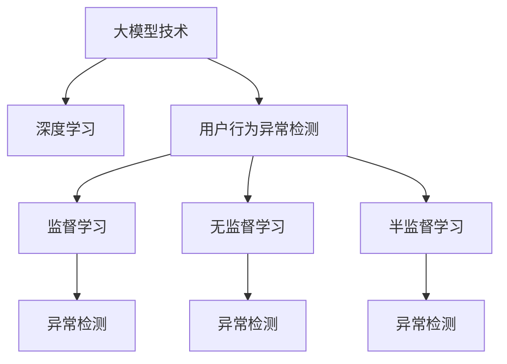

                 

# 大模型技术在电商平台用户行为异常检测中的应用

> 关键词：大模型技术, 用户行为异常检测, 电商平台, 深度学习, 算法优化, 数据处理, 应用部署

## 1. 背景介绍

### 1.1 问题由来

在电商领域，用户行为异常检测是一项非常重要的任务。异常用户行为可能包括欺诈行为、恶意刷单、暴力下单、恶意评价等，这些行为不仅对电商平台自身的运营造成损失，还可能对消费者和其他正常用户造成不良影响。因此，及时准确地识别和处理异常行为，保障平台秩序和用户利益，是电商平台面临的重要挑战。

当前，电商平台用户行为异常检测主要依赖人工审核和规则匹配，但这些方式存在响应慢、效率低、误报率高的问题，难以应对电商平台上瞬息万变的用户行为模式。随着人工智能技术的快速发展，特别是大模型技术的应用，为电商平台的异常行为检测带来了新的契机。

### 1.2 问题核心关键点

电商平台用户行为异常检测的核心在于：
1. **数据处理**：需要收集和处理大量的用户行为数据，包括但不限于浏览记录、购买记录、评论信息等。
2. **特征提取**：需要从原始数据中提取出具有代表性和区分度的特征，用于训练异常检测模型。
3. **模型选择**：需要选择适合的算法模型，如监督学习、无监督学习、半监督学习等，以适应不同场景的需求。
4. **模型训练与优化**：需要在大规模数据集上训练模型，并根据业务需求进行调参和优化，提高模型的准确性和泛化能力。
5. **异常检测与响应**：需要将训练好的模型应用于实际场景，实时检测用户行为，并根据检测结果进行相应的处理，如报警、拦截、放行等。

### 1.3 问题研究意义

电商平台用户行为异常检测对于保障电商平台的安全和稳定运行，提升用户体验和平台信誉具有重要意义。通过应用大模型技术，可以显著提升异常检测的效率和准确性，及时发现并处理异常行为，降低电商平台因异常行为造成的损失，同时也能减少对人工审核的依赖，提升平台的运营效率。

## 2. 核心概念与联系

### 2.1 核心概念概述

为更好地理解大模型技术在电商平台用户行为异常检测中的应用，本节将介绍几个密切相关的核心概念：

- **大模型技术**：指的是在大型计算资源上训练的大规模神经网络模型，具有强大的特征学习和泛化能力，广泛应用于自然语言处理、计算机视觉、语音识别等多个领域。

- **用户行为异常检测**：指通过分析用户行为数据，识别出异常行为的过程。异常行为通常指与用户正常行为模式明显不符的行为，如购买大量同种商品、频繁下单取消、恶意评论等。

- **深度学习**：一种基于神经网络的机器学习技术，通过多层非线性变换，可以处理复杂的非线性关系，是构建大模型技术的基础。

- **监督学习**：通过已有标注数据，训练模型进行分类、回归等任务，适用于异常检测等场景。

- **无监督学习**：不依赖标注数据，通过模型自行发现数据中的潜在结构，适用于用户行为模式的学习和异常检测。

- **半监督学习**：利用少量标注数据和大量无标注数据，训练模型进行分类、聚类等任务，适用于数据标注成本高、数据规模大的场景。

这些核心概念之间的逻辑关系可以通过以下Mermaid流程图来展示：



这个流程图展示了大模型技术在电商平台用户行为异常检测中的关键环节和重要概念：

1. 大模型技术通过深度学习在电商平台上训练模型，学习用户行为数据中的复杂模式。
2. 监督学习、无监督学习和半监督学习等方法用于不同场景的异常检测。
3. 异常检测模型通过训练好的模型实时检测用户行为，进行相应的处理。

## 3. 核心算法原理 & 具体操作步骤
### 3.1 算法原理概述

电商平台用户行为异常检测的核心算法为深度学习模型，如神经网络、卷积神经网络(CNN)、循环神经网络(RNN)、长短期记忆网络(LSTM)、门控循环单元(GRU)等。这些模型的核心原理在于通过多层非线性变换，提取数据的高级特征，实现对异常行为的识别。

以神经网络为例，其基本结构包括输入层、隐藏层和输出层。输入层接收原始数据，隐藏层进行特征提取，输出层给出分类或回归结果。在训练过程中，模型通过反向传播算法优化权重参数，使得模型输出与真实标签尽可能一致。

### 3.2 算法步骤详解

电商平台用户行为异常检测的大模型应用步骤包括数据预处理、模型训练、模型评估和模型部署等环节。

**Step 1: 数据预处理**
1. **数据收集**：收集电商平台上用户的行为数据，包括但不限于浏览记录、购买记录、评论信息等。
2. **数据清洗**：去除无效数据，如缺失值、噪声数据等，保证数据的质量和完整性。
3. **特征提取**：从原始数据中提取具有代表性和区分度的特征，如用户的浏览行为、购买行为、评分行为等。

**Step 2: 模型训练**
1. **数据划分**：将数据集划分为训练集、验证集和测试集，用于模型的训练、调参和评估。
2. **模型选择**：根据具体需求选择合适的模型架构和参数配置。
3. **模型训练**：使用训练集数据训练模型，通过反向传播算法优化模型参数，最小化损失函数。
4. **模型调参**：在验证集上评估模型性能，调整超参数以提高模型效果。

**Step 3: 模型评估**
1. **评估指标**：选择合适的评估指标，如准确率、召回率、F1值等。
2. **评估过程**：在测试集上评估模型性能，计算各项指标。
3. **模型优化**：根据评估结果，对模型进行优化调整，提高模型泛化能力。

**Step 4: 模型部署**
1. **模型导出**：将训练好的模型导出为可部署的格式，如TensorFlow SavedModel、PyTorch model等。
2. **模型部署**：将模型部署到电商平台上，实现实时异常检测。
3. **异常响应**：根据异常检测结果，进行相应的处理，如报警、拦截、放行等。

### 3.3 算法优缺点

电商平台用户行为异常检测的大模型应用具有以下优点：
1. **准确性高**：深度学习模型具有强大的特征提取能力，能够从大量数据中提取复杂的特征，提高异常检测的准确性。
2. **泛化能力强**：通过在大规模数据集上进行预训练，大模型能够适应不同的业务场景，提升模型的泛化能力。
3. **实时性高**：基于大模型的异常检测模型可以实时处理用户行为数据，及时发现异常行为。
4. **可解释性强**：大模型的决策过程可以通过可视化工具进行解释，帮助业务人员理解模型的推理逻辑。

同时，该方法也存在一些局限性：
1. **数据依赖性强**：异常检测的准确性依赖于高质量的数据集，数据收集和处理成本较高。
2. **模型复杂度高**：大模型通常需要大量的计算资源和存储空间，部署和训练成本较高。
3. **模型过拟合风险**：大模型在训练过程中容易过拟合，需要选择合适的正则化技术。
4. **解释性差**：大模型通常是一个"黑盒"系统，难以解释其内部决策过程。

尽管存在这些局限性，但就目前而言，大模型技术在电商平台用户行为异常检测中已经展现出显著的优势，成为异常检测的重要手段。未来相关研究的方向包括降低数据依赖、提升模型可解释性和鲁棒性等。

### 3.4 算法应用领域

大模型技术在电商平台用户行为异常检测中的应用，不仅限于欺诈行为检测，还包括恶意刷单检测、暴力下单检测、恶意评价检测等多个场景。具体应用领域包括：

1. **欺诈行为检测**：识别用户恶意欺诈行为，如恶意下单、虚假交易等。
2. **恶意刷单检测**：识别用户恶意刷单行为，维护平台的交易公平。
3. **暴力下单检测**：识别用户暴力下单行为，避免平台资源浪费。
4. **恶意评价检测**：识别用户恶意评价行为，保护商家的信誉。
5. **用户行为模式学习**：学习用户的正常行为模式，用于异常检测的基准。

## 4. 数学模型和公式 & 详细讲解 & 举例说明
### 4.1 数学模型构建

以神经网络为例，电商平台用户行为异常检测的数学模型可以表示为：

$$
M(x) = W^T x + b
$$

其中 $x$ 为输入数据，$W$ 和 $b$ 为模型的权重和偏置。模型的输出 $M(x)$ 表示异常检测的结果，如异常概率、异常类别等。

### 4.2 公式推导过程

在电商平台用户行为异常检测中，常见的异常检测模型包括二分类模型、多分类模型和回归模型。以下是二分类模型的推导过程：

假设输入数据 $x$ 经过预处理和特征提取，表示为 $x=[x_1, x_2, ..., x_n]$。模型 $M$ 输出异常概率 $p$，则二分类模型的输出可以表示为：

$$
p = \sigma(W^T x + b)
$$

其中 $\sigma$ 为激活函数，如 sigmoid 函数。将 $p$ 与阈值 $\theta$ 比较，判断是否为异常行为：

$$
y = \left\{
 \begin{array}{ll}
  1 & \mbox{如果 } p \geq \theta \\
  0 & \mbox{如果 } p < \theta
 \end{array}
\right.
$$

### 4.3 案例分析与讲解

以恶意刷单检测为例，假设平台上有三种类型的数据：正常用户行为数据、恶意刷单行为数据和测试集数据。平台将训练集数据和验证集数据划分为正常用户行为数据和恶意刷单行为数据，用于模型的训练和评估。测试集数据用于模型最终的性能评估。

模型的训练步骤如下：
1. 收集平台上的正常用户行为数据和恶意刷单行为数据，划分为训练集、验证集和测试集。
2. 选择神经网络模型作为异常检测模型，并设置模型的超参数，如层数、节点数、学习率等。
3. 使用训练集数据训练模型，通过反向传播算法优化模型的权重和偏置，最小化损失函数。
4. 在验证集上评估模型的性能，调整超参数以提高模型效果。
5. 在测试集上评估模型的最终性能，计算准确率、召回率、F1值等指标。
6. 将模型部署到电商平台，实时检测用户行为，根据检测结果进行相应的处理。

## 5. 项目实践：代码实例和详细解释说明
### 5.1 开发环境搭建

在进行电商平台用户行为异常检测的大模型应用实践前，我们需要准备好开发环境。以下是使用Python进行TensorFlow开发的开发环境配置流程：

1. 安装Anaconda：从官网下载并安装Anaconda，用于创建独立的Python环境。

2. 创建并激活虚拟环境：
```bash
conda create -n tf-env python=3.8 
conda activate tf-env
```

3. 安装TensorFlow：根据CUDA版本，从官网获取对应的安装命令。例如：
```bash
conda install tensorflow -c tf
```

4. 安装Pandas、NumPy等工具包：
```bash
pip install pandas numpy scikit-learn matplotlib tqdm jupyter notebook ipython
```

5. 安装相关依赖库：
```bash
pip install tensorflow-addons
```

完成上述步骤后，即可在`tf-env`环境中开始大模型应用的开发实践。

### 5.2 源代码详细实现

下面以恶意刷单检测为例，给出使用TensorFlow实现的大模型应用的代码实现。

首先，定义数据预处理函数：

```python
import pandas as pd
import numpy as np
from sklearn.preprocessing import StandardScaler
from tensorflow.keras.models import Sequential
from tensorflow.keras.layers import Dense, Dropout

def preprocess_data(df):
    # 数据清洗
    df = df.dropna()
    # 特征提取
    X = df[['feature1', 'feature2', 'feature3']]  # 假设feature1、feature2、feature3为三个特征
    y = df['label']  # 标签，1表示恶意刷单行为，0表示正常用户行为
    # 数据标准化
    scaler = StandardScaler()
    X = scaler.fit_transform(X)
    # 划分训练集、验证集和测试集
    X_train, X_val, X_test = train_test_split(X, y, test_size=0.2, random_state=42)
    y_train, y_val, y_test = y_train, y_val, y_test
    return X_train, y_train, X_val, y_val, X_test, y_test
```

然后，定义模型和优化器：

```python
def build_model(input_shape):
    model = Sequential()
    model.add(Dense(64, input_shape=input_shape, activation='relu'))
    model.add(Dropout(0.5))
    model.add(Dense(32, activation='relu'))
    model.add(Dropout(0.5))
    model.add(Dense(1, activation='sigmoid'))
    model.compile(optimizer='adam', loss='binary_crossentropy', metrics=['accuracy'])
    return model
```

接着，定义训练和评估函数：

```python
def train_model(model, X_train, y_train, X_val, y_val, batch_size=32, epochs=10):
    model.fit(X_train, y_train, validation_data=(X_val, y_val), batch_size=batch_size, epochs=epochs, verbose=1)
    val_loss, val_acc = model.evaluate(X_val, y_val, verbose=1)
    return model, val_loss, val_acc
```

最后，启动训练流程并在测试集上评估：

```python
X_train, y_train, X_val, y_val, X_test, y_test = preprocess_data(df)

# 构建模型
model = build_model(input_shape=(X_train.shape[1],))

# 训练模型
model, val_loss, val_acc = train_model(model, X_train, y_train, X_val, y_val)

# 在测试集上评估模型
test_loss, test_acc = model.evaluate(X_test, y_test, verbose=1)
print(f'Test accuracy: {test_acc:.4f}')
```

以上就是使用TensorFlow实现的大模型应用的代码实现。可以看到，TensorFlow提供了强大的模型构建和训练工具，使得模型的构建和训练过程变得简洁高效。

### 5.3 代码解读与分析

让我们再详细解读一下关键代码的实现细节：

**preprocess_data函数**：
- `dropna`方法：去除缺失值，保证数据完整性。
- `StandardScaler`方法：对特征进行标准化，缩小特征尺度差异。
- `train_test_split`方法：将数据划分为训练集、验证集和测试集，确保数据分布一致。

**build_model函数**：
- `Sequential`方法：定义序列模型，一层一层地添加神经网络层。
- `Dense`方法：定义全连接层，指定节点数、激活函数等参数。
- `Dropout`方法：添加正则化层，防止过拟合。
- `compile`方法：编译模型，设置优化器、损失函数和评估指标。

**train_model函数**：
- `fit`方法：训练模型，指定训练数据、验证数据、批量大小和迭代次数。
- `evaluate`方法：评估模型，计算损失和准确率。

**训练流程**：
- `build_model`函数：构建模型。
- `train_model`函数：训练模型，并记录验证集上的损失和准确率。
- 在测试集上评估模型的准确率。

以上代码实现展示了使用TensorFlow进行电商平台用户行为异常检测大模型应用的完整过程。开发者可以根据具体需求进行进一步的调整和优化。

## 6. 实际应用场景

### 6.1 智能客服系统

电商平台用户行为异常检测可以应用于智能客服系统，提升客服系统的自动化和智能化水平。智能客服系统可以通过实时检测用户行为，识别出异常用户行为，及时进行相应的处理，如转入人工客服、拦截恶意行为等。

### 6.2 交易风险管理

电商平台用户行为异常检测可以应用于交易风险管理，防范和识别欺诈行为、恶意刷单行为等。通过异常检测，电商平台可以实时监控交易行为，及时识别和处理异常交易，保障交易安全和平台信誉。

### 6.3 广告投放优化

电商平台用户行为异常检测可以应用于广告投放优化，提高广告投放的效果和ROI。通过异常检测，电商平台可以识别出恶意刷单、虚假交易等行为，及时调整广告投放策略，避免资源浪费和损失。

### 6.4 未来应用展望

随着大模型技术的不断发展和应用，电商平台用户行为异常检测将迎来更多的应用场景。未来，基于大模型的异常检测技术将在以下领域得到更广泛的应用：

1. **个性化推荐**：通过异常检测，电商平台可以识别出异常用户行为，及时调整推荐策略，提升推荐效果和用户体验。
2. **供应链优化**：通过异常检测，电商平台可以识别出异常交易行为，及时调整供应链策略，提升供应链效率和稳定性。
3. **市场营销**：通过异常检测，电商平台可以识别出异常广告投放行为，及时调整投放策略，提升广告投放效果和ROI。
4. **用户行为预测**：通过异常检测，电商平台可以识别出异常用户行为，及时预测用户行为变化趋势，优化运营策略。

## 7. 工具和资源推荐
### 7.1 学习资源推荐

为了帮助开发者系统掌握大模型技术在电商平台用户行为异常检测中的应用，这里推荐一些优质的学习资源：

1. **TensorFlow官方文档**：官方文档详细介绍了TensorFlow的使用方法和API接口，是学习TensorFlow的最佳资源之一。

2. **深度学习入门教程**：通过这个教程，可以系统地学习深度学习的基本概念、模型结构和训练方法。

3. **Kaggle数据集**：Kaggle提供大量的数据集和竞赛，可以实践大模型技术在电商平台用户行为异常检测中的应用。

4. **自然语言处理课程**：斯坦福大学开设的《自然语言处理》课程，提供丰富的学习资源和实践机会。

5. **深度学习框架比较**：这篇文章对比了TensorFlow、PyTorch、Keras等深度学习框架的特点和应用场景，有助于选择合适的框架进行开发。

### 7.2 开发工具推荐

高效的开发离不开优秀的工具支持。以下是几款用于电商平台用户行为异常检测大模型应用开发的常用工具：

1. TensorFlow：由Google主导开发的深度学习框架，生产部署方便，适合大规模工程应用。

2. PyTorch：基于Python的开源深度学习框架，灵活性和可扩展性高，适合研究性开发。

3. Scikit-learn：用于数据预处理、特征提取和模型训练的工具库，提供了丰富的算法实现。

4. Jupyter Notebook：交互式编程环境，方便进行模型调试和代码测试。

5. TensorBoard：TensorFlow配套的可视化工具，可以实时监测模型训练状态，提供丰富的图表展示。

6. Weights & Biases：模型训练的实验跟踪工具，可以记录和可视化模型训练过程中的各项指标，方便对比和调优。

### 7.3 相关论文推荐

大模型技术在电商平台用户行为异常检测中的应用，源于学界的持续研究。以下是几篇奠基性的相关论文，推荐阅读：

1. **深度学习在电商平台中的应用**：介绍了深度学习技术在电商平台中的各种应用，包括用户行为异常检测。

2. **大模型在金融领域的应用**：探讨了大模型技术在金融领域的应用，包括欺诈检测和风险管理。

3. **电商平台用户行为分析**：研究了电商平台用户行为分析的方法和技术，包括异常检测和行为预测。

4. **深度学习在推荐系统中的应用**：介绍了深度学习技术在推荐系统中的应用，包括个性化推荐和异常检测。

5. **电商平台的欺诈检测技术**：介绍了电商平台的欺诈检测技术，包括数据处理和异常检测。

这些论文代表了大模型技术在电商平台用户行为异常检测中的应用发展脉络。通过学习这些前沿成果，可以帮助研究者把握学科前进方向，激发更多的创新灵感。

## 8. 总结：未来发展趋势与挑战
### 8.1 研究成果总结

本文对大模型技术在电商平台用户行为异常检测中的应用进行了全面系统的介绍。首先阐述了大模型技术和用户行为异常检测的研究背景和意义，明确了大模型技术在电商平台上应用的重要性和应用场景。其次，从原理到实践，详细讲解了大模型应用的数学模型构建、算法步骤和具体实现。最后，对大模型技术在电商平台的实际应用进行了总结，展望了未来发展的趋势和挑战。

通过本文的系统梳理，可以看到，大模型技术在电商平台用户行为异常检测中的应用前景广阔，具有显著的实际应用价值。在未来，随着技术的不断进步和应用的深化，大模型技术将在大数据、人工智能和电商领域发挥更大的作用，推动行业的数字化转型和智能化升级。

### 8.2 未来发展趋势

展望未来，大模型技术在电商平台用户行为异常检测中的应用将呈现以下几个发展趋势：

1. **模型规模持续增大**：随着计算资源的不断提升，大模型规模将持续增大，其性能和准确性将得到进一步提升。

2. **模型可解释性增强**：未来的大模型技术将更加注重模型的可解释性，通过可视化工具和模型优化，提升模型的透明度和可信度。

3. **模型鲁棒性提高**：未来的模型将更加注重鲁棒性，通过对抗训练、数据增强等技术，提升模型对异常数据的识别能力。

4. **模型实时性提升**：未来的模型将更加注重实时性，通过优化模型结构和算法，实现快速高效的异常检测。

5. **模型应用场景扩展**：未来的大模型技术将在更多领域得到应用，如供应链优化、市场营销、广告投放等，进一步拓展电商平台的业务场景。

### 8.3 面临的挑战

尽管大模型技术在电商平台用户行为异常检测中已经取得了显著进展，但在实际应用中仍面临一些挑战：

1. **数据质量和标注成本**：高质量的数据集和标注数据是异常检测的基础，但数据收集和标注成本较高，难以满足大规模应用的需求。

2. **模型复杂性和计算成本**：大模型的复杂性和计算成本较高，需要高效的分布式计算资源支持，部署和维护成本较高。

3. **模型泛化能力和泛化性**：大模型在特定场景下的泛化能力仍需进一步提升，以适应电商平台的复杂业务需求。

4. **模型解释性和可解释性**：大模型通常是一个"黑盒"系统，难以解释其内部决策过程，需要加强模型解释性和可解释性研究。

5. **模型安全性和隐私保护**：大模型涉及大量用户数据，需要确保模型的安全性和隐私保护，避免数据泄露和滥用。

这些挑战需要通过技术创新和应用实践逐步解决，才能使大模型技术在电商平台用户行为异常检测中发挥更大的作用。

### 8.4 研究展望

未来，大模型技术在电商平台用户行为异常检测中的应用需要在以下几个方面进行深入研究：

1. **数据增强和数据集构建**：构建高质量的大规模数据集，通过数据增强技术提升模型的泛化能力和泛化性。

2. **模型优化和参数高效微调**：开发更加参数高效的大模型，通过参数高效微调方法，降低模型训练和部署成本。

3. **模型可解释性和可视化**：研究模型的可解释性和可视化技术，提升模型的透明度和可信度，增强模型解释性。

4. **模型集成和组合优化**：研究模型的集成和组合优化技术，提升模型的准确性和鲁棒性，应对复杂多变的电商场景。

5. **模型实时化和分布式计算**：研究模型的实时化和分布式计算技术，提升模型的实时性和计算效率，支持大规模实时异常检测。

6. **模型隐私保护和安全性**：研究模型的隐私保护和安全性技术，确保用户数据的安全和隐私保护，避免模型滥用和数据泄露。

通过这些研究方向的探索，大模型技术在电商平台用户行为异常检测中的应用将更加成熟和可靠，为电商平台的数字化转型和智能化升级提供坚实的技术支撑。

## 9. 附录：常见问题与解答

**Q1：电商平台用户行为异常检测需要哪些关键数据？**

A: 电商平台用户行为异常检测需要收集和处理以下关键数据：

1. **浏览记录**：用户的浏览记录可以反映用户的兴趣和偏好，是异常检测的重要特征。

2. **购买记录**：用户的购买记录可以反映用户的购买行为和消费习惯，是异常检测的重要特征。

3. **评论信息**：用户的评论信息可以反映用户对商品和服务的评价，是异常检测的重要特征。

4. **用户行为数据**：包括点击次数、停留时间、浏览路径等，可以反映用户的行为模式。

5. **交易记录**：包括交易金额、交易时间、交易频率等，可以反映用户的交易行为。

**Q2：如何进行电商平台用户行为异常检测的数据预处理？**

A: 电商平台用户行为异常检测的数据预处理包括以下几个步骤：

1. **数据清洗**：去除无效数据，如缺失值、噪声数据等，保证数据的质量和完整性。

2. **数据标准化**：对特征进行标准化，缩小特征尺度差异，提高模型的泛化能力。

3. **特征提取**：从原始数据中提取具有代表性和区分度的特征，如用户的浏览行为、购买行为、评分行为等。

4. **数据划分**：将数据划分为训练集、验证集和测试集，用于模型的训练、调参和评估。

5. **数据增强**：通过数据增强技术，如回译、近义替换等，扩充训练集，提高模型的泛化能力。

**Q3：如何选择电商平台用户行为异常检测的算法模型？**

A: 电商平台用户行为异常检测的算法模型选择应根据具体场景和需求进行：

1. **监督学习**：适用于标注数据较多的场景，如用户行为分类、异常行为识别等。

2. **无监督学习**：适用于标注数据较少的场景，如用户行为聚类、异常行为预测等。

3. **半监督学习**：适用于标注数据和无标注数据都较多的场景，如用户行为模式学习、异常行为检测等。

4. **深度学习**：适用于特征复杂、数据量大的场景，如神经网络、卷积神经网络、循环神经网络等。

5. **集成学习**：适用于提高模型准确性和鲁棒性的场景，如模型集成、特征融合等。

**Q4：电商平台用户行为异常检测的模型训练和优化策略有哪些？**

A: 电商平台用户行为异常检测的模型训练和优化策略包括以下几个方面：

1. **模型选择**：根据具体需求选择合适的模型架构和参数配置。

2. **正则化技术**：使用L2正则、Dropout、Early Stopping等避免过拟合。

3. **超参数调优**：在验证集上评估模型性能，调整超参数以提高模型效果。

4. **模型集成**：通过模型集成，提高模型的准确性和鲁棒性。

5. **参数高效微调**：只调整少量参数(如Adapter、Prefix等)，减小过拟合风险。

6. **对抗训练**：引入对抗样本，提高模型鲁棒性。

**Q5：电商平台用户行为异常检测的模型部署和应用策略有哪些？**

A: 电商平台用户行为异常检测的模型部署和应用策略包括以下几个方面：

1. **模型导出**：将训练好的模型导出为可部署的格式，如TensorFlow SavedModel、PyTorch model等。

2. **模型部署**：将模型部署到电商平台上，实现实时异常检测。

3. **异常响应**：根据异常检测结果，进行相应的处理，如报警、拦截、放行等。

4. **模型监控**：实时监测模型训练状态，设置异常告警阈值，确保服务稳定性。

5. **模型优化**：根据实际应用中的反馈，不断优化模型参数和训练策略，提升模型性能。

通过以上步骤，电商平台用户行为异常检测的大模型应用将实现从模型训练到实际部署的全流程优化，确保异常检测的准确性和实时性。

---

作者：禅与计算机程序设计艺术 / Zen and the Art of Computer Programming

