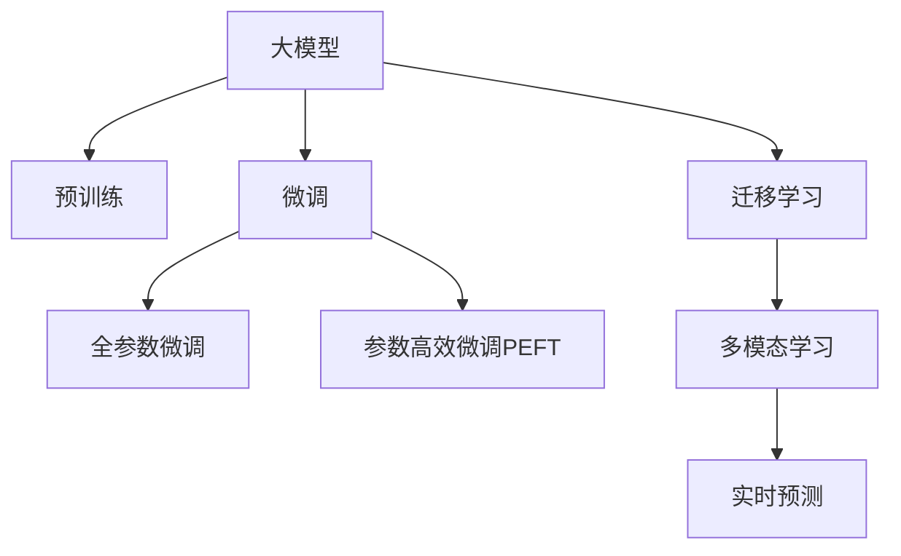

                 

# 大模型技术在电商平台用户行为理解与预测中的应用

> 关键词：大模型,电商平台,用户行为分析,预测建模,深度学习,自然语言处理,NLP,用户行为预测

## 1. 背景介绍

### 1.1 问题由来
近年来，随着电子商务的快速崛起，电商平台的用户数量呈爆炸式增长。平台不仅需要关注用户的浏览、购买、评价等显式行为，还需要深入理解用户的潜在需求和偏好，实现更精准的个性化推荐、营销策略优化、用户流失预测等功能。传统的基于规则的推荐和营销模型，由于无法充分利用海量数据和用户行为模式，难以适应电商场景中快速变化的消费需求。

用户行为理解与预测是电商平台亟待解决的关键问题。目前，基于深度学习和自然语言处理（Natural Language Processing, NLP）的大模型技术，在用户行为分析与预测上展现了巨大潜力。大模型通过在大规模无标签数据上进行预训练，学习到丰富的语言和用户行为知识，可以大幅提升用户行为分析的精度和预测的准确度。

### 1.2 问题核心关键点
电商平台用户行为理解与预测的核心挑战在于如何高效利用用户的多维数据，通过深度学习技术构建准确的预测模型。主要关键点包括：

- **数据多样性**：用户行为数据涉及多模态，包括文本、图片、点击、购买等，需要构建多模态学习模型。
- **数据稀疏性**：用户行为数据往往存在大量缺失，需要处理缺失值和异常值。
- **模型复杂度**：深度学习模型参数量大，训练和推理耗时长，需要优化模型结构以提升效率。
- **实时性要求**：电商平台对推荐和预测系统有极高的实时性要求，模型需能够在短时间内响应大量并发请求。

## 2. 核心概念与联系

### 2.1 核心概念概述

为更好地理解大模型在电商平台用户行为预测中的应用，本节将介绍几个关键概念：

- **大模型**：指在大型数据集上进行预训练的深度神经网络模型，如BERT、GPT、T5等，具备强大的语言理解和生成能力。
- **预训练**：指在大规模无标签数据上，通过自监督学习任务训练通用模型的过程。预训练使得模型学习到语言的通用表示。
- **微调(Fine-tuning)**：指在预训练模型的基础上，使用有标签数据进行微调，使其适应特定任务，如电商平台用户行为预测。
- **迁移学习**：指将一个领域学习到的知识，迁移到另一个不同但相关的领域，如从通用大模型迁移到电商领域。
- **自监督学习**：指利用大规模无标签数据，通过自生成的任务进行模型训练，无需人工标注数据。
- **多模态学习**：指模型能够同时处理多种类型的数据，如文本、图片、音频等，实现综合的用户行为理解。
- **实时预测**：指模型能够在收到新数据时，即时进行预测，满足电商平台的实时性需求。

这些概念之间的逻辑关系可以通过以下Mermaid流程图来展示：



这个流程图展示了大模型技术的核心概念及其之间的关系：

1. 大模型通过预训练获得基础能力。
2. 微调是对预训练模型进行任务特定的优化，以适应电商平台的用户行为预测。
3. 迁移学习连接通用大模型与电商领域，通过微调实现知识的迁移。
4. 多模态学习处理用户行为数据的多样性，提升模型理解能力。
5. 实时预测满足电商平台的实时性要求，确保模型快速响应。

## 3. 核心算法原理 & 具体操作步骤

### 3.1 算法原理概述

电商平台用户行为预测通常涉及两大类数据：结构化数据（如点击次数、购买金额等）和非结构化数据（如商品描述、用户评论等）。大模型技术通过预训练和微调，可以同时处理这两类数据，并构建综合的用户行为预测模型。

### 3.2 算法步骤详解

#### 3.2.1 数据准备
- **数据收集**：收集电商平台上的用户行为数据，包括用户点击、购买、评价、搜索记录等。
- **数据清洗**：处理缺失值和异常值，保证数据质量。
- **数据标注**：对非结构化文本数据进行标注，如情感分类、实体识别等。

#### 3.2.2 预训练模型选择
- **模型选择**：选择适合电商领域的大模型，如BERT、GPT等，进行预训练。
- **数据准备**：准备预训练所需的数据集，包含商品描述、用户评论等。

#### 3.2.3 模型微调
- **任务定义**：根据电商平台需求，定义预测任务，如用户流失预测、商品推荐等。
- **模型构建**：在预训练模型的基础上，添加任务适配层，如全连接层、Attention层等。
- **训练与评估**：使用标注数据对模型进行微调，通过交叉熵等损失函数优化模型，在验证集上评估模型性能。
- **预测部署**：将微调后的模型部署到生产环境，进行实时预测。

#### 3.2.4 模型优化
- **超参数调优**：调整学习率、批大小、迭代轮数等超参数，提升模型性能。
- **正则化技术**：应用L2正则、Dropout等技术，避免过拟合。
- **模型压缩**：对模型进行量化、剪枝等操作，减少计算资源占用。
- **实时优化**：使用在线学习技术，实时更新模型参数，提升预测效率。

### 3.3 算法优缺点

基于大模型的电商平台用户行为预测具有以下优点：

- **精度高**：大模型能够学习到丰富的语言和用户行为知识，提升预测的准确度。
- **泛化能力强**：预训练-微调过程使得模型能够适应多种电商任务，具备良好的泛化性能。
- **可解释性好**：大模型的可解释性相对较高，能够理解预测结果的内部逻辑。

同时，该方法也存在一些局限性：

- **计算资源需求大**：预训练和微调过程需要大量的计算资源，包括GPU、TPU等。
- **数据标注成本高**：高质量标注数据的获取成本较高，特别是在电商领域，标注数据量可能不足。
- **模型复杂度较高**：深度学习模型参数量大，训练和推理耗时长。

### 3.4 算法应用领域

基于大模型的电商平台用户行为预测技术，已经在电商推荐、用户流失预测、营销策略优化等多个领域得到广泛应用。以下是一些典型应用场景：

- **个性化推荐**：根据用户历史行为和商品属性，预测用户对商品的兴趣，实现个性化推荐。
- **用户流失预测**：通过用户行为数据，预测用户是否会流失，提前采取挽留措施。
- **营销策略优化**：分析用户行为数据，优化广告投放策略，提高广告转化率。
- **情感分析**：通过用户评论和反馈，分析用户情感倾向，优化商品和服务。
- **点击率预测**：预测用户点击商品的概率，提升电商平台的点击率。

## 4. 数学模型和公式 & 详细讲解 & 举例说明

### 4.1 数学模型构建

电商平台用户行为预测通常涉及多个预测任务，如点击率预测、购买概率预测、用户流失预测等。这里以点击率预测为例，展示模型的数学构建过程。

假设电商平台有$m$个用户，$n$个商品，$t$个时间区间。对于第$i$个用户在第$t$个时间区间内点击商品$j$的概率，可以表示为：

$$
P(y_{ijt}=1|x_{ijt}) = \text{sigmoid}(\theta^Tf(x_{ijt}))
$$

其中，$f(x_{ijt})$表示输入数据$x_{ijt}$通过预训练模型后的隐表示，$\theta$为模型参数。

### 4.2 公式推导过程

点击率预测模型的目标是最小化损失函数：

$$
\mathcal{L}(\theta) = -\frac{1}{N}\sum_{i,j,t}[y_{ijt}\log(P(y_{ijt}=1|x_{ijt}) + (1-y_{ijt})\log(1-P(y_{ijt}=1|x_{ijt}))]
$$

其中$N$为总样本数，$y_{ijt}$为二分类标签，表示用户$i$在第$t$个时间区间内是否点击商品$j$。

模型的参数更新公式为：

$$
\theta \leftarrow \theta - \eta \nabla_{\theta}\mathcal{L}(\theta)
$$

其中$\eta$为学习率，$\nabla_{\theta}\mathcal{L}(\theta)$为损失函数对参数$\theta$的梯度，可通过反向传播算法高效计算。

### 4.3 案例分析与讲解

以某电商平台的商品推荐系统为例，展示模型的实际应用过程。

首先，收集用户的浏览、点击、购买记录，并提取商品描述、标题、价格等信息。对用户行为数据进行预处理，包括数据清洗、特征工程等。

接着，使用预训练的BERT模型对商品描述进行编码，提取文本特征。将用户行为数据和商品特征拼接，输入模型进行预测。

最后，根据预测结果，为用户推荐最相关的商品。通过不断优化模型，提升推荐效果。

## 5. 项目实践：代码实例和详细解释说明

### 5.1 开发环境搭建

在进行电商推荐系统开发前，我们需要准备好开发环境。以下是使用Python进行PyTorch开发的环境配置流程：

1. 安装Anaconda：从官网下载并安装Anaconda，用于创建独立的Python环境。

2. 创建并激活虚拟环境：
```bash
conda create -n pytorch-env python=3.8 
conda activate pytorch-env
```

3. 安装PyTorch：根据CUDA版本，从官网获取对应的安装命令。例如：
```bash
conda install pytorch torchvision torchaudio cudatoolkit=11.1 -c pytorch -c conda-forge
```

4. 安装HuggingFace Transformers库：
```bash
pip install transformers
```

5. 安装各类工具包：
```bash
pip install numpy pandas scikit-learn matplotlib tqdm jupyter notebook ipython
```

完成上述步骤后，即可在`pytorch-env`环境中开始开发。

### 5.2 源代码详细实现

下面以电商平台点击率预测为例，展示使用Transformers库对BERT模型进行微调的PyTorch代码实现。

首先，定义点击率预测任务的数据处理函数：

```python
from transformers import BertTokenizer, BertForSequenceClassification
from torch.utils.data import Dataset
import torch

class ClickPredictionDataset(Dataset):
    def __init__(self, texts, labels, tokenizer, max_len=128):
        self.texts = texts
        self.labels = labels
        self.tokenizer = tokenizer
        self.max_len = max_len
        
    def __len__(self):
        return len(self.texts)
    
    def __getitem__(self, item):
        text = self.texts[item]
        label = self.labels[item]
        
        encoding = self.tokenizer(text, return_tensors='pt', max_length=self.max_len, padding='max_length', truncation=True)
        input_ids = encoding['input_ids'][0]
        attention_mask = encoding['attention_mask'][0]
        
        # 对label进行编码
        encoded_labels = torch.tensor(label, dtype=torch.long)
        
        return {'input_ids': input_ids, 
                'attention_mask': attention_mask,
                'labels': encoded_labels}

# 准备数据
tokenizer = BertTokenizer.from_pretrained('bert-base-cased')
train_dataset = ClickPredictionDataset(train_texts, train_labels, tokenizer)
dev_dataset = ClickPredictionDataset(dev_texts, dev_labels, tokenizer)
test_dataset = ClickPredictionDataset(test_texts, test_labels, tokenizer)

# 构建模型
model = BertForSequenceClassification.from_pretrained('bert-base-cased', num_labels=2)

# 设置优化器
optimizer = AdamW(model.parameters(), lr=2e-5)

# 训练模型
for epoch in range(5):
    train_loss = 0
    for batch in train_loader:
        input_ids = batch['input_ids'].to(device)
        attention_mask = batch['attention_mask'].to(device)
        labels = batch['labels'].to(device)
        model.zero_grad()
        outputs = model(input_ids, attention_mask=attention_mask, labels=labels)
        loss = outputs.loss
        train_loss += loss.item()
        loss.backward()
        optimizer.step()
    print(f"Epoch {epoch+1}, train loss: {train_loss/len(train_loader):.4f}")
    
# 评估模型
dev_loss = 0
for batch in dev_loader:
    input_ids = batch['input_ids'].to(device)
    attention_mask = batch['attention_mask'].to(device)
    labels = batch['labels'].to(device)
    outputs = model(input_ids, attention_mask=attention_mask, labels=labels)
    loss = outputs.loss
    dev_loss += loss.item()
print(f"Dev loss: {dev_loss/len(dev_loader):.4f}")
```

以上是使用PyTorch对BERT进行点击率预测任务的微调代码实现。可以看到，由于Transformers库的强大封装，我们能够使用相对简洁的代码实现微调任务。

### 5.3 代码解读与分析

让我们再详细解读一下关键代码的实现细节：

**ClickPredictionDataset类**：
- `__init__`方法：初始化文本、标签、分词器等关键组件。
- `__len__`方法：返回数据集的样本数量。
- `__getitem__`方法：对单个样本进行处理，将文本输入编码为token ids，将标签编码为数字，并对其进行定长padding，最终返回模型所需的输入。

**数据处理**：
- `tokenizer`：使用BertTokenizer进行文本编码。
- `train_dataset`、`dev_dataset`、`test_dataset`：分别定义训练集、验证集和测试集的数据集对象。

**模型构建**：
- `model`：使用BertForSequenceClassification构建二分类模型。
- `optimizer`：使用AdamW优化器进行模型训练。

**训练与评估**：
- `device`：将模型移至GPU设备。
- `train_loader`、`dev_loader`：使用DataLoader对数据集进行批次化加载，供模型训练和评估使用。
- `train_loss`、`dev_loss`：计算训练和验证集的损失函数。

**训练流程**：
- 循环迭代5个epoch，在每个epoch内，先计算训练集的损失函数，再计算验证集的损失函数。
- 训练过程中，及时输出每个epoch的损失函数。

可以看到，PyTorch配合Transformers库使得BERT微调的代码实现变得简洁高效。开发者可以将更多精力放在数据处理、模型改进等高层逻辑上，而不必过多关注底层的实现细节。

当然，工业级的系统实现还需考虑更多因素，如模型的保存和部署、超参数的自动搜索、更灵活的任务适配层等。但核心的微调范式基本与此类似。

## 6. 实际应用场景

### 6.1 电商平台推荐系统

电商平台推荐系统是用户行为预测的重要应用场景之一。通过分析用户的历史浏览、点击、购买行为，预测用户可能感兴趣的商品，实现个性化推荐。

在技术实现上，可以收集用户的行为数据，将其转化为向量形式，输入到预训练模型中进行特征提取。通过微调，模型能够学习到用户行为与商品之间的复杂关系，并根据用户的最新行为进行实时推荐。推荐系统不仅可以推荐热门商品，还可以结合用户兴趣，推荐长尾商品，提升用户的购物体验和平台的商品覆盖率。

### 6.2 用户流失预测

用户流失是电商平台面临的重要问题，预测用户流失可以帮助企业提前采取措施，减少流失率。通过收集用户的活跃度、购买频率、评分等信息，构建用户流失预测模型。

在模型训练过程中，可以引入用户行为的时间序列信息，捕捉用户流失的趋势和规律。通过微调，模型能够学习到用户行为特征与流失概率之间的关系，并根据实时数据进行动态更新，实现高精度的用户流失预测。预测结果可以用于提醒客服、推送优惠活动等，提升用户留存率。

### 6.3 营销策略优化

电商平台可以通过用户行为数据，优化广告投放策略，提高广告转化率。通过分析用户的点击、购买、浏览行为，预测用户对不同广告的响应概率，实现精准的广告投放。

在模型训练过程中，可以引入广告的特征信息，如广告标题、图片、关键词等。通过微调，模型能够学习到用户行为与广告响应之间的关系，并根据实时数据进行动态调整，优化广告投放策略。预测结果可以用于个性化广告投放、广告效果评估等，提升广告投放的ROI。

### 6.4 未来应用展望

随着大模型技术的发展，未来电商平台用户行为预测将呈现出以下几个趋势：

1. **多模态融合**：用户行为数据不仅包括文本，还包含图片、视频等多模态信息。未来模型将能够处理多模态数据，提升对用户行为的全面理解。
2. **实时预测**：电商平台对实时性的要求日益增加，未来模型需要具备实时预测能力，能够在用户产生行为后迅速响应，提供个性化推荐。
3. **用户画像构建**：通过用户行为数据的综合分析，构建详细的用户画像，实现更精准的用户行为预测。
4. **个性化推荐**：未来模型将不仅基于用户的显式行为，还能通过用户画像，推荐长尾商品，提升用户的购物体验。
5. **跨领域迁移**：通过迁移学习，将电商领域的用户行为预测模型迁移到其他领域，如社交媒体、金融等，提升多领域的用户行为理解能力。

## 7. 工具和资源推荐

### 7.1 学习资源推荐

为了帮助开发者系统掌握大模型技术在电商平台用户行为预测中的应用，这里推荐一些优质的学习资源：

1. 《深度学习入门：基于PyTorch的理论与实现》系列博文：由大模型技术专家撰写，深入浅出地介绍了深度学习理论、模型构建与优化等基础知识。

2. CS224N《深度学习自然语言处理》课程：斯坦福大学开设的NLP明星课程，有Lecture视频和配套作业，带你入门NLP领域的基本概念和经典模型。

3. 《Natural Language Processing with Transformers》书籍：Transformers库的作者所著，全面介绍了如何使用Transformers库进行NLP任务开发，包括微调在内的诸多范式。

4. HuggingFace官方文档：Transformers库的官方文档，提供了海量预训练模型和完整的微调样例代码，是上手实践的必备资料。

5. 《NeurIPS 2020》论文：介绍多模态学习在用户行为理解中的应用，展示了利用图像、文本等多模态数据提升预测效果的方法。

6. 《AAAI 2021》论文：介绍实时预测技术在电商平台推荐系统中的应用，展示了利用在线学习技术提升模型实时性、个性化推荐效果的方法。

通过对这些资源的学习实践，相信你一定能够快速掌握大模型技术在电商平台用户行为预测中的精髓，并用于解决实际的NLP问题。

### 7.2 开发工具推荐

高效的开发离不开优秀的工具支持。以下是几款用于电商平台用户行为预测开发的常用工具：

1. PyTorch：基于Python的开源深度学习框架，灵活动态的计算图，适合快速迭代研究。大部分预训练语言模型都有PyTorch版本的实现。

2. TensorFlow：由Google主导开发的开源深度学习框架，生产部署方便，适合大规模工程应用。同样有丰富的预训练语言模型资源。

3. Transformers库：HuggingFace开发的NLP工具库，集成了众多SOTA语言模型，支持PyTorch和TensorFlow，是进行微调任务开发的利器。

4. Weights & Biases：模型训练的实验跟踪工具，可以记录和可视化模型训练过程中的各项指标，方便对比和调优。与主流深度学习框架无缝集成。

5. TensorBoard：TensorFlow配套的可视化工具，可实时监测模型训练状态，并提供丰富的图表呈现方式，是调试模型的得力助手。

6. Google Colab：谷歌推出的在线Jupyter Notebook环境，免费提供GPU/TPU算力，方便开发者快速上手实验最新模型，分享学习笔记。

合理利用这些工具，可以显著提升电商平台用户行为预测任务的开发效率，加快创新迭代的步伐。

### 7.3 相关论文推荐

大模型技术在电商平台用户行为预测的发展源于学界的持续研究。以下是几篇奠基性的相关论文，推荐阅读：

1. Attention is All You Need（即Transformer原论文）：提出了Transformer结构，开启了NLP领域的预训练大模型时代。

2. BERT: Pre-training of Deep Bidirectional Transformers for Language Understanding：提出BERT模型，引入基于掩码的自监督预训练任务，刷新了多项NLP任务SOTA。

3. Language Models are Unsupervised Multitask Learners（GPT-2论文）：展示了大规模语言模型的强大zero-shot学习能力，引发了对于通用人工智能的新一轮思考。

4. Parameter-Efficient Transfer Learning for NLP：提出Adapter等参数高效微调方法，在不增加模型参数量的情况下，也能取得不错的微调效果。

5. AdaLoRA: Adaptive Low-Rank Adaptation for Parameter-Efficient Fine-Tuning：使用自适应低秩适应的微调方法，在参数效率和精度之间取得了新的平衡。

6. Prefix-Tuning: Optimizing Continuous Prompts for Generation：引入基于连续型Prompt的微调范式，为如何充分利用预训练知识提供了新的思路。

这些论文代表了大模型技术在电商平台用户行为预测的发展脉络。通过学习这些前沿成果，可以帮助研究者把握学科前进方向，激发更多的创新灵感。

## 8. 总结：未来发展趋势与挑战

### 8.1 总结

本文对基于大模型的电商平台用户行为预测方法进行了全面系统的介绍。首先阐述了电商平台用户行为预测的重要性，明确了微调在提升推荐系统性能、优化营销策略、预测用户流失等方面的独特价值。其次，从原理到实践，详细讲解了电商推荐、用户流失预测等任务的数学模型和代码实现，给出了微调任务开发的完整代码实例。同时，本文还广泛探讨了微调技术在电商领域的广泛应用，展示了微调范式的巨大潜力。

通过本文的系统梳理，可以看到，基于大模型的电商平台用户行为预测方法正在成为电商推荐系统的重要范式，极大地提升了电商平台的个性化推荐、营销策略优化、用户流失预测等业务价值。未来，伴随大模型技术的不断演进，电商平台用户行为预测技术必将在电商领域带来更多变革性影响。

### 8.2 未来发展趋势

展望未来，大模型技术在电商平台用户行为预测领域将呈现以下几个发展趋势：

1. **多模态融合**：电商平台用户行为数据涉及多模态，未来的模型将能够同时处理文本、图像、视频等多种数据类型，提升对用户行为的全面理解。
2. **实时预测**：电商平台对实时性的要求日益增加，未来的模型需要具备实时预测能力，能够在用户产生行为后迅速响应，提供个性化推荐。
3. **跨领域迁移**：通过迁移学习，将电商领域的用户行为预测模型迁移到其他领域，如社交媒体、金融等，提升多领域的用户行为理解能力。
4. **用户画像构建**：通过用户行为数据的综合分析，构建详细的用户画像，实现更精准的用户行为预测。
5. **个性化推荐**：未来模型将不仅基于用户的显式行为，还能通过用户画像，推荐长尾商品，提升用户的购物体验。

以上趋势凸显了大模型技术在电商平台用户行为预测领域的广阔前景。这些方向的探索发展，必将进一步提升电商平台的推荐系统性能，为电商行业带来更多创新和变革。

### 8.3 面临的挑战

尽管大模型技术在电商平台用户行为预测上已经取得了显著成效，但在迈向更加智能化、普适化应用的过程中，它仍面临诸多挑战：

1. **计算资源瓶颈**：大模型训练和微调需要大量的计算资源，包括GPU、TPU等。随着模型规模的增大，计算成本和硬件需求不断增加。
2. **数据标注成本高**：高质量标注数据的获取成本较高，特别是在电商领域，标注数据量可能不足。
3. **模型复杂度较高**：深度学习模型参数量大，训练和推理耗时长。
4. **实时性要求高**：电商平台对推荐和预测系统有极高的实时性要求，模型需能够在短时间内响应大量并发请求。
5. **模型鲁棒性不足**：大模型在面对域外数据时，泛化性能往往大打折扣。对于测试样本的微小扰动，微调模型的预测也容易发生波动。

### 8.4 研究展望

面对大模型技术在电商平台用户行为预测所面临的挑战，未来的研究需要在以下几个方面寻求新的突破：

1. **数据增强**：通过数据增强技术，提升标注数据的多样性和数量，缓解数据标注成本高的问题。
2. **模型压缩**：通过模型压缩技术，减小模型规模，降低计算资源占用，提升模型的实时性和可部署性。
3. **跨领域迁移**：通过迁移学习，将电商领域的用户行为预测模型迁移到其他领域，提升多领域的用户行为理解能力。
4. **实时预测**：通过在线学习技术，实现模型的实时更新，提升预测系统的响应速度。
5. **多模态融合**：通过多模态融合技术，提升模型对用户行为数据的全面理解能力。

这些研究方向的探索，必将引领大模型技术在电商平台用户行为预测领域的进一步演进，为电商行业带来更多创新和变革。面向未来，大模型技术需要与其他人工智能技术进行更深入的融合，如知识表示、因果推理、强化学习等，多路径协同发力，共同推动电商平台的智能化发展。只有勇于创新、敢于突破，才能不断拓展电商平台用户行为预测技术的边界，让智能技术更好地造福电商用户。

## 9. 附录：常见问题与解答

**Q1：电商平台用户行为预测为什么需要大模型？**

A: 电商平台用户行为预测涉及大量的多模态数据，如用户行为、商品属性、用户画像等。这些数据具有高度的复杂性和多样性，传统的基于规则的模型难以处理。而大模型通过预训练获得了强大的语言和知识表征能力，能够在丰富的数据中学习到用户行为与商品之间的复杂关系，提升预测的准确度和泛化能力。

**Q2：如何处理电商平台用户行为数据的多样性？**

A: 电商平台用户行为数据涉及多模态，如文本、图片、点击、购买等。处理多模态数据的常用方法包括：
1. 数据融合：将不同模态的数据进行融合，提取综合特征。
2. 特征工程：针对不同模态数据，设计合适的特征提取方法。
3. 多模态学习：使用多模态学习模型，如Vision+Text模型，同时处理图像和文本数据。

**Q3：电商平台推荐系统如何实现个性化推荐？**

A: 电商平台推荐系统通过分析用户的历史行为，预测用户对商品的兴趣，实现个性化推荐。主要步骤如下：
1. 收集用户的行为数据，如浏览、点击、购买等。
2. 预处理数据，进行数据清洗和特征工程。
3. 使用大模型对数据进行特征提取。
4. 添加预测任务，构建推荐模型。
5. 训练模型，进行实时预测。
6. 根据预测结果，为用户推荐最相关的商品。

**Q4：电商平台用户流失预测的难点是什么？**

A: 电商平台用户流失预测的难点在于用户行为数据的不确定性和复杂性。用户流失不仅受到用户自身行为的影响，还受到外部环境因素的影响，如市场变化、竞争对手等。同时，用户流失行为具有一定的随机性和不确定性，难以通过简单的统计方法进行预测。

**Q5：电商平台营销策略优化的核心是什么？**

A: 电商平台营销策略优化的核心在于对用户行为数据的深度理解和分析。通过分析用户的点击、购买、浏览行为，预测用户对不同广告的响应概率，实现精准的广告投放。主要步骤包括：
1. 收集广告和用户行为数据。
2. 预处理数据，进行数据清洗和特征工程。
3. 使用大模型对数据进行特征提取。
4. 添加预测任务，构建广告响应模型。
5. 训练模型，进行实时预测。
6. 根据预测结果，优化广告投放策略。

总之，基于大模型的电商平台用户行为预测技术，通过深度学习和大规模数据训练，能够在多模态数据、实时性、个性化推荐等方面取得显著效果。未来，随着技术的不断进步，该技术将在电商平台中发挥更大的作用，为电商行业带来更多创新和变革。

