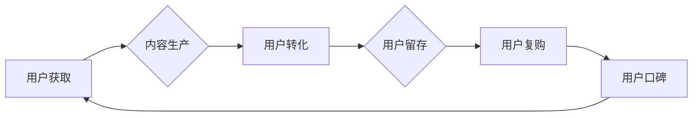

                 

## 知识付费创业的用户价值最大化策略

> 关键词：知识付费、用户价值、用户增长、内容运营、社区建设、数据分析、商业模式

### 1. 背景介绍

知识付费作为一种新型的商业模式，近年来发展迅速，涌现出众多成功案例。从在线课程、付费咨询到会员体系，知识付费创业者们不断探索新的模式和内容，满足用户日益增长的学习和提升需求。然而，知识付费市场竞争激烈，用户粘性难以提升，如何最大化用户价值成为众多创业者面临的挑战。

### 2. 核心概念与联系

**2.1 用户价值**

用户价值是指用户对知识付费产品的感知价值和实际价值之和。感知价值是指用户对产品功能、内容质量、学习体验等方面的预期和感受，而实际价值是指用户通过使用产品获得的知识、技能、资源等方面的实际收益。

**2.2 用户价值最大化**

用户价值最大化是指通过优化产品、服务和运营策略，提升用户感知价值和实际价值，从而实现用户长期粘性、复购率和口碑传播。

**2.3 知识付费用户价值链**

知识付费用户价值链是一个由多个环节组成的系统，每个环节都对用户价值产生影响。

* **内容生产:** 高质量、有价值的内容是知识付费产品的核心，需要不断进行研发和更新。
* **用户获取:** 通过精准营销、社群运营等方式吸引目标用户。
* **用户转化:** 提升用户注册、付费和使用产品的转化率。
* **用户留存:** 通过个性化推荐、互动社区等方式提升用户粘性。
* **用户复购:** 提供优质的售后服务、会员体系等方式鼓励用户重复购买。
* **用户口碑:** 通过用户分享、评价等方式提升产品口碑。

**2.4 用户价值最大化策略**

用户价值最大化策略需要根据用户的不同需求和行为特点进行定制化设计。

* **个性化内容推荐:** 根据用户的学习兴趣、知识水平和学习目标，推荐个性化的学习内容。
* **互动式学习体验:** 通过直播、问答、讨论等方式，打造互动式学习体验，提升用户参与度和学习效果。
* **社区建设:** 建立用户社区，提供交流学习、分享经验的平台，增强用户粘性。
* **数据分析:** 利用数据分析工具，洞察用户行为和需求，不断优化产品和服务。

**2.5 Mermaid 流程图**



### 3. 核心算法原理 & 具体操作步骤

**3.1 算法原理概述**

用户价值最大化策略的核心算法原理是基于用户行为数据和内容特征进行精准匹配和推荐，从而提升用户感知价值和实际价值。

**3.2 算法步骤详解**

1. **数据收集:** 收集用户行为数据，包括用户浏览记录、学习进度、评价反馈、互动行为等。
2. **数据清洗:** 对收集到的数据进行清洗和处理，去除无效数据和噪声数据。
3. **特征提取:** 从用户行为数据和内容特征中提取关键特征，例如用户兴趣、知识水平、学习目标、内容主题、内容难度等。
4. **模型训练:** 利用机器学习算法，训练用户价值预测模型，预测用户对不同内容的感知价值和实际价值。
5. **个性化推荐:** 根据用户特征和模型预测结果，为用户推荐个性化的学习内容。
6. **效果评估:** 定期评估推荐效果，根据用户反馈和数据分析，不断优化模型和推荐策略。

**3.3 算法优缺点**

* **优点:** 能够精准匹配用户需求，提升用户学习体验和学习效果。
* **缺点:** 需要大量的用户行为数据和计算资源，模型训练和优化需要专业技术人员。

**3.4 算法应用领域**

* 在线教育平台
* 知识付费网站
* 内容创作平台
* 社交媒体平台

### 4. 数学模型和公式 & 详细讲解 & 举例说明

**4.1 数学模型构建**

用户价值可以表示为以下数学模型：

$$
UV = \alpha \cdot PV + \beta \cdot AV
$$

其中：

* $UV$：用户价值
* $PV$：感知价值
* $AV$：实际价值
* $\alpha$：感知价值权重
* $\beta$：实际价值权重

**4.2 公式推导过程**

感知价值和实际价值可以通过以下公式计算：

$$
PV = \sum_{i=1}^{n} w_i \cdot f_i
$$

$$
AV = \sum_{j=1}^{m} v_j \cdot g_j
$$

其中：

* $w_i$：第 $i$ 个感知价值特征的权重
* $f_i$：第 $i$ 个感知价值特征的值
* $v_j$：第 $j$ 个实际价值特征的权重
* $g_j$：第 $j$ 个实际价值特征的值

**4.3 案例分析与讲解**

假设一个在线课程平台，用户价值模型如下：

* $\alpha = 0.6$
* $\beta = 0.4$

用户对课程的感知价值特征包括：课程内容质量、课程讲师水平、课程学习体验等，实际价值特征包括：课程学习效果、知识技能提升、职业发展机会等。

通过用户行为数据和专家评估，可以确定每个特征的权重和值。例如，用户对课程内容质量的感知价值权重为 $0.3$，课程内容质量评分为 $4$，则用户对课程内容质量的感知价值为 $0.3 \cdot 4 = 1.2$。

最终，通过计算用户感知价值和实际价值，可以得到用户的总价值。

### 5. 项目实践：代码实例和详细解释说明

**5.1 开发环境搭建**

* Python 3.x
* Jupyter Notebook
* scikit-learn

**5.2 源代码详细实现**

```python
import pandas as pd
from sklearn.model_selection import train_test_split
from sklearn.linear_model import LinearRegression

# 加载用户数据
data = pd.read_csv('user_data.csv')

# 提取特征和目标变量
X = data[['content_quality', 'instructor_level', 'learning_experience']]
y = data['user_value']

# 将数据分为训练集和测试集
X_train, X_test, y_train, y_test = train_test_split(X, y, test_size=0.2, random_state=42)

# 训练线性回归模型
model = LinearRegression()
model.fit(X_train, y_train)

# 预测测试集用户价值
y_pred = model.predict(X_test)

# 评估模型性能
from sklearn.metrics import mean_squared_error
mse = mean_squared_error(y_test, y_pred)
print('Mean Squared Error:', mse)
```

**5.3 代码解读与分析**

* 代码首先加载用户数据，并提取特征和目标变量。
* 然后将数据分为训练集和测试集，用于训练和评估模型。
* 使用线性回归模型训练用户价值预测模型。
* 最后，使用训练好的模型预测测试集用户价值，并评估模型性能。

**5.4 运行结果展示**

运行代码后，会输出测试集用户价值的预测结果和模型性能指标，例如均方误差。

### 6. 实际应用场景

**6.1 在线教育平台**

在线教育平台可以利用用户价值最大化策略，为用户推荐个性化的学习内容，提升用户学习体验和学习效果。例如，根据用户的学习进度和学习目标，推荐下一节课程或相关学习资源。

**6.2 知识付费网站**

知识付费网站可以利用用户价值最大化策略，为用户推荐优质的付费内容，提升用户付费意愿和复购率。例如，根据用户的兴趣爱好和知识水平，推荐相关的付费课程或电子书。

**6.3 内容创作平台**

内容创作平台可以利用用户价值最大化策略，为内容创作者提供数据分析和用户反馈，帮助他们创作更优质的内容，吸引更多用户。例如，根据用户的阅读习惯和点赞行为，推荐相关的内容或作者。

**6.4 未来应用展望**

随着人工智能技术的不断发展，用户价值最大化策略将应用于更多领域，例如：

* 个性化医疗服务
* 精准营销推广
* 智能客服系统

### 7. 工具和资源推荐

**7.1 学习资源推荐**

* **书籍:**

* 《推荐系统实践》
* 《机器学习》

* **在线课程:**

* Coursera: Recommender Systems Specialization
* edX: Machine Learning

**7.2 开发工具推荐**

* **Python:** 

* scikit-learn
* TensorFlow
* PyTorch

* **数据分析工具:**

* Jupyter Notebook
* Pandas
* Matplotlib

**7.3 相关论文推荐**

* **Collaborative Filtering for Implicit Feedback Datasets**
* **Matrix Factorization Techniques for Recommender Systems**

### 8. 总结：未来发展趋势与挑战

**8.1 研究成果总结**

用户价值最大化策略是知识付费创业的重要方向，通过精准匹配用户需求和内容，可以提升用户体验和学习效果，促进知识付费市场发展。

**8.2 未来发展趋势**

* **更精准的用户画像:** 利用大数据和人工智能技术，构建更精准的用户画像，更好地理解用户的需求和行为。
* **更个性化的内容推荐:** 基于用户的兴趣、学习目标和学习进度，提供更个性化的内容推荐，提升用户学习体验。
* **更丰富的互动体验:** 通过直播、问答、讨论等方式，打造更丰富的互动体验，增强用户参与度和学习效果。

**8.3 面临的挑战**

* **数据隐私保护:** 用户数据安全和隐私保护是知识付费创业面临的重要挑战。
* **算法公平性:** 算法模型需要保证公平性和透明性，避免出现歧视或偏见。
* **用户信任:** 建立用户信任是知识付费创业的关键，需要提供优质的产品和服务，并保障用户的权益。

**8.4 研究展望**

未来，用户价值最大化策略将继续发展，探索更先进的算法模型和技术手段，为用户提供更个性化、更智能化的学习体验。


### 9. 附录：常见问题与解答

**9.1 如何提高用户感知价值？**

* 提供高质量、有价值的内容
* 提升用户学习体验
* 建立用户社区，提供交流学习的平台

**9.2 如何提高用户实际价值？**

* 帮助用户提升知识技能
* 提供职业发展机会
* 建立售后服务体系，解决用户问题

**9.3 如何评估用户价值最大化策略的效果？**

* 跟踪用户留存率、复购率和口碑传播
* 利用数据分析工具，洞察用户行为和需求
* 定期评估模型性能，不断优化策略

作者：禅与计算机程序设计艺术 / Zen and the Art of Computer Programming 


<end_of_turn>

