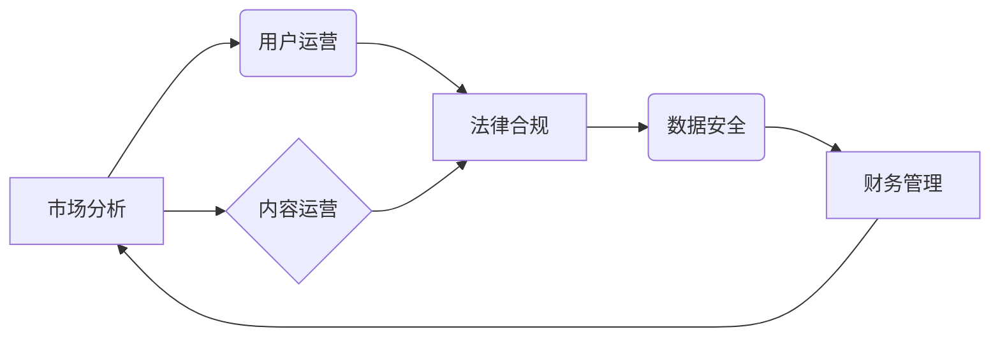

                 

## 知识付费创业的风险控制策略

> 关键词：知识付费、风险控制、创业策略、市场分析、用户运营、内容运营、法律合规、数据安全、财务管理

## 1. 背景介绍

知识付费作为一种新型的商业模式，近年来发展迅速，涌现出众多成功案例。它以知识、技能、经验等为核心产品，通过线上平台向用户提供付费学习服务。然而，知识付费创业也面临着诸多风险，例如市场竞争激烈、用户粘性低、内容质量难以保证、法律合规问题等。

**1.1 知识付费市场现状**

中国知识付费市场规模持续增长，预计未来几年将保持高速发展态势。随着互联网普及和用户对知识的需求不断提升，知识付费市场将迎来更大的发展机遇。

**1.2 知识付费创业面临的风险**

* **市场竞争激烈:** 知识付费市场竞争激烈，众多平台和创作者涌入，用户选择众多，难以脱颖而出。
* **用户粘性低:** 知识付费用户付费意愿高，但粘性相对较低，用户容易流失。
* **内容质量难以保证:** 知识付费内容质量参差不齐，部分内容缺乏专业性和实用性，难以满足用户需求。
* **法律合规问题:** 知识付费涉及版权、隐私等法律问题，需要谨慎处理，避免法律风险。
* **数据安全问题:** 知识付费平台需要收集用户数据，需要做好数据安全防护，避免数据泄露。

## 2. 核心概念与联系

**2.1 知识付费的核心概念**

知识付费是指以知识、技能、经验等为核心产品，通过线上平台向用户提供付费学习服务。

**2.2 知识付费创业的风险控制策略**

知识付费创业的风险控制策略主要包括以下几个方面：

* **市场分析:** 深入了解目标用户群体、市场需求和竞争环境，制定精准的市场定位和营销策略。
* **用户运营:** 建立用户画像，提供个性化学习体验，提高用户粘性。
* **内容运营:** 确保内容质量，提供专业、实用、有价值的内容，满足用户需求。
* **法律合规:** 遵守相关法律法规，做好知识产权保护和用户隐私保护。
* **数据安全:** 建立完善的数据安全体系，保障用户数据安全。
* **财务管理:** 做好财务规划和风险控制，确保企业可持续发展。

**2.3 知识付费创业风险控制策略架构**

## 3. 核心算法原理 & 具体操作步骤

**3.1 算法原理概述**

知识付费创业的风险控制策略并非依赖于特定的算法，而是基于对市场、用户、内容、法律、数据等多方面因素的综合分析和管理。

**3.2 算法步骤详解**

由于没有特定的算法，因此无法详细阐述算法步骤。

**3.3 算法优缺点**

由于没有特定的算法，因此无法分析算法的优缺点。

**3.4 算法应用领域**

知识付费创业的风险控制策略适用于所有类型的知识付费平台和创作者。

## 4. 数学模型和公式 & 详细讲解 & 举例说明

**4.1 数学模型构建**

知识付费创业的风险控制策略可以构建数学模型来分析和预测风险。例如，可以构建用户流失率模型，预测用户流失趋势，并制定相应的措施。

**4.2 公式推导过程**

用户流失率模型的公式推导过程较为复杂，需要结合具体的数据和分析方法。

**4.3 案例分析与讲解**

假设一个知识付费平台的用户总数为N，在一段时间内流失的用户数为L，则用户流失率可以计算为：

$$流失率 = \frac{L}{N}$$

通过分析用户流失率的变化趋势，可以了解用户流失的原因，并制定相应的策略来降低用户流失率。

## 5. 项目实践：代码实例和详细解释说明

由于知识付费创业的风险控制策略并非依赖于特定的代码实现，因此无法提供具体的代码实例。

## 6. 实际应用场景

**6.1 知识付费平台运营**

知识付费平台可以根据用户画像、学习行为等数据，制定个性化的学习推荐和营销策略，提高用户粘性。

**6.2 知识创作者内容运营**

知识创作者可以根据用户反馈和市场需求，不断优化内容质量，提高用户满意度。

**6.3 知识付费平台法律合规**

知识付费平台需要遵守相关法律法规，做好知识产权保护和用户隐私保护工作。

**6.4 未来应用展望**

随着人工智能、大数据等技术的不断发展，知识付费创业的风险控制策略将更加智能化、精准化。

## 7. 工具和资源推荐

**7.1 学习资源推荐**

* 互联网金融知识付费平台运营指南
* 知识付费平台法律合规指南
* 数据分析工具和技术学习资源

**7.2 开发工具推荐**

* 用户画像分析工具
* 内容管理系统
* 数据安全防护工具

**7.3 相关论文推荐**

* 知识付费平台用户流失率分析
* 知识付费平台内容质量评估方法
* 知识付费平台数据安全防护研究

## 8. 总结：未来发展趋势与挑战

**8.1 研究成果总结**

知识付费创业的风险控制策略是一个综合性的问题，需要从市场分析、用户运营、内容运营、法律合规、数据安全、财务管理等多个方面进行考虑。

**8.2 未来发展趋势**

未来，知识付费创业的风险控制策略将更加智能化、精准化，并更加注重用户体验和个性化服务。

**8.3 面临的挑战**

知识付费创业面临着市场竞争激烈、用户粘性低、内容质量难以保证、法律合规问题等挑战。

**8.4 研究展望**

未来研究可以更加深入地探讨知识付费创业的风险控制策略，例如：

* 开发更精准的用户画像分析模型
* 研究更有效的用户运营和内容运营策略
* 建立更完善的知识付费平台法律合规体系
* 探索更先进的数据安全防护技术

## 9. 附录：常见问题与解答

**9.1 如何降低知识付费平台的用户流失率？**

* 提供个性化的学习推荐和营销策略
* 提升用户体验，提供优质的学习内容和服务
* 建立用户社区，增强用户粘性

**9.2 如何保证知识付费平台的内容质量？**

* 严格筛选知识创作者，确保其专业性和经验
* 建立内容审核机制，保证内容的准确性和实用性
* 鼓励用户反馈，不断优化内容质量

**9.3 如何做好知识付费平台的法律合规工作？**

* 遵守相关法律法规，做好知识产权保护和用户隐私保护
* 建立完善的法律合规体系，避免法律风险

作者：禅与计算机程序设计艺术 / Zen and the Art of Computer Programming 
<end_of_turn>

