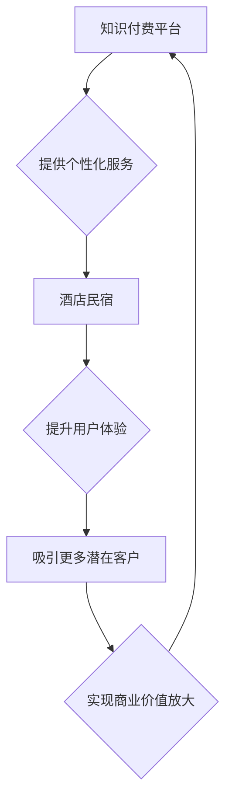

                 

## 关键词：知识付费、跨界营销、酒店民宿、数据分析、个性化推荐、用户体验

## 1. 背景介绍

近年来，知识付费行业蓬勃发展，从线上课程到付费咨询，人们越来越愿意为优质知识付费。与此同时，酒店民宿行业也面临着激烈的市场竞争，寻求新的增长点和差异化竞争优势。 

知识付费与酒店民宿的跨界融合，为双方带来新的机遇。酒店民宿可以通过知识付费平台，提供个性化服务、提升用户体验，吸引更多潜在客户。而知识付费平台则可以通过酒店民宿的资源和用户群体，拓展新的市场，实现商业价值的放大。

## 2. 核心概念与联系

### 2.1 知识付费

知识付费是指通过互联网平台，将知识、技能、经验等转化为付费产品或服务，并通过线上销售的方式，实现知识价值的流通和收益。

### 2.2 跨界营销

跨界营销是指企业将自身产品或服务与其他行业或品牌进行合作，共同推广，以扩大市场影响力、提升品牌知名度和用户粘性。

### 2.3 酒店民宿

酒店民宿是指以住宿为主，提供餐饮、休闲娱乐等增值服务的经营模式。它融合了酒店的专业服务和民宿的个性化体验，成为一种新的住宿选择。

**核心概念与联系流程图**



## 3. 核心算法原理 & 具体操作步骤

### 3.1 算法原理概述

知识付费与酒店民宿跨界营销的核心算法原理在于数据分析和个性化推荐。通过对用户行为数据、酒店民宿资源数据等进行分析，构建用户画像，并根据用户需求和偏好，推荐个性化的酒店民宿服务和知识付费产品。

### 3.2 算法步骤详解

1. **数据收集与清洗:** 收集用户行为数据（浏览记录、搜索历史、评价等）、酒店民宿资源数据（设施、价格、地理位置等），并进行清洗和预处理。
2. **用户画像构建:** 利用机器学习算法，对用户数据进行分析，构建用户画像，包括用户兴趣、需求、消费习惯等。
3. **酒店民宿资源匹配:** 根据用户画像，匹配用户感兴趣的酒店民宿资源，并进行排序和推荐。
4. **知识付费产品推荐:** 根据用户画像，推荐与用户兴趣相关的知识付费产品，例如旅行攻略、烹饪课程、语言学习等。
5. **个性化服务定制:** 根据用户需求，提供个性化的酒店民宿服务，例如定制行程、预订特色体验等。

### 3.3 算法优缺点

**优点:**

* **精准推荐:** 基于数据分析和用户画像，实现精准的推荐，提升用户体验。
* **个性化服务:** 提供个性化的酒店民宿服务，满足用户多样化的需求。
* **商业价值放大:** 帮助酒店民宿拓展新的市场，提升收入。

**缺点:**

* **数据依赖:** 算法效果依赖于数据质量和数量。
* **算法复杂:** 需要专业的技术人员进行开发和维护。
* **隐私安全:** 需要妥善处理用户数据，保障用户隐私安全。

### 3.4 算法应用领域

* **酒店民宿推荐:** 为用户推荐合适的酒店民宿，提高预订转化率。
* **个性化旅行定制:** 根据用户需求，定制个性化的旅行行程。
* **酒店民宿营销推广:** 通过数据分析，精准定位目标用户，进行营销推广。
* **用户体验优化:** 通过数据分析，了解用户需求，优化酒店民宿服务。

## 4. 数学模型和公式 & 详细讲解 & 举例说明

### 4.1 数学模型构建

**用户相似度计算模型:**

$$
Sim(u_i, u_j) = \frac{\sum_{k=1}^{n} \text{rating}(u_i, item_k) \times \text{rating}(u_j, item_k)}{\sqrt{\sum_{k=1}^{n} \text{rating}(u_i, item_k)^2} \times \sqrt{\sum_{k=1}^{n} \text{rating}(u_j, item_k)^2}}
$$

其中:

* $Sim(u_i, u_j)$ 表示用户 $u_i$ 和 $u_j$ 的相似度。
* $\text{rating}(u_i, item_k)$ 表示用户 $u_i$ 对物品 $item_k$ 的评分。
* $n$ 表示物品总数。

**酒店民宿推荐模型:**

$$
Score(u, h) = \alpha \times Sim(u, U_h) + \beta \times \text{feature}(u, h)
$$

其中:

* $Score(u, h)$ 表示用户 $u$ 对酒店民宿 $h$ 的推荐得分。
* $Sim(u, U_h)$ 表示用户 $u$ 与酒店民宿 $h$ 用户群体的相似度。
* $\text{feature}(u, h)$ 表示用户 $u$ 和酒店民宿 $h$ 的特征匹配度。
* $\alpha$ 和 $\beta$ 是权重参数。

### 4.2 公式推导过程

**用户相似度计算模型:**

该模型基于余弦相似度，计算两个用户对相同物品的评分之间的相关性。

**酒店民宿推荐模型:**

该模型综合考虑了用户与酒店民宿用户群体的相似度和用户与酒店民宿特征的匹配度，以权重的方式进行融合，最终得到推荐得分。

### 4.3 案例分析与讲解

假设有一个用户 $u_1$ 对美食和历史文化感兴趣，他评分了几个餐厅和博物馆。另一个用户 $u_2$ 也对美食和历史文化感兴趣，他评分了几个与 $u_1$ 相似的餐厅和博物馆。

根据用户相似度计算模型，我们可以计算出 $u_1$ 和 $u_2$ 的相似度。如果相似度较高，则表明这两个用户具有相似的兴趣爱好。

如果 $u_1$ 想要寻找一家新的酒店民宿，我们可以根据酒店民宿推荐模型，结合 $u_1$ 的兴趣爱好和 $u_2$ 的评分信息，推荐一些与 $u_1$ 兴趣相符的酒店民宿。

## 5. 项目实践：代码实例和详细解释说明

### 5.1 开发环境搭建

* Python 3.x
* Jupyter Notebook
* scikit-learn
* pandas
* numpy

### 5.2 源代码详细实现

```python
# 用户相似度计算
from sklearn.metrics.pairwise import cosine_similarity

# 用户评分数据
ratings = {
    'user1': {'item1': 5, 'item2': 3, 'item3': 4},
    'user2': {'item1': 4, 'item2': 5, 'item3': 3},
    'user3': {'item1': 3, 'item2': 4, 'item3': 5},
}

# 计算用户相似度矩阵
user_similarity = cosine_similarity(ratings)

# 打印用户相似度矩阵
print(user_similarity)

# 酒店民宿推荐
def recommend_hotel(user, hotels):
    # 计算用户与酒店民宿用户群体的相似度
    # ...

    # 计算用户与酒店民宿特征的匹配度
    # ...

    # 根据公式计算推荐得分
    # ...

    # 返回推荐得分最高的酒店民宿
    # ...

```

### 5.3 代码解读与分析

* 用户相似度计算部分使用 scikit-learn 库中的 cosine_similarity 函数计算用户之间的相似度。
* 酒店民宿推荐部分需要根据实际情况，实现用户与酒店民宿用户群体的相似度计算和用户与酒店民宿特征的匹配度计算。
* 推荐得分最高的酒店民宿可以通过排序算法得到。

### 5.4 运行结果展示

运行代码后，可以得到用户之间的相似度矩阵，以及根据用户兴趣和酒店民宿特征，推荐的酒店民宿列表。

## 6. 实际应用场景

### 6.1 个性化旅行定制

用户可以通过知识付费平台，学习旅行攻略、语言课程等，并根据自己的兴趣爱好，定制个性化的旅行行程。酒店民宿平台可以根据用户的旅行需求，推荐合适的酒店民宿，并提供定制服务，例如预订特色体验、安排当地导游等。

### 6.2 酒店民宿营销推广

酒店民宿平台可以通过知识付费平台，推出针对不同用户群体的营销推广活动，例如烹饪课程、摄影课程等，吸引目标用户，提升品牌知名度。

### 6.3 用户体验优化

酒店民宿平台可以通过数据分析，了解用户需求，优化酒店民宿服务，例如提供个性化推荐、定制服务等，提升用户体验。

### 6.4 未来应用展望

随着人工智能技术的不断发展，知识付费与酒店民宿跨界营销将更加深入，例如：

* **智能客服:** 利用人工智能技术，开发智能客服，为用户提供24小时在线服务，解答用户疑问，提供个性化推荐。
* **虚拟现实体验:** 利用虚拟现实技术，为用户提供酒店民宿的虚拟体验，帮助用户更好地了解酒店民宿的设施和环境。
* **个性化价格策略:** 利用数据分析，制定个性化价格策略，根据用户的消费习惯和需求，提供不同的价格优惠。

## 7. 工具和资源推荐

### 7.1 学习资源推荐

* **在线课程:** Coursera、edX、Udemy 等平台提供人工智能、数据分析等相关课程。
* **书籍:** 《Python机器学习实战》、《深度学习》等书籍。
* **博客:** 机器学习 Mastery、Towards Data Science 等博客。

### 7.2 开发工具推荐

* **Python:** 广泛应用于数据分析和机器学习领域。
* **Jupyter Notebook:** 用于编写和执行 Python 代码，并可视化数据。
* **scikit-learn:** Python 机器学习库，提供各种算法和工具。
* **pandas:** Python 数据分析库，用于数据处理和分析。
* **numpy:** Python 数值计算库，用于数值计算和矩阵操作。

### 7.3 相关论文推荐

* **Collaborative Filtering for Recommender Systems**
* **Deep Learning for Recommender Systems**
* **A Survey on Recommender Systems**

## 8. 总结：未来发展趋势与挑战

### 8.1 研究成果总结

知识付费与酒店民宿跨界营销的研究成果表明，数据分析和个性化推荐技术可以有效提升用户体验，并为双方带来新的商业价值。

### 8.2 未来发展趋势

* **更精准的推荐:** 利用更先进的机器学习算法，实现更精准的推荐，满足用户个性化需求。
* **更丰富的服务:** 提供更丰富的个性化服务，例如定制行程、预订特色体验等。
* **更智能的交互:** 利用人工智能技术，开发更智能的交互方式，例如语音助手、虚拟现实体验等。

### 8.3 面临的挑战

* **数据安全:** 需要妥善处理用户数据，保障用户隐私安全。
* **算法复杂度:** 需要不断优化算法，提高算法效率和准确性。
* **商业模式创新:** 需要探索新的商业模式，实现可持续发展。

### 8.4 研究展望

未来，知识付费与酒店民宿跨界营销将继续发展，并与其他领域进行融合，例如旅游、餐饮、文化等，为用户提供更全面的服务体验。


## 9. 附录：常见问题与解答

**Q1: 如何收集用户数据？**

A1: 可以通过用户注册、登录、浏览记录、搜索历史、评价等方式收集用户数据。

**Q2: 如何保证用户数据安全？**

A2: 需要采用加密技术、匿名化技术等手段，保护用户隐私安全。

**Q3: 如何评估算法效果？**

A3: 可以通过准确率、召回率、F1-score 等指标评估算法效果。

**Q4: 如何进行商业化运作？**

A4: 可以通过会员制度、广告合作、数据分析服务等方式进行商业化运作。


作者：禅与计算机程序设计艺术 / Zen and the Art of Computer Programming 
<end_of_turn>

