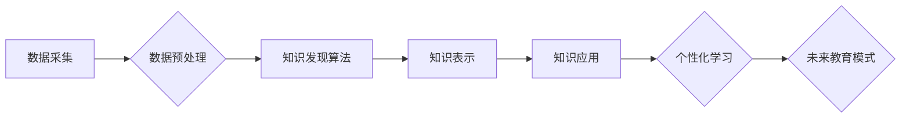

                 

## 知识发现引擎与未来教育模式的变革

> 关键词：知识发现引擎、人工智能、机器学习、个性化学习、教育模式变革、数据驱动教育

## 1. 背景介绍

教育，作为人类文明进步的基石，一直以来都致力于培养人才，传递知识，促进社会发展。然而，传统的教育模式往往面临着诸多挑战：

* **教学内容单一，缺乏个性化：** 传统的教学模式通常采用“一刀切”的方式，难以满足不同学生个性化的学习需求。
* **学习效率低下，缺乏互动性：** 传统的课堂教学模式被动性强，缺乏互动性，难以激发学生的学习兴趣和主动性。
* **教师负担重，难以精准指导：** 教师需要面对庞大的学生群体，难以对每个学生的学习情况进行精准的指导和反馈。

随着人工智能技术的飞速发展，知识发现引擎（Knowledge Discovery Engine，KDE）应运而生，为教育模式的变革提供了新的可能性。KDE是一种能够从海量数据中挖掘知识、发现模式和规律的智能系统，它可以帮助教育者更好地理解学生的学习情况，提供个性化的学习方案，提高学习效率，并减轻教师负担。

## 2. 核心概念与联系

**2.1 知识发现引擎（KDE）**

知识发现引擎是一种利用人工智能技术从海量数据中挖掘知识、发现模式和规律的智能系统。它通常包含以下几个核心模块：

* **数据采集模块：** 收集来自各种来源的学生学习数据，例如学习记录、考试成绩、课堂参与度等。
* **数据预处理模块：** 对收集到的数据进行清洗、转换、整合等操作，使其能够被KDE算法处理。
* **知识发现算法模块：** 利用机器学习、数据挖掘等算法从预处理后的数据中发现知识、模式和规律。
* **知识表示模块：** 将发现的知识以可理解的形式进行表示，例如知识图谱、规则等。
* **知识应用模块：** 将发现的知识应用于实际场景，例如个性化学习推荐、教学策略优化等。

**2.2  人工智能（AI）与机器学习（ML）**

人工智能（AI）是指模拟人类智能的计算机系统，它包括感知、学习、推理、决策等多种能力。机器学习（ML）是人工智能的一个子领域，它通过算法训练模型，使模型能够从数据中学习，并对新数据进行预测或分类。

**2.3  个性化学习**

个性化学习是指根据学生的个体差异，定制化的学习方案和学习体验。它强调学生的自主学习、探索学习和实践学习，旨在帮助学生更好地理解知识，提高学习效率。

**2.4  数据驱动教育**

数据驱动教育是指利用数据分析和人工智能技术，优化教育决策、改进教学方法和提升学习效果。它强调数据收集、分析和应用，以实现教育的科学化、精准化和个性化。

**2.5  未来教育模式**

未来教育模式将更加注重个性化、互动性和数据驱动，KDE将成为未来教育的重要组成部分。它将帮助教育者更好地了解学生的学习情况，提供个性化的学习方案，提高学习效率，并减轻教师负担。

**Mermaid 流程图**



## 3. 核心算法原理 & 具体操作步骤

**3.1  算法原理概述**

KDE的核心算法通常基于机器学习和数据挖掘技术，例如：

* **关联规则挖掘算法：** 用于发现数据中存在的关联关系，例如哪些学生学习哪些科目表现良好。
* **聚类算法：** 用于将学生根据学习情况、兴趣爱好等特征进行分组，例如将学生分为不同学习水平的班级。
* **预测算法：** 用于预测学生的学习成绩、学习兴趣等，例如预测学生是否会通过考试。

**3.2  算法步骤详解**

以关联规则挖掘算法为例，其具体操作步骤如下：

1. **数据收集：** 收集学生学习数据，例如学习记录、考试成绩、课堂参与度等。
2. **数据预处理：** 对收集到的数据进行清洗、转换、整合等操作，使其能够被算法处理。
3. **关联规则挖掘：** 利用关联规则挖掘算法从预处理后的数据中发现关联规则，例如“学习时间长，考试成绩高”。
4. **规则评估：** 对发现的关联规则进行评估，例如计算规则的支持度、置信度等指标，筛选出具有实际意义的规则。
5. **规则应用：** 将筛选出的关联规则应用于实际场景，例如根据规则推荐学习策略、个性化学习计划等。

**3.3  算法优缺点**

**优点：**

* 可以从海量数据中发现隐藏的知识和模式。
* 可以帮助教育者更好地理解学生的学习情况。
* 可以提供个性化的学习方案，提高学习效率。

**缺点：**

* 需要大量的训练数据，否则算法效果可能不佳。
* 算法结果可能存在偏差，需要进行仔细的评估和验证。
* 算法解释性较差，难以理解算法是如何得出结果的。

**3.4  算法应用领域**

KDE的应用领域非常广泛，例如：

* **个性化学习推荐：** 根据学生的学习情况和兴趣爱好，推荐合适的学习资源和学习计划。
* **教学策略优化：** 分析学生的学习数据，优化教学方法和教学内容。
* **学生学习行为分析：** 分析学生的学习行为模式，发现学习问题和潜在风险。
* **教育资源管理：** 帮助教育机构更好地管理和分配教育资源。

## 4. 数学模型和公式 & 详细讲解 & 举例说明

**4.1  数学模型构建**

KDE的数学模型通常基于统计学、概率论和机器学习等数学基础。例如，关联规则挖掘算法的数学模型可以描述如下：

* **支持度：**  表示关联规则在数据集中的出现频率。
* **置信度：** 表示给定一个条件，另一个条件发生的概率。
* **提升度：** 表示关联规则的置信度与两个条件独立出现的概率之比。

**4.2  公式推导过程**

* **支持度：**  $Support(A \rightarrow B) = \frac{Count(A \cap B)}{Count(A)}$

* **置信度：** $Confidence(A \rightarrow B) = \frac{Count(A \cap B)}{Count(A)}$

* **提升度：** $Lift(A \rightarrow B) = \frac{Confidence(A \rightarrow B)}{P(B)}$

其中：

* $A$ 和 $B$ 分别表示两个事件。
* $Count(A \cap B)$ 表示事件 $A$ 和 $B$ 同时发生的次数。
* $Count(A)$ 表示事件 $A$ 发生的次数。
* $P(B)$ 表示事件 $B$ 发生的概率。

**4.3  案例分析与讲解**

假设我们有一组学生学习数据，其中包含学生学习时间和考试成绩。通过关联规则挖掘算法，我们发现了一个关联规则：“学习时间长，考试成绩高”。

* **支持度：** 70% 的学生学习时间长，考试成绩也高。
* **置信度：** 如果一个学生学习时间长，那么他考试成绩高的概率为 80%。
* **提升度：** 关联规则的提升度为 1.2，表明学习时间长与考试成绩高之间存在正相关关系。

## 5. 项目实践：代码实例和详细解释说明

**5.1  开发环境搭建**

* 操作系统：Windows/Linux/macOS
* Python 版本：3.6+
* 必要的库：pandas, scikit-learn, matplotlib

**5.2  源代码详细实现**

```python
import pandas as pd
from sklearn.feature_extraction.text import TfidfVectorizer
from sklearn.metrics.pairwise import cosine_similarity

# 数据加载
data = pd.read_csv("student_data.csv")

# 文本特征提取
vectorizer = TfidfVectorizer()
text_features = vectorizer.fit_transform(data["learning_content"])

# 计算余弦相似度
similarity_matrix = cosine_similarity(text_features)

# 寻找相似学习内容
for i in range(len(data)):
    similar_indices = similarity_matrix[i].argsort()[:-6:-1]
    similar_contents = data["learning_content"].iloc[similar_indices]
    print(f"学生 {i} 的相似学习内容：\n{similar_contents}")
```

**5.3  代码解读与分析**

* 该代码示例展示了如何利用TF-IDF算法和余弦相似度计算学生学习内容的相似度。
* 首先，使用pandas库加载学生学习数据。
* 然后，使用TfidfVectorizer将学习内容转换为文本特征。
* 最后，使用cosine_similarity计算文本特征之间的余弦相似度，并根据相似度找到学生学习内容的相似内容。

**5.4  运行结果展示**

运行该代码后，将输出每个学生的相似学习内容列表，帮助教育者了解学生学习兴趣和需求，提供个性化的学习推荐。

## 6. 实际应用场景

**6.1  个性化学习推荐系统**

KDE可以用于构建个性化学习推荐系统，根据学生的学习情况、兴趣爱好和学习目标，推荐合适的学习资源和学习计划。例如，可以推荐学生学习相关的书籍、视频、在线课程等。

**6.2  智能教学助手**

KDE可以用于开发智能教学助手，帮助教师进行教学工作。例如，可以自动生成学习报告、分析学生的学习情况、提供个性化的学习建议等。

**6.3  学习行为分析系统**

KDE可以用于构建学习行为分析系统，分析学生的学习行为模式，发现学习问题和潜在风险。例如，可以发现哪些学生学习效率低、哪些学生容易感到迷茫等。

**6.4  未来应用展望**

随着人工智能技术的不断发展，KDE将在未来教育模式中发挥越来越重要的作用。例如，可以实现更加智能化的个性化学习、更加精准的教学策略优化、更加有效的学习行为分析等。

## 7. 工具和资源推荐

**7.1  学习资源推荐**

* **在线课程：** Coursera, edX, Udacity 等平台提供人工智能、机器学习、数据挖掘等方面的在线课程。
* **书籍：** 《人工智能导论》、《机器学习实战》、《数据挖掘概念与技术》等书籍可以帮助读者深入了解相关知识。
* **开源项目：** scikit-learn, TensorFlow, PyTorch 等开源项目可以帮助读者实践人工智能技术。

**7.2  开发工具推荐**

* **Python：** Python 是人工智能领域最常用的编程语言，拥有丰富的库和工具。
* **Jupyter Notebook：** Jupyter Notebook 是一个交互式编程环境，方便进行数据分析和模型开发。
* **IDE：** PyCharm, VS Code 等 IDE 可以提供更便捷的开发体验。

**7.3  相关论文推荐**

* **Association Rule Mining: Concept, Algorithms, and Applications**
* **A Survey on Knowledge Discovery from Textual Data**
* **Personalized Learning: A Survey**

## 8. 总结：未来发展趋势与挑战

**8.1  研究成果总结**

KDE在教育领域取得了显著的成果，例如个性化学习推荐、智能教学助手、学习行为分析等。

**8.2  未来发展趋势**

* **更精准的个性化学习：** 利用更先进的机器学习算法和数据分析技术，提供更加精准的个性化学习方案。
* **更智能的教学助手：** 开发更加智能的教学助手，能够自动生成学习报告、提供个性化的学习建议、辅助教师进行教学工作。
* **更全面的学习行为分析：** 分析学生的学习行为模式，发现学习问题和潜在风险，并提供相应的干预措施。

**8.3  面临的挑战**

* **数据隐私保护：** 教育数据涉及学生隐私，需要采取有效的措施保护学生数据安全。
* **算法解释性：** 许多机器学习算法的解释性较差，难以理解算法是如何得出结果的。
* **教师接受度：** 教师需要接受新的教育模式和技术，并学会如何利用KDE进行教学工作。

**8.4  研究展望**

未来，KDE的研究将更加注重数据隐私保护、算法解释性、教师培训等方面，以更好地服务于教育事业的发展。

## 9. 附录：常见问题与解答

**9.1  KDE的应用范围有哪些？**

KDE的应用范围非常广泛，例如个性化学习推荐、智能教学助手、学习行为分析、教育资源管理等。

**9.2  KDE需要哪些数据才能进行训练？**

KDE需要学生学习数据，例如学习记录、考试成绩、课堂参与度等。

**9.3  KDE的算法效果如何？**

KDE的算法效果取决于训练数据质量和算法选择。一般来说，训练数据越多，算法效果越好。

**9.4  如何评估KDE的性能？**

KDE的性能可以评估指标，例如支持度、置信度、提升度、准确率、召回率等。

**9.5  KDE的未来发展趋势是什么？**

KDE的未来发展趋势是更加精准的个性化学习、更加智能的教学助手、更加全面的学习行为分析等。


作者：禅与计算机程序设计艺术 / Zen and the Art of Computer Programming<end_of_turn>

