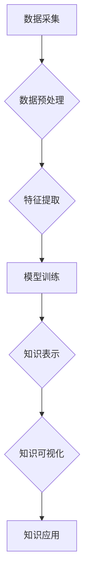

                 

## 知识发现引擎的深度学习模型应用

> 关键词：深度学习、知识发现、知识图谱、自然语言处理、推荐系统、机器学习、数据挖掘

## 1. 背景介绍

在海量数据时代，知识发现（Knowledge Discovery，KD）成为数据价值挖掘的关键。传统知识发现方法主要依赖于规则和统计分析，但面对复杂、半结构化和无结构数据，其能力受到限制。深度学习的兴起为知识发现带来了新的机遇。深度学习模型能够自动学习数据中的复杂模式和关系，有效提升知识发现的效率和准确性。

知识发现引擎（Knowledge Discovery Engine，KDE）是专门用于知识发现的软件系统，它通常包含数据预处理、特征提取、模型训练、知识表示和可视化等模块。深度学习模型的应用为KDE带来了以下优势：

* **自动特征提取:** 深度学习模型能够自动学习数据中的特征，无需人工设计，降低了知识发现的门槛。
* **处理复杂数据:** 深度学习模型能够处理复杂、半结构化和无结构数据，例如文本、图像、音频等，拓展了知识发现的范围。
* **提升发现精度:** 深度学习模型能够学习数据中的复杂模式和关系，提升知识发现的精度和准确性。

## 2. 核心概念与联系

**2.1 知识发现引擎 (KDE)**

知识发现引擎是一个用于从数据中发现知识的软件系统。它通常包含以下模块：

* **数据预处理:** 对原始数据进行清洗、转换和格式化，使其适合深度学习模型的训练。
* **特征提取:** 从数据中提取特征，用于训练深度学习模型。
* **模型训练:** 使用深度学习模型对数据进行训练，学习数据中的知识模式。
* **知识表示:** 将训练好的深度学习模型输出的知识表示成可理解的形式，例如知识图谱、规则等。
* **可视化:** 将知识以可视化的形式展示，方便用户理解和分析。

**2.2 深度学习模型**

深度学习模型是一种基于人工神经网络的机器学习模型。它由多个层组成，每层都包含多个神经元。神经元之间通过连接和权重进行信息传递。通过训练，深度学习模型能够学习数据中的复杂模式和关系。

**2.3 知识图谱**

知识图谱是一种结构化的知识表示形式，它将实体和关系以图的形式表示。实体代表现实世界中的事物，关系代表实体之间的联系。知识图谱能够有效地存储和组织知识，并支持知识推理和查询。

**2.4 自然语言处理 (NLP)**

自然语言处理是计算机科学的一个分支，它致力于使计算机能够理解和处理人类语言。深度学习模型在NLP领域取得了显著的进展，例如文本分类、情感分析、机器翻译等。

**2.5 推荐系统**

推荐系统是根据用户的历史行为和偏好，推荐用户可能感兴趣的内容或商品的系统。深度学习模型能够学习用户的隐性需求，提供更精准的推荐。

**2.6 流程图**



## 3. 核心算法原理 & 具体操作步骤

### 3.1 算法原理概述

深度学习模型在知识发现引擎中主要用于以下几个方面：

* **自动特征提取:** 使用卷积神经网络（CNN）或循环神经网络（RNN）等深度学习模型自动提取数据中的特征，例如文本中的关键词、图像中的物体、音频中的音调等。
* **知识表示学习:** 使用图神经网络（GNN）等深度学习模型学习知识图谱中的实体和关系，构建更丰富的知识表示。
* **知识推理:** 使用深度学习模型进行知识推理，例如根据已有的知识推断新的知识，回答用户的问题。

### 3.2 算法步骤详解

**3.2.1 自动特征提取**

1. **数据预处理:** 对原始数据进行清洗、转换和格式化，例如文本数据进行分词、去停用词等处理。
2. **特征提取:** 使用CNN或RNN等深度学习模型对数据进行特征提取。
3. **特征选择:** 选择最优的特征用于后续的知识发现任务。

**3.2.2 知识表示学习**

1. **知识图谱构建:** 将已有的知识数据构建成知识图谱。
2. **图神经网络训练:** 使用GNN等深度学习模型对知识图谱进行训练，学习实体和关系之间的关系。
3. **知识表示优化:** 使用优化算法优化知识表示，使其更准确和完整。

**3.2.3 知识推理**

1. **知识库构建:** 将训练好的知识表示存储到知识库中。
2. **推理规则定义:** 定义推理规则，用于根据已有的知识推断新的知识。
3. **推理执行:** 使用深度学习模型执行推理规则，推断新的知识。

### 3.3 算法优缺点

**优点:**

* 自动特征提取，降低了知识发现的门槛。
* 处理复杂数据，拓展了知识发现的范围。
* 提升发现精度，提高知识发现的效率和准确性。

**缺点:**

* 需要大量的训练数据。
* 模型训练时间长，计算资源消耗大。
* 模型解释性差，难以理解模型的决策过程。

### 3.4 算法应用领域

* **文本挖掘:** 从文本数据中发现主题、情感、趋势等知识。
* **图像识别:** 从图像数据中识别物体、场景、人物等知识。
* **语音识别:** 从语音数据中识别说话内容、情感等知识。
* **推荐系统:** 根据用户的历史行为和偏好，推荐用户可能感兴趣的内容或商品。
* **医疗诊断:** 从患者的病历、检查结果等数据中发现疾病的诊断依据。

## 4. 数学模型和公式 & 详细讲解 & 举例说明

### 4.1 数学模型构建

深度学习模型的数学模型通常基于神经网络，其核心是**激活函数**和**损失函数**。

* **激活函数:** 用于引入非线性，使神经网络能够学习复杂的数据模式。常见的激活函数包括ReLU、Sigmoid、Tanh等。

* **损失函数:** 用于衡量模型预测结果与真实值的差距，指导模型训练。常见的损失函数包括均方误差（MSE）、交叉熵损失（Cross-Entropy Loss）等。

### 4.2 公式推导过程

**4.2.1 ReLU 激活函数**

ReLU 激活函数的公式如下：

$$
f(x) = max(0, x)
$$

其中，x 是神经元的输入值。

ReLU 激活函数的特点是：

* 当输入值大于0时，输出值等于输入值；
* 当输入值小于0时，输出值等于0。

**4.2.2 均方误差 (MSE) 损失函数**

MSE 损失函数的公式如下：

$$
L = \frac{1}{N} \sum_{i=1}^{N} (y_i - \hat{y}_i)^2
$$

其中，N 是样本数量，$y_i$ 是真实值，$\hat{y}_i$ 是模型预测值。

MSE 损失函数衡量的是预测值与真实值之间的平方差。

### 4.3 案例分析与讲解

**4.3.1 图像分类**

使用 CNN 模型进行图像分类，例如识别猫和狗的图片。

* **数据:** 使用猫和狗的图片数据集进行训练。
* **模型:** 使用 CNN 模型，例如 AlexNet、VGGNet 等。
* **损失函数:** 使用交叉熵损失函数。
* **训练过程:** 将图片数据输入 CNN 模型，根据损失函数进行反向传播，更新模型参数。
* **结果:** 训练好的 CNN 模型能够识别猫和狗的图片。

## 5. 项目实践：代码实例和详细解释说明

### 5.1 开发环境搭建

* **操作系统:** Linux 或 Windows
* **编程语言:** Python
* **深度学习框架:** TensorFlow 或 PyTorch
* **其他工具:** Jupyter Notebook、Git 等

### 5.2 源代码详细实现

```python
# 使用 TensorFlow 构建一个简单的文本分类模型
import tensorflow as tf

# 定义模型结构
model = tf.keras.models.Sequential([
    tf.keras.layers.Embedding(input_dim=10000, output_dim=128),
    tf.keras.layers.LSTM(units=64),
    tf.keras.layers.Dense(units=1, activation='sigmoid')
])

# 编译模型
model.compile(optimizer='adam',
              loss='binary_crossentropy',
              metrics=['accuracy'])

# 训练模型
model.fit(x_train, y_train, epochs=10)

# 评估模型
loss, accuracy = model.evaluate(x_test, y_test)
print('Loss:', loss)
print('Accuracy:', accuracy)
```

### 5.3 代码解读与分析

* **Embedding 层:** 将单词转换为向量表示。
* **LSTM 层:** 学习文本序列中的上下文信息。
* **Dense 层:** 输出分类结果。
* **Adam 优化器:** 用于更新模型参数。
* **Binary Crossentropy 损失函数:** 用于二分类任务。
* **fit() 方法:** 用于训练模型。
* **evaluate() 方法:** 用于评估模型性能。

### 5.4 运行结果展示

训练完成后，可以将模型应用于新的文本数据进行分类。

## 6. 实际应用场景

### 6.1 文本分类

* **垃圾邮件过滤:** 将垃圾邮件和正常邮件进行分类。
* **情感分析:** 分析文本的情感倾向，例如正面、负面、中性。
* **主题提取:** 从文本中提取主题，例如新闻文章的主题、社交媒体帖子的主题。

### 6.2 图像识别

* **物体检测:** 从图像中识别物体，例如人、车、树等。
* **图像分类:** 将图像分类到不同的类别，例如猫、狗、鸟等。
* **图像分割:** 将图像分割成不同的区域，例如人、背景等。

### 6.3 语音识别

* **语音助手:** 例如 Siri、Alexa 等语音助手。
* **语音搜索:** 例如使用语音搜索 Google 等搜索引擎。
* **语音翻译:** 将语音从一种语言翻译成另一种语言。

### 6.4 未来应用展望

* **个性化推荐:** 根据用户的兴趣和偏好，提供个性化的商品推荐、内容推荐等。
* **智能医疗诊断:** 利用深度学习模型分析患者的病历、检查结果等数据，辅助医生进行诊断。
* **自动驾驶:** 利用深度学习模型识别道路、交通信号灯等信息，实现自动驾驶。

## 7. 工具和资源推荐

### 7.1 学习资源推荐

* **书籍:**
    * 深度学习 (Deep Learning) - Ian Goodfellow, Yoshua Bengio, Aaron Courville
    * 构建深度学习模型 (Hands-On Machine Learning with Scikit-Learn, Keras & TensorFlow) - Aurélien Géron
* **在线课程:**
    * Coursera: 深度学习 Specialization
    * Udacity: 深度学习 Nanodegree
    * fast.ai: 深度学习课程

### 7.2 开发工具推荐

* **深度学习框架:** TensorFlow, PyTorch, Keras
* **编程语言:** Python
* **数据处理工具:** Pandas, NumPy
* **可视化工具:** Matplotlib, Seaborn

### 7.3 相关论文推荐

* **AlexNet:** ImageNet Classification with Deep Convolutional Neural Networks
* **VGGNet:** Very Deep Convolutional Networks for Large-Scale Image Recognition
* **LSTM:** Long Short-Term Memory

## 8. 总结：未来发展趋势与挑战

### 8.1 研究成果总结

深度学习模型在知识发现引擎中取得了显著的进展，例如自动特征提取、知识表示学习、知识推理等。这些进展提升了知识发现的效率和准确性，拓展了知识发现的范围。

### 8.2 未来发展趋势

* **模型更深更广:** 研究更深层次、更广范围的深度学习模型，例如 Transformer、Graph Neural Networks 等。
* **解释性更强:** 研究更具解释性的深度学习模型，例如可解释深度学习 (XAI) 等。
* **数据更丰富:** 研究利用更多类型的数据进行知识发现，例如文本、图像、音频、视频等。
* **应用更广泛:** 将深度学习模型应用于更多领域，例如医疗诊断、自动驾驶、个性化推荐等。

### 8.3 面临的挑战

* **数据质量:** 深度学习模型对数据质量要求很高，需要大量的干净、准确的数据进行训练。
* **模型训练成本:** 深度学习模型的训练成本较高，需要大量的计算资源。
* **模型解释性:** 深度学习模型的决策过程难以理解，缺乏可解释性。

### 8.4 研究展望

未来，深度学习模型在知识发现引擎中的应用将更加广泛和深入。研究者将继续探索更深、更广、更强、更解释性的深度学习模型，并将其应用于更多领域，为人类社会带来更多价值。

## 9. 附录：常见问题与解答

**9.1 如何选择合适的深度学习模型？**

选择合适的深度学习模型取决于具体的知识发现任务和数据特点。例如，对于文本分类任务，可以使用 RNN 或 Transformer 模型；对于图像识别任务，可以使用 CNN 模型。

**9.2 如何处理深度学习模型训练中的过拟合问题？**

过拟合是指模型在训练数据上表现很好，但在测试数据上表现较差。处理过拟合的方法包括：

* **增加训练数据量**
* **使用正则化技术**
* **使用 dropout 技术**
* **使用 early stopping 技术**

**9.3 如何评估深度学习模型的性能？**

常用的评估指标包括准确率、召回率、F1-score、AUC 等。选择合适的评估指标取决于具体的知识发现任务。


作者：禅与计算机程序设计艺术 / Zen and the Art of Computer Programming<end_of_turn>

