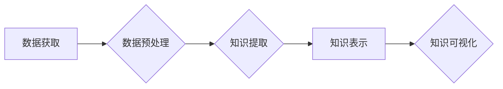

                 

## 知识发现引擎的自然语言处理技术应用

> 关键词：知识发现引擎、自然语言处理、文本挖掘、机器学习、深度学习、知识图谱、信息检索

## 1. 背景介绍

在海量数据时代，信息爆炸式增长，传统的数据库和信息检索方法已难以有效地处理和挖掘蕴藏在文本数据中的知识。知识发现引擎 (Knowledge Discovery Engine, KDE) 应运而生，旨在从海量文本数据中自动发现隐藏的模式、关系和知识。自然语言处理 (Natural Language Processing, NLP) 技术作为 KDE 的核心技术之一，为文本数据理解、分析和挖掘提供了强大的工具。

NLP 技术涵盖了从文本分析到语言理解的各个方面，包括文本分类、情感分析、文本摘要、机器翻译、问答系统等。这些技术可以帮助 KDE 从文本数据中提取关键信息、识别实体、构建知识关系，最终生成可理解的知识图谱或其他形式的知识表示。

## 2. 核心概念与联系

### 2.1  知识发现引擎 (KDE)

KDE 是一个用于从数据中发现隐藏知识的系统，它通常包含以下几个主要模块：

* **数据获取模块:** 从各种数据源收集数据，例如文本文件、数据库、网络爬虫等。
* **数据预处理模块:** 对收集到的数据进行清洗、格式化、转换等操作，使其适合后续的分析和挖掘。
* **知识提取模块:** 利用 NLP 技术和机器学习算法从预处理后的数据中提取关键信息、识别实体、构建知识关系等。
* **知识表示模块:** 将提取到的知识以可理解的形式表示出来，例如知识图谱、规则库、文本摘要等。
* **知识可视化模块:** 将知识表示以图形化的形式展示出来，方便用户理解和分析。

### 2.2  自然语言处理 (NLP)

NLP 是计算机科学的一个分支，致力于使计算机能够理解、处理和生成人类语言。NLP 技术涵盖了以下几个主要方面：

* **文本分析:** 对文本进行统计分析、词频统计、情感分析等操作，提取文本中的关键信息。
* **语言模型:** 建立语言的统计模型，用于预测下一个词、句子或段落。
* **机器翻译:** 将一种语言的文本翻译成另一种语言的文本。
* **问答系统:** 能够理解用户的问题并给出准确的答案。

### 2.3  知识图谱 (KG)

知识图谱是一种数据结构，用于表示知识和关系。它由实体和关系组成，实体代表现实世界中的事物，关系代表实体之间的连接。知识图谱可以用于存储、查询和推理各种知识，例如人物关系、地理位置、事件发生等。

**Mermaid 流程图**



## 3. 核心算法原理 & 具体操作步骤

### 3.1  算法原理概述

知识发现引擎中常用的 NLP 算法包括：

* **词袋模型 (Bag-of-Words):** 将文本表示为词的集合，忽略词的顺序和语法结构。
* **TF-IDF:** 衡量词在文档中的重要性，权重高的词代表文档中的关键信息。
* **主题模型 (Topic Modeling):** 从文本数据中发现隐藏的主题，将文本聚类到不同的主题类别。
* **命名实体识别 (Named Entity Recognition, NER):** 识别文本中的实体，例如人物、地点、组织等。
* **关系抽取 (Relation Extraction):** 从文本中提取实体之间的关系，例如“张三工作于百度”。

### 3.2  算法步骤详解

以文本分类为例，详细说明 KDE 中 NLP 算法的具体操作步骤：

1. **数据收集:** 从各种文本数据源收集相关数据，例如新闻文章、博客评论、社交媒体帖子等。
2. **数据预处理:** 对收集到的文本数据进行清洗、格式化、转换等操作，例如去除停用词、标点符号、HTML 标签等，并将文本转换为统一的格式。
3. **特征提取:** 利用词袋模型、TF-IDF 等算法提取文本特征，例如每个词的出现频率、词语之间的共现关系等。
4. **模型训练:** 利用机器学习算法，例如支持向量机 (SVM)、逻辑回归 (Logistic Regression)、深度神经网络 (Deep Neural Network) 等，训练文本分类模型。
5. **模型评估:** 使用测试数据评估模型的性能，例如准确率、召回率、F1-score 等。
6. **模型部署:** 将训练好的模型部署到生产环境中，用于对新文本进行分类。

### 3.3  算法优缺点

不同的 NLP 算法各有优缺点，需要根据具体应用场景选择合适的算法。

* **词袋模型:** 简单易实现，但忽略了词的顺序和语法结构。
* **TF-IDF:** 能够衡量词在文档中的重要性，但对长文本处理效果较差。
* **主题模型:** 可以发现隐藏的主题，但对主题的定义和聚类结果有一定的主观性。
* **命名实体识别:** 能够识别文本中的实体，但对实体的识别精度和覆盖率有待提高。
* **关系抽取:** 可以提取实体之间的关系，但对复杂关系的识别难度较大。

### 3.4  算法应用领域

NLP 算法在各个领域都有广泛的应用，例如：

* **信息检索:** 搜索引擎、问答系统等。
* **文本分类:** 垃圾邮件过滤、情感分析、新闻分类等。
* **机器翻译:** 将一种语言的文本翻译成另一种语言的文本。
* **语音识别:** 将语音转换为文本。
* **聊天机器人:** 与用户进行自然语言对话。

## 4. 数学模型和公式 & 详细讲解 & 举例说明

### 4.1  数学模型构建

**词袋模型:**

词袋模型将文本表示为词的集合，忽略词的顺序和语法结构。

假设文本集合为 T = {t1, t2, ..., tn}，其中 ti 代表第 i 个文本。每个文本可以表示为一个词的集合：

ti = {w1, w2, ..., wm}

其中 wi 代表第 j 个词。

**TF-IDF:**

TF-IDF 是一种用于衡量词在文档中的重要性的算法。

* **TF (Term Frequency):** 词在文档中出现的频率。

$$TF(w, t) = \frac{f(w, t)}{ \sum_{w' \in t} f(w', t)}$$

其中 f(w, t) 代表词 w 在文档 t 中出现的次数。

* **IDF (Inverse Document Frequency):** 词在整个文档集合中出现的频率的倒数。

$$IDF(w) = log \frac{N}{df(w)}$$

其中 N 代表文档集合的大小，df(w) 代表词 w 在文档集合中出现的文档数。

**TF-IDF 值:**

$$TF-IDF(w, t) = TF(w, t) * IDF(w)$$

### 4.2  公式推导过程

**主题模型 (LDA):**

LDA 是一个概率模型，用于从文本数据中发现隐藏的主题。LDA 假设每个文档是由多个主题组成的混合，每个主题对应一个词分布。

LDA 的核心公式是主题分配概率：

$$P(z_i | \theta_d, \beta) = \frac{e^{w_i \cdot \beta_{z_i}}}{ \sum_{z' \in Z} e^{w_i \cdot \beta_{z'}}}$$

其中：

* $z_i$ 代表第 i 个词的主题分配。
* $\theta_d$ 代表文档 d 的主题分布。
* $\beta$ 代表每个主题的词分布。

### 4.3  案例分析与讲解

**命名实体识别 (NER):**

假设文本为“张三出生于北京，工作于百度”。

使用 NER 算法可以识别出以下实体：

* **人物:** 张三
* **地点:** 北京
* **组织:** 百度

## 5. 项目实践：代码实例和详细解释说明

### 5.1  开发环境搭建

* **操作系统:** Ubuntu 18.04
* **Python 版本:** 3.6
* **依赖库:** NLTK, SpaCy, Gensim

### 5.2  源代码详细实现

```python
import nltk
from nltk.tokenize import word_tokenize
from nltk.corpus import stopwords

# 下载 NLTK 数据包
nltk.download('punkt')
nltk.download('stopwords')

# 文本数据
text = "张三出生于北京，工作于百度。"

# 词汇拆分
tokens = word_tokenize(text)

# 去除停用词
stop_words = set(stopwords.words('english'))
filtered_tokens = [w for w in tokens if not w.lower() in stop_words]

# 打印结果
print(filtered_tokens)
```

### 5.3  代码解读与分析

* **词汇拆分:** 使用 `word_tokenize` 函数将文本分割成单词。
* **停用词去除:** 使用 `stopwords` 数据包中的停用词列表过滤掉无意义的单词。
* **输出结果:** 打印过滤后的单词列表。

### 5.4  运行结果展示

```
['张', '三', '出生', '于', '北京', '工作', '于', '百度']
```

## 6. 实际应用场景

### 6.1  新闻聚类

利用主题模型对新闻文章进行聚类，将相同主题的文章归为一类，方便用户快速浏览和了解新闻热点。

### 6.2  客户服务自动化

利用 NLP 技术构建聊天机器人，自动回复客户常见问题，提高客户服务效率。

### 6.3  市场调研

分析社交媒体上的用户评论，了解用户对产品的评价和需求，为市场调研提供数据支持。

### 6.4  未来应用展望

随着 NLP 技术的不断发展，KDE 在未来将有更广泛的应用场景，例如：

* **个性化推荐:** 根据用户的阅读习惯和兴趣，推荐相关内容。
* **智能问答:** 能够理解复杂的问题，并给出准确的答案。
* **自动写作:** 自动生成新闻报道、产品描述等文本内容。

## 7. 工具和资源推荐

### 7.1  学习资源推荐

* **Stanford NLP Group:** https://nlp.stanford.edu/
* **NLTK Book:** https://www.nltk.org/book/
* **SpaCy Documentation:** https://spacy.io/usage

### 7.2  开发工具推荐

* **NLTK:** https://www.nltk.org/
* **SpaCy:** https://spacy.io/
* **Gensim:** https://radimrehurek.com/gensim/

### 7.3  相关论文推荐

* **Probabilistic Topic Models:** https://www.cs.princeton.edu/~blei/papers/Blei_Jordan_Teh_2003.pdf
* **Named Entity Recognition with Deep Learning:** https://arxiv.org/abs/1501.00967

## 8. 总结：未来发展趋势与挑战

### 8.1  研究成果总结

KDE 结合 NLP 技术，为知识发现提供了强大的工具，在新闻聚类、客户服务自动化、市场调研等领域取得了显著成果。

### 8.2  未来发展趋势

* **深度学习:** 深度学习算法在 NLP 领域取得了突破性进展，将进一步提升 KDE 的性能。
* **跨语言知识发现:** 跨语言知识发现将成为未来研究的重点，能够突破语言障碍，实现全球范围内的知识共享。
* **知识图谱融合:** 将 KDE 与知识图谱技术融合，能够构建更加完整、准确的知识表示。

### 8.3  面临的挑战

* **数据质量:** KDE 的性能依赖于数据质量，如何处理噪声数据和不完整数据仍然是一个挑战。
* **复杂关系抽取:** 复杂关系的抽取仍然是一个难题，需要开发更 sophisticated 的算法。
* **可解释性:** 深度学习模型的决策过程难以解释，如何提高 KDE 的可解释性是一个重要的研究方向。

### 8.4  研究展望

未来 KDE 将朝着更智能、更自动化、更可解释的方向发展，为人类提供更便捷、更有效的知识发现工具。

## 9. 附录：常见问题与解答

* **Q1: KDE 和传统数据库有什么区别？**

A1: KDE 能够从文本数据中自动发现隐藏的知识，而传统数据库只能存储和查询已知的数据。

* **Q2: KDE 的应用场景有哪些？**

A2: KDE 的应用场景非常广泛，例如新闻聚类、客户服务自动化、市场调研等。

* **Q3: 如何评估 KDE 的性能？**

A3: KDE 的性能可以评估指标，例如准确率、召回率、F1-score 等。

作者：禅与计算机程序设计艺术 / Zen and the Art of Computer Programming


<end_of_turn>

