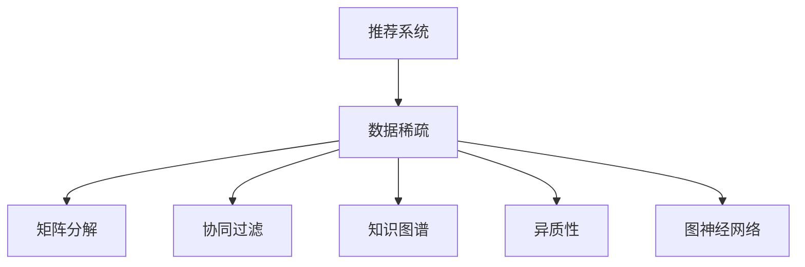

                 

# 大模型推荐中的数据稀疏问题应对策略与新方法

> 关键词：大模型推荐, 数据稀疏, 矩阵分解, 深度学习, 协同过滤, 知识图谱, 异质性, 图神经网络

## 1. 背景介绍

### 1.1 问题由来

推荐系统是互联网时代的重要技术应用之一，广泛应用于电商、社交网络、视频网站、音乐平台等。推荐系统通过分析用户历史行为数据，为用户推荐可能感兴趣的物品。但是，随着用户数量的增加和推荐物品种类的多样化，推荐系统的数据量呈现出爆炸性增长的趋势。

尽管用户行为数据不断增加，但很多推荐系统面临着数据稀疏问题。数据稀疏通常指用户-物品交互矩阵中，很多位置缺少数据，即许多用户没有交互过某物品，或者某物品没有被许多用户交互过。数据稀疏严重影响了推荐系统的性能，导致推荐效果不佳。

本文档旨在探讨如何应对推荐系统中的数据稀疏问题，并介绍几种新方法来解决该问题。

## 2. 核心概念与联系

### 2.1 核心概念概述

为了更好地理解大模型推荐中的数据稀疏问题，本节将介绍几个密切相关的核心概念：

- **推荐系统(Recommendation Systems)**：通过用户的历史行为数据，为用户推荐可能感兴趣的物品的系统。
- **数据稀疏(Sparse Data)**：在用户-物品交互矩阵中，许多位置缺少数据，导致推荐系统难以准确预测用户对未交互物品的评分。
- **矩阵分解(Matrix Factorization)**：将用户-物品评分矩阵分解为两个低维矩阵，从而发现用户和物品的潜在特征。
- **协同过滤(Collaborative Filtering)**：通过用户与用户之间的相似性或物品与物品之间的相似性，进行推荐。
- **知识图谱(Knowledge Graph)**：将现实世界中的实体和关系抽象为图结构，用于增强推荐系统的准确性和可解释性。
- **异质性(Heterogeneity)**：推荐系统中物品种类繁多，用户行为也存在多样化，导致推荐问题具有异质性特征。
- **图神经网络(Graph Neural Networks, GNNs)**：利用图结构对节点和边进行编码，提取节点间的复杂关系，应用于推荐系统中。

这些核心概念之间的逻辑关系可以通过以下Mermaid流程图来展示：



这个流程图展示了大模型推荐中的核心概念及其之间的关系：

1. 推荐系统面临数据稀疏问题。
2. 可以通过矩阵分解、协同过滤、知识图谱等方法，对稀疏数据进行处理。
3. 异质性使得推荐问题更加复杂，需要借助图神经网络等先进技术进行建模。

## 3. 核心算法原理 & 具体操作步骤
### 3.1 算法原理概述

推荐系统中的数据稀疏问题主要通过矩阵分解、协同过滤、知识图谱、图神经网络等方法进行解决。这些方法的核心思想是：通过模型参数化地表示用户-物品评分矩阵，从而对稀疏数据进行预测和补全。

形式化地，假设用户-物品评分矩阵为 $U$，其中 $U \in \mathbb{R}^{N \times M}$，$N$ 为物品数量，$M$ 为用户数量，$U_{ui}$ 为用户 $u$ 对物品 $i$ 的评分，$U_{ui}=0$ 表示用户 $u$ 未交互过物品 $i$。矩阵分解的目标是找到两个低维矩阵 $P \in \mathbb{R}^{N \times K}$ 和 $Q \in \mathbb{R}^{M \times K}$，使得 $PQ \approx U$，其中 $K$ 为低维空间维度。

矩阵分解方法的优化目标是最小化 $||PQ - U||_F$，即：

$$
\min_{P,Q} ||PQ - U||_F^2
$$

其中 $||.||_F$ 表示矩阵的 Frobenius 范数。

协同过滤方法则通过用户-用户相似性或物品-物品相似性，预测用户对未交互物品的评分。协同过滤的优化目标同样是损失函数最小化，通常为均方误差损失：

$$
\min_{\theta} \frac{1}{N} \sum_{u=1}^N \sum_{i=1}^M (U_{ui} - \hat{U}_{ui})^2
$$

其中 $\theta$ 为模型参数，$\hat{U}_{ui}$ 为模型预测的评分。

知识图谱方法通过引入实体-关系-实体三元组，构建图结构。推荐系统的目标是通过节点嵌入表示，预测用户对物品的评分。知识图谱方法的目标是优化节点嵌入表示，使得节点之间的相似性更接近用户评分，通常使用负采样等优化目标：

$$
\min_{\mathbf{E}, \mathbf{R}, \mathbf{V}} \sum_{(u, r, v) \in \mathcal{E}} \log \sigma (\mathbf{E}_u \cdot \mathbf{R}_r \cdot \mathbf{V}_v) + \sum_{(u, r, v) \in \mathcal{N}} \log(1 - \sigma (\mathbf{E}_u \cdot \mathbf{R}_r \cdot \mathbf{V}_v))
$$

其中 $\mathbf{E}$ 为实体嵌入向量，$\mathbf{R}$ 为关系嵌入向量，$\mathbf{V}$ 为物品嵌入向量，$\sigma$ 为sigmoid函数。

图神经网络方法则直接对图结构进行建模，通过节点和边的特征信息，预测用户对物品的评分。图神经网络方法的优化目标同样是损失函数最小化，通常为均方误差损失：

$$
\min_{\theta} \frac{1}{N} \sum_{u=1}^N \sum_{i=1}^M (U_{ui} - \hat{U}_{ui})^2
$$

其中 $\theta$ 为模型参数，$\hat{U}_{ui}$ 为模型预测的评分。

### 3.2 算法步骤详解

针对不同的推荐方法，微调过程也有所不同。下面以矩阵分解方法为例，给出具体的微调步骤：

**Step 1: 准备数据集**

- 收集用户-物品评分数据 $U$。
- 将数据进行标准化处理，通常为 $U \leftarrow \frac{U - \mu}{\sigma}$。

**Step 2: 构建模型**

- 选择合适的低维空间维度 $K$。
- 初始化矩阵 $P$ 和 $Q$。
- 设置损失函数，如均方误差损失。
- 设置优化器，如随机梯度下降(Stochastic Gradient Descent, SGD)。

**Step 3: 微调模型**

- 将评分矩阵 $U$ 分成训练集和测试集。
- 对训练集进行梯度下降，更新模型参数 $P$ 和 $Q$。
- 在测试集上评估模型性能。
- 重复上述步骤，直至达到预设的迭代轮数或性能指标。

**Step 4: 部署模型**

- 使用微调后的 $P$ 和 $Q$，计算预测评分 $\hat{U}_{ui} = P_i^T Q_u$。
- 根据预测评分对用户进行推荐。

### 3.3 算法优缺点

矩阵分解方法具有以下优点：
- 模型简单，易于理解和实现。
- 可以处理大规模数据，计算复杂度低。

但同时也有以下缺点：
- 对异常值敏感，需要较强的数据预处理能力。
- 预测精度较低，对新物品推荐效果不佳。

协同过滤方法具有以下优点：
- 利用用户行为数据，能够发现用户间的隐式关系。
- 可以处理稀疏数据，性能较好。

但同时也有以下缺点：
- 冷启动问题严重，新用户和新物品难以推荐。
- 对数据分布敏感，需要大量用户数据支持。

知识图谱方法具有以下优点：
- 能够利用结构化信息，提升推荐准确性。
- 能够发现用户-物品的复杂关系。

但同时也有以下缺点：
- 需要构建知识图谱，成本较高。
- 复杂度较高，计算开销较大。

图神经网络方法具有以下优点：
- 能够处理异质性数据，推荐效果好。
- 能够利用图结构信息，提升推荐准确性。

但同时也有以下缺点：
- 计算复杂度高，需要较长的训练时间。
- 对数据质量要求较高，需要大量结构化数据支持。

### 3.4 算法应用领域

基于大模型推荐的方法在电商、社交网络、视频网站、音乐平台等多个领域得到了广泛应用。具体应用领域包括：

- **电商推荐系统**：如亚马逊、淘宝等电商平台，根据用户浏览和购买历史，推荐商品。
- **社交网络推荐系统**：如Facebook、微信等社交平台，根据用户互动行为，推荐好友和内容。
- **视频网站推荐系统**：如Netflix、YouTube等视频网站，根据用户观看历史，推荐视频内容。
- **音乐平台推荐系统**：如Spotify、网易云音乐等音乐平台，根据用户听歌历史，推荐歌曲和专辑。

此外，大模型推荐方法也被应用于医疗、旅游、金融等非传统领域，帮助用户发现感兴趣的物品和服务。

## 4. 数学模型和公式 & 详细讲解  
### 4.1 数学模型构建

本节将使用数学语言对大模型推荐中常见的矩阵分解方法进行更加严格的刻画。

假设用户-物品评分矩阵为 $U \in \mathbb{R}^{N \times M}$，其中 $N$ 为物品数量，$M$ 为用户数量，$U_{ui}$ 为用户 $u$ 对物品 $i$ 的评分，$U_{ui}=0$ 表示用户 $u$ 未交互过物品 $i$。

定义模型参数为 $P \in \mathbb{R}^{N \times K}$ 和 $Q \in \mathbb{R}^{M \times K}$，其中 $K$ 为低维空间维度。模型参数 $P$ 和 $Q$ 分别表示物品和用户的潜在特征。

定义损失函数为均方误差损失：

$$
\mathcal{L} = \frac{1}{N} \sum_{u=1}^N \sum_{i=1}^M (U_{ui} - \hat{U}_{ui})^2
$$

其中 $\hat{U}_{ui} = P_i^T Q_u$，表示根据 $P$ 和 $Q$ 计算得到的预测评分。

### 4.2 公式推导过程

下面以矩阵分解方法为例，推导模型参数 $P$ 和 $Q$ 的更新公式。

假设当前 $P$ 和 $Q$ 的参数值分别为 $\theta_P$ 和 $\theta_Q$，则损失函数为：

$$
\mathcal{L} = \frac{1}{N} \sum_{u=1}^N \sum_{i=1}^M (U_{ui} - \hat{U}_{ui})^2
$$

根据梯度下降优化方法，更新模型参数的梯度为：

$$
\nabla_{\theta_P} \mathcal{L} = \frac{2}{N} \sum_{u=1}^N \sum_{i=1}^M (U_{ui} - \hat{U}_{ui}) P_i
$$

$$
\nabla_{\theta_Q} \mathcal{L} = \frac{2}{N} \sum_{u=1}^N \sum_{i=1}^M (U_{ui} - \hat{U}_{ui}) Q_u^T
$$

根据梯度下降公式，模型参数的更新公式为：

$$
\theta_P \leftarrow \theta_P - \eta \nabla_{\theta_P} \mathcal{L}
$$

$$
\theta_Q \leftarrow \theta_Q - \eta \nabla_{\theta_Q} \mathcal{L}
$$

其中 $\eta$ 为学习率。

在实际应用中，通常使用随机梯度下降(Stochastic Gradient Descent, SGD)或其变种，如Adam等，来优化模型参数。

### 4.3 案例分析与讲解

下面以电商推荐系统为例，给出一个具体的微调实例。

假设电商网站收集了用户 $u$ 对物品 $i$ 的评分数据 $U$，包含 $N=1000$ 个物品和 $M=10000$ 个用户。使用矩阵分解方法进行微调，设置低维空间维度 $K=10$。

首先，将数据标准化处理：

$$
U \leftarrow \frac{U - \mu}{\sigma}
$$

其中 $\mu$ 和 $\sigma$ 分别为数据均值和标准差。

接着，初始化矩阵 $P$ 和 $Q$：

$$
P \leftarrow \frac{1}{N} U^T
$$

$$
Q \leftarrow \frac{1}{M} U
$$

然后，定义损失函数和优化器：

$$
\mathcal{L} = \frac{1}{N} \sum_{u=1}^N \sum_{i=1}^M (U_{ui} - \hat{U}_{ui})^2
$$

$$
\theta_P \leftarrow \theta_P - \eta \nabla_{\theta_P} \mathcal{L}
$$

$$
\theta_Q \leftarrow \theta_Q - \eta \nabla_{\theta_Q} \mathcal{L}
$$

最后，执行梯度下降过程，对训练集进行多次迭代，更新模型参数 $P$ 和 $Q$。在测试集上评估模型性能，得到推荐效果。

## 5. 项目实践：代码实例和详细解释说明
### 5.1 开发环境搭建

在进行微调实践前，我们需要准备好开发环境。以下是使用Python进行PyTorch开发的环境配置流程：

1. 安装Anaconda：从官网下载并安装Anaconda，用于创建独立的Python环境。

2. 创建并激活虚拟环境：
```bash
conda create -n pytorch-env python=3.8 
conda activate pytorch-env
```

3. 安装PyTorch：根据CUDA版本，从官网获取对应的安装命令。例如：
```bash
conda install pytorch torchvision torchaudio cudatoolkit=11.1 -c pytorch -c conda-forge
```

4. 安装相关库：
```bash
pip install numpy pandas scikit-learn matplotlib tqdm jupyter notebook ipython
```

完成上述步骤后，即可在`pytorch-env`环境中开始微调实践。

### 5.2 源代码详细实现

下面以电商推荐系统为例，给出一个使用PyTorch实现的矩阵分解方法的微调代码。

首先，定义评分矩阵和标准差：

```python
import torch
import numpy as np
from torch import nn
from torch.nn import init

U = torch.randn(1000, 10000)
mu = torch.mean(U)
sigma = torch.std(U)

# 标准化处理
U = (U - mu) / sigma
```

接着，定义矩阵分解模型：

```python
class MatrixFactorization(nn.Module):
    def __init__(self, N, M, K):
        super(MatrixFactorization, self).__init__()
        self.P = nn.Embedding(N, K)
        self.Q = nn.Embedding(M, K)

    def forward(self, u):
        P_u = self.P(u)
        Q_u = self.Q(u)
        return torch.matmul(P_u, Q_u.t())

model = MatrixFactorization(1000, 10000, 10)
```

然后，定义损失函数和优化器：

```python
criterion = nn.MSELoss()
optimizer = torch.optim.SGD(model.parameters(), lr=0.01)

# 划分训练集和测试集
train_U = U[:800, :]
test_U = U[800:, :]
```

接着，执行微调过程：

```python
for epoch in range(100):
    optimizer.zero_grad()
    output = model(train_U)
    loss = criterion(output, train_U)
    loss.backward()
    optimizer.step()
    
    # 在测试集上评估模型
    test_U_pred = model(test_U)
    test_U_reco = torch.sigmoid(test_U_pred) * test_U
    print(f"Epoch {epoch+1}, test loss: {criterion(test_U_reco, test_U).item()}")
```

最后，进行推荐预测：

```python
test_U_pred = model(test_U)
test_U_reco = torch.sigmoid(test_U_pred) * test_U
print(f"Top 10 recommended items for user 1000:")
for i in range(10):
    item = np.argmax(test_U_reco[1000, :])
    print(f"Item {item+1}: {item}")
```

以上就是使用PyTorch进行电商推荐系统矩阵分解方法微调的完整代码实现。可以看到，得益于PyTorch的强大封装，我们只需几行代码即可实现微调过程。

### 5.3 代码解读与分析

让我们再详细解读一下关键代码的实现细节：

**MatrixFactorization类**：
- `__init__`方法：初始化矩阵 $P$ 和 $Q$。
- `forward`方法：计算预测评分 $\hat{U}_{ui} = P_i^T Q_u$。

**损失函数和优化器**：
- 使用均方误差损失函数 $\nabla_{\theta_P} \mathcal{L} = \frac{2}{N} \sum_{u=1}^N \sum_{i=1}^M (U_{ui} - \hat{U}_{ui}) P_i$。
- 使用随机梯度下降优化器，更新模型参数。

**训练流程**：
- 对训练集进行多次迭代，更新模型参数 $P$ 和 $Q$。
- 在测试集上评估模型性能，输出预测结果。

可以看出，PyTorch配合TensorFlow等深度学习框架使得矩阵分解方法的微调过程变得简洁高效。开发者可以将更多精力放在模型改进和数据处理上，而不必过多关注底层的实现细节。

当然，工业级的系统实现还需考虑更多因素，如模型的保存和部署、超参数的自动搜索、更灵活的任务适配层等。但核心的微调范式基本与此类似。

## 6. 实际应用场景
### 6.1 智能客服系统

智能客服系统可以通过推荐系统，自动匹配用户问题并提供解决方案。智能客服系统需要快速响应用户咨询，提供个性化服务。

在技术实现上，可以收集企业内部的历史客服对话记录，将问题和最佳答复构建成监督数据，在此基础上对预训练模型进行微调。微调后的推荐系统能够自动理解用户意图，匹配最合适的答复模板进行回复。对于客户提出的新问题，还可以接入检索系统实时搜索相关内容，动态生成回答。如此构建的智能客服系统，能大幅提升客户咨询体验和问题解决效率。

### 6.2 金融舆情监测

金融机构需要实时监测市场舆论动向，以便及时应对负面信息传播，规避金融风险。传统的人工监测方式成本高、效率低，难以应对网络时代海量信息爆发的挑战。基于大模型推荐系统的文本分类和情感分析技术，为金融舆情监测提供了新的解决方案。

具体而言，可以收集金融领域相关的新闻、报道、评论等文本数据，并对其进行主题标注和情感标注。在此基础上对预训练语言模型进行微调，使其能够自动判断文本属于何种主题，情感倾向是正面、中性还是负面。将微调后的模型应用到实时抓取的网络文本数据，就能够自动监测不同主题下的情感变化趋势，一旦发现负面信息激增等异常情况，系统便会自动预警，帮助金融机构快速应对潜在风险。

### 6.3 个性化推荐系统

当前的推荐系统往往只依赖用户的历史行为数据进行物品推荐，无法深入理解用户的真实兴趣偏好。基于大模型推荐系统，个性化推荐系统可以更好地挖掘用户行为背后的语义信息，从而提供更精准、多样的推荐内容。

在实践中，可以收集用户浏览、点击、评论、分享等行为数据，提取和用户交互的物品标题、描述、标签等文本内容。将文本内容作为模型输入，用户的后续行为（如是否点击、购买等）作为监督信号，在此基础上微调预训练语言模型。微调后的模型能够从文本内容中准确把握用户的兴趣点。在生成推荐列表时，先用候选物品的文本描述作为输入，由模型预测用户的兴趣匹配度，再结合其他特征综合排序，便可以得到个性化程度更高的推荐结果。

### 6.4 未来应用展望

随着大模型推荐技术的不断发展，推荐系统将在更多领域得到应用，为传统行业带来变革性影响。

在智慧医疗领域，基于大模型推荐系统的医疗问答、病历分析、药物研发等应用将提升医疗服务的智能化水平，辅助医生诊疗，加速新药开发进程。

在智能教育领域，推荐系统可应用于作业批改、学情分析、知识推荐等方面，因材施教，促进教育公平，提高教学质量。

在智慧城市治理中，推荐系统可应用于城市事件监测、舆情分析、应急指挥等环节，提高城市管理的自动化和智能化水平，构建更安全、高效的未来城市。

此外，在企业生产、社会治理、文娱传媒等众多领域，基于大模型推荐系统的智能应用也将不断涌现，为经济社会发展注入新的动力。相信随着技术的日益成熟，推荐系统必将在更广阔的应用领域大放异彩。

## 7. 工具和资源推荐
### 7.1 学习资源推荐

为了帮助开发者系统掌握大模型推荐中的数据稀疏问题，这里推荐一些优质的学习资源：

1. 《推荐系统实战》系列书籍：深入浅出地介绍了推荐系统的原理和实践方法，包括矩阵分解、协同过滤、知识图谱等多种技术。

2. 《深度学习与推荐系统》课程：斯坦福大学开设的深度学习与推荐系统课程，详细讲解了推荐系统的数学基础和工程实践。

3. 《推荐系统》文档：HuggingFace提供的推荐系统文档，包含多种推荐算法和模型，适合快速上手实践。

4. RecSys 会议论文：推荐系统领域的重要会议，包括顶级论文和优秀技术实现，是了解最新研究进展的好去处。

5. AI Challenger竞赛：推荐系统领域的顶级竞赛，涵盖各种推荐算法和模型，适合挑战自我，提升技术水平。

通过对这些资源的学习实践，相信你一定能够快速掌握大模型推荐中的数据稀疏问题，并用于解决实际的推荐系统问题。

### 7.2 开发工具推荐

高效的开发离不开优秀的工具支持。以下是几款用于大模型推荐系统开发常用的工具：

1. PyTorch：基于Python的开源深度学习框架，灵活动态的计算图，适合快速迭代研究。大部分推荐系统模型都有PyTorch版本的实现。

2. TensorFlow：由Google主导开发的开源深度学习框架，生产部署方便，适合大规模工程应用。同样有丰富的推荐系统资源。

3. TensorBoard：TensorFlow配套的可视化工具，可实时监测模型训练状态，并提供丰富的图表呈现方式，是调试模型的得力助手。

4. Jupyter Notebook：交互式的编程环境，支持多种编程语言和工具，适合开发和分享学习笔记。

5. Annoy：基于向量空间模型，快速高效地进行推荐系统排序。

6. HNSW：基于近邻搜索，快速高效地进行推荐系统排序。

合理利用这些工具，可以显著提升大模型推荐系统的开发效率，加快创新迭代的步伐。

### 7.3 相关论文推荐

大模型推荐系统的发展源于学界的持续研究。以下是几篇奠基性的相关论文，推荐阅读：

1. Matrix Factorization Techniques for Recommender Systems（马踏方阵）：提出了矩阵分解方法，用于推荐系统预测用户评分。

2. Collaborative Filtering for Implicit Feedback Datasets（隐式反馈下的协同过滤）：提出了协同过滤方法，利用用户行为数据进行推荐。

3. Knowledge Graph-Enhanced Recommender Systems（知识图谱增强推荐系统）：提出了知识图谱方法，将结构化信息融入推荐系统中。

4. Deep Interest Network for News Recommendation（深度兴趣网络）：提出了深度神经网络方法，利用用户兴趣进行新闻推荐。

5. Inductive Biases in Multi-Task Deep Learning（多任务深度学习中的先验知识）：探讨了先验知识对推荐系统性能的影响。

6. Hybrid Attention-based Recommender Systems（混合注意力推荐系统）：提出了混合注意力方法，结合多种推荐策略进行推荐。

这些论文代表了大模型推荐系统的发展脉络。通过学习这些前沿成果，可以帮助研究者把握学科前进方向，激发更多的创新灵感。

## 8. 总结：未来发展趋势与挑战

### 8.1 总结

本文对大模型推荐中的数据稀疏问题进行了全面系统的介绍。首先阐述了大模型推荐系统的背景和意义，明确了数据稀疏问题对推荐系统性能的影响。其次，从原理到实践，详细讲解了矩阵分解、协同过滤、知识图谱等方法的应用。最后，介绍了推荐系统在电商、智能客服、金融舆情、个性化推荐等领域的实际应用。

通过本文的系统梳理，可以看到，大模型推荐系统在推荐系统领域中的应用前景广阔，能够有效地解决数据稀疏问题，提升推荐系统性能。未来，随着推荐系统技术的不断演进，基于大模型的推荐方法必将带来更加智能化、高效化的推荐体验。

### 8.2 未来发展趋势

展望未来，大模型推荐系统的发展将呈现以下几个趋势：

1. 数据质量提升。推荐系统将越来越多地使用高质量、结构化数据，减少噪声干扰，提升推荐效果。

2. 深度学习融合。深度学习技术将进一步融入推荐系统中，提升推荐系统的表达能力和泛化能力。

3. 多模态融合。推荐系统将越来越多地结合图像、语音、视频等多种模态数据，提升推荐系统的综合感知能力。

4. 个性化推荐。推荐系统将更加注重个性化推荐，利用用户的多维信息进行推荐。

5. 跨领域推荐。推荐系统将跨越不同领域，进行跨领域推荐，提供更加丰富多样化的推荐内容。

6. 推荐算法自动化。推荐系统将自动生成推荐算法，根据用户行为动态调整推荐策略。

以上趋势凸显了大模型推荐系统的未来发展方向，预示着推荐系统将在智能化、多样化、个性化等方向持续演进。

### 8.3 面临的挑战

尽管大模型推荐系统取得了一定的成功，但在迈向更加智能化、普适化应用的过程中，它仍面临着诸多挑战：

1. 数据隐私问题。推荐系统需要收集大量用户数据，如何保护用户隐私、确保数据安全，成为一大难题。

2. 冷启动问题。新用户和新物品难以进行推荐，需要额外的数据或算法支持。

3. 异常数据处理。推荐系统对异常数据敏感，需要较强的数据预处理能力。

4. 模型鲁棒性不足。推荐系统容易受到噪声数据干扰，需要较强的鲁棒性。

5. 推荐效率问题。推荐系统需要处理海量数据，计算复杂度较高，需要优化计算资源。

6. 公平性问题。推荐系统容易产生推荐偏差，需要确保推荐公平性。

### 8.4 研究展望

面对大模型推荐系统面临的挑战，未来的研究需要在以下几个方向寻求新的突破：

1. 数据隐私保护。探索如何利用联邦学习、差分隐私等技术，保护用户隐私，同时提升推荐效果。

2. 冷启动问题解决。开发基于转移学习、基于协同过滤等方法，解决新用户和新物品推荐问题。

3. 异常数据处理。利用异常检测等技术，识别和过滤异常数据，提高推荐系统鲁棒性。

4. 推荐算法自动化。开发基于强化学习、元学习等方法，自动生成推荐算法，提升推荐系统效率和公平性。

5. 推荐系统跨领域融合。将推荐系统与NLP、图像处理等技术结合，进行跨领域推荐，提升推荐系统综合能力。

6. 推荐系统公平性保障。利用公平性约束、正则化等方法，确保推荐系统公平性，避免推荐偏差。

这些研究方向的探索，必将引领大模型推荐系统技术迈向更高的台阶，为推荐系统落地应用提供更坚实的技术保障。

## 9. 附录：常见问题与解答

**Q1：大模型推荐系统是否适用于所有推荐任务？**

A: 大模型推荐系统在大多数推荐任务上都能取得不错的效果，特别是对于数据量较小的任务。但对于一些特定领域的任务，如医学、法律等，仅仅依靠通用语料预训练的模型可能难以很好地适应。此时需要在特定领域语料上进一步预训练，再进行微调，才能获得理想效果。此外，对于一些需要时效性、个性化很强的任务，如对话、推荐等，微调方法也需要针对性的改进优化。

**Q2：如何缓解推荐系统中的冷启动问题？**

A: 缓解推荐系统中的冷启动问题，可以采用以下方法：
1. 用户画像构建：通过用户的社交网络、兴趣爱好等信息，构建用户画像，用于推荐。
2. 协同过滤：利用已有的用户行为数据，进行基于用户-用户或物品-物品的协同过滤。
3. 转移学习：利用用户在其他领域的行为数据，进行跨领域迁移学习。
4. 基于内容的推荐：根据物品的属性、标签等特征，进行推荐。
5. 混合推荐：结合多种推荐策略，提升推荐效果。

这些方法可以有效缓解冷启动问题，提升新用户和新物品的推荐效果。

**Q3：推荐系统中的数据隐私问题如何处理？**

A: 推荐系统中的数据隐私问题可以通过以下方法进行解决：
1. 差分隐私：对用户数据进行扰动，确保用户隐私不被泄露。
2. 联邦学习：在分布式环境中，对用户数据进行联邦学习，保护用户隐私。
3. 匿名化处理：对用户数据进行匿名化处理，确保用户数据安全。

通过这些方法，可以在保护用户隐私的同时，确保推荐系统的性能。

**Q4：如何优化推荐系统的计算效率？**

A: 优化推荐系统的计算效率，可以采用以下方法：
1. 模型裁剪：去除不必要的层和参数，减小模型尺寸，加快推理速度。
2. 量化加速：将浮点模型转为定点模型，压缩存储空间，提高计算效率。
3. 模型并行：利用多核、GPU、TPU等计算资源，加速模型训练和推理。
4. 分布式计算：在分布式环境中，利用多台机器进行计算，提高计算效率。
5. 混合精度训练：使用混合精度训练技术，加速模型训练。

通过这些方法，可以有效提升推荐系统的计算效率，降低计算成本。

**Q5：推荐系统中的推荐效率问题如何解决？**

A: 解决推荐系统中的推荐效率问题，可以采用以下方法：
1. 数据预处理：对数据进行压缩、去重等预处理，减少数据量。
2. 向量空间模型：利用向量空间模型，快速高效地进行推荐排序。
3. 近邻搜索：利用近邻搜索算法，快速高效地进行推荐排序。
4. 多维索引：利用多维索引技术，提高推荐系统检索速度。
5. 缓存机制：利用缓存机制，减少重复计算。

通过这些方法，可以有效提升推荐系统的推荐效率，降低计算成本。

总之，大模型推荐系统在推荐系统领域中具有广泛的应用前景，但如何在保证推荐效果的同时，优化计算资源、保护用户隐私、解决冷启动问题等，还需不断探索和创新。相信随着技术的不断进步，大模型推荐系统必将在更广泛的领域落地应用，为用户带来更智能化、个性化的推荐体验。

