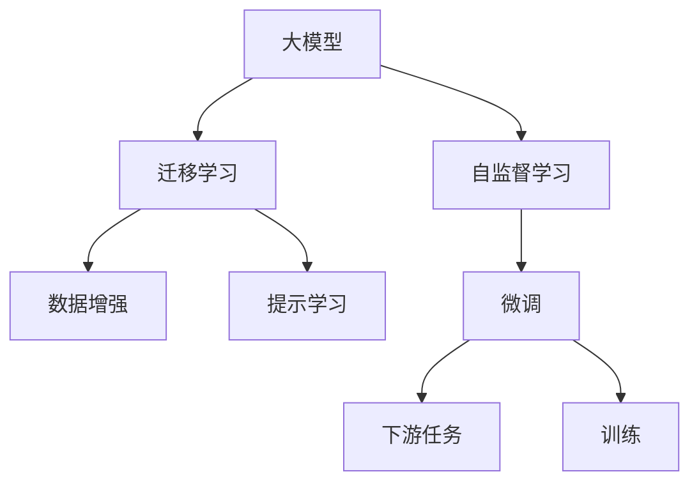

                 

# 大模型时代先锋：对话贾扬清，Lepton AI战略执行力

在人工智能大模型时代，如何在众多模型中找到最适合自己的技术路径，成为企业中决策者面临的一大难题。近日，我们特别邀请到了OpenAI首席科学家贾扬清，以深度学习AI先锋和Lepton AI战略执行力的双重身份，为读者揭示大模型时代企业AI战略制定的关键要素。本文将深入探讨贾扬清对于大模型的看法，并介绍Lepton AI战略执行力的核心方法论。

## 1. 背景介绍

### 1.1 问题由来
近年来，随着人工智能技术的发展，尤其是深度学习模型的快速迭代，企业对于大模型的应用需求日益迫切。然而，对于许多企业来说，选择何种大模型，如何构建AI战略，如何执行AI战略，仍然是一大难题。此时，来自OpenAI的首席科学家贾扬清为我们提供了一个全新的视角，让我们了解如何在大模型时代中，通过战略执行力的提升，实现企业AI的落地与应用。

### 1.2 问题核心关键点
1. **大模型的选择**：企业如何根据自身业务需求选择最适合自己的大模型，避免技术路线选择错误。
2. **AI战略制定**：企业如何制定与自身业务紧密结合的AI战略，避免战略方向不明。
3. **战略执行力**：企业如何执行AI战略，确保AI项目成功落地。

## 2. 核心概念与联系

### 2.1 核心概念概述

在本次对话中，贾扬清特别强调了以下核心概念：

- **大模型**：以Transformer为代表的自回归模型和自编码模型，通过在大规模无标签数据上进行预训练，学习通用的语言知识和常识，具备强大的语言理解和生成能力。
- **自监督学习**：在大规模无标签数据上通过自构建的任务进行训练，学习通用的语言表示。
- **迁移学习**：利用预训练模型的知识，通过少量有标签数据进行微调，使得模型能够适应特定任务。
- **数据增强**：通过数据扩充技术，如数据增强、对抗训练等，提升模型泛化能力。
- **提示学习**：通过精心设计输入模板，引导模型进行特定任务的推理和生成。

这些核心概念的组合使用，使得大模型能够在各种NLP任务上取得优异的表现，极大地推动了AI技术在各行各业的应用。

### 2.2 核心概念原理和架构的 Mermaid 流程图



这个流程图展示了从大模型预训练到下游任务微调的过程，以及各个环节的相互关系。

## 3. 核心算法原理 & 具体操作步骤

### 3.1 算法原理概述

大模型的迁移学习一般分为以下几个步骤：

1. **预训练**：在大规模无标签数据上，通过自监督学习任务训练通用语言模型。
2. **微调**：在特定任务的数据集上，通过少量有标签数据进行微调，适应下游任务的语义和逻辑。
3. **数据增强**：通过对抗样本、回译等手段扩充训练集，提升模型的泛化能力。
4. **提示学习**：通过设计输入模板，引导模型进行特定任务的推理和生成，提升模型的精度和效率。

### 3.2 算法步骤详解

以微调BERT模型为例，介绍具体的微调步骤：

1. **数据准备**：收集特定任务的标注数据，并对数据进行预处理。
2. **模型选择**：选择适合任务的BERT模型，并在训练集上进行微调。
3. **模型训练**：使用AdamW优化器，设置合适的学习率，训练模型。
4. **验证与测试**：在验证集上评估模型性能，进行超参数调优。
5. **部署与应用**：将训练好的模型部署到生产环境，并应用到实际业务中。

### 3.3 算法优缺点

**优点**：
1. **通用性强**：大模型可以通过迁移学习适应各种下游任务。
2. **泛化能力强**：通过数据增强和提示学习，模型在特定任务上能取得优异表现。
3. **应用广泛**：已广泛应用于NLP领域的各种任务，如问答、翻译、摘要等。

**缺点**：
1. **数据依赖**：微调效果很大程度上依赖于标注数据的质量和数量。
2. **资源消耗大**：大模型的参数量较大，训练和推理需要大量的计算资源。
3. **过拟合风险**：由于模型参数量大，可能存在过拟合风险。

### 3.4 算法应用领域

大模型的迁移学习技术已经广泛应用于以下几个领域：

- **自然语言处理(NLP)**：如文本分类、情感分析、机器翻译、问答系统等。
- **计算机视觉(CV)**：如图像分类、目标检测、图像生成等。
- **语音识别**：如语音转文本、语音命令识别等。
- **推荐系统**：如商品推荐、新闻推荐等。

## 4. 数学模型和公式 & 详细讲解 & 举例说明

### 4.1 数学模型构建

假设预训练的BERT模型为$M_{\theta}$，下游任务的标注数据集为$D=\{(x_i,y_i)\}_{i=1}^N$，其中$x_i$为输入，$y_i$为标签。

定义模型在输入$x$上的预测概率分布为$\hat{y}=M_{\theta}(x)$。则下游任务的损失函数为：

$$
\ell(M_{\theta}(x),y) = -\log\hat{y}(y)
$$

目标是最小化该损失函数，即：

$$
\hat{\theta} = \mathop{\arg\min}_{\theta} \frac{1}{N}\sum_{i=1}^N \ell(M_{\theta}(x_i),y_i)
$$

### 4.2 公式推导过程

以分类任务为例，假设模型在输入$x$上的输出为$\hat{y}=M_{\theta}(x) \in [0,1]$，表示样本属于正类的概率。则二分类交叉熵损失函数定义为：

$$
\ell(M_{\theta}(x),y) = -[y\log \hat{y} + (1-y)\log(1-\hat{y})]
$$

将其代入经验风险公式，得：

$$
\mathcal{L}(\theta) = -\frac{1}{N}\sum_{i=1}^N [y_i\log M_{\theta}(x_i)+(1-y_i)\log(1-M_{\theta}(x_i))]
$$

根据链式法则，损失函数对参数$\theta_k$的梯度为：

$$
\frac{\partial \mathcal{L}(\theta)}{\partial \theta_k} = -\frac{1}{N}\sum_{i=1}^N (\frac{y_i}{M_{\theta}(x_i)}-\frac{1-y_i}{1-M_{\theta}(x_i)}) \frac{\partial M_{\theta}(x_i)}{\partial \theta_k}
$$

其中$\frac{\partial M_{\theta}(x_i)}{\partial \theta_k}$可进一步递归展开，利用自动微分技术完成计算。

### 4.3 案例分析与讲解

以情感分析任务为例，介绍具体的微调过程：

1. **数据准备**：收集情感分析数据集，并将其分为训练集、验证集和测试集。
2. **模型选择**：选择BERT作为预训练模型。
3. **模型训练**：在训练集上使用AdamW优化器，设置合适的学习率，训练模型。
4. **验证与测试**：在验证集上评估模型性能，进行超参数调优。
5. **部署与应用**：将训练好的模型部署到生产环境，并应用到实际业务中。

## 5. 项目实践：代码实例和详细解释说明

### 5.1 开发环境搭建

1. **安装PyTorch和TensorFlow**：
```bash
pip install torch torchvision torchaudio
pip install tensorflow tensorflow-hub
```

2. **安装Transformers库**：
```bash
pip install transformers
```

### 5.2 源代码详细实现

```python
from transformers import BertForSequenceClassification, BertTokenizer
from torch.utils.data import DataLoader
from sklearn.metrics import classification_report

# 1. 数据准备
tokenizer = BertTokenizer.from_pretrained('bert-base-cased')
train_dataset = ...
dev_dataset = ...
test_dataset = ...

# 2. 模型选择
model = BertForSequenceClassification.from_pretrained('bert-base-cased', num_labels=2)

# 3. 模型训练
optimizer = AdamW(model.parameters(), lr=1e-5)
device = 'cuda'
model.to(device)
for epoch in range(5):
    train_loss = 0
    for batch in DataLoader(train_dataset, batch_size=16):
        inputs = tokenizer(batch['text'], return_tensors='pt').to(device)
        labels = batch['labels'].to(device)
        outputs = model(**inputs)
        loss = outputs.loss
        train_loss += loss.item()
        loss.backward()
        optimizer.step()
    print(f'Epoch {epoch+1}, train loss: {train_loss/len(train_dataset)}')

# 4. 验证与测试
dev_loss = 0
for batch in DataLoader(dev_dataset, batch_size=16):
    inputs = tokenizer(batch['text'], return_tensors='pt').to(device)
    labels = batch['labels'].to(device)
    outputs = model(**inputs)
    loss = outputs.loss
    dev_loss += loss.item()
print(f'Validation loss: {dev_loss/len(dev_dataset)}')

# 5. 部署与应用
test_loss = 0
for batch in DataLoader(test_dataset, batch_size=16):
    inputs = tokenizer(batch['text'], return_tensors='pt').to(device)
    labels = batch['labels'].to(device)
    outputs = model(**inputs)
    loss = outputs.loss
    test_loss += loss.item()
print(f'Test loss: {test_loss/len(test_dataset)}')
```

### 5.3 代码解读与分析

该代码展示了使用BERT模型进行情感分析任务的微调过程。其中，`BertTokenizer`用于分词和预处理，`BertForSequenceClassification`用于模型构建，`AdamW`用于优化器选择，`DataLoader`用于数据加载，`classification_report`用于模型评估。

## 6. 实际应用场景

### 6.1 智能客服系统

智能客服系统可以应用大模型微调技术，通过收集企业内部的客服对话记录，对预训练模型进行微调，使其能够自动理解用户意图，匹配最佳答复，大幅提升客服效率和用户体验。

### 6.2 金融舆情监测

金融舆情监测应用可通过微调大模型，实现对金融领域相关新闻、报道的情感分析，识别舆情变化趋势，帮助金融机构快速应对潜在风险。

### 6.3 个性化推荐系统

个性化推荐系统可以通过微调大模型，实现对用户兴趣的精准把握，推荐更加贴合用户需求的物品，提升推荐系统的个性化和满意度。

### 6.4 未来应用展望

未来，大模型微调技术将在更多领域得到应用，推动AI技术的普及和落地。

## 7. 工具和资源推荐

### 7.1 学习资源推荐

1. **《Transformer从原理到实践》系列博文**：介绍Transformer原理、BERT模型、微调技术等。
2. **CS224N《深度学习自然语言处理》课程**：斯坦福大学开设的NLP明星课程，有Lecture视频和配套作业。
3. **《Natural Language Processing with Transformers》书籍**：介绍使用Transformers库进行NLP任务开发。
4. **HuggingFace官方文档**：提供海量预训练模型和微调样例代码。
5. **CLUE开源项目**：中文语言理解测评基准，涵盖大量不同类型的中文NLP数据集。

### 7.2 开发工具推荐

1. **PyTorch**：深度学习框架，支持动态计算图。
2. **TensorFlow**：生产部署方便，适合大规模工程应用。
3. **Transformers库**：提供SOTA语言模型，支持微调。
4. **Weights & Biases**：模型训练实验跟踪工具。
5. **TensorBoard**：实时监测模型训练状态。
6. **Google Colab**：在线Jupyter Notebook环境。

### 7.3 相关论文推荐

1. **Attention is All You Need**：提出Transformer结构，开启预训练大模型时代。
2. **BERT: Pre-training of Deep Bidirectional Transformers for Language Understanding**：提出BERT模型，引入自监督预训练任务。
3. **Parameter-Efficient Transfer Learning for NLP**：提出Adapter等参数高效微调方法。
4. **Prefix-Tuning: Optimizing Continuous Prompts for Generation**：引入连续型Prompt的微调范式。
5. **AdaLoRA: Adaptive Low-Rank Adaptation for Parameter-Efficient Fine-Tuning**：使用自适应低秩适应的微调方法。

## 8. 总结：未来发展趋势与挑战

### 8.1 总结

本次对话深入探讨了大模型时代企业AI战略执行力的关键要素，揭示了如何在大模型时代选择最适合自己的技术路径。通过J扬清的视角，我们了解到选择大模型、制定AI战略、执行AI战略的具体步骤，并学习到如何使用大模型进行微调，实现NLP任务的落地应用。

### 8.2 未来发展趋势

未来，大模型时代将继续推动AI技术的发展和应用，企业需要积极拥抱大模型，通过战略执行力的提升，实现AI技术的落地与迭代。

1. **模型规模持续增大**：超大规模语言模型蕴含的丰富语言知识，将支撑更加复杂多变的下游任务。
2. **微调方法日趋多样**：开发更加参数高效和计算高效的微调方法。
3. **持续学习成为常态**：模型需要持续学习新知识以保持性能。
4. **数据依赖降低**：利用自监督和半监督学习，减少对标注样本的依赖。
5. **多模态微调崛起**：融合视觉、语音等多模态数据进行微调。
6. **模型通用性增强**：大模型将具备更强的常识推理和跨领域迁移能力。

### 8.3 面临的挑战

1. **标注成本瓶颈**：小样本场景下，大模型难以发挥优势。
2. **模型鲁棒性不足**：面对域外数据时，泛化性能有限。
3. **推理效率问题**：超大模型推理速度慢、内存占用大。
4. **可解释性不足**：大模型通常缺乏可解释性。
5. **安全性问题**：预训练模型可能学习到有害信息。
6. **知识整合能力不足**：模型难以灵活吸收外部知识。

### 8.4 研究展望

未来需要在以下几个方面进行深入研究：

1. **无监督和半监督微调方法**：利用自监督和主动学习，减少对标注样本的依赖。
2. **参数高效和计算高效的微调方法**：只调整少量参数，减小过拟合风险。
3. **融合因果和对比学习**：增强模型的泛化能力和鲁棒性。
4. **引入更多先验知识**：将符号化的先验知识与神经网络模型结合。
5. **结合因果分析和博弈论工具**：增强模型的决策逻辑和稳定性和鲁棒性。
6. **纳入伦理道德约束**：避免模型偏见和有害输出。

这些研究方向的探索，将引领大模型微调技术迈向更高的台阶，为构建安全、可靠、可解释、可控的智能系统铺平道路。

## 9. 附录：常见问题与解答

**Q1: 大模型选择有哪些建议？**

A: 根据业务需求选择最适合自己的大模型，避免技术路线选择错误。可以参考行业标杆，选择经过验证的模型。

**Q2: 如何选择微调超参数？**

A: 微调超参数选择需要结合任务和数据特点。通常采用网格搜索或随机搜索方法，进行超参数调优。

**Q3: 微调过程中如何避免过拟合？**

A: 数据增强、正则化、对抗训练、参数高效微调等方法可以有效避免过拟合。

**Q4: 微调模型在部署时需要注意哪些问题？**

A: 模型裁剪、量化加速、服务化封装、弹性伸缩、监控告警、安全防护等都是需要注意的问题。

**Q5: 如何在多个模型中做出选择？**

A: 通过对比模型在多个任务上的性能，选择最符合业务需求的模型。

---

作者：禅与计算机程序设计艺术 / Zen and the Art of Computer Programming

