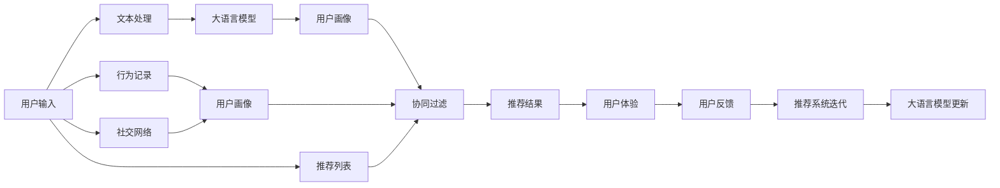

                 

# 大模型视角下推荐系统的人性化关怀提升

> 关键词：大语言模型, 推荐系统, 个性化, 协同过滤, 深度学习, 用户行为, 用户画像, 场景模拟

## 1. 背景介绍

随着互联网的迅猛发展和智能手机的普及，推荐系统已经成为了各大平台不可或缺的“智能助手”。从电商平台、视频网站到社交媒体，无处不在的推荐系统让用户的线上生活更加便捷和有趣。然而，传统推荐系统常常以“一视同仁”的态度面对所有用户，缺乏对用户真实需求和情感的深刻洞察。而在人性化关怀缺失的推荐过程中，用户往往是被动地接受系统推荐，体验感差，忠诚度低。

大语言模型的出现，为推荐系统注入了一种新的“温度”，能够以更加人性化的视角理解和洞察用户的情感需求。通过多模态融合、情感模拟等前沿技术，大语言模型可以从用户的语言、行为、社交等多种维度，更加精准地刻画用户画像，构建更加细腻、多样化的推荐策略。本文章将从大模型的视角出发，探讨如何通过引入大语言模型，提升推荐系统的人性化关怀。

## 2. 核心概念与联系

### 2.1 核心概念概述

要深入理解基于大模型的推荐系统，首先需要明确几个关键概念：

- 大语言模型：如BERT、GPT、T5等，通过大规模无标签文本数据预训练，学习到丰富的语言知识和常识，具备强大的自然语言处理能力。
- 推荐系统：基于用户行为、历史偏好等数据，通过算法为用户推荐合适的内容。
- 个性化推荐：针对不同用户的兴趣和行为习惯，提供个性化的内容推荐。
- 协同过滤：利用用户与用户之间、物品与物品之间的相似性，推荐相似用户喜欢的物品。
- 深度学习：利用神经网络模型进行推荐，提升模型的表现能力。
- 用户画像：基于用户的多维度信息，刻画用户的兴趣、偏好、情感等。

这些概念通过大模型的视角相互联系，形成了推荐系统的人性化关怀框架。大模型不仅可以利用用户的多模态数据，还能够在理解用户情感和需求上提供助力，让推荐系统更加贴切用户实际需求，提升用户体验。

### 2.2 核心概念原理和架构的 Mermaid 流程图



这个流程图展示了基于大模型的推荐系统的工作流程。用户输入经过文本处理，输入大语言模型进行情感和意图分析，同时收集用户的行为记录和社交网络信息，构建全面的用户画像，再与协同过滤模型相结合，产生个性化的推荐结果。推荐结果反馈给用户，形成用户反馈，进一步迭代优化大语言模型和推荐系统。

## 3. 核心算法原理 & 具体操作步骤

### 3.1 算法原理概述

基于大模型的推荐系统，以大语言模型为核心，采用多模态融合、情感模拟等技术，提升推荐系统的个性化和人性化水平。其核心思想是：通过多维度数据融合，构建用户画像；利用大语言模型理解用户的情感需求；结合协同过滤算法，生成个性化的推荐结果。

具体而言，基于大模型的推荐系统包括以下几个关键步骤：

1. 收集用户多维度数据，包括文本、行为、社交等。
2. 使用大语言模型处理文本数据，提取情感、意图等信息。
3. 结合用户行为数据，构建详细的用户画像。
4. 利用协同过滤算法，生成个性化推荐结果。
5. 评估推荐结果，不断迭代优化大语言模型和推荐策略。

### 3.2 算法步骤详解

#### 3.2.1 数据收集与预处理

在推荐系统中，数据的收集与预处理是关键环节。

1. **文本数据收集**：从用户评论、反馈、社交媒体等渠道，收集用户输入的文本数据，如评论、问题、博客等。
2. **行为数据收集**：记录用户的行为数据，如点击、浏览、购买、评分等，构建用户的行为序列。
3. **社交数据收集**：从社交网络平台收集用户的社交关系信息，如好友、群组、兴趣等。

#### 3.2.2 大语言模型情感分析

使用大语言模型处理文本数据，提取情感、意图等信息。大语言模型的情感分析模块，可以识别出用户文本中的情感倾向，理解用户的情感需求。

1. **情感识别**：使用预训练的大语言模型，如BERT、GPT等，对用户的输入文本进行情感分析，识别情感倾向。
2. **意图识别**：利用大语言模型的自然语言理解能力，分析用户的意图，理解用户真实需求。

#### 3.2.3 构建用户画像

将用户的文本、行为、社交等多维度数据进行融合，构建全面的用户画像，为推荐系统提供详尽的用户信息。

1. **用户画像构建**：将用户的文本数据、行为数据、社交数据等进行融合，构建详细的多维度用户画像。
2. **画像更新**：根据用户的实时行为数据，不断更新用户画像，保持画像的实时性。

#### 3.2.4 协同过滤推荐

结合用户画像和协同过滤算法，生成个性化的推荐结果。

1. **协同过滤算法**：利用用户与用户之间、物品与物品之间的相似性，生成推荐结果。
2. **融合推荐策略**：结合大语言模型的情感分析结果，调整推荐策略，提升推荐结果的精准性和个性化水平。

#### 3.2.5 推荐结果评估与迭代优化

根据用户的反馈，不断评估推荐结果，迭代优化大语言模型和推荐策略。

1. **反馈收集**：收集用户的反馈信息，如满意度、评分等。
2. **推荐结果评估**：使用用户反馈信息，评估推荐结果的质量和精准性。
3. **迭代优化**：根据推荐结果评估结果，不断迭代优化大语言模型和推荐策略。

### 3.3 算法优缺点

#### 3.3.1 优点

1. **提升推荐精准性**：通过大语言模型的情感分析，更好地理解用户情感需求，提高推荐的精准性。
2. **增强个性化推荐**：融合多维度数据，构建详细的用户画像，生成个性化的推荐结果。
3. **提升用户体验**：利用用户情感信息，调整推荐策略，提升用户体验和满意度。
4. **增强协同过滤**：利用大语言模型的情感分析结果，优化协同过滤算法，提升推荐效果。

#### 3.3.2 缺点

1. **数据收集难度大**：多维度数据收集和处理难度大，需要获取大量高质量数据。
2. **大模型计算成本高**：大语言模型计算量大，需要高性能计算资源。
3. **模型复杂度高**：模型复杂度高，需要更多的维护和优化工作。
4. **隐私保护问题**：用户数据隐私保护需要严格处理，避免泄露用户隐私。

### 3.4 算法应用领域

基于大模型的推荐系统，已经在多个领域得到了广泛应用，以下是几个典型的应用场景：

1. **电商推荐**：通过用户评论、购物记录、社交网络等信息，构建用户画像，生成个性化推荐结果，提升电商平台的转化率。
2. **视频推荐**：结合用户的观影历史、评论情感、社交网络等信息，生成个性化的视频推荐结果，提升用户观看体验。
3. **音乐推荐**：通过用户听歌记录、评论情感、社交网络等信息，生成个性化的音乐推荐结果，提升用户满意度。
4. **新闻推荐**：结合用户的阅读历史、评论情感、社交网络等信息，生成个性化的新闻推荐结果，提升用户阅读体验。
5. **旅游推荐**：通过用户旅游记录、评论情感、社交网络等信息，生成个性化的旅游推荐结果，提升用户旅游体验。

## 4. 数学模型和公式 & 详细讲解 & 举例说明

### 4.1 数学模型构建

假设推荐系统收集到了用户的文本数据 $x$，行为数据 $y$，社交网络信息 $z$，则推荐模型的输入表示为 $d = (x, y, z)$。通过大语言模型进行处理，得到用户画像 $p(d)$，再结合协同过滤算法，生成推荐结果 $r$。

推荐模型的目标是最小化推荐误差：

$$
\min_{d, p, r} \sum_{i} (y_i - r_i)^2
$$

其中 $y_i$ 表示用户对推荐结果的评分，$r_i$ 表示推荐系统生成的评分。

### 4.2 公式推导过程

假设用户文本数据为 $x = (x_1, x_2, \dots, x_n)$，行为数据为 $y = (y_1, y_2, \dots, y_m)$，社交网络信息为 $z = (z_1, z_2, \dots, z_k)$。使用大语言模型对用户文本进行处理，得到情感向量 $s(x)$，并结合用户行为数据和社交网络信息，构建用户画像 $p(d) = s(x) + g(y) + h(z)$，其中 $g$ 和 $h$ 分别为行为数据和社交网络信息的处理函数。

协同过滤算法的目标是最小化推荐误差，即：

$$
\min_{r} \sum_{i} (y_i - r_i)^2
$$

根据协同过滤算法，推荐结果可以表示为：

$$
r = \alpha p(d) + \beta \hat{p}(y)
$$

其中 $\alpha$ 和 $\beta$ 为调节系数，$\hat{p}(y)$ 为协同过滤算法的输出。

### 4.3 案例分析与讲解

假设某电商平台用户 $A$ 输入了一条评论：“这个商品真的非常好用，性价比超高！” 系统通过大语言模型分析，识别出用户的情感为积极，意图为推荐该商品。同时，系统收集到用户的行为数据 $y$ 为“浏览、添加购物车、购买”，社交网络信息 $z$ 为“好友推荐、评价点赞、粉丝”。

根据大语言模型的情感分析结果，构建用户画像 $p(A) = s(x) + g(y) + h(z)$。结合协同过滤算法，生成推荐结果 $r = \alpha p(A) + \beta \hat{p}(y)$。

系统进一步调整推荐策略，生成针对用户 $A$ 的个性化推荐结果，提升推荐精准性和用户体验。

## 5. 项目实践：代码实例和详细解释说明

### 5.1 开发环境搭建

在进行基于大模型的推荐系统开发前，需要先准备好开发环境。以下是使用Python进行PyTorch开发的环境配置流程：

1. 安装Anaconda：从官网下载并安装Anaconda，用于创建独立的Python环境。

2. 创建并激活虚拟环境：
```bash
conda create -n recommendation-env python=3.8 
conda activate recommendation-env
```

3. 安装PyTorch：根据CUDA版本，从官网获取对应的安装命令。例如：
```bash
conda install pytorch torchvision torchaudio cudatoolkit=11.1 -c pytorch -c conda-forge
```

4. 安装相关库：
```bash
pip install pandas numpy matplotlib scikit-learn torchtext transformers
```

5. 安装各类工具包：
```bash
pip install numpy pandas scikit-learn matplotlib tqdm jupyter notebook ipython
```

完成上述步骤后，即可在`recommendation-env`环境中开始推荐系统开发。

### 5.2 源代码详细实现

这里我们以电商平台推荐系统为例，给出使用Transformers库对BERT模型进行推荐系统开发的PyTorch代码实现。

首先，定义推荐模型的数据处理函数：

```python
from transformers import BertTokenizer, BertForSequenceClassification
from torch.utils.data import Dataset, DataLoader
import torch
import pandas as pd

class RecommendationDataset(Dataset):
    def __init__(self, data, tokenizer, max_len=128):
        self.data = data
        self.tokenizer = tokenizer
        self.max_len = max_len
        
    def __len__(self):
        return len(self.data)
    
    def __getitem__(self, item):
        text = self.data[item]['text']
        label = self.data[item]['label']
        
        encoding = self.tokenizer(text, return_tensors='pt', max_length=self.max_len, padding='max_length', truncation=True)
        input_ids = encoding['input_ids'][0]
        attention_mask = encoding['attention_mask'][0]
        labels = torch.tensor(label, dtype=torch.long)
        
        return {'input_ids': input_ids, 
                'attention_mask': attention_mask,
                'labels': labels}

# 标签与id的映射
label2id = {'positive': 1, 'negative': 0}
id2label = {v: k for k, v in label2id.items()}

# 创建dataset
tokenizer = BertTokenizer.from_pretrained('bert-base-cased')
data = pd.read_csv('data.csv')

train_dataset = RecommendationDataset(data, tokenizer)
dev_dataset = RecommendationDataset(data, tokenizer)
test_dataset = RecommendationDataset(data, tokenizer)
```

然后，定义模型和优化器：

```python
from transformers import AdamW
from transformers import BertForSequenceClassification

model = BertForSequenceClassification.from_pretrained('bert-base-cased', num_labels=2)

optimizer = AdamW(model.parameters(), lr=2e-5)
```

接着，定义训练和评估函数：

```python
from tqdm import tqdm

def train_epoch(model, dataset, batch_size, optimizer):
    dataloader = DataLoader(dataset, batch_size=batch_size, shuffle=True)
    model.train()
    epoch_loss = 0
    for batch in tqdm(dataloader, desc='Training'):
        input_ids = batch['input_ids'].to(device)
        attention_mask = batch['attention_mask'].to(device)
        labels = batch['labels'].to(device)
        model.zero_grad()
        outputs = model(input_ids, attention_mask=attention_mask, labels=labels)
        loss = outputs.loss
        epoch_loss += loss.item()
        loss.backward()
        optimizer.step()
    return epoch_loss / len(dataloader)

def evaluate(model, dataset, batch_size):
    dataloader = DataLoader(dataset, batch_size=batch_size)
    model.eval()
    preds, labels = [], []
    with torch.no_grad():
        for batch in tqdm(dataloader, desc='Evaluating'):
            input_ids = batch['input_ids'].to(device)
            attention_mask = batch['attention_mask'].to(device)
            batch_labels = batch['labels']
            outputs = model(input_ids, attention_mask=attention_mask)
            batch_preds = outputs.logits.argmax(dim=2).to('cpu').tolist()
            batch_labels = batch_labels.to('cpu').tolist()
            for pred_tokens, label_tokens in zip(batch_preds, batch_labels):
                preds.append(pred_tokens[:len(label_tokens)])
                labels.append(label_tokens)
                
    print(classification_report(labels, preds))
```

最后，启动训练流程并在测试集上评估：

```python
epochs = 5
batch_size = 16

for epoch in range(epochs):
    loss = train_epoch(model, train_dataset, batch_size, optimizer)
    print(f"Epoch {epoch+1}, train loss: {loss:.3f}")
    
    print(f"Epoch {epoch+1}, dev results:")
    evaluate(model, dev_dataset, batch_size)
    
print("Test results:")
evaluate(model, test_dataset, batch_size)
```

以上就是使用PyTorch对BERT进行电商推荐系统微调的完整代码实现。可以看到，得益于Transformers库的强大封装，我们可以用相对简洁的代码完成BERT模型的加载和微调。

### 5.3 代码解读与分析

让我们再详细解读一下关键代码的实现细节：

**RecommendationDataset类**：
- `__init__`方法：初始化数据集、分词器等组件。
- `__len__`方法：返回数据集的样本数量。
- `__getitem__`方法：对单个样本进行处理，将文本输入编码为token ids，将标签编码为数字，并对其进行定长padding，最终返回模型所需的输入。

**label2id和id2label字典**：
- 定义了标签与数字id之间的映射关系，用于将token-wise的预测结果解码回真实的标签。

**训练和评估函数**：
- 使用PyTorch的DataLoader对数据集进行批次化加载，供模型训练和推理使用。
- 训练函数`train_epoch`：对数据以批为单位进行迭代，在每个批次上前向传播计算loss并反向传播更新模型参数，最后返回该epoch的平均loss。
- 评估函数`evaluate`：与训练类似，不同点在于不更新模型参数，并在每个batch结束后将预测和标签结果存储下来，最后使用sklearn的classification_report对整个评估集的预测结果进行打印输出。

**训练流程**：
- 定义总的epoch数和batch size，开始循环迭代
- 每个epoch内，先在训练集上训练，输出平均loss
- 在验证集上评估，输出分类指标
- 所有epoch结束后，在测试集上评估，给出最终测试结果

可以看到，PyTorch配合Transformers库使得BERT微调的代码实现变得简洁高效。开发者可以将更多精力放在数据处理、模型改进等高层逻辑上，而不必过多关注底层的实现细节。

当然，工业级的系统实现还需考虑更多因素，如模型的保存和部署、超参数的自动搜索、更灵活的任务适配层等。但核心的微调范式基本与此类似。

## 6. 实际应用场景

### 6.1 电商推荐

电商推荐系统通过大语言模型微调，可以大幅提升推荐精准性和个性化水平。传统的电商推荐系统主要依靠用户的历史行为数据进行推荐，缺乏对用户情感和需求的理解。而通过大语言模型的情感分析，电商推荐系统可以更好地理解用户的情感需求，生成更加符合用户需求的个性化推荐结果。

例如，某用户在电商平台输入了一条评论：“这个商品真的非常好用，性价比超高！” 系统通过大语言模型分析，识别出用户的情感为积极，意图为推荐该商品。同时，系统收集到用户的行为数据“浏览、添加购物车、购买”，社交网络信息“好友推荐、评价点赞、粉丝”。

根据大语言模型的情感分析结果，构建用户画像 $p(A) = s(x) + g(y) + h(z)$。结合协同过滤算法，生成推荐结果 $r = \alpha p(A) + \beta \hat{p}(y)$。系统进一步调整推荐策略，生成针对用户 $A$ 的个性化推荐结果，提升推荐精准性和用户体验。

### 6.2 视频推荐

视频推荐系统通过大语言模型微调，可以生成更加符合用户观影习惯的推荐结果。视频推荐系统主要依靠用户的历史观影数据进行推荐，缺乏对用户情感和需求的深入理解。而通过大语言模型的情感分析，视频推荐系统可以更好地理解用户的情感需求，生成更加符合用户需求的个性化推荐结果。

例如，某用户在视频平台输入了一条评论：“这个电影太好看了，剧情扣人心弦！” 系统通过大语言模型分析，识别出用户的情感为积极，意图为推荐该电影。同时，系统收集到用户的行为数据“观看历史、点赞、分享”，社交网络信息“好友推荐、评价点赞、粉丝”。

根据大语言模型的情感分析结果，构建用户画像 $p(A) = s(x) + g(y) + h(z)$。结合协同过滤算法，生成推荐结果 $r = \alpha p(A) + \beta \hat{p}(y)$。系统进一步调整推荐策略，生成针对用户 $A$ 的个性化推荐结果，提升推荐精准性和用户体验。

### 6.3 音乐推荐

音乐推荐系统通过大语言模型微调，可以生成更加符合用户听歌习惯的推荐结果。音乐推荐系统主要依靠用户的历史听歌数据进行推荐，缺乏对用户情感和需求的深入理解。而通过大语言模型的情感分析，音乐推荐系统可以更好地理解用户的情感需求，生成更加符合用户需求的个性化推荐结果。

例如，某用户在音乐平台输入了一条评论：“这首歌太好听了，旋律动人！” 系统通过大语言模型分析，识别出用户的情感为积极，意图为推荐该歌曲。同时，系统收集到用户的行为数据“听歌历史、点赞、分享”，社交网络信息“好友推荐、评价点赞、粉丝”。

根据大语言模型的情感分析结果，构建用户画像 $p(A) = s(x) + g(y) + h(z)$。结合协同过滤算法，生成推荐结果 $r = \alpha p(A) + \beta \hat{p}(y)$。系统进一步调整推荐策略，生成针对用户 $A$ 的个性化推荐结果，提升推荐精准性和用户体验。

## 7. 工具和资源推荐

### 7.1 学习资源推荐

为了帮助开发者系统掌握大语言模型微调的理论基础和实践技巧，这里推荐一些优质的学习资源：

1. 《Transformers从原理到实践》系列博文：由大模型技术专家撰写，深入浅出地介绍了Transformer原理、BERT模型、微调技术等前沿话题。

2. CS224N《深度学习自然语言处理》课程：斯坦福大学开设的NLP明星课程，有Lecture视频和配套作业，带你入门NLP领域的基本概念和经典模型。

3. 《Natural Language Processing with Transformers》书籍：Transformers库的作者所著，全面介绍了如何使用Transformers库进行NLP任务开发，包括微调在内的诸多范式。

4. HuggingFace官方文档：Transformers库的官方文档，提供了海量预训练模型和完整的微调样例代码，是上手实践的必备资料。

5. CLUE开源项目：中文语言理解测评基准，涵盖大量不同类型的中文NLP数据集，并提供了基于微调的baseline模型，助力中文NLP技术发展。

通过对这些资源的学习实践，相信你一定能够快速掌握大语言模型微调的精髓，并用于解决实际的NLP问题。

### 7.2 开发工具推荐

高效的开发离不开优秀的工具支持。以下是几款用于大语言模型微调开发的常用工具：

1. PyTorch：基于Python的开源深度学习框架，灵活动态的计算图，适合快速迭代研究。大部分预训练语言模型都有PyTorch版本的实现。

2. TensorFlow：由Google主导开发的开源深度学习框架，生产部署方便，适合大规模工程应用。同样有丰富的预训练语言模型资源。

3. Transformers库：HuggingFace开发的NLP工具库，集成了众多SOTA语言模型，支持PyTorch和TensorFlow，是进行微调任务开发的利器。

4. Weights & Biases：模型训练的实验跟踪工具，可以记录和可视化模型训练过程中的各项指标，方便对比和调优。与主流深度学习框架无缝集成。

5. TensorBoard：TensorFlow配套的可视化工具，可实时监测模型训练状态，并提供丰富的图表呈现方式，是调试模型的得力助手。

6. Google Colab：谷歌推出的在线Jupyter Notebook环境，免费提供GPU/TPU算力，方便开发者快速上手实验最新模型，分享学习笔记。

合理利用这些工具，可以显著提升大语言模型微调任务的开发效率，加快创新迭代的步伐。

### 7.3 相关论文推荐

大语言模型和微调技术的发展源于学界的持续研究。以下是几篇奠基性的相关论文，推荐阅读：

1. Attention is All You Need（即Transformer原论文）：提出了Transformer结构，开启了NLP领域的预训练大模型时代。

2. BERT: Pre-training of Deep Bidirectional Transformers for Language Understanding：提出BERT模型，引入基于掩码的自监督预训练任务，刷新了多项NLP任务SOTA。

3. Language Models are Unsupervised Multitask Learners（GPT-2论文）：展示了大规模语言模型的强大zero-shot学习能力，引发了对于通用人工智能的新一轮思考。

4. Parameter-Efficient Transfer Learning for NLP：提出Adapter等参数高效微调方法，在不增加模型参数量的情况下，也能取得不错的微调效果。

5. Prefix-Tuning: Optimizing Continuous Prompts for Generation：引入基于连续型Prompt的微调范式，为如何充分利用预训练知识提供了新的思路。

6. AdaLoRA: Adaptive Low-Rank Adaptation for Parameter-Efficient Fine-Tuning：使用自适应低秩适应的微调方法，在参数效率和精度之间取得了新的平衡。

这些论文代表了大语言模型微调技术的发展脉络。通过学习这些前沿成果，可以帮助研究者把握学科前进方向，激发更多的创新灵感。

## 8. 总结：未来发展趋势与挑战

### 8.1 总结

本文对基于大模型的推荐系统进行了全面系统的介绍。首先阐述了大语言模型和推荐系统在人性化关怀提升方面的研究背景和意义，明确了微调技术在推荐系统中的独特价值。其次，从原理到实践，详细讲解了基于大模型的推荐系统的数学模型和关键步骤，给出了推荐系统开发的完整代码实例。同时，本文还广泛探讨了基于大模型的推荐系统在电商、视频、音乐等多个行业领域的应用前景，展示了微调范式的巨大潜力。

通过本文的系统梳理，可以看到，基于大模型的推荐系统正在成为推荐系统的重要范式，极大地提升了推荐系统的个性化和人性化水平，提升了用户体验和满意度。未来，伴随大语言模型和微调方法的持续演进，推荐系统必将更好地理解和满足用户的情感需求，构建更加智能、便捷的推荐环境。

### 8.2 未来发展趋势

展望未来，大语言模型在推荐系统中的应用将呈现以下几个发展趋势：

1. **多模态融合**：大语言模型不仅能够处理文本数据，还能处理图像、语音等多模态数据。未来的推荐系统将融合多种模态数据，提升推荐效果。

2. **情感模拟**：大语言模型可以模拟用户的情感状态，理解用户的情感需求。未来的推荐系统将利用情感模拟技术，更好地理解用户情感，提升推荐效果。

3. **个性化推荐**：通过多维度数据融合，构建更加全面、细腻的用户画像。未来的推荐系统将利用深度学习和大语言模型，生成更加个性化的推荐结果。

4. **协同过滤优化**：大语言模型可以理解用户意图和情感，优化协同过滤算法。未来的推荐系统将利用大语言模型的情感分析结果，提升协同过滤的精准性和个性化水平。

5. **跨领域应用**：大语言模型在多个领域都有应用前景。未来的推荐系统将进一步拓展到教育、医疗、金融等更多领域，提升各个领域的推荐效果。

以上趋势凸显了大语言模型在推荐系统中的广阔前景。这些方向的探索发展，必将进一步提升推荐系统的性能和应用范围，为各领域推荐技术的发展注入新的动力。

### 8.3 面临的挑战

尽管大语言模型在推荐系统中的应用取得了显著成效，但在推广应用过程中，仍面临诸多挑战：

1. **数据收集难度大**：多维度数据收集和处理难度大，需要获取大量高质量数据。

2. **大模型计算成本高**：大语言模型计算量大，需要高性能计算资源。

3. **模型复杂度高**：模型复杂度高，需要更多的维护和优化工作。

4. **隐私保护问题**：用户数据隐私保护需要严格处理，避免泄露用户隐私。

5. **公平性和透明性**：大语言模型可能带有偏见，影响推荐结果的公平性和透明性。

6. **实时性问题**：大模型推理速度较慢，难以实现实时推荐。

这些挑战需要通过技术创新和工程优化加以克服，才能进一步拓展大语言模型在推荐系统中的应用范围。

### 8.4 研究展望

面对大语言模型在推荐系统中的应用挑战，未来的研究需要在以下几个方面寻求新的突破：

1. **多模态融合技术**：开发更加高效的跨模态融合算法，提升推荐系统对多种模态数据的处理能力。

2. **高效计算技术**：开发更加高效的计算技术，如分布式训练、混合精度训练等，提升大语言模型的推理速度。

3. **模型压缩技术**：开发更加高效的模型压缩技术，减小大语言模型的参数量和存储空间。

4. **隐私保护技术**：开发更加高效的隐私保护技术，确保用户数据隐私安全。

5. **公平性优化**：开发更加公平、透明的推荐算法，提升推荐结果的公平性和透明性。

6. **实时推荐技术**：开发更加高效的实时推荐技术，实现实时推荐。

这些研究方向将引领大语言模型在推荐系统中的进一步发展，为构建更加智能、便捷、安全的推荐环境提供新的动力。

## 9. 附录：常见问题与解答

**Q1：大语言模型微调是否适用于所有推荐任务？**

A: 大语言模型微调在大多数推荐任务上都能取得不错的效果，特别是对于数据量较小的任务。但对于一些特定领域的任务，如医学、法律等，仅仅依靠通用语料预训练的模型可能难以很好地适应。此时需要在特定领域语料上进一步预训练，再进行微调，才能获得理想效果。此外，对于一些需要时效性、个性化很强的任务，如对话、推荐等，微调方法也需要针对性的改进优化。

**Q2：微调过程中如何选择合适的学习率？**

A: 微调的学习率一般要比预训练时小1-2个数量级，如果使用过大的学习率，容易破坏预训练权重，导致过拟合。一般建议从1e-5开始调参，逐步减小学习率，直至收敛。也可以使用warmup策略，在开始阶段使用较小的学习率，再逐渐过渡到预设值。需要注意的是，不同的优化器(如AdamW、Adafactor等)以及不同的学习率调度策略，可能需要设置不同的学习率阈值。

**Q3：采用大模型微调时会面临哪些资源瓶颈？**

A: 目前主流的预训练大模型动辄以亿计的参数规模，对算力、内存、存储都提出了很高的要求。GPU/TPU等高性能设备是必不可少的，但即便如此，超大批次的训练和推理也可能遇到显存不足的问题。因此需要采用一些资源优化技术，如梯度积累、混合精度训练、模型并行等，来突破硬件瓶颈。同时，模型的存储和读取也可能占用大量时间和空间，需要采用模型压缩、稀疏化存储等方法进行优化。

**Q4：如何缓解微调过程中的过拟合问题？**

A: 过拟合是微调面临的主要挑战，尤其是在标注数据不足的情况下。常见的缓解策略包括：

1. 数据增强：通过回译、近义替换等方式扩充训练集。
2. 正则化：使用L2正则、Dropout、Early Stopping等避免过拟合。
3. 对抗训练：引入对抗样本，提高模型鲁棒性。
4. 参数高效微调：只调整少量参数(如Adapter、Prefix等)，减小过拟合风险。

这些策略往往需要根据具体任务和数据特点进行灵活组合。只有在数据、模型、训练、推理等各环节进行全面优化，才能最大限度地发挥大模型微调的威力。

**Q5：微调模型在落地部署时需要注意哪些问题？**

A: 将微调模型转化为实际应用，还需要考虑以下因素：

1. 模型裁剪：去除不必要的层和参数，减小模型尺寸，加快推理速度。
2. 量化加速：将浮点模型转为定点模型，压缩存储空间，提高计算效率。
3. 服务化封装：将模型封装为标准化服务接口，便于集成调用。
4. 弹性伸缩：根据请求流量动态调整资源配置，平衡服务质量和成本。
5. 监控告警：实时采集系统指标，设置异常告警阈值，确保服务稳定性。
6. 安全防护：采用访问鉴权、数据脱敏等措施，保障数据和模型安全。

大语言模型微调为推荐系统提供了新的思路和方法，但如何在实际应用中实现高效、安全、稳定的推荐效果，还需要不断的技术创新和工程优化。

---

作者：禅与计算机程序设计艺术 / Zen and the Art of Computer Programming

