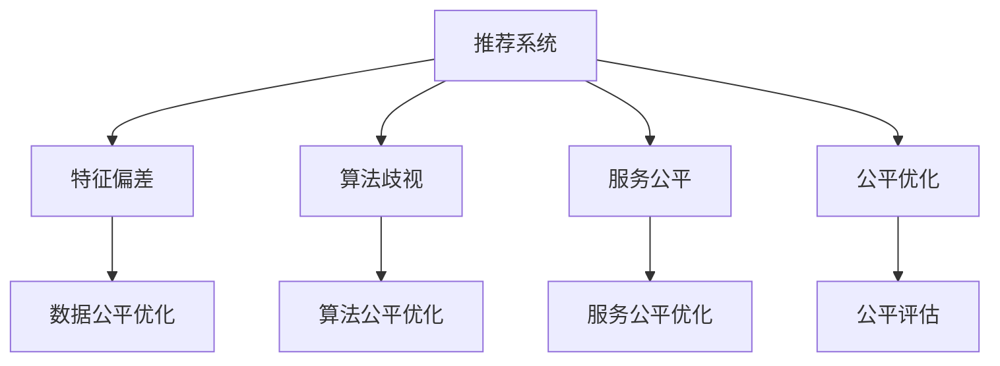

                 

# 大模型视角下推荐系统的公平性问题再思考与改进

> 关键词：推荐系统,公平性,大模型,特征偏差,算法歧视,反事实推理,公平优化,公平评估

## 1. 背景介绍

### 1.1 问题由来
随着数字技术的发展，推荐系统已经成为商业、社交网络、信息获取等领域广泛应用的引擎。然而，推荐系统在给用户带来个性化推荐的同时，也存在一系列的问题，特别是公平性问题，引起了学界和工业界的高度关注。

推荐系统公平性问题主要体现在以下几个方面：

- **特征偏差**：在训练数据和模型特征中，存在某些特定群体（如年龄、性别、地域等）的代表性不足，导致模型对某些群体推荐不公。

- **算法歧视**：由于训练数据和模型设计中的不公平因素，推荐算法可能会对某些群体产生偏见，如对某一特定群体推荐更多负面内容。

- **服务不平等**：不同用户或群体可能由于各种原因（如历史行为、隐私限制等）在推荐系统中获得的服务不平等，影响用户体验。

这些问题不仅损害用户信任，还可能引发道德和法律问题。因此，如何在推荐系统中实现公平性，成为学术界和工业界迫切需要解决的问题。

### 1.2 问题核心关键点
推荐系统公平性的研究关注如何消除推荐系统中的不公平现象，使不同群体均等受益。

主要研究方法包括：

- **数据公平优化**：在数据收集和预处理阶段，确保训练数据的多样性和代表性，减少特征偏差。
- **算法公平优化**：在模型训练和部署阶段，通过公平算法设计，避免算法歧视，提升推荐公平性。
- **服务公平优化**：在用户交互和反馈阶段，通过用户反馈机制，动态调整模型参数，实现服务公平。
- **公平评估方法**：设计科学有效的评估方法，量化推荐系统的公平性，及时发现和纠正问题。

## 2. 核心概念与联系

### 2.1 核心概念概述

为更好地理解推荐系统的公平性问题，本节将介绍几个核心概念及其相互联系：

- **推荐系统(Recommender System)**：通过分析用户的历史行为、偏好等信息，为用户推荐感兴趣的物品的系统。

- **公平性(Fairness)**：指在不同群体间，推荐系统应提供无差别、无偏见的推荐服务。

- **特征偏差(Feature Bias)**：指在数据特征选择和处理中，某些特征被过度使用或未被充分利用，导致模型对某些群体产生偏见。

- **算法歧视(Algorithmic Bias)**：指在模型训练和部署中，由于算法设计问题，导致模型输出对某些群体产生偏见。

- **服务公平(Service Fairness)**：指在推荐系统运行中，不同用户或群体获得的服务质量应保持一致，避免因各种原因导致的服务不平等。

- **公平优化(Optimization for Fairness)**：指通过数据、算法和服务改进，提升推荐系统的公平性。

- **公平评估(Evaluation for Fairness)**：指通过量化和度量公平性指标，评估推荐系统的公平性水平。

这些核心概念之间的逻辑关系可以通过以下Mermaid流程图来展示：



这个流程图展示了推荐系统的公平性问题及其主要研究方向：

1. 推荐系统存在特征偏差和算法歧视问题。
2. 为了消除这些问题，可以进行数据公平优化、算法公平优化和服务公平优化。
3. 最终通过公平评估，量化推荐系统的公平性，指导进一步优化。

## 3. 核心算法原理 & 具体操作步骤
### 3.1 算法原理概述

推荐系统的公平性问题可以通过多种算法进行解决。这些算法主要基于以下几个核心原理：

- **特征均衡处理**：通过均衡不同特征在数据中的权重，减少特征偏差。
- **公平损失函数设计**：引入公平损失函数，惩罚模型对某些群体的歧视性。
- **反事实推理**：通过反事实推理，预测模型在不同公平约束下的推荐结果，确保公平性。
- **公平优化算法**：采用公平优化算法，调整模型参数，提升推荐公平性。
- **公平评估指标**：设计公平评估指标，量化推荐系统的公平性，如 disparity metric、group fairness metric等。

### 3.2 算法步骤详解

基于公平性原理的推荐系统开发一般包括以下几个关键步骤：

**Step 1: 数据收集与预处理**
- 收集包含用户行为、物品属性、用户特征等数据的推荐系统数据集。
- 清洗和预处理数据，确保数据质量和多样性。

**Step 2: 特征均衡处理**
- 统计各特征在数据中的出现频率，进行特征选择和处理。
- 对某些代表性不足的特征进行补充，确保特征均衡。

**Step 3: 模型选择与训练**
- 选择合适的推荐算法（如协同过滤、基于内容的推荐、深度学习等）。
- 在训练数据上，采用公平损失函数（如De-biasing Loss、Equitable Loss等）训练模型。

**Step 4: 反事实推理与验证**
- 使用反事实推理方法（如Fairness-aware Collaborative Filtering、Fairness-aware Matrix Factorization等），预测模型在不同公平约束下的推荐结果。
- 在测试集上验证模型的公平性，通过公平评估指标进行衡量。

**Step 5: 公平优化与部署**
- 根据公平评估结果，进行模型调整和优化。
- 部署优化后的模型到生产环境，提供公平推荐服务。

### 3.3 算法优缺点

推荐系统公平性优化算法的主要优点包括：

- **提升推荐公平性**：通过特征均衡和公平损失函数设计，有效减少特征偏差和算法歧视。
- **数据驱动优化**：在数据集上进行公平优化，确保推荐结果的公平性和多样性。
- **通用性强**：适用于多种推荐算法和数据类型，具有广泛适用性。

同时，这些算法也存在一定的局限性：

- **计算复杂度高**：公平性优化通常需要更多的计算资源，增加系统复杂度。
- **模型适应性差**：公平优化可能限制模型性能，影响推荐效果。
- **难以处理复杂场景**：对于复杂的推荐场景，公平性优化可能效果有限。

尽管存在这些局限性，但基于公平性原理的推荐系统优化方法仍是大数据、大模型推荐系统的重要方向。未来相关研究将进一步降低计算复杂度，提升模型适应性，并结合更多最新技术，如迁移学习、自适应学习等，以进一步提升推荐系统的公平性和推荐效果。

### 3.4 算法应用领域

推荐系统的公平性问题在多个领域得到广泛应用，例如：

- **电子商务**：推荐系统中，不同用户群体可能由于购物习惯、商品偏好等不同，获得的服务不同，通过公平优化，可以消除这种不平等。

- **社交网络**：社交网络中的推荐系统，可能对某一特定群体推荐更多负面内容，通过公平优化，可以避免这种算法歧视。

- **新闻推荐**：新闻推荐系统可能对某些群体推荐更多与他们无关的内容，通过公平优化，可以提升新闻内容的覆盖面，满足多样性需求。

除了上述这些经典领域外，推荐系统的公平性优化还将被创新性地应用到更多场景中，如智能客服、智能家居、智能健康等，为相关行业带来新的突破。

## 4. 数学模型和公式 & 详细讲解
### 4.1 数学模型构建

本节将使用数学语言对基于公平性原理的推荐系统进行更加严格的刻画。

记推荐系统为 $R=\{U,I,X,Y\}$，其中 $U$ 为用户集合，$I$ 为物品集合，$X$ 为用户特征集合，$Y$ 为物品属性集合。设 $x_i$ 为第 $i$ 个用户的特征向量，$y_j$ 为第 $j$ 个物品的属性向量，$z_{ij}$ 为第 $i$ 个用户对第 $j$ 个物品的评分，$D=\{(x_i, z_{ij})\}_{i=1}^{|\mathcal{U}|}$ 为用户的评分数据。

假设模型为 $M_{\theta}$，其中 $\theta$ 为模型参数。模型的公平损失函数为 $\mathcal{L}_f$，则公平优化目标为：

$$
\theta^* = \mathop{\arg\min}_{\theta} \left\{\mathcal{L}(R, M_{\theta}) + \lambda \mathcal{L}_f(M_{\theta})\right\}
$$

其中 $\mathcal{L}(R, M_{\theta})$ 为推荐损失，$\lambda$ 为公平性权衡参数。

### 4.2 公式推导过程

以协同过滤推荐系统为例，假设模型 $M_{\theta}$ 为基于用户-物品矩阵分解的推荐模型：

$$
M_{\theta}(x_i) = \sum_{j=1}^{|\mathcal{I}|} \theta_j \hat{x}_i \hat{y}_j
$$

其中 $\hat{x}_i$ 和 $\hat{y}_j$ 分别为用户和物品的嵌入表示。假设 $\theta_j$ 为矩阵分解得到的参数。

定义用户 $i$ 和物品 $j$ 之间的评分 $z_{ij}$ 的预测值为：

$$
\hat{z}_{ij} = M_{\theta}(x_i) y_j
$$

设用户 $i$ 和物品 $j$ 的真实评分和预测评分之间的损失函数为 $L$，则推荐损失函数为：

$$
\mathcal{L}(R, M_{\theta}) = \frac{1}{N} \sum_{i=1}^{|\mathcal{U}|} \sum_{j=1}^{|\mathcal{I}|} \frac{(z_{ij}-\hat{z}_{ij})^2}{2}
$$

定义公平损失函数 $\mathcal{L}_f$，假设对用户 $i$ 和物品 $j$ 的评分 $z_{ij}$ 的预测值 $\hat{z}_{ij}$ 存在歧视，则定义一个基于差分的方式的公平损失函数为：

$$
\mathcal{L}_f = \frac{1}{N} \sum_{i=1}^{|\mathcal{U}|} \sum_{j=1}^{|\mathcal{I}|} |\hat{z}_{ij}|^2
$$

其中 $|\cdot|$ 为绝对值。

因此，公平优化目标为：

$$
\theta^* = \mathop{\arg\min}_{\theta} \left\{\frac{1}{N} \sum_{i=1}^{|\mathcal{U}|} \sum_{j=1}^{|\mathcal{I}|} \frac{(z_{ij}-\hat{z}_{ij})^2}{2} + \lambda \frac{1}{N} \sum_{i=1}^{|\mathcal{U}|} \sum_{j=1}^{|\mathcal{I}|} |\hat{z}_{ij}|^2\right\}
$$

通过对上述目标函数进行求解，可以得到公平优化后的模型参数 $\theta^*$。

## 5. 项目实践：代码实例和详细解释说明
### 5.1 开发环境搭建

在进行推荐系统公平性优化实践前，我们需要准备好开发环境。以下是使用Python进行PyTorch开发的环境配置流程：

1. 安装Anaconda：从官网下载并安装Anaconda，用于创建独立的Python环境。

2. 创建并激活虚拟环境：
```bash
conda create -n pytorch-env python=3.8 
conda activate pytorch-env
```

3. 安装PyTorch：根据CUDA版本，从官网获取对应的安装命令。例如：
```bash
conda install pytorch torchvision torchaudio cudatoolkit=11.1 -c pytorch -c conda-forge
```

4. 安装TensorFlow：
```bash
conda install tensorflow -c conda-forge
```

5. 安装各类工具包：
```bash
pip install numpy pandas scikit-learn matplotlib tqdm jupyter notebook ipython
```

完成上述步骤后，即可在`pytorch-env`环境中开始推荐系统公平性优化的实践。

### 5.2 源代码详细实现

下面我们以协同过滤推荐系统为例，给出使用PyTorch对模型进行公平性优化的PyTorch代码实现。

首先，定义推荐系统的数据处理函数：

```python
from torch import nn, optim, Tensor
from torch.nn import Parameter

class协同过滤模型(nn.Module):
    def __init__(self, user_num, item_num, embedding_dim):
        super(协同过滤模型, self).__init__()
        self.user_embeddings = nn.Embedding(user_num, embedding_dim)
        self.item_embeddings = nn.Embedding(item_num, embedding_dim)
        self.b = Parameter(torch.randn(user_num, 1))
        self.c = Parameter(torch.randn(item_num, 1))

    def forward(self, user_idx, item_idx):
        user_embedding = self.user_embeddings(user_idx)
        item_embedding = self.item_embeddings(item_idx)
        pred = (user_embedding * item_embedding) + self.b[user_idx].unsqueeze(1) + self.c[item_idx].unsqueeze(0)
        return pred
```

然后，定义训练函数：

```python
def train(协同过滤模型, train_data, learn_rate, epochs):
    loss_fn = nn.MSELoss()
    optimizer = optim.Adam(协同过滤模型.parameters(), lr=learn_rate)
    for epoch in range(epochs):
        for user_idx, item_idx, rating in train_data:
            pred = 协同过滤模型(user_idx, item_idx)
            loss = loss_fn(pred, rating)
            optimizer.zero_grad()
            loss.backward()
            optimizer.step()
```

接着，定义公平优化函数：

```python
def公平优化(协同过滤模型, train_data, learn_rate, fairness_weight):
    loss_fn = nn.MSELoss()
    optimizer = optim.Adam(协同过滤模型.parameters(), lr=learn_rate)
    for epoch in range(epochs):
        for user_idx, item_idx, rating in train_data:
            pred = 协同过滤模型(user_idx, item_idx)
            loss = loss_fn(pred, rating) + fairness_weight * ((pred**2).sum() / len(train_data))
            optimizer.zero_grad()
            loss.backward()
            optimizer.step()
```

最后，启动训练流程：

```python
user_num = 1000
item_num = 1000
embedding_dim = 50
epochs = 10
learn_rate = 0.01
fairness_weight = 0.01

train_data = # 训练数据
协同过滤模型 = 协同过滤模型(user_num, item_num, embedding_dim)

train(协同过滤模型, train_data, learn_rate, epochs)
公平优化(协同过滤模型, train_data, learn_rate, fairness_weight)

print(协同过滤模型(user_idx, item_idx)) # 测试预测
```

以上就是使用PyTorch对协同过滤模型进行公平性优化的完整代码实现。可以看到，使用PyTorch进行公平优化，可以很方便地实现公平损失函数的加入，并通过优化算法更新模型参数。

### 5.3 代码解读与分析

让我们再详细解读一下关键代码的实现细节：

**协同过滤模型类**：
- `__init__`方法：初始化用户和物品的嵌入向量以及偏差参数。
- `forward`方法：计算用户和物品嵌入向量的内积，加上偏差，得到预测评分。

**训练函数**：
- 定义均方误差损失函数，使用Adam优化器更新模型参数。
- 在每个epoch内，遍历训练数据集，对每个样本计算损失，并反向传播更新模型参数。

**公平优化函数**：
- 定义均方误差损失函数，并在损失函数中加入公平性损失。
- 使用Adam优化器更新模型参数。
- 在每个epoch内，遍历训练数据集，对每个样本计算综合损失，并反向传播更新模型参数。

**测试函数**：
- 在训练和公平优化完成后，使用训练好的模型进行预测。

可以看到，在PyTorch中，实现公平优化只需要在损失函数中加入公平性损失即可。PyTorch的自动微分功能可以高效地计算梯度，优化器自动更新模型参数。

当然，工业级的系统实现还需考虑更多因素，如模型的保存和部署、超参数的自动搜索、更灵活的任务适配层等。但核心的公平优化过程基本与此类似。

## 6. 实际应用场景
### 6.1 智能推荐系统

推荐系统中的公平性问题在智能推荐系统中尤为突出。智能推荐系统在为用户提供个性化推荐的同时，往往会由于用户特征的偏差和算法设计的不足，导致某些群体获得不公平的推荐服务。

在智能推荐系统中，常见的公平性问题包括：

- **性别歧视**：在某些商品推荐中，可能对女性用户推荐更多男性偏好的商品，对男性用户推荐更多女性偏好的商品，这种性别歧视现象需要被消除。

- **年龄歧视**：在一些应用场景中，可能对年轻用户推荐更多针对老年人的商品，对老年人推荐更多针对年轻人的商品，这种年龄歧视现象需要被纠正。

- **地域偏见**：在一些服务中，可能对某些地域的用户推荐更多本地化的服务，对其他地域的用户推荐较少本地化的服务，这种地域偏见需要被平衡。

为解决这些问题，推荐系统中的公平性优化需要考虑以下几个方面：

- **数据公平性**：确保训练数据集的多样性和代表性，消除数据偏差。

- **算法公平性**：设计公平损失函数，消除算法歧视。

- **服务公平性**：通过用户反馈机制，动态调整模型参数，实现服务公平。

在实践中，可以通过如下步骤进行公平优化：

1. 收集多维度的用户特征，包括性别、年龄、地域等。

2. 对用户特征进行统计和均衡处理，确保特征均衡。

3. 设计公平损失函数，惩罚模型对某些群体的歧视。

4. 使用公平优化算法，调整模型参数，提升推荐公平性。

5. 在推荐系统运行中，通过用户反馈机制，动态调整模型参数，确保服务公平。

### 6.2 医疗推荐系统

医疗推荐系统中的公平性问题同样不容忽视。医疗推荐系统为用户提供个性化健康管理建议，但某些用户群体可能由于各种原因，无法获得公平的推荐服务。

医疗推荐系统中的常见公平性问题包括：

- **年龄歧视**：对老年用户推荐更多老年疾病相关内容，对年轻用户推荐更多青年疾病相关内容，这种年龄歧视现象需要被消除。

- **性别偏见**：对女性用户推荐更多妇科健康内容，对男性用户推荐更多男性健康内容，这种性别偏见需要被纠正。

- **地域不平等**：对某些地域的用户推荐更多本地化健康管理内容，对其他地域的用户推荐较少本地化内容，这种地域不平等需要被平衡。

为解决这些问题，医疗推荐系统中的公平性优化需要考虑以下几个方面：

- **数据公平性**：确保训练数据集的多样性和代表性，消除数据偏差。

- **算法公平性**：设计公平损失函数，消除算法歧视。

- **服务公平性**：通过用户反馈机制，动态调整模型参数，实现服务公平。

在实践中，可以通过如下步骤进行公平优化：

1. 收集多维度的用户特征，包括年龄、性别、地域等。

2. 对用户特征进行统计和均衡处理，确保特征均衡。

3. 设计公平损失函数，惩罚模型对某些群体的歧视。

4. 使用公平优化算法，调整模型参数，提升推荐公平性。

5. 在推荐系统运行中，通过用户反馈机制，动态调整模型参数，确保服务公平。

### 6.3 未来应用展望

随着推荐系统的不断发展，公平性问题将会得到更多关注。未来的推荐系统将会在以下几个方面有所突破：

1. **多维度特征处理**：在推荐系统中，加入更多维度的用户特征，如职业、兴趣等，提升推荐的公平性和多样性。

2. **公平算法设计**：开发更多公平算法，解决特定领域的公平性问题。

3. **公平评估指标**：设计更多公平评估指标，全面量化推荐系统的公平性。

4. **用户反馈机制**：设计更好的用户反馈机制，及时发现和纠正公平性问题。

5. **跨领域应用**：将公平性优化方法应用于更多领域，如智能客服、社交网络、新闻推荐等。

6. **AI伦理建设**：建立AI伦理框架，确保推荐系统的公平性符合人类价值观和伦理道德。

这些方向的探索发展，必将进一步提升推荐系统的公平性和用户满意度，为人工智能技术在更多领域的应用提供保障。相信随着技术的不断进步，推荐系统中的公平性问题将得到更好的解决，实现更加公平、透明的推荐服务。

## 7. 工具和资源推荐
### 7.1 学习资源推荐

为了帮助开发者系统掌握推荐系统公平性优化理论基础和实践技巧，这里推荐一些优质的学习资源：

1. **《推荐系统公平性研究》书籍**：详细介绍了推荐系统公平性的基本概念、常用方法和最新进展。

2. **DeepLearning.AI课程**：由Andrew Ng领衔的深度学习课程，涵盖推荐系统、公平性等NLP相关内容。

3. **Kaggle竞赛平台**：提供多个推荐系统公平性相关的竞赛任务，通过实际数据集训练模型，提升实践能力。

4. **ACL2020论文《De-biasing Neural Recommendation Models》**：介绍了基于公平损失函数和对抗训练的推荐系统公平性优化方法。

5. **NeurIPS2021论文《Fairness-aware Collaborative Filtering》**：展示了基于反事实推理的推荐系统公平性优化方法。

通过对这些资源的学习实践，相信你一定能够快速掌握推荐系统公平性优化的精髓，并用于解决实际的公平性问题。
###  7.2 开发工具推荐

高效的开发离不开优秀的工具支持。以下是几款用于推荐系统公平性优化开发的常用工具：

1. **PyTorch**：基于Python的开源深度学习框架，灵活的计算图，支持多种深度学习模型的开发。

2. **TensorFlow**：由Google主导开发的开源深度学习框架，生产部署方便，支持多种深度学习模型的开发。

3. **Scikit-learn**：开源机器学习库，提供了丰富的数据预处理和模型评估工具。

4. **Jupyter Notebook**：交互式的开发环境，支持Python、R等多种语言，便于实时调试和展示。

5. **Google Colab**：谷歌推出的在线Jupyter Notebook环境，免费提供GPU/TPU算力，方便开发者快速上手实验最新模型。

合理利用这些工具，可以显著提升推荐系统公平性优化的开发效率，加快创新迭代的步伐。

### 7.3 相关论文推荐

推荐系统公平性问题的研究已经取得丰硕成果，以下是几篇奠基性的相关论文，推荐阅读：

1. **NIPS2017论文《Fairness in Recommendation Algorithms》**：介绍了推荐系统公平性优化的方法和应用。

2. **ICML2021论文《Fairness-Aware Collaborative Filtering via Data Augmentation》**：展示了通过数据增强提升推荐系统公平性的方法。

3. **SIGIR2020论文《Fairness-aware Recommender System: An Empirical Study of Stacked Fairness》**：展示了基于多层公平优化的推荐系统。

4. **KDD2019论文《Fair Recommender System via Fair Loss Weighting》**：展示了通过公平损失函数提升推荐系统公平性的方法。

5. **KDD2018论文《Fair Collaborative Filtering via Regularization》**：展示了通过正则化提升推荐系统公平性的方法。

这些论文代表了大规模推荐系统公平性优化的发展脉络。通过学习这些前沿成果，可以帮助研究者把握学科前进方向，激发更多的创新灵感。

## 8. 总结：未来发展趋势与挑战

### 8.1 总结

本文对推荐系统中公平性问题的研究进行了全面系统的介绍。首先阐述了推荐系统公平性的背景和意义，明确了公平性优化在推荐系统中的重要性。其次，从原理到实践，详细讲解了推荐系统公平性优化的数学模型和核心算法，给出了推荐系统公平性优化的完整代码实例。同时，本文还广泛探讨了公平性优化在多个行业领域的应用前景，展示了公平性优化的广阔应用场景。此外，本文精选了公平性优化的学习资源、开发工具和相关论文，力求为读者提供全方位的技术指引。

通过本文的系统梳理，可以看到，推荐系统中的公平性问题是一个多维度、跨领域的研究方向，涉及数据处理、算法设计、服务优化等多个方面。只有在数据、算法、服务、工程等多个维度协同发力，才能真正实现推荐系统的公平性优化，为用户提供更加公平、透明的推荐服务。

### 8.2 未来发展趋势

展望未来，推荐系统公平性优化技术将呈现以下几个发展趋势：

1. **多维度特征处理**：在推荐系统中，加入更多维度的用户特征，如职业、兴趣等，提升推荐的公平性和多样性。

2. **公平算法设计**：开发更多公平算法，解决特定领域的公平性问题。

3. **公平评估指标**：设计更多公平评估指标，全面量化推荐系统的公平性。

4. **用户反馈机制**：设计更好的用户反馈机制，及时发现和纠正公平性问题。

5. **跨领域应用**：将公平性优化方法应用于更多领域，如智能客服、社交网络、新闻推荐等。

6. **AI伦理建设**：建立AI伦理框架，确保推荐系统的公平性符合人类价值观和伦理道德。

这些趋势凸显了推荐系统公平性优化的广阔前景。这些方向的探索发展，必将进一步提升推荐系统的公平性和用户满意度，为人工智能技术在更多领域的应用提供保障。

### 8.3 面临的挑战

尽管推荐系统公平性优化技术已经取得了一定进展，但在实现全面公平性的过程中，仍面临诸多挑战：

1. **数据质量问题**：推荐系统中，数据偏差和噪声可能对公平性优化产生不利影响。

2. **模型复杂性**：公平性优化算法通常较为复杂，计算资源消耗较大。

3. **个性化需求**：在推荐系统中，用户对个性化推荐的需求日益增强，如何在公平性和个性化之间取得平衡，是一个重要问题。

4. **伦理道德**：在推荐系统中，如何确保公平性优化符合伦理道德，避免歧视和偏见，是一个复杂而敏感的问题。

5. **跨领域应用**：在推荐系统中，公平性优化方法需要在不同领域中推广应用，具有很强的领域依赖性。

这些挑战需要学界和工业界共同努力，才能在推荐系统公平性优化中取得更大的突破。相信随着技术的不断进步和伦理建设的完善，推荐系统中的公平性问题将得到更好的解决，为人工智能技术在更多领域的应用提供保障。

### 8.4 研究展望

面向未来，推荐系统公平性优化研究需要在以下几个方面寻求新的突破：

1. **深度融合其他技术**：结合知识图谱、逻辑规则等专家知识，进一步提升推荐系统的公平性和推荐效果。

2. **引入更多先验知识**：将符号化的先验知识，如知识图谱、逻辑规则等，与神经网络模型进行巧妙融合，引导公平优化过程学习更准确、合理的推荐模型。

3. **开发更多公平评估方法**：设计更加科学、全面的公平评估方法，量化推荐系统的公平性，及时发现和纠正问题。

4. **引入因果分析工具**：将因果分析方法引入推荐系统，识别出模型决策的关键特征，增强推荐系统的可解释性和可信度。

5. **结合博弈论工具**：将博弈论工具用于推荐系统设计，主动探索并规避模型的脆弱点，提高系统的稳定性和安全性。

这些研究方向的探索，必将引领推荐系统公平性优化技术迈向更高的台阶，为构建公平、透明、可信的推荐系统提供坚实保障。面向未来，推荐系统公平性优化技术还需要与其他人工智能技术进行更深入的融合，如知识表示、因果推理、强化学习等，多路径协同发力，共同推动推荐系统的发展。只有勇于创新、敢于突破，才能不断拓展推荐系统的边界，实现更加公平、透明的推荐服务。

## 9. 附录：常见问题与解答

**Q1：推荐系统中公平性优化是否适用于所有推荐算法？**

A: 推荐系统公平性优化方法在多种推荐算法中都有应用，如协同过滤、基于内容的推荐、深度学习等。但不同算法在实现公平优化时可能需要不同的策略和方法，需要根据具体算法特点进行优化。

**Q2：推荐系统中公平性优化是否需要调整超参数？**

A: 是的，推荐系统中公平性优化通常需要调整超参数，如公平损失函数的权重、模型训练的迭代次数等。超参数的选择和调整对公平性优化效果有很大影响，需要进行反复实验和调参。

**Q3：推荐系统中公平性优化是否影响推荐效果？**

A: 公平性优化可能会对推荐效果产生一定的影响。例如，公平损失函数可能会限制模型的某些性能提升，需要在公平性和推荐效果之间进行平衡。

**Q4：推荐系统中公平性优化是否需要大规模数据集？**

A: 推荐系统中公平性优化通常需要大规模数据集，以确保数据的代表性和多样性。但一些轻量级公平优化方法，如基于数据增强的方法，也可以在大数据集上发挥更好的效果。

**Q5：推荐系统中公平性优化是否需要复杂计算资源？**

A: 是的，推荐系统中公平性优化通常需要复杂计算资源，特别是对于一些高维度的数据和复杂的算法模型。推荐使用GPU/TPU等高性能设备进行计算。

这些问题的回答，展示了推荐系统公平性优化的挑战和应用场景。在实际应用中，需要根据具体任务和数据特点，综合考虑多方面的因素，进行全面的公平性优化设计。相信随着技术的不断进步和应用场景的不断拓展，推荐系统中的公平性问题将得到更好的解决，推荐系统将为更多用户提供公平、透明的推荐服务。

---

作者：禅与计算机程序设计艺术 / Zen and the Art of Computer Programming

