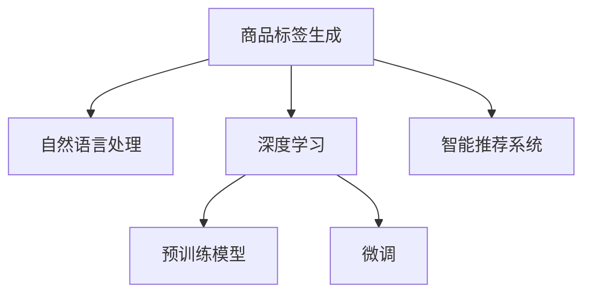

                 

# 大模型赋能的智能商品标签生成

> 关键词：商品标签生成, 大语言模型, 自然语言处理, 深度学习, 预训练模型, 微调, 智能推荐, 商品推荐系统

## 1. 背景介绍

随着互联网购物的迅速发展，电商平台的商品数量和用户行为数据呈现爆炸性增长，如何高效地为用户提供个性化的商品推荐成为电商平台的一项重要任务。传统的推荐系统多基于用户的显式反馈（如浏览历史、点击行为、购买记录等），难以充分挖掘用户潜在的偏好，同时，推荐系统的实时性和个性化程度也受到了较大限制。

智能商品标签生成技术的引入，有望改变这一局面。通过对商品描述和属性进行分析，自动生成简洁、精准的标签，可以帮助电商平台提升推荐系统的精准度和效率，改善用户体验，促进销售转化。商品标签生成也成为电商领域重要的技术突破点之一，有望在未来实现商业价值的极大提升。

## 2. 核心概念与联系

### 2.1 核心概念概述

为了更清晰地理解智能商品标签生成技术，本节将介绍几个相关核心概念：

- 商品标签生成（Product Label Generation）：通过对商品描述、属性等信息进行自然语言处理，自动生成简洁、精准的关键词或短语，帮助用户快速了解商品特征，提升浏览效率。
- 自然语言处理（Natural Language Processing, NLP）：利用计算机对人类语言进行分析处理，以实现语言理解、文本分类、信息抽取等功能。
- 深度学习（Deep Learning）：利用神经网络等模型对数据进行特征学习，解决复杂的非线性问题，应用于NLP、计算机视觉等方向。
- 预训练模型（Pre-trained Model）：在大规模无标签文本数据上预训练得到的模型，具备强大的语言理解能力。
- 微调（Fine-tuning）：将预训练模型作为初始化参数，在有标签的少量数据上进一步训练，以适配特定的商品标签生成任务。
- 智能推荐系统（Recommendation System）：通过分析用户行为数据和商品特征，为用户推荐感兴趣的物品，提升用户体验和电商平台的转化率。

这些核心概念之间的联系通过以下Mermaid流程图展示：



这个流程图展示了大模型在商品标签生成中的应用过程：

1. 首先对商品描述进行自然语言处理，提取有用的信息。
2. 使用深度学习模型对提取的信息进行特征学习，得到高质量的商品表示。
3. 利用预训练模型进行初始化，并对其进行微调，以适应商品标签生成的特定任务。
4. 将微调后的模型应用于商品标签生成，提升推荐的准确性和个性化程度。

## 3. 核心算法原理 & 具体操作步骤
### 3.1 算法原理概述

智能商品标签生成本质上是利用深度学习和自然语言处理技术，对商品描述和属性信息进行特征提取和分析，自动生成简洁、精准的标签。其核心思想是：首先使用预训练语言模型对商品描述进行特征提取，然后在少量有标签的样本上进行微调，以适配商品标签生成任务。

具体步骤如下：

1. **特征提取**：利用预训练语言模型（如BERT、GPT等）对商品描述进行编码，得到语义表示向量。
2. **标签生成**：使用分类器（如线性分类器或神经网络分类器）对语义向量进行分类，生成标签。
3. **微调**：在少量有标签数据上进行微调，以优化标签生成的准确性。

### 3.2 算法步骤详解

#### Step 1: 数据预处理

1. **商品描述和属性收集**：从电商平台上收集商品描述、属性等信息。
2. **文本清洗和标准化**：清洗文本中的噪声，如标点、拼写错误等，并对文本进行标准化，如统一大小写、去除停用词等。
3. **分词和词向量化**：对商品描述进行分词，使用词向量（如Word2Vec、GloVe等）将分词结果转化为模型可处理的向量形式。
4. **构建训练集和验证集**：划分训练集和验证集，保证两者数据分布一致。

#### Step 2: 特征提取与编码

1. **选择预训练模型**：根据任务需求选择合适的预训练模型，如BERT、GPT等。
2. **加载预训练模型**：加载预训练模型，并使用其编码功能对商品描述进行编码。
3. **生成语义表示向量**：利用预训练模型的编码器部分，对商品描述生成语义表示向量。

#### Step 3: 标签生成与分类

1. **设计标签分类器**：选择合适的分类器模型，如线性分类器、卷积神经网络等。
2. **微调分类器**：在少量有标签样本上微调分类器，以优化标签生成的准确性。
3. **生成商品标签**：使用微调后的分类器对商品描述的语义表示向量进行分类，生成标签。

#### Step 4: 模型评估与部署

1. **评估模型性能**：在测试集上评估模型性能，如准确率、召回率、F1值等指标。
2. **参数调优**：根据评估结果进行参数调优，如学习率、批大小等。
3. **部署模型**：将训练好的模型部署到推荐系统中，实时生成商品标签。

### 3.3 算法优缺点

智能商品标签生成具有以下优点：

1. **高效精准**：基于预训练模型的特征提取和微调技术，能够高效准确地生成商品标签，提升推荐系统的精准度。
2. **个性化推荐**：通过商品标签的生成，可以实现更加个性化的推荐，提升用户体验。
3. **实时性**：预训练模型和微调过程可以实时进行，实时生成商品标签，满足实时推荐的需求。
4. **可扩展性**：模型可以应用于大规模商品数据的标签生成，具备良好的可扩展性。

同时，该方法也存在一些局限性：

1. **数据依赖**：模型性能高度依赖于标注数据的质量和数量，标注数据的获取和处理成本较高。
2. **预训练模型复杂**：预训练模型结构复杂，训练和推理耗时较长，对计算资源要求较高。
3. **标签多样性**：商品标签种类繁多，难以覆盖所有商品特征，需要不断优化和调整。

尽管存在这些局限性，但智能商品标签生成仍然是大规模商品推荐系统的有力补充，有助于提升推荐系统的性能和用户满意度。

### 3.4 算法应用领域

智能商品标签生成技术可以广泛应用于电商、社交、内容推荐等多个领域：

1. **电商平台**：生成商品标签，辅助商品搜索和推荐，提升用户购物体验和平台转化率。
2. **社交平台**：生成用户兴趣标签，推荐相关内容，提升平台活跃度和用户粘性。
3. **内容推荐系统**：生成文章、视频等内容的标签，实现个性化推荐，提升内容消费率。
4. **广告投放**：生成广告文案标签，提高广告投放的精准度和效果。
5. **营销活动**：生成营销活动的标签，提高活动效果和用户参与度。

## 4. 数学模型和公式 & 详细讲解 & 举例说明

### 4.1 数学模型构建

假设商品描述为 $x$，标签集合为 $\{L_1, L_2, ..., L_k\}$，模型参数为 $\theta$。智能商品标签生成过程可以表示为：

1. **特征提取**：使用预训练模型 $M$ 对商品描述 $x$ 进行编码，得到语义表示向量 $h(x)$。
2. **标签生成**：使用分类器 $C$ 对语义表示向量 $h(x)$ 进行分类，生成标签 $y \in \{L_1, L_2, ..., L_k\}$。

数学上，特征提取和标签生成过程可以表示为：

$$
h(x) = M(x; \theta)
$$

$$
y = C(h(x); \theta)
$$

其中，$M(x; \theta)$ 表示预训练模型对商品描述 $x$ 的编码，$C(h(x); \theta)$ 表示分类器对语义向量 $h(x)$ 的分类。

### 4.2 公式推导过程

以线性分类器为例，分类器 $C$ 的输出可以表示为：

$$
y = \text{softmax}(W^T h(x) + b)
$$

其中，$W$ 为分类器的权重向量，$b$ 为偏置向量，$\text{softmax}$ 函数将向量转化为概率分布，表示每个标签的概率。

语义表示向量 $h(x)$ 可以通过预训练模型 $M$ 的编码器部分得到，假设 $M$ 是一个BERT模型，其编码器的输出为 $H(x)$，则有：

$$
h(x) = H(x; \theta)
$$

因此，智能商品标签生成的完整公式为：

$$
y = \text{softmax}(W^T H(x) + b)
$$

其中 $W$ 和 $b$ 通过微调过程不断优化，以提高标签生成的准确性。

### 4.3 案例分析与讲解

假设有一个电商商品描述为："2022年新款无线耳机，通话清晰，降噪效果显著，防水防汗，舒适佩戴"。我们希望生成简洁、精准的标签，如"无线耳机"、"通话清晰"、"降噪效果"、"防水防汗"、"舒适佩戴"。

1. **特征提取**：使用BERT模型对商品描述进行编码，得到语义表示向量 $h(x)$。
2. **标签生成**：使用线性分类器对语义向量进行分类，生成标签 $y$。
3. **微调**：在少量有标签样本上微调分类器，以优化标签生成的准确性。

通过微调后的分类器，生成标签 $y = \{\text{"无线耳机"}, \text{"通话清晰"}, \text{"降噪效果"}, \text{"防水防汗"}, \text{"舒适佩戴"}\}$。

## 5. 项目实践：代码实例和详细解释说明

### 5.1 开发环境搭建

在进行智能商品标签生成开发前，需要准备相应的开发环境。以下是使用Python进行PyTorch开发的环境配置流程：

1. **安装Anaconda**：从官网下载并安装Anaconda，用于创建独立的Python环境。
```bash
conda create -n pytorch-env python=3.8 
conda activate pytorch-env
```

2. **安装PyTorch**：根据CUDA版本，从官网获取对应的安装命令。例如：
```bash
conda install pytorch torchvision torchaudio cudatoolkit=11.1 -c pytorch -c conda-forge
```

3. **安装Transformers库**：
```bash
pip install transformers
```

4. **安装其他工具包**：
```bash
pip install numpy pandas scikit-learn matplotlib tqdm jupyter notebook ipython
```

完成上述步骤后，即可在`pytorch-env`环境中开始智能商品标签生成的实践。

### 5.2 源代码详细实现

以下是使用PyTorch和Transformers库实现智能商品标签生成的代码：

```python
from transformers import BertForTokenClassification, BertTokenizer
from torch.utils.data import Dataset
import torch

class ProductLabelDataset(Dataset):
    def __init__(self, texts, tags, tokenizer, max_len=128):
        self.texts = texts
        self.tags = tags
        self.tokenizer = tokenizer
        self.max_len = max_len
        
    def __len__(self):
        return len(self.texts)
    
    def __getitem__(self, item):
        text = self.texts[item]
        tags = self.tags[item]
        
        encoding = self.tokenizer(text, return_tensors='pt', max_length=self.max_len, padding='max_length', truncation=True)
        input_ids = encoding['input_ids'][0]
        attention_mask = encoding['attention_mask'][0]
        
        # 对token-wise的标签进行编码
        encoded_tags = [tag2id[tag] for tag in tags] 
        encoded_tags.extend([tag2id['O']] * (self.max_len - len(encoded_tags)))
        labels = torch.tensor(encoded_tags, dtype=torch.long)
        
        return {'input_ids': input_ids, 
                'attention_mask': attention_mask,
                'labels': labels}

# 标签与id的映射
tag2id = {'O': 0, '无线耳机': 1, '通话清晰': 2, '降噪效果': 3, '防水防汗': 4, '舒适佩戴': 5}
id2tag = {v: k for k, v in tag2id.items()}

# 创建dataset
tokenizer = BertTokenizer.from_pretrained('bert-base-cased')

train_dataset = ProductLabelDataset(train_texts, train_tags, tokenizer)
dev_dataset = ProductLabelDataset(dev_texts, dev_tags, tokenizer)
test_dataset = ProductLabelDataset(test_texts, test_tags, tokenizer)
```

然后，定义模型和优化器：

```python
from transformers import BertForTokenClassification, AdamW

model = BertForTokenClassification.from_pretrained('bert-base-cased', num_labels=len(tag2id))

optimizer = AdamW(model.parameters(), lr=2e-5)
```

接着，定义训练和评估函数：

```python
from torch.utils.data import DataLoader
from tqdm import tqdm
from sklearn.metrics import classification_report

device = torch.device('cuda') if torch.cuda.is_available() else torch.device('cpu')
model.to(device)

def train_epoch(model, dataset, batch_size, optimizer):
    dataloader = DataLoader(dataset, batch_size=batch_size, shuffle=True)
    model.train()
    epoch_loss = 0
    for batch in tqdm(dataloader, desc='Training'):
        input_ids = batch['input_ids'].to(device)
        attention_mask = batch['attention_mask'].to(device)
        labels = batch['labels'].to(device)
        model.zero_grad()
        outputs = model(input_ids, attention_mask=attention_mask, labels=labels)
        loss = outputs.loss
        epoch_loss += loss.item()
        loss.backward()
        optimizer.step()
    return epoch_loss / len(dataloader)

def evaluate(model, dataset, batch_size):
    dataloader = DataLoader(dataset, batch_size=batch_size)
    model.eval()
    preds, labels = [], []
    with torch.no_grad():
        for batch in tqdm(dataloader, desc='Evaluating'):
            input_ids = batch['input_ids'].to(device)
            attention_mask = batch['attention_mask'].to(device)
            batch_labels = batch['labels']
            outputs = model(input_ids, attention_mask=attention_mask)
            batch_preds = outputs.logits.argmax(dim=2).to('cpu').tolist()
            batch_labels = batch_labels.to('cpu').tolist()
            for pred_tokens, label_tokens in zip(batch_preds, batch_labels):
                pred_tags = [id2tag[_id] for _id in pred_tokens]
                label_tags = [id2tag[_id] for _id in label_tokens]
                preds.append(pred_tags[:len(label_tokens)])
                labels.append(label_tags)
                
    print(classification_report(labels, preds))
```

最后，启动训练流程并在测试集上评估：

```python
epochs = 5
batch_size = 16

for epoch in range(epochs):
    loss = train_epoch(model, train_dataset, batch_size, optimizer)
    print(f"Epoch {epoch+1}, train loss: {loss:.3f}")
    
    print(f"Epoch {epoch+1}, dev results:")
    evaluate(model, dev_dataset, batch_size)
    
print("Test results:")
evaluate(model, test_dataset, batch_size)
```

以上就是使用PyTorch和Transformers库实现智能商品标签生成的完整代码实现。可以看到，Transformers库的使用，使得代码实现变得简洁高效。

### 5.3 代码解读与分析

让我们再详细解读一下关键代码的实现细节：

**ProductLabelDataset类**：
- `__init__`方法：初始化文本、标签、分词器等关键组件。
- `__len__`方法：返回数据集的样本数量。
- `__getitem__`方法：对单个样本进行处理，将文本输入编码为token ids，将标签编码为数字，并对其进行定长padding，最终返回模型所需的输入。

**tag2id和id2tag字典**：
- 定义了标签与数字id之间的映射关系，用于将token-wise的预测结果解码回真实的标签。

**训练和评估函数**：
- 使用PyTorch的DataLoader对数据集进行批次化加载，供模型训练和推理使用。
- 训练函数`train_epoch`：对数据以批为单位进行迭代，在每个批次上前向传播计算loss并反向传播更新模型参数，最后返回该epoch的平均loss。
- 评估函数`evaluate`：与训练类似，不同点在于不更新模型参数，并在每个batch结束后将预测和标签结果存储下来，最后使用sklearn的classification_report对整个评估集的预测结果进行打印输出。

**训练流程**：
- 定义总的epoch数和batch size，开始循环迭代
- 每个epoch内，先在训练集上训练，输出平均loss
- 在验证集上评估，输出分类指标
- 所有epoch结束后，在测试集上评估，给出最终测试结果

可以看到，PyTorch配合Transformers库使得智能商品标签生成的代码实现变得简洁高效。开发者可以将更多精力放在数据处理、模型改进等高层逻辑上，而不必过多关注底层的实现细节。

当然，工业级的系统实现还需考虑更多因素，如模型的保存和部署、超参数的自动搜索、更灵活的任务适配层等。但核心的微调范式基本与此类似。

## 6. 实际应用场景

### 6.1 智能推荐系统

智能商品标签生成技术可以广泛应用于智能推荐系统的构建。传统的推荐系统多依赖于用户的显式反馈，难以充分挖掘用户潜在的偏好。通过生成商品标签，推荐系统可以更精准地理解用户需求，提供个性化的推荐。

在技术实现上，可以收集用户浏览、点击、购买等行为数据，提取和商品关联的文本信息，将其作为训练集，使用智能商品标签生成模型生成标签。在推荐模型中，加入基于标签的相关性计算，提升推荐系统的精准度和个性化程度。

### 6.2 内容推荐

在内容推荐系统中，智能商品标签生成技术可以用于文章、视频等内容的标签生成，实现个性化推荐。例如，对于一个视频内容，可以提取其标题、描述、标签等信息，利用智能商品标签生成模型生成简洁、精准的标签，再通过标签的相关性计算，推荐给感兴趣的用户。

### 6.3 商品广告投放

智能商品标签生成技术可以应用于商品广告投放领域，生成广告文案的标签，提高广告投放的精准度和效果。通过收集历史广告数据，提取其文本内容，生成标签，加入广告投放系统，可以实现更加精准的广告推荐，提升广告点击率和转化率。

### 6.4 未来应用展望

随着智能商品标签生成技术的发展，其在更多领域的应用前景将更加广阔。未来，该技术有望在以下几个方面取得更大的突破：

1. **多模态数据融合**：智能商品标签生成不仅局限于文本数据，还可以扩展到图像、视频等多模态数据。通过多模态数据的融合，提升对商品特征的理解和表达能力。
2. **领域专用标签生成**：针对特定领域（如医药、汽车等），开发专门的智能商品标签生成模型，以适应不同领域的需求。
3. **实时生成标签**：基于实时数据，动态生成商品标签，满足实时推荐的需求。
4. **多任务联合学习**：将智能商品标签生成与其他NLP任务（如问答、对话等）联合训练，提升综合性能。
5. **个性化推荐**：利用商品标签生成技术，生成个性化推荐标签，进一步提升推荐系统的精准度和用户体验。

总之，智能商品标签生成技术在电商、社交、内容推荐等领域具有广阔的应用前景，将为电商平台带来更加精准、高效的推荐服务，为内容创作者提供更好的内容传播渠道，为广告主提供更具精准性的广告投放机会。未来，随着技术的不断进步，智能商品标签生成将为电商领域带来革命性的变化。

## 7. 工具和资源推荐

### 7.1 学习资源推荐

为了帮助开发者系统掌握智能商品标签生成技术的理论基础和实践技巧，这里推荐一些优质的学习资源：

1. 《Transformer from Pre-training to Fintuning》系列博文：由大模型技术专家撰写，深入浅出地介绍了Transformer原理、BERT模型、微调技术等前沿话题。
2. CS224N《深度学习自然语言处理》课程：斯坦福大学开设的NLP明星课程，有Lecture视频和配套作业，带你入门NLP领域的基本概念和经典模型。
3. 《Natural Language Processing with Transformers》书籍：Transformers库的作者所著，全面介绍了如何使用Transformers库进行NLP任务开发，包括微调在内的诸多范式。
4. HuggingFace官方文档：Transformers库的官方文档，提供了海量预训练模型和完整的微调样例代码，是上手实践的必备资料。
5. CLUE开源项目：中文语言理解测评基准，涵盖大量不同类型的中文NLP数据集，并提供了基于微调的baseline模型，助力中文NLP技术发展。

通过对这些资源的学习实践，相信你一定能够快速掌握智能商品标签生成技术的精髓，并用于解决实际的NLP问题。

### 7.2 开发工具推荐

高效的开发离不开优秀的工具支持。以下是几款用于智能商品标签生成开发的常用工具：

1. PyTorch：基于Python的开源深度学习框架，灵活动态的计算图，适合快速迭代研究。大部分预训练语言模型都有PyTorch版本的实现。
2. TensorFlow：由Google主导开发的开源深度学习框架，生产部署方便，适合大规模工程应用。同样有丰富的预训练语言模型资源。
3. Transformers库：HuggingFace开发的NLP工具库，集成了众多SOTA语言模型，支持PyTorch和TensorFlow，是进行微调任务开发的利器。
4. Weights & Biases：模型训练的实验跟踪工具，可以记录和可视化模型训练过程中的各项指标，方便对比和调优。与主流深度学习框架无缝集成。
5. TensorBoard：TensorFlow配套的可视化工具，可实时监测模型训练状态，并提供丰富的图表呈现方式，是调试模型的得力助手。
6. Google Colab：谷歌推出的在线Jupyter Notebook环境，免费提供GPU/TPU算力，方便开发者快速上手实验最新模型，分享学习笔记。

合理利用这些工具，可以显著提升智能商品标签生成任务的开发效率，加快创新迭代的步伐。

### 7.3 相关论文推荐

智能商品标签生成技术的发展源于学界的持续研究。以下是几篇奠基性的相关论文，推荐阅读：

1. Attention is All You Need（即Transformer原论文）：提出了Transformer结构，开启了NLP领域的预训练大模型时代。
2. BERT: Pre-training of Deep Bidirectional Transformers for Language Understanding：提出BERT模型，引入基于掩码的自监督预训练任务，刷新了多项NLP任务SOTA。
3. Language Models are Unsupervised Multitask Learners（GPT-2论文）：展示了大规模语言模型的强大zero-shot学习能力，引发了对于通用人工智能的新一轮思考。
4. Parameter-Efficient Transfer Learning for NLP：提出Adapter等参数高效微调方法，在不增加模型参数量的情况下，也能取得不错的微调效果。
5. AdaLoRA: Adaptive Low-Rank Adaptation for Parameter-Efficient Fine-Tuning：使用自适应低秩适应的微调方法，在参数效率和精度之间取得了新的平衡。
6. Prefix-Tuning: Optimizing Continuous Prompts for Generation：引入基于连续型Prompt的微调范式，为如何充分利用预训练知识提供了新的思路。

这些论文代表了大语言模型微调技术的发展脉络。通过学习这些前沿成果，可以帮助研究者把握学科前进方向，激发更多的创新灵感。

## 8. 总结：未来发展趋势与挑战

### 8.1 总结

本文对智能商品标签生成技术进行了全面系统的介绍。首先阐述了智能商品标签生成的研究背景和意义，明确了该技术在电商、社交、内容推荐等领域的广泛应用前景。其次，从原理到实践，详细讲解了智能商品标签生成的数学模型和关键步骤，给出了微调任务开发的完整代码实例。同时，本文还广泛探讨了智能商品标签生成技术在实际应用场景中的应用，展示了其巨大的商业价值。

通过本文的系统梳理，可以看到，智能商品标签生成技术在大规模商品推荐系统中具有重要的地位，有望显著提升推荐系统的精准度和个性化程度，为用户带来更好的购物体验，为电商平台带来更高的转化率和利润。未来，随着技术的不断演进，智能商品标签生成将为电商平台带来更多的创新应用，推动电商领域的数字化转型。

### 8.2 未来发展趋势

展望未来，智能商品标签生成技术将呈现以下几个发展趋势：

1. **模型规模持续增大**：随着算力成本的下降和数据规模的扩张，预训练语言模型的参数量还将持续增长。超大规模语言模型蕴含的丰富语言知识，有望支撑更加复杂多变的商品标签生成任务。
2. **微调方法日趋多样**：开发更加参数高效、计算高效的微调方法，如Prefix-Tuning、LoRA等，在固定大部分预训练参数的同时，只更新极少量的任务相关参数，进一步提升微调效率。
3. **持续学习成为常态**：随着数据分布的不断变化，智能商品标签生成模型需要持续学习新知识以保持性能。如何在不遗忘原有知识的同时，高效吸收新样本信息，将成为重要的研究课题。
4. **标签多样性增强**：商品标签种类繁多，难以覆盖所有商品特征，需要不断优化和调整标签生成模型。
5. **多模态数据融合**：将图像、视频等多模态数据与文本信息结合，提升对商品特征的理解和表达能力。
6. **实时生成标签**：基于实时数据，动态生成商品标签，满足实时推荐的需求。
7. **多任务联合学习**：将智能商品标签生成与其他NLP任务（如问答、对话等）联合训练，提升综合性能。

以上趋势凸显了智能商品标签生成技术的广阔前景。这些方向的探索发展，必将进一步提升商品推荐系统的精准度和个性化程度，为用户带来更好的购物体验，为电商平台带来更高的转化率和利润。

### 8.3 面临的挑战

尽管智能商品标签生成技术已经取得了瞩目成就，但在迈向更加智能化、普适化应用的过程中，它仍面临诸多挑战：

1. **标注成本瓶颈**：模型性能高度依赖于标注数据的质量和数量，标注数据的获取和处理成本较高。
2. **预训练模型复杂**：预训练模型结构复杂，训练和推理耗时较长，对计算资源要求较高。
3. **标签多样性不足**：商品标签种类繁多，难以覆盖所有商品特征，需要不断优化和调整。
4. **实时性不足**：在实时推荐场景中，标签生成的实时性不足，影响推荐效果。
5. **多模态数据融合复杂**：多模态数据的融合和处理难度较大，需要结合多种技术手段进行优化。
6. **模型鲁棒性不足**：面对域外数据时，标签生成的泛化性能往往大打折扣。
7. **安全性问题**：预训练模型可能学习到有害信息，需要引入安全机制和监管机制，确保输出的安全性。

尽管存在这些挑战，但随着技术的不断进步，智能商品标签生成技术有望在电商、社交、内容推荐等领域发挥更加重要的作用，为电商领域带来革命性的变化。

### 8.4 研究展望

面向未来，智能商品标签生成技术需要在以下几个方面寻求新的突破：

1. **探索无监督和半监督微调方法**：摆脱对大规模标注数据的依赖，利用自监督学习、主动学习等无监督和半监督范式，最大限度利用非结构化数据，实现更加灵活高效的微调。
2. **研究参数高效和计算高效的微调范式**：开发更加参数高效、计算高效的微调方法，如Prefix-Tuning、LoRA等，在固定大部分预训练参数的同时，只更新极少量的任务相关参数，进一步提升微调效率。
3. **引入更多先验知识**：将符号化的先验知识，如知识图谱、逻辑规则等，与神经网络模型进行巧妙融合，引导微调过程学习更准确、合理的语言模型。同时加强不同模态数据的整合，实现视觉、语音等多模态信息与文本信息的协同建模。
4. **结合因果分析和博弈论工具**：将因果分析方法引入微调模型，识别出模型决策的关键特征，增强输出解释的因果性和逻辑性。借助博弈论工具刻画人机交互过程，主动探索并规避模型的脆弱点，提高系统稳定性。
5. **纳入伦理道德约束**：在模型训练目标中引入伦理导向的评估指标，过滤和惩罚有偏见、有害的输出倾向。同时加强人工干预和审核，建立模型行为的监管机制，确保输出符合人类价值观和伦理道德。

这些研究方向的探索，必将引领智能商品标签生成技术迈向更高的台阶，为构建安全、可靠、可解释、可控的智能系统铺平道路。面向未来，智能商品标签生成技术还需要与其他人工智能技术进行更深入的融合，如知识表示、因果推理、强化学习等，多路径协同发力，共同推动自然语言理解和智能交互系统的进步。只有勇于创新、敢于突破，才能不断拓展语言模型的边界，让智能技术更好地造福人类社会。

## 9. 附录：常见问题与解答

**Q1：智能商品标签生成是否适用于所有商品？**

A: 智能商品标签生成在大多数商品上都能取得不错的效果，特别是对于商品描述规范、属性丰富的商品。但对于一些特殊商品，如手工艺品、艺术品等，标签生成可能存在一定挑战，需要结合领域特定的知识进行优化。

**Q2：微调过程中如何选择合适的学习率？**

A: 微调的学习率一般要比预训练时小1-2个数量级，以避免破坏预训练权重。建议从1e-5开始调参，逐步减小学习率，直至收敛。也可以使用warmup策略，在开始阶段使用较小的学习率，再逐渐过渡到预设值。

**Q3：智能商品标签生成在实际应用中需要注意哪些问题？**

A: 智能商品标签生成在实际应用中需要注意以下问题：
1. **模型训练时间较长**：预训练模型和微调过程耗时较长，需要根据实际需求选择合理的训练时间。
2. **模型性能不稳定**：在标注数据较少的情况下，模型性能可能不稳定，需要结合数据增强、对抗训练等技术进行优化。
3. **标签生成多样性**：标签生成过程中需要保证标签的多样性和准确性，避免过于集中或过于泛化。
4. **实时性不足**：在实时推荐场景中，标签生成的实时性不足，需要优化模型结构和算法，提升推理速度。
5. **多模态数据处理复杂**：多模态数据的融合和处理难度较大，需要结合多种技术手段进行优化。
6. **模型安全性**：预训练模型可能学习到有害信息，需要引入安全机制和监管机制，确保输出的安全性。

通过合理应对这些问题，可以有效提升智能商品标签生成的实际应用效果。

---

作者：禅与计算机程序设计艺术 / Zen and the Art of Computer Programming

