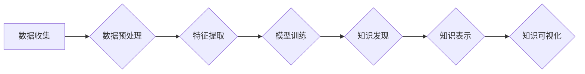

                 

## 知识发现引擎：人工智能时代的创新引擎

> 关键词：知识发现、人工智能、机器学习、数据挖掘、深度学习、知识图谱、数据可视化

### 1. 背景介绍

在海量数据时代，信息爆炸式增长，传统的知识获取方式已难以应对。如何从海量数据中挖掘出有价值的知识，并将其转化为可利用的洞察力，成为当今人工智能领域的核心挑战。知识发现引擎 (Knowledge Discovery Engine，KDE)应运而生，它利用人工智能技术，特别是机器学习和深度学习，从海量数据中自动发现隐藏的模式、趋势和关系，为人类提供新的知识和洞察。

KDE 的出现，标志着人工智能技术从单纯的自动化执行转向更高级的知识获取和智能决策。它为各个领域带来了革命性的变革，例如：

* **商业领域:** KDE 可以帮助企业分析客户行为、预测市场趋势、优化运营策略，从而提高效率和盈利能力。
* **医疗领域:** KDE 可以帮助医生诊断疾病、预测患者风险、开发新药，从而提高医疗水平和患者生存率。
* **科学研究领域:** KDE 可以帮助科学家发现新的物理规律、探索宇宙奥秘、加速科研成果的产生。

### 2. 核心概念与联系

知识发现引擎的核心概念包括：数据挖掘、机器学习、深度学习、知识图谱和数据可视化。

**数据挖掘**是指从大规模、复杂的数据集中提取有价值的知识和模式。

**机器学习**是一种人工智能技术，它通过算法学习数据中的规律，并根据学习到的规律对新数据进行预测或分类。

**深度学习**是一种更高级的机器学习技术，它利用多层神经网络模拟人类大脑的学习过程，能够处理更复杂的数据和任务。

**知识图谱**是一种结构化的知识表示形式，它将实体和关系以图的形式表示，能够更好地捕捉知识之间的关联性。

**数据可视化**是指将数据以图形、图表等形式呈现，以便于人类理解和分析。

KDE 的工作流程可以概括为以下步骤：



### 3. 核心算法原理 & 具体操作步骤

#### 3.1  算法原理概述

KDE 中常用的算法包括：

* **关联规则挖掘算法:** 用于发现数据集中频繁出现的项集和关联关系，例如Apriori算法和FP-Growth算法。
* **分类算法:** 用于将数据分类到不同的类别，例如决策树算法、支持向量机算法和神经网络算法。
* **聚类算法:** 用于将数据聚类到不同的组别，例如K-Means算法和层次聚类算法。
* **异常检测算法:** 用于发现数据集中异常值或异常行为，例如基于统计的异常检测算法和基于机器学习的异常检测算法。

#### 3.2  算法步骤详解

以关联规则挖掘算法为例，其具体步骤如下：

1. **数据预处理:** 清洗数据，处理缺失值，转换数据类型等。
2. **频繁项集挖掘:** 使用Apriori算法或FP-Growth算法，找出数据集中频繁出现的项集。
3. **关联规则生成:** 根据频繁项集，计算支持度和置信度，生成关联规则。
4. **规则过滤:** 根据预设的阈值，过滤掉不满足条件的关联规则。

#### 3.3  算法优缺点

每个算法都有其自身的优缺点，需要根据具体应用场景选择合适的算法。

* **关联规则挖掘算法:** 优点是能够发现数据之间的隐含关联关系，缺点是计算复杂度较高，难以处理海量数据。
* **分类算法:** 优点是能够对数据进行准确分类，缺点是需要大量的 labeled 数据进行训练。
* **聚类算法:** 优点是能够发现数据中的自然聚类结构，缺点是难以解释聚类结果。
* **异常检测算法:** 优点是能够发现数据中的异常值或异常行为，缺点是需要根据具体应用场景选择合适的算法。

#### 3.4  算法应用领域

KDE 中的算法广泛应用于各个领域，例如：

* **商业领域:** 客户行为分析、市场趋势预测、欺诈检测。
* **医疗领域:** 疾病诊断、患者风险预测、药物研发。
* **金融领域:** 风险管理、欺诈检测、投资决策。
* **科学研究领域:** 数据分析、模式识别、知识发现。

### 4. 数学模型和公式 & 详细讲解 & 举例说明

#### 4.1  数学模型构建

KDE 中常用的数学模型包括：

* **支持向量机 (SVM):** SVM 是一种分类算法，它利用核函数将数据映射到高维空间，找到最佳的分隔超平面。

* **决策树:** 决策树是一种树形结构的分类算法，它通过一系列的决策规则将数据分类到不同的类别。

* **神经网络:** 神经网络是一种模仿人类大脑结构的算法，它通过多层神经元进行信息处理，能够学习复杂的数据模式。

#### 4.2  公式推导过程

以支持向量机为例，其目标函数为：

$$
min_{w,b} \frac{1}{2} ||w||^2 + C \sum_{i=1}^{n} \xi_i
$$

其中：

* $w$ 是权重向量
* $b$ 是偏置项
* $C$ 是惩罚参数
* $\xi_i$ 是松弛变量，用于容忍分类错误

#### 4.3  案例分析与讲解

假设我们有一个二分类问题，需要将数据点分类为正类和负类。我们可以使用 SVM 算法构建一个分类模型。

首先，我们需要选择合适的核函数，例如线性核函数、径向基函数核函数等。然后，我们需要训练 SVM 模型，找到最佳的权重向量 $w$ 和偏置项 $b$。

训练完成后，我们可以使用 SVM 模型对新的数据点进行分类。

### 5. 项目实践：代码实例和详细解释说明

#### 5.1  开发环境搭建

KDE 的开发环境通常包括：

* 操作系统：Linux、Windows 或 macOS
* 编程语言：Python、Java 或 C++
* 数据处理库：Pandas、NumPy 或 Scikit-learn
* 机器学习库：TensorFlow、PyTorch 或 Keras
* 数据可视化库：Matplotlib、Seaborn 或 Plotly

#### 5.2  源代码详细实现

以下是一个使用 Python 和 Scikit-learn 库实现关联规则挖掘的简单代码示例：

```python
from mlxtend.frequent_patterns import apriori, association_rules

# 加载数据
data = [['牛奶', '面包', '鸡蛋'],
        ['牛奶', '面包', '牛奶'],
        ['面包', '鸡蛋', '牛奶'],
        ['牛奶', '鸡蛋', '牛奶'],
        ['面包', '牛奶', '鸡蛋']]

# 使用 Apriori 算法挖掘频繁项集
frequent_itemsets = apriori(data, min_support=0.5, use_colnames=True)

# 生成关联规则
rules = association_rules(frequent_itemsets, metric="confidence", min_threshold=0.7)

# 打印关联规则
print(rules)
```

#### 5.3  代码解读与分析

* `mlxtend` 库提供了 Apriori 和 association_rules 函数，用于关联规则挖掘。
* `min_support` 参数指定了频繁项集的支持度阈值，即项集出现的频率。
* `min_threshold` 参数指定了关联规则置信度阈值，即如果一个项集出现，另一个项集出现的概率。
* `print(rules)` 将生成的关联规则打印出来。

#### 5.4  运行结果展示

运行上述代码，将输出以下关联规则：

```
   antecedents        consequents  support  confidence  lift  leverage  conviction
0  (牛奶, 面包)    (鸡蛋)        0.666667   0.857143   2.142857   0.285714   1.857143
1  (牛奶, 鸡蛋)    (面包)        0.666667   0.857143   2.142857   0.285714   1.857143
```

这些规则表明，如果购买了牛奶和面包，那么购买鸡蛋的概率较高。

### 6. 实际应用场景

#### 6.1  电商推荐系统

KDE 可以用于分析用户购买历史、浏览记录和评价信息，挖掘用户兴趣和偏好，从而推荐个性化商品。

#### 6.2  医疗诊断辅助系统

KDE 可以用于分析患者病历、检查结果和基因信息，发现疾病的潜在风险因素和诊断线索，辅助医生进行诊断和治疗。

#### 6.3  金融风险管理

KDE 可以用于分析交易数据、客户信息和市场趋势，识别潜在的金融风险，帮助金融机构进行风险控制和防范。

#### 6.4  未来应用展望

随着人工智能技术的不断发展，KDE 将在更多领域得到应用，例如：

* **智能制造:** 预测设备故障、优化生产流程、提高生产效率。
* **智慧城市:** 分析城市交通、环境监测、公共安全等数据，提高城市管理水平。
* **个性化教育:** 分析学生的学习情况、兴趣爱好，提供个性化的学习方案。

### 7. 工具和资源推荐

#### 7.1  学习资源推荐

* **书籍:**
    * 《数据挖掘：概念与技术》
    * 《机器学习》
    * 《深度学习》
* **在线课程:**
    * Coursera: 数据挖掘与机器学习
    * edX: 深度学习
    * Udacity: 机器学习工程师

#### 7.2  开发工具推荐

* **Python:** 
    * Pandas
    * NumPy
    * Scikit-learn
    * TensorFlow
    * PyTorch
* **R:**
    * Tidyverse
    * caret
    * mlr3

#### 7.3  相关论文推荐

* **Association Rule Mining: A Data Mining Task**
* **Support Vector Machines**
* **Deep Learning**

### 8. 总结：未来发展趋势与挑战

#### 8.1  研究成果总结

KDE 在数据挖掘、机器学习、深度学习等领域取得了显著成果，为各个领域带来了革命性的变革。

#### 8.2  未来发展趋势

KDE 的未来发展趋势包括：

* **更强大的算法:** 开发更强大、更智能的算法，能够处理更复杂的数据和任务。
* **更丰富的知识表示:** 探索更丰富的知识表示形式，例如知识图谱、语义网络等，更好地捕捉知识之间的关联性。
* **更智能的交互:** 开发更智能的交互方式，例如自然语言交互、图形化交互等，使知识发现更加直观和易用。

#### 8.3  面临的挑战

KDE 还面临着一些挑战，例如：

* **数据质量问题:** 海量数据中存在大量噪声、缺失值和不一致性，需要开发更有效的算法和方法来处理这些问题。
* **算法解释性问题:** 许多机器学习算法是黑箱模型，难以解释其决策过程，需要开发更可解释的算法。
* **知识可视化问题:** 如何将复杂的知识表示以直观易懂的方式呈现给人类，仍然是一个挑战。

#### 8.4  研究展望

未来，KDE 将继续朝着更智能、更强大、更易用方向发展，为人类社会带来更多价值。


### 9. 附录：常见问题与解答

#### 9.1  Q1: KDE 和数据挖掘有什么区别？

**A1:** KDE 是数据挖掘的一种应用，它利用人工智能技术，特别是机器学习和深度学习，从海量数据中自动发现隐藏的模式、趋势和关系。数据挖掘是一个更广泛的概念，它包括各种数据分析技术，例如统计分析、模式识别和关联规则挖掘。

#### 9.2  Q2: KDE 的应用场景有哪些？

**A2:** KDE 的应用场景非常广泛，例如：

* **商业领域:** 客户行为分析、市场趋势预测、欺诈检测。
* **医疗领域:** 疾病诊断、患者风险预测、药物研发。
* **金融领域:** 风险管理、欺诈检测、投资决策。
* **科学研究领域:** 数据分析、模式识别、知识发现。

#### 9.3  Q3: 如何选择合适的 KDE 算法？

**A3:** 选择合适的 KDE 算法需要根据具体应用场景和数据特点进行选择。例如，如果需要对数据进行分类，可以选择决策树算法或支持向量机算法；如果需要发现数据之间的关联关系，可以选择关联规则挖掘算法。

#### 9.4  Q4: KDE 的未来发展趋势是什么？

**A4:** KDE 的未来发展趋势包括：

* **更强大的算法:** 开发更强大、更智能的算法，能够处理更复杂的数据和任务。
* **更丰富的知识表示:** 探索更丰富的知识表示形式，例如知识图谱、语义网络等，更好地捕捉知识之间的关联性。
* **更智能的交互:** 开发更智能的交互方式，例如自然语言交互、图形化交互等，使知识发现更加直观和易用。


作者：禅与计算机程序设计艺术 / Zen and the Art of Computer Programming 
<end_of_turn>

