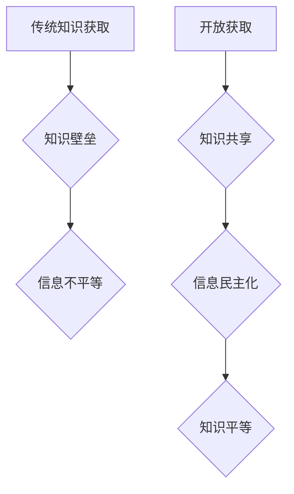

                 

## 知识的开放获取：信息民主化的影响

> 关键词：开放获取、信息民主化、知识共享、数字鸿沟、人工智能、数据公平性、教育平等

## 1. 背景介绍

在信息时代，知识已成为最宝贵的资源，其获取和传播对个人、社会和国家发展至关重要。然而，传统的知识获取模式往往受限于经济、地理和社会等因素，导致知识不平等现象日益突出。开放获取（Open Access，OA）作为一种知识共享模式，旨在打破知识壁垒，促进知识的自由流动和传播，从而推动信息民主化进程。

近年来，随着互联网技术的飞速发展和数字技术的普及，开放获取理念得到越来越广泛的认可和实践。学术期刊、书籍、数据和软件等多种知识资源开始采用开放获取模式，使得知识更加易于获取和利用。

## 2. 核心概念与联系

### 2.1 开放获取

开放获取是指知识资源的免费获取、使用、复制、传播和修改，不受任何形式的限制。它强调知识的公共性和可访问性，旨在打破知识壁垒，促进知识的共享和传播。

### 2.2 信息民主化

信息民主化是指在信息时代，每个人都能够平等地获取、使用和传播信息，从而参与社会决策和公共事务，并拥有表达自己的观点和意见的权利。它强调信息平等、透明和参与，旨在构建一个更加公平、公正和包容的社会。

### 2.3 知识共享

知识共享是指一种基于合作和共创的知识传播模式，强调知识的共同创造、分享和利用。它通过各种许可协议和平台，鼓励人们自由地分享和使用知识资源，共同推动知识进步。

**Mermaid 流程图**



## 3. 核心算法原理 & 具体操作步骤

### 3.1 算法原理概述

开放获取的实现依赖于一系列算法和技术，例如：

* **内容分发算法**: 用于推荐和推送相关知识资源，提高用户获取信息效率。
* **知识图谱构建算法**: 用于构建知识网络，挖掘知识之间的关联关系，提供更深入的知识理解。
* **机器翻译算法**: 用于将知识资源翻译成不同语言，打破语言障碍，促进跨文化知识交流。

### 3.2 算法步骤详解

以内容分发算法为例，其具体操作步骤如下：

1. **数据收集**: 收集用户行为数据、知识资源 metadata 等信息。
2. **特征提取**: 从数据中提取用户兴趣、知识资源主题、用户关系等特征。
3. **模型训练**: 利用机器学习算法，训练内容推荐模型。
4. **推荐生成**: 根据用户特征和知识资源特征，生成个性化知识推荐结果。
5. **结果评估**: 通过用户反馈和指标评估，不断优化推荐算法。

### 3.3 算法优缺点

* **优点**: 提高知识获取效率，个性化推荐，促进知识发现。
* **缺点**: 可能存在算法偏差，导致推荐结果不公平，需要不断优化算法模型。

### 3.4 算法应用领域

* **学术研究**: 推荐相关文献、研究成果，促进学术交流。
* **教育教学**: 推荐学习资源、个性化学习路径，提高学习效率。
* **新闻资讯**: 推荐相关新闻、时事信息，帮助用户了解世界。
* **商业营销**: 推荐产品、服务，提高用户转化率。

## 4. 数学模型和公式 & 详细讲解 & 举例说明

### 4.1 数学模型构建

开放获取的实现可以建模为一个网络系统，其中节点代表知识资源，边代表知识之间的关联关系。

**知识图谱模型**:

$$
G = (V, E)
$$

其中：

* $V$ 代表知识资源集合，每个资源是一个节点。
* $E$ 代表知识之间的关联关系集合，每个关系是一个边。

### 4.2 公式推导过程

可以利用图论算法，例如 PageRank 算法，计算每个知识资源的重要性，并根据用户兴趣和知识图谱结构，推荐相关知识资源。

**PageRank 公式**:

$$
PR(v) = (1-d) + d \sum_{w \in \text{in}(v)} \frac{PR(w)}{out(w)}
$$

其中：

* $PR(v)$ 代表知识资源 $v$ 的 PageRank 值。
* $d$ 代表阻尼因子，通常取值为 0.85。
* $in(v)$ 代表指向知识资源 $v$ 的入边集合。
* $out(w)$ 代表知识资源 $w$ 的出边数量。

### 4.3 案例分析与讲解

例如，在学术文献推荐系统中，可以利用 PageRank 算法计算每个文献的重要性，并根据用户阅读历史和文献之间的引用关系，推荐相关文献。

## 5. 项目实践：代码实例和详细解释说明

### 5.1 开发环境搭建

* 操作系统: Ubuntu 20.04
* 编程语言: Python 3.8
* 框架: Flask
* 数据库: PostgreSQL

### 5.2 源代码详细实现

```python
from flask import Flask, render_template

app = Flask(__name__)

@app.route('/')
def index():
    return render_template('index.html')

if __name__ == '__main__':
    app.run(debug=True)
```

**代码解读与分析**:

* 该代码示例是一个简单的 Flask Web 应用，用于展示开放获取知识资源。
* `index.html` 文件包含网页内容，例如知识资源列表、搜索框等。
* `app.run(debug=True)` 启动 Flask 应用，并开启调试模式。

### 5.3 代码运行结果展示

运行上述代码后，会在本地服务器上启动一个 Web 应用，访问 `http://127.0.0.1:5000/` 可以看到网页界面。

## 6. 实际应用场景

### 6.1 教育领域

* 开放获取的教材、学习资源可以降低教育成本，提高教育公平性。
* 在线学习平台可以利用开放获取的知识资源，提供个性化学习路径和教学内容。

### 6.2 研究领域

* 开放获取的学术期刊和数据可以促进学术交流和合作，加速科研成果的传播。
* 研究人员可以利用开放获取的知识资源，进行跨学科研究和创新。

### 6.3 公共服务领域

* 开放获取的政府数据可以提高政府透明度，促进公众参与公共事务。
* 非营利组织可以利用开放获取的知识资源，开展社会公益活动。

### 6.4 未来应用展望

* 人工智能技术将进一步推动开放获取的发展，例如自动生成知识图谱、个性化知识推荐等。
* 虚拟现实和增强现实技术将为开放获取提供新的交互方式，例如沉浸式知识体验。

## 7. 工具和资源推荐

### 7.1 学习资源推荐

* 开放获取期刊数据库: Directory of Open Access Journals (DOAJ)
* 开放获取书籍平台: Project Gutenberg
* 开放获取数据平台: Data.gov

### 7.2 开发工具推荐

* 内容管理系统: WordPress, Drupal
* 图数据库: Neo4j, Amazon Neptune
* 机器学习库: scikit-learn, TensorFlow

### 7.3 相关论文推荐

* "The Open Access Movement: A Review" by Peter Suber
* "Open Access and the Future of Scholarly Communication" by Stevan Harnad
* "The Impact of Open Access on Research Citation" by Jason Priem

## 8. 总结：未来发展趋势与挑战

### 8.1 研究成果总结

开放获取已经取得了显著的成果，推动了知识共享和信息民主化进程。

### 8.2 未来发展趋势

* 更加智能化的开放获取系统，例如基于人工智能的知识推荐和个性化学习路径。
* 更加多元化的开放获取资源，例如音频、视频、虚拟现实等。
* 更加完善的开放获取政策和机制，例如知识产权保护和数据共享。

### 8.3 面临的挑战

* 知识产权保护和商业模式的探索。
* 数字鸿沟的缩小和信息公平性的保障。
* 技术标准的制定和平台互操作性的提升。

### 8.4 研究展望

未来，开放获取将继续朝着更加智能化、多元化和可持续的方向发展，为人类社会带来更多福祉。


## 9. 附录：常见问题与解答

* **什么是开放获取？**

开放获取是指知识资源的免费获取、使用、复制、传播和修改，不受任何形式的限制。

* **开放获取有哪些优势？**

开放获取可以促进知识共享、提高知识获取效率、降低教育成本、促进科研合作等。

* **开放获取有哪些挑战？**

开放获取面临着知识产权保护、商业模式探索、数字鸿沟缩小等挑战。


作者：禅与计算机程序设计艺术 / Zen and the Art of Computer Programming 
<end_of_turn>

