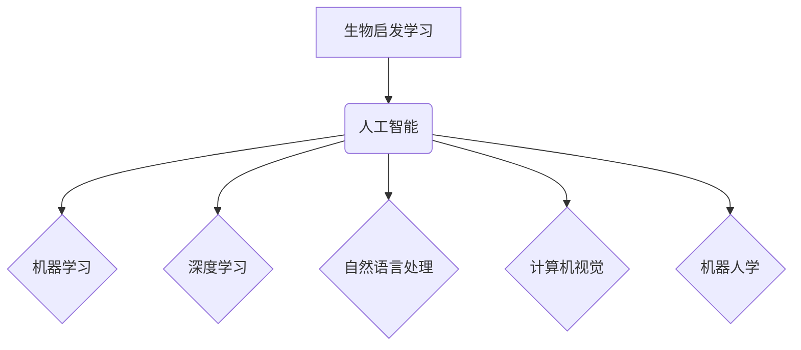

                 

## 知识的生物启发学习：自然界的智慧借鉴

> 关键词：生物启发学习、人工智能、机器学习、神经网络、进化算法、自然优化、深度学习、知识图谱

## 1. 背景介绍

在信息时代，人类对知识的获取、处理和应用能力面临着前所未有的挑战。传统的人工智能方法，例如基于规则的系统和符号逻辑，在面对复杂、不确定和动态的环境时显得捉襟见肘。而生物启发学习（Bio-inspired Learning）则为我们提供了一种全新的视角，通过借鉴自然界中生物体的智慧和演化机制，探索更有效、更智能的学习和推理方法。

自然界中，从微小的细菌到复杂的生物群体，都展现出令人惊叹的学习和适应能力。生物体通过基因突变、自然选择、群体协作等机制不断进化，最终形成适应环境的复杂行为和知识体系。这些机制蕴含着丰富的智慧和启示，为我们设计更智能的人工智能系统提供了宝贵的灵感。

## 2. 核心概念与联系

生物启发学习的核心概念是将自然界的智慧和演化机制应用于人工智能领域。它涵盖了多种学习方法，例如：

* **神经网络:** 借鉴生物神经元的结构和功能，构建人工神经网络，实现对复杂数据的学习和模式识别。
* **进化算法:** 模仿自然选择和遗传机制，通过迭代优化和变异，寻找最优解。
* **群体智能:** 研究生物群体协作的智慧，例如蚁群算法、粒子群算法等，用于解决复杂优化问题。
* **生物启发式搜索:** 利用生物体的搜索和探索机制，例如蜂群算法、遗传算法等，提高搜索效率。

**生物启发学习与人工智能的关系**



## 3. 核心算法原理 & 具体操作步骤

### 3.1  算法原理概述

进化算法是一种基于生物进化机制的优化算法，它通过模拟自然选择和遗传变异的过程，不断迭代优化目标函数，最终找到最优解。

### 3.2  算法步骤详解

1. **初始化种群:** 生成一个初始的个体集合，称为种群。每个个体代表一个可能的解，其适应度由目标函数评估。
2. **选择操作:** 根据个体适应度，选择部分个体作为父代，用于下一代的产生。选择策略可以是轮盘赌选择、锦标赛选择等。
3. **交叉操作:** 将两个父代个体进行交叉操作，产生两个新的子代个体。交叉操作模拟生物的基因重组，引入新的基因组合。
4. **变异操作:** 对子代个体进行变异操作，随机改变个体的一部分基因，增加种群的多样性。
5. **评估适应度:** 计算每个子代个体的适应度，并将其加入种群中。
6. **重复步骤2-5:** 重复上述步骤，直到达到终止条件，例如最大迭代次数或目标适应度达到要求。

### 3.3  算法优缺点

**优点:**

* **全局搜索能力强:** 进化算法可以全局搜索，找到最优解，而不是局限于局部最优解。
* **适应复杂问题:** 进化算法可以处理复杂、非线性、多目标优化问题。
* **并行化能力强:** 进化算法可以并行化执行，提高计算效率。

**缺点:**

* **收敛速度慢:** 进化算法的收敛速度相对较慢，需要较多的迭代次数。
* **参数设置敏感:** 进化算法的参数设置对结果影响较大，需要经验和技巧进行调优。
* **易陷入局部最优:** 虽然进化算法具有全局搜索能力，但仍然可能陷入局部最优解。

### 3.4  算法应用领域

进化算法广泛应用于各个领域，例如：

* **机器学习:** 用于参数优化、特征选择、模型结构设计等。
* **工程设计:** 用于结构优化、路径规划、控制系统设计等。
* **金融投资:** 用于投资组合优化、风险管理等。
* **生物信息学:** 用于蛋白质结构预测、基因序列分析等。

## 4. 数学模型和公式 & 详细讲解 & 举例说明

### 4.1  数学模型构建

进化算法的数学模型主要包括个体、适应度函数、选择策略、交叉操作和变异操作等。

* **个体:** 个体表示一个可能的解，可以用向量、树结构等形式表示。
* **适应度函数:** 适应度函数用于评估个体的优劣，其值越高，个体越优。
* **选择策略:** 选择策略用于从种群中选择父代个体，常用的策略包括轮盘赌选择、锦标赛选择等。
* **交叉操作:** 交叉操作用于产生新的子代个体，常用的操作包括单点交叉、双点交叉等。
* **变异操作:** 变异操作用于随机改变个体的一部分基因，常用的操作包括随机变异、插入变异等。

### 4.2  公式推导过程

进化算法的数学模型可以表示为以下递归公式：

```latex
P_{t+1} = \text{Selection}(P_t) \times \text{Crossover}(P_t) \times \text{Mutation}(P_t)
```

其中：

* $P_t$ 表示第 $t$ 代的种群。
* $P_{t+1}$ 表示第 $t+1$ 代的种群。
* $\text{Selection}(P_t)$ 表示选择操作，从 $P_t$ 中选择父代个体。
* $\text{Crossover}(P_t)$ 表示交叉操作，将父代个体进行交叉，产生子代个体。
* $\text{Mutation}(P_t)$ 表示变异操作，对子代个体进行变异。

### 4.3  案例分析与讲解

**举例说明:**

假设我们使用进化算法解决一个简单的优化问题，目标函数为：

$$f(x) = x^2$$

其中 $x$ 是一个实数变量。

我们可以将个体表示为一个实数向量，适应度函数为目标函数值。选择策略可以是轮盘赌选择，交叉操作可以是单点交叉，变异操作可以是随机变异。

通过迭代优化，进化算法可以找到最优解 $x = 0$，此时目标函数值为 $f(0) = 0$。

## 5. 项目实践：代码实例和详细解释说明

### 5.1  开发环境搭建

本项目使用 Python 语言进行开发，所需的库包括：

* NumPy: 用于数值计算。
* matplotlib: 用于数据可视化。

### 5.2  源代码详细实现

```python
import numpy as np
import matplotlib.pyplot as plt

# 定义目标函数
def f(x):
  return x**2

# 定义种群大小
population_size = 100

# 定义最大迭代次数
max_iterations = 100

# 初始化种群
population = np.random.uniform(-10, 10, size=population_size)

# 迭代优化
for i in range(max_iterations):
  # 选择操作
  fitness = -f(population)  # 适应度反向
  selected_indices = np.random.choice(population_size, size=population_size, p=fitness/np.sum(fitness))
  selected_population = population[selected_indices]

  # 交叉操作
  crossover_points = np.random.randint(0, len(selected_population[0]), size=population_size//2)
  offspring = np.zeros_like(selected_population)
  for j in range(0, population_size, 2):
    offspring[j] = np.concatenate((selected_population[j][:crossover_points[j]], selected_population[j+1][crossover_points[j]:]))
    offspring[j+1] = np.concatenate((selected_population[j+1][:crossover_points[j]], selected_population[j][crossover_points[j]:]))

  # 变异操作
  mutation_rate = 0.1
  for j in range(population_size):
    if np.random.rand() < mutation_rate:
      mutation_index = np.random.randint(0, len(offspring[j]))
      offspring[j][mutation_index] = np.random.uniform(-10, 10)

  # 更新种群
  population = offspring

# 展示结果
plt.plot(population)
plt.xlabel('迭代次数')
plt.ylabel('个体值')
plt.title('进化算法优化结果')
plt.show()
```

### 5.3  代码解读与分析

* **目标函数定义:** `f(x)` 函数定义了需要优化的目标，在本例中是 $x^2$。
* **种群初始化:** `population` 变量初始化了一个随机的个体集合。
* **迭代优化:** 循环迭代，执行选择、交叉、变异操作，更新种群。
* **选择操作:** 根据个体适应度进行选择，适应度高的个体更容易被选中。
* **交叉操作:** 将两个父代个体进行交叉，产生新的子代个体。
* **变异操作:** 对子代个体进行随机变异，增加种群的多样性。
* **结果展示:** 使用 matplotlib 库绘制种群随迭代次数变化的曲线，展示优化结果。

### 5.4  运行结果展示

运行代码后，会生成一个曲线图，展示种群随迭代次数变化的趋势。随着迭代次数的增加，种群的平均值会逐渐趋近于最优解 $x = 0$。

## 6. 实际应用场景

### 6.1  机器学习

进化算法可以用于机器学习中的参数优化、特征选择、模型结构设计等。例如，可以使用进化算法优化神经网络的权重和偏置，提高模型的精度。

### 6.2  工程设计

进化算法可以用于结构优化、路径规划、控制系统设计等。例如，可以使用进化算法设计最轻、最坚固的桥梁结构，或者规划最优的机器人路径。

### 6.3  金融投资

进化算法可以用于投资组合优化、风险管理等。例如，可以使用进化算法构建一个风险最小化、收益最大化的投资组合。

### 6.4  未来应用展望

随着人工智能技术的不断发展，生物启发学习将发挥越来越重要的作用。未来，我们可以期待看到更多基于生物启发学习的创新算法和应用，例如：

* **更智能的机器人:** 通过模仿生物体的运动和感知机制，设计更灵活、更智能的机器人。
* **更精准的医疗诊断:** 通过分析生物数据，开发更精准的疾病诊断和治疗方案。
* **更有效的能源管理:** 通过模仿生物体的能量利用机制，设计更有效的能源管理系统。

## 7. 工具和资源推荐

### 7.1  学习资源推荐

* **书籍:**
    * 《进化算法》 - 金开元
    * 《生物启发式算法》 - 谢晓东
* **在线课程:**
    * Coursera: Evolutionary Algorithms Specialization
    * edX: Introduction to Evolutionary Computation

### 7.2  开发工具推荐

* **DEAP:** Python 库，用于进化算法开发。
* **PyGAD:** Python 库，用于进化算法开发。
* **JMetal:** Java 库，用于进化算法开发。

### 7.3  相关论文推荐

* **Holland, J. H. (1975). Adaptation in natural and artificial systems.**
* **Goldberg, D. E. (1989). Genetic algorithms in search, optimization, and machine learning.**
* **Mitchell, M. (1998). An introduction to genetic algorithms.**

## 8. 总结：未来发展趋势与挑战

### 8.1  研究成果总结

生物启发学习已经取得了显著的成果，在机器学习、工程设计、金融投资等领域都有广泛的应用。

### 8.2  未来发展趋势

未来，生物启发学习的研究将朝着以下方向发展：

* **更深入的生物启发:** 更加深入地研究生物体的学习和推理机制，开发更智能、更有效的算法。
* **跨学科融合:** 将生物启发学习与其他学科，例如神经科学、生物信息学、心理学等进行融合，探索更广泛的应用领域。
* **可解释性增强:** 提高生物启发学习算法的可解释性，使算法的决策过程更加透明和可理解。

### 8.3  面临的挑战

生物启发学习也面临着一些挑战：

* **算法复杂性:** 一些生物启发学习算法非常复杂，难以理解和实现。
* **参数设置:** 许多生物启发学习算法的参数设置对结果影响较大，需要经验和技巧进行调优。
* **数据需求:** 一些生物启发学习算法需要大量的生物数据进行训练，这在某些领域可能难以获得。

### 8.4  研究展望

尽管面临挑战，但生物启发学习仍然是一个充满希望的研究领域。随着人工智能技术的不断发展，相信生物启发学习将为我们带来更多惊喜和突破。

## 9. 附录：常见问题与解答

**Q1: 生物启发学习与传统人工智能有什么区别？**

**A1:** 传统人工智能主要依赖于人工设计的规则和逻辑，而生物启发学习则借鉴自然界的智慧和演化机制，通过模拟生物体的学习和适应过程，探索更智能的学习方法。

**Q2: 生物启发学习有哪些应用领域？**

**A2:** 生物启发学习的应用领域非常广泛，包括机器学习、工程设计、金融投资、医疗诊断、机器人学等。

**Q3: 如何选择合适的生物启发学习算法？**

**A3:** 选择合适的生物启发学习算法需要根据具体问题和数据特点进行选择。例如，对于优化问题，可以使用遗传算法或粒子群算法；对于模式识别问题，可以使用神经网络或支持向量机。

**作者：禅与计算机程序设计艺术 / Zen and the Art of Computer Programming**<end_of_turn>

