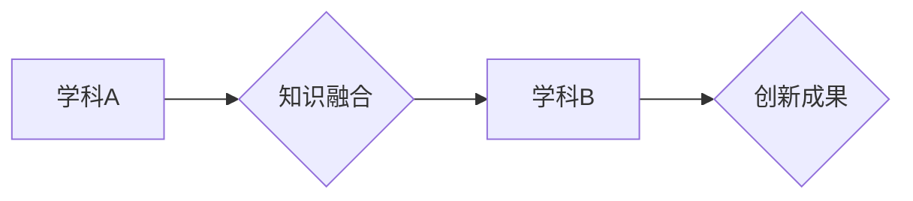

                 

## 知识的跨界融合：学科交叉的创新潜力

> 关键词：人工智能、跨学科融合、创新驱动、算法设计、机器学习、深度学习、数据科学

### 1. 背景介绍

在当今科技飞速发展的时代，知识的跨界融合已成为推动创新和解决复杂问题的关键驱动力。传统学科界限日益模糊，不同领域的知识和方法相互渗透，催生出新的研究领域和应用场景。人工智能（AI）作为一门融合了计算机科学、数学、统计学、心理学等多学科的交叉学科，正是跨界融合的典范。

人工智能的发展离不开对不同领域知识的吸收和整合。例如，深度学习算法的兴起得益于数学领域的微分几何和概率论的进步，而自然语言处理则需要借鉴语言学、认知科学等领域的知识。跨学科融合不仅促进了人工智能技术的进步，也为其他领域带来了新的机遇和挑战。

### 2. 核心概念与联系

**2.1 跨学科融合的本质**

跨学科融合是指将不同学科的知识、方法和视角整合在一起，以解决跨学科问题，创造新的知识和价值。它打破了传统学科的壁垒，促进了学科间的相互借鉴和融合，从而推动了科学和技术的进步。

**2.2 跨学科融合在人工智能中的应用**

在人工智能领域，跨学科融合体现在以下几个方面：

* **算法设计：** 人工智能算法的设计需要借鉴数学、统计学、概率论等领域的知识，例如深度学习算法的提出和发展离不开微分几何和概率论的进步。
* **数据处理：** 人工智能算法的训练和应用需要大量的海量数据，而数据处理和分析需要借鉴计算机科学、数据科学等领域的知识。
* **应用场景：** 人工智能技术的应用场景广泛，涉及医疗、教育、金融、制造等多个领域，需要结合不同领域的专业知识和应用需求。

**2.3 跨学科融合的流程图**



### 3. 核心算法原理 & 具体操作步骤

**3.1 算法原理概述**

深度学习算法是一种基于人工神经网络的机器学习算法，它能够从海量数据中学习复杂的特征和模式。深度学习算法的核心原理是多层神经网络的叠加，每一层神经元都对输入数据进行非线性变换，从而学习数据的抽象特征。

**3.2 算法步骤详解**

深度学习算法的训练过程主要包括以下步骤：

1. **数据预处理：** 将原始数据进行清洗、转换和格式化，使其适合深度学习算法的训练。
2. **网络结构设计：** 根据具体任务需求设计深度神经网络的结构，包括神经元的数量、连接方式和激活函数等。
3. **参数初始化：** 为神经网络中的参数进行随机初始化，这些参数决定了神经网络的学习能力。
4. **前向传播：** 将输入数据通过神经网络进行前向传播，计算输出结果。
5. **反向传播：** 计算输出结果与真实值的误差，并根据误差反向传播，调整神经网络的参数。
6. **优化算法：** 使用优化算法，例如梯度下降法，来更新神经网络的参数，使其能够更好地拟合数据。
7. **模型评估：** 使用测试数据评估模型的性能，并根据评估结果进行模型调优。

**3.3 算法优缺点**

**优点：**

* **学习能力强：** 深度学习算法能够从海量数据中学习复杂的特征和模式，具有强大的学习能力。
* **泛化能力强：** 深度学习算法训练后的模型能够对新的数据进行较好的泛化，具有较强的泛化能力。
* **应用场景广泛：** 深度学习算法能够应用于图像识别、自然语言处理、语音识别、机器翻译等多个领域。

**缺点：**

* **数据需求量大：** 深度学习算法需要大量的海量数据进行训练，否则难以达到良好的效果。
* **计算资源消耗大：** 深度学习算法的训练过程需要大量的计算资源，例如GPU，训练时间较长。
* **可解释性差：** 深度学习算法的内部工作机制较为复杂，难以解释其决策过程，导致可解释性差。

**3.4 算法应用领域**

深度学习算法已广泛应用于以下领域：

* **计算机视觉：** 图像识别、目标检测、图像分割、人脸识别等。
* **自然语言处理：** 文本分类、情感分析、机器翻译、对话系统等。
* **语音识别：** 语音转文本、语音助手等。
* **医疗诊断：** 疾病诊断、影像分析等。
* **金融预测：** 股票预测、风险评估等。

### 4. 数学模型和公式 & 详细讲解 & 举例说明

**4.1 数学模型构建**

深度学习算法的核心是多层神经网络，每个神经元接收多个输入信号，并通过加权求和和激活函数进行处理，输出一个信号。

**4.2 公式推导过程**

* **加权求和：**

$$z = \sum_{i=1}^{n} w_i x_i + b$$

其中：

* $z$ 是神经元的输出
* $w_i$ 是第 $i$ 个输入信号对应的权重
* $x_i$ 是第 $i$ 个输入信号
* $b$ 是偏置项

* **激活函数：**

$$a = f(z)$$

其中：

* $a$ 是神经元的激活输出
* $f(z)$ 是激活函数

**4.3 案例分析与讲解**

假设我们有一个简单的感知器，它接收两个输入信号 $x_1$ 和 $x_2$，并使用 sigmoid 函数作为激活函数。

* **加权求和：**

$$z = w_1 x_1 + w_2 x_2 + b$$

* **激活函数：**

$$a = \frac{1}{1 + e^{-z}}$$

通过调整权重 $w_1$、$w_2$ 和偏置项 $b$，感知器可以学习不同的分类边界，从而实现对输入数据的分类。

### 5. 项目实践：代码实例和详细解释说明

**5.1 开发环境搭建**

* Python 3.x
* TensorFlow 或 PyTorch 深度学习框架
* Jupyter Notebook 或 VS Code 代码编辑器

**5.2 源代码详细实现**

```python
import tensorflow as tf

# 定义模型结构
model = tf.keras.models.Sequential([
  tf.keras.layers.Dense(128, activation='relu', input_shape=(784,)),
  tf.keras.layers.Dense(10, activation='softmax')
])

# 编译模型
model.compile(optimizer='adam',
              loss='sparse_categorical_crossentropy',
              metrics=['accuracy'])

# 加载 MNIST 数据集
(x_train, y_train), (x_test, y_test) = tf.keras.datasets.mnist.load_data()

# 数据预处理
x_train = x_train.reshape(60000, 784).astype('float32') / 255
x_test = x_test.reshape(10000, 784).astype('float32') / 255

# 模型训练
model.fit(x_train, y_train, epochs=5)

# 模型评估
loss, accuracy = model.evaluate(x_test, y_test)
print('Test loss:', loss)
print('Test accuracy:', accuracy)
```

**5.3 代码解读与分析**

这段代码实现了使用 TensorFlow 框架训练一个简单的深度学习模型，用于识别手写数字。

* **模型结构：** 模型由两层全连接神经网络组成，第一层有 128 个神经元，使用 ReLU 激活函数，第二层有 10 个神经元，使用 softmax 激活函数，用于输出 10 个数字的概率分布。
* **模型编译：** 使用 Adam 优化器、稀疏类别交叉熵损失函数和准确率作为评估指标。
* **数据加载和预处理：** 加载 MNIST 数据集，并将数据reshape成适合模型输入的格式，并进行归一化处理。
* **模型训练：** 使用训练数据训练模型 5 个 epochs。
* **模型评估：** 使用测试数据评估模型的性能，打印测试损失和准确率。

**5.4 运行结果展示**

运行这段代码后，会输出模型在测试集上的损失和准确率。通常情况下，经过训练的模型能够达到较高的准确率，例如 98% 以上。

### 6. 实际应用场景

**6.1 医疗诊断**

深度学习算法可以用于分析医学影像，例如 X 光片、CT 扫描和 MRI 图像，辅助医生诊断疾病。例如，深度学习算法可以用于识别肺结核、乳腺癌和脑肿瘤等疾病。

**6.2 自然语言处理**

深度学习算法可以用于处理自然语言文本，例如机器翻译、文本摘要、情感分析和对话系统。例如，Google Translate 使用深度学习算法进行机器翻译，而 Siri 和 Alexa 使用深度学习算法进行语音识别和对话理解。

**6.3 金融预测**

深度学习算法可以用于分析金融数据，例如股票价格、汇率和债券收益率，进行金融预测。例如，深度学习算法可以用于预测股票价格走势、评估投资风险和识别欺诈交易。

**6.4 未来应用展望**

随着人工智能技术的不断发展，深度学习算法将在更多领域得到应用，例如自动驾驶、机器人、个性化推荐和科学研究等。

### 7. 工具和资源推荐

**7.1 学习资源推荐**

* **书籍：**
    * 深度学习 (Deep Learning) - Ian Goodfellow, Yoshua Bengio, Aaron Courville
    * 构建深度学习模型 (Hands-On Machine Learning with Scikit-Learn, Keras & TensorFlow) - Aurélien Géron
* **在线课程：**
    * TensorFlow 官方教程：https://www.tensorflow.org/tutorials
    * Coursera 深度学习课程：https://www.coursera.org/specializations/deep-learning

**7.2 开发工具推荐**

* **TensorFlow：** https://www.tensorflow.org/
* **PyTorch：** https://pytorch.org/
* **Keras：** https://keras.io/

**7.3 相关论文推荐**

* **AlexNet：** http://papers.nips.cc/paper/4824-imagenet-classification-with-deep-convolutional-neural-networks.pdf
* **VGGNet：** http://arxiv.org/abs/1409.1556
* **ResNet：** http://arxiv.org/abs/1512.03385

### 8. 总结：未来发展趋势与挑战

**8.1 研究成果总结**

跨学科融合推动了人工智能的快速发展，深度学习算法取得了显著的成果，在多个领域取得了突破性的进展。

**8.2 未来发展趋势**

* **模型规模和复杂度提升：** 未来深度学习模型将更加庞大，包含更多层级和参数，从而学习更复杂的特征和模式。
* **算法效率和可解释性提升：** 研究者将致力于开发更加高效的深度学习算法，并提高模型的可解释性，使其决策过程更加透明。
* **跨模态学习：** 深度学习算法将能够处理多种模态数据，例如文本、图像、音频和视频，从而实现更全面的理解和分析。

**8.3 面临的挑战**

* **数据获取和隐私保护：** 深度学习算法需要大量的海量数据进行训练，如何获取高质量数据并保护用户隐私是一个重要的挑战。
* **计算资源需求：** 训练大型深度学习模型需要大量的计算资源，如何降低计算成本和提高训练效率是一个关键问题。
* **伦理和社会影响：** 深度学习算法的应用可能带来伦理和社会问题，例如算法偏见、就业替代和信息安全，需要认真思考和解决。

**8.4 研究展望**

未来，跨学科融合将继续推动人工智能的发展，深度学习算法将应用于更多领域，为人类社会带来更多福祉。


### 9. 附录：常见问题与解答

**9.1 什么是深度学习？**

深度学习是一种机器学习算法，它使用多层神经网络来学习数据的抽象特征和模式。

**9.2 深度学习算法有哪些？**

常见的深度学习算法包括卷积神经网络 (CNN)、循环神经网络 (RNN) 和生成对抗网络 (GAN)。

**9.3 如何训练深度学习模型？**

训练深度学习模型需要使用训练数据，并使用优化算法调整模型参数，使其能够更好地拟合数据。

**9.4 深度学习算法有哪些应用场景？**

深度学习算法已广泛应用于计算机视觉、自然语言处理、语音识别、医疗诊断、金融预测等多个领域。


作者：禅与计算机程序设计艺术 / Zen and the Art of Computer Programming 
<end_of_turn>

