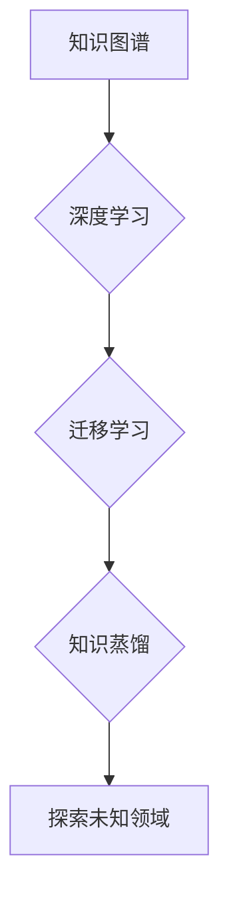

                 

## 知识的边界：探索未知领域的方法论

> 关键词：人工智能、知识边界、探索方法论、算法设计、数学建模、项目实践、应用场景、未来趋势

## 1. 背景介绍

在瞬息万变的科技时代，人类知识的边界不断被拓展。人工智能（AI）作为科技发展前沿，正以惊人的速度推动着人类对未知领域的探索。然而，在探索未知领域时，我们常常会遇到各种挑战，例如数据稀缺、模型复杂、算法效率等。如何有效地突破知识边界，探索未知领域，成为了一个亟待解决的问题。

本文将探讨探索未知领域的方法论，从核心概念、算法原理、数学建模、项目实践等多个方面进行深入分析，并结合实际应用场景，为读者提供一个全面的认知框架。

## 2. 核心概念与联系

探索未知领域的核心在于“知识的边界”。知识边界是指人类目前已知的知识范围，以及超出此范围的未知领域。突破知识边界，需要我们不断地学习、探索和创新。

**2.1 知识图谱**

知识图谱是一种用于表示和组织知识的结构化数据模型。它将知识表示为实体和关系，并通过图结构连接起来，可以帮助我们更好地理解和组织知识，并发现新的知识关联。

**2.2 深度学习**

深度学习是一种机器学习方法，它利用多层神经网络来模拟人类大脑的学习过程。深度学习算法能够从海量数据中自动学习特征，并进行复杂的模式识别和预测。

**2.3 迁移学习**

迁移学习是一种机器学习方法，它利用已学习到的知识来解决新的任务。迁移学习可以有效地减少训练数据和训练时间，并提高模型的泛化能力。

**2.4 知识蒸馏**

知识蒸馏是一种机器学习方法，它将知识从一个大型模型（教师模型）转移到一个小型模型（学生模型）中。知识蒸馏可以有效地压缩模型大小，并提高模型的效率。

**Mermaid 流程图:**



## 3. 核心算法原理 & 具体操作步骤

### 3.1 算法原理概述

探索未知领域的核心算法通常基于深度学习和迁移学习的原理。

* **深度学习:** 通过多层神经网络，从海量数据中自动学习特征，并进行复杂的模式识别和预测。
* **迁移学习:** 利用已学习到的知识来解决新的任务，减少训练数据和训练时间，提高模型的泛化能力。

### 3.2 算法步骤详解

1. **数据收集和预处理:** 收集相关领域的数据，并进行清洗、格式化和特征提取等预处理工作。
2. **模型选择和训练:** 选择合适的深度学习模型，并根据预处理后的数据进行训练。
3. **迁移学习:** 将预训练好的模型作为教师模型，将知识迁移到新的任务模型中。
4. **模型评估和优化:** 对训练后的模型进行评估，并根据评估结果进行模型优化。
5. **知识蒸馏:** 将教师模型的知识蒸馏到更小的学生模型中，提高模型的效率。

### 3.3 算法优缺点

**优点:**

* 能够从海量数据中自动学习特征，发现隐藏的模式。
* 迁移学习可以有效地减少训练数据和训练时间。
* 知识蒸馏可以压缩模型大小，提高模型的效率。

**缺点:**

* 需要大量的训练数据。
* 模型训练过程复杂，需要专业的技术人员。
* 模型的解释性和可解释性较差。

### 3.4 算法应用领域

* **自然语言处理:** 文本分类、情感分析、机器翻译等。
* **计算机视觉:** 图像识别、目标检测、图像分割等。
* **语音识别:** 语音转文本、语音合成等。
* **医疗诊断:** 病症诊断、疾病预测等。

## 4. 数学模型和公式 & 详细讲解 & 举例说明

### 4.1 数学模型构建

探索未知领域的方法论可以抽象为一个数学模型，其中包括以下几个关键要素：

* **知识图谱:** 用图论模型表示知识，其中节点代表实体，边代表关系。
* **深度学习模型:** 用神经网络模型表示学习过程，其中权重代表知识，激活函数代表知识的表达方式。
* **迁移学习模型:** 用知识转移机制表示知识迁移过程，其中教师模型提供知识，学生模型接收和学习知识。

### 4.2 公式推导过程

迁移学习的知识转移过程可以用以下公式表示：

$$
\theta_{student} = \arg \min_{\theta_{student}} L(f_{\theta_{student}}(x), y) + \lambda D(f_{\theta_{student}}(x), f_{\theta_{teacher}}(x))
$$

其中：

* $\theta_{student}$: 学生模型的参数
* $\theta_{teacher}$: 教师模型的参数
* $L$: 损失函数
* $f_{\theta_{student}}(x)$: 学生模型的输出
* $f_{\theta_{teacher}}(x)$: 教师模型的输出
* $D$: 距离度量函数
* $\lambda$: 权重参数

### 4.3 案例分析与讲解

例如，在自然语言处理领域，我们可以利用迁移学习来解决文本分类任务。我们可以先训练一个大型语言模型（教师模型）在大量的文本数据上，然后将这个模型的知识迁移到一个小型文本分类模型（学生模型）中。这样，我们可以减少学生模型的训练数据和训练时间，并提高模型的分类性能。

## 5. 项目实践：代码实例和详细解释说明

### 5.1 开发环境搭建

* 操作系统: Ubuntu 20.04
* Python 版本: 3.8
* 深度学习框架: TensorFlow 2.x

### 5.2 源代码详细实现

```python
# 导入必要的库
import tensorflow as tf

# 定义学生模型
class StudentModel(tf.keras.Model):
    def __init__(self):
        super(StudentModel, self).__init__()
        self.dense1 = tf.keras.layers.Dense(128, activation='relu')
        self.dense2 = tf.keras.layers.Dense(64, activation='relu')
        self.output = tf.keras.layers.Dense(10, activation='softmax')

    def call(self, inputs):
        x = self.dense1(inputs)
        x = self.dense2(x)
        return self.output(x)

# 定义教师模型
teacher_model = tf.keras.models.load_model('teacher_model.h5')

# 创建学生模型
student_model = StudentModel()

# 定义损失函数和优化器
loss_fn = tf.keras.losses.CategoricalCrossentropy()
optimizer = tf.keras.optimizers.Adam(learning_rate=0.001)

# 训练学生模型
for epoch in range(10):
    for batch in dataset:
        with tf.GradientTape() as tape:
            predictions = student_model(batch['inputs'])
            loss = loss_fn(batch['labels'], predictions)
        gradients = tape.gradient(loss, student_model.trainable_variables)
        optimizer.apply_gradients(zip(gradients, student_model.trainable_variables))

# 保存学生模型
student_model.save('student_model.h5')
```

### 5.3 代码解读与分析

* 代码首先导入必要的库，并定义了学生模型和教师模型。
* 学生模型是一个简单的多层感知机，教师模型是一个预训练好的大型语言模型。
* 然后，代码定义了损失函数和优化器，并开始训练学生模型。
* 训练过程中，学生模型的输出与教师模型的输出进行比较，并根据损失函数的计算结果更新模型参数。
* 最后，训练完成后，代码将学生模型保存为一个文件。

### 5.4 运行结果展示

训练完成后，我们可以使用学生模型对新的文本数据进行分类，并评估模型的性能。

## 6. 实际应用场景

探索未知领域的方法论在各个领域都有着广泛的应用场景，例如：

* **药物研发:** 利用深度学习和迁移学习，从大量的生物数据中发现新的药物靶点和候选药物。
* **材料科学:** 利用知识图谱和深度学习，探索新的材料组合和结构，设计具有特定性能的材料。
* **金融预测:** 利用迁移学习和知识蒸馏，将金融领域的专家知识融入到模型中，提高金融预测的准确性。

### 6.4 未来应用展望

随着人工智能技术的不断发展，探索未知领域的方法论将发挥越来越重要的作用。未来，我们可能会看到以下趋势：

* **更强大的深度学习模型:** 更大的模型规模、更复杂的模型架构、更强大的计算能力，将使深度学习模型能够更好地学习和理解复杂的数据。
* **更有效的迁移学习方法:** 新的迁移学习方法将能够更有效地将知识从一个领域转移到另一个领域，减少训练数据和训练时间。
* **更智能的知识图谱:** 更智能的知识图谱将能够更好地组织和表示知识，并发现更深层次的知识关联。

## 7. 工具和资源推荐

### 7.1 学习资源推荐

* **书籍:**
    * 深度学习
    * 人工智能：一种现代方法
    * 迁移学习
* **在线课程:**
    * Coursera: 深度学习
    * Udacity: 迁移学习
    * fast.ai: 深度学习课程

### 7.2 开发工具推荐

* **深度学习框架:** TensorFlow, PyTorch, Keras
* **数据处理工具:** Pandas, NumPy
* **可视化工具:** Matplotlib, Seaborn

### 7.3 相关论文推荐

* **迁移学习:**
    * "Domain Adaptation for Large-Scale Image Recognition"
    * "Transfer Learning for Natural Language Processing"
* **知识蒸馏:**
    * "Distilling the Knowledge in a Neural Network"
    * "Knowledge Distillation: A Survey"

## 8. 总结：未来发展趋势与挑战

### 8.1 研究成果总结

探索未知领域的方法论取得了显著的成果，在各个领域都有着广泛的应用。深度学习和迁移学习成为探索未知领域的关键技术，知识图谱为知识组织和表示提供了新的思路。

### 8.2 未来发展趋势

未来，探索未知领域的方法论将朝着以下方向发展：

* **更强大的模型:** 更大的模型规模、更复杂的模型架构、更强大的计算能力，将使深度学习模型能够更好地学习和理解复杂的数据。
* **更有效的迁移学习方法:** 新的迁移学习方法将能够更有效地将知识从一个领域转移到另一个领域，减少训练数据和训练时间。
* **更智能的知识图谱:** 更智能的知识图谱将能够更好地组织和表示知识，并发现更深层次的知识关联。

### 8.3 面临的挑战

探索未知领域仍然面临着一些挑战：

* **数据稀缺:** 许多未知领域的数据非常稀缺，这使得模型训练变得困难。
* **模型解释性:** 深度学习模型的解释性较差，这使得我们难以理解模型的决策过程。
* **伦理问题:** 探索未知领域可能会带来一些伦理问题，例如算法偏见、数据隐私等。

### 8.4 研究展望

未来，我们需要继续探索新的方法和技术，以克服这些挑战，并推动探索未知领域的进步。

## 9. 附录：常见问题与解答

**Q1: 迁移学习和知识蒸馏有什么区别？**

**A1:** 迁移学习是指将已学习到的知识从一个任务转移到另一个任务，而知识蒸馏是指将知识从一个大型模型（教师模型）转移到一个小型模型（学生模型）。

**Q2: 如何评估探索未知领域的模型性能？**

**A2:** 评估模型性能的方法取决于具体的应用场景。常用的评估指标包括准确率、召回率、F1-score等。

**Q3: 如何解决数据稀缺的问题？**

**A3:** 可以采用数据增强、迁移学习等方法来解决数据稀缺的问题。

**作者：禅与计算机程序设计艺术 / Zen and the Art of Computer Programming**


<end_of_turn>

