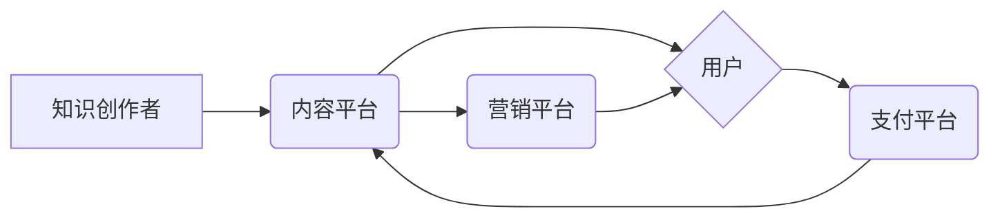

                 

## 知识经济时代下的知识付费创新商业模式运营

> 关键词：知识付费、商业模式、创新、在线教育、内容平台、用户体验、数据驱动、人工智能

### 1. 背景介绍

随着互联网技术的飞速发展和数字经济的蓬勃兴起，知识已成为最宝贵的资源，知识经济时代正式到来。在这个时代，知识的生产、传播和应用方式发生了根本性变化。传统知识的获取方式，如图书馆、课堂学习等，逐渐被在线学习、知识付费等新模式所取代。

知识付费是指以知识、技能、经验等为核心内容，通过付费的方式获取知识和服务。它涵盖了广泛的领域，包括在线课程、电子书、付费咨询、会员服务等。知识付费模式的兴起，为知识创作者提供了新的收入来源，也为用户提供了更加便捷、高效、个性化的学习方式。

然而，知识付费市场也面临着诸多挑战。例如，内容质量参差不齐、用户付费意愿不高、平台竞争激烈等。因此，如何创新商业模式，提升用户体验，打造可持续发展的知识付费生态系统，成为行业发展的重要课题。

### 2. 核心概念与联系

**2.1 知识付费的核心概念**

* **知识产权：** 知识付费的核心是知识产权的保护和利用。知识创作者需要拥有知识产权，才能将知识转化为商业价值。
* **付费模式：** 知识付费采用多种付费模式，例如订阅制、课程购买、会员制等。
* **用户体验：** 优质的用户体验是知识付费成功的关键。平台需要提供便捷、高效、个性化的学习体验，才能吸引和留住用户。

**2.2 知识付费的商业模式**

* **内容平台：** 例如 Coursera、Udemy、网易云课堂等，提供丰富的在线课程和学习资源，通过课程销售、会员订阅等模式获取收益。
* **知识创作者：** 例如专家学者、行业领袖、技能大师等，通过创作和分享知识，通过付费咨询、线上课程、电子书等方式获取收益。
* **知识服务平台：** 例如智联招聘、100人力资源等，提供职业技能培训、职业咨询等服务，通过服务收费获取收益。

**2.3 知识付费的生态系统**

知识付费是一个复杂的生态系统，涉及到知识创作者、内容平台、用户、支付平台、营销平台等多方参与。



### 3. 核心算法原理 & 具体操作步骤

**3.1 算法原理概述**

知识付费平台的运营需要依靠一系列算法来实现内容推荐、用户匹配、付费转化等功能。这些算法通常基于机器学习、数据挖掘等技术，通过分析用户行为数据、内容特征数据等，实现智能化运营。

**3.2 算法步骤详解**

1. **数据采集：** 收集用户行为数据、内容特征数据等。
2. **数据预处理：** 对数据进行清洗、转换、特征提取等处理。
3. **模型训练：** 使用机器学习算法，训练推荐模型、用户匹配模型等。
4. **模型评估：** 对模型进行评估，调整模型参数，提高模型精度。
5. **模型部署：** 将训练好的模型部署到线上环境，实现实时推荐和匹配。

**3.3 算法优缺点**

* **优点：** 能够实现个性化推荐、精准匹配，提高用户体验和付费转化率。
* **缺点：** 需要大量的数据支持，算法模型的训练和维护成本较高。

**3.4 算法应用领域**

* **内容推荐：** 根据用户的兴趣爱好、学习历史等，推荐相关的课程、文章、视频等内容。
* **用户匹配：** 根据用户的学习目标、技能水平等，匹配合适的知识创作者、课程、学习社区等。
* **付费转化：** 根据用户的学习行为、付费意愿等，进行精准的付费引导和转化。

### 4. 数学模型和公式 & 详细讲解 & 举例说明

**4.1 数学模型构建**

知识付费平台的运营可以构建一个数学模型来描述用户行为、内容传播、付费转化等过程。例如，可以使用用户行为数据构建一个用户活跃度模型，预测用户的学习时长、课程完成率等。

**4.2 公式推导过程**

用户活跃度模型可以采用以下公式：

$$
ActiveRate = \frac{TotalLearningTime}{TotalUserTime}
$$

其中：

* ActiveRate：用户活跃度
* TotalLearningTime：用户总学习时长
* TotalUserTime：用户总使用平台时间

**4.3 案例分析与讲解**

假设一个知识付费平台的用户总使用时间为100小时，总学习时长为50小时，则用户的活跃度为：

$$
ActiveRate = \frac{50}{100} = 0.5
$$

这意味着该用户在平台上平均每小时学习了50分钟。

### 5. 项目实践：代码实例和详细解释说明

**5.1 开发环境搭建**

知识付费平台的开发环境通常包括：

* **服务器：** 用于运行平台的应用程序和数据库。
* **数据库：** 用于存储用户数据、内容数据、交易数据等。
* **开发工具：** 例如 IDE、版本控制工具、测试工具等。

**5.2 源代码详细实现**

以下是一个简单的知识付费平台代码示例，使用 Python 语言实现用户注册功能：

```python
# 用户注册功能

def register_user(username, password):
    # 校验用户名和密码
    if not username or not password:
        return False
    # 将用户数据存储到数据库
    # ...
    return True

# 用户输入用户名和密码
username = input("请输入用户名：")
password = input("请输入密码：")

# 调用注册函数
if register_user(username, password):
    print("注册成功！")
else:
    print("注册失败！")
```

**5.3 代码解读与分析**

这段代码定义了一个 `register_user` 函数，用于处理用户注册功能。函数首先校验用户名和密码是否为空，然后将用户数据存储到数据库。

**5.4 运行结果展示**

当用户输入用户名和密码后，程序会调用 `register_user` 函数进行注册操作。如果注册成功，则会打印 "注册成功！" 的信息；否则，会打印 "注册失败！" 的信息。

### 6. 实际应用场景

**6.1 在线教育平台**

知识付费模式在在线教育平台的应用非常广泛，例如 Coursera、Udemy、网易云课堂等。这些平台提供各种类型的在线课程，用户可以通过付费的方式学习这些课程。

**6.2 知识创作者平台**

一些知识创作者平台，例如 知乎、豆瓣、博客园等，也开始采用知识付费模式。知识创作者可以通过创作高质量的内容，并设置付费门槛，获取收益。

**6.3 企业培训平台**

企业也可以利用知识付费模式，为员工提供培训课程、技能提升服务等。

**6.4 未来应用展望**

随着人工智能、虚拟现实等技术的不断发展，知识付费模式将更加智能化、个性化、沉浸式。例如，未来可能出现基于人工智能的个性化学习推荐系统、虚拟现实沉浸式学习体验等。

### 7. 工具和资源推荐

**7.1 学习资源推荐**

* **书籍：** 《知识经济》、《互联网思维》、《商业模式创新》等。
* **课程：** Coursera、Udemy 等平台上的知识付费课程。
* **网站：** 知乎、豆瓣、博客园等知识分享平台。

**7.2 开发工具推荐**

* **服务器：** AWS、Azure、阿里云等云服务平台。
* **数据库：** MySQL、MongoDB、PostgreSQL 等数据库系统。
* **开发框架：** Django、Flask、Spring Boot 等开发框架。

**7.3 相关论文推荐**

* **知识经济与知识付费：** 
* **在线教育平台的商业模式创新：** 
* **人工智能在知识付费领域的应用：** 

### 8. 总结：未来发展趋势与挑战

**8.1 研究成果总结**

知识付费模式在知识经济时代具有重要的意义，它为知识创作者提供了新的收入来源，也为用户提供了更加便捷、高效、个性化的学习方式。

**8.2 未来发展趋势**

* **智能化：** 利用人工智能技术，实现个性化推荐、智能匹配、自动生成内容等。
* **沉浸式体验：** 利用虚拟现实、增强现实等技术，打造更加沉浸式的学习体验。
* **多元化：** 知识付费模式将更加多元化，涵盖更多类型的知识和服务。

**8.3 面临的挑战**

* **内容质量：** 知识付费市场存在内容质量参差不齐的问题，需要加强内容审核和监管。
* **用户付费意愿：** 用户付费意愿不高，需要平台不断创新商业模式，提升用户体验。
* **平台竞争：** 知识付费平台竞争激烈，需要平台不断提升自身竞争力。

**8.4 研究展望**

未来，需要进一步研究知识付费模式的商业模式创新、用户体验优化、内容质量提升等方面，推动知识付费行业健康发展。

### 9. 附录：常见问题与解答

**9.1 如何选择合适的知识付费平台？**

选择知识付费平台时，需要考虑平台的课程质量、用户评价、付费模式、服务体系等因素。

**9.2 如何提高知识付费的转化率？**

提高知识付费的转化率需要从以下几个方面入手：

* **内容质量：** 提供高质量、有价值的内容。
* **用户体验：** 提供便捷、高效、个性化的学习体验。
* **付费引导：** 进行精准的付费引导和转化。

**9.3 如何保护知识产权？**

知识创作者需要采取以下措施保护知识产权：

* **注册版权：** 将知识作品注册为版权。
* **使用版权声明：** 在知识作品中添加版权声明。
* **采取法律手段：** 对侵权行为采取法律手段打击。


作者：禅与计算机程序设计艺术 / Zen and the Art of Computer Programming 
<end_of_turn>

