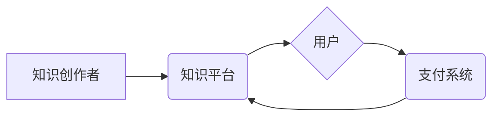

                 

## 知识经济时代下的知识付费创新商业生态构建

> 关键词：知识付费、商业生态、创新模式、数字平台、用户体验、知识产权、数据驱动

### 1. 背景介绍

进入21世纪，全球经济结构发生深刻变化，以知识为核心驱动的知识经济时代正式到来。知识成为生产要素中最重要的组成部分，知识的获取、传播和应用成为经济发展和社会进步的关键。知识付费作为知识经济发展的重要体现，以其独特的价值传递模式和商业模式，迅速成为新兴产业的重要力量。

传统商业模式以产品和服务为核心，而知识付费则以知识本身为核心，通过付费的方式，用户可以获取知识、技能和洞察力。知识付费的兴起，得益于以下几个因素：

* **互联网技术发展:** 互联网技术的快速发展，为知识的传播和分享提供了便捷的平台和工具。
* **知识经济需求:** 随着社会发展和经济转型，人们对知识的需求日益增长，渴望提升自身技能和竞争力。
* **消费升级:** 消费升级趋势下，人们更加注重精神文化和自我价值的提升，知识付费满足了这一需求。
* **内容创作者崛起:** 一批优秀的知识创作者涌现，他们拥有丰富的经验和专业知识，能够提供高质量的知识内容。

### 2. 核心概念与联系

**2.1 知识付费的核心概念**

知识付费是指以知识、技能、经验等为核心内容，通过付费的方式向用户提供价值，实现知识交易的商业模式。

**2.2 知识付费的商业生态**

知识付费的商业生态是一个多方参与、相互关联的系统，主要包括以下角色：

* **知识创作者:** 拥有专业知识和技能的人，例如专家学者、行业领袖、技能大师等。
* **知识平台:** 提供知识付费服务的平台，例如在线教育平台、知识库、付费内容订阅平台等。
* **用户:** 寻求知识和技能提升的用户，例如学生、职场人士、创业者等。
* **支付系统:** 提供支付服务的第三方平台，例如支付宝、微信支付等。

**2.3 知识付费商业生态的架构**



**2.4 知识付费商业生态的联系**

知识创作者通过平台发布知识内容，用户通过平台付费获取知识，平台从中获取收益，支付系统提供支付服务，实现知识交易的闭环。

### 3. 核心算法原理 & 具体操作步骤

**3.1 算法原理概述**

知识付费商业生态的构建需要依靠一系列算法来实现内容推荐、用户匹配、交易安全等功能。其中，推荐算法是核心算法之一，其目的是根据用户的兴趣和需求，推荐合适的知识内容。

常见的推荐算法包括：

* **协同过滤:** 基于用户行为数据，推荐与用户兴趣相似的其他用户或内容。
* **内容过滤:** 基于内容特征，推荐与用户兴趣相符的内容。
* **混合推荐:** 结合协同过滤和内容过滤算法，提高推荐效果。

**3.2 算法步骤详解**

以协同过滤算法为例，其具体步骤如下：

1. **数据收集:** 收集用户行为数据，例如用户浏览记录、购买记录、评分记录等。
2. **用户相似度计算:** 计算用户之间的相似度，例如使用余弦相似度或皮尔逊相关系数。
3. **物品相似度计算:** 计算知识内容之间的相似度，例如使用TF-IDF或Word2Vec。
4. **推荐结果生成:** 根据用户相似度和物品相似度，推荐与用户兴趣相似的知识内容。

**3.3 算法优缺点**

* **优点:** 能够推荐个性化内容，提高用户体验。
* **缺点:** 需要大量用户行为数据，容易出现冷启动问题。

**3.4 算法应用领域**

推荐算法广泛应用于电商、社交媒体、在线教育等领域，在知识付费商业生态中，推荐算法可以帮助平台推荐合适的知识内容给用户，提高用户粘性和转化率。

### 4. 数学模型和公式 & 详细讲解 & 举例说明

**4.1 数学模型构建**

协同过滤算法的数学模型可以表示为：

$$
r_{ui} = \sum_{j=1}^{N} s_{uj} \cdot r_{uj}
$$

其中：

* $r_{ui}$ 表示用户 $u$ 对物品 $i$ 的评分。
* $s_{uj}$ 表示用户 $u$ 和用户 $j$ 的相似度。
* $r_{uj}$ 表示用户 $j$ 对物品 $i$ 的评分。
* $N$ 表示与用户 $u$ 相似的用户数量。

**4.2 公式推导过程**

该公式基于以下假设：

* 用户对物品的评分与用户之间的相似度相关。
* 用户对物品的评分可以由其他用户对该物品的评分预测。

**4.3 案例分析与讲解**

假设有两个用户 $A$ 和 $B$，他们都对电影 $X$ 和 $Y$ 进行了评分。

* $A$ 对 $X$ 的评分为 5，对 $Y$ 的评分为 3。
* $B$ 对 $X$ 的评分为 4，对 $Y$ 的评分为 2。

如果 $A$ 和 $B$ 的相似度为 0.8，则可以使用上述公式预测 $A$ 对电影 $Z$ 的评分。

假设 $C$ 对 $Z$ 的评分为 4，则：

$$
r_{AZ} = 0.8 \cdot 4 = 3.2
$$

因此，根据 $B$ 的评分和与 $A$ 的相似度，可以预测 $A$ 对电影 $Z$ 的评分为 3.2。

### 5. 项目实践：代码实例和详细解释说明

**5.1 开发环境搭建**

* Python 3.x
* Pandas
* Scikit-learn

**5.2 源代码详细实现**

```python
import pandas as pd
from sklearn.metrics.pairwise import cosine_similarity

# 加载用户评分数据
ratings_data = pd.read_csv('ratings.csv')

# 计算用户相似度
user_similarity = cosine_similarity(ratings_data.T)

# 预测用户对物品的评分
def predict_rating(user_id, item_id):
    # 获取用户与其他用户的相似度
    user_similarity_scores = user_similarity[user_id]

    # 获取与用户相似度高的用户对该物品的评分
    similar_user_ratings = ratings_data.loc[ratings_data.index != user_id, item_id]

    # 计算预测评分
    predicted_rating = np.sum(user_similarity_scores * similar_user_ratings) / np.sum(user_similarity_scores)

    return predicted_rating

# 预测用户对物品的评分
user_id = 1
item_id = 5
predicted_rating = predict_rating(user_id, item_id)

print(f'用户 {user_id} 对物品 {item_id} 的预测评分为: {predicted_rating}')
```

**5.3 代码解读与分析**

该代码实现了一个简单的协同过滤推荐算法。

* 首先，加载用户评分数据。
* 然后，使用 cosine_similarity 函数计算用户之间的相似度。
* 最后，定义一个 predict_rating 函数，根据用户 ID 和物品 ID，预测用户对该物品的评分。

**5.4 运行结果展示**

运行该代码后，会输出用户对特定物品的预测评分。

### 6. 实际应用场景

知识付费商业生态的构建，可以应用于以下场景：

* **在线教育平台:** 提供在线课程、直播讲座、知识库等付费内容，满足用户学习需求。
* **技能培训平台:** 提供技能培训课程、在线辅导、职业认证等付费服务，帮助用户提升职业技能。
* **专业咨询平台:** 提供专业咨询服务、行业报告、专家解读等付费内容，满足用户专业知识需求。
* **个人品牌建设:** 知识创作者可以通过平台发布付费内容，建立个人品牌，获取收益。

### 7. 工具和资源推荐

**7.1 学习资源推荐**

* **书籍:** 《推荐系统实践》、《机器学习实战》
* **在线课程:** Coursera、edX、Udemy 等平台上的推荐系统和机器学习课程

**7.2 开发工具推荐**

* **Python:** 广泛应用于数据分析、机器学习和推荐系统开发。
* **Scikit-learn:** Python 机器学习库，提供各种推荐算法实现。
* **TensorFlow/PyTorch:** 深度学习框架，可以用于构建更复杂的推荐模型。

**7.3 相关论文推荐**

* **协同过滤算法:** "Collaborative Filtering: A User-Based Approach"
* **内容过滤算法:** "Content-Based Recommendation Systems"
* **混合推荐算法:** "Hybrid Recommender Systems: A Survey"

### 8. 总结：未来发展趋势与挑战

**8.1 研究成果总结**

知识付费商业生态的构建，已经取得了一定的成果，为知识传播和价值创造提供了新的模式。

**8.2 未来发展趋势**

* **个性化推荐:** 利用大数据和人工智能技术，提供更精准的个性化推荐。
* **内容多元化:** 除了文字和视频，还会更多地融入音频、直播、互动等多种内容形式。
* **知识链构建:** 打破知识孤岛，构建知识链，提供更完整的知识体系。
* **元宇宙融合:** 将知识付费与元宇宙结合，打造沉浸式学习体验。

**8.3 面临的挑战**

* **知识产权保护:** 如何有效保护知识创作者的知识产权，防止知识盗版和侵权。
* **用户信任问题:** 如何建立用户对平台和知识内容的信任，提高用户粘性和付费意愿。
* **数据安全问题:** 如何保障用户数据安全，防止数据泄露和滥用。

**8.4 研究展望**

未来，知识付费商业生态将继续发展和完善，需要不断探索新的模式和技术，以满足用户不断变化的需求，推动知识经济的持续发展。

### 9. 附录：常见问题与解答

* **Q1: 如何选择合适的知识付费平台？**

* **A1:** 选择平台时，可以考虑平台的口碑、内容质量、用户评价、收费标准等因素。

* **Q2: 如何保护知识产权？**

* **A2:** 知识创作者可以采取以下措施保护知识产权：
    * 申请知识产权专利或版权。
    * 使用数字水印技术标记知识内容。
    * 与平台合作，建立知识产权保护机制。

* **Q3: 如何提高知识付费的转化率？**

* **A3:** 提高知识付费转化率，可以采取以下措施：
    * 提供高质量、有价值的知识内容。
    * 进行精准的市场推广和用户定位。
    * 提供优惠活动和会员制度。
    * 提升用户体验，提供良好的售后服务。


作者：禅与计算机程序设计艺术 / Zen and the Art of Computer Programming 
<end_of_turn>

