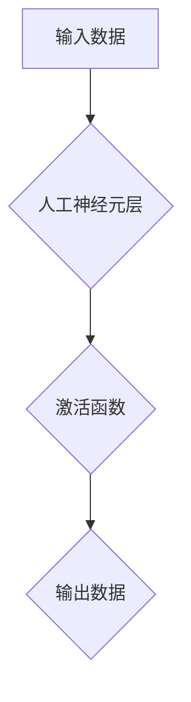

                 

## 神经形态计算：模仿人脑的新型计算架构

> 关键词：神经形态计算、人脑仿生、神经网络、可塑性、低功耗、边缘计算、人工智能

## 1. 背景介绍

随着人工智能技术的飞速发展，传统基于von Neumann架构的计算模型逐渐面临瓶颈。其主要问题在于数据处理和计算单元的物理分离，导致数据传输效率低下、功耗高昂。为了突破这些限制，神经形态计算应运而生。

神经形态计算是一种模仿人脑结构和功能的新型计算架构。它将计算和存储紧密结合，并通过突触和神经元的连接来进行信息处理，从而实现更接近人脑的学习和推理能力。

### 1.1 传统计算模型的局限性

传统计算模型，即von Neumann架构，将计算和存储分开，数据需要通过总线传输到计算单元进行处理。这种分离结构导致以下问题：

* **数据传输瓶颈:** 数据传输占据了大量时间和能量，限制了计算速度和效率。
* **功耗高:** 数据传输和计算都需要消耗大量能量，导致功耗高昂。
* **缺乏灵活性:** 传统计算模型难以适应复杂、动态的环境，学习能力有限。

### 1.2 神经形态计算的优势

神经形态计算通过模仿人脑的结构和功能，克服了传统计算模型的局限性，具有以下优势：

* **高效率:** 计算和存储紧密结合，减少数据传输，提高计算效率。
* **低功耗:** 由于减少了数据传输，功耗显著降低。
* **可塑性:** 神经网络可以通过学习和训练不断调整连接权重，适应复杂环境。
* **并行处理能力强:** 神经网络的结构天生支持并行处理，可以实现高速计算。

## 2. 核心概念与联系

### 2.1 人脑结构与功能

人脑由数十亿个神经元组成，每个神经元都与其他神经元通过突触连接。神经元通过接收和传递信号来进行信息处理。

* **神经元:** 人脑的基本信息处理单元，负责接收、处理和传递信号。
* **突触:** 神经元之间的连接，负责传递信号。
* **突触权重:** 突触连接的强度，决定了信号传递的幅度。

### 2.2 神经形态计算架构

神经形态计算架构模仿人脑的结构和功能，主要包括以下组件：

* **人工神经元:** 模拟人脑神经元的计算单元，负责接收、处理和传递信号。
* **突触:** 模拟人脑突触的连接，负责传递信号。
* **突触权重:** 模拟人脑突触权重的连接强度，决定了信号传递的幅度。
* **学习算法:** 用于调整突触权重，使神经网络能够学习和适应新信息。

### 2.3 神经形态计算流程图



## 3. 核心算法原理 & 具体操作步骤

### 3.1 算法原理概述

神经形态计算的核心算法是深度学习算法，其中包括卷积神经网络（CNN）、循环神经网络（RNN）等。这些算法通过多层人工神经元网络，学习数据之间的复杂关系，实现图像识别、自然语言处理等任务。

### 3.2 算法步骤详解

1. **数据预处理:** 将原始数据转换为神经网络可以理解的格式。
2. **网络结构设计:** 根据任务需求设计神经网络的层数、神经元数量等参数。
3. **权重初始化:** 为神经网络中的连接赋予初始权重。
4. **前向传播:** 将输入数据通过神经网络层层传递，最终得到输出结果。
5. **反向传播:** 计算输出结果与真实值的误差，并根据误差调整神经网络的权重。
6. **迭代训练:** 重复前向传播和反向传播过程，直到网络性能达到预期目标。

### 3.3 算法优缺点

**优点:**

* **高精度:** 深度学习算法能够学习数据之间的复杂关系，实现高精度预测。
* **自动化特征提取:** 不需要人工提取特征，算法可以自动学习特征。
* **可扩展性强:** 可以根据数据规模和任务需求调整网络结构。

**缺点:**

* **训练时间长:** 深度学习算法需要大量数据进行训练，训练时间较长。
* **计算资源需求高:** 训练深度学习模型需要大量的计算资源。
* **黑盒效应:** 深度学习模型的内部机制难以理解，缺乏可解释性。

### 3.4 算法应用领域

深度学习算法广泛应用于以下领域:

* **图像识别:** 人脸识别、物体检测、图像分类等。
* **自然语言处理:** 语音识别、机器翻译、文本生成等。
* **语音识别:** 语音转文本、语音助手等。
* **医疗诊断:** 疾病预测、图像分析等。
* **金融分析:** 风险评估、欺诈检测等。

## 4. 数学模型和公式 & 详细讲解 & 举例说明

### 4.1 数学模型构建

神经形态计算的数学模型主要基于线性代数和微积分。

* **激活函数:** 用于引入非线性，使神经网络能够学习复杂关系。常见的激活函数包括 sigmoid 函数、ReLU 函数等。
* **损失函数:** 用于衡量模型预测结果与真实值的误差。常见的损失函数包括均方误差、交叉熵等。
* **梯度下降算法:** 用于更新神经网络的权重，使模型性能不断提升。

### 4.2 公式推导过程

**激活函数:**

$$
f(x) = \frac{1}{1 + e^{-x}}
$$

**损失函数:**

$$
L = \frac{1}{n} \sum_{i=1}^{n} (y_i - \hat{y}_i)^2
$$

其中:

* $y_i$ 为真实值
* $\hat{y}_i$ 为模型预测值
* $n$ 为样本数量

**梯度下降算法:**

$$
\theta = \theta - \alpha \frac{\partial L}{\partial \theta}
$$

其中:

* $\theta$ 为权重
* $\alpha$ 为学习率
* $\frac{\partial L}{\partial \theta}$ 为损失函数对权重的梯度

### 4.3 案例分析与讲解

假设我们有一个简单的线性回归问题，目标是预测房价。

* 输入特征: 房屋面积
* 输出目标: 房价

我们可以使用一个单层神经网络来解决这个问题。

* 输入层: 一个神经元，接收房屋面积输入。
* 输出层: 一个神经元，输出预测的房价。

通过训练神经网络，我们可以学习到房屋面积与房价之间的关系，并使用该模型预测新的房屋价格。

## 5. 项目实践：代码实例和详细解释说明

### 5.1 开发环境搭建

* 操作系统: Ubuntu 20.04
* Python 版本: 3.8
* 深度学习框架: TensorFlow 2.0

### 5.2 源代码详细实现

```python
import tensorflow as tf

# 定义模型
model = tf.keras.models.Sequential([
    tf.keras.layers.Dense(units=1, input_shape=[1]),
])

# 编译模型
model.compile(optimizer='sgd', loss='mean_squared_error')

# 训练模型
model.fit(x_train, y_train, epochs=100)

# 预测房价
prediction = model.predict(x_new)
```

### 5.3 代码解读与分析

* `tf.keras.models.Sequential`: 创建一个顺序模型，神经网络层按顺序连接。
* `tf.keras.layers.Dense`: 定义一个全连接层，每个神经元都与上一层所有神经元连接。
* `optimizer='sgd'`: 使用随机梯度下降算法优化模型参数。
* `loss='mean_squared_error'`: 使用均方误差作为损失函数。
* `model.fit`: 训练模型，输入训练数据和训练轮数。
* `model.predict`: 使用训练好的模型预测新的数据。

### 5.4 运行结果展示

训练完成后，我们可以使用模型预测新的房屋价格。

## 6. 实际应用场景

### 6.1 图像识别

神经形态计算在图像识别领域具有巨大潜力。例如，可以用于人脸识别、物体检测、医疗图像分析等。

### 6.2 自然语言处理

神经形态计算也可以用于自然语言处理任务，例如语音识别、机器翻译、文本生成等。

### 6.3 语音识别

神经形态计算可以提高语音识别的准确性和实时性，应用于语音助手、自动语音转录等领域。

### 6.4 其他应用场景

* **机器人控制:** 神经形态计算可以使机器人更加灵活、智能地控制运动。
* **自驾汽车:** 神经形态计算可以帮助自驾汽车更好地感知周围环境，提高安全性。
* **金融风险评估:** 神经形态计算可以用于分析金融数据，识别潜在风险。

### 6.5 未来应用展望

随着神经形态计算技术的不断发展，其应用场景将更加广泛。例如，可以用于开发更加智能的个人助理、更加安全的医疗诊断系统、更加高效的交通管理系统等。

## 7. 工具和资源推荐

### 7.1 学习资源推荐

* **书籍:**
    * 《神经形态计算》
    * 《深度学习》
* **在线课程:**
    * Coursera: 深度学习
    * edX: 人工智能
* **网站:**
    * TensorFlow: https://www.tensorflow.org/
    * PyTorch: https://pytorch.org/

### 7.2 开发工具推荐

* **TensorFlow:** 一个开源的深度学习框架。
* **PyTorch:** 另一个开源的深度学习框架。
* **Neuromorphic Computing Platform:** 一些专门用于神经形态计算的硬件平台。

### 7.3 相关论文推荐

* **《A Survey of Neuromorphic Computing》**
* **《Deep Learning》**
* **《ImageNet Classification with Deep Convolutional Neural Networks》**

## 8. 总结：未来发展趋势与挑战

### 8.1 研究成果总结

神经形态计算是一个新兴的领域，近年来取得了显著进展。例如，出现了许多新的神经形态计算架构和算法，并取得了在图像识别、自然语言处理等领域的突破。

### 8.2 未来发展趋势

* **硬件加速:** 开发更加高效、低功耗的神经形态计算硬件。
* **算法创新:** 研究更加高效、鲁棒的神经形态计算算法。
* **应用拓展:** 将神经形态计算应用于更多领域，例如机器人控制、自驾汽车、医疗诊断等。

### 8.3 面临的挑战

* **模型可解释性:** 神经形态计算模型的内部机制难以理解，缺乏可解释性。
* **数据效率:** 神经形态计算模型需要大量的训练数据，数据获取和标注成本高昂。
* **硬件成本:** 神经形态计算硬件成本较高，难以普及。

### 8.4 研究展望

未来，神经形态计算将继续朝着更加高效、智能、可解释的方向发展。随着硬件技术的进步和算法的创新，神经形态计算将成为人工智能领域的重要组成部分，并推动人工智能技术向更广泛的应用领域扩展。

## 9. 附录：常见问题与解答

### 9.1 什么是神经形态计算？

神经形态计算是一种模仿人脑结构和功能的新型计算架构。它将计算和存储紧密结合，并通过突触和神经元的连接来进行信息处理。

### 9.2 神经形态计算有哪些优势？

神经形态计算具有以下优势:

* **高效率:** 计算和存储紧密结合，减少数据传输，提高计算效率。
* **低功耗:** 由于减少了数据传输，功耗显著降低。
* **可塑性:** 神经网络可以通过学习和训练不断调整连接权重，适应复杂环境。
* **并行处理能力强:** 神经网络的结构天生支持并行处理，可以实现高速计算。

### 9.3 神经形态计算有哪些应用场景？

神经形态计算广泛应用于以下领域:

* **图像识别:** 人脸识别、物体检测、图像分类等。
* **自然语言处理:** 语音识别、机器翻译、文本生成等。
* **语音识别:** 语音转文本、语音助手等。
* **医疗诊断:** 疾病预测、图像分析等。
* **金融分析:** 风险评估、欺诈检测等。

### 9.4 神经形态计算的未来发展趋势是什么？

未来，神经形态计算将朝着更加高效、智能、可解释的方向发展。随着硬件技术的进步和算法的创新，神经形态计算将成为人工智能领域的重要组成部分，并推动人工智能技术向更广泛的应用领域扩展。

作者：禅与计算机程序设计艺术 / Zen and the Art of Computer Programming


<end_of_turn>

