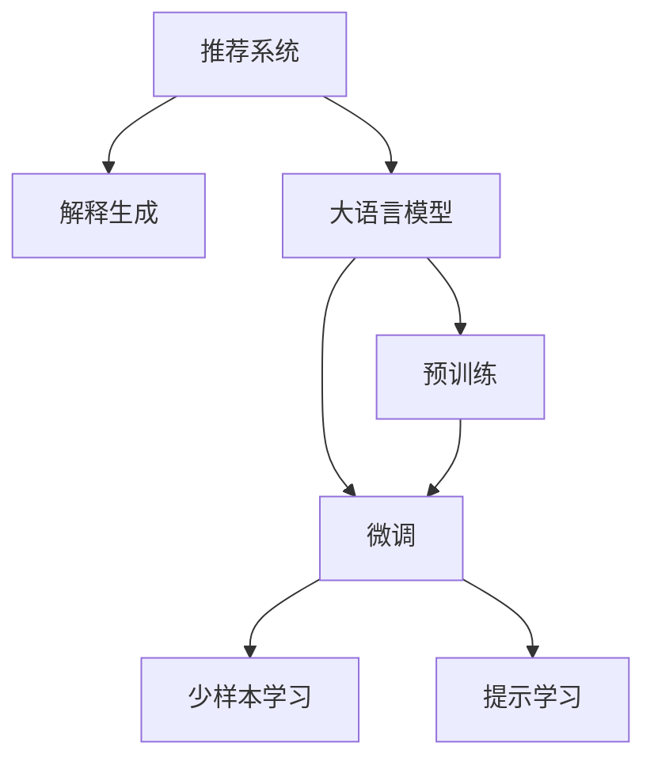

                 

# 大模型驱动的个性化推荐解释生成

> 关键词：大语言模型,推荐系统,解释生成,自然语言处理,NLP,深度学习

## 1. 背景介绍

### 1.1 问题由来
随着信息时代的到来，个性化推荐系统成为了互联网平台和在线服务不可或缺的组件。其核心目标是基于用户的历史行为、兴趣偏好等数据，自动为用户推荐个性化的内容，从而提升用户体验，增加平台粘性。然而，传统推荐系统往往基于简单的协同过滤、矩阵分解等模型，无法精确捕捉用户的多维特征，也无法直观地解释推荐内容的合理性。

近年来，大语言模型在自然语言处理(NLP)领域取得了显著进展，特别是基于预训练的语言模型如BERT、GPT等，能够自动学习语言的复杂结构和语义表示。这些模型在各种NLP任务上表现优异，展现出卓越的自然语言理解和生成能力。因此，将大语言模型应用于推荐系统解释生成，成为了近年来NLP技术的一个重要研究方向。

### 1.2 问题核心关键点
推荐系统的核心目标是通过精准的用户画像，预测用户可能感兴趣的物品，从而实现个性化推荐。然而，传统推荐系统往往难以提供推荐结果的解释，导致用户对推荐内容的信任度降低。

为此，推荐系统解释生成技术应运而生。其核心思想是：利用自然语言处理技术，对推荐结果进行解释，向用户说明为什么该物品会被推荐，从而提升用户的理解和信任。

大语言模型驱动的推荐解释生成方法，通过在大规模无标签文本数据上进行预训练，获得丰富的语言知识，再通过微调的方式，对推荐结果进行解释生成。该方法具有以下优点：
1. 能够自动学习语言的复杂结构和语义表示，生成自然流畅、语法正确的解释文本。
2. 可以处理多种类型的推荐数据，包括商品、新闻、音乐、视频等。
3. 支持少样本学习，即使标注数据较少，仍能生成有效的推荐解释。
4. 可以实时生成解释，快速响应用户需求。

### 1.3 问题研究意义
大模型驱动的推荐解释生成技术，对于提升推荐系统的用户体验、增加用户信任度、优化推荐效果，具有重要意义：

1. 提升用户满意度。解释推荐内容能帮助用户更好地理解推荐理由，提高对推荐结果的信任度。
2. 增加平台粘性。解释生成的个性化推荐，更有可能满足用户的实际需求，从而增加用户在平台上的停留时间和使用频率。
3. 优化推荐策略。基于用户对推荐解释的反馈，可以不断调整推荐策略，提升推荐效果。
4. 加速技术落地。解释生成的推荐系统，更易于被行业用户理解和接受，有助于快速推广应用。
5. 促进技术创新。解释生成技术融合了NLP和推荐系统等多个领域的知识，推动了多领域研究的交叉融合。

## 2. 核心概念与联系

### 2.1 核心概念概述

为更好地理解大模型驱动的推荐解释生成方法，本节将介绍几个密切相关的核心概念：

- 推荐系统(Recommendation System)：旨在自动推荐个性化物品，提高用户体验的智能系统。常见推荐算法包括协同过滤、矩阵分解、深度学习等。

- 解释生成(Explanation Generation)：指通过自然语言处理技术，对推荐结果进行解释，向用户说明为什么该物品会被推荐，从而提升用户的理解和信任。

- 大语言模型(Large Language Model, LLM)：以自回归(如GPT)或自编码(如BERT)模型为代表的大规模预训练语言模型。通过在大规模无标签文本语料上进行预训练，学习通用的语言知识和表示。

- 预训练(Pre-training)：指在大规模无标签文本语料上，通过自监督学习任务训练通用语言模型的过程。常见的预训练任务包括言语建模、遮挡语言模型等。

- 微调(Fine-tuning)：指在预训练模型的基础上，使用下游任务的少量标注数据，通过有监督学习优化模型在特定任务上的性能。

- 少样本学习(Few-shot Learning)：指在只有少量标注样本的情况下，模型能够快速适应新任务的学习方法。在大语言模型中，通常通过在输入中提供少量示例来实现。

- 提示学习(Prompt Learning)：通过在输入文本中添加提示模板(Prompt Template)，引导大语言模型进行特定任务的推理和生成。可以在不更新模型参数的情况下，实现零样本或少样本学习。

这些核心概念之间的逻辑关系可以通过以下Mermaid流程图来展示：



这个流程图展示了大模型驱动的推荐解释生成的核心概念及其之间的关系：

1. 推荐系统通过预训练语言模型进行推荐。
2. 预训练语言模型在大规模无标签文本数据上进行训练。
3. 微调过程根据推荐系统的需求，对预训练模型进行优化。
4. 微调后的模型用于生成推荐解释，解释生成过程可以采用少样本学习或提示学习等方式。

## 3. 核心算法原理 & 具体操作步骤
### 3.1 算法原理概述

大模型驱动的推荐解释生成方法，基于大语言模型的预训练-微调范式。其核心思想是：将预训练语言模型作为推荐系统的基础，通过微调过程，对推荐结果进行自然语言解释生成。

具体步骤如下：
1. 收集推荐系统中的用户行为数据，包括点击、购买、评分等，作为标注数据。
2. 将推荐数据转化为文本形式，如商品标题、描述、评分等。
3. 在大规模无标签文本数据上进行预训练，获得丰富的语言知识。
4. 使用推荐数据的文本表示作为输入，在预训练模型的基础上，对模型进行微调。
5. 微调后的模型将生成推荐解释，向用户说明为什么该物品会被推荐。

形式化地，假设预训练语言模型为 $M_{\theta}$，其中 $\theta$ 为预训练得到的模型参数。推荐系统中的用户行为数据为 $D=\{(x_i,y_i)\}_{i=1}^N$，其中 $x_i$ 为商品描述，$y_i$ 为推荐标签（0或1）。微调的目标是找到新的模型参数 $\hat{\theta}$，使得模型能够生成最佳的推荐解释，即：

$$
\hat{\theta}=\mathop{\arg\min}_{\theta} \mathcal{L}(M_{\theta},D)
$$

其中 $\mathcal{L}$ 为针对解释生成的损失函数，用于衡量模型生成的解释与实际标签之间的差异。常见的损失函数包括交叉熵损失、BLEU分数、ROUGE分数等。

通过梯度下降等优化算法，微调过程不断更新模型参数 $\theta$，最小化损失函数 $\mathcal{L}$，使得模型生成的解释逼近真实标签。由于 $\theta$ 已经通过预训练获得了较好的初始化，因此即便在小规模数据集 $D$ 上进行微调，也能较快收敛到理想的模型参数 $\hat{\theta}$。

### 3.2 算法步骤详解

基于大模型驱动的推荐解释生成方法，其具体步骤包括以下几个关键步骤：

**Step 1: 准备推荐数据**
- 收集推荐系统中的用户行为数据，如点击、购买、评分等。
- 将用户行为数据转化为文本形式，如商品标题、描述、评分等。

**Step 2: 预训练大语言模型**
- 在大规模无标签文本数据上进行预训练，如维基百科、新闻、书籍等。
- 使用自监督学习任务，如语言建模、掩码语言建模等，学习语言的通用表示。

**Step 3: 微调生成模型**
- 使用推荐数据的文本表示作为输入，对预训练模型进行微调。
- 设置微调超参数，如学习率、批大小、迭代轮数等。
- 应用正则化技术，如L2正则、Dropout、Early Stopping等，防止模型过拟合。
- 使用对抗训练技术，提高模型鲁棒性。

**Step 4: 生成推荐解释**
- 使用微调后的模型，对推荐结果进行解释生成。
- 支持少样本学习，通过在输入中提供少量示例，实现少样本学习。
- 支持提示学习，通过在输入文本中添加提示模板，引导模型生成解释。

**Step 5: 评估和优化**
- 在测试集上评估推荐解释的质量，通过BLEU分数、ROUGE分数等指标评估。
- 根据测试结果，调整微调超参数，优化生成模型。

### 3.3 算法优缺点

基于大模型驱动的推荐解释生成方法，具有以下优点：
1. 生成自然流畅、语法正确的解释文本，增强用户对推荐内容的理解和信任。
2. 支持多种类型的推荐数据，包括商品、新闻、音乐、视频等。
3. 支持少样本学习，即使标注数据较少，仍能生成有效的推荐解释。
4. 可以实时生成解释，快速响应用户需求。

同时，该方法也存在一定的局限性：
1. 依赖标注数据。生成解释的效果很大程度上取决于标注数据的质量和数量，获取高质量标注数据的成本较高。
2. 需要较长的微调过程。由于微调过程中涉及大量的计算资源，微调过程可能较为耗时。
3. 模型鲁棒性有限。当目标任务与预训练数据的分布差异较大时，微调的性能提升有限。
4. 可解释性不足。生成模型的决策过程通常缺乏可解释性，难以对其推理逻辑进行分析和调试。

尽管存在这些局限性，但就目前而言，大模型驱动的推荐解释生成方法仍然是最主流的方法之一。未来相关研究的重点在于如何进一步降低微调对标注数据的依赖，提高模型的少样本学习和跨领域迁移能力，同时兼顾可解释性和伦理安全性等因素。

### 3.4 算法应用领域

大模型驱动的推荐解释生成方法，在NLP领域已经得到了广泛的应用，覆盖了多个推荐系统领域，例如：

- 商品推荐：为电商平台的商品推荐系统生成推荐解释，提升用户体验。
- 新闻推荐：为新闻平台的个性化推荐生成新闻标题和摘要，增强用户对推荐的理解。
- 音乐推荐：为音乐平台生成推荐歌曲的歌词或简短介绍，增加用户对推荐歌曲的兴趣。
- 视频推荐：为视频平台生成推荐视频的简介或片段，帮助用户快速了解推荐内容。
- 知识图谱推荐：为知识图谱系统生成推荐知识的摘要或解释，提升知识图谱的易用性。

除了上述这些经典应用外，推荐解释生成技术还被创新性地应用于更多场景中，如智能客服、健康医疗、教育培训等，为推荐系统带来了全新的突破。随着推荐模型的不断演进，相信推荐解释生成技术将在更广泛的领域大放异彩。

## 4. 数学模型和公式 & 详细讲解  
### 4.1 数学模型构建

本节将使用数学语言对大模型驱动的推荐解释生成过程进行更加严格的刻画。

记推荐系统中的用户行为数据为 $D=\{(x_i,y_i)\}_{i=1}^N$，其中 $x_i$ 为推荐物品的描述，$y_i$ 为推荐标签（0或1）。设预训练语言模型为 $M_{\theta}$，其中 $\theta$ 为预训练得到的模型参数。

定义模型 $M_{\theta}$ 在输入 $x_i$ 上的输出为 $\hat{y}=M_{\theta}(x_i)$，表示模型预测推荐标签的概率。则推荐解释生成的损失函数定义为：

$$
\ell(M_{\theta}(x_i),y_i) = -y_i\log \hat{y} - (1-y_i)\log (1-\hat{y})
$$

其中 $y_i$ 为推荐标签，$\hat{y}$ 为模型预测的概率。

在定义损失函数后，即可使用基于梯度的优化算法进行微调，最小化损失函数 $\mathcal{L}(\theta)$，得到最优参数 $\hat{\theta}$。

### 4.2 公式推导过程

以生成商品推荐解释为例，推导其损失函数及其梯度的计算公式。

假设模型 $M_{\theta}$ 在输入 $x_i$ 上的输出为 $\hat{y}=M_{\theta}(x_i)$，表示模型预测推荐标签的概率。则推荐解释生成的损失函数定义为：

$$
\ell(M_{\theta}(x_i),y_i) = -y_i\log \hat{y} - (1-y_i)\log (1-\hat{y})
$$

将其代入经验风险公式，得：

$$
\mathcal{L}(\theta) = -\frac{1}{N}\sum_{i=1}^N \ell(M_{\theta}(x_i),y_i)
$$

根据链式法则，损失函数对参数 $\theta_k$ 的梯度为：

$$
\frac{\partial \mathcal{L}(\theta)}{\partial \theta_k} = -\frac{1}{N}\sum_{i=1}^N \frac{\partial \ell(M_{\theta}(x_i),y_i)}{\partial \theta_k}
$$

其中，$\frac{\partial \ell(M_{\theta}(x_i),y_i)}{\partial \theta_k}$ 可以进一步递归展开，利用自动微分技术完成计算。

在得到损失函数的梯度后，即可带入参数更新公式，完成模型的迭代优化。重复上述过程直至收敛，最终得到适应推荐系统需求的生成模型参数 $\hat{\theta}$。

## 5. 项目实践：代码实例和详细解释说明
### 5.1 开发环境搭建

在进行推荐解释生成实践前，我们需要准备好开发环境。以下是使用Python进行PyTorch开发的环境配置流程：

1. 安装Anaconda：从官网下载并安装Anaconda，用于创建独立的Python环境。

2. 创建并激活虚拟环境：
```bash
conda create -n pytorch-env python=3.8 
conda activate pytorch-env
```

3. 安装PyTorch：根据CUDA版本，从官网获取对应的安装命令。例如：
```bash
conda install pytorch torchvision torchaudio cudatoolkit=11.1 -c pytorch -c conda-forge
```

4. 安装Transformer库：
```bash
pip install transformers
```

5. 安装各类工具包：
```bash
pip install numpy pandas scikit-learn matplotlib tqdm jupyter notebook ipython
```

完成上述步骤后，即可在`pytorch-env`环境中开始推荐解释生成的实践。

### 5.2 源代码详细实现

下面我以商品推荐解释生成为例，给出使用Transformers库对GPT模型进行推荐解释生成的PyTorch代码实现。

首先，定义推荐数据处理函数：

```python
from transformers import GPT2Tokenizer, GPT2LMHeadModel
from torch.utils.data import Dataset
import torch

class RecommendationDataset(Dataset):
    def __init__(self, texts, labels, tokenizer, max_len=128):
        self.texts = texts
        self.labels = labels
        self.tokenizer = tokenizer
        self.max_len = max_len
        
    def __len__(self):
        return len(self.texts)
    
    def __getitem__(self, item):
        text = self.texts[item]
        label = self.labels[item]
        
        encoding = self.tokenizer(text, return_tensors='pt', max_length=self.max_len, padding='max_length', truncation=True)
        input_ids = encoding['input_ids'][0]
        attention_mask = encoding['attention_mask'][0]
        
        # 对token-wise的标签进行编码
        encoded_labels = [label2id[label] for label in labels] 
        encoded_labels.extend([label2id['0']] * (self.max_len - len(encoded_labels)))
        labels = torch.tensor(encoded_labels, dtype=torch.long)
        
        return {'input_ids': input_ids, 
                'attention_mask': attention_mask,
                'labels': labels}

# 标签与id的映射
label2id = {'0': 0, '1': 1}
id2label = {v: k for k, v in label2id.items()}

# 创建dataset
tokenizer = GPT2Tokenizer.from_pretrained('gpt2')
train_dataset = RecommendationDataset(train_texts, train_labels, tokenizer)
dev_dataset = RecommendationDataset(dev_texts, dev_labels, tokenizer)
test_dataset = RecommendationDataset(test_texts, test_labels, tokenizer)
```

然后，定义模型和优化器：

```python
from transformers import AdamW

model = GPT2LMHeadModel.from_pretrained('gpt2', num_labels=len(label2id))

optimizer = AdamW(model.parameters(), lr=2e-5)
```

接着，定义训练和评估函数：

```python
from torch.utils.data import DataLoader
from tqdm import tqdm
from sklearn.metrics import classification_report

device = torch.device('cuda') if torch.cuda.is_available() else torch.device('cpu')
model.to(device)

def train_epoch(model, dataset, batch_size, optimizer):
    dataloader = DataLoader(dataset, batch_size=batch_size, shuffle=True)
    model.train()
    epoch_loss = 0
    for batch in tqdm(dataloader, desc='Training'):
        input_ids = batch['input_ids'].to(device)
        attention_mask = batch['attention_mask'].to(device)
        labels = batch['labels'].to(device)
        model.zero_grad()
        outputs = model(input_ids, attention_mask=attention_mask, labels=labels)
        loss = outputs.loss
        epoch_loss += loss.item()
        loss.backward()
        optimizer.step()
    return epoch_loss / len(dataloader)

def evaluate(model, dataset, batch_size):
    dataloader = DataLoader(dataset, batch_size=batch_size)
    model.eval()
    preds, labels = [], []
    with torch.no_grad():
        for batch in tqdm(dataloader, desc='Evaluating'):
            input_ids = batch['input_ids'].to(device)
            attention_mask = batch['attention_mask'].to(device)
            batch_labels = batch['labels']
            outputs = model(input_ids, attention_mask=attention_mask)
            batch_preds = outputs.logits.argmax(dim=2).to('cpu').tolist()
            batch_labels = batch_labels.to('cpu').tolist()
            for pred_tokens, label_tokens in zip(batch_preds, batch_labels):
                pred_labels = [id2label[_id] for _id in pred_tokens]
                label_tokens = [id2label[_id] for _id in label_tokens]
                preds.append(pred_labels[:len(label_tokens)])
                labels.append(label_tokens)
                
    print(classification_report(labels, preds))
```

最后，启动训练流程并在测试集上评估：

```python
epochs = 5
batch_size = 16

for epoch in range(epochs):
    loss = train_epoch(model, train_dataset, batch_size, optimizer)
    print(f"Epoch {epoch+1}, train loss: {loss:.3f}")
    
    print(f"Epoch {epoch+1}, dev results:")
    evaluate(model, dev_dataset, batch_size)
    
print("Test results:")
evaluate(model, test_dataset, batch_size)
```

以上就是使用PyTorch对GPT进行商品推荐解释生成的完整代码实现。可以看到，得益于Transformers库的强大封装，我们可以用相对简洁的代码完成GPT模型的加载和推荐解释生成。

### 5.3 代码解读与分析

让我们再详细解读一下关键代码的实现细节：

**RecommendationDataset类**：
- `__init__`方法：初始化文本、标签、分词器等关键组件。
- `__len__`方法：返回数据集的样本数量。
- `__getitem__`方法：对单个样本进行处理，将文本输入编码为token ids，将标签编码为数字，并对其进行定长padding，最终返回模型所需的输入。

**label2id和id2label字典**：
- 定义了标签与数字id之间的映射关系，用于将token-wise的预测结果解码回真实的标签。

**训练和评估函数**：
- 使用PyTorch的DataLoader对数据集进行批次化加载，供模型训练和推理使用。
- 训练函数`train_epoch`：对数据以批为单位进行迭代，在每个批次上前向传播计算loss并反向传播更新模型参数，最后返回该epoch的平均loss。
- 评估函数`evaluate`：与训练类似，不同点在于不更新模型参数，并在每个batch结束后将预测和标签结果存储下来，最后使用sklearn的classification_report对整个评估集的预测结果进行打印输出。

**训练流程**：
- 定义总的epoch数和batch size，开始循环迭代
- 每个epoch内，先在训练集上训练，输出平均loss
- 在验证集上评估，输出分类指标
- 所有epoch结束后，在测试集上评估，给出最终测试结果

可以看到，PyTorch配合Transformers库使得GPT推荐解释生成的代码实现变得简洁高效。开发者可以将更多精力放在数据处理、模型改进等高层逻辑上，而不必过多关注底层的实现细节。

当然，工业级的系统实现还需考虑更多因素，如模型的保存和部署、超参数的自动搜索、更灵活的任务适配层等。但核心的微调范式基本与此类似。

## 6. 实际应用场景
### 6.1 智能客服系统

基于大语言模型驱动的推荐解释生成技术，可以广泛应用于智能客服系统的构建。传统客服往往需要配备大量人力，高峰期响应缓慢，且一致性和专业性难以保证。而使用推荐解释生成的对话模型，可以7x24小时不间断服务，快速响应客户咨询，用自然流畅的语言解答各类常见问题。

在技术实现上，可以收集企业内部的历史客服对话记录，将问题和最佳答复构建成监督数据，在此基础上对预训练对话模型进行微调。微调后的对话模型能够自动理解用户意图，匹配最合适的答案模板进行回复。对于客户提出的新问题，还可以接入检索系统实时搜索相关内容，动态组织生成回答。如此构建的智能客服系统，能大幅提升客户咨询体验和问题解决效率。

### 6.2 金融舆情监测

金融机构需要实时监测市场舆论动向，以便及时应对负面信息传播，规避金融风险。传统的人工监测方式成本高、效率低，难以应对网络时代海量信息爆发的挑战。基于大语言模型驱动的文本分类和情感分析技术，为金融舆情监测提供了新的解决方案。

具体而言，可以收集金融领域相关的新闻、报道、评论等文本数据，并对其进行主题标注和情感标注。在此基础上对预训练语言模型进行微调，使其能够自动判断文本属于何种主题，情感倾向是正面、中性还是负面。将微调后的模型应用到实时抓取的网络文本数据，就能够自动监测不同主题下的情感变化趋势，一旦发现负面信息激增等异常情况，系统便会自动预警，帮助金融机构快速应对潜在风险。

### 6.3 个性化推荐系统

当前的推荐系统往往只依赖用户的历史行为数据进行物品推荐，无法深入理解用户的真实兴趣偏好。基于大语言模型驱动的推荐解释生成技术，可以更好地挖掘用户行为背后的语义信息，从而提供更精准、多样的推荐内容。

在实践中，可以收集用户浏览、点击、评论、分享等行为数据，提取和用户交互的物品标题、描述、标签等文本内容。将文本内容作为模型输入，用户的后续行为（如是否点击、购买等）作为监督信号，在此基础上微调预训练语言模型。微调后的模型能够从文本内容中准确把握用户的兴趣点。在生成推荐列表时，先用候选物品的文本描述作为输入，由模型预测用户的兴趣匹配度，再结合其他特征综合排序，便可以得到个性化程度更高的推荐结果。

### 6.4 未来应用展望

随着大语言模型和推荐解释生成方法的不断发展，推荐系统解释生成的应用场景将越来越广泛。

在智慧医疗领域，基于推荐解释生成的医疗问答、病历分析、药物研发等应用将提升医疗服务的智能化水平，辅助医生诊疗，加速新药开发进程。

在智能教育领域，推荐解释生成可应用于作业批改、学情分析、知识推荐等方面，因材施教，促进教育公平，提高教学质量。

在智慧城市治理中，推荐解释生成可用于城市事件监测、舆情分析、应急指挥等环节，提高城市管理的自动化和智能化水平，构建更安全、高效的未来城市。

此外，在企业生产、社会治理、文娱传媒等众多领域，基于大语言模型驱动的推荐解释生成技术也将不断涌现，为NLP技术带来了全新的突破。相信随着技术的日益成熟，推荐解释生成技术将成为推荐系统的重要组成部分，推动人工智能技术在垂直行业的规模化落地。

## 7. 工具和资源推荐
### 7.1 学习资源推荐

为了帮助开发者系统掌握大语言模型驱动的推荐解释生成技术，这里推荐一些优质的学习资源：

1. 《Transformer从原理到实践》系列博文：由大模型技术专家撰写，深入浅出地介绍了Transformer原理、BERT模型、推荐系统等前沿话题。

2. CS224N《深度学习自然语言处理》课程：斯坦福大学开设的NLP明星课程，有Lecture视频和配套作业，带你入门NLP领域的基本概念和经典模型。

3. 《Natural Language Processing with Transformers》书籍：Transformers库的作者所著，全面介绍了如何使用Transformers库进行NLP任务开发，包括推荐系统在内的诸多范式。

4. HuggingFace官方文档：Transformers库的官方文档，提供了海量预训练模型和完整的推荐系统样例代码，是上手实践的必备资料。

5. CLUE开源项目：中文语言理解测评基准，涵盖大量不同类型的中文NLP数据集，并提供了基于推荐解释生成的baseline模型，助力中文NLP技术发展。

通过对这些资源的学习实践，相信你一定能够快速掌握大语言模型驱动的推荐解释生成技术的精髓，并用于解决实际的推荐系统问题。
###  7.2 开发工具推荐

高效的开发离不开优秀的工具支持。以下是几款用于推荐解释生成开发的常用工具：

1. PyTorch：基于Python的开源深度学习框架，灵活动态的计算图，适合快速迭代研究。大部分预训练语言模型都有PyTorch版本的实现。

2. TensorFlow：由Google主导开发的开源深度学习框架，生产部署方便，适合大规模工程应用。同样有丰富的预训练语言模型资源。

3. Transformers库：HuggingFace开发的NLP工具库，集成了众多SOTA语言模型，支持PyTorch和TensorFlow，是进行推荐解释生成开发的利器。

4. Weights & Biases：模型训练的实验跟踪工具，可以记录和可视化模型训练过程中的各项指标，方便对比和调优。与主流深度学习框架无缝集成。

5. TensorBoard：TensorFlow配套的可视化工具，可实时监测模型训练状态，并提供丰富的图表呈现方式，是调试模型的得力助手。

6. Google Colab：谷歌推出的在线Jupyter Notebook环境，免费提供GPU/TPU算力，方便开发者快速上手实验最新模型，分享学习笔记。

合理利用这些工具，可以显著提升推荐解释生成任务的开发效率，加快创新迭代的步伐。

### 7.3 相关论文推荐

大语言模型驱动的推荐解释生成技术的发展源于学界的持续研究。以下是几篇奠基性的相关论文，推荐阅读：

1. Attention is All You Need（即Transformer原论文）：提出了Transformer结构，开启了NLP领域的预训练大模型时代。

2. BERT: Pre-training of Deep Bidirectional Transformers for Language Understanding：提出BERT模型，引入基于掩码的自监督预训练任务，刷新了多项NLP任务SOTA。

3. Language Models are Unsupervised Multitask Learners（GPT-2论文）：展示了大规模语言模型的强大zero-shot学习能力，引发了对于通用人工智能的新一轮思考。

4. Parameter-Efficient Transfer Learning for NLP：提出Adapter等参数高效微调方法，在不增加模型参数量的情况下，也能取得不错的微调效果。

5. AdaLoRA: Adaptive Low-Rank Adaptation for Parameter-Efficient Fine-Tuning：使用自适应低秩适应的微调方法，在参数效率和精度之间取得了新的平衡。

这些论文代表了大语言模型驱动的推荐解释生成技术的发展脉络。通过学习这些前沿成果，可以帮助研究者把握学科前进方向，激发更多的创新灵感。

## 8. 总结：未来发展趋势与挑战

### 8.1 总结

本文对基于大语言模型的推荐解释生成方法进行了全面系统的介绍。首先阐述了推荐系统、解释生成、大语言模型等核心概念及其联系，明确了推荐解释生成的研究背景和意义。其次，从原理到实践，详细讲解了推荐解释生成的数学原理和关键步骤，给出了推荐解释生成任务开发的完整代码实例。同时，本文还广泛探讨了推荐解释生成技术在智能客服、金融舆情、个性化推荐等多个行业领域的应用前景，展示了推荐解释生成技术的巨大潜力。

通过本文的系统梳理，可以看到，基于大语言模型的推荐解释生成方法在推荐系统中具有广泛的应用前景，通过生成自然流畅、语法正确的解释文本，能够增强用户对推荐内容的理解和信任。未来，随着大语言模型的不断进步和推荐系统的不断演进，推荐解释生成技术必将得到更广泛的应用，推动推荐系统的智能化和人性化进程。

### 8.2 未来发展趋势

展望未来，大语言模型驱动的推荐解释生成技术将呈现以下几个发展趋势：

1. 模型规模持续增大。随着算力成本的下降和数据规模的扩张，预训练语言模型的参数量还将持续增长。超大规模语言模型蕴含的丰富语言知识，有望支撑更加复杂多变的推荐解释生成任务。

2. 推荐解释生成的多样性提升。未来的推荐解释生成技术将不仅限于文本形式，还会扩展到语音、图像等多模态数据，提升推荐解释的丰富性和多样性。

3. 跨领域迁移能力增强。当目标任务与预训练数据的分布差异较大时，未来的推荐解释生成模型将更好地适应新领域，具有更强的跨领域迁移能力。

4. 少样本学习和多模态融合能力提升。未来的推荐解释生成模型将更好地支持少样本学习和多模态数据的融合，提升模型的泛化能力和适应性。

5. 实时性和可解释性提升。未来的推荐解释生成模型将更加注重实时性和可解释性，能够在短时间内快速生成高质量的推荐解释，并提升模型的可解释性，方便用户理解和信任。

6. 多任务协同优化。未来的推荐解释生成模型将实现多任务协同优化，将推荐解释生成与推荐模型训练、用户反馈处理等多个任务进行联合优化，提升整体推荐效果。

以上趋势凸显了大语言模型驱动的推荐解释生成技术的广阔前景。这些方向的探索发展，必将进一步提升推荐系统的性能和应用范围，为人工智能技术在各领域的应用注入新的活力。

### 8.3 面临的挑战

尽管大语言模型驱动的推荐解释生成技术已经取得了瞩目成就，但在迈向更加智能化、普适化应用的过程中，它仍面临着诸多挑战：

1. 标注成本瓶颈。尽管推荐解释生成效果有所提升，但仍然需要大量标注数据，获取高质量标注数据的成本较高。

2. 模型鲁棒性不足。当目标任务与预训练数据的分布差异较大时，推荐解释生成的性能提升有限。

3. 可解释性不足。生成模型的决策过程通常缺乏可解释性，难以对其推理逻辑进行分析和调试。

4. 安全性有待保障。推荐解释生成模型可能会学习到有偏见、有害的信息，通过推荐传播，产生误导性、歧视性的输出，给实际应用带来安全隐患。

5. 参数高效性有待提升。尽管参数高效微调方法取得了一定的进展，但在处理大规模推荐数据时，仍存在一定的计算瓶颈。

6. 实时性有待提高。当前推荐解释生成模型在实时性方面仍存在一定限制，需要进一步优化模型结构和算法，提升推理速度。

尽管存在这些挑战，但大语言模型驱动的推荐解释生成技术仍具备巨大的潜力和前景。相信随着学界和产业界的共同努力，这些挑战终将一一被克服，推荐解释生成技术必将在推荐系统和其他领域中大放异彩，为人工智能技术在各行业的应用注入新的动力。

### 8.4 研究展望

面对大语言模型驱动的推荐解释生成技术所面临的挑战，未来的研究需要在以下几个方面寻求新的突破：

1. 探索无监督和半监督推荐解释生成方法。摆脱对大规模标注数据的依赖，利用自监督学习、主动学习等无监督和半监督范式，最大限度利用非结构化数据，实现更加灵活高效的推荐解释生成。

2. 研究参数高效和计算高效的推荐解释生成范式。开发更加参数高效的推荐解释生成方法，在固定大部分预训练参数的同时，只更新极少量的任务相关参数。同时优化生成模型的计算图，减少前向传播和反向传播的资源消耗，实现更加轻量级、实时性的部署。

3. 引入更多先验知识。将符号化的先验知识，如知识图谱、逻辑规则等，与神经网络模型进行巧妙融合，引导推荐解释生成过程学习更准确、合理的语言模型。同时加强不同模态数据的整合，实现视觉、语音等多模态信息与文本信息的协同建模。

4. 结合因果分析和博弈论工具。将因果分析方法引入推荐解释生成模型，识别出模型决策的关键特征，增强输出解释的因果性和逻辑性。借助博弈论工具刻画人机交互过程，主动探索并规避模型的脆弱点，提高系统稳定性。

5. 纳入伦理道德约束。在模型训练目标中引入伦理导向的评估指标，过滤和惩罚有偏见、有害的输出倾向。同时加强人工干预和审核，建立模型行为的监管机制，确保输出符合人类价值观和伦理道德。

这些研究方向的探索，必将引领大语言模型驱动的推荐解释生成技术迈向更高的台阶，为构建安全、可靠、可解释、可控的智能系统铺平道路。面向未来，大语言模型驱动的推荐解释生成技术还需要与其他人工智能技术进行更深入的融合，如知识表示、因果推理、强化学习等，多路径协同发力，共同推动自然语言理解和智能交互系统的进步。只有勇于创新、敢于突破，才能不断拓展语言模型的边界，让智能技术更好地造福人类社会。

## 9. 附录：常见问题与解答

**Q1：大语言模型驱动的推荐解释生成是否适用于所有推荐系统？**

A: 大语言模型驱动的推荐解释生成方法适用于大多数推荐系统，尤其是基于文本数据的推荐系统。但对于一些需要实时性较高、推荐算法复杂的推荐系统，可能仍需要结合其他推荐算法进行优化。

**Q2：微调过程中如何选择合适的学习率？**

A: 微调过程中，学习率的选择通常需要根据具体任务进行调整。一般来说，可以从1e-5开始调参，逐步减小学习率，直至收敛。如果使用过大的学习率，容易破坏预训练权重，导致过拟合。

**Q3：生成解释时，如何处理大规模数据？**

A: 对于大规模推荐数据，可以采用以下策略：
1. 分批次处理：将数据分成多个批次，每次处理一部分数据，减少内存占用。
2. 并行处理：利用多线程、多进程等并行技术，加快数据处理速度。
3. 压缩数据：对大规模数据进行采样或压缩，减少处理时间。
4. 分布式处理：利用分布式计算框架，如Hadoop、Spark等，进行大规模数据处理。

**Q4：推荐解释生成的效果如何评估？**

A: 推荐解释生成的效果通常使用BLEU分数、ROUGE分数等指标进行评估。这些指标能够衡量生成解释与真实标签之间的相似度，从而评估生成效果。

**Q5：如何缓解推荐解释生成中的过拟合问题？**

A: 推荐解释生成中的过拟合问题可以通过以下方法缓解：
1. 数据增强：通过回译、近义替换等方式扩充训练集。
2. 正则化：使用L2正则、Dropout、Early Stopping等防止模型过拟合。
3. 对抗训练：引入对抗样本，提高模型鲁棒性。
4. 参数高效微调：只调整少量参数，减小过拟合风险。
5. 多模型集成：训练多个推荐解释生成模型，取平均输出，抑制过拟合。

这些策略往往需要根据具体任务和数据特点进行灵活组合。只有在数据、模型、训练、推理等各环节进行全面优化，才能最大限度地发挥大语言模型驱动的推荐解释生成技术的威力。

总之，大语言模型驱动的推荐解释生成技术具有广阔的应用前景，能够显著提升推荐系统的用户体验和效果。通过不断的技术创新和优化，相信未来的推荐解释生成技术将进一步推动人工智能技术在各领域的落地应用。

