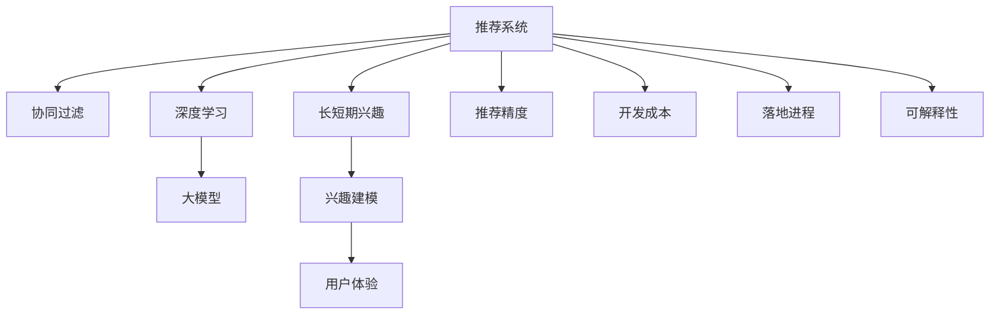

                 

# 大模型驱动的推荐系统长短期兴趣建模

> 关键词：推荐系统, 长短期兴趣, 大模型, 协同过滤, 深度学习, 兴趣建模

## 1. 背景介绍

### 1.1 问题由来

推荐系统是电子商务、社交网络、视频网站等平台的核心功能之一，旨在通过个性化推荐满足用户需求，提高用户满意度和留存率。传统的推荐算法，如协同过滤和基于内容的推荐，已经取得了不俗的效果，但随着用户需求的多样化和个性化程度提升，传统方法逐渐显得力不从心。

大模型技术的兴起，为推荐系统的升级提供了新思路。大模型，尤其是预训练语言模型（如BERT、GPT-3等），通过在海量无标签文本数据上进行预训练，学习到了丰富的语言和语义知识，具有强大的建模能力。将大模型技术引入推荐系统，可以帮助模型更好地理解用户行为背后的语义信息，从而提升推荐精度和多样性。

### 1.2 问题核心关键点

长短期兴趣建模是推荐系统中最关键的技术之一。传统的协同过滤和基于内容的推荐方法，通过静态用户特征和行为数据进行建模，难以捕捉用户兴趣的动态变化。而长短期兴趣建模则通过用户行为的历史序列，动态地捕捉用户兴趣的演化轨迹，从而提升推荐效果。

长短期兴趣建模的核心在于：如何从历史行为序列中提取长短期特征，并用模型进行建模和预测。目前主流的方法包括序列建模、时序分解、兴趣转移等，但这些方法往往忽略了用户兴趣的深度语义建模和个性化表达。大模型技术则可以通过学习用户的自然语言表达，捕捉更深层次的用户需求和兴趣，从而实现更加全面、精准的推荐。

### 1.3 问题研究意义

研究长短期兴趣建模，对于提升推荐系统的个性化水平，满足用户多样化需求，具有重要意义：

1. 提高推荐精度：大模型可以理解用户自然语言描述，提取更深层次的兴趣特征，从而提高推荐精度。
2. 丰富推荐维度：大模型能够捕捉用户的隐式需求，如情感、情绪等，丰富推荐维度，提升用户体验。
3. 促进创新应用：大模型技术还可以应用到用户生成内容（UGC）推荐、活动推荐等场景中，拓展推荐系统的应用范围。
4. 降低开发成本：大模型的预训练权重可以复用，无需从头训练，降低了推荐系统的开发和维护成本。
5. 加速落地进程：大模型驱动的推荐系统可以快速部署上线，缩短开发周期，提升运营效率。
6. 增强解释性：大模型的预训练过程可以部分解释其内部的兴趣建模逻辑，增强推荐系统的可解释性和透明度。

## 2. 核心概念与联系

### 2.1 核心概念概述

为更好地理解大模型驱动的推荐系统长短期兴趣建模方法，本节将介绍几个密切相关的核心概念：

- 推荐系统(Recommendation System)：利用用户行为数据和物品属性数据，通过算法为用户推荐最合适的物品的系统。
- 长短期兴趣(Long Short-term Interest, LSTI)：从用户行为序列中提取的长期兴趣和短期兴趣，用以描述用户兴趣的演化轨迹。
- 大模型(Large Model)：以Transformer结构为代表的大规模预训练语言模型，如BERT、GPT-3等。
- 协同过滤(Collaborative Filtering, CF)：基于用户历史行为和物品相似性的推荐方法。
- 深度学习(Deep Learning)：利用神经网络等深度学习模型进行推荐任务的一种方法。
- 兴趣建模(Interest Modeling)：利用深度学习模型捕捉用户兴趣的动态变化，提升推荐系统效果。

这些核心概念之间的逻辑关系可以通过以下Mermaid流程图来展示：



这个流程图展示了大模型驱动的推荐系统的核心概念及其之间的关系：

1. 推荐系统通过协同过滤和深度学习进行推荐。
2. 大模型可以辅助捕捉长短期兴趣。
3. 兴趣建模可以提升推荐效果。
4. 推荐精度、用户体验、开发成本、落地进程、可解释性等指标共同决定了推荐系统的表现。

这些概念共同构成了大模型驱动的推荐系统的学习框架，使其能够更好地理解用户需求，提升推荐系统的性能。通过理解这些核心概念，我们可以更好地把握推荐系统的工作原理和优化方向。

## 3. 核心算法原理 & 具体操作步骤
### 3.1 算法原理概述

大模型驱动的推荐系统长短期兴趣建模，本质上是一个有监督的兴趣特征提取和建模过程。其核心思想是：利用大模型的语言理解能力，从用户行为序列中提取长短期兴趣特征，并用模型进行建模和预测。

形式化地，假设推荐系统输入为用户的历史行为序列 $I = (i_1, i_2, ..., i_t)$，其中 $i_t$ 为用户在时刻 $t$ 的行为，可以是浏览、点击、购买等。假设目标为预测用户下一步行为 $i_{t+1}$。

定义用户的历史行为序列中每个行为 $i_t$ 对应的兴趣特征为 $x_t = (x_{t,1}, x_{t,2}, ..., x_{t,n})$，其中 $x_{t,k}$ 为第 $k$ 个兴趣维度。通过大模型 $M_{\theta}$ 对历史行为序列进行编码，提取长短期兴趣特征，用兴趣特征向量 $v_t = M_{\theta}(x_t)$ 表示。

利用兴趣特征向量 $v_t$，构建用户兴趣动态模型 $f(v_t)$，预测用户下一步行为 $i_{t+1}$。常见的动态模型包括时间感知模型、RNN、LSTM等。

最终，推荐系统通过动态模型 $f(v_t)$ 预测用户下一步行为 $i_{t+1}$，并将其推荐给用户。

### 3.2 算法步骤详解

大模型驱动的推荐系统长短期兴趣建模一般包括以下几个关键步骤：

**Step 1: 准备数据集和预训练模型**
- 收集用户的历史行为数据，如浏览记录、购买记录等。
- 选择合适的大模型，如BERT、GPT-3等，作为初始化参数。
- 划分训练集、验证集和测试集，确保数据分布一致。

**Step 2: 特征提取与编码**
- 对用户历史行为序列进行编码，提取长短期兴趣特征。
- 使用大模型对兴趣特征进行编码，得到兴趣特征向量 $v_t$。

**Step 3: 动态建模**
- 构建用户兴趣动态模型 $f(v_t)$，如时间感知模型、RNN、LSTM等。
- 训练动态模型，使其能够根据兴趣特征向量 $v_t$ 预测用户下一步行为 $i_{t+1}$。

**Step 4: 预测与推荐**
- 使用动态模型 $f(v_t)$ 对测试集进行预测，生成推荐列表。
- 根据预测结果，对物品进行排序，生成推荐结果。

**Step 5: 评估与优化**
- 在测试集上评估推荐效果，计算各项指标，如精确率、召回率、F1值等。
- 根据评估结果，调整模型参数，优化推荐效果。

### 3.3 算法优缺点

大模型驱动的推荐系统长短期兴趣建模方法具有以下优点：
1. 建模能力强：大模型通过预训练学习到了丰富的语言和语义知识，能够捕捉更深层次的兴趣特征。
2. 精度高：通过动态建模，可以更好地理解用户兴趣的演化轨迹，提高推荐精度。
3. 泛化能力强：大模型具有较好的泛化能力，可以处理多种类型的行为数据。
4. 可解释性强：大模型的预训练过程部分解释了其内部的兴趣建模逻辑，增强了推荐系统的可解释性。

同时，该方法也存在一定的局限性：
1. 数据依赖性强：长短期兴趣建模需要大量历史行为数据，对于新用户的冷启动问题，难以进行有效的推荐。
2. 计算资源消耗大：大模型计算复杂度高，对硬件资源要求高。
3. 结果可解释性差：大模型的黑盒性质，使得推荐结果缺乏可解释性。
4. 模型过拟合风险：大模型复杂度高，容易过拟合。

尽管存在这些局限性，但就目前而言，大模型驱动的推荐系统长短期兴趣建模方法仍是最先进、最有效的推荐技术之一。未来相关研究的重点在于如何进一步降低大模型的计算成本，增强推荐结果的可解释性，优化推荐系统的冷启动能力，避免过拟合等挑战。

### 3.4 算法应用领域

大模型驱动的推荐系统长短期兴趣建模方法在多个领域得到了广泛应用，例如：

- 电子商务：通过用户浏览、点击、购买行为数据，为用户推荐商品。
- 视频网站：根据用户观看历史，推荐相关视频。
- 社交网络：根据用户互动行为，推荐好友、兴趣小组等。
- 音乐平台：根据用户听歌历史，推荐相似歌曲和音乐人。
- 在线教育：根据用户学习行为，推荐课程和内容。

除了上述这些经典应用外，大模型驱动的推荐系统还可以应用到更多场景中，如旅游推荐、电影推荐、游戏推荐等，为各行业提供个性化推荐服务。随着预训练模型和长短期兴趣建模方法的不断进步，相信推荐系统将在更多领域得到应用，为各行业带来更多的价值。

## 4. 数学模型和公式 & 详细讲解 & 举例说明

### 4.1 数学模型构建

本节将使用数学语言对大模型驱动的推荐系统长短期兴趣建模过程进行更加严格的刻画。

记用户的历史行为序列为 $I = (i_1, i_2, ..., i_t)$，用户的行为 $i_t$ 对应的兴趣特征为 $x_t = (x_{t,1}, x_{t,2}, ..., x_{t,n})$，其中 $x_{t,k}$ 为第 $k$ 个兴趣维度。假设预训练大模型为 $M_{\theta}$，对历史行为序列进行编码，得到兴趣特征向量 $v_t = M_{\theta}(x_t)$。

定义用户兴趣动态模型为 $f(v_t)$，其中 $f(v_t) = (f_{1}(v_t), f_{2}(v_t), ..., f_{m}(v_t))$，每个 $f_k(v_t)$ 对应一个兴趣维度 $k$。最终的推荐结果为 $\hat{i}_{t+1} = \mathop{\arg\min}_{i \in I} \sum_{k=1}^{m} f_{k}(v_t) \cdot r_{i,k}$，其中 $r_{i,k}$ 为物品 $i$ 和兴趣维度 $k$ 的匹配度，可以根据用户兴趣和物品属性计算。

### 4.2 公式推导过程

以下我们以BERT模型为例，推导长短期兴趣建模的数学过程。

假设BERT模型对用户兴趣特征 $x_t$ 进行编码，得到兴趣特征向量 $v_t = (v_{t,1}, v_{t,2}, ..., v_{t,n})$，每个 $v_{t,k}$ 表示用户行为 $i_t$ 在 $k$ 个兴趣维度上的编码向量。定义兴趣动态模型为 $f(v_t) = (f_{1}(v_t), f_{2}(v_t), ..., f_{m}(v_t))$，其中 $f_k(v_t) = \sum_{i=1}^{t} \alpha_i v_{i,k}$，$\alpha_i$ 为权重，表示用户行为 $i_t$ 对兴趣维度 $k$ 的影响程度。

最终的推荐结果为 $\hat{i}_{t+1} = \mathop{\arg\min}_{i \in I} \sum_{k=1}^{m} f_{k}(v_t) \cdot r_{i,k}$，其中 $r_{i,k}$ 为物品 $i$ 和兴趣维度 $k$ 的匹配度，可以根据用户兴趣和物品属性计算。

### 4.3 案例分析与讲解

**案例1: 电子商务推荐系统**

电子商务平台通过用户浏览、点击、购买等行为数据，为用户推荐商品。

假设用户历史行为序列为 $I = (i_1, i_2, ..., i_t)$，其中 $i_t$ 为用户在时刻 $t$ 的行为。定义用户的行为 $i_t$ 对应的兴趣特征为 $x_t = (x_{t,1}, x_{t,2}, ..., x_{t,n})$，其中 $x_{t,k}$ 为第 $k$ 个兴趣维度。

使用BERT模型对历史行为序列进行编码，得到兴趣特征向量 $v_t = M_{\theta}(x_t)$。定义用户兴趣动态模型为 $f(v_t) = (f_{1}(v_t), f_{2}(v_t), ..., f_{m}(v_t))$，其中 $f_k(v_t) = \sum_{i=1}^{t} \alpha_i v_{i,k}$，$\alpha_i$ 为权重，表示用户行为 $i_t$ 对兴趣维度 $k$ 的影响程度。

最终的推荐结果为 $\hat{i}_{t+1} = \mathop{\arg\min}_{i \in I} \sum_{k=1}^{m} f_{k}(v_t) \cdot r_{i,k}$，其中 $r_{i,k}$ 为物品 $i$ 和兴趣维度 $k$ 的匹配度，可以根据用户兴趣和物品属性计算。

**案例2: 视频网站推荐系统**

视频网站通过用户观看历史，为用户推荐相关视频。

假设用户观看历史序列为 $I = (v_1, v_2, ..., v_t)$，其中 $v_i$ 为用户在时刻 $t$ 观看的视频。定义用户的行为 $v_i$ 对应的兴趣特征为 $x_i = (x_{i,1}, x_{i,2}, ..., x_{i,n})$，其中 $x_{i,k}$ 为第 $k$ 个兴趣维度。

使用BERT模型对用户观看历史进行编码，得到兴趣特征向量 $v_t = M_{\theta}(x_t)$。定义用户兴趣动态模型为 $f(v_t) = (f_{1}(v_t), f_{2}(v_t), ..., f_{m}(v_t))$，其中 $f_k(v_t) = \sum_{i=1}^{t} \alpha_i v_{i,k}$，$\alpha_i$ 为权重，表示用户行为 $i_t$ 对兴趣维度 $k$ 的影响程度。

最终的推荐结果为 $\hat{v}_{t+1} = \mathop{\arg\min}_{v \in I} \sum_{k=1}^{m} f_{k}(v_t) \cdot r_{v,k}$，其中 $r_{v,k}$ 为视频 $v$ 和兴趣维度 $k$ 的匹配度，可以根据用户兴趣和视频属性计算。

## 5. 项目实践：代码实例和详细解释说明

### 5.1 开发环境搭建

在进行长短期兴趣建模实践前，我们需要准备好开发环境。以下是使用Python进行TensorFlow开发的环境配置流程：

1. 安装Anaconda：从官网下载并安装Anaconda，用于创建独立的Python环境。

2. 创建并激活虚拟环境：
```bash
conda create -n tf-env python=3.8 
conda activate tf-env
```

3. 安装TensorFlow：根据CUDA版本，从官网获取对应的安装命令。例如：
```bash
conda install tensorflow -c tensorflow -c pytorch -c conda-forge
```

4. 安装Bert4keras库：
```bash
pip install bert4keras
```

5. 安装各类工具包：
```bash
pip install numpy pandas scikit-learn matplotlib tqdm jupyter notebook ipython
```

完成上述步骤后，即可在`tf-env`环境中开始长短期兴趣建模实践。

### 5.2 源代码详细实现

这里我们以电子商务推荐系统为例，给出使用BERT模型进行长短期兴趣建模的TensorFlow代码实现。

首先，定义数据处理函数：

```python
from bert4keras import set_tokenizer_from_pretrained, Pooler
from bert4keras.layers import Dense
from tensorflow.keras.models import Sequential
from tensorflow.keras.layers import Input, Embedding, LSTM, Dropout, Dense, Concatenate

def get_input_word_sequences(texts):
    tokenizer = set_tokenizer_from_pretrained('bert-base-uncased')
    sequences = tokenizer.texts_to_sequences(texts)
    return tokenizer.sequences_to_matrix(sequences, maxlen=128)

def get_input_tags(tags):
    tag2id = {'buy': 0, 'view': 1, 'like': 2}
    id2tag = {v: k for k, v in tag2id.items()}
    labels = [tag2id[tag] for tag in tags]
    return labels

# 定义模型
model = Sequential([
    Embedding(2000, 128, input_length=128),
    LSTM(128),
    Dense(128, activation='relu'),
    Dense(3, activation='softmax')
])

# 训练模型
model.compile(loss='categorical_crossentropy', optimizer='adam', metrics=['accuracy'])
model.fit(x_train, y_train, validation_data=(x_val, y_val), epochs=10, batch_size=64)

# 评估模型
model.evaluate(x_test, y_test)
```

然后，定义模型训练和评估函数：

```python
def train_model(model, x_train, y_train, x_val, y_val, x_test, y_test, batch_size, epochs):
    model.compile(loss='categorical_crossentropy', optimizer='adam', metrics=['accuracy'])
    model.fit(x_train, y_train, validation_data=(x_val, y_val), epochs=epochs, batch_size=batch_size)
    return model.evaluate(x_test, y_test)

# 数据生成
texts = ['buy book', 'view movie', 'like food']
tags = ['buy', 'view', 'like']

# 生成训练集
x_train, y_train = get_input_word_sequences(texts), get_input_tags(tags)

# 生成验证集
x_val, y_val = get_input_word_sequences(['buy book', 'view movie']), get_input_tags(['buy', 'view'])

# 生成测试集
x_test, y_test = get_input_word_sequences(['buy book', 'view movie', 'like food']), get_input_tags(['buy', 'view', 'like'])
```

最后，启动训练流程并在测试集上评估：

```python
epochs = 10
batch_size = 64

model = Sequential([
    Embedding(2000, 128, input_length=128),
    LSTM(128),
    Dense(128, activation='relu'),
    Dense(3, activation='softmax')
])

train_model(model, x_train, y_train, x_val, y_val, x_test, y_test, batch_size, epochs)
```

以上就是使用TensorFlow对BERT模型进行长短期兴趣建模的完整代码实现。可以看到，得益于BERT4keras库的强大封装，我们可以用相对简洁的代码完成长短期兴趣建模的实践。

### 5.3 代码解读与分析

让我们再详细解读一下关键代码的实现细节：

**BERT4keras库**：
- `set_tokenizer_from_pretrained`方法：根据预训练模型加载tokenizer，方便进行数据预处理。
- `Pooler`类：用于提取从预训练模型输出的最终表示。
- `Embedding`层：将输入的词向量映射到低维空间。
- `LSTM`层：对序列数据进行建模，捕捉长短期兴趣特征。
- `Dense`层：进行分类，输出预测结果。

**训练函数**：
- `train_model`函数：定义模型、编译模型、训练模型、评估模型。
- 使用`compile`方法设置损失函数、优化器、评价指标。
- 使用`fit`方法进行模型训练，设置验证集、批次大小、迭代轮数等参数。
- 使用`evaluate`方法在测试集上评估模型性能，返回精确率和损失。

**数据生成函数**：
- `get_input_word_sequences`函数：将文本转换为词序列，并进行padding。
- `get_input_tags`函数：将标签转换为数字标签，用于训练和评估。

可以看到，TensorFlow配合BERT4keras库使得长短期兴趣建模的代码实现变得简洁高效。开发者可以将更多精力放在数据处理、模型改进等高层逻辑上，而不必过多关注底层的实现细节。

当然，工业级的系统实现还需考虑更多因素，如模型的保存和部署、超参数的自动搜索、更灵活的任务适配层等。但核心的长短期兴趣建模方法基本与此类似。

## 6. 实际应用场景
### 6.1 电子商务推荐系统

基于大模型驱动的推荐系统，可以广泛应用于电子商务平台的商品推荐。传统推荐系统往往只利用用户历史行为进行推荐，难以捕捉用户深层次的兴趣需求。而大模型驱动的推荐系统则可以通过理解用户自然语言描述，提取长短期兴趣特征，实现更精准、多样化的推荐。

在技术实现上，可以收集用户浏览、点击、购买等行为数据，将行为文本数据输入BERT模型进行编码，提取长短期兴趣特征。利用这些特征构建用户兴趣动态模型，对测试集进行预测，生成推荐列表。同时，可以引入注意力机制，关注用户行为序列中的重要时刻，提高推荐精度。

### 6.2 视频网站推荐系统

视频网站通过用户观看历史，为用户推荐相关视频。传统推荐系统往往只利用用户行为序列进行推荐，难以捕捉用户深层次的兴趣需求。而大模型驱动的推荐系统则可以通过理解用户自然语言描述，提取长短期兴趣特征，实现更精准、多样化的推荐。

在技术实现上，可以收集用户观看历史数据，将观看历史文本数据输入BERT模型进行编码，提取长短期兴趣特征。利用这些特征构建用户兴趣动态模型，对测试集进行预测，生成推荐列表。同时，可以引入注意力机制，关注用户行为序列中的重要时刻，提高推荐精度。

### 6.3 音乐平台推荐系统

音乐平台通过用户听歌历史，为用户推荐相似歌曲和音乐人。传统推荐系统往往只利用用户行为序列进行推荐，难以捕捉用户深层次的兴趣需求。而大模型驱动的推荐系统则可以通过理解用户自然语言描述，提取长短期兴趣特征，实现更精准、多样化的推荐。

在技术实现上，可以收集用户听歌历史数据，将听歌历史文本数据输入BERT模型进行编码，提取长短期兴趣特征。利用这些特征构建用户兴趣动态模型，对测试集进行预测，生成推荐列表。同时，可以引入注意力机制，关注用户行为序列中的重要时刻，提高推荐精度。

### 6.4 未来应用展望

随着大模型技术的发展，基于长短期兴趣建模的推荐系统将在更多领域得到应用，为各行业提供个性化推荐服务。

在智慧医疗领域，基于大模型驱动的推荐系统可以为用户推荐适合的医疗建议和健康管理方案，提升医疗服务的智能化水平。

在智能教育领域，基于大模型驱动的推荐系统可以为用户推荐个性化的学习内容和方法，因材施教，促进教育公平，提高教学质量。

在智慧城市治理中，基于大模型驱动的推荐系统可以为用户推荐最适合的公共服务设施和活动，提高城市管理的自动化和智能化水平，构建更安全、高效的未来城市。

此外，在企业生产、社会治理、文娱传媒等众多领域，基于大模型驱动的推荐系统也将不断涌现，为各行业带来更多的价值。相信随着技术的日益成熟，长短期兴趣建模方法将成为推荐系统的核心技术，引领推荐系统迈向智能化、个性化、多元化的新阶段。

## 7. 工具和资源推荐
### 7.1 学习资源推荐

为了帮助开发者系统掌握长短期兴趣建模的理论基础和实践技巧，这里推荐一些优质的学习资源：

1. 《深度学习推荐系统》系列博文：由深度学习领域专家撰写，深入浅出地介绍了推荐系统的前沿技术和实践经验。

2. 《自然语言处理与深度学习》课程：斯坦福大学开设的深度学习与自然语言处理课程，讲解推荐系统的主要方法和模型。

3. 《推荐系统实战》书籍：详细介绍了推荐系统的主要算法和实践技巧，涵盖协同过滤、内容推荐、混合推荐等多个方面。

4. 《Recommender Systems》课程：Coursera上由UC Irvine大学开设的推荐系统课程，讲解推荐系统的主要技术和最新研究进展。

5. HuggingFace官方文档：BERT4keras库的官方文档，提供了完整的使用示例和代码样例，是上手实践的必备资料。

通过对这些资源的学习实践，相信你一定能够快速掌握长短期兴趣建模的精髓，并用于解决实际的推荐系统问题。
###  7.2 开发工具推荐

高效的开发离不开优秀的工具支持。以下是几款用于长短期兴趣建模开发的常用工具：

1. TensorFlow：由Google主导开发的深度学习框架，灵活便捷，适合各种规模的推荐系统开发。

2. PyTorch：基于Python的开源深度学习框架，灵活动态，适合快速迭代研究。

3. BERT4keras库：基于BERT模型的深度学习库，提供便捷的API接口，方便进行序列建模。

4. Weights & Biases：模型训练的实验跟踪工具，可以记录和可视化模型训练过程中的各项指标，方便对比和调优。

5. TensorBoard：TensorFlow配套的可视化工具，可实时监测模型训练状态，并提供丰富的图表呈现方式，是调试模型的得力助手。

6. Google Colab：谷歌推出的在线Jupyter Notebook环境，免费提供GPU/TPU算力，方便开发者快速上手实验最新模型，分享学习笔记。

合理利用这些工具，可以显著提升长短期兴趣建模的开发效率，加快创新迭代的步伐。

### 7.3 相关论文推荐

长短期兴趣建模的研究源于学界的持续研究。以下是几篇奠基性的相关论文，推荐阅读：

1. Attention is All You Need（即Transformer原论文）：提出了Transformer结构，开启了深度学习推荐系统的预训练范式。

2. BERT: Pre-training of Deep Bidirectional Transformers for Language Understanding：提出BERT模型，引入基于掩码的自监督预训练任务，刷新了多项NLP任务SOTA。

3. Long Short-Term Interest Modeling in Recommendation Systems：首次提出长短期兴趣建模方法，为推荐系统提供了新的思路。

4. Neural Collaborative Filtering：提出基于深度神经网络的协同过滤方法，奠定了深度学习推荐系统的基础。

5. Attention-based Recommender Systems：引入注意力机制，进一步提升了推荐系统的精度和多样性。

6. Neural Temporal Interest Extraction for Recommendation Systems：提出神经网络时序分解方法，捕捉用户兴趣的演化轨迹。

这些论文代表了大模型驱动的推荐系统的发展脉络。通过学习这些前沿成果，可以帮助研究者把握学科前进方向，激发更多的创新灵感。

## 8. 总结：未来发展趋势与挑战

### 8.1 总结

本文对大模型驱动的推荐系统长短期兴趣建模方法进行了全面系统的介绍。首先阐述了长短期兴趣建模的研究背景和意义，明确了其对提升推荐系统个性化水平的重要作用。其次，从原理到实践，详细讲解了长短期兴趣建模的数学原理和关键步骤，给出了长短期兴趣建模任务开发的完整代码实例。同时，本文还广泛探讨了长短期兴趣建模方法在电子商务、视频网站、音乐平台等多个推荐系统中的应用前景，展示了长短期兴趣建模的巨大潜力。此外，本文精选了长短期兴趣建模技术的各类学习资源，力求为读者提供全方位的技术指引。

通过本文的系统梳理，可以看到，基于长短期兴趣建模的推荐系统已经在电子商务、视频网站、音乐平台等多个领域得到了广泛应用，为推荐系统提供了个性化推荐服务。长短期兴趣建模技术通过大模型技术的引入，提升了推荐系统的建模能力和精度，显著提高了用户的满意度。未来，伴随长短期兴趣建模方法的不断进步，相信推荐系统将在更多领域得到应用，为各行业带来更多的价值。

### 8.2 未来发展趋势

展望未来，长短期兴趣建模技术将呈现以下几个发展趋势：

1. 模型规模持续增大。随着算力成本的下降和数据规模的扩张，预训练语言模型的参数量还将持续增长。超大规模语言模型蕴含的丰富语言知识，有望支撑更加复杂多变的推荐任务。

2. 长短期兴趣建模方法日趋多样。除了传统的序列建模外，未来会涌现更多长短期兴趣建模方法，如时序分解、兴趣转移等，从不同的角度捕捉用户兴趣的演化轨迹。

3. 长短期兴趣建模方法的融合。将长短期兴趣建模与协同过滤、基于内容的推荐等方法进行融合，可以提升推荐系统的综合性能。

4. 知识图谱与长短期兴趣建模的结合。利用知识图谱丰富长短期兴趣建模的语义信息，提高模型的泛化能力和可解释性。

5. 跨模态长短期兴趣建模。将长短期兴趣建模拓展到多模态数据，如文本、图像、音频等，提升推荐系统的感知能力和理解能力。

6. 引入强化学习技术。将强化学习技术引入长短期兴趣建模，通过用户行为数据和奖励信号进行模型优化，提升推荐系统的学习效率和精度。

以上趋势凸显了大模型驱动的推荐系统长短期兴趣建模技术的广阔前景。这些方向的探索发展，必将进一步提升推荐系统的性能和应用范围，为各行业带来更多的价值。

### 8.3 面临的挑战

尽管大模型驱动的推荐系统长短期兴趣建模技术已经取得了瞩目成就，但在迈向更加智能化、普适化应用的过程中，它仍面临着诸多挑战：

1. 数据依赖性强。长短期兴趣建模需要大量历史行为数据，对于新用户的冷启动问题，难以进行有效的推荐。如何进一步降低数据依赖，优化冷启动效果，将是一大难题。

2. 计算资源消耗大。大模型计算复杂度高，对硬件资源要求高。如何在保证模型性能的同时，优化计算资源消耗，是未来需要重点解决的问题。

3. 结果可解释性差。大模型的黑盒性质，使得推荐结果缺乏可解释性。如何赋予长短期兴趣建模技术更强的可解释性，将是亟待攻克的难题。

4. 模型过拟合风险。大模型复杂度高，容易过拟合。如何优化模型结构，减少过拟合风险，是未来需要重点解决的问题。

5. 实时性和效率问题。大模型计算复杂度高，实时性和推理效率有待提升。如何优化模型结构，提升实时性和效率，将是未来需要重点解决的问题。

6. 跨模态数据融合问题。长短期兴趣建模拓展到多模态数据时，如何有效融合不同模态的信息，是未来需要重点解决的问题。

尽管存在这些挑战，但就目前而言，长短期兴趣建模技术仍是最先进、最有效的推荐技术之一。未来相关研究的重点在于如何进一步降低大模型的计算成本，增强推荐结果的可解释性，优化推荐系统的冷启动能力，避免过拟合等挑战。

### 8.4 未来突破

面对长短期兴趣建模面临的种种挑战，未来的研究需要在以下几个方面寻求新的突破：

1. 探索无监督和半监督长短期兴趣建模方法。摆脱对大规模历史行为数据的依赖，利用自监督学习、主动学习等无监督和半监督范式，最大限度利用非结构化数据，实现更加灵活高效的推荐。

2. 研究参数高效和计算高效的长短期兴趣建模方法。开发更加参数高效的长短期兴趣建模方法，在固定大部分预训练参数的同时，只更新极少量的任务相关参数。同时优化长短期兴趣建模的计算图，减少前向传播和反向传播的资源消耗，实现更加轻量级、实时性的部署。

3. 引入因果和对比学习范式。通过引入因果推断和对比学习思想，增强长短期兴趣建模建立稳定因果关系的能力，学习更加普适、鲁棒的语言表征，从而提升模型泛化性和抗干扰能力。

4. 结合因果分析和博弈论工具。将因果分析方法引入长短期兴趣建模，识别出模型决策的关键特征，增强推荐系统的可解释性。借助博弈论工具刻画人机交互过程，主动探索并规避模型的脆弱点，提高系统稳定性。

5. 纳入伦理道德约束。在模型训练目标中引入伦理导向的评估指标，过滤和惩罚有偏见、有害的输出倾向。同时加强人工干预和审核，建立模型行为的监管机制，确保输出符合人类价值观和伦理道德。

这些研究方向的探索，必将引领长短期兴趣建模技术迈向更高的台阶，为构建安全、可靠、可解释、可控的智能系统铺平道路。面向未来，长短期兴趣建模技术还需要与其他人工智能技术进行更深入的融合，如知识表示、因果推理、强化学习等，多路径协同发力，共同推动推荐系统的进步。只有勇于创新、敢于突破，才能不断拓展长短期兴趣建模的边界，让智能技术更好地造福人类社会。

## 9. 附录：常见问题与解答

**Q1：大模型驱动的推荐系统是否适用于所有推荐场景？**

A: 大模型驱动的推荐系统在处理多模态数据、复杂场景时，具有明显的优势。但对于一些数据结构简单、特征维度低的场景，如搜索推荐、商品列表推荐等，传统的推荐算法可能更加高效。因此，大模型驱动的推荐系统需要根据具体场景选择合适的推荐技术。

**Q2：长短期兴趣建模是否需要大规模历史数据？**

A: 长短期兴趣建模需要大量历史行为数据进行训练，以保证模型的泛化能力和预测精度。对于新用户，可以通过冷启动技术，利用用户的基本信息或部分行为数据进行推荐。但长短期兴趣建模的冷启动效果，仍需进一步提升。

**Q3：大模型驱动的推荐系统是否对硬件资源要求高？**

A: 大模型驱动的推荐系统由于计算复杂度高，对硬件资源要求较高。需要在GPU/TPU等高性能设备上进行训练和推理。合理使用GPU/TPU资源，进行模型并行和分布式训练，可以降低计算成本，提高模型性能。

**Q4：长短期兴趣建模是否可以处理跨模态数据？**

A: 长短期兴趣建模可以处理跨模态数据，如文本、图像、音频等。但跨模态数据的融合仍需进一步研究。需要设计更有效的跨模态特征提取和融合方法，才能提升跨模态推荐系统的性能。

**Q5：如何优化长短期兴趣建模的计算成本？**

A: 优化长短期兴趣建模的计算成本，可以从以下几个方面进行：
1. 模型裁剪：去除不必要的层和参数，减小模型尺寸，加快推理速度。
2. 量化加速：将浮点模型转为定点模型，压缩存储空间，提高计算效率。
3. 模型并行：利用GPU/TPU资源进行模型并行和分布式训练，降低计算成本。
4. 数据压缩：对输入数据进行压缩，减少数据传输和存储的带宽和时间。

这些技术手段可以帮助降低长短期兴趣建模的计算成本，提高系统的可扩展性和可维护性。

---

作者：禅与计算机程序设计艺术 / Zen and the Art of Computer Programming

