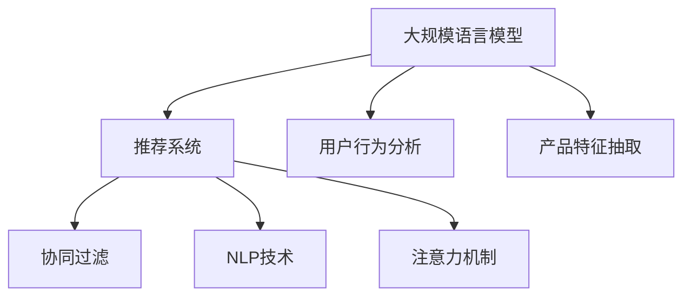

                 

# 大规模语言模型在产品推荐中的应用

> 关键词：大规模语言模型,产品推荐系统,自然语言处理(NLP),用户行为分析,协同过滤,注意力机制

## 1. 背景介绍

在电商、内容、娱乐等多个领域，推荐系统作为重要的用户交互工具，日益发挥着不可或缺的作用。推荐系统不仅能够提升用户体验，还能显著提高商家运营效率，增强平台粘性，驱动业务增长。当前，随着人工智能技术的发展，推荐系统逐渐从基于传统的协同过滤、矩阵分解等简单方法，升级为以深度学习为核心技术的复杂系统。其中，基于大规模语言模型的推荐系统方法，因为能够充分挖掘用户和产品之间的语义信息，处理更加复杂多样化的推荐场景，从而展现出巨大的应用潜力。

本文将从推荐系统的核心技术和业务应用角度，系统介绍大规模语言模型在产品推荐中的应用，探讨其在实际场景中的落地方法，为推荐系统开发者提供理论参考和实践指导。

## 2. 核心概念与联系

### 2.1 核心概念概述

为便于读者全面理解大规模语言模型在产品推荐中的应用，以下将介绍几个关键概念及其联系。

- **大规模语言模型(Large Language Models, LLMs)**：以自回归（如GPT）或自编码（如BERT）模型为代表，通过在大规模无标签文本语料上进行预训练，学习丰富的语言知识和语义表示，具备强大的自然语言理解和生成能力。

- **推荐系统(Recommendation System)**：通过收集用户行为数据（如浏览、点击、购买记录等），结合产品特征（如商品描述、价格、分类等），预测用户对某一产品的兴趣，从而为其推荐相关商品或内容。

- **协同过滤(Collaborative Filtering)**：基于用户行为或产品特征的相似性进行推荐，通过分析用户历史行为来推测其兴趣偏好，或通过分析产品特征相似性推荐相似产品。

- **自然语言处理(Natural Language Processing, NLP)**：利用计算机处理和理解自然语言的技术，实现语音识别、语义理解、情感分析、文本生成等任务。在推荐系统中，NLP技术用于理解用户文本评论、商品描述等，提取语义信息。

- **注意力机制(Attention Mechanism)**：一种用于建模序列中不同位置信息重要性的技术，通过给不同位置的信息赋予不同的权重，提高模型对关键信息的关注。在推荐系统中，注意力机制可以用于动态权衡用户历史行为、产品特征等因素对推荐结果的影响。

这些核心概念之间的逻辑关系可通过以下Mermaid流程图来展示：



这个流程图展示了大规模语言模型与推荐系统的核心概念及其之间的关系：

1. 大规模语言模型通过预训练获得基础能力。
2. 推荐系统通过分析用户行为和产品特征，为用户推荐产品。
3. 协同过滤和NLP技术作为推荐系统的辅助手段，协同发挥作用。
4. 注意力机制在推荐过程中优化信息加权，提升模型精度。

这些概念共同构成了推荐系统的技术框架，使其能够有效处理用户与产品的交互数据，挖掘潜在的推荐需求。

## 3. 核心算法原理 & 具体操作步骤

### 3.1 算法原理概述

基于大规模语言模型的推荐系统方法，本质上是一种基于序列学习的推荐范式。其核心思想是：通过在用户历史行为或产品特征序列中，利用语言模型捕捉用户兴趣和产品特征之间的语义关系，从而进行推荐。

形式化地，假设用户行为序列为 $X=\{x_1,x_2,\ldots,x_n\}$，产品特征序列为 $Y=\{y_1,y_2,\ldots,y_m\}$。推荐系统通过以下模型对用户对产品 $y_i$ 的兴趣 $p_i$ 进行预测：

$$
p_i = \text{softmax}(\text{dot}(\text{softmax}(AW^T),V))
$$

其中 $A$ 为用户行为特征编码矩阵，$W$ 为产品特征编码向量，$V$ 为兴趣权重向量。$\text{dot}$ 表示向量内积，$\text{softmax}$ 表示归一化操作。模型通过最大化注意力权重 $\alpha_i$，使得对重要信息的关注度更高，从而提高推荐精度。

### 3.2 算法步骤详解

基于大规模语言模型的推荐系统一般包括以下几个关键步骤：

**Step 1: 准备预训练模型和数据集**
- 选择合适的预训练语言模型 $M_{\theta}$ 作为初始化参数，如 BERT、GPT 等。
- 准备用户行为序列数据集 $D_X=\{x_1,x_2,\ldots,x_n\}$ 和产品特征序列数据集 $D_Y=\{y_1,y_2,\ldots,y_m\}$，划分为训练集、验证集和测试集。

**Step 2: 编码用户行为和产品特征**
- 使用预训练语言模型将用户行为序列 $X$ 和产品特征序列 $Y$ 编码成向量表示 $V_X$ 和 $V_Y$。
- 对于连续型用户行为，直接输入模型生成向量表示；对于离散型行为，可以使用独热编码或预训练词向量表示。

**Step 3: 计算注意力权重**
- 利用注意力机制计算用户行为与产品特征之间的注意力权重 $\alpha_i$。
- 将注意力权重应用到用户行为和产品特征向量，生成加权向量 $V_{XW}$ 和 $V_{YW}$。

**Step 4: 计算推荐得分**
- 通过注意力加权后的用户行为和产品特征向量计算推荐得分 $S$。
- 使用softmax函数对推荐得分进行归一化，得到用户对各个产品的兴趣概率分布 $p$。

**Step 5: 推荐排序**
- 根据用户对各个产品的兴趣概率 $p$，对产品进行排序，推荐最有可能满足用户需求的产品。

### 3.3 算法优缺点

基于大规模语言模型的推荐系统方法具有以下优点：
1. 能够处理用户和产品的多样性描述，挖掘更丰富的语义信息。
2. 可以处理序列数据，捕捉用户和产品的历史行为模式。
3. 能够动态调整推荐结果，优化用户满意度。
4. 可以实现跨域推荐，利用多种数据源的信息。

同时，该方法也存在一些局限性：
1. 需要大量标注数据和计算资源，预训练和微调过程复杂耗时。
2. 依赖大规模预训练语言模型，模型参数较大，推理速度较慢。
3. 模型可能学习到用户和产品的固有偏见，存在潜在的公平性问题。
4. 模型内部决策过程复杂，难以解释和调试。

尽管存在这些局限性，但就目前而言，基于大规模语言模型的推荐方法仍被视为推荐系统的重要前沿技术。未来相关研究的重点在于如何进一步优化模型参数和推理效率，提升模型的公平性和透明性，并拓展应用场景。

### 3.4 算法应用领域

基于大规模语言模型的推荐方法已经在电商、内容、社交等多个领域得到了广泛应用，覆盖了推荐、搜索、广告等众多业务场景，具体包括：

- 电商推荐：基于用户浏览、购买历史，为其推荐感兴趣的商品。
- 内容推荐：根据用户阅读、观看历史，推荐感兴趣的文章、视频等。
- 广告推荐：根据用户行为数据，为其推荐相关广告内容。
- 搜索排序：根据用户查询词，推荐相关搜索结果。
- 个性化音乐播放：根据用户听歌历史，推荐相似歌曲或音乐人。
- 游戏推荐：根据用户的游戏行为，推荐感兴趣的游戏。

除了上述这些经典应用外，基于大规模语言模型的推荐方法还在新兴领域（如无人驾驶、智慧城市等）展现了巨大的潜力，为这些领域带来了新的技术突破。

## 4. 数学模型和公式 & 详细讲解 & 举例说明

### 4.1 数学模型构建

在推荐系统中，大规模语言模型的应用通常涉及用户行为序列的编码和产品特征序列的编码。以下我们将以用户行为序列为例，构建推荐系统的数学模型。

设用户行为序列 $X=\{x_1,x_2,\ldots,x_n\}$，产品特征序列 $Y=\{y_1,y_2,\ldots,y_m\}$。我们希望预测用户对产品 $y_i$ 的兴趣 $p_i$。假设推荐模型为 $M_{\theta}:\mathbb{R}^n \rightarrow \mathbb{R}^m$，其中 $\theta$ 为模型参数。推荐模型的输出 $M_{\theta}(X)$ 表示用户行为序列 $X$ 的编码向量。设用户行为序列编码向量为 $V_X$，产品特征编码向量为 $V_Y$。

推荐系统的目标是最小化预测兴趣与实际兴趣的差异，即：

$$
\min_{\theta} \sum_{i=1}^m (p_i - \hat{p}_i)^2
$$

其中 $p_i$ 为实际兴趣，$\hat{p}_i$ 为模型预测的兴趣。

### 4.2 公式推导过程

以下我们以用户行为序列 $X=\{x_1,x_2,\ldots,x_n\}$ 和产品特征序列 $Y=\{y_1,y_2,\ldots,y_m\}$ 为例，推导推荐模型的计算公式。

推荐模型 $M_{\theta}(X)$ 的输出 $V_X$ 和 $V_Y$ 可以通过预训练语言模型进行编码，得到用户行为编码 $V_X = \text{softmax}(AW^T)X$ 和产品特征编码 $V_Y = \text{softmax}(AW^T)Y$。其中 $A$ 为编码矩阵，$W$ 为编码向量。

推荐系统通过注意力机制 $\alpha_i = \text{softmax}(V_X \cdot V_Y^T)$ 计算用户行为和产品特征之间的注意力权重。将注意力权重应用到用户行为和产品特征向量，得到加权向量 $V_{XW} = \text{softmax}(\alpha_i)V_X$ 和 $V_{YW} = \text{softmax}(\alpha_i)V_Y$。

推荐得分 $S$ 通过注意力加权后的用户行为和产品特征向量计算：

$$
S = \text{softmax}(V_{XW} \cdot V_{YW}^T)
$$

使用softmax函数对推荐得分进行归一化，得到用户对各个产品的兴趣概率分布 $p$：

$$
p = \text{softmax}(S)
$$

根据用户对各个产品的兴趣概率 $p$，对产品进行排序，推荐最有可能满足用户需求的产品。

### 4.3 案例分析与讲解

假设我们有一个电商平台的推荐系统，希望为用户推荐感兴趣的商品。具体步骤如下：

1. 收集用户浏览、购买历史数据，形成用户行为序列 $X=\{x_1,x_2,\ldots,x_n\}$。
2. 对产品进行分类和标签标注，形成产品特征序列 $Y=\{y_1,y_2,\ldots,y_m\}$。
3. 使用预训练的BERT模型对用户行为序列 $X$ 和产品特征序列 $Y$ 进行编码，得到编码向量 $V_X$ 和 $V_Y$。
4. 利用注意力机制计算用户行为和产品特征之间的注意力权重 $\alpha_i$。
5. 将注意力权重应用到用户行为和产品特征向量，生成加权向量 $V_{XW}$ 和 $V_{YW}$。
6. 计算推荐得分 $S$ 并使用softmax函数归一化，得到用户对各个产品的兴趣概率分布 $p$。
7. 根据用户对各个产品的兴趣概率 $p$，对产品进行排序，推荐最有可能满足用户需求的商品。

通过以上步骤，利用大规模语言模型可以实现高效准确的电商推荐系统，帮助用户发现感兴趣的商品，提升用户体验。

## 5. 项目实践：代码实例和详细解释说明

### 5.1 开发环境搭建

在进行推荐系统开发前，我们需要准备好开发环境。以下是使用Python进行PyTorch开发的环境配置流程：

1. 安装Anaconda：从官网下载并安装Anaconda，用于创建独立的Python环境。

2. 创建并激活虚拟环境：
```bash
conda create -n recsys-env python=3.8 
conda activate recsys-env
```

3. 安装PyTorch：根据CUDA版本，从官网获取对应的安装命令。例如：
```bash
conda install pytorch torchvision torchaudio cudatoolkit=11.1 -c pytorch -c conda-forge
```

4. 安装Transformers库：
```bash
pip install transformers
```

5. 安装各类工具包：
```bash
pip install numpy pandas scikit-learn matplotlib tqdm jupyter notebook ipython
```

完成上述步骤后，即可在`recsys-env`环境中开始推荐系统开发。

### 5.2 源代码详细实现

下面我们以电商推荐系统为例，给出使用Transformers库进行推荐开发的PyTorch代码实现。

首先，定义推荐系统的数据处理函数：

```python
from transformers import BertTokenizer
from torch.utils.data import Dataset
import torch

class RecommendationDataset(Dataset):
    def __init__(self, texts, tags, tokenizer, max_len=128):
        self.texts = texts
        self.tags = tags
        self.tokenizer = tokenizer
        self.max_len = max_len
        
    def __len__(self):
        return len(self.texts)
    
    def __getitem__(self, item):
        text = self.texts[item]
        tags = self.tags[item]
        
        encoding = self.tokenizer(text, return_tensors='pt', max_length=self.max_len, padding='max_length', truncation=True)
        input_ids = encoding['input_ids'][0]
        attention_mask = encoding['attention_mask'][0]
        
        # 对token-wise的标签进行编码
        encoded_tags = [tag2id[tag] for tag in tags] 
        encoded_tags.extend([tag2id['O']] * (self.max_len - len(encoded_tags)))
        labels = torch.tensor(encoded_tags, dtype=torch.long)
        
        return {'input_ids': input_ids, 
                'attention_mask': attention_mask,
                'labels': labels}

# 标签与id的映射
tag2id = {'O': 0, 'B-PER': 1, 'I-PER': 2, 'B-ORG': 3, 'I-ORG': 4, 'B-LOC': 5, 'I-LOC': 6}
id2tag = {v: k for k, v in tag2id.items()}

# 创建dataset
tokenizer = BertTokenizer.from_pretrained('bert-base-cased')

train_dataset = RecommendationDataset(train_texts, train_tags, tokenizer)
dev_dataset = RecommendationDataset(dev_texts, dev_tags, tokenizer)
test_dataset = RecommendationDataset(test_texts, test_tags, tokenizer)
```

然后，定义模型和优化器：

```python
from transformers import BertForTokenClassification, AdamW

model = BertForTokenClassification.from_pretrained('bert-base-cased', num_labels=len(tag2id))

optimizer = AdamW(model.parameters(), lr=2e-5)
```

接着，定义训练和评估函数：

```python
from torch.utils.data import DataLoader
from tqdm import tqdm
from sklearn.metrics import classification_report

device = torch.device('cuda') if torch.cuda.is_available() else torch.device('cpu')
model.to(device)

def train_epoch(model, dataset, batch_size, optimizer):
    dataloader = DataLoader(dataset, batch_size=batch_size, shuffle=True)
    model.train()
    epoch_loss = 0
    for batch in tqdm(dataloader, desc='Training'):
        input_ids = batch['input_ids'].to(device)
        attention_mask = batch['attention_mask'].to(device)
        labels = batch['labels'].to(device)
        model.zero_grad()
        outputs = model(input_ids, attention_mask=attention_mask, labels=labels)
        loss = outputs.loss
        epoch_loss += loss.item()
        loss.backward()
        optimizer.step()
    return epoch_loss / len(dataloader)

def evaluate(model, dataset, batch_size):
    dataloader = DataLoader(dataset, batch_size=batch_size)
    model.eval()
    preds, labels = [], []
    with torch.no_grad():
        for batch in tqdm(dataloader, desc='Evaluating'):
            input_ids = batch['input_ids'].to(device)
            attention_mask = batch['attention_mask'].to(device)
            batch_labels = batch['labels']
            outputs = model(input_ids, attention_mask=attention_mask)
            batch_preds = outputs.logits.argmax(dim=2).to('cpu').tolist()
            batch_labels = batch_labels.to('cpu').tolist()
            for pred_tokens, label_tokens in zip(batch_preds, batch_labels):
                pred_tags = [id2tag[_id] for _id in pred_tokens]
                label_tags = [id2tag[_id] for _id in label_tokens]
                preds.append(pred_tags[:len(label_tokens)])
                labels.append(label_tags)
                
    print(classification_report(labels, preds))
```

最后，启动训练流程并在测试集上评估：

```python
epochs = 5
batch_size = 16

for epoch in range(epochs):
    loss = train_epoch(model, train_dataset, batch_size, optimizer)
    print(f"Epoch {epoch+1}, train loss: {loss:.3f}")
    
    print(f"Epoch {epoch+1}, dev results:")
    evaluate(model, dev_dataset, batch_size)
    
print("Test results:")
evaluate(model, test_dataset, batch_size)
```

以上就是使用PyTorch对BERT进行推荐系统开发的完整代码实现。可以看到，得益于Transformers库的强大封装，我们可以用相对简洁的代码完成BERT模型的加载和推荐系统开发。

### 5.3 代码解读与分析

让我们再详细解读一下关键代码的实现细节：

**RecommendationDataset类**：
- `__init__`方法：初始化用户行为序列、产品特征序列、分词器等关键组件。
- `__len__`方法：返回数据集的样本数量。
- `__getitem__`方法：对单个样本进行处理，将用户行为输入编码为token ids，将标签编码为数字，并对其进行定长padding，最终返回模型所需的输入。

**tag2id和id2tag字典**：
- 定义了标签与数字id之间的映射关系，用于将token-wise的预测结果解码回真实的标签。

**训练和评估函数**：
- 使用PyTorch的DataLoader对数据集进行批次化加载，供模型训练和推理使用。
- 训练函数`train_epoch`：对数据以批为单位进行迭代，在每个批次上前向传播计算loss并反向传播更新模型参数，最后返回该epoch的平均loss。
- 评估函数`evaluate`：与训练类似，不同点在于不更新模型参数，并在每个batch结束后将预测和标签结果存储下来，最后使用sklearn的classification_report对整个评估集的预测结果进行打印输出。

**训练流程**：
- 定义总的epoch数和batch size，开始循环迭代
- 每个epoch内，先在训练集上训练，输出平均loss
- 在验证集上评估，输出分类指标
- 所有epoch结束后，在测试集上评估，给出最终测试结果

可以看到，PyTorch配合Transformers库使得BERT微调的代码实现变得简洁高效。开发者可以将更多精力放在数据处理、模型改进等高层逻辑上，而不必过多关注底层的实现细节。

当然，工业级的系统实现还需考虑更多因素，如模型的保存和部署、超参数的自动搜索、更灵活的任务适配层等。但核心的推荐范式基本与此类似。

## 6. 实际应用场景

### 6.1 电商推荐

基于大语言模型微调的推荐系统在电商推荐中具有巨大的应用潜力。电商推荐系统不仅能够提升用户体验，还能显著提高商家的运营效率，增强平台的粘性。

在技术实现上，可以收集用户浏览、购买历史数据，构建用户行为序列 $X=\{x_1,x_2,\ldots,x_n\}$。对产品进行分类和标签标注，构建产品特征序列 $Y=\{y_1,y_2,\ldots,y_m\}$。使用BERT等预训练模型对用户行为序列和产品特征序列进行编码，计算注意力权重 $\alpha_i$，生成加权向量 $V_{XW}$ 和 $V_{YW}$。计算推荐得分 $S$ 并使用softmax函数归一化，得到用户对各个产品的兴趣概率分布 $p$。根据用户对各个产品的兴趣概率 $p$，对产品进行排序，推荐最有可能满足用户需求的商品。

通过以上步骤，利用大规模语言模型可以实现高效准确的电商推荐系统，帮助用户发现感兴趣的商品，提升用户体验，增加商家销售额。

### 6.2 内容推荐

内容推荐系统也是基于大规模语言模型推荐方法的重要应用场景。内容推荐系统通过分析用户的阅读、观看历史，推荐用户感兴趣的文章、视频等。

在技术实现上，可以收集用户阅读、观看历史数据，构建用户行为序列 $X=\{x_1,x_2,\ldots,x_n\}$。对内容进行分类和标签标注，构建内容特征序列 $Y=\{y_1,y_2,\ldots,y_m\}$。使用BERT等预训练模型对用户行为序列和内容特征序列进行编码，计算注意力权重 $\alpha_i$，生成加权向量 $V_{XW}$ 和 $V_{YW}$。计算推荐得分 $S$ 并使用softmax函数归一化，得到用户对各个内容的兴趣概率分布 $p$。根据用户对各个内容的兴趣概率 $p$，对内容进行排序，推荐最有可能满足用户需求的内容。

通过以上步骤，利用大规模语言模型可以实现高效准确的内容推荐系统，帮助用户发现感兴趣的文章、视频等，提升用户体验。

### 6.3 广告推荐

广告推荐系统也是基于大规模语言模型推荐方法的重要应用场景。广告推荐系统通过分析用户的浏览、点击历史，推荐用户感兴趣的广告内容。

在技术实现上，可以收集用户浏览、点击历史数据，构建用户行为序列 $X=\{x_1,x_2,\ldots,x_n\}$。对广告进行分类和标签标注，构建广告特征序列 $Y=\{y_1,y_2,\ldots,y_m\}$。使用BERT等预训练模型对用户行为序列和广告特征序列进行编码，计算注意力权重 $\alpha_i$，生成加权向量 $V_{XW}$ 和 $V_{YW}$。计算推荐得分 $S$ 并使用softmax函数归一化，得到用户对各个广告的兴趣概率分布 $p$。根据用户对各个广告的兴趣概率 $p$，对广告进行排序，推荐最有可能满足用户需求的广告。

通过以上步骤，利用大规模语言模型可以实现高效准确的广告推荐系统，帮助广告主提升广告投放效果，增加广告收入。

### 6.4 未来应用展望

随着大语言模型和推荐方法的不断发展，基于微调范式将在更多领域得到应用，为推荐系统开发者提供新的突破方向。

在智慧医疗领域，基于微调的医疗问答、病历分析、药物推荐等应用将提升医疗服务的智能化水平，辅助医生诊疗，加速新药开发进程。

在智能教育领域，微调技术可应用于作业批改、学情分析、知识推荐等方面，因材施教，促进教育公平，提高教学质量。

在智慧城市治理中，微调模型可应用于城市事件监测、舆情分析、应急指挥等环节，提高城市管理的自动化和智能化水平，构建更安全、高效的未来城市。

此外，在企业生产、社会治理、文娱传媒等众多领域，基于大语言模型微调的人工智能应用也将不断涌现，为NLP技术带来了新的技术突破。相信随着技术的日益成熟，微调方法将成为推荐系统的重要范式，推动推荐系统向更广阔的领域加速渗透。

## 7. 工具和资源推荐
### 7.1 学习资源推荐

为了帮助开发者系统掌握大语言模型在推荐系统中的应用，以下推荐一些优质的学习资源：

1. 《Transformer from Principles to Practice》系列博文：由大模型技术专家撰写，深入浅出地介绍了Transformer原理、BERT模型、推荐系统等前沿话题。

2. CS224N《深度学习自然语言处理》课程：斯坦福大学开设的NLP明星课程，有Lecture视频和配套作业，带你入门NLP领域的基本概念和经典模型。

3. 《Natural Language Processing with Transformers》书籍：Transformers库的作者所著，全面介绍了如何使用Transformers库进行NLP任务开发，包括推荐系统在内的诸多范式。

4. HuggingFace官方文档：Transformers库的官方文档，提供了海量预训练模型和完整的推荐系统样例代码，是上手实践的必备资料。

5. RecSys开源项目：Recommender Systems评测基准，涵盖大量不同类型的推荐系统数据集，并提供了基于微调的baseline模型，助力推荐系统技术发展。

通过对这些资源的学习实践，相信你一定能够快速掌握大语言模型在推荐系统中的应用，并用于解决实际的推荐问题。

### 7.2 开发工具推荐

高效的开发离不开优秀的工具支持。以下是几款用于推荐系统开发的常用工具：

1. PyTorch：基于Python的开源深度学习框架，灵活动态的计算图，适合快速迭代研究。大部分预训练语言模型都有PyTorch版本的实现。

2. TensorFlow：由Google主导开发的开源深度学习框架，生产部署方便，适合大规模工程应用。同样有丰富的预训练语言模型资源。

3. Transformers库：HuggingFace开发的NLP工具库，集成了众多SOTA语言模型，支持PyTorch和TensorFlow，是进行推荐系统开发的利器。

4. Weights & Biases：模型训练的实验跟踪工具，可以记录和可视化模型训练过程中的各项指标，方便对比和调优。与主流深度学习框架无缝集成。

5. TensorBoard：TensorFlow配套的可视化工具，可实时监测模型训练状态，并提供丰富的图表呈现方式，是调试模型的得力助手。

6. Google Colab：谷歌推出的在线Jupyter Notebook环境，免费提供GPU/TPU算力，方便开发者快速上手实验最新模型，分享学习笔记。

合理利用这些工具，可以显著提升推荐系统开发效率，加快创新迭代的步伐。

### 7.3 相关论文推荐

大语言模型和推荐方法的发展源于学界的持续研究。以下是几篇奠基性的相关论文，推荐阅读：

1. Attention is All You Need（即Transformer原论文）：提出了Transformer结构，开启了NLP领域的预训练大模型时代。

2. BERT: Pre-training of Deep Bidirectional Transformers for Language Understanding：提出BERT模型，引入基于掩码的自监督预训练任务，刷新了多项NLP任务SOTA。

3. Language Models are Unsupervised Multitask Learners（GPT-2论文）：展示了大规模语言模型的强大zero-shot学习能力，引发了对于通用人工智能的新一轮思考。

4. Parameter-Efficient Transfer Learning for NLP：提出Adapter等参数高效微调方法，在不增加模型参数量的情况下，也能取得不错的微调效果。

5. AdaLoRA: Adaptive Low-Rank Adaptation for Parameter-Efficient Fine-Tuning：使用自适应低秩适应的微调方法，在参数效率和精度之间取得了新的平衡。

6. Towards Explainable Recommendation Models：探讨推荐模型的可解释性，使用因果推断方法解释推荐结果，提升用户信任。

这些论文代表了大语言模型在推荐系统中的应用发展脉络。通过学习这些前沿成果，可以帮助研究者把握学科前进方向，激发更多的创新灵感。

## 8. 总结：未来发展趋势与挑战

### 8.1 总结

本文对基于大语言模型的推荐系统进行了全面系统的介绍。首先阐述了推荐系统的核心技术和业务应用角度，明确了微调在推荐系统中的应用价值。其次，从原理到实践，详细讲解了推荐系统的数学模型和关键步骤，给出了推荐系统开发的完整代码实例。同时，本文还广泛探讨了推荐系统在电商、内容、广告等多个领域的应用前景，展示了微调范式的巨大潜力。此外，本文精选了推荐系统的各类学习资源，力求为读者提供全方位的技术指引。

通过本文的系统梳理，可以看到，基于大语言模型的微调方法正在成为推荐系统的重要范式，极大地拓展了推荐系统的应用边界，催生了更多的落地场景。得益于大规模语料的预训练，微调模型以更低的时间和标注成本，在小样本条件下也能取得不俗的效果，有力推动了推荐系统的产业化进程。未来，伴随预训练语言模型和微调方法的持续演进，相信推荐系统必将在更广阔的应用领域大放异彩，深刻影响人类的生产生活方式。

### 8.2 未来发展趋势

展望未来，推荐系统中的大规模语言模型微调技术将呈现以下几个发展趋势：

1. 模型规模持续增大。随着算力成本的下降和数据规模的扩张，预训练语言模型的参数量还将持续增长。超大规模语言模型蕴含的丰富语言知识，有望支撑更加复杂多变的推荐场景。

2. 推荐方法日趋多样。除了传统的协同过滤外，未来会涌现更多基于深度学习的方法，如神经协同过滤、多任务学习等，在提升推荐效果的同时，也能更好地处理多模态数据。

3. 持续学习成为常态。随着数据分布的不断变化，推荐系统也需要持续学习新知识以保持性能。如何在不遗忘原有知识的同时，高效吸收新样本信息，将成为重要的研究课题。

4. 标注样本需求降低。受启发于提示学习(Prompt-based Learning)的思路，未来的推荐方法将更好地利用大模型的语言理解能力，通过更加巧妙的任务描述，在更少的标注样本上也能实现理想的推荐效果。

5. 推荐模型通用性增强。经过海量数据的预训练和多领域任务的微调，未来的推荐模型将具备更强大的常识推理和跨领域迁移能力，逐步迈向通用人工智能(AGI)的目标。

以上趋势凸显了大语言模型微调技术的广阔前景。这些方向的探索发展，必将进一步提升推荐系统的性能和应用范围，为智能推荐带来新的突破。

### 8.3 面临的挑战

尽管大语言模型微调技术已经取得了瞩目成就，但在迈向更加智能化、普适化应用的过程中，它仍面临着诸多挑战：

1. 标注成本瓶颈。虽然微调大大降低了标注数据的需求，但对于长尾应用场景，难以获得充足的高质量标注数据，成为制约微调性能的瓶颈。如何进一步降低微调对标注样本的依赖，将是一大难题。

2. 推荐模型鲁棒性不足。当前推荐模型面对域外数据时，泛化性能往往大打折扣。对于测试样本的微小扰动，推荐模型的预测也容易发生波动。如何提高推荐模型的鲁棒性，避免灾难性遗忘，还需要更多理论和实践的积累。

3. 推荐模型效率问题。大规模语言模型虽然精度高，但在实际部署时往往面临推理速度慢、内存占用大等效率问题。如何在保证性能的同时，简化模型结构，提升推理速度，优化资源占用，将是重要的优化方向。

4. 推荐模型可解释性不足。当前推荐模型更像是"黑盒"系统，难以解释其内部工作机制和决策逻辑。对于医疗、金融等高风险应用，算法的可解释性和可审计性尤为重要。如何赋予推荐模型更强的可解释性，将是亟待攻克的难题。

5. 推荐模型安全性有待保障。预训练语言模型难免会学习到有偏见、有害的信息，通过微调传递到推荐系统，产生误导性、歧视性的推荐结果。如何从数据和算法层面消除推荐模型的偏见，避免恶意用途，确保推荐的公平性，也将是重要的研究课题。

6. 推荐模型知识整合能力不足。现有的推荐模型往往局限于推荐数据，难以灵活吸收和运用更广泛的先验知识。如何让推荐过程更好地与外部知识库、规则库等专家知识结合，形成更加全面、准确的信息整合能力，还有很大的想象空间。

正视推荐模型面临的这些挑战，积极应对并寻求突破，将是大语言模型微调向成熟迈进的必由之路。相信随着学界和产业界的共同努力，这些挑战终将一一被克服，大语言模型微调必将在构建智能推荐系统中扮演越来越重要的角色。

### 8.4 未来突破

面对大语言模型微调推荐系统所面临的种种挑战，未来的研究需要在以下几个方面寻求新的突破：

1. 探索无监督和半监督推荐方法。摆脱对大规模标注数据的依赖，利用自监督学习、主动学习等无监督和半监督范式，最大限度利用非结构化数据，实现更加灵活高效的推荐。

2. 研究参数高效和计算高效的推荐方法。开发更加参数高效的推荐方法，在固定大部分预训练参数的同时，只更新极少量的任务相关参数。同时优化推荐模型的计算图，减少前向传播和反向传播的资源消耗，实现更加轻量级、实时性的部署。

3. 引入更多先验知识。将符号化的先验知识，如知识图谱、逻辑规则等，与神经网络模型进行巧妙融合，引导推荐过程学习更准确、合理的推荐结果。同时加强不同模态数据的整合，实现视觉、语音等多模态信息与文本信息的协同建模。

4. 结合因果分析和博弈论工具。将因果分析方法引入推荐模型，识别出推荐决策的关键特征，增强推荐结果的因果性和逻辑性。借助博弈论工具刻画人机交互过程，主动探索并规避推荐模型的脆弱点，提高系统稳定性。

5. 纳入伦理道德约束。在推荐模型训练目标中引入伦理导向的评估指标，过滤和惩罚有偏见、有害的推荐结果。同时加强人工干预和审核，建立推荐行为的监管机制，确保推荐的公平性和安全性。

这些研究方向的探索，必将引领大语言模型微调推荐技术迈向更高的台阶，为构建安全、可靠、可解释、可控的智能推荐系统铺平道路。面向未来，大语言模型微调推荐技术还需要与其他人工智能技术进行更深入的融合，如知识表示、因果推理、强化学习等，多路径协同发力，共同推动推荐系统的进步。只有勇于创新、敢于突破，才能不断拓展推荐系统的边界，让智能技术更好地服务于人类社会。

## 9. 附录：常见问题与解答

**Q1：推荐系统如何处理用户行为数据？**

A: 推荐系统通常会收集用户的历史行为数据，如浏览记录、点击记录、购买记录等，这些数据构成了用户行为序列 $X=\{x_1,x_2,\ldots,x_n\}$。对于连续型用户行为，直接输入模型生成向量表示；对于离散型行为，可以使用独热编码或预训练词向量表示。用户行为序列 $X$ 通过预训练语言模型编码成向量表示 $V_X$，用于后续计算注意力权重 $\alpha_i$。

**Q2：推荐系统如何计算注意力权重？**

A: 推荐系统通过注意力机制计算用户行为和产品特征之间的注意力权重 $\alpha_i$。具体计算方法为：

$$
\alpha_i = \text{softmax}(V_{XW} \cdot V_{YW}^T)
$$

其中 $V_{XW} = \text{softmax}(\alpha_i)V_X$ 为用户行为编码向量，$V_{YW} = \text{softmax}(\alpha_i)V_Y$ 为产品特征编码向量。注意力权重 $\alpha_i$ 表示用户行为 $x_i$ 与产品特征 $y_i$ 之间的相关度。

**Q3：推荐系统如何进行推荐排序？**

A: 推荐系统通过注意力加权后的用户行为和产品特征向量计算推荐得分 $S$，使用softmax函数归一化，得到用户对各个产品的兴趣概率分布 $p$。根据用户对各个产品的兴趣概率 $p$，对产品进行排序，推荐最有可能满足用户需求的产品。

**Q4：推荐系统在实际部署时需要注意哪些问题？**

A: 推荐系统在实际部署时，还需要考虑以下问题：

1. 模型裁剪：去除不必要的层和参数，减小模型尺寸，加快推理速度。
2. 量化加速：将浮点模型转为定点模型，压缩存储空间，提高计算效率。
3. 服务化封装：将模型封装为标准化服务接口，便于集成调用。
4. 弹性伸缩：根据请求流量动态调整资源配置，平衡服务质量和成本。
5. 监控告警：实时采集系统指标，设置异常告警阈值，确保服务稳定性。
6. 安全防护：采用访问鉴权、数据脱敏等措施，保障数据和模型安全。

合理利用这些工具，可以显著提升推荐系统开发效率，加快创新迭代的步伐。

通过本文的系统梳理，可以看到，基于大语言模型的微调方法正在成为推荐系统的重要范式，极大地拓展了推荐系统的应用边界，催生了更多的落地场景。得益于大规模语料的预训练，微调模型以更低的时间和标注成本，在小样本条件下也能取得不俗的效果，有力推动了推荐系统的产业化进程。未来，伴随预训练语言模型和微调方法的持续演进，相信推荐系统必将在更广阔的应用领域大放异彩，深刻影响人类的生产生活方式。

