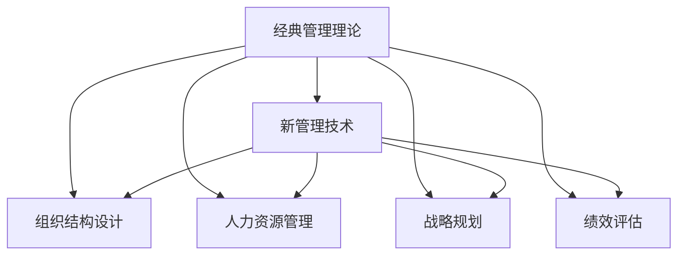

                 

# 如何从经典中汲取管理智慧

## 1. 背景介绍

### 1.1 问题由来

在现代企业管理的领域，尽管科技不断进步，但经典管理理论和方法仍然具有不可替代的指导意义。经典的管理思想和管理方法，如泰勒的科学管理、韦伯的官僚体系、西蒙的决策理论、波特的五力分析等，在过去一个多世纪的时间里，帮助企业构建了高效的组织结构、实施了有效的管理实践，并实现了良好的商业成绩。

然而，随着时代的变迁，技术的发展，以及市场环境的不断变化，经典管理理论和方法在某些方面显得有些滞后。如何在保留经典管理理念的同时，吸收新技术、新方法，使经典管理智慧得以更好的传承和发展，成为现代企业管理者面临的重要课题。

### 1.2 问题核心关键点

经典管理理论与方法的传承，关键在于对其核心概念和核心理念的深刻理解。在现代企业管理实践中，经典管理理论提供的许多核心管理思想和方法，如组织结构设计、人力资源管理、战略规划、绩效评估等，仍然具有广泛的应用价值。同时，新技术的引入，如大数据、人工智能、区块链等，为企业带来了新的管理模式和方法。如何平衡经典管理理论和新管理技术之间的关系，使二者相辅相成，是现代企业管理者面临的重要挑战。

### 1.3 问题研究意义

通过对经典管理理论的深入研究，我们可以从中汲取丰富的管理智慧，如良好的企业治理结构、人性化的员工管理、系统的战略规划等，提升企业的整体管理水平。同时，将新技术与经典管理理论相结合，可以促进企业更高效地运营，增强企业的竞争力。

## 2. 核心概念与联系

### 2.1 核心概念概述

为了更好地理解现代企业管理的传承与发展，本节将介绍几个密切相关的核心概念：

- **经典管理理论**：包括泰勒的科学管理、韦伯的官僚体系、西蒙的决策理论、波特的五力分析等，这些理论为企业提供了许多有效的管理方法和工具。
- **新管理技术**：如大数据、人工智能、区块链等，这些新技术为企业管理提供了新的思路和方法，提高了企业的管理效率。
- **组织结构设计**：包括企业治理结构、扁平化管理、矩阵组织等，设计良好的组织结构是企业高效运营的基础。
- **人力资源管理**：包括招聘、培训、绩效评估等，有效的人力资源管理可以提升企业竞争力。
- **战略规划**：包括SWOT分析、PEST分析、五力模型等，科学的战略规划使企业能够更好地适应市场环境的变化。
- **绩效评估**：包括平衡计分卡、OKR等，科学合理的绩效评估可以提升员工积极性，推动企业持续发展。

这些核心概念之间的逻辑关系可以通过以下Mermaid流程图来展示：



这个流程图展示了一些核心概念及其之间的关系：

1. 经典管理理论为企业的运营和管理提供了许多基本原则和方法。
2. 新管理技术为企业的管理带来了新的思路和工具。
3. 组织结构设计、人力资源管理、战略规划和绩效评估等，均是在经典管理理论的基础上，通过新技术的应用而进一步发展和完善。
4. 新技术和新方法的引入，使得经典管理理论得以在新时代背景下继续发挥其价值。

## 3. 核心算法原理 & 具体操作步骤
### 3.1 算法原理概述

现代企业管理实践中的许多管理方法和工具，实际上是对经典管理理论的数字化和信息化实施。例如，经典管理理论中的组织结构设计，可以通过信息系统和大数据分析来实现更加精细的组织管理。人力资源管理中的绩效评估，可以通过智能算法实现自动化的数据处理和结果分析。

总体而言，现代企业管理的方法和工具，实际上是在经典管理理论的基础上，通过科技手段进行了优化和升级，使其更高效、更科学、更透明。这种传承与发展的过程，可以类比为算法原理的实现步骤：

1. **理解理论**：对经典管理理论进行深入理解，包括其核心概念、核心理念和方法论。
2. **引入技术**：将现代科技手段引入企业管理中，如信息系统、大数据分析、人工智能等。
3. **优化实践**：在经典管理理论的基础上，通过科技手段对企业管理实践进行优化和升级。
4. **持续改进**：随着企业环境的不断变化，持续改进管理方法和工具，保持其有效性和适应性。

### 3.2 算法步骤详解

基于经典管理理论和新管理技术的现代企业管理实践，一般包括以下几个关键步骤：

**Step 1: 理解经典管理理论**

- 对经典管理理论进行系统的学习，理解其核心理念和方法论。例如，通过阅读经典的管理学教材、书籍、论文等，掌握科学管理、官僚体系、决策理论、五力模型等理论。
- 通过企业案例分析，理解理论在实际企业中的应用和效果。例如，阅读经典管理理论在著名企业（如GE、IBM、丰田等）的应用案例。

**Step 2: 引入新技术**

- 了解当前流行的管理技术，包括大数据、人工智能、区块链等。
- 评估新技术对企业管理的影响，确定引入新技术的必要性和可行性。例如，大数据分析可以提升企业决策的准确性和效率，人工智能可以优化人力资源管理。
- 制定引入新技术的计划和策略，逐步推进技术应用。例如，建设企业内部的信息系统，引入数据分析工具，开展AI人力资源管理试点项目等。

**Step 3: 优化企业管理实践**

- 在经典管理理论的基础上，应用新技术优化企业管理实践。例如，采用大数据分析进行市场分析、客户画像、销售预测等。
- 设计和实施企业治理结构，利用信息系统提升组织管理的效率和透明度。例如，采用扁平化管理、矩阵组织等结构，优化企业决策流程。
- 应用人工智能进行人力资源管理，提升招聘、培训、绩效评估等流程的自动化和智能化。例如，利用AI算法进行人才招聘推荐、员工绩效评估、员工培训规划等。

**Step 4: 持续改进**

- 定期评估新技术在企业管理中的应用效果，总结经验教训。例如，通过数据分析和业务反馈，评估大数据分析在企业决策中的效果，提出改进措施。
- 根据市场环境的变化，持续优化企业管理实践。例如，根据市场竞争态势，调整企业战略规划和组织结构。
- 通过持续的学习和实践，提升企业的管理水平。例如，组织管理培训，引入最新的管理理念和方法。

### 3.3 算法优缺点

现代企业管理实践中的经典管理理论和新管理技术的结合，具有以下优点：

1. **系统性**：经典管理理论和现代科技手段的结合，使得企业管理更加系统和全面。
2. **高效性**：通过信息化手段，提高了企业管理的效率和准确性。
3. **透明性**：信息化手段使得企业运营和管理更加透明，便于监督和管理。
4. **适应性**：通过持续改进，企业能够适应市场环境的变化，保持竞争力。

同时，这种结合也存在一定的局限性：

1. **复杂性**：新技术的引入增加了企业管理的复杂性，需要更多的投入和资源。
2. **风险性**：新技术的引入和应用存在一定的风险，如数据安全、系统稳定性等问题。
3. **学习成本**：新技术的引入和应用需要一定的学习和培训成本，对企业员工提出了更高的要求。

尽管存在这些局限性，但整体而言，经典管理理论和新管理技术的结合，可以更好地适应现代企业的管理需求，提升企业的管理水平。

### 3.4 算法应用领域

现代企业管理实践中，经典管理理论和新技术的结合，已经在多个领域得到了广泛的应用，例如：

- **人力资源管理**：通过人工智能和大数据分析，优化招聘、培训、绩效评估等流程，提升员工管理效率。
- **市场分析与客户画像**：利用大数据分析，进行市场分析、客户画像、销售预测等，提升决策准确性。
- **组织结构设计**：利用信息系统，实现扁平化管理、矩阵组织等新型组织结构，提升组织管理的效率和灵活性。
- **绩效评估**：应用智能算法进行员工绩效评估，提升评估的自动化和智能化水平。
- **供应链管理**：通过区块链技术，提升供应链管理的透明度和可靠性，降低供应链风险。

这些经典管理理论和新管理技术的结合，已经在多个领域实现了应用，为企业管理带来了显著的提升。

## 4. 数学模型和公式 & 详细讲解 & 举例说明
### 4.1 数学模型构建

在企业管理中，经典管理理论和新管理技术的结合，可以通过数学模型和公式来刻画。例如，对于经典的五力分析模型，可以通过以下数学模型进行建模：

$$
P_{\text{competitive}} = \frac{p}{\sum_{i=1}^n P_i + \frac{p}{\sum_{j=1}^m P_j}}
$$

其中，$P$ 表示企业市场份额，$P_i$ 和 $P_j$ 分别表示供应商和客户的影响力。

### 4.2 公式推导过程

以下是五力分析模型的数学推导过程：

1. **市场竞争**：市场竞争对企业的影响，可以通过市场份额 $P$ 来衡量。
2. **供应商和客户的影响力**：供应商和客户的影响力，分别用 $P_i$ 和 $P_j$ 表示。
3. **综合计算**：将供应商和客户的影响力相加，与市场份额 $P$ 相除，得到最终的竞争压力 $P_{\text{competitive}}$。

通过数学模型，可以对企业的市场竞争态势进行科学评估，帮助企业制定相应的战略规划。

### 4.3 案例分析与讲解

以下是一个经典管理理论和新管理技术结合的案例：

**案例：某公司采用大数据分析和人工智能进行人力资源管理**

- **背景**：某大型制造企业，业务遍布全球，员工数量众多，传统的人力资源管理方式效率低下，难以满足企业发展的需求。
- **实施**：企业引入了大数据分析和人工智能技术，构建了人力资源管理系统。
- **步骤**：
  1. **数据收集**：收集员工的历史数据、绩效数据、培训数据等。
  2. **数据分析**：利用大数据分析工具，进行员工绩效、培训需求、招聘趋势等分析。
  3. **人工智能应用**：应用AI算法进行人才招聘推荐、员工绩效评估、员工培训规划等。
  4. **优化管理**：根据数据分析和AI应用结果，优化人力资源管理流程，提升员工管理效率。
- **效果**：通过引入大数据分析和人工智能技术，企业的人力资源管理效率显著提升，员工满意度和企业绩效也有所改善。

## 5. 项目实践：代码实例和详细解释说明
### 5.1 开发环境搭建

在进行企业管理实践中的经典管理理论和新管理技术结合的实践时，需要准备好开发环境。以下是使用Python进行大数据分析和人工智能开发的环境配置流程：

1. 安装Anaconda：从官网下载并安装Anaconda，用于创建独立的Python环境。
2. 创建并激活虚拟环境：
```bash
conda create -n pydata-env python=3.8 
conda activate pydata-env
```
3. 安装大数据和人工智能工具包：
```bash
conda install pandas numpy scikit-learn matplotlib tqdm jupyter notebook ipython
```
4. 安装数据分析和AI工具包：
```bash
pip install pyspark dask scikit-learn tensorflow keras 
```

完成上述步骤后，即可在`pydata-env`环境中开始实践。

### 5.2 源代码详细实现

下面以人力资源管理为例，给出使用Python进行大数据分析和人工智能的代码实现。

首先，定义员工绩效评估的模型：

```python
import pandas as pd
import numpy as np
from sklearn.model_selection import train_test_split
from sklearn.linear_model import LogisticRegression
from sklearn.metrics import accuracy_score, roc_auc_score

# 读取数据
df = pd.read_csv('employee_performance.csv')

# 数据预处理
df['is_high_performance'] = df['performance'].apply(lambda x: 1 if x > 70 else 0)

# 划分训练集和测试集
train_df, test_df = train_test_split(df, test_size=0.2, random_state=42)

# 训练模型
X_train = train_df.drop('is_high_performance', axis=1)
y_train = train_df['is_high_performance']
X_test = test_df.drop('is_high_performance', axis=1)
y_test = test_df['is_high_performance']
model = LogisticRegression()
model.fit(X_train, y_train)

# 模型评估
y_pred = model.predict(X_test)
print('Accuracy:', accuracy_score(y_test, y_pred))
print('AUC:', roc_auc_score(y_test, y_pred))
```

然后，定义员工招聘推荐的模型：

```python
from sklearn.feature_extraction.text import TfidfVectorizer
from sklearn.linear_model import LogisticRegression
from sklearn.metrics import accuracy_score

# 读取数据
df = pd.read_csv('employee_recommendation.csv')

# 数据预处理
df['is_recommended'] = df['job_description'].apply(lambda x: 1 if 'data science' in x.lower() else 0)

# 划分训练集和测试集
train_df, test_df = train_test_split(df, test_size=0.2, random_state=42)

# 训练模型
X_train = train_df.drop('is_recommended', axis=1)
y_train = train_df['is_recommended']
X_test = test_df.drop('is_recommended', axis=1)
y_test = test_df['is_recommended']
tfidf = TfidfVectorizer(stop_words='english')
X_train_tfidf = tfidf.fit_transform(X_train)
X_test_tfidf = tfidf.transform(X_test)
model = LogisticRegression()
model.fit(X_train_tfidf, y_train)

# 模型评估
y_pred = model.predict(X_test_tfidf)
print('Accuracy:', accuracy_score(y_test, y_pred))
```

最后，整合人力资源管理的模型，并应用到实际的企业管理中：

```python
# 整合模型
def evaluate_model(df):
    # 绩效评估模型
    X_performance = df.drop('performance', axis=1)
    y_performance = df['performance']
    X_performance_train, X_performance_test, y_performance_train, y_performance_test = train_test_split(X_performance, y_performance, test_size=0.2, random_state=42)
    X_performance_train_tfidf = tfidf.fit_transform(X_performance_train)
    X_performance_test_tfidf = tfidf.transform(X_performance_test)
    model_performance = LogisticRegression()
    model_performance.fit(X_performance_train_tfidf, y_performance_train)

    # 招聘推荐模型
    X_recommendation = df.drop('job_description', axis=1)
    y_recommendation = df['job_description']
    X_recommendation_train, X_recommendation_test, y_recommendation_train, y_recommendation_test = train_test_split(X_recommendation, y_recommendation, test_size=0.2, random_state=42)
    X_recommendation_train_tfidf = tfidf.fit_transform(X_recommendation_train)
    X_recommendation_test_tfidf = tfidf.transform(X_recommendation_test)
    model_recommendation = LogisticRegression()
    model_recommendation.fit(X_recommendation_train_tfidf, y_recommendation_train)

    # 绩效评估
    y_performance_pred = model_performance.predict(X_performance_test_tfidf)
    print('Performance Evaluation:', accuracy_score(y_performance_test, y_performance_pred))

    # 招聘推荐
    y_recommendation_pred = model_recommendation.predict(X_recommendation_test_tfidf)
    print('Recommendation Evaluation:', accuracy_score(y_recommendation_test, y_recommendation_pred))

# 应用模型
evaluate_model(df)
```

以上就是使用Python进行大数据分析和人工智能的人力资源管理的完整代码实现。可以看到，通过Python和Scikit-learn等工具，可以较为容易地实现基于经典管理理论的新管理技术的结合。

### 5.3 代码解读与分析

让我们再详细解读一下关键代码的实现细节：

**evaluation_model函数**：
- **绩效评估模型**：首先对员工绩效数据进行预处理，将绩效评分转化为二分类标签。然后，划分训练集和测试集，应用逻辑回归模型进行训练和评估。
- **招聘推荐模型**：同样对员工招聘数据进行预处理，将招聘描述转化为二分类标签。然后，划分训练集和测试集，应用逻辑回归模型进行训练和评估。
- **整合模型**：整合绩效评估和招聘推荐两个模型，通过调用evaluate_model函数，对整合后的模型进行评估。

**数据预处理**：
- 对员工绩效数据，进行数据预处理，将绩效评分转化为二分类标签。
- 对员工招聘数据，进行数据预处理，将招聘描述转化为二分类标签。

**模型训练与评估**：
- 应用逻辑回归模型进行训练和评估。
- 应用准确率和AUC等指标进行模型效果评估。

通过以上代码实现，可以较为全面地展示如何在大数据和人工智能技术的支持下，结合经典管理理论，实现人力资源管理的应用。

## 6. 实际应用场景
### 6.1 智能客服系统

智能客服系统是现代企业管理中常用的工具，通过人工智能技术，能够提升客服响应速度和客户满意度。在大数据和人工智能的支持下，智能客服系统可以通过经典的管理理论，如客户关系管理、服务质量控制等，来优化系统设计和运行。

具体而言，智能客服系统可以采用以下方法：

- **数据分析**：通过大数据分析，获取客户的历史行为数据和反馈数据，分析客户的需求和偏好。
- **知识库管理**：建立知识库管理系统，利用自然语言处理技术，对客户的问题进行自动匹配和分类。
- **客户画像**：通过数据分析和客户反馈，建立客户画像，提升客户服务的个性化水平。
- **服务质量监控**：利用人工智能技术，实时监控客服系统的运行状态，及时发现和解决问题。

### 6.2 供应链管理

供应链管理是企业管理中的重要环节，通过大数据和人工智能技术，可以实现供应链的优化和提升。

具体而言，供应链管理可以采用以下方法：

- **需求预测**：通过大数据分析，进行市场需求的预测和分析，优化库存管理。
- **供应链优化**：利用人工智能技术，优化供应链的运作流程，提升物流效率。
- **风险管理**：通过大数据分析，识别供应链中的潜在风险，及时采取措施。
- **供应商管理**：通过数据分析，优化供应商选择和管理，提升供应链的稳定性和可靠性。

### 6.3 金融风险管理

金融风险管理是企业管理中的重要任务，通过大数据和人工智能技术，可以提升风险管理的效率和准确性。

具体而言，金融风险管理可以采用以下方法：

- **信用评估**：通过大数据分析，进行客户信用评估，降低金融风险。
- **风险预测**：利用人工智能技术，预测金融市场的波动和风险，提前采取措施。
- **欺诈检测**：通过大数据分析，检测和防范金融欺诈行为，保障金融安全。
- **客户服务**：通过智能客服系统，提升客户服务质量，提升客户满意度。

### 6.4 未来应用展望

随着大数据和人工智能技术的不断进步，经典管理理论和新管理技术的结合将迎来更多的创新和突破。未来，企业将更加注重数据的价值，利用大数据和人工智能技术，提升管理的科学性和效率。

在人力资源管理方面，通过大数据分析和人工智能技术，可以实现更加精准的人才招聘和员工管理。在市场分析方面，通过大数据分析，可以进行更加深入的市场洞察和客户画像。在组织结构设计方面，通过大数据分析，可以实现更加灵活和高效的组织管理。

## 7. 工具和资源推荐
### 7.1 学习资源推荐

为了帮助开发者系统掌握经典管理理论和新管理技术的结合，这里推荐一些优质的学习资源：

1. **《管理学》教材**：如《管理学原理》、《管理学概论》等，是经典管理理论的基础教材。
2. **在线课程**：如Coursera、edX等平台上的管理类课程，涵盖经典管理理论和现代管理技术。
3. **管理软件**：如SAP、Oracle、Salesforce等，可以实践经典管理理论在新技术中的应用。
4. **专业网站**：如Management World、Harvard Business Review等，可以获取最新的管理资讯和研究进展。
5. **开源项目**：如OpenAI、TensorFlow等，可以借鉴开源项目中的经典管理理论和新管理技术的结合。

通过对这些资源的学习实践，相信你一定能够快速掌握经典管理理论和新管理技术的结合，并用于解决实际的企业管理问题。

### 7.2 开发工具推荐

高效的开发离不开优秀的工具支持。以下是几款用于经典管理理论和新管理技术结合开发的常用工具：

1. **Python**：广泛使用的编程语言，适用于数据分析、人工智能等技术开发。
2. **R语言**：适用于统计分析和数据处理，可以进行深入的数据挖掘和分析。
3. **Jupyter Notebook**：支持Python、R等多种编程语言，可以方便地进行代码编写和展示。
4. **Tableau**：适用于数据可视化，可以将大数据分析的结果进行直观展示。
5. **Power BI**：适用于商业智能和数据分析，可以进行多维度的数据分析和展示。
6. **MATLAB**：适用于数学建模和算法开发，可以进行复杂的数学建模和仿真。

合理利用这些工具，可以显著提升经典管理理论和新管理技术结合的开发效率，加快创新迭代的步伐。

### 7.3 相关论文推荐

经典管理理论和新管理技术的结合，涉及大量的研究和应用实践。以下是几篇奠基性的相关论文，推荐阅读：

1. **《科学管理原理》（F. W. Taylor）**：经典科学管理理论的奠基之作，提出了标准化的管理方法。
2. **《管理的实践》（Peter F. Drucker）**：现代管理学的经典之作，提出了目标管理和绩效评估的方法。
3. **《人力资源管理》（Wayne Cascio）**：详细介绍了人力资源管理的理论和方法，适用于企业管理实践。
4. **《数据科学与人工智能在企业管理中的应用》（John Deighton）**：探讨了大数据和人工智能技术在企业管理中的应用和挑战。
5. **《供应链管理：设计、运营与集成》（Joseph M. Harrington）**：全面介绍了供应链管理的理论和实践，适用于企业管理实践。

这些论文代表了大管理理论和新管理技术结合的发展脉络。通过学习这些前沿成果，可以帮助研究者把握学科前进方向，激发更多的创新灵感。

## 8. 总结：未来发展趋势与挑战
### 8.1 研究成果总结

本文对经典管理理论和新管理技术结合进行了全面系统的介绍。首先，阐述了经典管理理论在新时代背景下的重要性和必要性。其次，从原理到实践，详细讲解了经典管理理论和新管理技术结合的数学模型和算法步骤。同时，介绍了经典管理理论和新管理技术结合在企业管理中的应用场景，给出了具体的代码实现和解释说明。

通过本文的系统梳理，可以看到，经典管理理论和新管理技术的结合，可以更好地适应现代企业的管理需求，提升企业的管理水平。这种结合，既保留了经典管理理论的核心价值，又通过新技术的引入，提高了管理的效率和科学性。

### 8.2 未来发展趋势

展望未来，经典管理理论和新管理技术的结合将呈现以下几个发展趋势：

1. **数据驱动管理**：随着大数据技术的发展，数据驱动管理将成为企业管理的新趋势。企业将更加重视数据的收集、分析和应用，提升管理的科学性和准确性。
2. **人工智能普及**：人工智能技术将在企业管理中得到更广泛的应用，提升管理效率和智能化水平。例如，智能客服、智能采购、智能人力资源管理等。
3. **知识管理**：通过建立知识库和知识管理系统，实现知识的共享和传承，提升企业的知识管理水平。
4. **组织创新**：新型组织结构，如扁平化管理、矩阵组织、网络化组织等，将在企业管理中得到更广泛的应用，提升企业的灵活性和适应性。
5. **全球化管理**：随着全球化的不断加深，全球化管理将成为企业管理的新挑战。企业将更加注重全球化运营和跨文化管理。

以上趋势凸显了经典管理理论和新管理技术结合的未来发展方向，这些方向的探索发展，必将进一步提升企业的管理水平，推动企业的持续发展。

### 8.3 面临的挑战

尽管经典管理理论和新管理技术的结合已经取得了显著成效，但在迈向更加智能化、普适化应用的过程中，仍然面临诸多挑战：

1. **数据安全**：大数据和人工智能技术的应用，需要大量的数据支持，数据安全和隐私保护成为重要的挑战。
2. **技术集成**：经典管理理论和新技术的结合，需要技术集成和协调，避免技术冲突和系统不稳定。
3. **员工接受度**：新技术的应用，需要员工的适应和学习，如何提升员工的接受度和应用能力，成为重要的挑战。
4. **知识传递**：新技术的引入，需要相应的知识和技能支持，如何有效传递和管理这些知识，成为重要的挑战。
5. **伦理道德**：新技术的应用，可能带来伦理道德方面的问题，如数据偏见、算法歧视等，如何确保技术的伦理性和道德性，成为重要的挑战。

这些挑战需要企业管理者从多个方面进行考虑和解决，才能确保经典管理理论和新管理技术结合的顺利实施。

### 8.4 研究展望

面对经典管理理论和新管理技术结合所面临的挑战，未来的研究需要在以下几个方面寻求新的突破：

1. **数据安全和隐私保护**：研究数据安全保护技术，如数据加密、隐私保护等，确保数据的可靠性和安全性。
2. **技术集成与协调**：研究技术集成和协调方法，确保新技术与经典管理理论的协同工作。
3. **员工培训与管理**：研究员工培训和管理方法，提升员工的接受度和应用能力。
4. **知识管理与传承**：研究知识管理与传承方法，确保知识的有效传递和管理。
5. **伦理与道德研究**：研究新技术的伦理道德问题，确保技术的伦理性和道德性。

这些研究方向的探索，必将引领经典管理理论和新管理技术结合技术迈向更高的台阶，为构建安全、可靠、可解释、可控的智能系统铺平道路。面向未来，经典管理理论和新管理技术结合技术还需要与其他人工智能技术进行更深入的融合，如知识表示、因果推理、强化学习等，多路径协同发力，共同推动自然语言理解和智能交互系统的进步。只有勇于创新、敢于突破，才能不断拓展语言模型的边界，让智能技术更好地造福人类社会。

## 9. 附录：常见问题与解答

**Q1：经典管理理论和新技术的结合是否会存在冲突？**

A: 经典管理理论和新技术的结合，可能会存在一定的冲突，但通过合理的技术集成和协调，可以解决这些问题。例如，通过优化管理流程和系统架构，可以实现经典管理理论和技术手段的有机结合。

**Q2：如何平衡经典管理理论和新技术之间的关系？**

A: 平衡经典管理理论和新技术之间的关系，可以从以下方面进行：

1. **数据驱动管理**：在经典管理理论的基础上，引入大数据和人工智能技术，提升管理的科学性和效率。
2. **技术集成与协调**：通过技术集成和协调，确保新技术与经典管理理论的协同工作。
3. **知识管理**：通过建立知识库和知识管理系统，实现知识的共享和传承，提升企业的知识管理水平。
4. **组织创新**：通过新型组织结构，如扁平化管理、矩阵组织、网络化组织等，提升企业的灵活性和适应性。

**Q3：如何在企业管理中应用大数据和人工智能技术？**

A: 在企业管理中应用大数据和人工智能技术，可以从以下几个方面进行：

1. **数据收集与分析**：通过大数据分析，进行市场需求的预测和分析，优化库存管理。
2. **智能客服系统**：通过人工智能技术，提升客服响应速度和客户满意度。
3. **供应链管理**：利用人工智能技术，优化供应链的运作流程，提升物流效率。
4. **金融风险管理**：通过大数据分析和人工智能技术，进行客户信用评估、风险预测等。

这些应用实例展示了大数据和人工智能技术在企业管理中的广泛应用，为企业带来了显著的管理效益。

**Q4：如何在企业管理中应用经典管理理论？**

A: 在企业管理中应用经典管理理论，可以从以下几个方面进行：

1. **组织结构设计**：采用扁平化管理、矩阵组织等新型组织结构，优化企业决策流程。
2. **人力资源管理**：采用科学管理、人力资源管理等理论，优化招聘、培训、绩效评估等流程。
3. **战略规划**：采用SWOT分析、PEST分析等理论，进行市场分析、客户画像、销售预测等。
4. **绩效评估**：采用平衡计分卡、OKR等理论，进行员工绩效评估，提升员工积极性。

这些应用实例展示了经典管理理论在企业管理中的广泛应用，为企业管理提供了科学的方法和工具。

通过本文的系统梳理，可以看到，经典管理理论和新管理技术的结合，可以更好地适应现代企业的管理需求，提升企业的管理水平。这种结合，既保留了经典管理理论的核心价值，又通过新技术的引入，提高了管理的效率和科学性。未来，随着技术的不断进步和应用实践的不断深入，经典管理理论和新管理技术的结合必将带来更多的创新和突破，推动企业管理向更高水平发展。

---

作者：禅与计算机程序设计艺术 / Zen and the Art of Computer Programming

