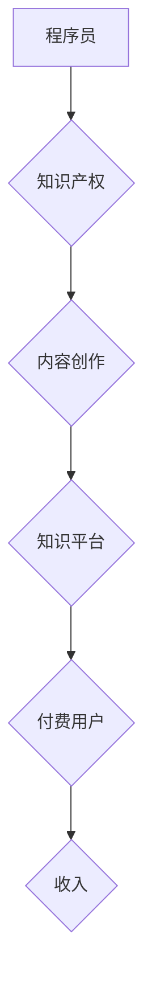

                 

## 程序员利用知识付费实现被动收入的秘诀

> 关键词：知识付费、程序员、被动收入、在线课程、内容创作、技术博客、社区运营、知识产权

### 1. 背景介绍

在当今数字时代，互联网为知识分享和传播提供了前所未有的平台。程序员作为技术领域的重要力量，拥有丰富的专业知识和经验，可以通过知识付费的方式实现被动收入，并构建自己的个人品牌。

知识付费是指通过提供有价值的知识和技能，向付费用户收取费用的一种商业模式。对于程序员来说，知识付费可以是多种形式的，例如：

* **在线课程:**  录制和销售编程语言、框架、工具、算法等方面的课程。
* **技术博客:**  撰写高质量的技术文章，并通过广告、会员订阅等方式获得收益。
* **社区运营:**  建立技术社区，提供技术交流、解答问题、分享资源等服务，并通过会员订阅、赞助等方式获得收入。
* **电子书:**  编写编程指南、技术手册、案例分析等电子书，并通过在线平台销售。
* **开源项目:**  开发开源软件，并通过企业赞助、捐赠等方式获得收入。

### 2. 核心概念与联系

知识付费的核心概念是价值交换。程序员需要提供有价值的知识和技能，满足付费用户的需求，才能获得收入。

**知识付费的价值链:**



**知识付费的模式:**

* **订阅模式:** 用户支付定期费用，获得持续更新的内容和服务。
* **课程模式:** 用户购买一次性课程，获得一次性知识和技能。
* **会员模式:** 用户支付会员费用，获得社区资源、专属内容、技术支持等服务。

### 3. 核心算法原理 & 具体操作步骤

#### 3.1  算法原理概述

知识付费的成功关键在于算法原理的应用，包括内容推荐算法、用户画像算法、付费转化算法等。

* **内容推荐算法:** 根据用户的兴趣、行为、历史记录等信息，推荐相关的知识付费内容。
* **用户画像算法:** 通过分析用户的行为数据，构建用户的兴趣、需求、消费习惯等画像，为内容创作和营销提供参考。
* **付费转化算法:** 分析用户的付费行为，优化付费流程，提高付费转化率。

#### 3.2  算法步骤详解

1. **数据收集:** 收集用户的行为数据，例如浏览记录、搜索记录、购买记录、评论记录等。
2. **数据清洗:** 对收集到的数据进行清洗，去除无效数据、重复数据等。
3. **特征提取:** 从数据中提取用户的特征，例如兴趣标签、年龄、性别、职业等。
4. **模型训练:** 使用机器学习算法，训练内容推荐、用户画像、付费转化等模型。
5. **模型评估:** 对模型进行评估，调整模型参数，提高模型精度。
6. **模型部署:** 将训练好的模型部署到线上环境，实时推荐内容、分析用户画像、优化付费转化等。

#### 3.3  算法优缺点

* **优点:** 能够精准推荐内容，提高用户体验，提升付费转化率。
* **缺点:** 需要大量的用户数据进行训练，模型训练成本较高，算法需要不断优化和更新。

#### 3.4  算法应用领域

* **电商平台:** 推荐商品、个性化营销。
* **社交媒体:** 推荐好友、内容推荐。
* **教育平台:** 推荐课程、个性化学习路径。
* **知识付费平台:** 推荐课程、用户画像分析、付费转化优化。

### 4. 数学模型和公式 & 详细讲解 & 举例说明

#### 4.1  数学模型构建

知识付费平台的推荐系统可以使用协同过滤算法，该算法基于用户的历史行为数据，预测用户对特定内容的兴趣。

**协同过滤算法的数学模型:**

$$
r_{ui} = \frac{\sum_{j \in N(u)} s_{uj} \cdot s_{uj} }{\sum_{j \in N(u)} s_{uj}^2}
$$

其中:

* $r_{ui}$: 用户 $u$ 对物品 $i$ 的评分
* $s_{uj}$: 用户 $u$ 对物品 $j$ 的评分
* $N(u)$: 用户 $u$ 评分过的物品集合

#### 4.2  公式推导过程

协同过滤算法的核心思想是，如果用户 $u$ 和用户 $v$ 对相似的物品有相似的评分，那么用户 $u$ 可能会对用户 $v$ 评分高的物品感兴趣。

公式推导过程：

1. 计算用户 $u$ 和所有其他用户 $v$ 的相似度。
2. 根据相似度，计算用户 $u$ 对物品 $i$ 的预测评分。

#### 4.3  案例分析与讲解

假设用户 $A$ 和用户 $B$ 都评分过三部电影，评分如下：

| 用户 | 电影 1 | 电影 2 | 电影 3 |
|---|---|---|---|
| A | 5 | 3 | 4 |
| B | 4 | 5 | 3 |

根据公式，可以计算用户 $A$ 对电影 4 的预测评分。

### 5. 项目实践：代码实例和详细解释说明

#### 5.1  开发环境搭建

* **操作系统:** Linux/macOS/Windows
* **编程语言:** Python
* **框架:** Flask/Django
* **数据库:** MySQL/PostgreSQL
* **工具:** Git、Docker

#### 5.2  源代码详细实现

```python
# Flask 框架示例

from flask import Flask, render_template

app = Flask(__name__)

@app.route('/')
def index():
    return render_template('index.html')

if __name__ == '__main__':
    app.run(debug=True)
```

#### 5.3  代码解读与分析

* **Flask 框架:** 用于构建简单的 Web 应用。
* **render_template():** 用于渲染 HTML 模板。
* **index.html:**  HTML 模板文件，用于展示网站内容。

#### 5.4  运行结果展示

运行代码后，访问 `http://127.0.0.1:5000/`，即可看到网站首页。

### 6. 实际应用场景

* **在线编程课程平台:** 提供编程语言、框架、工具等方面的课程，并通过订阅模式、课程购买模式等方式获得收入。
* **技术博客平台:**  程序员可以撰写技术文章，并通过广告、会员订阅等方式获得收益。
* **技术社区平台:**  程序员可以建立技术社区，提供技术交流、解答问题、分享资源等服务，并通过会员订阅、赞助等方式获得收入。

### 6.4  未来应用展望

* **人工智能驱动的知识付费:**  利用人工智能技术，实现更精准的内容推荐、个性化学习路径、智能化的付费转化等。
* **元宇宙下的知识付费:**  在元宇宙环境中，构建沉浸式的学习体验，提供更丰富的知识付费内容和服务。
* **区块链技术的应用:**  利用区块链技术，保障知识产权，实现更公平的知识付费模式。

### 7. 工具和资源推荐

#### 7.1  学习资源推荐

* **Coursera:**  提供各种在线课程，包括编程、数据科学、人工智能等。
* **Udemy:**  提供各种在线课程，包括编程、设计、营销等。
* **Udacity:**  提供技术领域的在线课程，例如人工智能、云计算等。

#### 7.2  开发工具推荐

* **VS Code:**  一款功能强大的代码编辑器。
* **PyCharm:**  一款专为 Python 开发的 IDE。
* **Git:**  一款用于版本控制的工具。

#### 7.3  相关论文推荐

* **Collaborative Filtering for Implicit Feedback Datasets**
* **Deep Learning for Recommender Systems**
* **Knowledge Graph Embedding: A Survey**

### 8. 总结：未来发展趋势与挑战

#### 8.1  研究成果总结

知识付费为程序员提供了实现被动收入的新途径，并推动了技术知识的传播和共享。

#### 8.2  未来发展趋势

知识付费将朝着更智能化、个性化、沉浸式的方向发展。

#### 8.3  面临的挑战

* **知识产权保护:**  如何有效保护知识产权，防止知识盗版。
* **内容质量控制:**  如何保证知识付费内容的质量和权威性。
* **用户信任问题:**  如何建立用户对知识付费平台的信任。

#### 8.4  研究展望

未来研究将重点关注人工智能技术在知识付费领域的应用，以及如何构建更公平、更可持续的知识付费模式。

### 9. 附录：常见问题与解答

* **如何选择合适的知识付费平台?**

  需要考虑平台的流量、用户群体、收费模式、服务支持等因素。

* **如何创作高质量的知识付费内容?**

  需要深入了解用户需求，提供有价值的知识和技能，并以清晰、易懂的方式呈现。

* **如何推广自己的知识付费内容?**

  可以通过社交媒体、技术社区、博客等渠道进行推广。


作者：禅与计算机程序设计艺术 / Zen and the Art of Computer Programming 
<end_of_turn>

