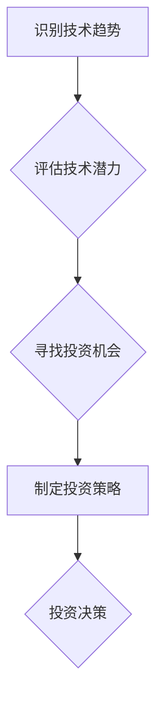

                 

## 程序员如何利用技术趋势进行投资

> 关键词：人工智能、机器学习、区块链、云计算、大数据、程序员、投资、技术趋势

## 1. 背景介绍

作为一名程序员，我们每天都在与技术打交道，对新兴技术趋势有着敏锐的感知。然而，仅仅了解技术趋势还不够，如何将这些趋势转化为投资机会，并从中获益，则是需要我们深入思考和实践的问题。

近年来，科技发展日新月异，涌现出许多颠覆性的技术，例如人工智能、机器学习、区块链、云计算、大数据等。这些技术正在深刻地改变着我们的生活和工作方式，同时也为投资者带来了前所未有的机遇。

对于程序员来说，我们拥有独特的优势，可以更深入地理解这些技术的原理和应用场景，从而更好地把握投资方向。

## 2. 核心概念与联系

**2.1  技术趋势与投资机会**

技术趋势的本质是社会需求和科技进步的结合，它指代着未来一段时间内技术发展方向和应用场景的演变。

投资机会则来自于技术趋势带来的市场需求和商业模式创新。当技术趋势成熟并被广泛应用时，就会催生出新的市场和商业模式，为投资者带来丰厚的回报。

**2.2  程序员的优势**

程序员拥有以下优势，可以帮助我们更好地把握技术趋势和投资机会：

* **技术理解力:** 程序员对技术原理和应用场景有着深入的理解，可以更准确地判断技术的潜力和发展方向。
* **实践经验:** 程序员拥有丰富的实践经验，可以更直观地感受到技术的应用场景和市场需求。
* **学习能力:** 程序员具备强大的学习能力，可以快速掌握新技术和新知识，并将其应用于投资决策。
* **网络资源:** 程序员拥有广泛的网络资源，可以获取到最新的技术资讯和市场动态。

**2.3  技术趋势分析框架**

为了更好地把握技术趋势和投资机会，我们可以采用以下分析框架：

* **识别趋势:** 通过关注科技新闻、行业报告、学术研究等渠道，识别出潜在的技术趋势。
* **评估潜力:** 分析技术的原理、应用场景、市场需求、竞争格局等因素，评估技术的潜力和风险。
* **寻找机会:** 寻找技术趋势带来的投资机会，例如投资相关公司、项目、基金等。
* **制定策略:** 制定合理的投资策略，控制风险，并实现投资目标。

**2.4  Mermaid 流程图**



## 3. 核心算法原理 & 具体操作步骤

**3.1  算法原理概述**

在投资领域，程序员可以利用机器学习算法来分析市场数据、预测股价走势、识别投资机会。

机器学习算法的核心原理是通过训练模型，让模型能够从数据中学习规律，并根据学习到的规律进行预测或决策。

常见的机器学习算法包括：

* **线性回归:** 用于预测连续变量，例如股价。
* **逻辑回归:** 用于预测分类变量，例如股票是否上涨。
* **决策树:** 用于分类和预测，可以处理非线性关系。
* **支持向量机:** 用于分类和回归，可以处理高维数据。
* **神经网络:** 用于复杂模式识别，例如图像识别、语音识别等。

**3.2  算法步骤详解**

利用机器学习算法进行投资决策的具体步骤如下：

1. **数据收集:** 收集相关市场数据，例如股票价格、交易量、新闻数据、经济指标等。
2. **数据预处理:** 对收集到的数据进行清洗、转换、特征工程等处理，使其适合机器学习算法的训练。
3. **模型选择:** 根据投资目标和数据特点，选择合适的机器学习算法。
4. **模型训练:** 使用训练数据训练模型，调整模型参数，使其能够准确地预测或决策。
5. **模型评估:** 使用测试数据评估模型的性能，例如准确率、召回率、F1-score等。
6. **模型部署:** 将训练好的模型部署到实际应用环境中，用于进行实时预测或决策。

**3.3  算法优缺点**

机器学习算法在投资领域具有以下优点：

* **数据驱动:** 基于大量数据进行分析和预测，能够识别出人类难以发现的规律。
* **自动化:** 可以自动化执行投资决策，提高效率和准确性。
* **可扩展性:** 可以处理海量数据，并扩展到多个投资领域。

但也存在以下缺点：

* **数据依赖:** 模型的性能取决于数据的质量和数量。
* **黑盒效应:** 某些算法的决策过程难以解释，难以理解模型的决策逻辑。
* **过拟合:** 模型可能过拟合训练数据，导致在实际应用中性能下降。

**3.4  算法应用领域**

机器学习算法在投资领域有着广泛的应用，例如：

* **股票预测:** 预测股票价格走势，识别投资机会。
* **风险管理:** 评估投资风险，制定风险控制策略。
* **资产配置:** 根据投资目标和风险承受能力，优化资产配置。
* **交易策略:** 自动执行交易策略，提高投资效率。

## 4. 数学模型和公式 & 详细讲解 & 举例说明

**4.1  数学模型构建**

在机器学习算法中，常用的数学模型包括线性回归模型、逻辑回归模型、决策树模型等。

例如，线性回归模型假设目标变量与输入变量之间存在线性关系，可以用以下公式表示：

$$y = \beta_0 + \beta_1x_1 + \beta_2x_2 + ... + \beta_nx_n + \epsilon$$

其中：

* $y$ 是目标变量
* $x_1, x_2, ..., x_n$ 是输入变量
* $\beta_0, \beta_1, \beta_2, ..., \beta_n$ 是模型参数
* $\epsilon$ 是误差项

**4.2  公式推导过程**

线性回归模型的参数可以通过最小二乘法进行估计。最小二乘法的目标是找到一组参数，使得模型预测值与实际值之间的误差平方和最小。

具体推导过程较为复杂，涉及微积分和线性代数知识。

**4.3  案例分析与讲解**

假设我们想要预测房价，输入变量包括房屋面积、房间数量、地理位置等。

我们可以使用线性回归模型来建立房价预测模型。

通过训练模型，我们可以得到模型参数，例如：

* $\beta_0 = 100000$
* $\beta_1 = 500$
* $\beta_2 = 10000$

这意味着：

* 房屋面积每增加1平方米，房价增加500元。
* 房屋房间数量每增加1个，房价增加10000元。

## 5. 项目实践：代码实例和详细解释说明

**5.1  开发环境搭建**

为了进行机器学习项目实践，我们需要搭建相应的开发环境。

常用的开发环境包括：

* **Python:** 作为机器学习领域的编程语言，Python拥有丰富的库和框架，例如Scikit-learn、TensorFlow、PyTorch等。
* **Jupyter Notebook:** 用于编写和执行Python代码，并可视化数据和模型结果。
* **云计算平台:** 例如AWS、Azure、GCP等，提供强大的计算资源和存储服务。

**5.2  源代码详细实现**

以下是一个使用Scikit-learn库进行股票预测的简单代码实例：

```python
import pandas as pd
from sklearn.model_selection import train_test_split
from sklearn.linear_model import LinearRegression
from sklearn.metrics import mean_squared_error

# 加载股票数据
data = pd.read_csv('stock_data.csv')

# 选择特征变量和目标变量
features = ['Open', 'High', 'Low', 'Volume']
target = 'Close'

# 将数据分割为训练集和测试集
X_train, X_test, y_train, y_test = train_test_split(data[features], data[target], test_size=0.2)

# 创建线性回归模型
model = LinearRegression()

# 训练模型
model.fit(X_train, y_train)

# 预测测试集数据
y_pred = model.predict(X_test)

# 计算模型性能
mse = mean_squared_error(y_test, y_pred)
print('Mean Squared Error:', mse)
```

**5.3  代码解读与分析**

这段代码首先加载股票数据，然后选择特征变量和目标变量。

接着，将数据分割为训练集和测试集，用于训练和评估模型。

创建线性回归模型，并使用训练数据进行训练。

最后，使用训练好的模型预测测试集数据，并计算模型性能。

**5.4  运行结果展示**

运行代码后，会输出模型的平均平方误差（MSE）值，该值越小，模型的预测性能越好。

## 6. 实际应用场景

**6.1  投资组合优化**

程序员可以利用机器学习算法对投资组合进行优化，根据投资目标、风险承受能力和市场数据，构建最优的投资组合，以最大化收益并最小化风险。

**6.2  交易策略开发**

程序员可以开发基于机器学习的交易策略，例如趋势跟踪策略、均线交叉策略、突破策略等，自动执行交易，提高投资效率。

**6.3  风险管理**

程序员可以利用机器学习算法识别潜在的投资风险，例如市场波动风险、信用风险、流动性风险等，并制定相应的风险控制策略。

**6.4  未来应用展望**

随着人工智能技术的不断发展，程序员在投资领域将发挥越来越重要的作用。

未来，我们将看到更多基于人工智能的投资工具和服务出现，例如智能投资顾问、自动交易平台、风险预警系统等，为投资者提供更精准、更便捷、更安全的投资服务。

## 7. 工具和资源推荐

**7.1  学习资源推荐**

* **在线课程:** Coursera、edX、Udacity等平台提供丰富的机器学习课程。
* **书籍:** 《Python机器学习》、《深度学习》等书籍是学习机器学习的经典教材。
* **博客和论坛:** Kaggle、Towards Data Science等网站提供大量的机器学习博客文章和论坛讨论。

**7.2  开发工具推荐**

* **Python:** 作为机器学习领域的编程语言，Python拥有丰富的库和框架，例如Scikit-learn、TensorFlow、PyTorch等。
* **Jupyter Notebook:** 用于编写和执行Python代码，并可视化数据和模型结果。
* **云计算平台:** 例如AWS、Azure、GCP等，提供强大的计算资源和存储服务。

**7.3  相关论文推荐**

* **《机器学习》** by Tom Mitchell
* **《深度学习》** by Ian Goodfellow, Yoshua Bengio, and Aaron Courville

## 8. 总结：未来发展趋势与挑战

**8.1  研究成果总结**

近年来，人工智能技术在投资领域取得了显著的成果，例如：

* **股票预测:** 机器学习算法能够识别股票价格走势的规律，提高股票预测的准确性。
* **风险管理:** 机器学习算法能够识别潜在的投资风险，帮助投资者制定更有效的风险控制策略。
* **资产配置:** 机器学习算法能够根据投资目标和风险承受能力，优化资产配置，提高投资收益。

**8.2  未来发展趋势**

未来，人工智能技术在投资领域的应用将更加广泛和深入，例如：

* **个性化投资:** 基于用户的投资目标、风险承受能力和个人偏好，提供个性化的投资建议和服务。
* **自动投资:** 基于人工智能算法，自动执行投资决策，提高投资效率和收益。
* **智能风控:** 利用人工智能技术，识别和防范金融风险，提高金融系统的稳定性。

**8.3  面临的挑战**

人工智能技术在投资领域的应用也面临着一些挑战，例如：

* **数据质量:** 机器学习算法的性能取决于数据的质量和数量，而金融数据的获取和处理难度较大。
* **模型解释性:** 某些人工智能算法的决策过程难以解释，难以理解模型的决策逻辑。
* **监管风险:** 人工智能技术在投资领域的应用需要符合相关法律法规，监管政策的制定和完善是关键。

**8.4  研究展望**

未来，我们需要继续加强人工智能技术在投资领域的应用研究，解决上述挑战，并推动人工智能技术在投资领域的健康发展。

## 9. 附录：常见问题与解答

**9.1  如何选择合适的机器学习算法？**

选择合适的机器学习算法取决于具体的投资目标、数据特点和模型性能要求。

例如，如果想要预测连续变量，可以选择线性回归模型；如果想要识别分类变量，可以选择逻辑回归模型。

**9.2  如何评估机器学习模型的性能？**

常用的模型性能评估指标包括准确率、召回率、F1-score、平均平方误差等。

选择合适的评估指标取决于具体的投资目标和数据特点。

**9.3  如何应对数据质量问题？**

数据质量问题是机器学习模型性能的重要影响因素。

我们可以通过以下方法应对数据质量问题：

* 数据清洗：去除数据中的噪声、缺失值和重复数据。
* 数据转换：将数据转换为适合机器学习算法的格式。
* 数据特征工程：提取数据中的特征，提高模型的预测性能。


作者：禅与计算机程序设计艺术 / Zen and the Art of Computer Programming<end_of_turn>

