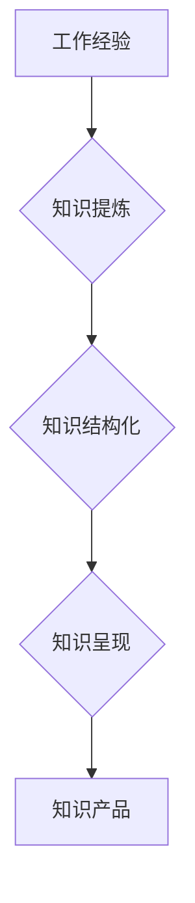

                 

## 程序员如何将工作经验转化为知识产品

> 关键词：工作经验、知识产品、技术博客、技术文档、在线课程、开源项目、技术分享、知识积累、技术传播

## 1. 背景介绍

在当今科技日新月异的时代，程序员的工作经验是宝贵的财富。然而，很多程序员往往将自己的经验局限于个人项目或公司内部，未能将其有效转化为可供他人学习和借鉴的知识产品。 

知识产品，是指将知识、技能、经验等抽象化、体系化，并以某种形式呈现出来，供他人学习、使用或参考的产品。它可以是技术博客文章、技术文档、在线课程、开源项目、技术分享演讲等多种形式。

将工作经验转化为知识产品，不仅可以提升个人品牌价值，扩大影响力，还能帮助他人学习成长，促进技术进步。

## 2. 核心概念与联系

### 2.1 工作经验与知识产品

工作经验是程序员在实际工作中积累的技能、知识和见解。它包含了代码编写、问题解决、项目管理、团队合作等方面的经验。知识产品则是将这些经验进行提炼、整理、加工，以易于理解和使用的形式呈现出来。

### 2.2 知识产品类型

知识产品种类繁多，常见类型包括：

* **技术博客文章:**  分享技术知识、经验和见解，可以是技术教程、案例分析、工具介绍等。
* **技术文档:**  对某个技术或产品进行详细的说明和解释，可以是API文档、用户手册、开发指南等。
* **在线课程:**  以视频、文字、互动练习等形式，系统地教授某个技术或技能。
* **开源项目:**  将自己的代码开源，供他人学习和使用，并通过社区讨论和贡献，不断完善和改进。
* **技术分享演讲:**  在会议、论坛等场合，分享自己的技术经验和见解。

### 2.3 知识产品架构

将工作经验转化为知识产品，需要遵循一定的架构，确保知识的完整性和易用性。

## 3. 核心算法原理 & 具体操作步骤

### 3.1 算法原理概述

将工作经验转化为知识产品，本质上是一种知识提炼和结构化的过程。 

* **知识提炼:**  从工作经验中抽取关键信息，例如技术要点、解决问题的方法、经验教训等。
* **知识结构化:**  将提炼出的知识进行分类、组织、关联，构建知识体系。

### 3.2 算法步骤详解

1. **记录工作经验:**  在工作过程中，及时记录遇到的问题、解决方法、心得体会等，可以利用笔记软件、博客等工具。
2. **分析工作经验:**  定期回顾记录的经验，分析其中的规律、模式和关键点。
3. **提炼知识点:**  从分析结果中提炼出可供他人学习和借鉴的知识点，例如算法、设计模式、工具使用技巧等。
4. **构建知识体系:**  将提炼出的知识点进行分类、组织、关联，构建知识体系，例如按照技术领域、应用场景、难度等级等进行分类。
5. **选择知识产品形式:**  根据知识内容和目标受众，选择合适的知识产品形式，例如技术博客文章、技术文档、在线课程等。
6. **撰写或制作知识产品:**  根据选择的知识产品形式，撰写或制作相应的知识产品内容。
7. **发布和推广知识产品:**  将知识产品发布到合适的平台，并进行推广，例如技术博客、开源平台、社交媒体等。

### 3.3 算法优缺点

* **优点:**  可以有效地将工作经验转化为可供他人学习和借鉴的知识产品，提升个人品牌价值，扩大影响力。
* **缺点:**  需要投入时间和精力进行知识提炼和结构化，需要不断学习和更新知识，才能保持知识产品的价值。

### 3.4 算法应用领域

* **软件开发:**  将开发经验转化为技术博客文章、开发指南、开源项目等。
* **数据科学:**  将数据分析经验转化为数据处理方法、模型构建技巧等。
* **人工智能:**  将人工智能开发经验转化为算法原理、模型应用案例等。

## 4. 数学模型和公式 & 详细讲解 & 举例说明

### 4.1 数学模型构建

将工作经验转化为知识产品，可以借助数学模型进行量化分析和评估。例如，可以构建一个知识价值模型，将知识的价值与知识的复杂度、实用性、影响力等因素进行关联。

### 4.2 公式推导过程

假设知识价值模型如下：

$$
Value = f(Complexity, Usability, Influence)
$$

其中：

* **Value:**  知识价值
* **Complexity:**  知识复杂度
* **Usability:**  知识实用性
* **Influence:**  知识影响力

可以根据实际情况，对每个因素进行量化评估，并根据经验或数据分析，确定函数f的具体形式。

### 4.3 案例分析与讲解

例如，对于一个开源项目，其知识价值可以根据以下因素进行评估：

* **Complexity:**  项目代码复杂度、技术难度等。
* **Usability:**  项目文档清晰度、易用性等。
* **Influence:**  项目贡献者数量、社区活跃度等。

通过对这些因素进行量化评估，可以得到该开源项目的知识价值，并将其与其他开源项目进行比较，从而判断其价值大小。

## 5. 项目实践：代码实例和详细解释说明

### 5.1 开发环境搭建

将工作经验转化为知识产品，需要选择合适的开发环境。例如，撰写技术博客文章可以使用Markdown编辑器，制作在线课程可以使用视频录制软件和在线教学平台。

### 5.2 源代码详细实现

开源项目需要编写源代码，并进行测试和调试。

### 5.3 代码解读与分析

开源项目需要提供详细的代码注释和文档，以便他人理解和使用代码。

### 5.4 运行结果展示

开源项目需要提供运行结果展示，以便他人验证代码的功能和效果。

## 6. 实际应用场景

### 6.1 技术博客文章

技术博客文章可以分享技术知识、经验和见解，例如算法讲解、工具使用技巧、项目案例分析等。

### 6.2 技术文档

技术文档可以对某个技术或产品进行详细的说明和解释，例如API文档、用户手册、开发指南等。

### 6.3 在线课程

在线课程可以系统地教授某个技术或技能，例如编程语言学习、数据分析方法、人工智能应用等。

### 6.4 未来应用展望

随着人工智能、大数据等技术的快速发展，未来知识产品的应用场景将更加广泛，例如：

* **个性化学习:**  根据用户的学习需求和水平，提供个性化的知识产品。
* **沉浸式学习:**  利用虚拟现实、增强现实等技术，打造沉浸式的学习体验。
* **知识图谱:**  构建知识图谱，将不同领域的知识进行关联，实现知识的跨领域融合。

## 7. 工具和资源推荐

### 7.1 学习资源推荐

* **在线学习平台:**  Coursera、edX、Udemy等
* **技术博客:**  Hacker News、Medium、Stack Overflow等
* **开源社区:**  GitHub、GitLab、SourceForge等

### 7.2 开发工具推荐

* **Markdown编辑器:**  Typora、Visual Studio Code等
* **视频录制软件:**  OBS Studio、Camtasia等
* **在线教学平台:**  Teachable、Thinkific等

### 7.3 相关论文推荐

* **Knowledge Management:**  Davenport, T. H., & Prusak, L. (1998). Working knowledge: How organizations manage what they know. Harvard Business School Press.
* **Open Source Software:**  Raymond, E. S. (2001). The cathedral and the bazaar: Musings on Linux and open source by an accidental revolutionary. O'Reilly Media, Inc.

## 8. 总结：未来发展趋势与挑战

### 8.1 研究成果总结

将工作经验转化为知识产品，可以有效地提升个人品牌价值，扩大影响力，促进技术进步。

### 8.2 未来发展趋势

未来知识产品的应用场景将更加广泛，例如个性化学习、沉浸式学习、知识图谱等。

### 8.3 面临的挑战

* **知识提炼和结构化:**  如何有效地提炼和结构化工作经验，使其易于理解和使用。
* **知识产品形式创新:**  如何创新知识产品形式，满足不同用户的学习需求。
* **知识产品推广和传播:**  如何有效地推广和传播知识产品，使其被更多人所了解和使用。

### 8.4 研究展望

未来研究可以集中在以下几个方面：

* **人工智能辅助知识提炼:**  利用人工智能技术，自动提炼和结构化工作经验。
* **个性化知识产品推荐:**  根据用户的学习需求和水平，推荐个性化的知识产品。
* **知识产品质量评估:**  建立知识产品质量评估体系，确保知识产品的准确性和实用性。

## 9. 附录：常见问题与解答

### 9.1 如何选择合适的知识产品形式？

选择合适的知识产品形式需要根据知识内容和目标受众进行考虑。例如，对于技术教程，可以选择技术博客文章或在线课程形式；对于项目案例分析，可以选择技术博客文章或视频演示形式。

### 9.2 如何进行知识产品推广？

知识产品推广可以利用多种渠道，例如技术博客、社交媒体、开源社区等。

### 9.3 如何评估知识产品的价值？

知识产品的价值可以根据知识的复杂度、实用性、影响力等因素进行评估。

作者：禅与计算机程序设计艺术 / Zen and the Art of Computer Programming 

<end_of_turn>

