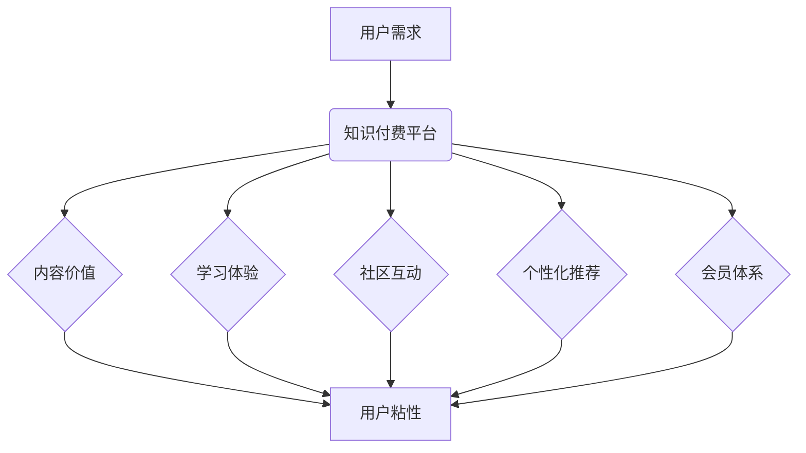

                 

## 程序员如何提高知识付费的用户粘性

> 关键词：知识付费、用户粘性、程序员、在线学习、内容运营、社区建设、用户体验

## 1. 背景介绍

知识付费行业近年来蓬勃发展，尤其是在科技领域，程序员群体对技术技能的提升需求日益增长。在线课程、书籍、视频教程等知识付费产品层出不穷，但如何提高用户粘性，让用户持续付费，成为众多知识付费平台和创作者面临的共同挑战。

程序员的学习特点决定了知识付费产品的运营需要特殊策略。程序员通常具有强烈的学习驱动力和独立思考能力，他们更倾向于实用性强的知识和技能，也更注重学习体验和互动性。因此，单纯依靠高质量的内容无法保证用户粘性，需要结合多种策略，打造一个完整的知识付费生态系统。

## 2. 核心概念与联系

**2.1 用户粘性**

用户粘性是指用户对某个产品或服务的持续使用和参与程度。对于知识付费平台来说，用户粘性体现在用户持续学习、付费和参与社区等方面。

**2.2 知识付费平台的用户粘性提升策略**

知识付费平台可以通过以下策略提升用户粘性：

* **内容价值：** 提供高质量、实用、有针对性的内容，满足用户学习需求。
* **学习体验：** 打造便捷、高效、有趣的学习体验，例如互动式课程、项目实践、在线答疑等。
* **社区互动：** 建立活跃的学习社区，让用户互相交流、学习和支持。
* **个性化推荐：** 根据用户的学习进度、兴趣和需求，提供个性化的学习推荐。
* **会员体系：** 设计会员体系，提供专属福利和服务，增强用户粘性。

**2.3 核心概念关系图**



## 3. 核心算法原理 & 具体操作步骤

**3.1 算法原理概述**

用户粘性提升算法通常基于用户行为数据分析和机器学习模型。通过分析用户的学习行为、兴趣偏好、学习进度等数据，算法可以预测用户的学习需求和学习路径，并推荐个性化的学习内容和服务，从而提高用户粘性。

**3.2 算法步骤详解**

1. **数据收集:** 收集用户的学习行为数据，例如学习时长、学习进度、课程评价、社区参与等。
2. **数据预处理:** 对收集到的数据进行清洗、转换和特征工程，例如将学习时长转换为学习频率、将课程评价转换为评分等。
3. **模型训练:** 使用机器学习算法，例如协同过滤、深度学习等，对预处理后的数据进行训练，构建用户粘性预测模型。
4. **模型评估:** 使用测试数据对模型进行评估，评估模型的准确性和有效性。
5. **个性化推荐:** 基于训练好的模型，对用户进行个性化推荐，例如推荐相关的课程、学习资源、学习伙伴等。
6. **效果监控:** 持续监控模型的效果，并根据实际情况进行模型调整和优化。

**3.3 算法优缺点**

* **优点:** 能够根据用户的学习行为和兴趣偏好进行个性化推荐，提高用户学习体验和学习效率。
* **缺点:** 需要大量的用户行为数据进行训练，模型训练和部署成本较高。

**3.4 算法应用领域**

用户粘性提升算法广泛应用于在线教育、电商、社交媒体等领域，例如：

* **在线教育:** 推荐个性化的学习课程和学习资源，提高用户学习效率和学习兴趣。
* **电商:** 推荐个性化的商品和服务，提高用户购买转化率。
* **社交媒体:** 推荐个性化的内容和好友，提高用户活跃度和粘性。

## 4. 数学模型和公式 & 详细讲解 & 举例说明

**4.1 数学模型构建**

用户粘性可以被定义为用户在特定时间段内与平台的交互频率和深度。我们可以使用以下数学模型来表示用户粘性：

$$
粘性 = \frac{总交互次数}{总用户数} \times \frac{平均交互时长}{平台活跃时间}
$$

其中：

* 总交互次数：用户在特定时间段内与平台的所有交互次数，例如访问页面、观看视频、参与讨论等。
* 总用户数：平台在特定时间段内的总用户数。
* 平均交互时长：用户每次与平台的平均交互时长。
* 平台活跃时间：平台在特定时间段内的总活跃时间。

**4.2 公式推导过程**

该公式的推导过程基于以下假设：

* 用户的交互次数和时长与用户粘性成正比。
* 平台的活跃时间是用户参与平台的参考时间尺度。

**4.3 案例分析与讲解**

假设一个在线学习平台，在过去一个月内，总用户数为1000人，总交互次数为5000次，平均交互时长为30分钟，平台活跃时间为30天。

根据上述公式，该平台的用户粘性为：

$$
粘性 = \frac{5000}{1000} \times \frac{30}{30} = 5
$$

该数值表示用户平均每月与平台交互5次，说明该平台的用户粘性较高。

## 5. 项目实践：代码实例和详细解释说明

**5.1 开发环境搭建**

* Python 3.x
* Jupyter Notebook
* scikit-learn

**5.2 源代码详细实现**

```python
import pandas as pd
from sklearn.metrics.pairwise import cosine_similarity

# 加载用户行为数据
data = pd.read_csv('user_behavior.csv')

# 数据预处理
# ...

# 计算用户之间的余弦相似度
user_similarity = cosine_similarity(data.T)

# 获取用户推荐的课程
def recommend_courses(user_id, top_n=5):
    # ...

# 用户粘性计算
def calculate_stickiness(data):
    # ...
```

**5.3 代码解读与分析**

* 代码首先加载用户行为数据，并进行预处理，例如将学习时长转换为学习频率等。
* 然后使用余弦相似度算法计算用户之间的相似度，例如用户A和用户B学习过相同的课程，则他们的相似度较高。
* 基于用户相似度，可以推荐用户A可能感兴趣的课程，例如用户B学习过的课程。
* 最后，代码定义了计算用户粘性的函数，例如根据用户交互次数和时长计算粘性值。

**5.4 运行结果展示**

运行代码后，可以得到用户之间的相似度矩阵，以及针对特定用户的课程推荐列表。

## 6. 实际应用场景

**6.1 在线课程平台**

在线课程平台可以利用用户粘性提升算法，推荐个性化的课程和学习资源，提高用户学习效率和学习兴趣。例如，Coursera、Udemy等平台都采用了类似的算法，为用户提供个性化的学习体验。

**6.2 代码库平台**

代码库平台可以利用用户粘性提升算法，推荐用户可能感兴趣的代码库和开源项目，提高用户参与度和贡献度。例如，GitHub、GitLab等平台都采用了类似的算法，为用户提供个性化的代码推荐。

**6.3 技术社区**

技术社区可以利用用户粘性提升算法，推荐用户可能感兴趣的讨论话题和技术文章，提高用户参与度和活跃度。例如，Stack Overflow、Reddit等平台都采用了类似的算法，为用户提供个性化的技术内容推荐。

**6.4 未来应用展望**

随着人工智能技术的不断发展，用户粘性提升算法将会更加智能化和个性化。未来，我们可以期待看到更加精准的个性化推荐、更加丰富的学习体验和更加活跃的社区互动。

## 7. 工具和资源推荐

**7.1 学习资源推荐**

* **书籍:**
    * 《推荐系统实践》
    * 《机器学习》
* **在线课程:**
    * Coursera: 机器学习
    * Udemy: 数据科学与机器学习
* **博客:**
    * Towards Data Science
    * Analytics Vidhya

**7.2 开发工具推荐**

* **Python:**
    * scikit-learn
    * TensorFlow
    * PyTorch
* **数据分析工具:**
    * Pandas
    * NumPy
    * Matplotlib

**7.3 相关论文推荐**

* **协同过滤:**
    * "Collaborative Filtering: A User-Based Approach"
* **深度学习:**
    * "Deep Learning for Recommender Systems"

## 8. 总结：未来发展趋势与挑战

**8.1 研究成果总结**

用户粘性提升算法在知识付费平台的应用取得了显著成果，能够有效提高用户学习效率和学习兴趣，增强用户粘性。

**8.2 未来发展趋势**

未来，用户粘性提升算法将会更加智能化和个性化，例如：

* **多模态数据融合:** 将文本、图像、视频等多模态数据融合到算法中，提供更加全面的用户画像和个性化推荐。
* **动态学习路径:** 根据用户的学习进度和反馈，动态调整学习路径，提供更加个性化的学习体验。
* **人工智能驱动的社区建设:** 利用人工智能技术，自动生成学习内容、匹配学习伙伴、管理社区秩序，打造更加活跃和高效的学习社区。

**8.3 面临的挑战**

用户粘性提升算法也面临一些挑战，例如：

* **数据隐私保护:** 用户行为数据涉及个人隐私，需要采取有效的措施保护用户数据安全。
* **算法公平性:** 算法需要避免歧视和偏见，确保所有用户都能获得公平的学习机会。
* **用户信任:** 用户需要信任算法的推荐结果，平台需要建立良好的用户信任机制。

**8.4 研究展望**

未来，我们需要继续研究和探索更加智能、更加个性化、更加公平的用户粘性提升算法，为用户提供更加优质的学习体验，推动知识付费行业健康发展。

## 9. 附录：常见问题与解答

**9.1 如何提高用户粘性？**

提高用户粘性需要从多个方面入手，例如提供高质量的内容、打造便捷的学习体验、建立活跃的社区互动、设计个性化的会员体系等。

**9.2 用户粘性提升算法有哪些？**

常见的用户粘性提升算法包括协同过滤、深度学习等。

**9.3 如何评估用户粘性提升算法的效果？**

可以通过分析用户交互次数、学习时长、课程评价等指标来评估算法的效果。

**9.4 如何保护用户数据隐私？**

需要采取以下措施保护用户数据隐私：

* 明确用户数据使用协议，获得用户同意。
* 加密用户数据，防止数据泄露。
* 定期对数据安全进行评估和测试。


作者：禅与计算机程序设计艺术 / Zen and the Art of Computer Programming 
<end_of_turn>

