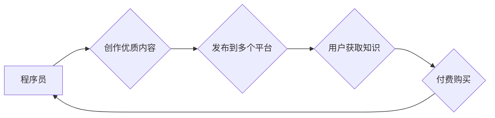

                 

## 程序员的知识付费跨平台内容策略

> 关键词：知识付费、程序员、跨平台、内容策略、技术博客、在线课程、社区运营、品牌建设

## 1. 背景介绍

随着互联网技术的飞速发展，程序员的需求量不断攀升，而优质的编程知识和技能也变得越来越珍贵。知识付费作为一种新型的商业模式，在技术领域迅速崛起，为程序员提供了展示专业能力、分享经验、获取收益的平台。然而，在知识付费市场竞争日益激烈的今天，单纯依靠单一平台难以获得持续的成功。程序员需要制定跨平台的内容策略，才能在众多竞争者中脱颖而出，构建自己的知识付费品牌。

## 2. 核心概念与联系

**2.1 知识付费的核心概念**

知识付费是指通过提供有价值的知识、技能和服务，向用户收取费用的一种商业模式。它打破了传统教育模式的限制，让知识的获取更加便捷、高效和个性化。

**2.2 跨平台内容策略的核心概念**

跨平台内容策略是指将知识付费内容发布到多个平台，并通过整合资源、优化用户体验，实现内容的广泛传播和价值最大化。

**2.3 核心概念联系**

知识付费和跨平台内容策略相互关联，共同构成了程序员知识付费的完整生态系统。

* 知识付费为程序员提供了收入来源，激励他们持续创作优质内容。
* 跨平台内容策略则帮助程序员扩大内容的影响力，吸引更多用户，从而实现知识付费的规模化发展。

**Mermaid 流程图**



## 3. 核心算法原理 & 具体操作步骤

**3.1 算法原理概述**

跨平台内容策略的核心算法原理是基于用户行为分析和内容分发优化。通过收集用户数据，分析用户偏好和内容消费习惯，并根据不同平台的特点进行内容调整和分发，可以最大化内容的曝光率和转化率。

**3.2 算法步骤详解**

1. **用户数据收集:** 利用平台提供的分析工具，收集用户访问、阅读、评论、分享等行为数据。
2. **用户画像构建:** 对收集到的用户数据进行分析，构建用户画像，包括用户年龄、性别、职业、兴趣爱好、知识水平等。
3. **内容分发策略制定:** 根据用户画像和平台特点，制定不同的内容分发策略。例如，针对技术博客平台，可以采用关键词优化、内容分类、社群互动等策略；针对在线课程平台，可以采用推荐算法、个性化学习路径、互动答疑等策略。
4. **内容优化和调整:** 定期分析内容的曝光率、转化率等指标，并根据数据反馈进行内容优化和调整。例如，可以调整内容标题、摘要、图片、视频等元素，以提高用户点击率和阅读时长。
5. **平台运营和推广:** 利用平台提供的推广工具，进行内容推广和社区运营，扩大内容的影响力。例如，可以参与平台活动、与其他创作者合作、建立粉丝社群等。

**3.3 算法优缺点**

* **优点:** 能够根据用户需求和平台特点进行个性化内容分发，提高内容的曝光率和转化率。
* **缺点:** 需要收集和分析大量用户数据，并进行持续的算法优化和调整，有一定的技术门槛和成本投入。

**3.4 算法应用领域**

跨平台内容策略的算法原理广泛应用于各种知识付费平台，例如技术博客、在线课程、付费社区等。

## 4. 数学模型和公式 & 详细讲解 & 举例说明

**4.1 数学模型构建**

我们可以用一个简单的数学模型来表示跨平台内容策略的价值最大化目标：

$$
V = \sum_{i=1}^{n} \alpha_i \cdot C_i \cdot E_i \cdot T_i
$$

其中：

* $V$：知识付费平台的总价值
* $n$：平台数量
* $\alpha_i$：平台 $i$ 的权重系数，反映平台的流量、用户活跃度等因素
* $C_i$：平台 $i$ 上的内容质量
* $E_i$：平台 $i$ 上的内容曝光率
* $T_i$：平台 $i$ 上的用户转化率

**4.2 公式推导过程**

该公式的推导过程基于以下假设：

* 知识付费平台的价值取决于平台数量、内容质量、内容曝光率和用户转化率。
* 不同平台的权重系数不同，反映了平台的差异化特点。
* 内容质量、曝光率和转化率之间存在一定的关联性。

**4.3 案例分析与讲解**

假设有两个知识付费平台，平台 A 是技术博客平台，平台 B 是在线课程平台。

* 平台 A 的流量较大，用户活跃度高，权重系数 $\alpha_A$ = 0.6
* 平台 B 的用户付费意愿强，转化率高，权重系数 $\alpha_B$ = 0.4

如果程序员在两个平台上发布相同质量的内容，但平台 A 的内容曝光率更高，平台 B 的转化率更高，那么根据公式，平台 A 的总价值会更高。

## 5. 项目实践：代码实例和详细解释说明

**5.1 开发环境搭建**

* 操作系统：Windows/macOS/Linux
* 编程语言：Python
* 开发工具：VS Code/Atom/Sublime Text
* 必要的库：requests、BeautifulSoup、pandas

**5.2 源代码详细实现**

```python
import requests
from bs4 import BeautifulSoup
import pandas as pd

# 获取技术博客平台文章数据
def get_blog_data(url):
    response = requests.get(url)
    soup = BeautifulSoup(response.content, 'html.parser')
    articles = soup.find_all('article')
    data = []
    for article in articles:
        title = article.find('h2').text
        link = article.find('a')['href']
        data.append({'title': title, 'link': link})
    return pd.DataFrame(data)

# 获取在线课程平台课程数据
def get_course_data(url):
    response = requests.get(url)
    soup = BeautifulSoup(response.content, 'html.parser')
    courses = soup.find_all('div', class_='course')
    data = []
    for course in courses:
        title = course.find('h3').text
        price = course.find('span', class_='price').text
        data.append({'title': title, 'price': price})
    return pd.DataFrame(data)

# 合并数据并进行分析
if __name__ == '__main__':
    blog_data = get_blog_data('https://www.example-blog.com/')
    course_data = get_course_data('https://www.example-course.com/')
    combined_data = pd.concat([blog_data, course_data], ignore_index=True)
    print(combined_data)
```

**5.3 代码解读与分析**

这段代码实现了从两个不同平台获取内容数据的功能。

* `get_blog_data()` 函数从技术博客平台获取文章数据，包括文章标题和链接。
* `get_course_data()` 函数从在线课程平台获取课程数据，包括课程标题和价格。
* `pd.concat()` 函数将两个平台的数据合并成一个DataFrame，方便进行进一步的分析。

**5.4 运行结果展示**

运行这段代码后，会输出一个包含文章和课程数据的DataFrame，其中包含了文章标题、链接、课程标题和价格等信息。

## 6. 实际应用场景

**6.1 技术博客平台**

程序员可以通过技术博客平台分享自己的编程经验、技术文章、项目案例等，并通过广告、赞助、会员订阅等方式获得收益。

**6.2 在线课程平台**

程序员可以录制和上传自己的编程课程，并通过课程销售、会员订阅等方式获得收益。

**6.3 付费社区平台**

程序员可以建立自己的付费社区，提供技术交流、项目合作、职业指导等服务，并通过会员订阅、付费咨询等方式获得收益。

**6.4 未来应用展望**

随着人工智能、虚拟现实等技术的不断发展，知识付费平台将更加智能化、个性化和交互化。程序员可以利用这些新技术，开发更加创新、有趣、有价值的知识付费内容。

## 7. 工具和资源推荐

**7.1 学习资源推荐**

* **书籍:** 《程序员的自我修养》、《代码的艺术》
* **在线课程:** Coursera、Udemy、edX
* **技术博客:** Hacker News、Medium、GitHub Blog

**7.2 开发工具推荐**

* **内容管理系统:** WordPress、Ghost、Jekyll
* **在线课程平台:** Teachable、Thinkific、Kajabi
* **付费社区平台:** Patreon、Discord、Circle

**7.3 相关论文推荐**

* **知识付费商业模式研究**
* **跨平台内容分发策略优化**
* **人工智能在知识付费领域的应用**

## 8. 总结：未来发展趋势与挑战

**8.1 研究成果总结**

本文探讨了程序员知识付费跨平台内容策略的构建，包括核心概念、算法原理、代码实例、实际应用场景等方面。

**8.2 未来发展趋势**

* **个性化内容推荐:** 利用人工智能技术，为用户提供更加个性化的内容推荐。
* **沉浸式学习体验:** 利用虚拟现实、增强现实等技术，打造更加沉浸式的学习体验。
* **社区化学习模式:** 鼓励用户之间进行互动交流，共同学习和进步。

**8.3 面临的挑战**

* **内容质量保证:** 确保知识付费内容的质量和权威性。
* **用户隐私保护:** 妥善处理用户数据，保障用户隐私安全。
* **商业模式创新:** 探索更加可持续的商业模式，实现知识付费的长期发展。

**8.4 研究展望**

未来，我们将继续深入研究知识付费跨平台内容策略，探索更加智能化、个性化、交互化的知识付费模式，为程序员提供更加优质的知识服务。

## 9. 附录：常见问题与解答

**9.1 如何选择合适的知识付费平台？**

选择合适的知识付费平台需要考虑以下因素：

* 平台的流量和用户活跃度
* 平台的收费模式和分成比例
* 平台的功能和服务

**9.2 如何提高知识付费内容的质量？**

提高知识付费内容的质量需要以下几点：

* 内容要原创、有深度、有价值
* 内容要清晰易懂、结构合理、逻辑严谨
* 内容要结合实际案例，增强可操作性

**9.3 如何推广知识付费内容？**

推广知识付费内容可以采用以下方法：

* 社交媒体营销
* 搜索引擎优化
* 邮件营销
* 与其他创作者合作

作者：禅与计算机程序设计艺术 / Zen and the Art of Computer Programming


<end_of_turn>

