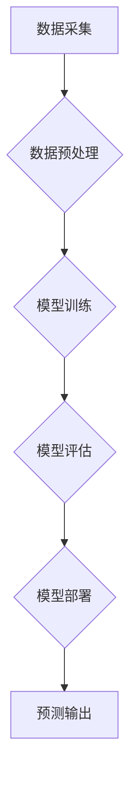

                 

## 端到端AI开发：从概念到实现

> 关键词：人工智能、机器学习、深度学习、端到端训练、模型开发、部署、优化

### 1. 背景介绍

人工智能（AI）正以惊人的速度发展，从语音识别到图像分类，再到自然语言处理，AI技术已经渗透到我们生活的方方面面。随着AI应用的日益广泛，对端到端AI开发的需求也越来越迫切。端到端AI开发是指从数据采集到模型部署的全流程开发，旨在简化开发流程，提高效率，并最终实现AI系统的自动化部署和维护。

传统的AI开发流程往往是分阶段的，需要开发人员分别处理数据预处理、特征工程、模型训练、模型评估等多个环节。这种分阶段开发模式存在着诸多弊端，例如：

* **信息孤岛:** 不同环节之间缺乏有效的沟通和协作，导致信息传递不畅，难以进行有效的迭代和优化。
* **效率低下:** 每个环节都需要独立开发和测试，开发周期长，效率低下。
* **维护成本高:** 模型更新和维护需要对多个环节进行调整，维护成本高昂。

端到端AI开发旨在解决这些问题，通过将整个开发流程整合在一起，实现自动化和高效化。

### 2. 核心概念与联系

端到端AI开发的核心概念是将数据输入和最终输出直接连接起来，通过一个完整的模型进行训练和预测。这种方式简化了开发流程，提高了模型的整体性能。

**Mermaid 流程图:**



**核心概念原理和架构:**

* **数据驱动:** 端到端AI开发的核心是数据，模型的训练和优化都依赖于数据的质量和数量。
* **自动化:** 整个开发流程尽可能自动化，从数据预处理到模型部署，都通过自动化工具和脚本进行完成。
* **迭代优化:** 端到端AI开发强调迭代优化，通过不断调整模型参数和训练数据，不断提高模型的性能。

### 3. 核心算法原理 & 具体操作步骤

#### 3.1  算法原理概述

端到端AI开发中常用的算法主要包括深度学习算法，例如卷积神经网络（CNN）、循环神经网络（RNN）和Transformer等。这些算法能够自动学习数据中的特征，并进行复杂的模式识别和预测。

#### 3.2  算法步骤详解

1. **数据收集和预处理:** 收集相关数据，并进行清洗、转换和格式化等预处理操作，以确保数据质量和模型训练的顺利进行。
2. **模型选择和架构设计:** 根据具体任务选择合适的深度学习算法，并设计模型的架构，包括层数、神经元数量、激活函数等参数。
3. **模型训练:** 使用训练数据训练模型，通过调整模型参数，使模型能够准确地预测输出。
4. **模型评估:** 使用测试数据评估模型的性能，例如准确率、召回率、F1-score等指标。
5. **模型优化:** 根据评估结果，调整模型参数、训练数据或模型架构，以提高模型的性能。
6. **模型部署:** 将训练好的模型部署到实际应用环境中，例如云平台、边缘设备等。

#### 3.3  算法优缺点

**优点:**

* **高精度:** 深度学习算法能够学习数据中的复杂模式，实现高精度的预测。
* **自动化特征提取:** 不需要人工进行特征工程，模型能够自动学习数据特征。
* **端到端训练:** 简化了开发流程，提高了效率。

**缺点:**

* **数据依赖:** 深度学习算法对数据质量和数量要求较高。
* **训练时间长:** 深度学习模型的训练时间通常较长。
* **可解释性差:** 深度学习模型的决策过程难以解释。

#### 3.4  算法应用领域

端到端AI开发技术广泛应用于各个领域，例如：

* **计算机视觉:** 图像识别、物体检测、图像分类、人脸识别等。
* **自然语言处理:** 文本分类、情感分析、机器翻译、对话系统等。
* **语音识别:** 语音转文本、语音助手等。
* **推荐系统:** 商品推荐、内容推荐等。

### 4. 数学模型和公式 & 详细讲解 & 举例说明

#### 4.1  数学模型构建

深度学习模型的核心是神经网络，它由多个层组成，每一层包含多个神经元。每个神经元接收来自上一层的输入，并通过激活函数进行处理，输出到下一层。

**神经网络模型:**

$$
y = f(W_L x_L + b_L)
$$

其中：

* $y$ 是输出值
* $x_L$ 是上一层的输出值
* $W_L$ 是当前层的权重矩阵
* $b_L$ 是当前层的偏置向量
* $f$ 是激活函数

#### 4.2  公式推导过程

模型训练的目标是找到最优的权重和偏置，使得模型的预测结果与实际值尽可能接近。常用的优化算法包括梯度下降法和其变种算法。

**梯度下降法:**

$$
W_{new} = W_{old} - \alpha \frac{\partial Loss}{\partial W}
$$

其中：

* $W_{new}$ 是更新后的权重
* $W_{old}$ 是旧的权重
* $\alpha$ 是学习率
* $\frac{\partial Loss}{\partial W}$ 是损失函数对权重的梯度

#### 4.3  案例分析与讲解

例如，在图像分类任务中，可以使用卷积神经网络（CNN）模型进行训练。CNN模型能够自动学习图像特征，并进行分类预测。

**案例分析:**

使用CNN模型进行猫狗分类，训练数据包含大量猫狗的图像，模型通过学习图像特征，能够区分猫和狗。

### 5. 项目实践：代码实例和详细解释说明

#### 5.1  开发环境搭建

使用Python语言和深度学习框架TensorFlow或PyTorch进行开发。

#### 5.2  源代码详细实现

```python
# 使用TensorFlow构建一个简单的CNN模型
import tensorflow as tf

# 定义模型结构
model = tf.keras.models.Sequential([
    tf.keras.layers.Conv2D(32, (3, 3), activation='relu', input_shape=(28, 28, 1)),
    tf.keras.layers.MaxPooling2D((2, 2)),
    tf.keras.layers.Conv2D(64, (3, 3), activation='relu'),
    tf.keras.layers.MaxPooling2D((2, 2)),
    tf.keras.layers.Flatten(),
    tf.keras.layers.Dense(10, activation='softmax')
])

# 编译模型
model.compile(optimizer='adam',
              loss='sparse_categorical_crossentropy',
              metrics=['accuracy'])

# 训练模型
model.fit(x_train, y_train, epochs=10)

# 评估模型
loss, accuracy = model.evaluate(x_test, y_test)
print('Test loss:', loss)
print('Test accuracy:', accuracy)
```

#### 5.3  代码解读与分析

* 代码首先使用TensorFlow框架构建一个简单的CNN模型。
* 模型结构包括两个卷积层、两个最大池化层、一个全连接层和一个softmax输出层。
* 模型使用Adam优化器、交叉熵损失函数和准确率作为评估指标进行训练。
* 训练完成后，使用测试数据评估模型的性能。

#### 5.4  运行结果展示

训练完成后，模型的准确率会随着训练轮数的增加而提高。

### 6. 实际应用场景

端到端AI开发技术在各个领域都有广泛的应用场景，例如：

#### 6.1  医疗诊断

使用深度学习模型进行医学图像分析，辅助医生进行疾病诊断。

#### 6.2  金融风险控制

使用机器学习模型进行金融数据分析，识别潜在的风险和欺诈行为。

#### 6.3  智能客服

使用自然语言处理模型构建智能客服系统，自动回复用户咨询。

#### 6.4  未来应用展望

随着人工智能技术的不断发展，端到端AI开发技术将有更广泛的应用场景，例如：

* **个性化教育:** 根据学生的学习情况，提供个性化的学习方案。
* **自动驾驶:** 使用深度学习模型进行车辆感知和决策，实现自动驾驶功能。
* **智能制造:** 使用机器学习模型进行生产过程优化，提高生产效率。

### 7. 工具和资源推荐

#### 7.1  学习资源推荐

* **书籍:**
    * 《深度学习》
    * 《机器学习实战》
* **在线课程:**
    * Coursera
    * edX
    * Udacity

#### 7.2  开发工具推荐

* **深度学习框架:** TensorFlow, PyTorch, Keras
* **云平台:** AWS, Azure, Google Cloud

#### 7.3  相关论文推荐

* **《ImageNet Classification with Deep Convolutional Neural Networks》**
* **《Attention Is All You Need》**

### 8. 总结：未来发展趋势与挑战

#### 8.1  研究成果总结

端到端AI开发技术取得了显著的成果，在各个领域都有广泛的应用。

#### 8.2  未来发展趋势

* **模型效率提升:** 研究更轻量级、更高效的深度学习模型。
* **可解释性增强:** 研究更易于解释的深度学习模型。
* **边缘计算:** 将AI模型部署到边缘设备，实现更快速的响应和更低的延迟。

#### 8.3  面临的挑战

* **数据安全和隐私:** 如何保护训练数据和模型的安全性。
* **模型偏见:** 如何避免模型学习到数据中的偏见。
* **伦理问题:** 如何确保AI技术的应用符合伦理道德规范。

#### 8.4  研究展望

未来，端到端AI开发技术将继续发展，并应用于更多领域，为人类社会带来更多福祉。

### 9. 附录：常见问题与解答

**常见问题:**

* **端到端AI开发和传统AI开发有什么区别？**

**解答:** 端到端AI开发将整个开发流程整合在一起，实现自动化和高效化，而传统AI开发是分阶段的，需要开发人员分别处理不同环节。

* **端到端AI开发有哪些技术难点？**

**解答:** 数据安全和隐私、模型偏见、伦理问题等。


作者：禅与计算机程序设计艺术 / Zen and the Art of Computer Programming 
<end_of_turn>

