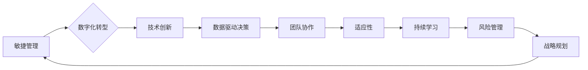

                 

## 管理者如何应对快速变化的商业环境

> 关键词：敏捷管理、数字化转型、技术创新、数据驱动决策、团队协作、适应性、持续学习、风险管理、战略规划

### 1. 背景介绍

当今商业环境瞬息万变，科技进步、市场竞争加剧、客户需求不断变化，都对企业提出了前所未有的挑战。传统的管理模式和思维方式难以适应这种快速变化，企业需要拥抱新技术、新模式，才能在激烈的竞争中立于不败之地。

对于管理者而言，应对快速变化的商业环境是至关重要的。他们需要具备敏锐的洞察力，及时识别趋势和机会，并制定相应的战略和行动计划。同时，还需要具备强大的领导力和执行力，带领团队快速适应变化，不断创新和改进。

### 2. 核心概念与联系

**2.1 敏捷管理**

敏捷管理是一种迭代开发和持续改进的管理方法，强调灵活性和响应能力。它强调团队协作、客户反馈和快速迭代，能够帮助企业快速适应变化，并不断优化产品和服务。

**2.2 数字化转型**

数字化转型是指企业利用数字化技术和手段，重构业务模式、运营流程和组织架构，以实现业务创新、效率提升和价值创造。

**2.3 技术创新**

技术创新是指企业利用新技术、新知识和新方法，开发出新的产品、服务或商业模式，以获得竞争优势。

**2.4 数据驱动决策**

数据驱动决策是指企业利用数据分析和挖掘技术，获取业务洞察，并以此为基础做出科学、合理的决策。

**2.5 团队协作**

团队协作是指团队成员之间相互配合、共同努力，以实现共同目标。

**2.6 适应性**

适应性是指企业能够快速识别和应对变化的能力。

**2.7 持续学习**

持续学习是指企业和员工不断学习新知识、新技能，以适应不断变化的商业环境。

**2.8 风险管理**

风险管理是指企业识别、评估和控制潜在风险，以保障业务安全和可持续发展。

**2.9 战略规划**

战略规划是指企业根据自身优势和市场环境，制定未来发展方向和行动计划。

**Mermaid 流程图**



### 3. 核心算法原理 & 具体操作步骤

**3.1 算法原理概述**

在快速变化的商业环境中，管理者需要快速分析大量数据，做出明智的决策。数据挖掘和机器学习算法可以帮助管理者识别趋势、预测未来和优化运营。

**3.2 算法步骤详解**

1. **数据收集和预处理:** 收集相关数据，并进行清洗、转换和格式化。
2. **特征工程:** 从原始数据中提取有价值的特征，用于训练模型。
3. **模型选择:** 根据业务需求选择合适的算法模型，例如回归、分类、聚类等。
4. **模型训练:** 使用训练数据训练模型，并调整模型参数。
5. **模型评估:** 使用测试数据评估模型性能，并进行调整和优化。
6. **模型部署:** 将训练好的模型部署到生产环境中，用于实时数据分析和决策支持。

**3.3 算法优缺点**

* **优点:** 能够自动识别模式和趋势，提高决策效率和准确性。
* **缺点:** 需要大量数据进行训练，模型解释性较差，容易受到数据质量的影响。

**3.4 算法应用领域**

* **市场预测:** 预测市场需求、客户行为和竞争对手动向。
* **风险管理:** 识别和评估潜在风险，制定风险控制策略。
* **运营优化:** 优化生产流程、供应链管理和客户服务。
* **产品开发:** 识别用户需求，开发新产品和服务。

### 4. 数学模型和公式 & 详细讲解 & 举例说明

**4.1 数学模型构建**

在数据驱动决策中，可以使用数学模型来描述业务现象和关系。例如，可以使用线性回归模型来预测销售额，可以使用logistic回归模型来预测客户流失率。

**4.2 公式推导过程**

线性回归模型的公式如下：

$$y = \beta_0 + \beta_1x_1 + \beta_2x_2 + ... + \beta_nx_n + \epsilon$$

其中：

* $y$ 是预测变量
* $x_1, x_2, ..., x_n$ 是自变量
* $\beta_0, \beta_1, \beta_2, ..., \beta_n$ 是模型参数
* $\epsilon$ 是误差项

**4.3 案例分析与讲解**

假设我们想要预测房屋价格，可以使用线性回归模型，将房屋面积、房间数量、地理位置等因素作为自变量，预测房屋价格。

通过训练模型，我们可以得到模型参数，例如：

* $\beta_0 = 100000$
* $\beta_1 = 500$
* $\beta_2 = 10000$

这意味着，房屋面积每增加1平方米，价格会增加500元；房间数量每增加1个，价格会增加10000元。

### 5. 项目实践：代码实例和详细解释说明

**5.1 开发环境搭建**

可以使用Python语言和相关库进行数据分析和机器学习。

**5.2 源代码详细实现**

```python
import pandas as pd
from sklearn.linear_model import LinearRegression

# 加载数据
data = pd.read_csv('house_data.csv')

# 划分训练集和测试集
X = data[['area', 'rooms']]
y = data['price']

# 创建线性回归模型
model = LinearRegression()

# 训练模型
model.fit(X, y)

# 预测价格
new_house = pd.DataFrame({'area': [100], 'rooms': [3]})
predicted_price = model.predict(new_house)

# 打印预测结果
print(predicted_price)
```

**5.3 代码解读与分析**

* 使用pandas库加载数据，并进行特征工程。
* 使用sklearn库中的LinearRegression模型进行线性回归。
* 使用fit()方法训练模型，并将训练结果保存到模型对象中。
* 使用predict()方法预测新数据的价格。

**5.4 运行结果展示**

运行代码后，会输出预测的价格值。

### 6. 实际应用场景

**6.1 市场预测**

* 预测产品销量、市场需求和竞争对手动向。
* 识别潜在客户群体和市场趋势。

**6.2 风险管理**

* 识别和评估潜在的财务风险、运营风险和合规风险。
* 制定风险控制策略和应急预案。

**6.3 运营优化**

* 优化生产流程、供应链管理和客户服务。
* 提高运营效率和降低成本。

**6.4 未来应用展望**

随着人工智能技术的不断发展，数据驱动决策将在更多领域得到应用，例如：

* 个性化推荐
* 智能客服
* 自动化决策
* 预防性维护

### 7. 工具和资源推荐

**7.1 学习资源推荐**

* **书籍:**
    * 《Python数据科学手册》
    * 《机器学习实战》
    * 《数据挖掘：概念与技术》
* **在线课程:**
    * Coursera
    * edX
    * Udacity

**7.2 开发工具推荐**

* **Python:**
    * pandas
    * scikit-learn
    * TensorFlow
* **数据可视化工具:**
    * Tableau
    * Power BI
    * matplotlib

**7.3 相关论文推荐**

* 《机器学习》
* 《深度学习》
* 《数据挖掘》

### 8. 总结：未来发展趋势与挑战

**8.1 研究成果总结**

数据驱动决策已经成为企业数字化转型的关键驱动力，人工智能技术在数据分析和决策支持方面发挥着越来越重要的作用。

**8.2 未来发展趋势**

* **更强大的算法模型:** 随着人工智能技术的不断发展，将出现更强大的算法模型，能够处理更复杂的数据和问题。
* **更广泛的应用场景:** 数据驱动决策将应用到更多领域，例如医疗、教育、金融等。
* **更智能的决策支持系统:** 将出现更智能的决策支持系统，能够自动识别模式、提供建议和辅助决策。

**8.3 面临的挑战**

* **数据质量问题:** 数据驱动决策需要大量高质量的数据，而现实中数据往往存在缺失、错误和不一致等问题。
* **模型解释性问题:** 一些机器学习模型的内部机制难以理解，这使得决策结果难以解释和信任。
* **伦理和安全问题:** 数据驱动决策可能会带来伦理和安全问题，例如数据隐私泄露、算法偏见等。

**8.4 研究展望**

未来研究将重点关注以下几个方面:

* **提高数据质量:** 开发更有效的技术和方法，提高数据质量和可靠性。
* **增强模型解释性:** 研究更易于解释的机器学习模型，提高决策透明度和可信度。
* **解决伦理和安全问题:** 制定相关规范和制度，确保数据驱动决策的伦理性和安全性。

### 9. 附录：常见问题与解答

**9.1 如何选择合适的算法模型？**

选择合适的算法模型需要根据具体业务需求和数据特点进行判断。例如，如果需要预测连续变量，可以使用回归模型；如果需要分类数据，可以使用分类模型。

**9.2 如何评估模型性能？**

可以使用各种指标来评估模型性能，例如准确率、召回率、F1-score等。

**9.3 如何处理数据缺失问题？**

可以使用多种方法处理数据缺失问题，例如删除缺失数据、使用平均值或中位数填充缺失值等。


作者：禅与计算机程序设计艺术 / Zen and the Art of Computer Programming 
<end_of_turn>

