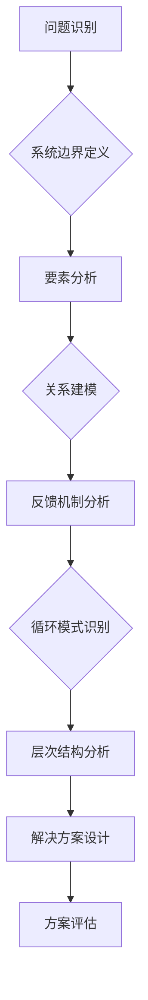

                 

## 系统思考:化繁为简的法宝

> 关键词：系统思考，复杂系统，架构设计，软件开发，问题解决，模式识别，决策优化

### 1. 背景介绍

在当今科技日新月异的时代，我们面临着越来越复杂的系统问题。从庞大的互联网架构到复杂的生物网络，从智能交通系统到人工智能算法，无处不在是相互关联、相互影响的复杂系统。面对这些复杂系统，传统的线性思维模式已经显得力不从心。我们需要一种全新的思维方式，一种能够洞察系统整体结构、识别关键要素、理解系统行为的思维方式——这就是系统思考。

系统思考是一种以整体为导向的思维方式，它强调系统内部各个要素之间的相互作用和反馈关系，并试图从系统层面理解问题和寻求解决方案。它帮助我们跳出局部思维的局限，看到问题的全貌，并找到最优的解决方案。

### 2. 核心概念与联系

系统思考的核心概念包括：

* **系统：** 由相互关联、相互影响的多个子系统或要素组成的整体。
* **边界：** 系统与外部环境的分界线。
* **反馈：** 系统内部或外部因素对系统行为的影响，并导致系统产生新的行为。
* **循环：** 系统内部的动态过程，包括输入、处理、输出和反馈。
* **层次：** 系统可以被分解成不同的层次，每个层次都有其独特的结构和功能。

**系统思考流程图**

### 3. 核心算法原理 & 具体操作步骤

系统思考本身不是一个算法，而是一种思维方式。它没有固定的算法步骤，但我们可以借鉴一些常用的方法和工具来进行系统思考。

**3.1 算法原理概述**

系统思考的核心原理是：

* **整体大于部分之和：** 系统的整体行为不能仅仅通过分析其各个部分来理解。
* **相互关联：** 系统内部各个要素之间相互关联，相互影响。
* **反馈机制：** 系统的行为受到自身反馈的影响，反馈机制可以是正反馈或负反馈。
* **循环模式：** 系统内部存在着循环模式，这些模式决定了系统的行为。

**3.2 算法步骤详解**

系统思考的步骤可以概括为以下几个方面：

1. **问题识别：** 明确需要解决的问题，并将其定义为一个系统问题。
2. **系统边界定义：** 确定系统的边界，即系统与外部环境的分界线。
3. **要素分析：** 分析系统内部的各个要素，包括它们的属性、功能和相互关系。
4. **关系建模：** 建立系统要素之间的关系模型，例如因果关系、依赖关系等。
5. **反馈机制分析：** 分析系统内部和外部的反馈机制，并识别其类型和影响。
6. **循环模式识别：** 识别系统内部的循环模式，例如正反馈循环、负反馈循环等。
7. **层次结构分析：** 将系统分解成不同的层次，并分析每个层次的结构和功能。
8. **解决方案设计：** 基于对系统的深入理解，设计解决方案，并考虑其对系统的影响。
9. **方案评估：** 对解决方案进行评估，并根据评估结果进行调整和优化。

**3.3 算法优缺点**

系统思考的优点：

* **洞察全局：** 能够帮助我们跳出局部思维，看到问题的全貌。
* **识别关键要素：** 能够帮助我们识别系统中的关键要素，并理解它们之间的相互作用。
* **预测系统行为：** 能够帮助我们预测系统的行为，并识别潜在的风险和机遇。

系统思考的缺点：

* **复杂性：** 复杂系统往往难以建模和分析。
* **数据依赖：** 系统思考需要大量的系统数据，才能进行有效的分析。
* **主观性：** 系统思考有一定的主观性，不同的分析者可能得出不同的结论。

**3.4 算法应用领域**

系统思考在各个领域都有广泛的应用，例如：

* **软件开发：** 设计复杂软件系统，识别系统风险，优化系统性能。
* **项目管理：** 规划和管理复杂项目，协调各方利益，提高项目成功率。
* **商业管理：** 分析企业内部和外部环境，制定战略决策，提高企业竞争力。
* **社会治理：** 理解社会问题，设计有效的政策方案，促进社会发展。

### 4. 数学模型和公式 & 详细讲解 & 举例说明

系统思考可以借助数学模型和公式来进行更精确的分析和预测。一些常用的数学模型包括：

**4.1 数学模型构建**

* **差分方程：** 用于描述系统变量随时间的变化规律。
* **微分方程：** 用于描述系统变量的瞬时变化率。
* **状态空间模型：** 用于描述系统的状态和输入输出关系。
* **网络模型：** 用于描述系统要素之间的相互连接关系。

**4.2 公式推导过程**

例如，我们可以使用差分方程来描述人口增长模型：

$$
P_{t+1} = P_t + rP_t
$$

其中：

* $P_t$ 表示时间 $t$ 的人口数量。
* $P_{t+1}$ 表示时间 $t+1$ 的人口数量。
* $r$ 表示人口增长率。

这个公式表明，下一时刻的人口数量等于当前时刻的人口数量加上当前时刻人口数量乘以人口增长率。

**4.3 案例分析与讲解**

我们可以使用这个模型来预测人口增长趋势。假设初始人口数量为 1000 人，人口增长率为 0.02，那么我们可以计算出未来几年的人口数量：

* $t=1$ 时，$P_1 = 1000 + 0.02 \times 1000 = 1020$ 人
* $t=2$ 时，$P_2 = 1020 + 0.02 \times 1020 = 1040.4$ 人
* $t=3$ 时，$P_3 = 1040.4 + 0.02 \times 1040.4 = 1061.2$ 人

我们可以看到，人口数量随着时间的推移呈指数增长。

### 5. 项目实践：代码实例和详细解释说明

系统思考在实际项目中可以应用于各种场景，例如软件架构设计、系统故障诊断、业务流程优化等。

**5.1 开发环境搭建**

系统思考的实践并不需要特定的开发环境，可以使用任何文本编辑器、绘图工具和编程语言。

**5.2 源代码详细实现**

由于系统思考本身不是一个算法，所以没有具体的源代码实现。

**5.3 代码解读与分析**

系统思考的实践更多的是一种思维方式和方法论，需要通过分析、建模、思考等步骤来完成。

**5.4 运行结果展示**

系统思考的实践结果是更深入的系统理解、更有效的解决方案和更优的系统设计。

### 6. 实际应用场景

系统思考在各个领域都有广泛的应用场景，例如：

**6.1 软件架构设计**

系统思考可以帮助软件架构师设计更健壮、更可扩展、更易维护的软件系统。

**6.2 系统故障诊断**

系统思考可以帮助工程师更快速、更准确地诊断系统故障，并找到根本原因。

**6.3 业务流程优化**

系统思考可以帮助企业分析和优化业务流程，提高效率和降低成本。

**6.4 未来应用展望**

随着人工智能、物联网等技术的快速发展，系统思考将发挥越来越重要的作用。它将帮助我们更好地理解和应对复杂系统带来的挑战，并创造更美好的未来。

### 7. 工具和资源推荐

**7.1 学习资源推荐**

* 《系统思考》 - Peter Senge
* 《第五项修炼》 - Jim Collins
* 《复杂系统》 - Melanie Mitchell

**7.2 开发工具推荐**

* **思维导图工具：** XMind、MindManager
* **流程图工具：** Lucidchart、Draw.io
* **数据可视化工具：** Tableau、Power BI

**7.3 相关论文推荐**

* "The Fifth Discipline: The Art and Practice of the Learning Organization" - Peter Senge
* "Complexity: A Guided Tour" - Melanie Mitchell
* "Thinking in Systems: A Primer" - Donella Meadows

### 8. 总结：未来发展趋势与挑战

系统思考是一种重要的思维方式，它能够帮助我们理解和应对复杂系统带来的挑战。未来，随着人工智能、物联网等技术的快速发展，系统思考将发挥越来越重要的作用。

**8.1 研究成果总结**

系统思考的研究成果已经取得了显著进展，例如：

* 系统动力学模型
* 网络科学
* 人工智能与系统思考的结合

**8.2 未来发展趋势**

未来，系统思考的研究将朝着以下几个方向发展：

* 更深入的系统建模和分析
* 更有效的系统优化和控制
* 系统思考与人工智能的融合

**8.3 面临的挑战**

系统思考也面临着一些挑战，例如：

* 复杂系统建模的难度
* 数据获取和分析的挑战
* 系统思考的推广和应用

**8.4 研究展望**

未来，我们需要继续加强系统思考的研究，并将其应用于更多领域，以更好地应对复杂系统带来的挑战，创造更美好的未来。

### 9. 附录：常见问题与解答

**9.1 如何进行系统思考？**

系统思考是一种思维方式，需要通过不断的练习和实践来掌握。可以从以下几个方面入手：

* 阅读相关书籍和文章，了解系统思考的基本原理和方法。
* 使用思维导图、流程图等工具，帮助自己进行系统建模和分析。
* 尝试将系统思考应用到实际问题中，例如软件架构设计、业务流程优化等。

**9.2 系统思考有什么用？**

系统思考可以帮助我们：

* 洞察全局，看到问题的全貌。
* 识别关键要素，理解它们之间的相互作用。
* 预测系统行为，识别潜在的风险和机遇。
* 设计更有效的解决方案，提高系统性能。

**9.3 系统思考与其他方法有什么区别？**

系统思考与其他方法，例如线性思维、因果分析等，最大的区别在于其关注点。

* 线性思维关注问题的局部，而系统思考关注问题的整体。
* 因果分析关注事件之间的直接关系，而系统思考关注事件之间的间接关系和反馈机制。

作者：禅与计算机程序设计艺术 / Zen and the Art of Computer Programming 
<end_of_turn>

