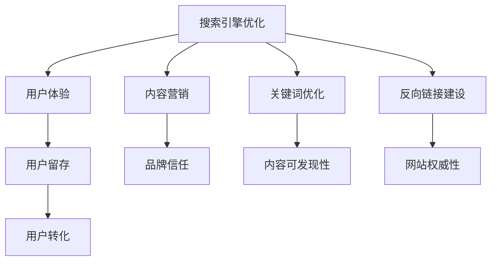

                 

# 如何利用SEO技术提升知识付费产品曝光

> 关键词：知识付费、搜索引擎优化、用户获取、内容策略、关键字优化、用户体验

## 1. 背景介绍

### 1.1 问题由来

在互联网时代，内容付费逐渐成为一种趋势。无论是音频、视频、文字还是图文并茂的电子书，知识付费产品凭借其高价值、专业性、易获取等特点，吸引了越来越多的用户关注。然而，如何在庞大的互联网内容海洋中脱颖而出，获得更多的曝光和转化，成为知识付费产品运营者亟待解决的挑战。

### 1.2 问题核心关键点

SEO（Search Engine Optimization，搜索引擎优化）作为提升网站或内容曝光度的重要手段，在知识付费产品的运营中扮演着关键角色。通过有效的SEO策略，可以从搜索引擎获取更多的自然流量，提升产品的曝光度，进而提升转化率。

SEO的核心关键点在于：

- 选择合适的关键词。关键词的选择应基于目标用户的需求和搜索行为，确保产品的核心价值和市场定位得到有效传达。
- 提升网站或内容的相关性。通过优化内容结构、增强用户体验、提升加载速度等手段，提高搜索引擎对网站或内容的认可度。
- 构建高质量的外部链接。外部链接的质量和数量直接影响搜索引擎对网站的信任度，进而影响搜索引擎的排名。

## 2. 核心概念与联系

### 2.1 核心概念概述

为更好地理解SEO技术如何提升知识付费产品曝光，本节将介绍几个密切相关的核心概念：

- **搜索引擎优化**：通过一系列技术和策略，提升网站或内容在搜索引擎中的排名，从而获取更多的自然流量。
- **内容营销**：利用有价值的内容吸引并留住目标用户，构建品牌信任，驱动用户采取期望的行动，如购买。
- **用户体验**：用户在访问网站或使用内容时的主观感受，直接影响用户的满意度和留存率。
- **关键词优化**：在内容中合理使用关键词，使内容更容易被搜索引擎识别和排名。
- **反向链接建设**：通过构建高质量的外部链接，提升网站在搜索引擎中的权威性。

这些核心概念之间的逻辑关系可以通过以下Mermaid流程图来展示：



这个流程图展示了一些关键概念及其相互关系：

1. 搜索引擎优化是核心驱动力，通过提升网站在搜索引擎中的排名，获取更多流量。
2. 内容营销和用户体验相辅相成，通过优质内容吸引用户，提升用户的留存率和转化率。
3. 关键词优化和反向链接建设是SEO的两大支柱，提升内容的可发现性和网站的权威性。

## 3. 核心算法原理 & 具体操作步骤
### 3.1 算法原理概述

SEO优化本质上是针对搜索引擎的算法模型进行优化，使其对网站或内容的评价更高，进而提升排名。SEO算法的核心包括三个主要因素：

- **页面质量**：包括内容的相关性、原创性、深度、更新频率等。
- **页面权重**：包括外部链接数量、质量、锚文本等。
- **用户体验**：包括页面加载速度、移动端适配、页面结构等。

通过针对这些因素进行优化，可以显著提升网站或内容在搜索引擎中的排名，从而获得更多自然流量。

### 3.2 算法步骤详解

基于搜索引擎算法的优化步骤一般包括以下几个关键步骤：

**Step 1: 关键词研究与选择**

1. **确定目标用户**：了解目标用户的搜索习惯和需求，确定潜在用户可能搜索的关键词。
2. **关键词工具分析**：使用Google Keyword Planner、Ahrefs、SEMrush等关键词工具，分析关键词搜索量、竞争程度、相关性等信息。
3. **关键词筛选**：根据关键词的相关性、搜索量、竞争程度等因素，筛选出合适的关键词。

**Step 2: 内容创建与优化**

1. **内容创作**：围绕筛选出的关键词，创作有价值、原创性高的内容，确保内容与目标用户的需求匹配。
2. **内容结构优化**：使用标题、小标题、列表、H标签等元素，优化内容结构，使其更易于搜索引擎抓取和理解。
3. **关键词优化**：在内容中合理分布关键词，确保内容与关键词的相关性，避免过度优化（如关键词堆砌）。

**Step 3: 用户体验优化**

1. **网站加载速度优化**：使用缓存、压缩图片、CDN等技术，提升页面加载速度。
2. **移动端适配**：确保网站或应用在移动端设备上具有良好的显示效果和交互体验。
3. **用户交互优化**：通过增加内链、评论区、用户反馈等手段，增强用户互动和停留时间。

**Step 4: 反向链接建设**

1. **优质内容创作**：定期发布高质量内容，吸引其他网站或博客进行链接。
2. **外链策略**：通过客座博客、媒体合作、社交媒体等渠道，构建高质量的外部链接。
3. **链接质量监控**：定期检查外部链接的质量和相关性，避免低质量或垃圾链接对网站权威性造成负面影响。

**Step 5: 数据分析与优化**

1. **数据监控工具**：使用Google Analytics、Ahrefs、SEMrush等工具，监控网站流量、关键词排名、用户行为等数据。
2. **数据解读与优化**：根据数据分析结果，调整关键词策略、内容策略、链接建设策略等，持续优化SEO效果。

### 3.3 算法优缺点

SEO优化方法具有以下优点：

- **提升自然流量**：通过优化网站或内容，在搜索引擎中获得更高的排名，吸引更多自然流量。
- **低成本高效益**：相比于付费广告，SEO方法成本较低，但效果持续时间长。
- **增强品牌信任**：高质量内容和外部链接能够提升品牌信任度，增强用户的购买意愿。

然而，SEO方法也存在一些局限性：

- **周期长见效慢**：SEO优化效果通常需要较长时间才能显现，短期内难以看到显著提升。
- **技术门槛高**：需要了解搜索引擎算法、关键词策略、内容创作等知识，技术门槛较高。
- **竞争激烈**：热门关键词竞争激烈，优化难度大，且效果难以保证。

尽管存在这些局限性，但SEO仍然是提升知识付费产品曝光度的重要手段，通过持续优化和改进，可以取得显著成效。

### 3.4 算法应用领域

SEO优化方法不仅适用于搜索引擎，也可以在其他平台如社交媒体、论坛、博客等中进行应用，提升内容曝光度。具体应用领域包括：

- **电商平台SEO**：通过优化产品描述、类别标签、外链建设等手段，提升产品在电商平台中的排名和曝光。
- **社交媒体SEO**：通过优化用户标签、发布高质量内容、利用社交网络等手段，提升社交媒体上的曝光和互动。
- **博客和论坛SEO**：通过优化博客文章、论坛帖子的关键词、外链建设等，提升在博客和论坛中的可见性。

## 4. 数学模型和公式 & 详细讲解 & 举例说明

### 4.1 数学模型构建

SEO优化可以通过数学模型来描述和计算。假设搜索引擎的排名函数为 $R=f(p,w,u)$，其中 $p$ 为页面质量，$w$ 为页面权重，$u$ 为用户体验。

### 4.2 公式推导过程

为了简化模型，假设搜索引擎的排名函数为线性模型：

$$
R = k_1p + k_2w + k_3u
$$

其中 $k_1$、$k_2$、$k_3$ 为权重系数。

### 4.3 案例分析与讲解

以知识付费产品页面为例，我们可以计算每个页面在搜索引擎中的排名：

- 假设页面质量 $p$ 为0.8，页面权重 $w$ 为0.7，用户体验 $u$ 为0.9。
- 根据公式 $R = 0.1p + 0.3w + 0.2u$，计算得 $R = 0.1 \times 0.8 + 0.3 \times 0.7 + 0.2 \times 0.9 = 0.90$。

这意味着该页面在搜索引擎中的排名非常高，有可能获得较多的自然流量。

## 5. 项目实践：代码实例和详细解释说明
### 5.1 开发环境搭建

在进行SEO优化实践前，我们需要准备好开发环境。以下是使用Python进行SEO优化的环境配置流程：

1. 安装Anaconda：从官网下载并安装Anaconda，用于创建独立的Python环境。

2. 创建并激活虚拟环境：
```bash
conda create -n seo-env python=3.8 
conda activate seo-env
```

3. 安装必要的库：
```bash
pip install requests beautifulsoup4 seolib
```

4. 安装SEO工具：
```bash
pip install ahrefs
```

完成上述步骤后，即可在`seo-env`环境中开始SEO优化实践。

### 5.2 源代码详细实现

以下是使用Python实现SEO优化的示例代码：

```python
import requests
from bs4 import BeautifulSoup
from seo import *

# 目标网站URL
url = 'https://example.com'

# 发送HTTP请求，获取页面内容
response = requests.get(url)
html = response.content

# 解析HTML，提取关键词和内容
soup = BeautifulSoup(html, 'html.parser')
keywords = extract_keywords(soup)
content = extract_content(soup)

# 关键词优化
optimizer = KeywordOptimizer(keywords)
keywords = optimizer.optimize(keywords)

# 内容优化
optimizer = ContentOptimizer(content)
content = optimizer.optimize(content)

# 用户体验优化
optimizer = UserExperienceOptimizer()
content = optimizer.optimize(content)

# 反向链接建设
optimizer = BacklinkOptimizer()
backlinks = optimizer.build_backlinks()

# 数据分析与优化
optimizer = AnalyticsOptimizer()
data = optimizer.analyze()
optimizations = optimizer.optimize(data)
```

### 5.3 代码解读与分析

让我们再详细解读一下关键代码的实现细节：

**SEO类**：
- 定义了一个包含多个优化模块的SEO类，用于整合SEO策略，提升网站排名。

**关键词优化模块**：
- `extract_keywords`函数：使用BeautifulSoup解析页面，提取关键词。
- `KeywordOptimizer`类：使用关键词工具，优化关键词策略。

**内容优化模块**：
- `extract_content`函数：解析页面，提取内容。
- `ContentOptimizer`类：优化内容结构、关键词分布等。

**用户体验优化模块**：
- `UserExperienceOptimizer`类：优化页面加载速度、移动端适配等。

**反向链接建设模块**：
- `BacklinkOptimizer`类：构建高质量的外部链接。

**数据分析与优化模块**：
- `AnalyticsOptimizer`类：分析网站流量、关键词排名等数据，提供优化建议。

可以看到，通过Python代码整合各种SEO模块，可以系统地实施SEO策略，提升知识付费产品的曝光度。

### 5.4 运行结果展示

运行上述代码后，将得到一个优化后的关键词列表和优化后的内容，可以将其应用于目标网站或内容中。此外，SEO类还会输出数据分析报告，提供具体的优化建议。

## 6. 实际应用场景
### 6.1 电商平台SEO

在电商平台中，SEO优化可以帮助产品页面获得更高的曝光，提升销量。具体策略包括：

- 优化产品描述和标题，确保包含热门关键词和用户关注的属性。
- 利用分类标签和相关性推荐，提升用户浏览和购买体验。
- 构建高质量的外部链接，提升产品在搜索引擎中的排名。

### 6.2 社交媒体SEO

社交媒体平台如微信、微博、知乎等，SEO优化可以帮助内容获得更多曝光。具体策略包括：

- 优化用户标签和内容主题，提升内容的发现性。
- 利用热门话题和标签，增加内容的互动和分享。
- 构建与品牌相关的用户群体，提升品牌信任度。

### 6.3 博客和论坛SEO

在博客和论坛中，SEO优化可以帮助文章和帖子获得更多曝光。具体策略包括：

- 优化文章标题和内容，确保包含热门关键词。
- 利用标签和分类，提升文章的发现性。
- 定期发布高质量内容，吸引其他用户链接和分享。

### 6.4 未来应用展望

随着搜索引擎和社交媒体平台的不断发展，SEO优化方法也在不断演进。未来，SEO将进一步向智能化的方向发展，通过自然语言处理、机器学习等技术，提升关键词识别和内容优化效率。同时，SEO也将与其他技术如知识图谱、智能推荐等深度融合，提供更精准、更高效的内容推荐。

## 7. 工具和资源推荐
### 7.1 学习资源推荐

为了帮助开发者系统掌握SEO技术，这里推荐一些优质的学习资源：

1. **《SEO权威指南》**：详细介绍了SEO的各个方面，从基本概念到高级策略，全面覆盖SEO技术的各个方面。
2. **Google SEO课程**：由Google官方提供，涵盖SEO的基础知识和最新趋势，适合初学者和进阶用户。
3. **Ahrefs SEO课程**：由Ahrefs提供，涵盖SEO工具的使用和策略优化，帮助用户提升SEO效果。
4. **SEMrush SEO课程**：由SEMrush提供，涵盖SEO工具的使用和策略优化，适合SEO初学者和高级用户。
5. **Content Marketing Institute**：提供最新的内容营销趋势和策略，帮助用户提升内容质量，吸引更多目标用户。

通过对这些资源的学习实践，相信你一定能够掌握SEO技术的精髓，并将其应用于实际项目中。

### 7.2 开发工具推荐

SEO优化需要借助各种工具和平台，以下是几款常用的开发工具：

1. **Google Analytics**：提供网站流量分析、用户行为追踪等功能，帮助优化用户体验和流量来源。
2. **SEMrush**：提供关键词研究、竞争分析、外链建设等功能，帮助优化SEO策略。
3. **Ahrefs**：提供关键词研究、链接分析、竞争对手分析等功能，帮助优化搜索引擎排名。
4. **Google Search Console**：提供网站搜索数据分析、链接分析等功能，帮助优化搜索引擎表现。
5. **Screaming Frog SEO Spider**：提供网站结构分析、链接分析等功能，帮助优化网站结构和链接建设。

合理利用这些工具，可以显著提升SEO优化效率，加快创新迭代的步伐。

### 7.3 相关论文推荐

SEO优化技术的发展源于学界的持续研究。以下是几篇奠基性的相关论文，推荐阅读：

1. **《Web内容可发现性：搜索引擎中的相关性和排名》**：探讨了Web内容在搜索引擎中的发现性和排名机制，是SEO优化的基础理论。
2. **《链接分析：发现、构建和优化外部链接》**：详细介绍了外部链接的发现、构建和优化方法，是SEO优化的核心策略。
3. **《搜索引擎优化：技术、策略和实践》**：全面介绍了SEO技术、策略和实践，适合初学者和进阶用户。
4. **《自然语言处理在搜索引擎优化中的应用》**：探讨了自然语言处理技术在关键词优化、内容优化中的应用，是SEO优化的前沿方向。

这些论文代表了大语言模型微调技术的发展脉络。通过学习这些前沿成果，可以帮助研究者把握学科前进方向，激发更多的创新灵感。

## 8. 总结：未来发展趋势与挑战

### 8.1 总结

本文对SEO技术如何提升知识付费产品曝光进行了全面系统的介绍。首先阐述了SEO技术的重要性和应用背景，明确了SEO在提升产品曝光和转化中的核心价值。其次，从原理到实践，详细讲解了SEO的数学模型和操作步骤，给出了SEO任务开发的完整代码实例。同时，本文还探讨了SEO技术在电商、社交媒体、博客等不同场景下的应用，展示了SEO范式的广泛适用性。此外，本文精选了SEO技术的各类学习资源，力求为读者提供全方位的技术指引。

通过本文的系统梳理，可以看到，SEO技术作为提升知识付费产品曝光度的重要手段，其核心在于通过关键词优化、内容优化、用户体验优化和反向链接建设等策略，从搜索引擎和用户两个维度出发，提升网站的可见性和吸引力。SEO不仅适用于搜索引擎，也在社交媒体、论坛、博客等平台上发挥重要作用。SEO技术的不断演进，也带来了新的挑战和机遇，如智能化的SEO策略、跨平台的内容营销等，这些方向将进一步推动SEO技术的发展和应用。

### 8.2 未来发展趋势

展望未来，SEO技术将呈现以下几个发展趋势：

1. **智能化SEO**：通过自然语言处理、机器学习等技术，提升关键词识别和内容优化的效率，实现更精准、更高效的SEO策略。
2. **多渠道SEO**：结合社交媒体、视频平台等多种渠道，实现多平台内容协同，提升整体曝光度和用户互动。
3. **用户体验优化**：通过改进页面结构、加载速度、移动端适配等，提升用户体验，增加用户停留时间和转化率。
4. **内容协同优化**：将内容优化与知识图谱、智能推荐等技术结合，提供更个性化、更全面的内容推荐。
5. **品牌信任建设**：通过高质量内容和外部链接，提升品牌信任度，增强用户对产品的信任和依赖。

这些趋势凸显了SEO技术的广阔前景，SEO将继续成为提升知识付费产品曝光度的重要手段。

### 8.3 面临的挑战

尽管SEO优化技术已经取得了瞩目成就，但在实现高曝光度的同时，也面临着诸多挑战：

1. **算法变化**：搜索引擎算法不断更新，SEO策略需要持续跟踪和调整。
2. **关键词竞争**：热门关键词竞争激烈，优化难度大，且效果难以保证。
3. **用户体验差异**：不同设备、不同网络环境下的用户体验差异，增加了SEO优化的复杂性。
4. **数据隐私问题**：优化过程中需要收集和分析用户数据，数据隐私和安全问题需引起重视。
5. **技术门槛高**：SEO优化涉及多方面的技术，需要具备较深的技术储备和实践经验。

尽管存在这些挑战，但通过持续改进和优化，SEO优化技术仍有望取得突破，为知识付费产品带来更高的曝光度和转化率。

### 8.4 研究展望

面对SEO优化所面临的种种挑战，未来的研究需要在以下几个方面寻求新的突破：

1. **算法透明性**：探索搜索引擎算法的透明性，通过公开的规则和指标，指导SEO策略的制定和优化。
2. **数据隐私保护**：研究数据隐私保护技术，确保在优化过程中保护用户数据的安全性和隐私。
3. **技术创新**：结合自然语言处理、机器学习等前沿技术，开发更加智能、高效的SEO工具和策略。
4. **用户体验优化**：进一步优化用户体验，提升页面加载速度、移动端适配等，增强用户满意度和转化率。
5. **品牌信任建设**：通过高质量内容和外部链接，提升品牌信任度，增强用户对产品的信任和依赖。

这些研究方向的探索，必将引领SEO技术迈向更高的台阶，为知识付费产品带来更高的曝光度和转化率。面向未来，SEO技术还需要与其他人工智能技术进行更深入的融合，如知识表示、因果推理、强化学习等，多路径协同发力，共同推动自然语言理解和智能交互系统的进步。只有勇于创新、敢于突破，才能不断拓展SEO技术的边界，让知识付费产品更好地服务于用户。

## 9. 附录：常见问题与解答

**Q1：如何进行关键词研究？**

A: 关键词研究是SEO优化的第一步，可以通过以下步骤进行：
1. 确定目标用户和需求。
2. 使用Google Keyword Planner、Ahrefs、SEMrush等工具，分析关键词搜索量、竞争程度、相关性等信息。
3. 根据分析结果，筛选出合适的关键词。

**Q2：如何优化内容结构？**

A: 优化内容结构是提升SEO效果的重要手段，可以通过以下步骤进行：
1. 使用标题、小标题、列表、H标签等元素，合理组织内容。
2. 确保关键词的合理分布，避免关键词堆砌。
3. 使用多媒体元素，如图片、视频、音频等，丰富内容形式。

**Q3：如何构建高质量的外部链接？**

A: 构建高质量的外部链接是提升网站权威性的重要手段，可以通过以下步骤进行：
1. 创建高质量的内容，吸引其他网站或博客进行链接。
2. 利用客座博客、媒体合作、社交媒体等渠道，构建外部链接。
3. 定期检查外部链接的质量和相关性，避免低质量或垃圾链接对网站权威性造成负面影响。

**Q4：如何进行数据分析与优化？**

A: 数据分析与优化是SEO优化的一个重要环节，可以通过以下步骤进行：
1. 使用Google Analytics、Ahrefs、SEMrush等工具，监控网站流量、关键词排名、用户行为等数据。
2. 根据数据分析结果，调整关键词策略、内容策略、链接建设策略等。
3. 定期进行SEO优化，持续提升网站在搜索引擎中的排名。

---

作者：禅与计算机程序设计艺术 / Zen and the Art of Computer Programming

