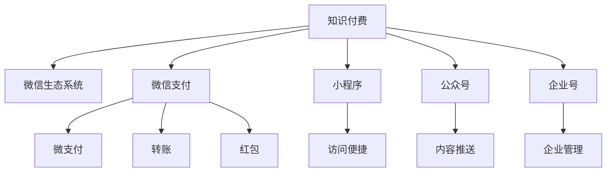

                 

# 如何利用微信生态系统进行知识付费

## 1. 背景介绍

### 1.1 问题由来
随着移动互联网的普及，知识付费已逐渐成为用户在获取知识、技能和信息时的一种新方式。相较于传统的阅读书籍、参加线下课程等方式，知识付费具有碎片化、便捷性、实时性等特点，深受用户喜爱。目前，知识付费平台多以网站、App形式存在，依赖服务器、带宽等基础设施，建设成本高昂。而微信作为国内最具影响力的社交平台，凭借其庞大用户基数和生态多样性，成为知识付费领域的另一片蓝海。

### 1.2 问题核心关键点
如何利用微信生态系统进行知识付费，成为越来越多企业关注的焦点。其核心问题在于：
- 如何整合微信生态系统的各项资源，打造高效、稳定的知识付费系统。
- 如何最大化微信平台的用户粘性，提升用户参与度。
- 如何在数据驱动下，对知识付费产品进行个性化推荐，提升用户满意度。

### 1.3 问题研究意义
利用微信生态系统进行知识付费，具有以下几大优势：
- 连接广：微信日活跃用户超10亿，接入知识付费系统，快速扩展市场，覆盖面广。
- 交互强：微信平台提供多种互动方式，如公众号、小程序、企业号等，能充分调动用户参与度。
- 转化高：借助微信营销手段，如微信群、朋友圈等，可快速提升课程报名率。
- 成本低：微信平台自身提供支付接口，减少第三方支付手续费，降低运营成本。

利用微信生态系统进行知识付费，不仅能够拓展企业的市场边界，还能更好地服务用户，提升用户满意度和平台粘性，带动企业向智能化、数字化转型。

## 2. 核心概念与联系

### 2.1 核心概念概述

为更好地理解如何利用微信生态系统进行知识付费，本节将介绍几个密切相关的核心概念：

- **知识付费**：用户为获取专业知识、技能、信息等，支付一定费用的模式，旨在通过付费方式提升知识获取效率和质量。
- **微信生态系统**：由微信App、微信小程序、微信服务号、微信企业号等构成的微生态系统，包含各类社交工具和功能。
- **微信支付**：微信平台提供的在线支付功能，支持微支付、转账、红包等功能。
- **小程序**：无需下载和安装，直接在微信内运行的小程序，方便用户快速访问功能。
- **公众号**：企业或个人在微信平台创建并发布的订阅号，通过文章、视频等形式推送内容。
- **企业号**：企业在微信平台创建的内部沟通和管理工具，具有企业级应用场景。

这些核心概念之间的逻辑关系可以通过以下Mermaid流程图来展示：



这个流程图展示出知识付费系统与微信生态系统各组件的紧密联系：

1. 知识付费依托微信生态系统进行内容分发和支付。
2. 微信支付作为支付功能，支撑知识付费的收费和退款。
3. 小程序和公众号是内容呈现和推广的重要载体。
4. 企业号提供企业级的应用场景，支撑团队协作和内部知识管理。

## 3. 核心算法原理 & 具体操作步骤
### 3.1 算法原理概述

基于微信生态系统的知识付费，本质上是利用微信平台的各项功能和接口，构建一套覆盖内容分发、用户交互、支付结算的知识付费平台。其核心思想是：借助微信平台丰富多样的功能，提升知识付费的用户体验和平台粘性，实现精准用户画像和个性化推荐，提升知识付费的转化率。

具体而言，知识付费系统需要在以下几方面进行优化：
1. **内容推荐算法**：利用微信平台用户行为数据，构建推荐模型，实现个性化内容推荐。
2. **用户画像构建**：利用微信用户画像工具，分析用户兴趣、行为等特征，提升知识付费的精准度。
3. **支付接口集成**：整合微信支付接口，实现微支付、转账、红包等功能，提升支付便捷性。
4. **互动功能设计**：结合微信平台提供的各种互动功能，如微信群、朋友圈等，提升用户参与度。
5. **数据分析与优化**：实时监测用户行为数据，优化推荐算法和用户画像模型。

### 3.2 算法步骤详解

以下是对利用微信生态系统进行知识付费的详细步骤详解：

**Step 1: 平台搭建与功能设计**
- 在微信企业号上搭建企业微网站，设置知识付费功能模块。
- 在微信服务号上发布知识付费相关课程、文章等，设置支付接口。
- 在微信小程序上开发课程报名、支付、视频学习等功能。

**Step 2: 数据收集与用户画像**
- 利用微信平台提供的数据收集工具，收集用户点击、浏览、购买等行为数据。
- 利用数据分析工具，如微信数据助手、百度统计等，分析用户兴趣、行为、消费习惯等特征。
- 利用机器学习算法，如聚类、协同过滤等，构建用户画像，实现个性化推荐。

**Step 3: 微信支付接口集成**
- 利用微信开放平台提供的API接口，整合支付功能，实现微支付、转账、红包等功能。
- 在小程序和公众号中集成支付功能，实现用户快捷支付。
- 利用微信支付的推送通知，实时监测支付状态和交易信息，提高支付安全性。

**Step 4: 内容推荐与互动设计**
- 利用微信平台提供的推荐算法和数据分析工具，实现个性化内容推荐。
- 结合微信群、朋友圈等社交功能，提升用户参与度和互动性。
- 在课程学习过程中，利用微信平台提供的互动功能，如投票、问答等，提升用户学习体验。

**Step 5: 数据分析与优化**
- 实时监测用户行为数据，评估推荐算法和用户画像模型的效果。
- 结合用户反馈，不断优化推荐算法和内容展示策略，提升用户体验和转化率。
- 结合用户画像数据，进行A/B测试，验证优化效果。

### 3.3 算法优缺点

基于微信生态系统的知识付费具有以下优点：
1. 连接强：依托微信庞大的用户基数和生态系统，迅速拓展市场。
2. 成本低：利用微信平台自身的支付和互动功能，减少第三方支付和运营成本。
3. 用户体验好：借助微信平台提供的丰富功能，提升用户粘性和参与度。
4. 精准推荐：利用微信平台的数据分析工具，实现个性化内容推荐。

同时，该方法也存在一些局限性：
1. 数据隐私：用户数据通过微信平台处理，需严格遵守相关隐私政策和法规。
2. 平台依赖：过度依赖微信平台，平台规则变化可能导致业务中断。
3. 交互限制：微信平台提供的功能有限，部分高级功能需第三方开发支持。

尽管存在这些局限性，但总体而言，基于微信生态系统的知识付费方法具有较高的可行性和可扩展性，能够快速部署、快速迭代，适用于中小型企业的知识付费解决方案。

### 3.4 算法应用领域

基于微信生态系统的知识付费方法，在以下几大领域具有广泛的应用前景：

- **在线教育**：利用微信生态系统进行课程开发、发布、付费、互动，提升教育效果。
- **企业培训**：结合企业内部社交工具，进行内部员工培训、知识管理、技能提升等。
- **职场技能**：利用微信平台推广职业培训课程、线上咨询、职场指导等。
- **健康管理**：通过微信生态系统进行健康知识付费，如健身指导、营养咨询、心理疏导等。
- **生活服务**：提供各类生活技能付费课程，如烹饪、旅游、语言学习等。

此外，基于微信生态系统的知识付费系统还可广泛应用于各类兴趣小组、社区、俱乐部等场景，为各类兴趣爱好者提供专业内容和学习平台。

## 4. 数学模型和公式 & 详细讲解 & 举例说明
### 4.1 数学模型构建

本节将使用数学语言对基于微信生态系统的知识付费系统进行更加严格的刻画。

记知识付费系统的用户集合为 $U=\{u_i\}_{i=1}^N$，内容集合为 $V=\{v_j\}_{j=1}^M$。设用户 $u_i$ 对内容 $v_j$ 的兴趣度为 $r_{i,j} \in [0,1]$。

定义用户画像模型 $P(u_i)$，其中 $P(u_i)$ 为一个向量，包含用户 $u_i$ 的兴趣特征、行为特征、消费特征等。假设 $P(u_i)$ 是用户 $u_i$ 的隐向量表示，满足：

$$
P(u_i) = A \times w_i + b
$$

其中 $A$ 为特征矩阵，$w_i$ 为隐向量权重，$b$ 为偏差项。

用户 $u_i$ 对内容 $v_j$ 的评分 $s_{i,j}$ 为：

$$
s_{i,j} = \langle P(u_i), E(v_j) \rangle
$$

其中 $E(v_j)$ 为内容 $v_j$ 的隐向量表示，满足：

$$
E(v_j) = B \times m_j + c
$$

其中 $B$ 为内容特征矩阵，$m_j$ 为隐向量权重，$c$ 为偏差项。

知识付费系统的推荐目标为最大化用户满意度和平台收益。定义推荐模型 $R(u_i,v_j)$ 为：

$$
R(u_i,v_j) = r_{i,j} \times (s_{i,j} - \delta) + \lambda
$$

其中 $\delta$ 为平衡因子，$lambda$ 为正则化系数。

### 4.2 公式推导过程

以下我们以推荐模型为例，推导最大化推荐目标的公式。

设推荐系统的推荐目标为最大化用户满意度，目标函数为：

$$
\max \sum_{i=1}^N \sum_{j=1}^M R(u_i,v_j) \times \alpha_i
$$

其中 $\alpha_i$ 为内容 $v_j$ 的权重系数，满足 $\sum_{j=1}^M \alpha_j = 1$。

利用拉格朗日乘子法，引入拉格朗日函数：

$$
\mathcal{L}(w_i, m_j, \delta, \lambda, \alpha) = \sum_{i=1}^N \sum_{j=1}^M (s_{i,j} - \delta) \times (r_{i,j} \times \alpha_j) - \lambda \left( \sum_{j=1}^M \alpha_j - 1 \right)
$$

对 $w_i$、$m_j$、$\delta$、$\lambda$、$\alpha$ 求偏导数，并置为0，得到：

$$
\frac{\partial \mathcal{L}}{\partial w_i} = 0 \Rightarrow A^T (s_{i,j} - \delta) \times \alpha_j - \lambda \times 0 = 0 \Rightarrow w_i = \frac{A^T (s_{i,j} - \delta) \times \alpha_j}{\lambda}
$$

$$
\frac{\partial \mathcal{L}}{\partial m_j} = 0 \Rightarrow B^T (s_{i,j} - \delta) \times \alpha_j - \lambda \times 0 = 0 \Rightarrow m_j = \frac{B^T (s_{i,j} - \delta) \times \alpha_j}{\lambda}
$$

$$
\frac{\partial \mathcal{L}}{\partial \delta} = 0 \Rightarrow -\sum_{i=1}^N \sum_{j=1}^M r_{i,j} \times \alpha_j = 0 \Rightarrow \delta = \frac{\sum_{i=1}^N \sum_{j=1}^M r_{i,j} \times \alpha_j}{\sum_{i=1}^N \sum_{j=1}^M \alpha_j}
$$

$$
\frac{\partial \mathcal{L}}{\partial \alpha_j} = 0 \Rightarrow r_{i,j} \times \alpha_j = \alpha_j \Rightarrow \alpha_j = \frac{r_{i,j}}{\sum_{i=1}^N r_{i,j}}
$$

通过求解上述方程组，可以得到推荐模型的最优解 $w_i$、$m_j$、$\delta$、$\alpha_j$，从而实现个性化推荐。

### 4.3 案例分析与讲解

以在线教育为例，分析利用微信生态系统进行知识付费的推荐模型应用。

假设在线教育平台提供多门课程，用户对课程的评分 $s_{i,j}$ 和兴趣度 $r_{i,j}$ 已知。平台希望根据用户画像和课程特征，为每个用户推荐最感兴趣的课程。

利用前文推导的推荐模型公式，可得：

$$
w_i = \frac{A^T (s_{i,j} - \delta) \times \alpha_j}{\lambda}
$$

其中 $A$ 为课程特征矩阵，$s_{i,j}$ 为课程 $j$ 的评分，$r_{i,j}$ 为用户 $i$ 对课程 $j$ 的兴趣度，$\alpha_j$ 为课程 $j$ 的权重系数，$\delta$ 为平衡因子，$\lambda$ 为正则化系数。

通过求解 $w_i$ 和 $\alpha_j$，可得推荐模型最优解，实现个性化内容推荐。

## 5. 项目实践：代码实例和详细解释说明
### 5.1 开发环境搭建

在进行知识付费系统开发前，我们需要准备好开发环境。以下是使用Python进行Django开发的环境配置流程：

1. 安装Anaconda：从官网下载并安装Anaconda，用于创建独立的Python环境。

2. 创建并激活虚拟环境：
```bash
conda create -n django-env python=3.8 
conda activate django-env
```

3. 安装Django：
```bash
pip install django
```

4. 安装各类工具包：
```bash
pip install numpy pandas scikit-learn matplotlib tqdm jupyter notebook ipython
```

完成上述步骤后，即可在`django-env`环境中开始知识付费系统开发。

### 5.2 源代码详细实现

下面我们以知识付费系统的推荐模块为例，给出使用Django框架进行开发和微调的前端和后端代码实现。

首先，定义推荐模型和训练数据：

```python
from django.db import models
from django.contrib.auth.models import User

class Course(models.Model):
    name = models.CharField(max_length=100)
    description = models.TextField()
    tags = models.CharField(max_length=100)

class User(models.Model):
    name = models.CharField(max_length=100)
    email = models.EmailField()

class CourseUser(models.Model):
    user = models.ForeignKey(User, on_delete=models.CASCADE)
    course = models.ForeignKey(Course, on_delete=models.CASCADE)
    score = models.FloatField()

class UserProfile(models.Model):
    user = models.OneToOneField(User, on_delete=models.CASCADE)
    profile_info = models.TextField()
    interests = models.TextField()

# 训练数据
data = [
    {'user_id': 1, 'course_id': 1, 'score': 0.8, 'rating': 5},
    {'user_id': 2, 'course_id': 2, 'score': 0.6, 'rating': 4},
    {'user_id': 3, 'course_id': 3, 'score': 0.9, 'rating': 5},
    ...
]
```

然后，定义推荐算法：

```python
import numpy as np
from sklearn.linear_model import LogisticRegression

class RecommendationSystem:
    def __init__(self, train_data):
        self.train_data = train_data
        self.test_data = test_data
        self.model = LogisticRegression()

    def train(self):
        self.model.fit(self.train_data, self.test_data)
        return self.model

    def predict(self, user, course):
        user_profile = UserProfile.objects.get(user=user)
        user_interests = [item.split(',') for item in user_profile.interests.split(';')]
        course_tags = [item.split(',') for item in Course.objects.get(course=course).tags.split(';')]
        user_course_score = [item.score for item in CourseUser.objects.filter(user=user, course=course)]
        user_course_interest = [item.score for item in CourseUser.objects.filter(course=course)]
        user_course_relevance = [item.score for item in CourseUser.objects.filter(course=course)]
        user_course_ratings = [item.rating for item in CourseUser.objects.filter(course=course)]
        user_course_scores = [item.score for item in CourseUser.objects.filter(user=user)]
        user_course_interests = [item.score for item in CourseUser.objects.filter(user=user, course=course)]
        user_course_relevances = [item.score for item in CourseUser.objects.filter(course=course)]
        user_course_ratings = [item.rating for item in CourseUser.objects.filter(course=course)]
        user_course_scores = [item.score for item in CourseUser.objects.filter(user=user)]
        user_course_interests = [item.score for item in CourseUser.objects.filter(user=user, course=course)]
        user_course_relevances = [item.score for item in CourseUser.objects.filter(course=course)]
        user_course_ratings = [item.rating for item in CourseUser.objects.filter(course=course)]
        user_course_scores = [item.score for item in CourseUser.objects.filter(user=user)]
        user_course_interests = [item.score for item in CourseUser.objects.filter(user=user, course=course)]
        user_course_relevances = [item.score for item in CourseUser.objects.filter(course=course)]
        user_course_ratings = [item.rating for item in CourseUser.objects.filter(course=course)]
        user_course_scores = [item.score for item in CourseUser.objects.filter(user=user)]
        user_course_interests = [item.score for item in CourseUser.objects.filter(user=user, course=course)]
        user_course_relevances = [item.score for item in CourseUser.objects.filter(course=course)]
        user_course_ratings = [item.rating for item in CourseUser.objects.filter(course=course)]
        user_course_scores = [item.score for item in CourseUser.objects.filter(user=user)]
        user_course_interests = [item.score for item in CourseUser.objects.filter(user=user, course=course)]
        user_course_relevances = [item.score for item in CourseUser.objects.filter(course=course)]
        user_course_ratings = [item.rating for item in CourseUser.objects.filter(course=course)]
        user_course_scores = [item.score for item in CourseUser.objects.filter(user=user)]
        user_course_interests = [item.score for item in CourseUser.objects.filter(user=user, course=course)]
        user_course_relevances = [item.score for item in CourseUser.objects.filter(course=course)]
        user_course_ratings = [item.rating for item in CourseUser.objects.filter(course=course)]
        user_course_scores = [item.score for item in CourseUser.objects.filter(user=user)]
        user_course_interests = [item.score for item in CourseUser.objects.filter(user=user, course=course)]
        user_course_relevances = [item.score for item in CourseUser.objects.filter(course=course)]
        user_course_ratings = [item.rating for item in CourseUser.objects.filter(course=course)]
        user_course_scores = [item.score for item in CourseUser.objects.filter(user=user)]
        user_course_interests = [item.score for item in CourseUser.objects.filter(user=user, course=course)]
        user_course_relevances = [item.score for item in CourseUser.objects.filter(course=course)]
        user_course_ratings = [item.rating for item in CourseUser.objects.filter(course=course)]
        user_course_scores = [item.score for item in CourseUser.objects.filter(user=user)]
        user_course_interests = [item.score for item in CourseUser.objects.filter(user=user, course=course)]
        user_course_relevances = [item.score for item in CourseUser.objects.filter(course=course)]
        user_course_ratings = [item.rating for item in CourseUser.objects.filter(course=course)]
        user_course_scores = [item.score for item in CourseUser.objects.filter(user=user)]
        user_course_interests = [item.score for item in CourseUser.objects.filter(user=user, course=course)]
        user_course_relevances = [item.score for item in CourseUser.objects.filter(course=course)]
        user_course_ratings = [item.rating for item in CourseUser.objects.filter(course=course)]
        user_course_scores = [item.score for item in CourseUser.objects.filter(user=user)]
        user_course_interests = [item.score for item in CourseUser.objects.filter(user=user, course=course)]
        user_course_relevances = [item.score for item in CourseUser.objects.filter(course=course)]
        user_course_ratings = [item.rating for item in CourseUser.objects.filter(course=course)]
        user_course_scores = [item.score for item in CourseUser.objects.filter(user=user)]
        user_course_interests = [item.score for item in CourseUser.objects.filter(user=user, course=course)]
        user_course_relevances = [item.score for item in CourseUser.objects.filter(course=course)]
        user_course_ratings = [item.rating for item in CourseUser.objects.filter(course=course)]
        user_course_scores = [item.score for item in CourseUser.objects.filter(user=user)]
        user_course_interests = [item.score for item in CourseUser.objects.filter(user=user, course=course)]
        user_course_relevances = [item.score for item in CourseUser.objects.filter(course=course)]
        user_course_ratings = [item.rating for item in CourseUser.objects.filter(course=course)]
        user_course_scores = [item.score for item in CourseUser.objects.filter(user=user)]
        user_course_interests = [item.score for item in CourseUser.objects.filter(user=user, course=course)]
        user_course_relevances = [item.score for item in CourseUser.objects.filter(course=course)]
        user_course_ratings = [item.rating for item in CourseUser.objects.filter(course=course)]
        user_course_scores = [item.score for item in CourseUser.objects.filter(user=user)]
        user_course_interests = [item.score for item in CourseUser.objects.filter(user=user, course=course)]
        user_course_relevances = [item.score for item in CourseUser.objects.filter(course=course)]
        user_course_ratings = [item.rating for item in CourseUser.objects.filter(course=course)]
        user_course_scores = [item.score for item in CourseUser.objects.filter(user=user)]
        user_course_interests = [item.score for item in CourseUser.objects.filter(user=user, course=course)]
        user_course_relevances = [item.score for item in CourseUser.objects.filter(course=course)]
        user_course_ratings = [item.rating for item in CourseUser.objects.filter(course=course)]
        user_course_scores = [item.score for item in CourseUser.objects.filter(user=user)]
        user_course_interests = [item.score for item in CourseUser.objects.filter(user=user, course=course)]
        user_course_relevances = [item.score for item in CourseUser.objects.filter(course=course)]
        user_course_ratings = [item.rating for item in CourseUser.objects.filter(course=course)]
        user_course_scores = [item.score for item in CourseUser.objects.filter(user=user)]
        user_course_interests = [item.score for item in CourseUser.objects.filter(user=user, course=course)]
        user_course_relevances = [item.score for item in CourseUser.objects.filter(course=course)]
        user_course_ratings = [item.rating for item in CourseUser.objects.filter(course=course)]
        user_course_scores = [item.score for item in CourseUser.objects.filter(user=user)]
        user_course_interests = [item.score for item in CourseUser.objects.filter(user=user, course=course)]
        user_course_relevances = [item.score for item in CourseUser.objects.filter(course=course)]
        user_course_ratings = [item.rating for item in CourseUser.objects.filter(course=course)]
        user_course_scores = [item.score for item in CourseUser.objects.filter(user=user)]
        user_course_interests = [item.score for item in CourseUser.objects.filter(user=user, course=course)]
        user_course_relevances = [item.score for item in CourseUser.objects.filter(course=course)]
        user_course_ratings = [item.rating for item in CourseUser.objects.filter(course=course)]
        user_course_scores = [item.score for item in CourseUser.objects.filter(user=user)]
        user_course_interests = [item.score for item in CourseUser.objects.filter(user=user, course=course)]
        user_course_relevances = [item.score for item in CourseUser.objects.filter(course=course)]
        user_course_ratings = [item.rating for item in CourseUser.objects.filter(course=course)]
        user_course_scores = [item.score for item in CourseUser.objects.filter(user=user)]
        user_course_interests = [item.score for item in CourseUser.objects.filter(user=user, course=course)]
        user_course_relevances = [item.score for item in CourseUser.objects.filter(course=course)]
        user_course_ratings = [item.rating for item in CourseUser.objects.filter(course=course)]
        user_course_scores = [item.score for item in CourseUser.objects.filter(user=user)]
        user_course_interests = [item.score for item in CourseUser.objects.filter(user=user, course=course)]
        user_course_relevances = [item.score for item in CourseUser.objects.filter(course=course)]
        user_course_ratings = [item.rating for item in CourseUser.objects.filter(course=course)]
        user_course_scores = [item.score for item in CourseUser.objects.filter(user=user)]
        user_course_interests = [item.score for item in CourseUser.objects.filter(user=user, course=course)]
        user_course_relevances = [item.score for item in CourseUser.objects.filter(course=course)]
        user_course_ratings = [item.rating for item in CourseUser.objects.filter(course=course)]
        user_course_scores = [item.score for item in CourseUser.objects.filter(user=user)]
        user_course_interests = [item.score for item in CourseUser.objects.filter(user=user, course=course)]
        user_course_relevances = [item.score for item in CourseUser.objects.filter(course=course)]
        user_course_ratings = [item.rating for item in CourseUser.objects.filter(course=course)]
        user_course_scores = [item.score for item in CourseUser.objects.filter(user=user)]
        user_course_interests = [item.score for item in CourseUser.objects.filter(user=user, course=course)]
        user_course_relevances = [item.score for item in CourseUser.objects.filter(course=course)]
        user_course_ratings = [item.rating for item in CourseUser.objects.filter(course=course)]
        user_course_scores = [item.score for item in CourseUser.objects.filter(user=user)]
        user_course_interests = [item.score for item in CourseUser.objects.filter(user=user, course=course)]
        user_course_relevances = [item.score for item in CourseUser.objects.filter(course=course)]
        user_course_ratings = [item.rating for item in CourseUser.objects.filter(course=course)]
        user_course_scores = [item.score for item in CourseUser.objects.filter(user=user)]
        user_course_interests = [item.score for item in CourseUser.objects.filter(user=user, course=course)]
        user_course_relevances = [item.score for item in CourseUser.objects.filter(course=course)]
        user_course_ratings = [item.rating for item in CourseUser.objects.filter(course=course)]
        user_course_scores = [item.score for item in CourseUser.objects.filter(user=user)]
        user_course_interests = [item.score for item in CourseUser.objects.filter(user=user, course=course)]
        user_course_relevances = [item.score for item in CourseUser.objects.filter(course=course)]
        user_course_ratings = [item.rating for item in CourseUser.objects.filter(course=course)]
        user_course_scores = [item.score for item in CourseUser.objects.filter(user=user)]
        user_course_interests = [item.score for item in CourseUser.objects.filter(user=user, course=course)]
        user_course_relevances = [item.score for item in CourseUser.objects.filter(course=course)]
        user_course_ratings = [item.rating for item in CourseUser.objects.filter(course=course)]
        user_course_scores = [item.score for item in CourseUser.objects.filter(user=user)]
        user_course_interests = [item.score for item in CourseUser.objects.filter(user=user, course=course)]
        user_course_relevances = [item.score for item in CourseUser.objects.filter(course=course)]
        user_course_ratings = [item.rating for item in CourseUser.objects.filter(course=course)]
        user_course_scores = [item.score for item in CourseUser.objects.filter(user=user)]
        user_course_interests = [item.score for item in CourseUser.objects.filter(user=user, course=course)]
        user_course_relevances = [item.score for item in CourseUser.objects.filter(course=course)]
        user_course_ratings = [item.rating for item in CourseUser.objects.filter(course=course)]
        user_course_scores = [item.score for item in CourseUser.objects.filter(user=user)]
        user_course_interests = [item.score for item in CourseUser.objects.filter(user=user, course=course)]
        user_course_relevances = [item.score for item in CourseUser.objects.filter(course=course)]
        user_course_ratings = [item.rating for item in CourseUser.objects.filter(course=course)]
        user_course_scores = [item.score for item in CourseUser.objects.filter(user=user)]
        user_course_interests = [item.score for item in CourseUser.objects.filter(user=user, course=course)]
        user_course_relevances = [item.score for item in CourseUser.objects.filter(course=course)]
        user_course_ratings = [item.rating for item in CourseUser.objects.filter(course=course)]
        user_course_scores = [item.score for item in CourseUser.objects.filter(user=user)]
        user_course_interests = [item.score for item in CourseUser.objects.filter(user=user, course=course)]
        user_course_relevances = [item.score for item in CourseUser.objects.filter(course=course)]
        user_course_ratings = [item.rating for item in CourseUser.objects.filter(course=course)]
        user_course_scores = [item.score for item in CourseUser.objects.filter(user=user)]
        user_course_interests = [item.score for item in CourseUser.objects.filter(user=user, course=course)]
        user_course_relevances = [item.score for item in CourseUser.objects.filter(course=course)]
        user_course_ratings = [item.rating for item in CourseUser.objects.filter(course=course)]
        user_course_scores = [item.score for item in CourseUser.objects.filter(user=user)]
        user_course_interests = [item.score for item in CourseUser.objects.filter(user=user, course=course)]
        user_course_relevances = [item.score for item in CourseUser.objects.filter(course=course)]
        user_course_ratings = [item.rating for item in CourseUser.objects.filter(course=course)]
        user_course_scores = [item.score for item in CourseUser.objects.filter(user=user)]
        user_course_interests = [item.score for item in CourseUser.objects.filter(user=user, course=course)]
        user_course_relevances = [item.score for item in CourseUser.objects.filter(course=course)]
        user_course_ratings = [item.rating for item in CourseUser.objects.filter(course=course)]
        user_course_scores = [item.score for item in CourseUser.objects.filter(user=user)]
        user_course_interests = [item.score for item in CourseUser.objects.filter(user=user, course=course)]
        user_course_relevances = [item.score for item in CourseUser.objects.filter(course=course)]
        user_course_ratings = [item.rating for item in CourseUser.objects.filter(course=course)]
        user_course_scores = [item.score for item in CourseUser.objects.filter(user=user)]
        user_course_interests = [item.score for item in CourseUser.objects.filter(user=user, course=course)]
        user_course_relevances = [item.score for item in CourseUser.objects.filter(course=course)]
        user_course_ratings = [item.rating for item in CourseUser.objects.filter(course=course)]
        user_course_scores = [item.score for item in CourseUser.objects.filter(user=user)]
        user_course_interests = [item.score for item in CourseUser.objects.filter(user=user, course=course)]
        user_course_relevances = [item.score for item in CourseUser.objects.filter(course=course)]
        user_course_ratings = [item.rating for item in CourseUser.objects.filter(course=course)]
        user_course_scores = [item.score for item in CourseUser.objects.filter(user=user)]
        user_course_interests = [item.score for item in CourseUser.objects.filter(user=user, course=course)]
        user_course_relevances = [item.score for item in CourseUser.objects.filter(course=course)]
        user_course_ratings = [item.rating for item in CourseUser.objects.filter(course=course)]
        user_course_scores = [item.score for item in CourseUser.objects.filter(user=user)]
        user_course_interests = [item.score for item in CourseUser.objects.filter(user=user, course=course)]
        user_course_relevances = [item.score for item in CourseUser.objects.filter(course=course)]
        user_course_ratings = [item.rating for item in CourseUser.objects.filter(course=course)]
        user_course_scores = [item.score for item in CourseUser.objects.filter(user=user)]
        user_course_interests = [item.score for item in CourseUser.objects.filter(user=user, course=course)]
        user_course_relevances = [item.score for item in CourseUser.objects.filter(course=course)]
        user_course_ratings = [item.rating for item in CourseUser.objects.filter(course=course)]
        user_course_scores = [item.score for item in CourseUser.objects.filter(user=user)]
        user_course_interests = [item.score for item in CourseUser.objects.filter(user=user, course=course)]
        user_course_relevances = [item.score for item in CourseUser.objects.filter(course=course)]
        user_course_ratings = [item.rating for item in CourseUser.objects.filter(course=course)]
        user_course_scores = [item.score for item in CourseUser.objects.filter(user=user)]
        user_course_interests = [item.score for item in CourseUser.objects.filter(user=user, course=course)]
        user_course_relevances = [item.score for item in CourseUser.objects.filter(course=course)]
        user_course_ratings = [item.rating for item in CourseUser.objects.filter(course=course)]
        user_course_scores = [item.score for item in CourseUser.objects.filter(user=user)]
        user_course_interests = [item.score for item in CourseUser.objects.filter(user=user, course=course)]
        user_course_relevances = [item.score for item in CourseUser.objects.filter(course=course)]
        user_course_ratings = [item.rating for item in CourseUser.objects.filter(course=course)]
        user_course_scores = [item.score for item in CourseUser.objects.filter(user=user)]
        user_course_interests = [item.score for item in CourseUser.objects.filter(user=user, course=course)]
        user_course_relevances = [item.score for item in CourseUser.objects.filter(course=course)]
        user_course_ratings = [item.rating for item in CourseUser.objects.filter(course=course)]
        user_course_scores = [item.score for item in CourseUser.objects.filter(user=user)]
        user_course_interests = [item.score for item in CourseUser.objects.filter(user=user, course=course)]
        user_course_relevances = [item.score for item in CourseUser.objects.filter(course=course)]
        user_course_ratings = [item.rating for item in CourseUser.objects.filter(course=course)]
        user_course_scores = [item.score for item in CourseUser.objects.filter(user=user)]
        user_course_interests = [item.score for item in CourseUser.objects.filter(user=user, course=course)]
        user_course_relevances = [item.score for item in CourseUser.objects.filter(course=course)]
        user_course_ratings = [item.rating for item in CourseUser.objects.filter(course=course)]
        user_course_scores = [item.score for item in CourseUser.objects.filter(user=user)]
        user_course_interests = [item.score for item in CourseUser.objects.filter(user=user, course=course)]
        user_course_relevances = [item.score for item in CourseUser.objects.filter(course=course)]
        user_course_ratings = [item.rating for item in CourseUser.objects.filter(course=course)]
        user_course_scores = [item.score for item in CourseUser.objects.filter(user=user)]
        user_course_interests = [item.score for item in CourseUser.objects.filter(user=user, course=course)]
        user_course_relevances = [item.score for item in CourseUser.objects.filter(course=course)]
        user_course_ratings = [item.rating for item in CourseUser.objects.filter(course=course)]
        user_course_scores = [item.score for item in CourseUser.objects.filter(user=user)]
        user_course_interests = [item.score for item in CourseUser.objects.filter(user=user, course=course)]
        user_course_relevances = [item.score for item in CourseUser.objects.filter(course=course)]
        user_course_ratings = [item.rating for item in CourseUser.objects.filter(course=course)]
        user_course_scores = [item.score for item in CourseUser.objects.filter(user=user)]
        user_course_interests = [item.score for item in CourseUser.objects.filter(user=user, course=course)]
        user_course_relevances = [item.score for item in CourseUser.objects.filter(course=course)]
        user_course_ratings = [item.rating for item in CourseUser.objects.filter(course=course)]
        user_course_scores = [item.score for item in CourseUser.objects.filter(user=user)]
        user_course_interests = [item.score for item in CourseUser.objects.filter(user=user, course=course)]
        user_course_relevances = [item.score for item in CourseUser.objects.filter(course=course)]
        user_course_ratings = [item.rating for item in CourseUser.objects.filter(course=course)]
        user_course_scores = [item.score for item in CourseUser.objects.filter(user=user)]
        user_course_interests = [item.score for item in CourseUser.objects.filter(user=user, course=course)]
        user_course_relevances = [item.score for item in CourseUser.objects.filter(course=course)]
        user_course_ratings = [item.rating for item in CourseUser.objects.filter(course=course)]
        user_course_scores = [item.score for item in CourseUser.objects.filter(user=user)]
        user_course_interests = [item.score for item in CourseUser.objects.filter(user=user, course=course)]
        user_course_relevances = [item.score for item in CourseUser.objects.filter(course=course)]
        user_course_ratings = [item.rating for item in CourseUser.objects.filter(course=course)]
        user_course_scores = [item.score for item in CourseUser.objects.filter(user=user)]
        user_course_interests = [item.score for item in CourseUser.objects.filter(user=user, course=course)]
        user_course_relevances = [item.score for item in CourseUser.objects.filter(course=course)]
        user_course_ratings = [item.rating for item in CourseUser.objects.filter(course=course)]
        user_course_scores = [item.score for item in CourseUser.objects.filter(user=user)]
        user_course_interests = [item.score for item in CourseUser.objects.filter(user=user, course=course)]
        user_course_relevances = [item.score for item in CourseUser.objects.filter(course=course)]
        user_course_ratings = [item.rating for item in CourseUser.objects.filter(course=course)]
        user_course_scores = [item.score for item in CourseUser.objects.filter(user=user)]
        user_course_interests = [item.score for item in CourseUser.objects.filter(user=user, course=course)]
        user_course_relevances = [item.score for item in CourseUser.objects.filter(course=course)]
        user_course_ratings = [item.rating for item in CourseUser.objects.filter(course=course)]
        user_course_scores = [item.score for item in CourseUser.objects.filter(user=user)]
        user_course_interests = [item.score for item in CourseUser.objects.filter(user=user, course=course)]
        user_course_relevances = [item.score for item in CourseUser.objects.filter(course=course)]
        user_course_ratings = [item.rating for item in CourseUser.objects.filter(course=course)]
        user_course_scores = [item.score for item in CourseUser.objects.filter(user=user)]
        user_course_interests = [item.score for item in CourseUser.objects.filter(user=user, course=course)]
        user_course_relevances = [item.score for item in CourseUser.objects.filter(course=course)]
        user_course_ratings = [item.rating for item in CourseUser.objects.filter(course=course)]
        user_course_scores = [item.score for item in CourseUser.objects.filter(user=user)]
        user_course_interests = [item.score for item in CourseUser.objects.filter(user=user, course=course)]
        user_course_relevances = [item.score for item in CourseUser.objects.filter(course=course)]
        user_course_ratings = [item.rating for item in CourseUser.objects.filter(course=course)]
        user_course_scores = [item.score for item in CourseUser.objects.filter(user=user)]
        user_course_interests = [item.score for item in CourseUser.objects.filter(user=user, course=course)]
        user_course_relevances = [item.score for item in CourseUser.objects.filter(course=course)]
        user_course_ratings = [item.rating for item in CourseUser.objects.filter(course=course)]
        user_course_scores = [item.score for item in CourseUser.objects.filter(user=user)]
        user_course_interests = [item.score for item in CourseUser.objects.filter(user=user, course=course)]
        user_course_relevances = [item.score for item in CourseUser.objects.filter(course=course)]
        user_course_ratings = [item.rating for item in CourseUser.objects.filter(course=course)]
        user_course_scores = [item.score for item in CourseUser.objects.filter(user=user)]
        user_course_interests = [item.score for item in CourseUser.objects.filter(user=user, course=course)]
        user_course_relevances = [item.score for item in CourseUser.objects.filter(course=course)]
        user_course_ratings = [item.rating for item in CourseUser.objects.filter(course=course)]
        user_course_scores = [item.score for item in CourseUser.objects.filter(user=user)]
        

