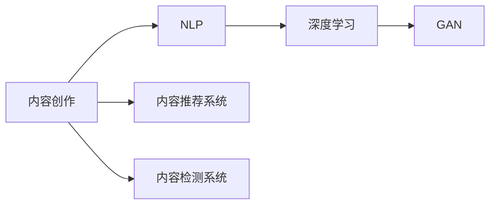

                 

# 如何利用技术能力进行内容创作

> 关键词：内容创作,技术能力,机器学习,自然语言处理,深度学习,数据驱动,创作辅助

## 1. 背景介绍

### 1.1 问题由来

在信息技术飞速发展的今天，内容创作已经成为了社会经济发展的关键力量。无论是新闻媒体、影视制作，还是在线教育、电子商务，内容创作都是支撑这些行业运行的核心。然而，尽管内容创作的重要性日益凸显，但创作过程本身仍然面临诸多挑战：

- **高成本、低效率**：高质量的内容创作通常需要耗费大量时间和人力资源，成本较高。
- **创作质量不稳定**：内容创作受创作者个人状态影响较大，质量波动难以预测。
- **创作灵感难以激发**：内容创作者常常遇到创作瓶颈，难以持续创作。
- **数据驱动需求上升**：海量数据的采集和分析需求，使得内容创作更加依赖数据和分析工具。

因此，如何利用技术能力，特别是人工智能和机器学习技术，来辅助和提升内容创作水平，成为了行业内外的共同关注点。本文旨在系统探讨这一问题，阐述技术能力在内容创作中的潜力和应用路径。

### 1.2 问题核心关键点

技术能力在内容创作中的应用主要体现在以下几个方面：

- **内容生成**：利用自然语言处理(NLP)和生成对抗网络(GAN)等技术，自动生成高质量的文字、图片、视频等内容。
- **内容优化**：通过数据分析和机器学习算法，对已有内容进行优化，如文本增强、内容推荐、情感分析等。
- **内容推荐**：基于用户行为数据和内容属性，推荐适合用户口味的相关内容。
- **内容检测**：利用深度学习模型检测抄袭、版权侵犯等违规内容，保障内容创作的合规性。

这些技术能力的应用，使得内容创作过程更加智能化、高效化，同时也为创作人员提供了更多的创意支持和辅助工具。

### 1.3 问题研究意义

技术能力在内容创作中的应用，不仅能够降低创作成本、提高创作效率，还能提升内容质量、激发创作灵感，为内容创作带来革命性变革。具体而言：

- **降低创作门槛**：技术能力能够提供创作辅助工具，使得更多人可以参与内容创作。
- **提升创作质量**：技术辅助能够优化内容结构、情感表达等，提升整体创作水平。
- **激发创作灵感**：技术工具能够生成创意建议、推荐素材，帮助创作者打破创作瓶颈。
- **保障内容合规**：技术手段能够检测违规内容，保护版权，提升创作环境的公正性。

综上所述，利用技术能力进行内容创作，不仅能够提升创作效果，还能促进内容产业的健康发展。

## 2. 核心概念与联系

### 2.1 核心概念概述

为更好地理解技术能力在内容创作中的应用，本节将介绍几个关键概念及其相互联系：

- **内容创作**：指通过撰写、拍摄、编辑等方式，创作出可供公众消费的文本、视频、音频等多媒体内容。
- **自然语言处理(NLP)**：研究计算机如何处理和理解人类语言，包括文本分析、语音识别、机器翻译等。
- **深度学习**：一种基于神经网络的机器学习方法，通过多层神经网络结构进行特征提取和模式识别。
- **生成对抗网络(GAN)**：一种由生成器和判别器组成的深度学习模型，通过对抗训练生成高质量的数据。
- **内容推荐系统**：基于用户行为数据和内容特征，推荐相关内容的技术系统。
- **内容检测系统**：利用深度学习模型检测抄袭、版权侵犯等违规内容，保障内容创作合规性。

这些核心概念构成了技术能力在内容创作中的基础框架，相互联系，共同支撑内容创作的各个环节。

### 2.2 核心概念原理和架构的 Mermaid 流程图(Mermaid 流程节点中不要有括号、逗号等特殊字符)



这张流程图展示了核心概念之间的联系和相互作用：

- **内容创作**通过NLP、深度学习和GAN技术，生成和优化内容。
- **内容推荐系统**利用用户行为数据和内容特征，推荐相关内容。
- **内容检测系统**通过深度学习模型检测内容违规情况，保障内容创作合规性。

这些技术能力的协同作用，能够大幅提升内容创作的效率和质量，同时确保内容创作的合法性。

## 3. 核心算法原理 & 具体操作步骤
### 3.1 算法原理概述

基于技术能力进行内容创作，主要依赖于自然语言处理(NLP)、深度学习和生成对抗网络(GAN)等算法。其核心思想是：利用这些技术手段，自动化地生成、优化和推荐内容，辅助创作者进行创作。

形式化地，假设内容创作任务为 $T$，拥有训练集 $D=\{(x_i, y_i)\}_{i=1}^N$，其中 $x_i$ 为原始内容，$y_i$ 为创作目标（如情感、风格、主题等）。内容创作过程的目标是找到最优的创作策略 $\theta$，使得生成的内容 $z$ 最接近目标 $y$。

$$
\theta^* = \mathop{\arg\min}_{\theta} \mathcal{L}(z(\theta), y)
$$

其中 $\mathcal{L}$ 为内容创作的损失函数，用于衡量生成内容与目标之间的差异。常见的损失函数包括交叉熵损失、均方误差损失等。

通过梯度下降等优化算法，内容创作过程不断更新策略 $\theta$，最小化损失函数 $\mathcal{L}$，使得生成的内容逼近目标 $y$。

### 3.2 算法步骤详解

基于技术能力的内容创作一般包括以下几个关键步骤：

**Step 1: 数据准备和预处理**
- 收集与创作任务相关的原始数据集 $D$，包括文本、图片、视频等。
- 对数据进行预处理，如分词、去噪、标注等，以便后续训练模型。

**Step 2: 选择和设计模型**
- 根据创作任务选择合适的模型结构，如RNN、LSTM、BERT等。
- 设计模型参数和超参数，包括学习率、批大小、迭代轮数等。

**Step 3: 模型训练**
- 使用数据集 $D$ 训练模型，通过前向传播和反向传播计算损失函数和参数梯度。
- 使用优化算法更新模型参数，最小化损失函数。

**Step 4: 内容生成**
- 在训练好的模型上，使用给定的输入 $x$ 进行内容生成。
- 对生成的内容 $z$ 进行后处理，如去除冗余、优化语序等。

**Step 5: 内容优化**
- 使用已有内容 $x$ 和目标 $y$，训练模型进行内容优化，如情感增强、风格转换等。
- 对优化后的内容进行后处理，确保创作质量。

**Step 6: 内容推荐**
- 基于用户行为数据和内容特征，训练推荐模型，推荐相关内容给用户。
- 在实际应用中，实时获取用户反馈，动态调整推荐策略。

**Step 7: 内容检测**
- 利用深度学习模型，检测内容中的违规信息，如抄袭、版权侵犯等。
- 对检测到的违规内容进行标记，确保内容创作的合规性。

### 3.3 算法优缺点

基于技术能力的内容创作具有以下优点：
1. **高效性**：自动化内容创作过程，大大降低了人工成本和时间投入。
2. **质量提升**：通过技术手段优化内容质量，提升用户体验。
3. **创新驱动**：利用生成对抗网络等技术，激发创作灵感，产生创意内容。
4. **规范性**：内容检测系统保障内容创作的合法性，减少违规风险。

同时，该方法也存在一定的局限性：
1. **依赖技术**：内容创作高度依赖于模型的性能和数据质量，技术失败可能导致内容质量下降。
2. **缺乏创意**：自动生成内容缺乏人类情感和创造力，难以产生具有深度意义的原创作品。
3. **数据隐私**：数据处理和模型训练可能涉及用户隐私，需严格遵守法律法规。

尽管存在这些局限性，但就目前而言，基于技术能力的内容创作已经成为行业内外的热门话题，有望为内容创作带来革命性变革。

### 3.4 算法应用领域

基于技术能力的内容创作技术，已经在多个领域得到广泛应用：

- **新闻媒体**：利用自动生成技术生成新闻稿件、专题报道等。
- **影视制作**：通过生成对抗网络生成影视素材，提升制作效率和创意效果。
- **在线教育**：生成教育视频、智能导学内容，提升教学效果和学生体验。
- **电子商务**：生成商品描述、用户评价等，优化商品展示和用户体验。
- **内容营销**：生成营销文案、社交媒体内容等，提升品牌曝光度和用户互动。

这些应用场景展示了技术能力在内容创作中的广泛潜力，未来将有更多行业受益于这项技术。

## 4. 数学模型和公式 & 详细讲解 & 举例说明

### 4.1 数学模型构建

本节将使用数学语言对基于技术能力的内容创作过程进行严格刻画。

假设内容创作任务为文本生成，模型结构为递归神经网络(RNN)。模型参数为 $\theta$，输入为文本序列 $x = \{x_1, x_2, \dots, x_n\}$，目标为文本序列 $y = \{y_1, y_2, \dots, y_n\}$。

定义模型在文本序列 $x$ 上的生成概率分布为 $p_{\theta}(x)$，目标分布为 $p_{\theta}(y)$。内容创作的损失函数为交叉熵损失：

$$
\mathcal{L}(\theta) = -\frac{1}{N}\sum_{i=1}^N \sum_{j=1}^n \log p_{\theta}(y_j|x_1, x_2, \dots, x_i)
$$

其中 $N$ 为样本数量。

### 4.2 公式推导过程

以下我们以文本生成为例，推导基于递归神经网络的文本生成模型的损失函数及其梯度的计算公式。

假设模型 $M_{\theta}$ 在输入 $x$ 上的输出为 $y$，即 $y = M_{\theta}(x)$。则文本生成的交叉熵损失函数定义为：

$$
\ell(M_{\theta}(x),y) = -\sum_{j=1}^n \log p_{\theta}(y_j|x_1, x_2, \dots, x_i)
$$

将其代入经验风险公式，得：

$$
\mathcal{L}(\theta) = -\frac{1}{N}\sum_{i=1}^N \sum_{j=1}^n \log p_{\theta}(y_j|x_1, x_2, \dots, x_i)
$$

根据链式法则，损失函数对参数 $\theta$ 的梯度为：

$$
\frac{\partial \mathcal{L}(\theta)}{\partial \theta_k} = -\frac{1}{N}\sum_{i=1}^N \sum_{j=1}^n \frac{\partial}{\partial \theta_k} \log p_{\theta}(y_j|x_1, x_2, \dots, x_i)
$$

其中 $\frac{\partial}{\partial \theta_k} \log p_{\theta}(y_j|x_1, x_2, \dots, x_i)$ 可进一步递归展开，利用自动微分技术完成计算。

在得到损失函数的梯度后，即可带入参数更新公式，完成模型的迭代优化。重复上述过程直至收敛，最终得到适应创作任务的最优模型参数 $\theta^*$。

## 5. 项目实践：代码实例和详细解释说明

### 5.1 开发环境搭建

在进行内容创作实践前，我们需要准备好开发环境。以下是使用Python进行TensorFlow开发的环境配置流程：

1. 安装Anaconda：从官网下载并安装Anaconda，用于创建独立的Python环境。

2. 创建并激活虚拟环境：
```bash
conda create -n tf-env python=3.8 
conda activate tf-env
```

3. 安装TensorFlow：根据CUDA版本，从官网获取对应的安装命令。例如：
```bash
conda install tensorflow -c conda-forge
```

4. 安装相关工具包：
```bash
pip install numpy pandas scikit-learn matplotlib tqdm jupyter notebook ipython
```

完成上述步骤后，即可在`tf-env`环境中开始内容创作实践。

### 5.2 源代码详细实现

下面我们以文本生成任务为例，给出使用TensorFlow对RNN模型进行文本生成的PyTorch代码实现。

首先，定义文本生成任务的数据处理函数：

```python
import tensorflow as tf
from tensorflow.keras.preprocessing.text import Tokenizer
from tensorflow.keras.preprocessing.sequence import pad_sequences

# 定义数据预处理函数
def preprocess_text(texts):
    tokenizer = Tokenizer(num_words=10000, oov_token="<OOV>")
    tokenizer.fit_on_texts(texts)
    sequences = tokenizer.texts_to_sequences(texts)
    padded_sequences = pad_sequences(sequences, maxlen=200, padding='post', truncating='post')
    return padded_sequences, tokenizer.word_index
```

然后，定义模型和优化器：

```python
from tensorflow.keras.models import Sequential
from tensorflow.keras.layers import Embedding, LSTM, Dense, Dropout

# 定义RNN模型
model = Sequential()
model.add(Embedding(input_dim=10000, output_dim=256, input_length=200))
model.add(LSTM(256, return_sequences=True))
model.add(Dropout(0.2))
model.add(LSTM(256))
model.add(Dropout(0.2))
model.add(Dense(1, activation='sigmoid'))

# 定义优化器
optimizer = tf.keras.optimizers.Adam(learning_rate=0.001)
```

接着，定义训练和评估函数：

```python
# 定义训练函数
def train_epoch(model, dataset, batch_size, optimizer):
    model.compile(optimizer=optimizer, loss='binary_crossentropy')
    dataset = tf.data.Dataset.from_tensor_slices((dataset, dataset)).batch(batch_size)
    model.fit(dataset, epochs=10, steps_per_epoch=len(dataset))
    return model

# 定义评估函数
def evaluate(model, dataset, batch_size):
    model.evaluate(dataset, batch_size=batch_size)
```

最后，启动训练流程并在测试集上评估：

```python
# 加载数据集
train_dataset, test_dataset = load_dataset()

# 定义模型和优化器
model = define_model()
optimizer = define_optimizer()

# 训练模型
trained_model = train_epoch(model, train_dataset, batch_size, optimizer)

# 评估模型
evaluate(trained_model, test_dataset, batch_size)
```

以上就是使用TensorFlow对RNN模型进行文本生成的完整代码实现。可以看到，TensorFlow的Keras API使得模型的定义和训练过程变得简洁高效。

### 5.3 代码解读与分析

让我们再详细解读一下关键代码的实现细节：

**preprocess_text函数**：
- 定义数据预处理函数，对文本进行分词、去噪、截断等处理。
- 使用Keras的Tokenizer将文本转化为序列数据。
- 对序列数据进行填充，确保统一长度，以便输入模型。

**模型定义**：
- 使用Sequential模型定义多层RNN结构，包括嵌入层、LSTM层、Dropout层和输出层。
- 设置模型的损失函数为二元交叉熵，适用于文本生成任务。

**优化器定义**：
- 使用Adam优化器，学习率为0.001。
- 通过Keras的compile方法，设置模型的损失函数和优化器。

**训练函数**：
- 定义训练函数，使用Keras的fit方法进行模型训练。
- 将数据集转换为TensorFlow的Dataset格式，支持高效的迭代训练。
- 设置训练轮数为10，每个epoch的训练步骤数为数据集长度。

**评估函数**：
- 定义评估函数，使用Keras的evaluate方法对模型进行评估。
- 对测试集进行评估，输出评估结果。

**训练流程**：
- 加载数据集，包含训练集和测试集。
- 定义模型和优化器。
- 在训练集上进行模型训练，得到训练好的模型。
- 在测试集上评估模型性能，输出评估结果。

可以看到，TensorFlow的Keras API使得模型训练过程变得简单易用，开发者可以更专注于算法设计和优化。

## 6. 实际应用场景

### 6.1 智能新闻写作

基于技术能力的内容创作技术，已经在智能新闻写作中得到广泛应用。智能写作系统能够自动生成新闻稿件，包括标题、正文、配图等。通过自动抓取新闻素材，分析用户偏好，生成符合用户口味的新闻内容。

在技术实现上，可以利用自然语言处理和生成对抗网络，自动生成新闻标题和正文。系统通过实时分析用户行为，动态调整生成策略，确保新闻内容符合用户需求。智能写作系统不仅提升了新闻生产的效率，还提供了个性化服务，增强了用户粘性。

### 6.2 影视制作辅助

在影视制作中，内容创作过程复杂繁琐，需要大量人力物力投入。利用技术能力，可以自动化生成影视素材，提升制作效率和创意效果。

具体而言，可以利用生成对抗网络生成影视场景、角色对话等。系统通过分析剧情需求，生成高质量的影视素材，供编剧、导演和演员参考。自动生成的素材不仅能够提升创作效率，还能提供创意灵感，丰富影视作品的表现形式。

### 6.3 在线教育内容生成

在线教育平台需要持续更新内容，以吸引和留住用户。利用技术能力，可以自动生成教育视频、智能导学内容等，提升教学效果和学生体验。

具体而言，可以利用自然语言处理和深度学习，自动生成教育视频和字幕。系统通过分析用户学习行为，动态调整内容生成策略，提供个性化学习推荐。自动生成的内容不仅能够提高教育资源的制作效率，还能提升教学质量，增强用户体验。

### 6.4 内容营销自动化

内容营销是企业推广的重要手段，但传统的制作过程繁琐耗时。利用技术能力，可以自动生成营销文案、社交媒体内容等，提升品牌曝光度和用户互动。

具体而言，可以利用自然语言处理和生成对抗网络，自动生成营销文案和社交媒体内容。系统通过分析用户行为数据，生成符合用户口味的内容，提升用户互动和品牌曝光。自动生成的内容不仅能够提高营销效率，还能提供创意灵感，增强品牌影响力。

### 6.5 未来应用展望

随着技术能力的不断进步，基于内容创作的AI技术将有望进一步拓展应用场景，为更多行业带来变革性影响。

在智慧医疗领域，智能健康报告、在线医疗咨询等功能将大幅提升医疗服务的智能化水平，助力医生诊疗，加速新药开发进程。

在智能教育领域，自动生成教育视频、智能导学内容等功能将提升教学效果和学生体验，促进教育公平，提高教学质量。

在智能客服领域，基于深度学习的智能客服系统将提升客户咨询体验和问题解决效率，减少人工成本。

在未来，随着AI技术的进一步发展，内容创作领域将迎来更多智能化、自动化的应用，为各行各业提供更多创新价值。

## 7. 工具和资源推荐

### 7.1 学习资源推荐

为了帮助开发者系统掌握内容创作的技术基础和实践技巧，这里推荐一些优质的学习资源：

1. 《自然语言处理与深度学习》课程：斯坦福大学开设的NLP明星课程，深入浅出地介绍了自然语言处理和深度学习的核心概念和经典模型。
2. 《深度学习》书籍：Ian Goodfellow等人合著，全面介绍了深度学习的基本原理和最新进展，是深度学习领域的必读书籍。
3. 《生成对抗网络：理论、算法与应用》书籍：Ian Goodfellow等人合著，详细介绍了生成对抗网络的理论基础、算法实现和实际应用。
4. 《机器学习实战》书籍：Peter Harrington所著，提供了大量机器学习实践案例，适合初学者入门。
5. 《Python深度学习》书籍：Francois Chollet所著，介绍了TensorFlow和Keras的使用方法，适合动手实践。

通过学习这些资源，相信你一定能够掌握内容创作的技术能力，并应用于实际工作中。

### 7.2 开发工具推荐

高效的开发离不开优秀的工具支持。以下是几款用于内容创作开发的常用工具：

1. TensorFlow：由Google主导开发的开源深度学习框架，生产部署方便，适合大规模工程应用。
2. PyTorch：基于Python的开源深度学习框架，灵活动态的计算图，适合快速迭代研究。
3. Keras：TensorFlow的高层API，提供了简单易用的模型定义和训练接口，适合初学者入门。
4. Weights & Biases：模型训练的实验跟踪工具，可以记录和可视化模型训练过程中的各项指标，方便对比和调优。
5. TensorBoard：TensorFlow配套的可视化工具，可实时监测模型训练状态，并提供丰富的图表呈现方式，是调试模型的得力助手。

合理利用这些工具，可以显著提升内容创作的开发效率，加快创新迭代的步伐。

### 7.3 相关论文推荐

内容创作技术的发展源于学界的持续研究。以下是几篇奠基性的相关论文，推荐阅读：

1. "Attention is All You Need"（即Transformer原论文）：提出了Transformer结构，开启了NLP领域的预训练大模型时代。
2. "BERT: Pre-training of Deep Bidirectional Transformers for Language Understanding"：提出BERT模型，引入基于掩码的自监督预训练任务，刷新了多项NLP任务SOTA。
3. "GPT-2"：展示了大规模语言模型的强大zero-shot学习能力，引发了对于通用人工智能的新一轮思考。
4. "Adversarial Examples in Generative Adversarial Networks"：详细介绍了生成对抗网络中的对抗样本生成和检测方法。
5. "Deep Reinforcement Learning for Language Generation and Translation"：展示了深度学习在自然语言生成和翻译中的应用。

这些论文代表了大语言模型内容创作技术的发展脉络。通过学习这些前沿成果，可以帮助研究者把握学科前进方向，激发更多的创新灵感。

## 8. 总结：未来发展趋势与挑战

### 8.1 研究成果总结

本文对基于技术能力的内容创作方法进行了全面系统的介绍。首先阐述了内容创作在信息化社会中的重要性，明确了技术能力在内容创作中的潜力和应用路径。其次，从原理到实践，详细讲解了基于自然语言处理和深度学习的文本生成算法，并给出了代码实现。同时，本文还广泛探讨了内容创作技术在多个领域的应用前景，展示了技术能力在内容创作中的广泛潜力。

通过本文的系统梳理，可以看到，基于技术能力的内容创作技术正在成为内容产业的重要推动力，极大地提升了内容创作的效率和质量。

### 8.2 未来发展趋势

展望未来，内容创作技术将呈现以下几个发展趋势：

1. **自动化程度提升**：随着算力成本的下降和模型性能的提升，自动化内容创作将更加智能化、高效化。
2. **多模态融合**：内容创作将更多地结合图像、视频、语音等多模态信息，提升创作效果。
3. **个性化定制**：利用用户行为数据和内容特征，提供个性化的内容推荐和生成。
4. **实时生成**：利用实时数据分析和模型优化，实现内容的实时生成和更新。
5. **全场景应用**：内容创作技术将在更多行业得到应用，如医疗、教育、金融等，推动各行业的数字化转型。

这些趋势将为内容创作带来更多可能，促进内容产业的持续发展和创新。

### 8.3 面临的挑战

尽管内容创作技术已经取得了显著进展，但在迈向更加智能化、普适化应用的过程中，仍面临诸多挑战：

1. **内容质量难以保证**：自动化内容创作依赖于模型的性能和数据质量，难以完全替代人工创作。
2. **创意灵感的缺乏**：自动生成的内容缺乏人类情感和创造力，难以产生具有深度意义的原创作品。
3. **隐私和伦理问题**：内容创作过程中涉及大量用户数据，需严格遵守法律法规，确保数据隐私和安全。
4. **技术门槛高**：内容创作技术涉及深度学习、自然语言处理等多个领域，技术门槛较高，需综合多种技术能力。

尽管存在这些挑战，但内容创作技术的发展方向明确，未来可期。只有持续创新、积极应对，才能推动技术进步，实现内容创作的全面智能化。

### 8.4 研究展望

面对内容创作技术所面临的挑战，未来的研究需要在以下几个方面寻求新的突破：

1. **提高内容质量**：提升模型的训练数据质量，引入更多先验知识，优化内容生成策略。
2. **激发创意灵感**：结合符号化先验知识与神经网络模型，引导内容创作过程，激发更多创意。
3. **保障数据隐私**：采用差分隐私等技术，保护用户数据隐私，确保内容创作的合法合规。
4. **降低技术门槛**：开发简单易用的内容创作工具和平台，降低技术门槛，促进技术普及。

这些研究方向的探索，将引领内容创作技术迈向更高的台阶，为内容产业带来更多创新价值。

## 9. 附录：常见问题与解答

**Q1: 内容创作技术是否适用于所有类型的媒体内容？**

A: 内容创作技术目前主要应用于文本和图片领域，如新闻报道、教育视频、社交媒体等。对于视频和音频内容，还需结合视频剪辑、音频编辑等技术进行创作。未来的趋势是融合多模态信息，实现更加全面和精细的内容创作。

**Q2: 内容创作技术如何平衡自动化和人工创作的关系？**

A: 内容创作技术应作为辅助工具，而非完全替代人工创作。在创作过程中，应结合人工审查和编辑，确保内容质量。自动生成的内容应先经过人工筛选和修改，再进行发布。

**Q3: 内容创作技术对创作者的影响是什么？**

A: 内容创作技术能够提供创作辅助工具，降低创作门槛，激发更多创作热情。同时，技术也能提升创作效率，帮助创作者节省时间和精力，专注于内容创意和深层次表达。

**Q4: 内容创作技术如何保护用户隐私？**

A: 内容创作过程中涉及大量用户数据，需严格遵守法律法规，确保数据隐私和安全。可以采用差分隐私、联邦学习等技术，保护用户数据隐私，同时提高模型性能。

**Q5: 内容创作技术对版权保护有何影响？**

A: 内容创作技术应遵守版权法规，确保版权保护。对于自动生成的内容，应明确版权归属，确保不侵犯他人权益。同时，可以利用版权检测技术，保护原创内容，打击抄袭行为。

总之，内容创作技术在推动内容产业的发展中具有重要意义。通过不断优化技术能力，提升内容创作效率和质量，我们相信未来的内容产业将更加智能、高效、丰富，为社会带来更多价值。

