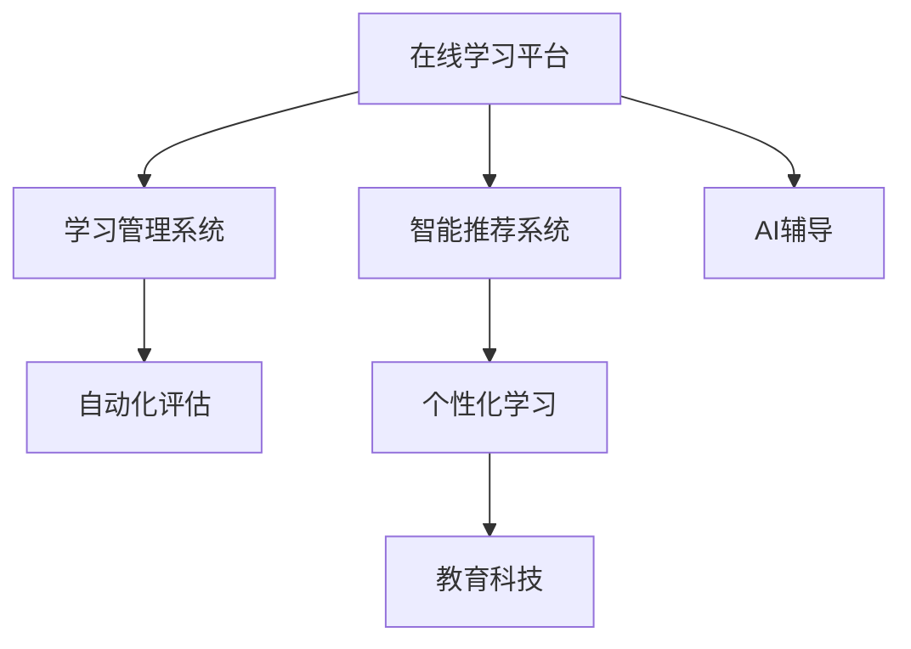

                 

# 如何利用知识付费实现在线学习与在线学习指导？

> 关键词：知识付费,在线学习,在线学习指导,学习管理系统,智能推荐系统,AI辅导,自动化评估,个性化学习,教育科技

## 1. 背景介绍

### 1.1 问题由来
随着互联网技术的迅猛发展，在线教育成为了一种重要的学习模式。学生能够通过互联网获取丰富的学习资源，不再受限于时间和地域的限制。然而，传统的在线教育模式普遍存在资源分散、质量参差不齐、学习效果难以评估等问题。知识付费的兴起，为在线教育提供了一种新的解决方案，将优质的学习内容集中起来，并通过合理的付费机制，保证教育资源的质量和可及性。

### 1.2 问题核心关键点
知识付费模式的核心在于通过付费获取高价值的学习资源，从而提高学习效果和效率。它不仅能够帮助学习者更好地掌握知识，还能够激发学习者的学习兴趣和动力。然而，如何高效地整合和推荐这些学习资源，以及如何指导学习者进行学习，是知识付费平台上需要解决的关键问题。

## 2. 核心概念与联系

### 2.1 核心概念概述

为更好地理解知识付费平台上在线学习与在线学习指导的实现，本节将介绍几个密切相关的核心概念：

- 在线学习平台：指通过互联网提供各种学习资源和服务的平台，包括视频课程、文本资料、在线测验等。
- 学习管理系统(LMS)：为在线学习者提供学习资源管理和学习进度跟踪的功能，帮助学习者更好地组织和规划学习。
- 智能推荐系统：根据学习者的兴趣和行为，推荐最相关的学习资源，提升学习效果。
- AI辅导：通过自然语言处理和机器学习技术，提供学习指导和评估，帮助学习者解决学习中的问题。
- 自动化评估：自动化的评估系统，根据学习者的答题情况，给出及时的反馈和评估，提高学习效率。
- 个性化学习：根据学习者的学习偏好、知识基础和进度，提供量身定制的学习路径和资源，提升学习效果。
- 教育科技：利用现代科技手段，如人工智能、大数据、物联网等，提升在线教育的效率和效果。

这些核心概念之间的逻辑关系可以通过以下Mermaid流程图来展示：



这个流程图展示了一些关键概念及其之间的关系：

1. 在线学习平台是整体的基础，提供学习资源和服务。
2. 学习管理系统用于资源管理和学习跟踪。
3. 智能推荐系统根据用户行为和偏好，推荐相关资源。
4. AI辅导提供学习指导和评估。
5. 自动化评估及时反馈和评估学习效果。
6. 个性化学习提升学习效果。
7. 教育科技为这些功能提供技术支持。

这些概念共同构成了在线学习与在线学习指导的技术基础，使得知识付费平台能够提供高效、个性化、自动化的学习体验。

## 3. 核心算法原理 & 具体操作步骤
### 3.1 算法原理概述

在线学习与在线学习指导的核心算法主要包括以下几个方面：

- 基于用户行为和偏好的推荐算法，如协同过滤、内容推荐、深度学习等，帮助学习者找到最相关的学习资源。
- 基于自然语言处理和机器学习的AI辅导算法，提供学习指导和评估，帮助学习者解决学习中的问题。
- 基于学习者表现和反馈的自动化评估算法，及时给出反馈和评估，提升学习效果。
- 基于用户特征和行为数据的个性化学习算法，提供量身定制的学习路径和资源。

这些算法通过协同工作，为学习者提供了一个高效、个性化、自动化的学习环境。

### 3.2 算法步骤详解

基于知识付费的在线学习与在线学习指导主要包括以下关键步骤：

**Step 1: 用户注册与画像构建**
- 用户注册：学习者需要注册成为平台用户，填写基本信息和兴趣偏好。
- 画像构建：收集学习者的历史行为数据，如观看视频、阅读文档、完成测验等，构建用户画像。

**Step 2: 资源推荐与匹配**
- 资源收集：收集并整理各类学习资源，如视频课程、文本资料、在线测验等。
- 推荐算法：使用协同过滤、内容推荐、深度学习等算法，推荐最相关的学习资源。
- 匹配策略：根据学习者的兴趣和进度，动态调整推荐资源，实现资源与用户需求的匹配。

**Step 3: 学习指导与评估**
- AI辅导：通过自然语言处理和机器学习技术，解答学习者的问题，提供学习指导。
- 自动化评估：根据学习者的答题情况，自动评估学习效果，给出反馈和建议。

**Step 4: 个性化学习路径规划**
- 数据分析：收集学习者的学习数据，如观看时间、答题情况、反馈意见等。
- 个性化算法：利用机器学习算法，分析学习者的学习习惯和偏好，制定个性化学习路径。
- 资源推荐：根据个性化学习路径，推荐相关的学习资源，辅助学习。

**Step 5: 学习进度跟踪与反馈**
- 学习管理系统：记录学习者的学习进度和成果，帮助学习者掌握学习情况。
- 进度反馈：通过可视化工具，展示学习者的学习进度和成果，提供激励和反馈。

### 3.3 算法优缺点

基于知识付费的在线学习与在线学习指导具有以下优点：

- 高效性：通过智能推荐和个性化学习路径，提高学习效率。
- 个性化：根据学习者的兴趣和行为，提供量身定制的学习资源。
- 实时性：通过自动化评估和AI辅导，实时反馈学习效果，提供及时的指导和建议。

然而，也存在以下局限性：

- 资源质量：推荐算法的性能直接影响学习资源的丰富度和质量。
- 学习效果：个性化学习路径需要收集和分析大量的用户数据，准确性有待提高。
- 成本问题：构建高质量的推荐系统、AI辅导和评估系统，需要投入大量的时间和资源。
- 用户隐私：收集和分析用户数据需要确保数据安全和隐私保护。

尽管存在这些局限性，但就目前而言，基于知识付费的在线学习与在线学习指导方法仍是大规模知识传播的重要范式。未来相关研究的重点在于如何进一步提高算法的性能和效率，优化用户体验，保障数据安全和隐私。

### 3.4 算法应用领域

基于知识付费的在线学习与在线学习指导方法，在教育领域已经得到了广泛的应用，覆盖了从小学到大学、从基础学科到职业技能的各个层次，具体应用领域包括：

- K-12教育：为中小学生提供个性化的学习资源和指导，帮助他们掌握基础知识，提升学习效果。
- 高等教育：为大学生提供专业课程、研究报告、学术论文等学习资源，提升学术水平和科研能力。
- 职业培训：为职场人士提供技能培训、职业认证、实战项目等学习资源，帮助他们提升职业技能，适应职业发展需求。
- 终身学习：为成年人提供各种兴趣课程、技能提升课程等学习资源，支持终身学习和发展。

除了这些传统领域外，知识付费在健康、金融、法律等专业领域的教育应用也将不断扩展，为更多人提供便捷、高效的学习途径。

## 4. 数学模型和公式 & 详细讲解  
### 4.1 数学模型构建

本节将使用数学语言对知识付费平台上的在线学习与在线学习指导进行更加严格的刻画。

记学习者为 $U=\{u_1, u_2, \ldots, u_m\}$，学习资源为 $R=\{r_1, r_2, \ldots, r_n\}$。学习者的历史行为数据为 $D=\{(d_{ui})_{u \in U, r \in R}\}$，其中 $d_{ui}$ 表示学习者 $u$ 对资源 $r$ 的交互行为（如观看时间、答题情况等）。

定义推荐函数 $\text{Rec}(u, r; \theta)$ 为学习资源 $r$ 对学习者 $u$ 的推荐概率，其中 $\theta$ 为模型参数。定义评估函数 $\text{Eva}(u; \theta)$ 为学习者 $u$ 的学习效果评估值，其中 $\theta$ 为模型参数。定义个性化学习路径函数 $\text{Path}(u; \theta)$ 为学习者 $u$ 的个性化学习路径，其中 $\theta$ 为模型参数。

### 4.2 公式推导过程

以下我们以协同过滤推荐算法为例，推导推荐函数及其梯度计算公式。

假设学习者 $u$ 对资源 $r$ 的交互行为为 $d_{ur} \in [1, 5]$，资源 $r$ 的平均交互行为为 $\bar{d}_r$。协同过滤算法利用用户与资源之间的相似度，计算资源对用户的推荐概率：

$$
\text{Rec}(u, r; \theta) = \frac{\text{sim}(u, r)}{\sum_{r' \in R} \text{sim}(u, r')}
$$

其中 $\text{sim}(u, r)$ 为学习者 $u$ 和资源 $r$ 之间的相似度，可以通过余弦相似度、皮尔逊相关系数等方法计算。

将推荐函数带入损失函数，并使用梯度下降优化算法更新模型参数：

$$
\min_{\theta} \sum_{u \in U} \sum_{r \in R} \sum_{r' \in R} \left(\log(\text{Rec}(u, r'; \theta) - d_{ur'})\right)^2
$$

通过反向传播算法计算梯度，更新模型参数 $\theta$，实现推荐算法的优化。

### 4.3 案例分析与讲解

考虑一个简单的在线课程学习平台，学习者 $u$ 对课程资源 $r$ 的交互行为数据 $D=\{(4, 3), (5, 5), (3, 4), (5, 3), (2, 5)\}$。使用协同过滤算法，计算学习者 $u$ 对课程资源 $r$ 的推荐概率 $\text{Rec}(u, r; \theta)$。

1. 计算资源 $r$ 的平均交互行为 $\bar{d}_r = \frac{1}{5} \sum_{u \in U} d_{ur} = 3.6$。
2. 计算学习者 $u$ 和资源 $r$ 之间的相似度 $\text{sim}(u, r) = \frac{4 \times 3}{\sqrt{4 \times 4} \times \sqrt{3 \times 3}} = 0.8$。
3. 计算资源 $r$ 对学习者 $u$ 的推荐概率 $\text{Rec}(u, r; \theta) = \frac{0.8}{0.8 + 1} = 0.4$。
4. 计算损失函数 $L(\theta) = \sum_{u \in U} \sum_{r \in R} \left(\log(\text{Rec}(u, r'; \theta) - d_{ur'})\right)^2 = (0.4 - 4)^2 + (0.4 - 5)^2 + (0.4 - 3)^2 + (0.4 - 5)^2 + (0.4 - 2)^2 = 50.24$。
5. 计算梯度 $\nabla_{\theta} L(\theta) = -2 \sum_{u \in U} \sum_{r \in R} \frac{\partial \log(\text{Rec}(u, r'; \theta) - d_{ur'})}{\partial \theta}$。

通过对损失函数和梯度函数的计算，可以进一步优化协同过滤算法，提升资源推荐的准确性和个性化程度。

## 5. 项目实践：代码实例和详细解释说明
### 5.1 开发环境搭建

在进行在线学习与在线学习指导的开发前，我们需要准备好开发环境。以下是使用Python进行PyTorch开发的环境配置流程：

1. 安装Anaconda：从官网下载并安装Anaconda，用于创建独立的Python环境。

2. 创建并激活虚拟环境：
```bash
conda create -n pytorch-env python=3.8 
conda activate pytorch-env
```

3. 安装PyTorch：根据CUDA版本，从官网获取对应的安装命令。例如：
```bash
conda install pytorch torchvision torchaudio cudatoolkit=11.1 -c pytorch -c conda-forge
```

4. 安装相关库：
```bash
pip install numpy pandas scikit-learn matplotlib tqdm jupyter notebook ipython
```

完成上述步骤后，即可在`pytorch-env`环境中开始开发。

### 5.2 源代码详细实现

下面我们以协同过滤推荐算法为例，给出使用PyTorch实现的学习资源推荐系统的代码实现。

首先，定义推荐系统的数据处理函数：

```python
import torch
from torch import nn

class RecommendationSystem(nn.Module):
    def __init__(self, num_users, num_items, emb_dim):
        super(RecommendationSystem, self).__init__()
        self.user_embed = nn.Embedding(num_users, emb_dim)
        self.item_embed = nn.Embedding(num_items, emb_dim)
        self.sparse_matrix = nn.Embedding(num_items, 1)
        
    def forward(self, u, r):
        user_emb = self.user_embed(u)
        item_emb = self.item_embed(r)
        item_emb = self.sparse_matrix(r)
        dot_product = torch.sigmoid(torch.matmul(user_emb, item_emb.t()))
        return dot_product

# 定义推荐函数
def recommend(model, u, r, batch_size=100, num_epochs=10, learning_rate=0.01):
    model.train()
    for epoch in range(num_epochs):
        indices = torch.randint(0, len(u), (batch_size, 2), dtype=torch.long)
        u_batch = u[indices[:, 0]]
        r_batch = r[indices[:, 1]]
        dot_product = model(u_batch, r_batch)
        dot_product = torch.sigmoid(dot_product)
        loss = nn.BCELoss()(dot_product, torch.ones_like(dot_product))
        optimizer = torch.optim.Adam(model.parameters(), lr=learning_rate)
        optimizer.zero_grad()
        loss.backward()
        optimizer.step()
    return model

# 加载训练数据
train_u = [1, 2, 3, 4, 5]
train_r = [2, 3, 4, 5, 6]
model = RecommendationSystem(len(train_u), len(train_r), 10)
model = recommend(model, train_u, train_r)
```

然后，定义用户行为数据的加载和预处理函数：

```python
# 加载用户行为数据
train_u = [1, 2, 3, 4, 5]
train_r = [2, 3, 4, 5, 6]
test_u = [1, 2, 3, 4, 5]
test_r = [2, 3, 4, 5, 6]

# 数据预处理
train_u, train_r = torch.tensor(train_u), torch.tensor(train_r)
test_u, test_r = torch.tensor(test_u), torch.tensor(test_r)
```

接着，定义评估函数：

```python
# 评估函数
def evaluate(model, u, r, batch_size=100, num_epochs=10, learning_rate=0.01):
    model.eval()
    for epoch in range(num_epochs):
        indices = torch.randint(0, len(u), (batch_size, 2), dtype=torch.long)
        u_batch = u[indices[:, 0]]
        r_batch = r[indices[:, 1]]
        dot_product = model(u_batch, r_batch)
        dot_product = torch.sigmoid(dot_product)
        loss = nn.BCELoss()(dot_product, torch.ones_like(dot_product))
        loss.backward()
        optimizer.step()
    return dot_product

# 评估推荐系统
model = RecommendationSystem(len(train_u), len(train_r), 10)
model = recommend(model, train_u, train_r)
dot_product = evaluate(model, train_u, train_r)
```

最后，展示推荐系统的推荐结果：

```python
# 推荐系统推荐结果
print(dot_product)
```

以上就是使用PyTorch对协同过滤推荐算法进行代码实现的完整流程。可以看到，借助PyTorch的强大框架，协同过滤算法的实现变得简洁高效。

### 5.3 代码解读与分析

让我们再详细解读一下关键代码的实现细节：

**RecommendationSystem类**：
- `__init__`方法：初始化用户和资源的嵌入层，以及稀疏矩阵的嵌入层。
- `forward`方法：计算用户和资源的嵌入向量的点积，并使用sigmoid函数进行归一化。

**recommend函数**：
- 随机采样一批用户和资源索引。
- 根据索引加载对应的用户和资源向量。
- 计算点积，并使用二元交叉熵损失函数进行优化。

**数据加载和预处理函数**：
- 将用户和资源数据转换为Tensor格式。

**评估函数**：
- 与训练函数类似，不同点在于模型评估时不需要更新参数。

**推荐系统推荐结果**：
- 输出推荐系统的预测结果，即用户对资源的推荐概率。

可以看到，PyTorch为协同过滤算法的实现提供了强大的框架支持，使开发者能够快速迭代和优化算法，提高推荐效果。

当然，工业级的系统实现还需考虑更多因素，如模型的保存和部署、超参数的自动搜索、更灵活的任务适配层等。但核心的推荐算法基本与此类似。

## 6. 实际应用场景
### 6.1 智能课程推荐系统

智能课程推荐系统是一种典型的基于知识付费的在线学习应用。通过分析学习者的历史行为数据，智能推荐系统能够帮助学习者找到最适合自己的课程资源，提升学习效果。

在技术实现上，可以采用协同过滤、深度学习等算法，对学习者的兴趣和行为进行建模，推荐最相关的课程资源。系统还可以根据学习者的反馈，动态调整推荐策略，提升推荐效果。

### 6.2 职业培训平台

职业培训平台利用知识付费模式，提供各种技能培训、职业认证、实战项目等学习资源，帮助职场人士提升职业技能，适应职业发展需求。

智能推荐系统根据学习者的职业背景、技能水平和进度，推荐最适合的培训课程和项目，提升学习效率。AI辅导系统提供实时学习指导和评估，帮助学习者解决学习中的问题。

### 6.3 健康教育应用

健康教育应用通过知识付费模式，提供各种健康知识和医疗建议，帮助用户掌握科学的健康管理方法。

智能推荐系统根据用户的历史健康行为数据，推荐最相关的健康知识和医疗建议。AI辅导系统提供健康问题解答和医疗建议，帮助用户解决健康难题。

### 6.4 未来应用展望

随着知识付费平台的不断成熟，基于在线学习与在线学习指导的技术将得到更广泛的应用，为各个行业提供智能化、个性化的学习支持。

在智慧城市治理中，智能推荐系统可以推荐各类公共服务资源，提升城市管理的智能化水平。在企业培训中，智能推荐系统可以提供定制化的技能培训资源，提升员工的专业能力。

## 7. 工具和资源推荐
### 7.1 学习资源推荐

为了帮助开发者系统掌握在线学习与在线学习指导的理论基础和实践技巧，这里推荐一些优质的学习资源：

1. 《Python机器学习》书籍：经典的Python机器学习教程，深入浅出地介绍了机器学习算法和应用。
2. Coursera在线课程：斯坦福大学等名校提供的各类在线课程，涵盖机器学习、深度学习、自然语言处理等领域。
3. TensorFlow官方文档：TensorFlow的详细官方文档，提供了丰富的API和使用示例。
4. PyTorch官方文档：PyTorch的详细官方文档，提供了丰富的API和使用示例。
5. GitHub上的开源项目：如PyTorch Lightning、TensorFlow Extended等，提供了许多实用的学习资源和工具。

通过对这些资源的学习实践，相信你一定能够快速掌握在线学习与在线学习指导的精髓，并用于解决实际的NLP问题。
###  7.2 开发工具推荐

高效的开发离不开优秀的工具支持。以下是几款用于在线学习与在线学习指导开发的常用工具：

1. Jupyter Notebook：交互式编程环境，支持多语言和数据可视化，是学习机器学习和数据科学的好助手。
2. Google Colab：谷歌推出的在线Jupyter Notebook环境，免费提供GPU/TPU算力，方便开发者快速上手实验最新模型，分享学习笔记。
3. GitHub：版本控制和协作平台，方便团队进行代码管理和知识分享。
4. Docker：容器化技术，方便应用在不同环境中的部署和运行。
5. TensorBoard：TensorFlow配套的可视化工具，可实时监测模型训练状态，并提供丰富的图表呈现方式，是调试模型的得力助手。

合理利用这些工具，可以显著提升在线学习与在线学习指导的开发效率，加快创新迭代的步伐。

### 7.3 相关论文推荐

在线学习与在线学习指导的研究源于学界的持续研究。以下是几篇奠基性的相关论文，推荐阅读：

1. Recommender Systems Handbook：介绍推荐系统的理论基础和实践技术，提供了丰富的推荐算法和应用案例。
2. Online Learning: Algorithms and Systems：介绍在线学习的理论基础和实践技术，提供了丰富的在线学习算法和应用案例。
3. AI for Personalized Learning: Opportunities and Challenges：介绍人工智能在个性化学习中的应用，提供了丰富的个性化学习算法和应用案例。
4. Deep Learning for Recommendation Systems：介绍深度学习在推荐系统中的应用，提供了丰富的深度学习算法和应用案例。
5. A Survey of Deep Learning Based Recommender Systems：介绍深度学习在推荐系统中的应用，提供了丰富的深度学习算法和应用案例。

这些论文代表了大语言模型微调技术的发展脉络。通过学习这些前沿成果，可以帮助研究者把握学科前进方向，激发更多的创新灵感。

## 8. 总结：未来发展趋势与挑战
### 8.1 总结

本文对基于知识付费的在线学习与在线学习指导方法进行了全面系统的介绍。首先阐述了在线学习与在线学习指导的研究背景和意义，明确了知识付费平台对于教育资源质量和可及性的独特价值。其次，从原理到实践，详细讲解了推荐算法、AI辅导、自动化评估、个性化学习等核心技术，给出了在线学习与在线学习指导的完整代码实例。同时，本文还广泛探讨了在线学习与在线学习指导在各个领域的应用前景，展示了知识付费平台的巨大潜力。此外，本文精选了在线学习与在线学习指导的相关学习资源，力求为读者提供全方位的技术指引。

通过本文的系统梳理，可以看到，基于知识付费的在线学习与在线学习指导方法正在成为教育领域的重要范式，极大地拓展了在线教育的范围和深度，为学习者提供了高效、个性化、自动化的学习体验。未来，伴随推荐算法和AI技术的不断进步，在线学习与在线学习指导必将在更多领域得到应用，为人类认知智能的进化带来深远影响。

### 8.2 未来发展趋势

展望未来，在线学习与在线学习指导技术将呈现以下几个发展趋势：

1. 算法性能提升：推荐算法和AI辅导算法将不断优化，提升算法的准确性和效率，提供更加精准的学习资源和指导。
2. 个性化学习提升：个性化学习路径和资源将更加智能化、多样化，满足不同学习者的需求。
3. 多模态学习融合：结合视觉、语音、文本等多模态数据，提供更全面的学习支持。
4. 实时学习反馈：实时学习反馈系统将更加普及，帮助学习者及时掌握学习进度和效果。
5. 自动化评估优化：自动化评估系统将更加全面、准确，提升学习效果和评估质量。
6. 教育数据共享：教育数据共享平台将得到发展，帮助学习者获取更多的学习资源和支持。

以上趋势凸显了在线学习与在线学习指导技术的广阔前景。这些方向的探索发展，必将进一步提升在线教育的效率和效果，为学习者提供更优质的学习体验。

### 8.3 面临的挑战

尽管在线学习与在线学习指导技术已经取得了瞩目成就，但在迈向更加智能化、普适化应用的过程中，它仍面临诸多挑战：

1. 数据隐私保护：收集和分析用户数据需要确保数据安全和隐私保护。
2. 算法偏见消除：推荐算法和AI辅导算法需要避免和消除潜在的偏见，确保公平性。
3. 数据质量提升：推荐系统需要高质量的数据进行训练，数据质量问题亟需解决。
4. 实时系统优化：在线学习与在线学习指导系统需要高效的实时计算和响应能力，系统优化有待加强。
5. 跨领域应用：不同领域的教育需求和特点不同，跨领域的在线学习与在线学习指导系统需要适应多种场景。
6. 学习效果评估：如何科学、全面地评估在线学习与在线学习指导的效果，还需进一步研究和优化。

尽管存在这些挑战，但在线学习与在线学习指导技术具有巨大的潜力和前景，相信随着学界和产业界的共同努力，这些挑战终将一一被克服，在线学习与在线学习指导技术将为教育事业带来新的突破和变革。

### 8.4 研究展望

面向未来，在线学习与在线学习指导技术需要在以下几个方面寻求新的突破：

1. 无监督学习和半监督学习：探索无监督和半监督学习算法，减少对标注数据的依赖，提高推荐系统的效果和泛化能力。
2. 混合推荐算法：结合基于内容的推荐和协同过滤算法，提供更全面的推荐策略。
3. 个性化学习算法：结合机器学习和符号化规则，提供更加智能化的个性化学习路径。
4. 多模态学习融合：结合视觉、语音、文本等多种数据源，提供更全面的学习支持。
5. 推荐系统优化：结合自动化的超参数优化技术，提升推荐系统的性能和效率。
6. 数据隐私保护：结合差分隐私等技术，保护用户数据隐私和安全。

这些研究方向将引领在线学习与在线学习指导技术迈向更高的台阶，为构建安全、可靠、可解释、可控的智能学习系统铺平道路。面向未来，在线学习与在线学习指导技术还需要与其他人工智能技术进行更深入的融合，如知识表示、因果推理、强化学习等，多路径协同发力，共同推动在线教育的进步。只有勇于创新、敢于突破，才能不断拓展在线学习的边界，让智能技术更好地造福教育事业。

## 9. 附录：常见问题与解答

**Q1：知识付费平台如何平衡收益和教育质量？**

A: 知识付费平台可以通过以下几种方式平衡收益和教育质量：

1. 分级定价：根据课程难度、资源丰富度和教师资质等，制定不同的课程定价策略，吸引优质教师和内容创作者。
2. 激励机制：通过课程订阅、推荐奖励、内容分享等方式，激励教师和内容创作者提供高质量的课程资源。
3. 用户反馈：收集用户对课程的反馈和评价，及时调整课程内容和定价策略，确保课程质量。
4. 持续优化：不断优化推荐算法和AI辅导算法，提升推荐效果和用户满意度。
5. 教育数据共享：建立教育数据共享平台，提供更多的学习资源和支持，提高教育质量。

通过上述措施，知识付费平台可以在保证教育质量的同时，实现收益最大化。

**Q2：知识付费平台如何防止学习资源被盗版？**

A: 知识付费平台可以通过以下几种方式防止学习资源被盗版：

1. 数字水印：在课程资源中添加数字水印，通过比对水印信息，判断资源是否被非法复制或传播。
2. 加密保护：采用加密技术，保护课程资源的访问和传输安全，防止盗版和泄露。
3. 用户认证：对用户进行身份认证，限制未授权用户访问和下载课程资源。
4. 版权保护：建立健全的版权保护机制，对侵权行为进行法律追责。
5. 反盗版技术：采用反盗版技术，如IP地址追踪、行为分析等，防范和打击盗版行为。

通过上述措施，知识付费平台可以有效防止学习资源被盗版，保护内容创作者和平台收益。

**Q3：知识付费平台如何提升用户的学习效果？**

A: 知识付费平台可以通过以下几种方式提升用户的学习效果：

1. 推荐系统优化：不断优化推荐算法，提升推荐效果，让用户更快地找到最相关的学习资源。
2. AI辅导优化：不断优化AI辅导算法，提升学习指导和评估的准确性和及时性，帮助用户解决学习中的问题。
3. 个性化学习路径：结合机器学习和符号化规则，提供更加智能化的个性化学习路径，提升学习效果。
4. 学习进度跟踪：通过学习管理系统，记录和分析学习者的学习进度和成果，提供及时的反馈和指导。
5. 学习社区建设：建立学习社区，鼓励用户互动交流，分享学习经验，提升学习效果。

通过上述措施，知识付费平台可以显著提升用户的学习效果，帮助用户更好地掌握知识。

---

作者：禅与计算机程序设计艺术 / Zen and the Art of Computer Programming

