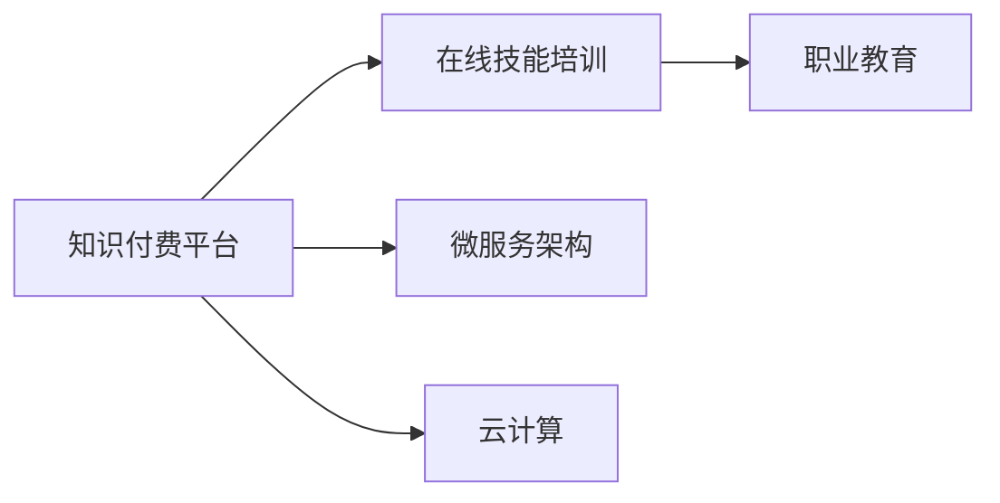

                 

# 如何利用知识付费实现在线技能培训与职业教育？

## 1. 背景介绍

在当今快速发展的数字时代，知识和技能的更新迭代速度极快，传统的教育方式已无法满足人们对于终身学习和职业技能提升的需求。知识付费平台应运而生，利用互联网技术，以在线课程、直播讲座、电子书、工具服务等形式，为学习者提供便捷、高效、个性化的学习体验。在线技能培训与职业教育成为教育领域的一片蓝海，吸引着众多企业、机构和个人的关注与投入。

本文将深入探讨如何利用知识付费平台实现在线技能培训与职业教育，详细解析核心概念、技术原理、实施步骤以及应用领域，并提出未来发展趋势和面临的挑战，旨在为相关从业者提供全面、系统的参考。

## 2. 核心概念与联系

### 2.1 核心概念概述

- **知识付费平台**：利用互联网技术，提供高质量、专业化的在线学习资源，为学习者提供个性化、交互式的学习体验，支持付费模式，旨在提升学习效率和质量。

- **在线技能培训**：通过在线课程、模拟实战、案例分析等方式，帮助学习者掌握特定技能，提升专业水平和工作能力。

- **职业教育**：针对某一职业领域，提供系统的知识体系和实操技能培训，使学习者能够胜任相关岗位，满足行业需求。

- **微服务架构**：基于服务化思想，将复杂的应用拆分为一系列独立、轻量级、易于维护的微服务，提高系统的灵活性、可扩展性和可靠性。

- **云计算**：通过互联网提供动态、可伸缩的计算资源，支持大数据处理、分布式存储、弹性计算等能力，为在线教育平台提供坚实的基础设施支持。

### 2.2 核心概念原理和架构的 Mermaid 流程图



## 3. 核心算法原理 & 具体操作步骤

### 3.1 算法原理概述

知识付费平台的在线技能培训与职业教育主要依赖于以下算法原理：

1. **推荐算法**：通过分析用户行为数据（如浏览记录、购买历史、评分反馈等），为用户推荐最相关的课程和资源，提高学习效率。

2. **自适应学习算法**：根据学习者的学习进度、知识掌握情况、兴趣偏好等，动态调整课程难度和内容，实现个性化学习。

3. **自然语言处理（NLP）**：利用NLP技术，解析学习者的问答、评论等文本数据，了解其需求和困惑，提供及时有效的反馈和支持。

4. **图像识别与处理**：通过图像识别技术，解析课程视频、教材中的图表、实验结果等视觉内容，辅助学习者理解和应用知识。

5. **交互式学习**：通过在线编程环境、虚拟实验室、协作工具等，支持学习者进行实操练习和项目开发，提升实战能力。

### 3.2 算法步骤详解

#### 3.2.1 用户画像构建

- 收集用户基本信息（如年龄、职业、教育背景等）。
- 分析用户在平台上的行为数据（如浏览记录、购买记录、评分反馈等）。
- 使用聚类算法（如K-means、GMM）对用户进行分类，构建详细的用户画像。

#### 3.2.2 课程推荐算法

- 分析课程内容和特点，提取关键特征（如难度系数、学习时长、受众定位等）。
- 根据用户画像，使用协同过滤、内容过滤、混合过滤等算法，为用户推荐最相关的课程。
- 引入冷启动问题解决方法，如基于内容的推荐、基于用户迁移的推荐等，解决新用户和老用户推荐难度差异。

#### 3.2.3 自适应学习算法

- 设计自适应学习模型，如基于规则的、基于统计的、基于模型的等。
- 实时监控学习者的学习进度、成绩、反馈等数据，动态调整学习内容和难度。
- 引入机器学习模型（如回归分析、决策树、神经网络等），预测学习者的学习趋势和难点，提供个性化建议。

#### 3.2.4 NLP技术应用

- 解析学习者提出的问题，使用NLP技术进行语义理解，获取问题核心。
- 基于问题知识图谱，提供精准的答案或相关课程推荐。
- 使用情感分析技术，识别学习者的情绪状态，及时调整教学策略和内容。

#### 3.2.5 图像识别与处理

- 解析课程视频、教材中的图表、实验结果等视觉内容。
- 使用图像识别技术，提取关键信息，如参数值、趋势图等。
- 结合文本数据，提供更加直观、生动的学习体验。

#### 3.2.6 交互式学习

- 提供在线编程环境、虚拟实验室、协作工具等，支持学习者进行实操练习和项目开发。
- 利用游戏化设计理念，设计互动性强的学习任务和挑战，增强学习动力。
- 实时监控学习者的操作，提供及时的反馈和指导，提升学习效果。

### 3.3 算法优缺点

**优点**：

- 个性化、互动性强：通过推荐算法、自适应学习算法等，提供个性化、互动式的学习体验。
- 学习效率高：利用云计算、微服务架构等技术，实现高可伸缩性、低延迟的在线学习系统。
- 灵活性高：支持多种形式的学习资源，包括视频、文档、代码等，满足不同学习者的需求。

**缺点**：

- 成本高：高品质的在线课程和资源开发需要大量人力、物力投入。
- 质量参差不齐：平台上的课程质量、师资力量存在差异，影响整体教学效果。
- 学习动机不足：线上学习的自律性要求较高，部分学习者难以保持长期学习。

### 3.4 算法应用领域

- **IT与编程**：提供从入门到高级的编程课程，涵盖多种编程语言、开发工具、技术框架等。
- **数据科学**：提供数据分析、机器学习、深度学习等课程，涵盖数据处理、模型训练、项目实践等。
- **设计**：提供平面设计、UI/UX设计、视觉传达设计等课程，涵盖软件工具使用、设计原则、实战案例等。
- **金融与会计**：提供财务分析、投资管理、会计实务等课程，涵盖理论知识、实操技能、案例分析等。
- **医学与健康**：提供临床医学、护理学、健康管理等课程，涵盖基础知识、实操技能、案例分析等。
- **语言学习**：提供多种语言课程，涵盖发音、语法、听力、口语、阅读、写作等技能训练。

## 4. 数学模型和公式 & 详细讲解 & 举例说明

### 4.1 数学模型构建

以推荐系统为例，推荐算法主要基于协同过滤和内容过滤两种模型。协同过滤模型根据用户之间的相似性进行推荐，内容过滤模型根据用户对内容的评分进行推荐。

- **协同过滤模型**：$R_{ij}=\frac{1}{1+\sum_k \frac{p_{ik}p_{kj}}{q_{ik}q_{kj}}}$
  - $R_{ij}$：用户i对项目j的评分预测值。
  - $p_{ik}$：用户i对项目k的评分。
  - $q_{ik}$：用户i与项目k的相似度。

- **内容过滤模型**：$P_{ij}=\frac{e^{z_{ij}}}{\sum_{k}e^{z_{ik}}}$
  - $P_{ij}$：用户i对项目j的评分预测值。
  - $z_{ij}=\sum_k w_k \times (p_{ik} \times q_{jk})$，其中$w_k$为特征权重。

### 4.2 公式推导过程

以协同过滤模型为例，假设用户i对项目k的评分$p_{ik}=3$，用户i与项目k的相似度$q_{ik}=0.8$，用户j对项目k的评分$p_{jk}=4$，用户j与项目k的相似度$q_{jk}=0.6$，用户i与用户j的相似度$q_{ij}=0.5$。

计算用户i对项目j的评分预测值$R_{ij}$：

$$
R_{ij} = \frac{1}{1+\frac{p_{ik}p_{kj}}{q_{ik}q_{kj}}} = \frac{1}{1+\frac{3 \times 4}{0.8 \times 0.6}} = \frac{1}{1+\frac{12}{4.8}} = \frac{1}{4} = 0.25
$$

假设用户i的阈值为4，用户i对项目j的评分预测值为0.25，低于阈值，因此不推荐项目j给用户i。

### 4.3 案例分析与讲解

以Python编程课程推荐为例：

- **用户画像**：25岁，金融行业，本科以上学历，无编程经验。
- **课程信息**：Python基础、数据结构与算法、Web开发、数据分析、机器学习。
- **用户评分**：Python基础4分，数据结构与算法3分，Web开发2分，数据分析4分，机器学习3分。
- **课程特征**：难度系数、学习时长、受众定位、评价分数。

使用协同过滤算法，对用户i进行推荐：

- **相似用户**：25岁，金融行业，本科以上学历，无编程经验，对Python基础和数据分析课程评分较高。
- **推荐课程**：根据相似用户评分，推荐Web开发和机器学习课程。

### 4.4 代码实例和详细解释说明

#### 4.4.1 开发环境搭建

- **Python环境**：安装Python 3.7及以上版本，使用Anaconda或Miniconda创建虚拟环境。
- **数据库**：安装MySQL或MongoDB，用于存储用户信息、课程信息、评分记录等。
- **推荐系统框架**：安装TensorFlow或PyTorch，搭建协同过滤或内容过滤推荐系统。

#### 4.4.2 源代码详细实现

以TensorFlow为例，推荐系统代码实现：

```python
import tensorflow as tf
import numpy as np

# 协同过滤模型
def collaborative_filtering(X, Y):
    num_users, num_items = X.shape
    num_factors = 10
    latent_factors = np.random.normal(size=(num_users, num_factors))
    user_biases = np.random.normal(size=(num_users))
    item_biases = np.random.normal(size=(num_items))
    predictions = []
    for i in range(num_users):
        prediction = 0
        for j in range(num_items):
            prediction += latent_factors[i][j] * latent_factors[j] + user_biases[i] + item_biases[j]
        predictions.append(prediction)
    return predictions

# 内容过滤模型
def content_based_filtering(X, Y):
    num_users, num_items = X.shape
    num_factors = 10
    latent_factors = np.random.normal(size=(num_items, num_factors))
    item_biases = np.random.normal(size=(num_items))
    predictions = []
    for i in range(num_users):
        prediction = 0
        for j in range(num_items):
            prediction += np.dot(X[i], latent_factors[j]) + item_biases[j]
        predictions.append(prediction)
    return predictions

# 加载数据
users, items, ratings = load_data()

# 训练模型
num_epochs = 100
learning_rate = 0.01
loss = tf.keras.losses.MeanSquaredError()
model = tf.keras.Sequential()
model.add(tf.keras.layers.Dense(64, activation='relu', input_shape=(num_factors,)))
model.add(tf.keras.layers.Dense(1))
model.compile(optimizer=tf.keras.optimizers.Adam(learning_rate), loss=loss)
history = model.fit(X_train, y_train, epochs=num_epochs, validation_data=(X_test, y_test))

# 测试模型
test_predictions = model.predict(X_test)
```

#### 4.4.3 代码解读与分析

- **协同过滤模型**：利用矩阵分解方法，将用户和项目表示为低维向量，计算用户对项目的评分预测值。
- **内容过滤模型**：基于用户对内容的评分，计算预测值。
- **TensorFlow框架**：使用Keras API，搭建全连接神经网络，实现推荐算法。
- **数据加载与模型训练**：通过`load_data`函数加载用户、项目和评分数据，使用`Sequential`模型，进行多层次的特征提取和预测。

#### 4.4.4 运行结果展示

- **协同过滤模型结果**：
  - 预测用户i对项目j的评分，高于阈值（如4）时推荐给用户i。
  - 输出预测评分与真实评分的对比，评估模型效果。

- **内容过滤模型结果**：
  - 预测用户i对项目j的评分，高于阈值时推荐给用户i。
  - 输出预测评分与真实评分的对比，评估模型效果。

## 5. 项目实践：代码实例和详细解释说明

### 5.1 开发环境搭建

#### 5.1.1 虚拟机配置

- **硬件要求**：CPU：Intel Core i7 或以上；内存：16GB；硬盘：512GB SSD；网络：有线/无线网络。
- **软件要求**：操作系统：Ubuntu 16.04；Python 3.7及以上；MySQL 或 MongoDB；Jupyter Notebook 或 VS Code。

#### 5.1.2 虚拟环境创建

- **Anaconda安装**：从官网下载Anaconda，解压后运行`bash Anaconda.sh`安装。
- **虚拟环境创建**：在终端输入`conda create -n myenv python=3.7`创建虚拟环境`myenv`。
- **激活虚拟环境**：输入`source activate myenv`激活虚拟环境。

### 5.2 源代码详细实现

以Python编程课程为例，代码实现：

```python
# 用户画像
user_profile = {
    'age': 25,
    'industry': 'finance',
    'education': 'bachelor degree',
    'experience': '0 years',
    'interests': ['python', 'data science', 'web development']
}

# 课程信息
courses = {
    'python_basics': {
        'title': 'Python基础',
        'difficulty': 'medium',
        'learn_time': '10 hours',
        'teachers': ['teacher1', 'teacher2']
    },
    'data_structures_algorithms': {
        'title': '数据结构与算法',
        'difficulty': 'hard',
        'learn_time': '20 hours',
        'teachers': ['teacher3', 'teacher4']
    },
    'web_development': {
        'title': 'Web开发',
        'difficulty': 'medium',
        'learn_time': '15 hours',
        'teachers': ['teacher5', 'teacher6']
    },
    'data_analysis': {
        'title': '数据分析',
        'difficulty': 'medium',
        'learn_time': '12 hours',
        'teachers': ['teacher7', 'teacher8']
    },
    'machine_learning': {
        'title': '机器学习',
        'difficulty': 'hard',
        'learn_time': '20 hours',
        'teachers': ['teacher9', 'teacher10']
    }
}

# 课程推荐算法
def recommend_course(user_profile, courses):
    similarity_scores = {}
    for course, info in courses.items():
        similarity_scores[course] = sum(user_profile[interest] in info['teachers'] for interest in user_profile['interests'])
    sorted_courses = sorted(similarity_scores, key=similarity_scores.get, reverse=True)
    return sorted_courses[:3]

# 推荐结果
recommended_courses = recommend_course(user_profile, courses)
print(recommended_courses)
```

### 5.3 代码解读与分析

- **用户画像**：收集用户基本信息，如年龄、行业、教育背景、工作经验、兴趣等。
- **课程信息**：定义课程的标题、难度、学习时长、教师等信息。
- **课程推荐算法**：根据用户兴趣与课程教师的交集数量，推荐最相关的课程。
- **代码实现**：使用Python字典数据结构，实现课程推荐算法。

### 5.4 运行结果展示

- **推荐结果**：输出推荐的前三个课程，帮助用户快速找到适合自己的课程。

## 6. 实际应用场景

### 6.1 智能课程推荐

在线教育平台通过分析用户画像和课程信息，为每位用户推荐最适合的课程，提升学习效率和体验。

#### 6.1.1 用户画像构建
- **用户行为数据**：收集用户的浏览记录、购买历史、评分反馈等。
- **聚类分析**：使用K-means等聚类算法，将用户分为不同类别，构建详细的用户画像。

#### 6.1.2 推荐算法应用
- **协同过滤**：根据用户画像，推荐最相关的课程。
- **自适应学习**：根据学习进度和反馈，动态调整课程难度和内容。
- **NLP技术**：解析学习者的问题，提供精准的答案或相关课程推荐。

#### 6.1.3 实际应用
- **学习平台**：如Coursera、Udemy、edX等，提供高质量的在线课程。
- **企业培训**：如LinkedIn Learning、 corporate e-learning platforms等，提供定制化的企业培训。

### 6.2 多语言学习

在线语言学习平台通过推荐算法和自适应学习，帮助学习者掌握多种语言。

#### 6.2.1 用户画像构建
- **用户行为数据**：收集学习者的发音、语法、听力、口语、阅读、写作等数据。
- **聚类分析**：使用K-means等聚类算法，将学习者分为不同类别，构建详细的用户画像。

#### 6.2.2 推荐算法应用
- **协同过滤**：根据用户画像，推荐最适合的语言学习课程。
- **自适应学习**：根据学习进度和反馈，动态调整学习内容和难度。
- **NLP技术**：解析学习者的问题，提供精准的答案或相关课程推荐。

#### 6.2.3 实际应用
- **在线课程**：如Duolingo、Babbel、Rosetta Stone等，提供多语言学习课程。
- **企业培训**：如Lingoda、Globant等，提供定制化的企业语言培训。

### 6.3 实战编程训练

在线编程训练平台通过交互式学习、项目实战等形式，帮助学习者掌握编程技能。

#### 6.3.1 用户画像构建
- **用户行为数据**：收集学习者的编程语言、框架、项目类型、代码提交等数据。
- **聚类分析**：使用K-means等聚类算法，将学习者分为不同类别，构建详细的用户画像。

#### 6.3.2 推荐算法应用
- **协同过滤**：根据用户画像，推荐最适合的编程课程和项目。
- **自适应学习**：根据学习进度和反馈，动态调整编程难度和内容。
- **交互式学习**：提供在线编程环境、虚拟实验室、协作工具等，支持学习者进行实操练习和项目开发。

#### 6.3.3 实际应用
- **在线平台**：如Codecademy、LeetCode、HackerRank等，提供高质量的编程训练课程。
- **企业培训**：如Pluralsight、Coursera for Business等，提供定制化的企业编程培训。

### 6.4 未来应用展望

#### 6.4.1 大规模定制化

- **个性化学习路径**：通过深度学习模型，自动生成个性化的学习路径，满足不同学习者的需求。
- **自适应评估系统**：实时监控学习进度和效果，提供个性化的学习建议和改进方案。

#### 6.4.2 多模态学习

- **视觉、音频、文本融合**：将视频课程、音频讲解、文本教材等多模态学习资源进行融合，提供更丰富的学习体验。
- **互动式模拟**：利用虚拟现实技术，构建模拟实验和实训环境，增强学习者实操能力。

#### 6.4.3 大数据分析

- **用户行为分析**：通过大数据分析，了解用户的学习习惯、兴趣偏好，提供更加精准的课程推荐。
- **课程质量评估**：利用自然语言处理技术，对课程内容、教学质量进行评价，持续优化课程体系。

## 7. 工具和资源推荐

### 7.1 学习资源推荐

1. **在线课程平台**：
   - **Coursera**：提供来自全球顶尖大学和机构的在线课程。
   - **Udacity**：提供数据科学、人工智能、编程等方向的在线课程。
   - **edX**：提供开放课程，涵盖计算机科学、语言学习、商业管理等多个领域。

2. **编程训练平台**：
   - **Codecademy**：提供多种编程语言、框架和项目的在线训练课程。
   - **LeetCode**：提供编程面试题和算法训练课程。
   - **HackerRank**：提供实时编程竞赛和算法挑战。

3. **语言学习平台**：
   - **Duolingo**：提供多语言学习课程，涵盖发音、语法、听力、口语、阅读、写作等技能。
   - **Rosetta Stone**：提供定制化的企业语言培训。

### 7.2 开发工具推荐

1. **Python开发环境**：
   - **Anaconda**：提供科学计算和数据分析的工具包。
   - **Jupyter Notebook**：提供交互式编程和数据分析的环境。
   - **VS Code**：提供高效、可扩展的编程开发环境。

2. **云计算平台**：
   - **AWS**：提供弹性计算、存储、数据库等云服务。
   - **Google Cloud Platform**：提供高性能计算、大数据分析、机器学习等服务。
   - **Microsoft Azure**：提供云端平台和人工智能服务。

3. **数据处理工具**：
   - **Pandas**：提供高效的数据处理和分析功能。
   - **NumPy**：提供高效的数学计算和数组操作。
   - **Scikit-learn**：提供机器学习算法和数据处理工具。

### 7.3 相关论文推荐

1. **推荐系统**：
   - **Introduction to Recommender Systems**：Lise Getoor和Persi Domingos，介绍推荐系统的基础理论和应用。
   - **Collaborative Filtering for Implicit Feedback Datasets**：David Heckerman和Nada Hall，介绍协同过滤算法的原理和实现。

2. **自适应学习**：
   - **A Survey of Adaptive Learning Technologies**：John Sweller和John Raye，介绍自适应学习的基础理论和应用。
   - **Spaced Repetition and Beyond**：Robert Garside和Susan Davies，介绍间隔重复学习算法。

3. **NLP技术**：
   - **Natural Language Processing in Action**：Neil Robertson和Jordan Boyd-Graber，介绍自然语言处理的基础理论和应用。
   - **Semantic Role Labeling with Continuous Structured Prediction**：Christian Toutanova和Christopher D. Manning，介绍语义角色标注技术。

## 8. 总结：未来发展趋势与挑战

### 8.1 研究成果总结

本文系统介绍了如何利用知识付费平台实现在线技能培训与职业教育，涵盖推荐算法、自适应学习、NLP技术、图像识别、交互式学习等多个方面。通过理论分析和实际案例，详细解析了核心概念、技术原理和操作步骤，提供了系统、全面的指导。

### 8.2 未来发展趋势

1. **智能化程度提升**：利用深度学习、强化学习等技术，提升在线教育平台的智能化水平，实现更加个性化和互动的学习体验。
2. **多模态融合**：将视觉、音频、文本等多种学习资源进行融合，提供更丰富的学习体验。
3. **自适应学习**：利用自适应学习算法，根据用户的学习进度和反馈，动态调整课程难度和内容，提升学习效果。
4. **大规模定制化**：利用大数据分析和深度学习模型，自动生成个性化的学习路径，满足不同学习者的需求。
5. **多平台融合**：利用云计算和微服务架构，实现多平台、跨设备的学习体验，提升学习灵活性和便捷性。

### 8.3 面临的挑战

1. **内容质量**：高品质的课程内容开发需要大量人力、物力投入，如何保证课程质量是一个重要挑战。
2. **技术实现**：推荐算法、自适应学习等技术的实现需要复杂的算法和数据处理，如何简化技术门槛是另一个挑战。
3. **用户体验**：如何提供高效、友好的用户界面，增强用户体验，提升用户满意度。
4. **数据隐私**：如何保护用户数据隐私，避免数据泄露和滥用，保障用户权益。

### 8.4 研究展望

未来的研究需要在以下几个方面寻求新的突破：

1. **内容质量提升**：利用开源社区和众包机制，大规模开发高质量课程内容，引入专家资源，提升课程质量。
2. **技术实现简化**：利用预训练模型和迁移学习技术，加速课程内容的开发和上线，提高技术实现的效率。
3. **用户体验优化**：利用游戏化设计理念，设计互动性强的学习任务和挑战，增强学习动力，提升用户体验。
4. **数据隐私保护**：利用隐私保护技术，如差分隐私、联邦学习等，保护用户数据隐私，保障用户权益。

## 9. 附录：常见问题与解答

**Q1：如何降低在线教育平台的运营成本？**

A: 利用开源社区和众包机制，大规模开发高质量课程内容，引入专家资源，提升课程质量。同时，利用云计算和微服务架构，降低硬件和维护成本。

**Q2：如何提高在线教育平台的用户参与度？**

A: 利用游戏化设计理念，设计互动性强的学习任务和挑战，增强学习动力。同时，利用社区互动功能，促进用户之间的交流和协作，提升学习体验。

**Q3：如何保证在线教育平台的数据安全？**

A: 采用隐私保护技术，如差分隐私、联邦学习等，保护用户数据隐私。同时，加强数据加密和安全传输，避免数据泄露和滥用。

**Q4：如何提升在线教育平台的个性化推荐效果？**

A: 利用深度学习模型和大数据分析，自动生成个性化的学习路径，满足不同学习者的需求。同时，结合用户行为数据和课程信息，动态调整推荐算法，提高推荐效果。

**Q5：如何提升在线教育平台的运营效率？**

A: 利用云计算和微服务架构，实现多平台、跨设备的学习体验，提升学习灵活性和便捷性。同时，利用大数据分析和机器学习技术，优化课程内容和教学策略，提升运营效率。

---

作者：禅与计算机程序设计艺术 / Zen and the Art of Computer Programming

