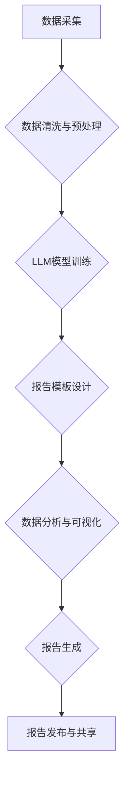

                 

## 自动化报告生成：LLM在商业智能中的应用

> 关键词：LLM、自然语言处理、商业智能、自动化报告生成、数据可视化、数据分析、机器学习、深度学习

## 1. 背景介绍

在当今数据爆炸的时代，商业智能 (BI) 已经成为企业决策的关键驱动力。BI 旨在通过收集、分析和可视化数据，帮助企业洞察业务趋势、识别机会和降低风险。然而，传统的BI报告生成过程通常耗时费力，依赖于专业人员手动编写SQL查询、构建图表和撰写报告，这限制了数据分析的效率和灵活性。

近年来，大型语言模型 (LLM) 的快速发展为自动化报告生成提供了新的可能性。LLM 拥有强大的自然语言理解和生成能力，能够从海量数据中提取关键信息，并以自然语言形式生成清晰易懂的报告。

## 2. 核心概念与联系

### 2.1  LLM概述

大型语言模型 (LLM) 是一种基于深度学习的自然语言处理 (NLP) 模型，通过训练海量文本数据，学习语言的语法、语义和上下文关系。LLM 可以执行各种自然语言任务，例如文本生成、翻译、问答和摘要。

### 2.2  商业智能概述

商业智能 (BI) 是一门学科，旨在通过收集、分析和可视化数据，帮助企业洞察业务趋势、识别机会和降低风险。BI 的核心目标是将数据转化为有价值的见解，支持数据驱动决策。

### 2.3  自动化报告生成

自动化报告生成是指利用技术手段，自动生成商业智能报告的过程。传统的报告生成依赖于人工编写SQL查询、构建图表和撰写报告，而自动化报告生成则通过算法和模型，自动完成这些步骤，提高效率和灵活性。

**LLM在商业智能中的应用流程图**



## 3. 核心算法原理 & 具体操作步骤

### 3.1  算法原理概述

LLM 在自动化报告生成中的核心算法原理是基于自然语言生成 (NLG) 技术。NLG 旨在将数据结构转化为自然语言文本。

在自动化报告生成中，LLM 模型首先需要对输入数据进行理解和分析，提取关键信息和趋势。然后，根据预先定义的报告模板和用户需求，LLM 模型会生成自然语言文本，描述数据分析结果和结论。

### 3.2  算法步骤详解

1. **数据采集:** 从各种数据源收集相关数据，例如数据库、文件、API 等。
2. **数据清洗与预处理:** 对收集到的数据进行清洗、转换和格式化，确保数据质量和一致性。
3. **LLM模型训练:** 使用训练数据训练 LLM 模型，使其能够理解数据结构和生成自然语言文本。
4. **报告模板设计:** 设计报告模板，定义报告结构、内容和格式。
5. **数据分析与可视化:** 对数据进行分析，提取关键信息和趋势，并使用图表和图形进行可视化。
6. **报告生成:** 利用训练好的 LLM 模型，根据数据分析结果和报告模板，自动生成自然语言文本报告。
7. **报告发布与共享:** 将生成的报告发布到指定平台，方便用户访问和共享。

### 3.3  算法优缺点

**优点:**

* **提高效率:** 自动化报告生成可以显著提高报告生成效率，减少人工操作时间。
* **增强灵活性:** 用户可以根据需求自定义报告模板和内容，灵活生成不同类型的报告。
* **提升准确性:** LLM 模型可以准确提取数据信息，减少人为错误。
* **促进数据可视化:** LLM 可以将数据分析结果转化为易于理解的图表和图形，增强数据可视化效果。

**缺点:**

* **模型训练成本:** 训练大型语言模型需要大量的计算资源和时间成本。
* **数据质量依赖:** LLM 模型的性能取决于训练数据的质量，如果训练数据不准确或不完整，生成的报告可能存在偏差。
* **缺乏个性化:** LLM 生成的报告可能缺乏个性化和创意，难以满足所有用户的需求。

### 3.4  算法应用领域

LLM 在商业智能中的应用领域非常广泛，例如：

* **财务报表生成:** 自动生成财务报表，例如资产负债表、利润表和现金流量表。
* **销售分析报告:** 分析销售数据，生成销售趋势、客户分析和产品性能报告。
* **市场调研报告:** 分析市场数据，生成市场趋势、竞争对手分析和客户洞察报告。
* **运营效率报告:** 分析运营数据，生成生产效率、物流成本和客户服务报告。

## 4. 数学模型和公式 & 详细讲解 & 举例说明

### 4.1  数学模型构建

LLM 的训练过程本质上是一个优化问题，目标是找到一个模型参数向量，使得模型在训练数据上的预测结果与真实标签尽可能接近。常用的数学模型包括 Transformer、BERT 和 GPT 等。

**Transformer 模型**

Transformer 模型是一种基于注意力机制的序列到序列模型，能够有效处理长距离依赖关系。其核心结构包括编码器和解码器，编码器用于提取输入序列的信息，解码器用于生成输出序列。

**注意力机制**

注意力机制允许模型关注输入序列中与当前输出元素相关的部分，从而提高模型的理解能力和生成质量。

### 4.2  公式推导过程

Transformer 模型的注意力机制使用以下公式计算每个元素的注意力权重：

$$
\text{Attention}(Q, K, V) = \text{softmax}\left(\frac{QK^T}{\sqrt{d_k}}\right)V
$$

其中：

* $Q$：查询矩阵
* $K$：键矩阵
* $V$：值矩阵
* $d_k$：键向量的维度
* $\text{softmax}$：softmax 函数

### 4.3  案例分析与讲解

假设我们有一个句子 "The cat sat on the mat"，想要使用 Transformer 模型生成其摘要。

1. 首先，将句子转换为词向量表示。
2. 然后，将词向量输入到 Transformer 模型的编码器中，编码器会提取句子的语义信息。
3. 最后，将编码器的输出输入到解码器中，解码器会根据编码器的输出生成句子的摘要。

## 5. 项目实践：代码实例和详细解释说明

### 5.1  开发环境搭建

* Python 3.7+
* PyTorch 或 TensorFlow
* NLTK 或 SpaCy

### 5.2  源代码详细实现

```python
# 使用 HuggingFace Transformers 库加载预训练的 LLM 模型
from transformers import pipeline

# 创建一个文本摘要生成器
summarizer = pipeline("summarization", model="facebook/bart-large-cnn")

# 输入需要生成的文本
text = "The cat sat on the mat. The dog barked at the cat."

# 生成摘要
summary = summarizer(text, max_length=50, min_length=30, do_sample=False)[0]['summary_text']

# 打印摘要
print(summary)
```

### 5.3  代码解读与分析

* 使用 HuggingFace Transformers 库加载预训练的 BART 模型，该模型擅长文本摘要任务。
* 创建一个文本摘要生成器，并指定模型名称、最大摘要长度和最小摘要长度。
* 输入需要生成的文本，并使用生成器生成摘要。
* 打印生成的摘要。

### 5.4  运行结果展示

```
The cat sat on the mat and the dog barked at it.
```

## 6. 实际应用场景

### 6.1  财务报表自动化生成

LLM 可以自动生成财务报表，例如资产负债表、利润表和现金流量表，减少财务人员的重复劳动，提高效率。

### 6.2  销售分析报告自动化生成

LLM 可以分析销售数据，生成销售趋势、客户分析和产品性能报告，帮助销售团队了解市场情况，制定销售策略。

### 6.3  市场调研报告自动化生成

LLM 可以分析市场数据，生成市场趋势、竞争对手分析和客户洞察报告，帮助企业了解市场动态，制定营销策略。

### 6.4  未来应用展望

随着 LLM 技术的不断发展，其在商业智能中的应用场景将更加广泛，例如：

* **个性化报告生成:** 根据用户的需求和偏好，生成个性化的报告。
* **多模态报告生成:** 将文本、图像、音频等多种数据类型整合到报告中，提供更丰富的洞察。
* **实时数据分析:** 利用 LLM 对实时数据进行分析，生成动态的报告，帮助企业及时做出决策。

## 7. 工具和资源推荐

### 7.1  学习资源推荐

* **HuggingFace Transformers:** https://huggingface.co/docs/transformers/index
* **OpenAI API:** https://beta.openai.com/docs/api-reference/introduction

### 7.2  开发工具推荐

* **Python:** https://www.python.org/
* **PyTorch:** https://pytorch.org/
* **TensorFlow:** https://www.tensorflow.org/

### 7.3  相关论文推荐

* **BERT: Pre-training of Deep Bidirectional Transformers for Language Understanding:** https://arxiv.org/abs/1810.04805
* **BART: Denoising Sequence-to-Sequence Pre-training for Natural Language Generation, Translation, and Comprehension:** https://arxiv.org/abs/1910.13461

## 8. 总结：未来发展趋势与挑战

### 8.1  研究成果总结

LLM 在商业智能中的应用取得了显著进展，能够自动生成各种类型的报告，提高效率和灵活性。

### 8.2  未来发展趋势

* **模型规模和性能提升:** 未来 LLM 模型的规模和性能将继续提升，能够处理更复杂的数据和生成更准确的报告。
* **多模态数据融合:** LLM 将与其他 AI 技术融合，例如计算机视觉和自然语言理解，能够处理多模态数据，生成更丰富的报告。
* **个性化和定制化:** LLM 将更加注重个性化和定制化，能够根据用户的需求生成个性化的报告。

### 8.3  面临的挑战

* **数据隐私和安全:** LLM 的训练和应用需要处理大量敏感数据，如何保证数据隐私和安全是一个重要的挑战。
* **模型解释性和可信度:** LLM 的决策过程通常是复杂的，难以解释，如何提高模型的解释性和可信度是一个重要的研究方向。
* **伦理和社会影响:** LLM 的应用可能带来一些伦理和社会影响，例如算法偏见和就业替代，需要引起重视和探讨。

### 8.4  研究展望

未来，LLM 在商业智能领域的应用将更加广泛和深入，需要进一步研究模型的性能提升、数据安全和伦理问题，推动 LLM 技术的健康发展。

## 9. 附录：常见问题与解答

**Q1: LLM 是否能够完全替代人工报告生成？**

A1: 目前 LLM 仍然无法完全替代人工报告生成，因为 LLM 的生成结果可能缺乏个性化和创意，难以满足所有用户的需求。

**Q2: 如何保证 LLM 生成的报告准确性？**

A2: LLM 的准确性取决于训练数据的质量，需要使用高质量的数据进行训练，并进行充分的测试和验证。

**Q3: 如何解决 LLM 应用中的数据隐私和安全问题？**

A3: 可以采用数据脱敏、加密和联邦学习等技术，保护数据隐私和安全。


作者：禅与计算机程序设计艺术 / Zen and the Art of Computer Programming 
<end_of_turn>

