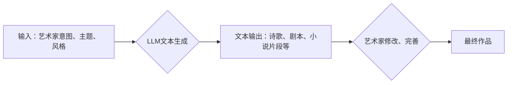

                 

## 艺术创作：LLM 驱动的创新表达

> 关键词：LLM, 艺术创作, 生成模型, 自然语言处理, 深度学习, 创意技术, 人机交互

## 1. 背景介绍

艺术创作一直是人类文明的重要组成部分，它反映了人类对世界和自身的理解，并激发了情感共鸣和精神追求。随着人工智能技术的飞速发展，特别是深度学习和自然语言处理领域的突破，大型语言模型（LLM）的出现为艺术创作带来了新的可能性。LLM 拥有强大的文本生成能力，能够理解和模拟人类的语言表达模式，从而在诗歌、小说、剧本、音乐等多个艺术领域展现出令人惊叹的创造力。

传统的艺术创作往往依赖于艺术家个人的经验、灵感和技巧。而LLM则提供了一种全新的创作工具，它可以帮助艺术家突破思维定式，探索新的表达方式，并更有效地实现创作构思。例如，艺术家可以使用LLM生成不同风格的文本素材，作为创作的灵感来源；也可以利用LLM辅助创作剧本、诗歌等作品，提高创作效率。

## 2. 核心概念与联系

### 2.1  LLM 的核心概念

大型语言模型（LLM）是一种基于深度学习的强大人工智能模型，其核心是训练一个复杂的网络结构，能够理解和生成人类语言。LLM 通过学习海量文本数据，掌握了语言的语法、语义和上下文关系，从而具备了生成文本、翻译语言、回答问题、总结信息等多种能力。

### 2.2  LLM 与艺术创作的联系

LLM 与艺术创作的结合，本质上是将人工智能技术应用于创意领域。LLM 的文本生成能力可以被视为一种新的艺术媒介，它可以帮助艺术家：

* **激发灵感：** LLM 可以根据艺术家提供的关键词或主题，生成各种风格和形式的文本素材，为艺术家提供创作灵感。
* **辅助创作：** LLM 可以帮助艺术家完成文本创作的特定环节，例如生成诗歌、剧本、小说片段等，提高创作效率。
* **探索新形式：** LLM 可以帮助艺术家探索新的艺术形式，例如生成基于文本的视觉艺术、音频艺术等。

### 2.3  LLM 艺术创作流程图



## 3. 核心算法原理 & 具体操作步骤

### 3.1  算法原理概述

LLM 的核心算法是基于 Transformer 架构的深度神经网络。Transformer 模型通过自注意力机制，能够捕捉文本序列中长距离依赖关系，从而实现更准确的文本理解和生成。

LLM 的训练过程是通过大量的文本数据进行监督学习。模型会学习文本数据的语法、语义和上下文关系，并根据这些知识生成新的文本。训练过程中，模型会不断调整自身的参数，以最小化生成文本与真实文本之间的差异。

### 3.2  算法步骤详解

1. **数据预处理:** 将原始文本数据进行清洗、分词、标记等预处理操作，使其能够被模型理解。
2. **模型构建:** 根据 Transformer 架构构建深度神经网络模型，并设置模型参数。
3. **模型训练:** 使用预处理后的文本数据训练模型，通过反向传播算法不断调整模型参数，使其能够生成更准确的文本。
4. **模型评估:** 使用测试数据评估模型的性能，例如计算生成文本与真实文本之间的BLEU分数。
5. **模型部署:** 将训练好的模型部署到实际应用场景中，例如用于文本生成、翻译、问答等任务。

### 3.3  算法优缺点

**优点:**

* **强大的文本生成能力:** LLM 可以生成高质量、流畅的文本，并能够适应不同的写作风格和主题。
* **可扩展性强:** LLM 的模型规模可以根据需要进行调整，从而实现更强大的文本生成能力。
* **通用性强:** LLM 可以应用于多种文本生成任务，例如诗歌创作、小说写作、剧本创作等。

**缺点:**

* **训练成本高:** LLM 的训练需要大量的计算资源和时间。
* **数据依赖性强:** LLM 的性能取决于训练数据的质量和数量。
* **缺乏创造力:** LLM 的文本生成能力主要基于对已有数据的学习，缺乏真正的创造力。

### 3.4  算法应用领域

LLM 的应用领域非常广泛，包括：

* **文本生成:** 诗歌、小说、剧本、文章、代码等。
* **机器翻译:** 将一种语言翻译成另一种语言。
* **问答系统:** 回答用户提出的问题。
* **聊天机器人:** 与用户进行自然语言对话。
* **文本摘要:** 生成文本的简短摘要。

## 4. 数学模型和公式 & 详细讲解 & 举例说明

### 4.1  数学模型构建

LLM 的数学模型主要基于 Transformer 架构，其核心是自注意力机制。自注意力机制能够捕捉文本序列中不同词之间的关系，从而实现更准确的文本理解和生成。

### 4.2  公式推导过程

自注意力机制的核心公式是计算每个词与其他词之间的注意力权重。注意力权重表示每个词对其他词的影响程度。

**注意力权重计算公式:**

$$
\text{Attention}(Q, K, V) = \text{softmax}\left(\frac{Q K^T}{\sqrt{d_k}}\right) V
$$

其中：

* $Q$：查询矩阵
* $K$：键矩阵
* $V$：值矩阵
* $d_k$：键向量的维度
* $\text{softmax}$：softmax 函数，用于将注意力权重归一化

### 4.3  案例分析与讲解

假设我们有一个文本序列 "The cat sat on the mat"，我们想要计算每个词与其他词之间的注意力权重。

1. 将文本序列转换为词嵌入向量，每个词都对应一个向量。
2. 将词嵌入向量分别转换为查询矩阵 $Q$、键矩阵 $K$ 和值矩阵 $V$。
3. 使用注意力权重计算公式计算每个词与其他词之间的注意力权重。
4. 将注意力权重与值矩阵相乘，得到每个词的加权平均值，作为该词的上下文表示。

## 5. 项目实践：代码实例和详细解释说明

### 5.1  开发环境搭建

* Python 3.7+
* PyTorch 或 TensorFlow
* CUDA 和 cuDNN (可选，用于 GPU 加速)

### 5.2  源代码详细实现

```python
import torch
import torch.nn as nn

class Attention(nn.Module):
    def __init__(self, d_model, num_heads):
        super(Attention, self).__init__()
        self.d_model = d_model
        self.num_heads = num_heads
        self.head_dim = d_model // num_heads

        self.query = nn.Linear(d_model, d_model)
        self.key = nn.Linear(d_model, d_model)
        self.value = nn.Linear(d_model, d_model)
        self.fc_out = nn.Linear(d_model, d_model)

    def forward(self, query, key, value, mask=None):
        batch_size = query.size(0)

        # Linear projections
        Q = self.query(query).view(batch_size, -1, self.num_heads, self.head_dim).transpose(1, 2)
        K = self.key(key).view(batch_size, -1, self.num_heads, self.head_dim).transpose(1, 2)
        V = self.value(value).view(batch_size, -1, self.num_heads, self.head_dim).transpose(1, 2)

        # Scaled dot-product attention
        scores = torch.matmul(Q, K.transpose(-2, -1)) / torch.sqrt(torch.tensor(self.head_dim, dtype=torch.float))

        if mask is not None:
            scores = scores.masked_fill(mask == 0, -1e9)

        attention_weights = torch.softmax(scores, dim=-1)

        # Weighted sum of values
        context = torch.matmul(attention_weights, V)

        # Concatenate heads and project
        context = context.transpose(1, 2).contiguous().view(batch_size, -1, self.d_model)
        output = self.fc_out(context)

        return output, attention_weights
```

### 5.3  代码解读与分析

这段代码实现了一个基本的自注意力机制模块。

* `__init__` 方法初始化模型参数，包括模型维度 `d_model` 和注意力头数 `num_heads`。
* `forward` 方法实现注意力机制的计算过程，包括线性投影、缩放点积注意力计算、加权求和等步骤。

### 5.4  运行结果展示

运行该代码可以得到每个词与其他词之间的注意力权重，并可视化注意力权重矩阵，观察不同词之间的关系。

## 6. 实际应用场景

### 6.1  诗歌创作

LLM 可以根据用户提供的主题、风格等信息，生成不同风格的诗歌。例如，用户可以输入 "爱情" 和 "浪漫" 作为主题，LLM 可以生成一首浪漫的爱情诗。

### 6.2  小说写作

LLM 可以帮助作家生成小说情节、人物对话、场景描述等，提高写作效率。例如，作家可以使用LLM 生成一个故事梗概，然后根据梗概进行创作。

### 6.3  剧本创作

LLM 可以帮助编剧生成剧本对话、场景描述、人物性格等，加速剧本创作流程。例如，编剧可以使用LLM 生成一个电影剧本的草稿，然后进行修改和完善。

### 6.4  未来应用展望

LLM 在艺术创作领域的应用前景广阔，未来可能出现以下应用场景：

* **个性化艺术创作:** 根据用户的喜好和需求，生成个性化的艺术作品。
* **跨界艺术创作:** 将不同艺术形式结合起来，例如将音乐与绘画、舞蹈与诗歌等进行融合。
* **艺术教育:** 利用LLM辅助艺术教育，帮助学生学习艺术知识和技巧。

## 7. 工具和资源推荐

### 7.1  学习资源推荐

* **书籍:**
    * 《深度学习》 - Ian Goodfellow, Yoshua Bengio, Aaron Courville
    * 《自然语言处理》 - Jurafsky, Martin

* **在线课程:**
    * Coursera: 深度学习 Specialization
    * Stanford CS224N: 自然语言处理与深度学习

### 7.2  开发工具推荐

* **PyTorch:** https://pytorch.org/
* **TensorFlow:** https://www.tensorflow.org/

### 7.3  相关论文推荐

* **Attention Is All You Need:** https://arxiv.org/abs/1706.03762
* **BERT: Pre-training of Deep Bidirectional Transformers for Language Understanding:** https://arxiv.org/abs/1810.04805

## 8. 总结：未来发展趋势与挑战

### 8.1  研究成果总结

LLM 在艺术创作领域取得了显著的成果，能够生成高质量、富有创意的文本作品。

### 8.2  未来发展趋势

* **模型规模和性能的提升:** 未来LLM模型规模将继续扩大，性能将进一步提升，能够生成更复杂、更具创意的艺术作品。
* **多模态艺术创作:** 将LLM与其他模态技术（例如图像、音频、视频）结合，实现多模态艺术创作。
* **个性化艺术创作:** 根据用户的喜好和需求，生成个性化的艺术作品。

### 8.3  面临的挑战

* **创造力的本质:** 如何让LLM真正具备创造力，而不是仅仅模仿已有的作品。
* **伦理问题:** LLM生成的艺术作品的版权归属问题、潜在的偏见和歧视问题等。
* **可解释性:** 如何解释LLM生成的艺术作品背后的逻辑和机制。

### 8.4  研究展望

未来研究将重点关注以下几个方面：

* **探索LLM的创造力:** 研究如何让LLM具备更强的创造力，能够生成更具原创性的艺术作品。
* **解决伦理问题:** 研究如何规范LLM在艺术创作领域的应用，避免潜在的伦理风险。
* **提高LLM的可解释性:** 研究如何解释LLM生成的艺术作品背后的逻辑和机制，使其更易于理解和接受。

## 9. 附录：常见问题与解答

**Q1: LLM生成的艺术作品是否具有艺术价值？**

A1: 这个问题目前还没有一个确切的答案。LLM生成的艺术作品是否具有艺术价值取决于人们对艺术的定义和理解。一些人认为，只要作品能够表达情感、激发共鸣，就具有艺术价值，而另一些人则认为，艺术作品必须具有独创性、思想深度等特点。

**Q2: LLM生成的艺术作品的版权归属问题如何解决？**

A2: 这个问题目前还没有一个统一的解决方案。一些观点认为，LLM生成的艺术作品的版权应该归属于训练模型的数据提供者，而另一些观点则认为，应该归属于使用LLM创作作品的人。

**Q3: LLM在艺术创作领域会取代人类艺术家吗？**

A3: 这是一个值得探讨的话题。LLM可以帮助艺术家提高创作效率，探索新的创作方式，但它并不能完全取代人类艺术家。人类艺术家拥有独特的创造力和情感表达能力，这些是LLM目前无法替代的。


作者：禅与计算机程序设计艺术 / Zen and the Art of Computer Programming 
<end_of_turn>

