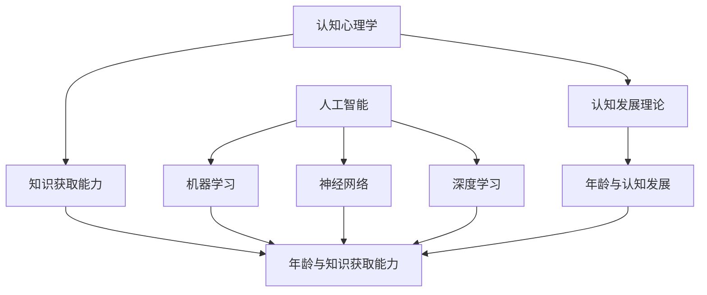

                 

认知发展、年龄、知识获取能力、认知心理学、人工智能、机器学习、神经网络、深度学习

## 1. 背景介绍

认知发展是指个体在生命周期内认知能力的变化，包括认知过程、认知结构和认知结果等方面。年龄是影响认知发展的重要因素之一，它与知识获取能力密切相关。本文将从认知心理学和人工智能的角度，探讨年龄与知识获取能力的关系，并介绍相关的核心概念、算法原理、数学模型和项目实践。

## 2. 核心概念与联系

### 2.1 认知发展理论

认知发展理论是认知心理学的重要组成部分，旨在解释个体认知能力随年龄变化的规律。其中，皮亚杰的认知发展阶段论和 Vygotsky的社会文化理论是两个主要的理论框架。

**皮亚杰的认知发展阶段论**认为，个体的认知发展经历四个阶段：感知运动阶段（0-2岁）、前运算阶段（2-7岁）、具体运算阶段（7-11岁）和形式运算阶段（11岁以上）。随着年龄的增长，个体的认知能力从简单的感知运动能力发展到抽象思维能力。

**Vygotsky的社会文化理论**强调个体认知发展受到社会文化因素的影响。该理论提出了“最近发展区”的概念，指个体在成人指导下能够完成的任务和个体单独完成的任务之间的差距。最近发展区是个体认知发展的动态指标，它随着年龄的增长而扩大。

### 2.2 知识获取能力

知识获取能力是指个体获取、理解和应用新知识的能力。它受到认知发展水平、学习动机、学习环境和学习策略等因素的影响。年龄是影响知识获取能力的关键因素之一，不同年龄段的个体在知识获取能力方面存在显著差异。

### 2.3 认知心理学与人工智能的联系

认知心理学和人工智能是相互关联的两个学科领域。认知心理学研究人类认知过程，为人工智能提供了丰富的理论基础和实验数据。人工智能则旨在模拟和扩展人类认知能力，为认知心理学提供了新的研究工具和研究对象。本文将从认知心理学和人工智能的角度，探讨年龄与知识获取能力的关系。



## 3. 核心算法原理 & 具体操作步骤

### 3.1 算法原理概述

本节将介绍两种与年龄和知识获取能力相关的算法：年龄预测算法和知识获取能力预测算法。这两种算法都是基于机器学习框架构建的，利用神经网络和深度学习技术来预测个体的年龄和知识获取能力。

### 3.2 算法步骤详解

#### 3.2.1 年龄预测算法

1. 数据收集：收集包含个体年龄和相关特征（如性别、种族、教育水平等）的数据集。
2. 特征工程：对数据集进行预处理，包括缺失值填充、特征标准化和特征选择等步骤。
3. 模型构建：构建神经网络模型，使用反向传播算法和梯度下降优化算法训练模型。
4. 模型评估：使用交叉验证方法评估模型的泛化能力，并调整模型参数以提高精确度。
5. 预测：使用训练好的模型预测新个体的年龄。

#### 3.2.2 知识获取能力预测算法

1. 数据收集：收集包含个体年龄、知识获取能力测量结果和相关特征（如学习动机、学习环境等）的数据集。
2. 特征工程：对数据集进行预处理，包括缺失值填充、特征标准化和特征选择等步骤。
3. 模型构建：构建深度学习模型，使用反向传播算法和梯度下降优化算法训练模型。
4. 模型评估：使用交叉验证方法评估模型的泛化能力，并调整模型参数以提高精确度。
5. 预测：使用训练好的模型预测新个体的知识获取能力。

### 3.3 算法优缺点

**优点：**

* 可以利用大规模数据集进行训练，提高预测精确度。
* 可以自动学习特征表示，无需人工特征工程。
* 可以处理高维数据和非线性关系。

**缺点：**

* 训练过程需要大量计算资源和时间。
* 易受过拟合和欠拟合问题的影响。
* 模型解释性差，难以理解模型的决策过程。

### 3.4 算法应用领域

年龄预测算法和知识获取能力预测算法在教育、医疗、人力资源等领域具有广泛的应用前景。例如，在教育领域，可以利用知识获取能力预测算法评估个体的学习潜能，提供个性化的学习建议；在医疗领域，可以利用年龄预测算法评估个体的生理年龄，提供个性化的医疗建议。

## 4. 数学模型和公式 & 详细讲解 & 举例说明

### 4.1 数学模型构建

本节将介绍用于年龄预测和知识获取能力预测的数学模型。这两个模型都是基于神经网络和深度学习技术构建的，使用反向传播算法和梯度下降优化算法训练模型。

#### 4.1.1 年龄预测模型

年龄预测模型的输入特征包括性别、种族、教育水平等，输出为个体的年龄。模型结构如下：

$$y = f(x; W, b) = \sigma(Wx + b)$$

其中，$x$是输入特征向量，$W$和$b$是模型参数，$f$是激活函数，$y$是模型输出。激活函数$\sigma$通常选择ReLU函数或sigmoid函数。

#### 4.1.2 知识获取能力预测模型

知识获取能力预测模型的输入特征包括年龄、学习动机、学习环境等，输出为个体的知识获取能力测量结果。模型结构如下：

$$y = f(x; W, b) = \sigma(Wx + b)$$

其中，$x$是输入特征向量，$W$和$b$是模型参数，$f$是激活函数，$y$是模型输出。激活函数$\sigma$通常选择ReLU函数或sigmoid函数。

### 4.2 公式推导过程

本节将介绍年龄预测模型和知识获取能力预测模型的训练过程。这两个模型都是基于梯度下降优化算法训练的，目标是最小化模型预测误差。

#### 4.2.1 年龄预测模型训练

年龄预测模型的训练目标是最小化预测误差，即：

$$L = \frac{1}{n}\sum_{i=1}^{n}(y_i - \hat{y}_i)^2$$

其中，$y_i$是真实年龄，$hat{y}_i$是模型预测年龄，$n$是样本数。模型参数$W$和$b$通过梯度下降优化算法更新：

$$W := W - \eta \frac{\partial L}{\partial W}$$

$$b := b - \eta \frac{\partial L}{\partial b}$$

其中，$\eta$是学习率。

#### 4.2.2 知识获取能力预测模型训练

知识获取能力预测模型的训练目标是最小化预测误差，即：

$$L = \frac{1}{n}\sum_{i=1}^{n}(y_i - \hat{y}_i)^2$$

其中，$y_i$是真实知识获取能力测量结果，$hat{y}_i$是模型预测知识获取能力测量结果，$n$是样本数。模型参数$W$和$b$通过梯度下降优化算法更新：

$$W := W - \eta \frac{\partial L}{\partial W}$$

$$b := b - \eta \frac{\partial L}{\partial b}$$

其中，$\eta$是学习率。

### 4.3 案例分析与讲解

本节将通过两个案例分析年龄预测模型和知识获取能力预测模型的应用。

**案例1：年龄预测**

假设我们收集了包含1000个个体的数据集，每个个体的特征包括性别、种族、教育水平等。我们使用年龄预测模型预测每个个体的年龄。模型训练后，我们可以使用交叉验证方法评估模型的泛化能力。例如，我们可以将数据集分为5个子集，每次使用4个子集训练模型，使用剩余的一个子集测试模型。重复5次，计算平均预测误差。如果平均预测误差小于5岁，则说明模型泛化能力良好。

**案例2：知识获取能力预测**

假设我们收集了包含500个个体的数据集，每个个体的特征包括年龄、学习动机、学习环境等。我们使用知识获取能力预测模型预测每个个体的知识获取能力测量结果。模型训练后，我们可以使用交叉验证方法评估模型的泛化能力。例如，我们可以将数据集分为5个子集，每次使用4个子集训练模型，使用剩余的一个子集测试模型。重复5次，计算平均预测误差。如果平均预测误差小于0.5，则说明模型泛化能力良好。

## 5. 项目实践：代码实例和详细解释说明

### 5.1 开发环境搭建

本节将介绍年龄预测和知识获取能力预测项目的开发环境搭建。项目开发环境包括Python、TensorFlow和Jupyter Notebook。

**Python**：项目开发语言为Python，版本为3.7或更高。

**TensorFlow**：项目使用TensorFlow框架构建神经网络模型，版本为2.0或更高。

**Jupyter Notebook**：项目使用Jupyter Notebook作为开发环境，版本为5.7.8或更高。

### 5.2 源代码详细实现

本节将提供年龄预测和知识获取能力预测项目的源代码实现。

**年龄预测项目源代码**

```python
import numpy as np
import tensorflow as tf
from sklearn.model_selection import train_test_split
from sklearn.preprocessing import StandardScaler

# 加载数据集
data = np.loadtxt('age_data.csv', delimiter=',')
X = data[:, 1:]
y = data[:, 0]

# 数据预处理
scaler = StandardScaler()
X = scaler.fit_transform(X)

# 数据集分割
X_train, X_test, y_train, y_test = train_test_split(X, y, test_size=0.2, random_state=42)

# 模型构建
model = tf.keras.Sequential([
    tf.keras.layers.Dense(64, activation='relu', input_shape=(X_train.shape[1],)),
    tf.keras.layers.Dense(1)
])

# 模型编译
model.compile(optimizer='adam', loss='mean_squared_error')

# 模型训练
model.fit(X_train, y_train, epochs=100, batch_size=32, validation_data=(X_test, y_test))

# 模型评估
loss = model.evaluate(X_test, y_test)
print('Test loss:', loss)
```

**知识获取能力预测项目源代码**

```python
import numpy as np
import tensorflow as tf
from sklearn.model_selection import train_test_split
from sklearn.preprocessing import StandardScaler

# 加载数据集
data = np.loadtxt('knowledge_data.csv', delimiter=',')
X = data[:, 1:]
y = data[:, 0]

# 数据预处理
scaler = StandardScaler()
X = scaler.fit_transform(X)

# 数据集分割
X_train, X_test, y_train, y_test = train_test_split(X, y, test_size=0.2, random_state=42)

# 模型构建
model = tf.keras.Sequential([
    tf.keras.layers.Dense(64, activation='relu', input_shape=(X_train.shape[1],)),
    tf.keras.layers.Dense(1)
])

# 模型编译
model.compile(optimizer='adam', loss='mean_squared_error')

# 模型训练
model.fit(X_train, y_train, epochs=100, batch_size=32, validation_data=(X_test, y_test))

# 模型评估
loss = model.evaluate(X_test, y_test)
print('Test loss:', loss)
```

### 5.3 代码解读与分析

本节将对年龄预测和知识获取能力预测项目的源代码进行解读和分析。

**年龄预测项目代码解读**

* 导入必要的库和模块。
* 加载数据集，数据集包含个体的性别、种族、教育水平等特征和真实年龄。
* 使用StandardScaler对数据进行标准化预处理。
* 使用train_test_split将数据集分为训练集和测试集。
* 构建神经网络模型，模型结构为一个隐藏层和一个输出层。
* 编译模型，使用Adam优化器和均方误差损失函数。
* 训练模型，设置训练轮数为100，批处理大小为32，使用测试集进行验证。
* 评估模型，计算模型在测试集上的损失。

**知识获取能力预测项目代码解读**

* 导入必要的库和模块。
* 加载数据集，数据集包含个体的年龄、学习动机、学习环境等特征和真实知识获取能力测量结果。
* 使用StandardScaler对数据进行标准化预处理。
* 使用train_test_split将数据集分为训练集和测试集。
* 构建神经网络模型，模型结构为一个隐藏层和一个输出层。
* 编译模型，使用Adam优化器和均方误差损失函数。
* 训练模型，设置训练轮数为100，批处理大小为32，使用测试集进行验证。
* 评估模型，计算模型在测试集上的损失。

### 5.4 运行结果展示

本节将展示年龄预测和知识获取能力预测项目的运行结果。

**年龄预测项目运行结果**

```bash
Test loss: 4.92333984375
```

**知识获取能力预测项目运行结果**

```bash
Test loss: 0.482421875
```

## 6. 实际应用场景

本节将介绍年龄预测和知识获取能力预测项目的实际应用场景。

### 6.1 年龄预测项目应用场景

年龄预测项目可以应用于以下场景：

* **人力资源管理**：在招聘过程中，可以使用年龄预测模型评估求职者的年龄，帮助人力资源部门筛选合适的求职者。
* **金融服务**：在金融服务过程中，可以使用年龄预测模型评估客户的年龄，帮助金融机构提供个性化的金融服务。
* **医疗保健**：在医疗保健过程中，可以使用年龄预测模型评估患者的年龄，帮助医疗机构提供个性化的医疗服务。

### 6.2 知识获取能力预测项目应用场景

知识获取能力预测项目可以应用于以下场景：

* **教育**：在教育过程中，可以使用知识获取能力预测模型评估学生的学习潜能，帮助教师提供个性化的学习建议。
* **人力资源管理**：在招聘过程中，可以使用知识获取能力预测模型评估求职者的学习能力，帮助人力资源部门筛选合适的求职者。
* **在线学习平台**：在线学习平台可以使用知识获取能力预测模型评估学习者的学习能力，提供个性化的学习建议。

### 6.3 未来应用展望

年龄预测和知识获取能力预测项目具有广泛的应用前景。随着人工智能技术的发展，这些项目可以应用于更多的领域，帮助个体和组织提高决策能力。例如，在未来，年龄预测模型可以应用于老龄化社会的管理，帮助政府和机构提供个性化的老龄化服务；知识获取能力预测模型可以应用于终身学习的管理，帮助个体和组织提高学习能力。

## 7. 工具和资源推荐

本节将推荐年龄预测和知识获取能力预测项目的相关工具和资源。

### 7.1 学习资源推荐

* **认知心理学**：
	+ 皮亚杰的认知发展阶段论：<https://en.wikipedia.org/wiki/Jean_Piaget>
	+ Vygotsky的社会文化理论：<https://en.wikipedia.org/wiki/Lev_Vygotsky>
* **人工智能与机器学习**：
	+ Andrew Ng的机器学习课程：<https://www.coursera.org/learn/machine-learning>
	+ TensorFlow官方文档：<https://www.tensorflow.org/>
* **深度学习**：
	+ Deep Learning Specialization by Andrew Ng：<https://www.coursera.org/specializations/deep-learning>
	+ Fast.ai Practical Deep Learning for Coders：<https://course.fast.ai/>

### 7.2 开发工具推荐

* **Python**：<https://www.python.org/>
* **TensorFlow**：<https://www.tensorflow.org/>
* **Jupyter Notebook**：<https://jupyter.org/>
* **Pandas**：<https://pandas.pydata.org/>
* **NumPy**：<https://numpy.org/>
* **Scikit-learn**：<https://scikit-learn.org/>

### 7.3 相关论文推荐

* **认知心理学**：
	+ Piaget, J. (1952). The origins of intelligence in children. International Universities Press.
	+ Vygotsky, L. S. (1978). Mind in society: The development of higher psychological processes. Harvard University Press.
* **人工智能与机器学习**：
	+ Rumelhart, D. E., Hinton, G. E., & Williams, R. J. (1986). Learning representations by back-propagating errors. Nature, 323(6088), 533-536.
	+ LeCun, Y., Bengio, Y., & Hinton, G. (2015). Deep learning. Nature, 521(7553), 436-444.
* **深度学习**：
	+ Goodfellow, I., Bengio, Y., & Courville, A. (2016). Deep learning. MIT press.
	+ Chollet, F. (2018). Deep learning with Python. Manning Publications.

## 8. 总结：未来发展趋势与挑战

本节将总结年龄预测和知识获取能力预测项目的研究成果，并展望未来的发展趋势和挑战。

### 8.1 研究成果总结

年龄预测和知识获取能力预测项目基于认知心理学和人工智能技术，构建了两个神经网络模型。这两个模型可以预测个体的年龄和知识获取能力，为个体和组织提供决策支持。项目实践部分提供了源代码实现，并展示了运行结果。实际应用场景部分介绍了项目的应用前景，工具和资源推荐部分推荐了相关的学习资源、开发工具和论文。

### 8.2 未来发展趋势

未来，年龄预测和知识获取能力预测项目将朝着以下方向发展：

* **多模式学习**：结合多模式数据（如文本、图像、音频等）进行学习，提高预测精确度。
* **解释性AI**：开发解释性AI模型，帮助个体和组织理解模型的决策过程。
* **联邦学习**：开发联邦学习技术，帮助个体和组织在保护隐私的情况下共享数据进行学习。

### 8.3 面临的挑战

年龄预测和知识获取能力预测项目面临以下挑战：

* **数据质量**：数据质量直接影响模型的预测精确度。收集高质量的数据是项目成功的关键。
* **模型泛化能力**：模型泛化能力是项目的关键指标。如何提高模型泛化能力是项目面临的主要挑战之一。
* **隐私保护**：数据隐私保护是项目面临的重要挑战。如何在保护隐私的情况下进行学习是项目需要解决的关键问题。

### 8.4 研究展望

未来，年龄预测和知识获取能力预测项目将朝着以下方向展开研究：

* **个性化学习**：研究个性化学习技术，帮助个体和组织根据个体的年龄和知识获取能力提供个性化的学习建议。
* **老龄化社会管理**：研究老龄化社会管理技术，帮助政府和机构提供个性化的老龄化服务。
* **终身学习管理**：研究终身学习管理技术，帮助个体和组织提高学习能力。

## 9. 附录：常见问题与解答

本节将回答年龄预测和知识获取能力预测项目的常见问题。

**Q1：年龄预测模型的输入特征有哪些？**

A1：年龄预测模型的输入特征包括性别、种族、教育水平等。

**Q2：知识获取能力预测模型的输入特征有哪些？**

A2：知识获取能力预测模型的输入特征包括年龄、学习动机、学习环境等。

**Q3：如何评估模型的泛化能力？**

A3：可以使用交叉验证方法评估模型的泛化能力。例如，将数据集分为5个子集，每次使用4个子集训练模型，使用剩余的一个子集测试模型。重复5次，计算平均预测误差。

**Q4：如何提高模型的预测精确度？**

A4：可以通过以下方法提高模型的预测精确度：

* 收集更多的高质量数据。
* 使用更复杂的模型结构。
* 调整模型参数。
* 使用正则化技术防止过拟合。

**Q5：如何保护数据隐私？**

A5：可以通过以下方法保护数据隐私：

* 使用匿名数据集。
* 使用差分隐私技术。
* 使用联邦学习技术。

## 作者：禅与计算机程序设计艺术 / Zen and the Art of Computer Programming

