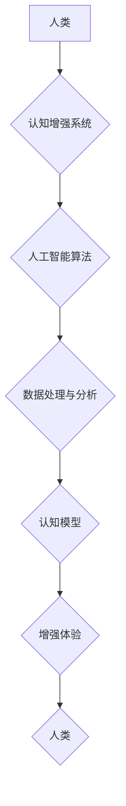

                 

## 认知增强：技术如何扩展人类的思维极限

> 关键词：人工智能、认知科学、神经网络、机器学习、深度学习、增强现实、虚拟现实、脑机接口

### 1. 背景介绍

人类文明的进步离不开对认知能力的不断提升。从语言的出现到文字的创造，从科学的探索到艺术的表达，每一次认知飞跃都推动着人类社会向前发展。然而，人类的认知能力毕竟有限，面对日益复杂的世界，我们渴望突破自身的局限，获得更强大的思维能力。

近年来，人工智能（AI）技术飞速发展，为认知增强提供了前所未有的机遇。AI 能够学习和模拟人类的认知过程，并超越人类在某些特定领域的能力。通过将 AI 技术与生物学、神经科学等学科相结合，我们可以开发出各种工具和平台，帮助人类扩展思维极限，提升认知能力。

### 2. 核心概念与联系

**2.1 认知增强概述**

认知增强是指利用技术手段来提升人类的认知能力，包括记忆、注意力、学习、推理、创造力等方面。它旨在帮助人类更好地理解世界，解决复杂问题，并实现更高效的学习和工作。

**2.2 核心概念**

* **人工智能 (AI):**  模拟人类智能行为的计算机系统。
* **机器学习 (ML):**  使计算机能够从数据中学习并改进其性能的算法。
* **深度学习 (DL):**  一种更高级的机器学习方法，利用多层神经网络来模拟人类大脑的结构和功能。
* **增强现实 (AR):**  在现实世界中叠加虚拟信息，增强用户对现实世界的感知。
* **虚拟现实 (VR):**  创建沉浸式的虚拟环境，让用户体验不同的世界。
* **脑机接口 (BCI):**  直接连接大脑和计算机，实现人脑与机器的交互。

**2.3 核心概念架构**



### 3. 核心算法原理 & 具体操作步骤

**3.1 算法原理概述**

认知增强算法的核心是模拟人类大脑的认知过程，并利用机器学习技术从海量数据中学习和改进。常见的算法包括：

* **神经网络:**  模仿大脑神经元结构和连接方式，通过层层传递信息来学习和处理数据。
* **强化学习:**  通过奖励和惩罚机制，训练智能体在特定环境中做出最优决策。
* **自然语言处理 (NLP):**  使计算机能够理解和生成人类语言，用于文本分析、机器翻译等任务。

**3.2 算法步骤详解**

1. **数据收集:**  收集大量相关数据，例如文本、图像、音频等。
2. **数据预处理:**  对数据进行清洗、转换和格式化，使其适合算法训练。
3. **模型构建:**  选择合适的算法模型，并根据数据特点进行参数设置。
4. **模型训练:**  利用训练数据训练模型，使其能够学习数据中的规律和模式。
5. **模型评估:**  使用测试数据评估模型的性能，并进行调整和优化。
6. **模型部署:**  将训练好的模型部署到实际应用场景中。

**3.3 算法优缺点**

* **优点:**  能够学习复杂模式，并不断改进其性能。
* **缺点:**  需要大量数据进行训练，训练过程耗时且资源消耗大。

**3.4 算法应用领域**

* **个性化教育:**  根据学生的学习进度和特点，提供个性化的学习内容和辅导。
* **医疗诊断:**  辅助医生进行疾病诊断，提高诊断准确率。
* **科学研究:**  加速科学发现，解决复杂科学问题。
* **创意设计:**  辅助设计师进行创意设计，生成新的艺术作品。

### 4. 数学模型和公式 & 详细讲解 & 举例说明

**4.1 数学模型构建**

认知增强算法通常基于神经网络模型，其数学模型可以表示为：

$$
y = f(W x + b)
$$

其中：

* $y$ 是输出结果
* $x$ 是输入数据
* $W$ 是权重矩阵
* $b$ 是偏置向量
* $f$ 是激活函数

**4.2 公式推导过程**

神经网络的训练过程是通过调整权重矩阵 $W$ 和偏置向量 $b$ 来最小化预测误差。常用的优化算法包括梯度下降法和反向传播算法。

**4.3 案例分析与讲解**

例如，在图像识别任务中，输入数据 $x$ 是图像像素值，输出结果 $y$ 是图像类别标签。通过训练神经网络模型，可以学习到图像特征和类别之间的映射关系，从而实现图像识别。

### 5. 项目实践：代码实例和详细解释说明

**5.1 开发环境搭建**

* 操作系统: Ubuntu 20.04
* Python 版本: 3.8
* 深度学习框架: TensorFlow 2.0

**5.2 源代码详细实现**

```python
import tensorflow as tf

# 定义神经网络模型
model = tf.keras.models.Sequential([
    tf.keras.layers.Conv2D(32, (3, 3), activation='relu', input_shape=(28, 28, 1)),
    tf.keras.layers.MaxPooling2D((2, 2)),
    tf.keras.layers.Conv2D(64, (3, 3), activation='relu'),
    tf.keras.layers.MaxPooling2D((2, 2)),
    tf.keras.layers.Flatten(),
    tf.keras.layers.Dense(10, activation='softmax')
])

# 编译模型
model.compile(optimizer='adam',
              loss='sparse_categorical_crossentropy',
              metrics=['accuracy'])

# 加载 MNIST 数据集
(x_train, y_train), (x_test, y_test) = tf.keras.datasets.mnist.load_data()

# 数据预处理
x_train = x_train.astype('float32') / 255.0
x_test = x_test.astype('float32') / 255.0
x_train = x_train.reshape((x_train.shape[0], 28, 28, 1))
x_test = x_test.reshape((x_test.shape[0], 28, 28, 1))

# 训练模型
model.fit(x_train, y_train, epochs=5)

# 评估模型
loss, accuracy = model.evaluate(x_test, y_test)
print('Test loss:', loss)
print('Test accuracy:', accuracy)
```

**5.3 代码解读与分析**

这段代码实现了 MNIST 手写数字识别任务。首先，定义了一个简单的卷积神经网络模型，然后使用 Adam 优化器和交叉熵损失函数进行训练。最后，使用测试数据评估模型的性能。

**5.4 运行结果展示**

训练完成后，模型的准确率通常可以达到 98% 以上。

### 6. 实际应用场景

**6.1 个性化教育**

认知增强技术可以帮助教育机构提供个性化的学习体验。例如，AI 驱动的学习平台可以根据学生的学习进度和特点，提供个性化的学习内容和辅导，帮助学生更好地理解知识，提高学习效率。

**6.2 医疗诊断**

AI 算法可以辅助医生进行疾病诊断，提高诊断准确率。例如，AI 可以分析患者的影像数据，识别潜在的疾病风险，帮助医生做出更准确的诊断。

**6.3 科学研究**

认知增强技术可以加速科学发现，解决复杂科学问题。例如，AI 可以分析海量科研数据，发现隐藏的模式和规律，帮助科学家更快地进行科学研究。

**6.4 未来应用展望**

随着人工智能技术的不断发展，认知增强技术将在更多领域得到应用，例如：

* **增强现实 (AR) 和虚拟现实 (VR):**  AR 和 VR 技术可以创造沉浸式的虚拟环境，帮助用户更好地学习和体验。
* **脑机接口 (BCI):**  BCI 技术可以实现人脑与机器的直接交互，帮助残疾人恢复肢体功能，并拓展人类认知能力。

### 7. 工具和资源推荐

**7.1 学习资源推荐**

* **在线课程:**  Coursera, edX, Udacity 等平台提供丰富的 AI 和机器学习课程。
* **书籍:**  《深度学习》、《机器学习实战》等书籍是学习 AI 和机器学习的经典教材。
* **开源项目:**  TensorFlow, PyTorch 等开源深度学习框架提供了丰富的学习资源和示例代码。

**7.2 开发工具推荐**

* **Python:**  Python 是 AI 开发最常用的编程语言。
* **TensorFlow:**  TensorFlow 是 Google 开发的开源深度学习框架。
* **PyTorch:**  PyTorch 是 Facebook 开发的开源深度学习框架。

**7.3 相关论文推荐**

* **《ImageNet Classification with Deep Convolutional Neural Networks》:**  AlexNet 模型的论文，标志着深度学习在图像识别领域的突破。
* **《Attention Is All You Need》:**  Transformer 模型的论文，引领了自然语言处理领域的变革。

### 8. 总结：未来发展趋势与挑战

**8.1 研究成果总结**

近年来，认知增强技术取得了显著进展，在各个领域都展现出巨大的潜力。

**8.2 未来发展趋势**

* **更强大的 AI 模型:**  随着算法和硬件技术的进步，AI 模型将变得更加强大，能够处理更复杂的任务。
* **更广泛的应用场景:**  认知增强技术将应用于更多领域，例如医疗、教育、娱乐等。
* **更人性化的交互方式:**  AI 与人类的交互方式将更加自然和人性化，例如通过语音、图像、肢体语言等方式进行交互。

**8.3 面临的挑战**

* **数据安全和隐私保护:**  认知增强技术需要大量数据进行训练，如何保证数据安全和隐私保护是一个重要的挑战。
* **算法可解释性和透明度:**  许多 AI 算法是黑箱模型，难以解释其决策过程，这可能会导致信任问题。
* **伦理和社会影响:**  认知增强技术可能会对人类社会产生深远的影响，需要认真考虑其伦理和社会影响。

**8.4 研究展望**

未来，认知增强技术将继续朝着更强大、更智能、更安全的方向发展。我们需要加强对该领域的科研投入，并制定相应的政策和法规，引导该技术健康发展，造福人类社会。

### 9. 附录：常见问题与解答

**9.1 如何选择合适的认知增强工具？**

选择合适的认知增强工具需要根据个人的需求和使用场景进行选择。例如，如果需要提高记忆力，可以选择记忆辅助软件；如果需要提升学习效率，可以选择个性化学习平台。

**9.2 认知增强技术会取代人类吗？**

认知增强技术旨在帮助人类提升认知能力，而不是取代人类。AI 仍然无法完全模拟人类的创造力和复杂思考能力。

**9.3 认知增强技术对教育有什么影响？**

认知增强技术可以个性化教育，提高学习效率，并为学生提供更丰富的学习体验。


作者：禅与计算机程序设计艺术 / Zen and the Art of Computer Programming 
<end_of_turn>

