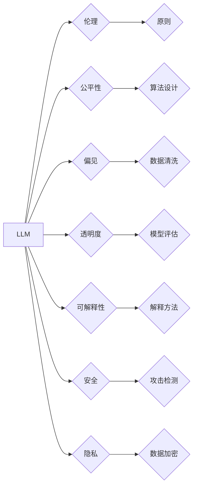

                 

## 负责任的 LLM 开发和部署

> 关键词：大型语言模型 (LLM)、伦理、公平性、偏见、透明度、可解释性、安全、隐私、监管

### 1. 背景介绍

大型语言模型 (LLM) 近年来取得了令人瞩目的进展，展现出强大的文本生成、翻译、摘要和问答能力。这些模型的出现为人工智能领域带来了新的机遇，但也引发了广泛的伦理、社会和安全问题。负责任的 LLM 开发和部署至关重要，以确保这些强大的技术能够造福人类，同时避免潜在的危害。

### 2. 核心概念与联系

**2.1 核心概念**

* **大型语言模型 (LLM):** 训练于海量文本数据上的深度学习模型，能够理解和生成人类语言。
* **伦理:** 指道德原则和价值观，指导我们如何开发和使用技术。
* **公平性:** 指 LLM 的输出结果对所有用户都是公平公正的，不歧视任何群体。
* **偏见:** 指 LLM 在训练数据中学习到的不准确或有偏见的知识，可能导致歧视性或不公平的结果。
* **透明度:** 指 LLM 的决策过程可以被理解和解释。
* **可解释性:** 指能够解释 LLM 的输出结果是如何产生的。
* **安全:** 指 LLM 不被恶意利用，不会造成安全风险。
* **隐私:** 指保护用户数据不被滥用或泄露。

**2.2 架构关系**



### 3. 核心算法原理 & 具体操作步骤

**3.1 算法原理概述**

LLM 通常基于 Transformer 架构，利用自注意力机制学习语言的上下文关系。训练过程包括：

1. 将文本数据转换为数字表示。
2. 将数字表示输入 Transformer 网络进行编码和解码。
3. 使用交叉熵损失函数优化模型参数。

**3.2 算法步骤详解**

1. **数据预处理:** 清洗、格式化和分词文本数据。
2. **词嵌入:** 将单词映射到低维向量空间，捕捉单词之间的语义关系。
3. **Transformer 网络:** 使用多层编码器和解码器结构，通过自注意力机制学习文本的上下文信息。
4. **训练:** 使用交叉熵损失函数和反向传播算法优化模型参数。
5. **评估:** 使用测试集评估模型性能，例如困惑度和BLEU分数。

**3.3 算法优缺点**

* **优点:** 能够处理长文本序列，学习复杂的语言关系，生成高质量的文本。
* **缺点:** 训练成本高，需要大量数据和计算资源，容易受到训练数据中的偏见影响。

**3.4 算法应用领域**

* 文本生成：小说、诗歌、剧本等。
* 机器翻译：将一种语言翻译成另一种语言。
* 文本摘要：生成文本的简短摘要。
* 问答系统：回答用户提出的问题。
* 对话系统：与用户进行自然语言对话。

### 4. 数学模型和公式 & 详细讲解 & 举例说明

**4.1 数学模型构建**

LLM 的核心是 Transformer 网络，其结构由编码器和解码器组成。编码器用于将输入文本序列编码为上下文表示，解码器则根据上下文表示生成输出文本序列。

**4.2 公式推导过程**

Transformer 网络中使用自注意力机制来学习文本的上下文关系。自注意力机制的计算公式如下：

$$
Attention(Q, K, V) = softmax(\frac{QK^T}{\sqrt{d_k}})V
$$

其中：

* $Q$：查询矩阵
* $K$：键矩阵
* $V$：值矩阵
* $d_k$：键向量的维度
* $softmax$：softmax 函数

**4.3 案例分析与讲解**

假设我们有一个句子 "The cat sat on the mat"，将其编码为词向量后，使用自注意力机制计算每个词与其他词之间的注意力权重。例如，"sat" 与 "cat" 的注意力权重较高，因为它们在语义上相关。

### 5. 项目实践：代码实例和详细解释说明

**5.1 开发环境搭建**

使用 Python 语言和深度学习框架 TensorFlow 或 PyTorch 开发 LLM。

**5.2 源代码详细实现**

```python
import tensorflow as tf

# 定义 Transformer 网络结构
class Transformer(tf.keras.Model):
    def __init__(self, vocab_size, embedding_dim, num_heads, num_layers):
        super(Transformer, self).__init__()
        # ...

    def call(self, inputs):
        # ...

# 训练 Transformer 模型
model = Transformer(vocab_size=30000, embedding_dim=128, num_heads=8, num_layers=6)
model.compile(optimizer='adam', loss='sparse_categorical_crossentropy', metrics=['accuracy'])
model.fit(train_data, train_labels, epochs=10)

```

**5.3 代码解读与分析**

代码实现了一个简单的 Transformer 网络结构，包括词嵌入层、多头注意力层、前馈神经网络层和位置编码层。训练过程使用交叉熵损失函数和 Adam 优化器。

**5.4 运行结果展示**

使用训练好的模型生成文本，例如：

```
model.predict(input_sequence)
```

### 6. 实际应用场景

**6.1 文本生成:**

LLM 可以用于生成各种类型的文本，例如小说、诗歌、剧本、新闻报道等。

**6.2 机器翻译:**

LLM 可以用于将一种语言翻译成另一种语言，例如英语翻译成中文。

**6.3 文本摘要:**

LLM 可以用于生成文本的简短摘要，例如会议记录的摘要。

**6.4 未来应用展望:**

LLM 的应用场景还在不断扩展，未来可能用于教育、医疗、法律等领域。

### 7. 工具和资源推荐

**7.1 学习资源推荐:**

* **书籍:** "深度学习" by Ian Goodfellow, Yoshua Bengio, and Aaron Courville
* **课程:** Stanford CS224N: Natural Language Processing with Deep Learning
* **博客:** OpenAI Blog, Google AI Blog

**7.2 开发工具推荐:**

* **TensorFlow:** https://www.tensorflow.org/
* **PyTorch:** https://pytorch.org/
* **Hugging Face Transformers:** https://huggingface.co/transformers/

**7.3 相关论文推荐:**

* "Attention Is All You Need" by Vaswani et al. (2017)
* "BERT: Pre-training of Deep Bidirectional Transformers for Language Understanding" by Devlin et al. (2018)

### 8. 总结：未来发展趋势与挑战

**8.1 研究成果总结:**

LLM 在文本生成、机器翻译、文本摘要等领域取得了显著进展，展现出强大的潜力。

**8.2 未来发展趋势:**

* 更大规模的模型训练
* 更高效的训练算法
* 更强的可解释性和透明度
* 更广泛的应用场景

**8.3 面临的挑战:**

* 训练成本高
* 偏见和歧视问题
* 安全和隐私问题
* 伦理和社会影响

**8.4 研究展望:**

未来研究将集中在解决上述挑战，开发更安全、更公平、更可解释的 LLM，并探索其在更多领域的应用。

### 9. 附录：常见问题与解答

**9.1 如何避免 LLM 的偏见？**

* 使用多样化的训练数据
* 对训练数据进行清洗和去偏见处理
* 开发可解释的 LLM，以便识别和缓解偏见

**9.2 如何确保 LLM 的安全？**

* 使用安全训练数据
* 开发对抗攻击检测机制
* 限制 LLM 的访问权限

**9.3 如何保护用户隐私？**

* 使用数据加密技术
* 遵循隐私保护法规
* 不收集不需要的用户数据


作者：禅与计算机程序设计艺术 / Zen and the Art of Computer Programming 
<end_of_turn>

