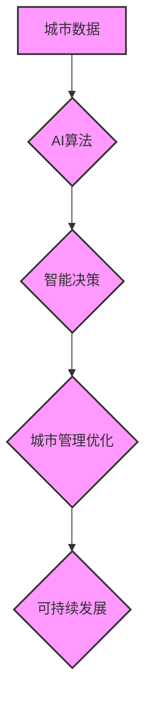

                 

## AI与人类计算：打造可持续发展的城市生活

> 关键词：人工智能、城市计算、可持续发展、数据驱动、智能优化、人类-计算机交互、城市规划、资源管理、环境保护

## 1. 背景介绍

城市化进程的加速和人口增长的持续推动着城市规模的不断扩大，也带来了能源消耗、交通拥堵、环境污染等一系列严峻挑战。传统城市管理模式难以有效应对这些问题，迫切需要引入新的技术手段和理念来构建更加智能、高效、可持续的城市生活。

人工智能（AI）作为一门新兴技术，凭借其强大的数据处理能力、学习能力和决策能力，为城市管理和发展提供了新的机遇。AI技术能够帮助城市收集、分析和利用海量数据，识别城市运行中的问题和趋势，并提出优化解决方案，从而提高城市效率、降低成本、提升居民生活质量。

## 2. 核心概念与联系

**2.1 城市计算与AI融合**

城市计算是指利用计算技术和数据分析手段，对城市运行状态进行实时监测、分析和预测，从而实现城市管理的智能化和优化。AI技术作为城市计算的重要组成部分，能够赋予城市计算更强大的分析能力和决策能力。

**2.2 人类-计算机交互**

在城市计算和AI应用中，人类与计算机的交互至关重要。AI系统需要能够理解人类的需求和意图，并提供清晰、易懂的反馈信息。同时，人类也需要能够参与到AI系统的决策过程中，提供专业知识和经验，以确保AI系统能够做出符合人类利益的决策。

**2.3 可持续发展目标**

城市计算和AI技术应用的目标是实现城市的可持续发展。这意味着需要在经济发展、社会进步和环境保护之间找到平衡点，构建一个更加公平、绿色、宜居的城市环境。

**Mermaid 流程图**



## 3. 核心算法原理 & 具体操作步骤

**3.1 算法原理概述**

城市计算和AI应用中常用的算法包括机器学习、深度学习、强化学习等。这些算法能够帮助城市系统从海量数据中学习模式、预测趋势和做出决策。

**3.2 算法步骤详解**

以机器学习为例，其基本步骤包括：

1. 数据收集和预处理：收集城市运行相关的各种数据，并进行清洗、转换和特征提取等预处理工作。
2. 模型选择：根据具体应用场景选择合适的机器学习模型，例如线性回归、逻辑回归、决策树、支持向量机等。
3. 模型训练：利用训练数据对模型进行训练，调整模型参数，使其能够准确地预测或分类目标变量。
4. 模型评估：利用测试数据对模型进行评估，衡量模型的准确率、召回率、F1-score等指标。
5. 模型部署：将训练好的模型部署到实际应用场景中，用于实时预测或决策。

**3.3 算法优缺点**

**优点：**

* 能够从数据中发现隐藏的模式和趋势。
* 能够自动学习和优化决策规则。
* 能够提高城市管理的效率和准确性。

**缺点：**

* 需要大量的训练数据。
* 模型训练过程可能需要很长时间。
* 模型的解释性和可解释性较差。

**3.4 算法应用领域**

* 交通管理：预测交通流量、优化交通信号灯控制、辅助驾驶决策。
* 能源管理：预测能源需求、优化能源分配、提高能源效率。
* 环境监测：监测空气质量、水质、噪音等环境指标，预警环境污染。
* 公共安全：识别犯罪行为、预测安全风险、辅助执法决策。

## 4. 数学模型和公式 & 详细讲解 & 举例说明

**4.1 数学模型构建**

城市计算和AI应用中常用的数学模型包括线性回归模型、逻辑回归模型、神经网络模型等。这些模型通过数学公式来描述城市系统中变量之间的关系，并利用这些关系进行预测或决策。

**4.2 公式推导过程**

以线性回归模型为例，其目标是找到一条直线，使得这条直线与数据点之间的误差最小。

线性回归模型的数学公式如下：

$$y = mx + c$$

其中：

* $y$ 是预测值
* $x$ 是输入变量
* $m$ 是斜率
* $c$ 是截距

通过最小二乘法，可以求解出 $m$ 和 $c$ 的最佳值。

**4.3 案例分析与讲解**

假设我们想要预测城市交通流量，我们可以收集历史交通流量数据以及相关因素数据，例如时间、日期、天气等。

我们可以使用线性回归模型来建立交通流量预测模型，将时间、日期、天气等因素作为输入变量，将交通流量作为输出变量。

通过训练模型，我们可以得到一个预测公式，用于预测未来某个时间段的交通流量。

## 5. 项目实践：代码实例和详细解释说明

**5.1 开发环境搭建**

* 操作系统：Linux、Windows、macOS
* 编程语言：Python
* 机器学习库：Scikit-learn、TensorFlow、PyTorch
* 数据处理库：Pandas、NumPy

**5.2 源代码详细实现**

```python
import pandas as pd
from sklearn.linear_model import LinearRegression

# 加载数据
data = pd.read_csv('traffic_data.csv')

# 提取特征和目标变量
X = data[['time', 'date', 'weather']]
y = data['traffic_flow']

# 创建线性回归模型
model = LinearRegression()

# 训练模型
model.fit(X, y)

# 预测未来交通流量
future_data = pd.DataFrame({'time': [16, 17, 18], 'date': ['2023-10-27', '2023-10-27', '2023-10-27'], 'weather': ['晴', '晴', '阴']})
predicted_traffic_flow = model.predict(future_data)

# 打印预测结果
print(predicted_traffic_flow)
```

**5.3 代码解读与分析**

* 首先，我们加载交通流量数据，并提取特征和目标变量。
* 然后，我们创建线性回归模型，并使用训练数据训练模型。
* 最后，我们使用训练好的模型预测未来交通流量。

**5.4 运行结果展示**

运行代码后，会输出未来三个时间段的交通流量预测值。

## 6. 实际应用场景

**6.1 交通管理**

* **智能交通信号灯控制:** 利用AI算法分析实时交通流量数据，动态调整信号灯的绿灯时间，优化交通流量，减少拥堵。
* **自动驾驶:** 利用AI算法感知周围环境，辅助驾驶决策，实现自动驾驶功能。
* **交通预测:** 利用AI算法预测未来交通流量，为驾驶员提供导航建议，避免交通拥堵。

**6.2 能源管理**

* **智能电网:** 利用AI算法优化电力调度，提高能源利用效率，降低能源成本。
* **智能建筑:** 利用AI算法控制建筑的供暖、制冷、照明等系统，降低能源消耗。
* **可再生能源预测:** 利用AI算法预测太阳能、风能等可再生能源的输出，提高能源利用效率。

**6.3 环境监测**

* **空气质量监测:** 利用AI算法分析空气质量数据，预警空气污染，提供健康建议。
* **水质监测:** 利用AI算法分析水质数据，监测水污染情况，及时采取措施。
* **噪音监测:** 利用AI算法监测城市噪音水平，识别噪音源，采取措施降低噪音污染。

**6.4 公共安全**

* **犯罪预测:** 利用AI算法分析犯罪数据，预测犯罪高发区域，加强警力部署。
* **人脸识别:** 利用AI算法识别嫌疑人，辅助执法工作。
* **视频监控:** 利用AI算法分析视频监控数据，识别异常行为，提高公共安全。

**6.5 未来应用展望**

随着AI技术的不断发展，其在城市计算和管理中的应用将更加广泛和深入。未来，AI技术将能够帮助城市实现更加智能化、高效化、可持续化的发展。

## 7. 工具和资源推荐

**7.1 学习资源推荐**

* **在线课程:** Coursera、edX、Udacity等平台提供丰富的AI和机器学习课程。
* **书籍:** 《深度学习》、《机器学习实战》、《Python机器学习》等书籍。
* **开源项目:** TensorFlow、PyTorch、Scikit-learn等开源项目。

**7.2 开发工具推荐**

* **编程语言:** Python、R、Java等。
* **机器学习库:** Scikit-learn、TensorFlow、PyTorch等。
* **数据处理库:** Pandas、NumPy等。

**7.3 相关论文推荐**

* **深度学习:** 《ImageNet Classification with Deep Convolutional Neural Networks》
* **机器学习:** 《The Elements of Statistical Learning》
* **城市计算:** 《Smart Cities: Concepts, Technologies, and Applications》

## 8. 总结：未来发展趋势与挑战

**8.1 研究成果总结**

城市计算和AI技术在城市管理和发展中取得了显著成果，例如交通管理、能源管理、环境监测、公共安全等领域都得到了有效提升。

**8.2 未来发展趋势**

* **边缘计算:** 将AI算法部署到边缘设备，实现更快速、更低延迟的决策。
* **联邦学习:** 在不共享原始数据的情况下，训练联合模型，保护数据隐私。
* **多模态学习:** 将不同类型的数据（文本、图像、音频等）融合在一起，提高AI模型的理解能力。

**8.3 面临的挑战**

* **数据隐私保护:** 城市计算和AI应用需要处理大量个人数据，如何保护数据隐私是一个重要的挑战。
* **算法可解释性:** 许多AI算法的决策过程难以理解，如何提高算法的可解释性是一个重要的研究方向。
* **技术伦理:** AI技术的发展需要考虑其伦理影响，例如算法偏见、自动化决策等问题。

**8.4 研究展望**

未来，城市计算和AI技术将继续发展，为城市建设和发展提供更强大的支持。我们需要加强对这些技术的研发和应用，并积极应对其带来的挑战，以实现城市的可持续发展。

## 9. 附录：常见问题与解答

**9.1 如何保证AI算法的公平性？**

AI算法的公平性是一个重要的伦理问题。我们需要确保AI算法不会对特定群体产生歧视，并采取措施减少算法偏见。

**9.2 如何保护城市计算中的数据隐私？**

城市计算需要处理大量个人数据，因此数据隐私保护至关重要。我们可以采用数据加密、匿名化等技术来保护数据隐私。

**9.3 如何提高AI算法的可解释性？**

许多AI算法的决策过程难以理解，因此我们需要提高算法的可解释性。我们可以采用可解释机器学习模型、算法可视化等技术来提高算法的可解释性。


作者：禅与计算机程序设计艺术 / Zen and the Art of Computer Programming 
<end_of_turn>

